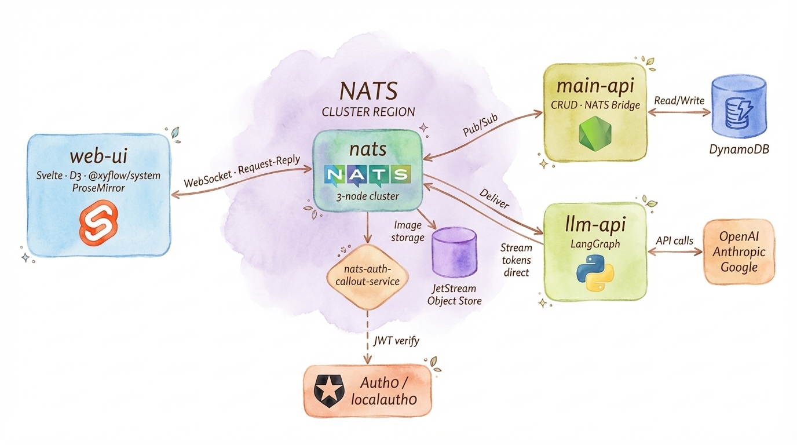
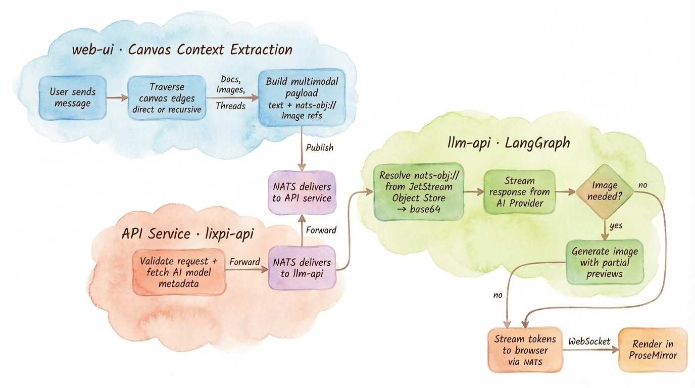
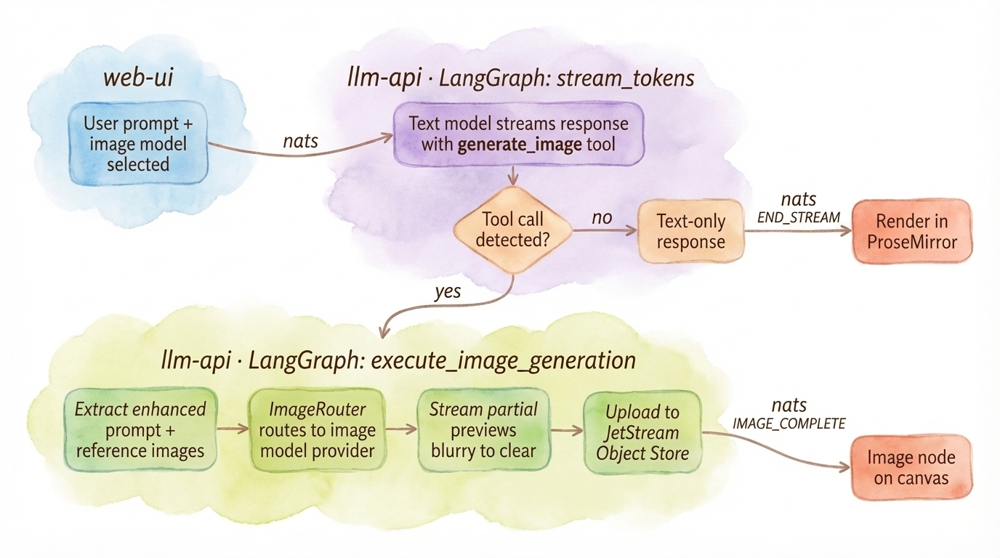

# Lixpi

**A visual, node-based AI workspace for building image and video generation pipelines.**

Lixpi sits at the intersection of an infinite spatial canvas (like Miro) and a visual logic execution pipeline (like n8n). Instead of writing workflow DSLs or using linear chat prompts, you map out ideas spatially — the arrangement of documents, images, and AI chat threads on the canvas directly dictates context, dependencies, and execution.

[Watch the demo →](https://www.dropbox.com/scl/fi/x4xo0j8q6s05muhq9yl42/lix-demo-03.mov?rlkey=m5q87awvieo4apmssue5qel5h&st=rkm1etu1&dl=0)


## What Problem Does It Solve?

Traditional AI tools suffer from **context collapse** — each conversation is isolated, and maintaining consistency across multiple generations (especially images) requires fragile prompt engineering.

Lixpi solves this through **artifact piping**: every AI-generated image becomes a concrete node on the canvas. You draw connections from that node into other AI threads, mechanically guaranteeing that downstream models receive the exact same reference. This makes complex scene creation and strict character consistency reliable — no copy-pasting prompts, no hoping the model "remembers."

**Key capabilities:**
- **Infinite canvas** with document nodes, image nodes, and AI chat thread nodes
- **Directional edges** between nodes define context flow — connect a reference image to multiple threads to reuse it
- **Multi-model support** — switch between OpenAI, Anthropic, and Google models mid-conversation
- **Progressive image streaming** — see partial previews as images generate in real-time
- **Multi-turn image editing** — refine generated images across branching threads

See the [Product Overview](documentation/PRODUCT-OVERVIEW.md) for full details on capabilities and canvas primitives.

---

## How It Works



- **Everything talks through NATS** — browser clients, API service, and LLM service all communicate via the same message bus
- **Web UI connects directly to NATS** via WebSocket, enabling real-time streaming without HTTP polling
- **API Service** handles authentication, business logic, and database operations
- **LLM API Service** streams AI responses directly to clients, bypassing API for lower latency

### AI Chat Data Flow

#### Request Path — From Canvas to AI



1. **Context extraction** (browser): When you hit Send, the web-ui traverses canvas edges — pulling text from connected Document nodes, `nats-obj://` image references from Image nodes, and conversation history from upstream AI Thread nodes — then assembles everything into a multimodal payload.
2. **Publish to NATS**: The browser publishes the payload via WebSocket.
3. **API service** (`lixpi-api`): Validates the request and fetches AI model metadata, then forwards the enriched payload to the LLM API.
4. **LLM processing**: The LLM API resolves `nats-obj://` references from JetStream Object Store into base64, streams the response from the AI provider, and — if image generation is needed — generates an image with progressive partial previews.
5. **Render**: Tokens stream directly to the browser via NATS and render in ProseMirror.

#### Streaming Response — From AI to Canvas



1. **Text streaming**: The LLM API streams the text response from the AI provider. If the model invokes the `generate_image` tool, image generation is triggered; otherwise, tokens stream directly to the browser.
2. **Image generation path**: The ImageRouter routes to the appropriate image model provider, streams partial previews (blurry → clear), and uploads the final image to JetStream Object Store.
3. **Delivery**: Text-only responses arrive via `END_STREAM` and render in ProseMirror. Generated images arrive via `IMAGE_COMPLETE` and appear as image nodes on the canvas. The API service is **not** in this streaming path — tokens flow directly from llm-api → NATS → browser.

For the full architecture deep-dive, see [Architecture](documentation/ARCHITECTURE.md).

---

## Quick Start

### 1. Environment Setup

```bash
# macOS / Linux
./init-config.sh

# Windows
init-config.bat
```

For CI/automation, see [`infrastructure/init-script/README.md`](infrastructure/init-script/README.md).

### 2. Initialize Infrastructure

First-time setup for TLS certificates and DynamoDB tables:

```bash
# macOS / Linux
./init-infrastructure.sh

# Windows (run as Administrator)
init-infrastructure.bat
```

### 3. Start

```bash
# macOS / Linux
./start.sh

# Windows
start.bat
```

---

## Documentation

- [Product Overview](documentation/PRODUCT-OVERVIEW.md) — capabilities, canvas primitives, artifact piping, image generation
- [Architecture](documentation/ARCHITECTURE.md) — system design, NATS messaging, AI chat flow, scalability
- [Development Guide](documentation/DEVELOPMENT.md) — building services, local auth, Pulumi
- [Canvas Engine](documentation/features/CANVAS-ENGINE.md) — rendering, pan/zoom, node interactions
- [Image Generation](documentation/features/IMAGE-GENERATION.md) — streaming, placement, multi-turn editing

---

## Built With

[ProseMirror](https://prosemirror.net) · [CodeMirror](https://codemirror.net) · [NATS](https://nats.io) · [D3](https://d3js.org) · [Svelte](https://svelte.dev) · [LangGraph](https://www.langchain.com/langgraph) · [shadcn-svelte](https://www.shadcn-svelte.com) · [@xyflow/system](https://github.com/xyflow/xyflow) (low-level pan/zoom/coordinate math only — not React Flow or Svelte Flow) · [CSS Loaders](https://cssloaders.github.io/)

