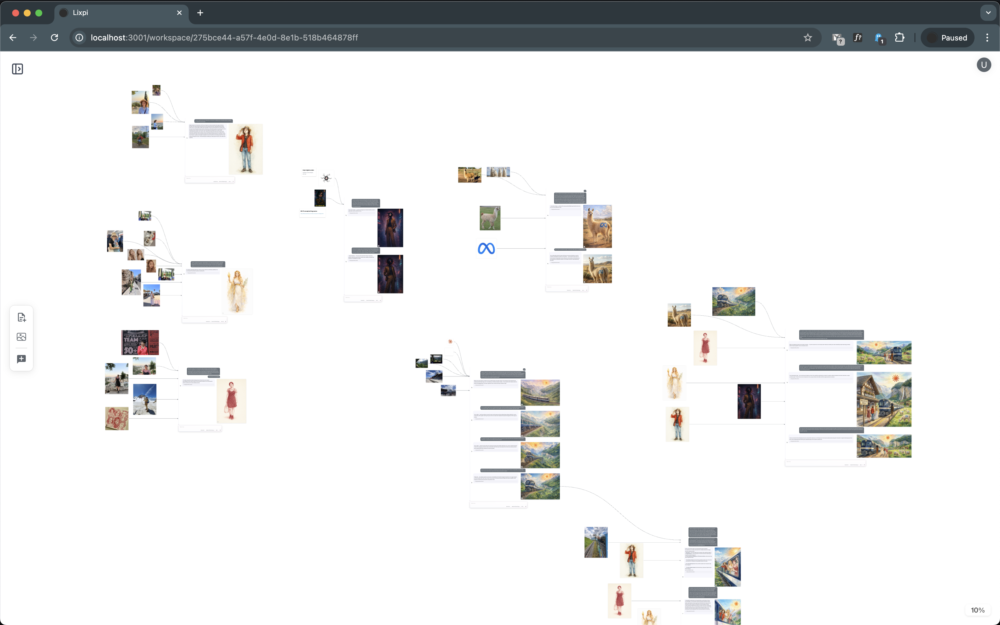
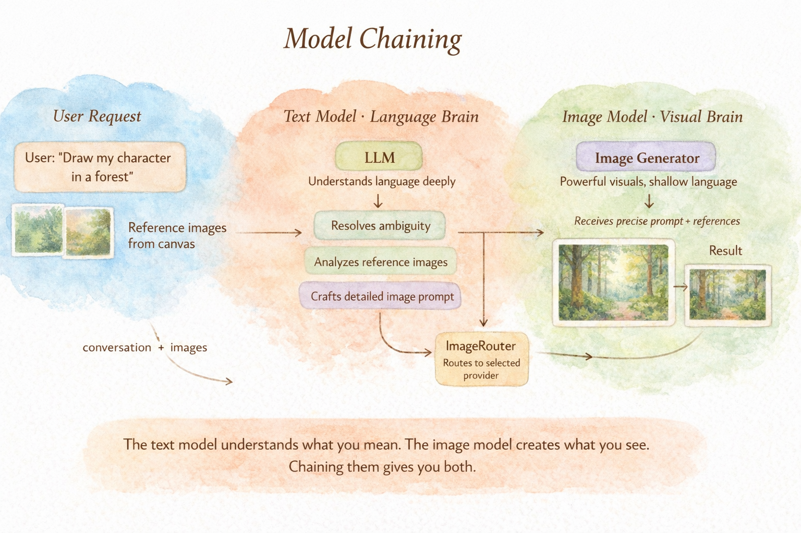
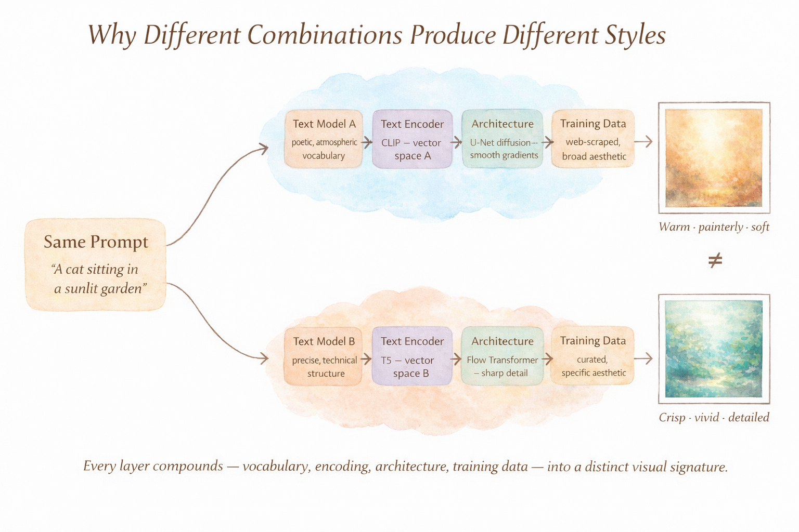

# Lixpi

**A visual, node-based AI workspace for building image and video generation pipelines.**

Lixpi sits at the intersection of an infinite spatial canvas (like Miro) and a visual logic execution pipeline (like n8n). Instead of writing workflow DSLs or using linear chat prompts, you map out ideas spatially — the arrangement of documents, images, and AI chat threads on the canvas directly dictates context, dependencies, and execution.

[Watch the demo →](https://youtu.be/Eee2Ku-Tl_8)



## What Problem Does It Solve?

Traditional AI tools suffer from **context collapse** — each conversation is isolated, and maintaining consistency across multiple generations (especially images) requires fragile prompt engineering.

Lixpi solves this through **artifact piping**: every AI-generated image becomes a concrete node on the canvas. You draw connections from that node into other AI threads, mechanically guaranteeing that downstream models receive the exact same reference. This makes complex scene creation and strict character consistency reliable — no copy-pasting prompts, no hoping the model "remembers."

**Key capabilities:**
- **Infinite canvas** with document nodes, image nodes, and AI chat thread nodes
- **Directional edges** between nodes define context flow — connect a reference image to multiple threads to reuse it
- **Multi-model support** — switch between OpenAI, Anthropic, and Google models mid-conversation
- **Progressive image streaming** — see partial previews as images generate in real-time
- **Multi-turn image editing** — refine generated images across branching threads

See the [Product Overview](documentation/PRODUCT-OVERVIEW.md) for full details on capabilities and canvas primitives.

---

## Model Chaining

Image generation models are bad at understanding language. They struggle with attribute binding ("a red book and a yellow vase" vs "a yellow book and a red vase"), spatial reasoning ("a panda making latte art" vs "latte art of a panda"), negation, counting, and complex multi-part descriptions. This is a well-documented limitation — it's the reason OpenAI built DALL-E 3 natively on ChatGPT, with the LLM automatically rewriting user prompts before they reach the image model. Their own docs confirm it: the mainline text model "will automatically revise your prompt for improved performance."

Lixpi takes this same principle and makes it user-controlled and cross-provider.

Users select a **text model** and an **image model** independently. When a user asks for an image, the text model analyzes the full conversation — including reference images piped in through canvas edges — reasons about what the user actually wants, and writes a detailed image prompt via a `generate_image` tool call. The system intercepts that call, extracts the crafted prompt along with any reference images, and routes everything to the selected image model through the ImageRouter.



The text model has deep language understanding — it resolves ambiguity, maintains context from the conversation, and sees the reference images the user connected. The image model has visual generation capability but shallow language comprehension. Chaining them means the user gets the reasoning of a frontier LLM driving the output of a specialized image generator, without needing to learn prompt engineering for each image model's quirks.

The two models can be from **different providers** — Claude writing prompts for gpt-image-1, GPT-5 for Nano Banana — because the ImageRouter normalizes everything into a standard multimodal format before invoking the image model's own LangGraph workflow.

### Why Different Combinations Produce Different Styles

Each image model learns a different visual distribution — a unique internal representation of what images should look like — shaped by its architecture, training data, and how it interprets text.



**Architecture matters.** Stable Diffusion 1–2 uses a U-Net backbone; Stable Diffusion 3 switched to a Rectified Flow Transformer. DALL-E evolved from an autoregressive Transformer to diffusion conditioned on CLIP embeddings. These structural differences change how the model denoises random noise into an image — affecting texture handling, composition patterns, and the overall character of the output.

**Training data defines aesthetics.** Stable Diffusion trained on LAION-5B — 5 billion web-scraped image-text pairs, filtered to 600 million images scoring ≥5/10 on an aesthetic predictor, sourced from Pinterest, DeviantArt, Flickr, and similar sites. DALL-E and Midjourney use proprietary curated datasets. Midjourney's separate "Niji" model, fine-tuned specifically on anime, is direct proof that training data composition determines visual style. A model can only generate what it has learned to see.

**Text encoding shapes interpretation.** Before generation begins, the text prompt gets converted into vectors by a text encoder — CLIP for Stable Diffusion 1–2, T5 for Stable Diffusion 3 and Google Imagen. These encoders represent the same words in different vector spaces with different semantic emphasis, so the same prompt steers different models through different regions of their latent space.

The text model compounds all of this. Claude, GPT-5, and Gemini write image prompts differently — different compositional emphasis, different descriptive vocabulary, different structural choices. How a scene is described determines which parts of the image model's learned distribution get activated.

The result: pairing Claude with gpt-image-1 produces a genuinely different aesthetic than pairing GPT-5 with Nano Banana. Every component — the text model's prompt style, the text encoder's vector representation, the model architecture, the training data distribution — compounds into a distinct visual signature. This makes model pairing a creative decision, not just a technical one. [More info... →](documentation/knowledge/WHY-DIFFERENT-MODEL-COMBINATIONS-PRODUCE-DIFFERENT-STYLES.md)

---

## Architecture: How It Works


- **Everything talks through NATS** — browser clients and the API service communicate via the same message bus
- **Web UI connects directly to NATS** via WebSocket, enabling real-time streaming without HTTP polling
- **API Service** handles authentication, CRUD, database operations, AND the in-process LangGraph LLM workflow that streams AI responses directly to clients

### AI Chat Data Flow

#### Request Path — From Canvas to AI


1. **Context extraction** (browser): When you hit Send, the web-ui traverses canvas edges — pulling text from connected Document nodes, `nats-obj://` image references from Image nodes, and conversation history from upstream AI Thread nodes — then assembles everything into a multimodal payload.
2. **Publish to NATS**: The browser publishes the payload via WebSocket.
3. **API service** (`lixpi-api`): The NATS handler fetches AI model metadata from DynamoDB, then invokes the LLM module (`services/api/src/llm/`) in-process. The module runs a LangGraph workflow that resolves `nats-obj://` references, streams from the AI provider, and — if image generation is needed — routes to the appropriate image model.
4. **Render**: Tokens stream directly to the browser via NATS (`ai.interaction.chat.receiveMessage.{ws}.{thread}`) and render in ProseMirror.

#### Streaming Response — From AI to Canvas


1. **Text streaming**: The LangGraph workflow streams the text response from the AI provider. If the model invokes the `generate_image` tool, image generation is triggered; otherwise, tokens stream directly to the browser.
2. **Image generation path**: The ImageRouter creates a transient image-model provider (OpenAI gpt-image-*, Google Gemini, Stability), streams partial previews (blurry → clear), and uploads the final image to JetStream Object Store via the in-process `storeWorkspaceImage` helper.
3. **Delivery**: Text-only responses arrive via `END_STREAM` and render in ProseMirror. Generated images arrive via `IMAGE_COMPLETE` and appear as image nodes on the canvas.

For the full architecture deep-dive, see [Architecture](documentation/ARCHITECTURE.md).

---

## Clone this repository

Third-party sources under `packages-vendor/` are **Git submodules** ([shadcn-svelte](https://github.com/huntabyte/shadcn-svelte), [xyflow](https://github.com/xyflow/xyflow)). Clone with submodules so those checkouts exist:

```bash
git clone --recurse-submodules <repository-url>
```

If you already cloned without submodules, initialize them once from the repo root:

```bash
git submodule update --init --recursive
```

---

## Quick Start

### 1. Environment Setup

```bash
# macOS / Linux
./init-config.sh

# Windows
init-config.bat
```

For CI/automation, see [`infrastructure/init-script/README.md`](infrastructure/init-script/README.md).

### 2. Initialize Infrastructure

First-time setup for TLS certificates and DynamoDB tables:

```bash
# macOS / Linux
./init-infrastructure.sh

# Windows (run as Administrator)
init-infrastructure.bat
```

### 3. Start

```bash
# macOS / Linux
./start.sh

# Windows
start.bat
```

---

## Documentation

- [Product Overview](documentation/PRODUCT-OVERVIEW.md) — capabilities, canvas primitives, artifact piping, image generation
- [Architecture](documentation/ARCHITECTURE.md) — system design, NATS messaging, AI chat flow, scalability
- [Development Guide](documentation/DEVELOPMENT.md) — building services, local auth, Pulumi
- [Canvas Engine](documentation/features/CANVAS-ENGINE.md) — rendering, pan/zoom, node interactions
- [Image Generation](documentation/features/IMAGE-GENERATION.md) — streaming, placement, multi-turn editing

---

## Built With

[ProseMirror](https://prosemirror.net) · [CodeMirror](https://codemirror.net) · [NATS](https://nats.io) · [D3](https://d3js.org) · [Svelte](https://svelte.dev) · [LangGraph](https://www.langchain.com/langgraph) · [shadcn-svelte](https://www.shadcn-svelte.com) · [@xyflow/system](https://github.com/xyflow/xyflow) (low-level pan/zoom/coordinate math only — not React Flow or Svelte Flow) · [CSS Loaders](https://cssloaders.github.io/)

