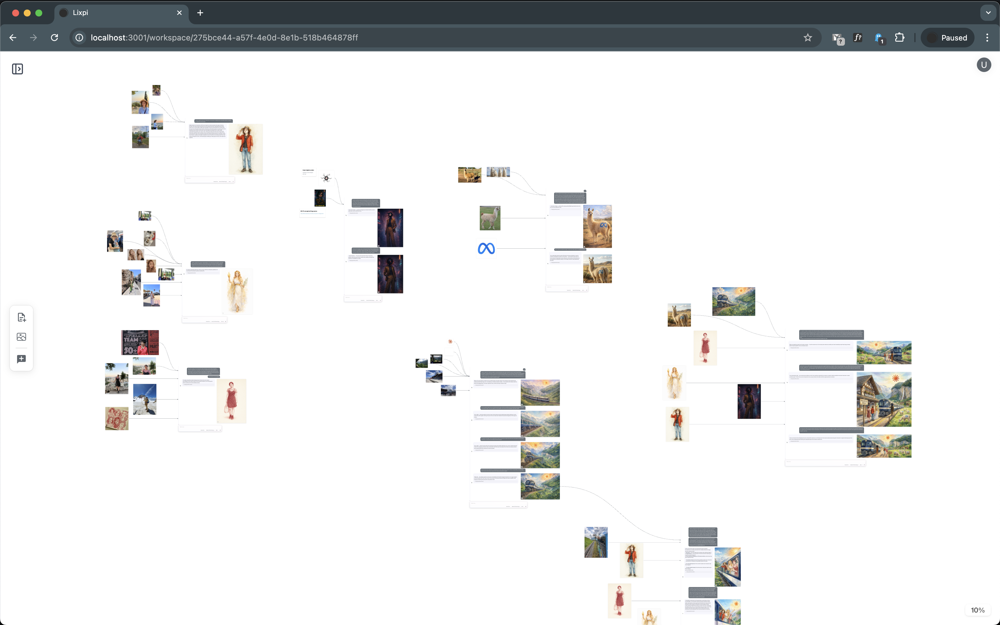
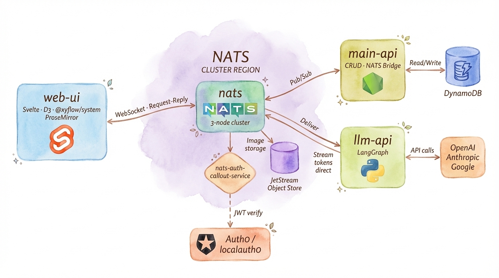

# Lixpi

**A visual, node-based AI workspace for image and video generation pipelines.**

[Watch the demo →](https://youtu.be/Eee2Ku-Tl_8)



Lixpi looks like an AI concept board where an artist runs their entire creative workflow on an infinite canvas. Technically, it's a visual, node-based workflow engine for AI image and video pipelines — the spatial arrangement of nodes *is* the workflow.

A few things make it unusual:

- **Topology is the workflow.** Images, documents, and AI chat threads are nodes; directional edges between them define what feeds into what. Rearranging the canvas rearranges the pipeline.
- **Feature extraction.** A "feature" is any reusable abstraction pulled from one or more reference inputs — a texture, drawing style, stroke pattern, lighting setup, time period, genre, or something abstract like mood or atmosphere. Each feature is stored as a small set of graphic artifacts together with a written skill that tells the model what they encode and how to apply them. Reference them in plain language (`/use loose-watercolor`) inside any prompt and mix freely. Stacking features is what gives character-consistent generation across many scenes — the hard problem text prompts alone cannot solve.
- **Prompt enhancement.** Image and video generation isn't a one-shot call. The prompt first runs through a reasoning model that expands your input into a detailed brief; that brief is what the media model actually receives.

---

## Quick Start

### 1. Clone with submodules

Third-party sources under `packages-vendor/` are Git submodules ([shadcn-svelte](https://github.com/huntabyte/shadcn-svelte), [xyflow](https://github.com/xyflow/xyflow)):

```bash
git clone --recurse-submodules <repository-url>
```

If you already cloned without submodules, initialize them once from the repo root:

```bash
git submodule update --init --recursive
```

### 2. Environment setup

```bash
# macOS / Linux
./init-config.sh

# Windows
init-config.bat
```

For CI/automation, see [`infrastructure/init-script/README.md`](infrastructure/init-script/README.md).

### 3. Initialize infrastructure

First-time setup for TLS certificates and DynamoDB tables:

```bash
# macOS / Linux
./init-infrastructure.sh

# Windows (run as Administrator)
init-infrastructure.bat
```

### 4. Start

```bash
# macOS / Linux
./start.sh

# Windows
start.bat
```

---

## Key Features

### Feature Extraction & Library

Features are first-class library entries that capture the essence of any visual abstraction — painting style, color palette, mood, lighting setup, stroke pattern, character design — extracted from one or more reference inputs (images, documents, threads, or mixes of all three).

Extraction runs as a multi-stage pipeline: scene assessment and routing → parallel per-axis extractors (palette, lighting, character design, line quality, medium signature, composition, mood, texture, etc.) → deterministic source-pixel crops → dominance-weighted synthesis → sample generation → persistence. The result is a reusable entry with structured parameters, a written instruction body, and content-free sample artifacts that preserve the medium without leaking the source subject. Features apply via `/use <name>` in any prompt; the server resolves the reference at send time and injects the instructions and samples as system context — the original reference content is never forwarded to the downstream model.

See [Feature Extraction & Library](documentation/features/FEATURE-EXTRACTION-AND-LIBRARY.md).

### Media Library

A canvas-owned panel for media a user has explicitly chosen to keep. Saved images are independent copies — not bookmarks to a canvas node — so users can reorganize or delete the original canvas image without losing what they saved for reuse. Items are scoped per-workspace, per-user, per-organization, or public; the same panel hosts the extracted Features library.

See [Media Library](documentation/features/MEDIA-LIBRARY.md).

### Image Branch Lineage

Every AI-generated image is a first-class canvas artifact with explicit parentage, branch identity, visual summaries, and resolver audit metadata. When you say "draw a goat in the style of that landscape painting," a structured VLM resolver inspects the labeled candidate images on the canvas and decides which are the subject reference, which are style references, and which are unrelated — without parsing strings or guessing from recency. Pixels make the decision, not regex.

See [Image Branch Lineage](documentation/features/IMAGE-BRANCH-LINEAGE.md).

### Artifact Piping & Character Consistency

Every AI-generated image becomes a concrete canvas node. Draw an edge from that node into other AI threads and downstream models receive the exact same reference — mechanically. No copy-pasting prompts, no hoping the model "remembers." This is what makes strict character and object consistency reliable across many scenes.

### Multi-Model with Prompt Enhancement

Each thread carries independent text-model and image-model selectors. The two can be from **different providers** — Claude writing prompts for gpt-image-1, GPT-5 driving Nano Banana — because the chain runs through an in-process `ImageRouter` that normalizes everything to a standard multimodal format before invoking the image model. Each pairing produces a distinct visual signature: the text model's prompt style, the image model's text encoder, architecture, and training data all compound, which makes model pairing a creative decision rather than a technical one.

See [Model chaining and why different combinations produce different styles](documentation/knowledge/WHY-DIFFERENT-MODEL-COMBINATIONS-PRODUCE-DIFFERENT-STYLES.md).

### Progressive Streaming & Multi-Turn Editing

An animated placeholder appears immediately when generation starts; up to three progressively sharper previews update the canvas node in real time before the final image replaces them. "Edit in New Thread" creates a fresh AI thread pre-linked to the image, carrying provider continuity IDs so the model can make targeted modifications without regenerating from scratch — and the same image can be branched in multiple edit directions simultaneously.

---

## Tech Stack

- **LangGraph** — AI workflow orchestration
- **NATS / NATS JetStream** — messaging backbone for the entire system (end-to-end communication and object storage)
- **PIXI.js, @xyflow/system, D3, Svelte** — infinite canvas UI
- **ProseMirror, CodeMirror** — rich-text editors for AI chat and prompt input
- **DynamoDB** — persistence
- **Pulumi, AWS** — cloud deployment (largely cloud-agnostic today; the plan is to go fully cloud-agnostic by swapping DynamoDB for Cassandra)
- **LLM / media APIs** — OpenAI, Anthropic, Google, Stable Diffusion, Seedance
- **TypeScript** — main language across the project

---

## Architecture: How It Works



- **Everything talks through NATS** — browser clients and backend services share the same message bus.
- **Web UI connects directly to NATS** via WebSocket, enabling real-time streaming without HTTP polling.
- **Main API** handles authentication, CRUD, DynamoDB persistence, and **all LLM orchestration in-process** as a TypeScript LangGraph module — validation, token streaming, image generation, feature extraction, branch resolution, and usage tracking. (Earlier releases ran a separate Python `llm-api` service; that has been absorbed into the main API.)
- **AI tokens stream directly** through per-thread NATS subjects to the browser, so token delivery is not gated by any extra service hop.

For the full architecture deep-dive — including AI chat request/response flow, streaming, scalability via NATS queue groups, and authentication — see [Architecture](documentation/ARCHITECTURE.md). For image generation specifics, see [Image Generation](documentation/features/IMAGE-GENERATION.md).

---

## Documentation

- [Product Overview](documentation/PRODUCT-OVERVIEW.md) — capabilities, canvas primitives, artifact piping, image generation
- [Architecture](documentation/ARCHITECTURE.md) — system design, NATS messaging, AI chat flow, scalability
- [Development Guide](documentation/DEVELOPMENT.md) — building services, local auth, Pulumi
- [Feature Extraction & Library](documentation/features/FEATURE-EXTRACTION-AND-LIBRARY.md)
- [Media Library](documentation/features/MEDIA-LIBRARY.md)
- [Image Branch Lineage](documentation/features/IMAGE-BRANCH-LINEAGE.md)
- [Canvas Engine](documentation/features/CANVAS-ENGINE.md) — rendering, pan/zoom, node interactions
- [Image Generation](documentation/features/IMAGE-GENERATION.md) — streaming, placement, multi-turn editing
- [Why Different Model Combinations Produce Different Styles](documentation/knowledge/WHY-DIFFERENT-MODEL-COMBINATIONS-PRODUCE-DIFFERENT-STYLES.md)
