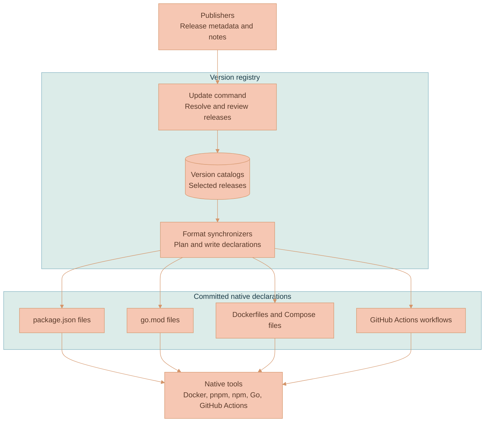

# Dependency Version Registry

This component holds the dependency and tool releases selected for the repository. Its catalogs cover JavaScript packages, Go modules, language runtimes, development tools, container images, workspace package versions, and GitHub Actions. Synchronizers copy those selections into the native files that Docker, pnpm, npm, Go, and GitHub Actions already understand.

The generated native declarations stay committed. A normal `docker build`, `go` command, package-manager command, or GitHub Actions run does not load the registry. The registry is the editing and validation layer that keeps those independent formats consistent.

## What the registry controls

The registry has two command paths. `versions-registry` performs offline synchronization and drift checks. `versions-registry-update` contacts publishers, prepares a release review, and applies reviewed selections through the same synchronizers.

| Layer | Responsibility |
|---|---|
| Publisher metadata | Supplies the newest published version and available release history |
| Version catalogs | Records the exact releases selected for this repository |
| Format synchronizers | Validate each native format and calculate the declarations implied by the catalogs |
| Native declarations | Let each ecosystem operate without a registry-aware wrapper |

The update command does not treat a publisher's newest version as automatically safe. A dry run returns the release material between the selected and proposed versions so an agent can identify migration work. Actual apply repeats that lookup, prints the review, plans every affected native-file change, and refuses to write when required upstream release information is unavailable.

## What belongs in the catalogs

Catalog keys use the dependency's published identity. npm packages use exact package names, Go modules use exact module paths, container images use repository names, Actions use repository names, and tools use their upstream names such as `fnm`, `nex`, and `pulumi`. The surrounding catalog and section already establish that the value is a version, so keys do not add aliases or a `Version` suffix.

Only values that select a release belong here. Unversioned distribution package names such as `curl`, `jq`, `ffmpeg`, and `libreoffice` remain in the Dockerfile where the operating-system distribution and package repository are visible. Application schemas, protocol revisions, deployment identifiers, AI model IDs, provider parameters, and prices remain with the code that defines their compatibility rules.

Catalog values can derive one release from another. For example, Node.js container tags derive from the selected Node.js runtime, and AWS Lambda derives its runtime major from the same value. [Configuration](documentation/CONFIGURATION.md) defines the catalog sections, reference syntax, transforms, and Docker build-argument adapter.

## Why synchronization is strict

The registry discovers `package.json`, `go.mod`, Dockerfiles, root Compose files, and GitHub Actions workflows by format. An unknown package, module, external image, Action, or managed Docker build argument fails synchronization instead of keeping a second untracked version. Dockerfiles must use registered image-reference arguments for external base images, and managed tool installations cannot hardcode their own versions.

Local declarations keep their native meaning. `workspace:`, `file:`, and `link:` package dependencies are not replaced. Local `lixpi/*` Compose images stay local build outputs. Docker build stages can still refer to `scratch`, an earlier stage, or a registered local image argument.

[Architecture](documentation/ARCHITECTURE.md) explains the catalog-to-consumer flow and the dry-run/apply sequence. [Modules and Code Responsibilities](documentation/MODULES.md) maps that behavior to the implementation.

## Reading and changing the registry

| If you need to understand... | Read |
|---|---|
| How catalogs, references, synchronizers, native files, release review, and apply fit together | [Architecture](documentation/ARCHITECTURE.md) |
| Where discovery, reference resolution, format synchronization, publisher lookup, and release-note collection belong | [Modules and Code Responsibilities](documentation/MODULES.md) |
| Which catalog owns a value, how references work, which selectors exist, and what the containers accept | [Configuration](documentation/CONFIGURATION.md) |
| How to list dependencies, dry-run an update, apply it, edit an exact version, check drift, and diagnose failures | [Operations](documentation/OPERATIONS.md) |

All registry commands run through [`docker-compose.versions-registry.yml`](../../docker-compose.versions-registry.yml). CI runs the same offline drift check described in [Operations](documentation/OPERATIONS.md#check-repository-drift). Native Go dependency graph maintenance still uses the [Go Testing and Tooling guide](../../documentation/code-quality/testing/GO.md) after a selected Go requirement changes.
