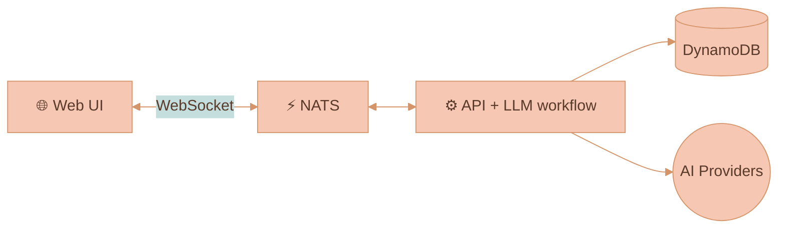
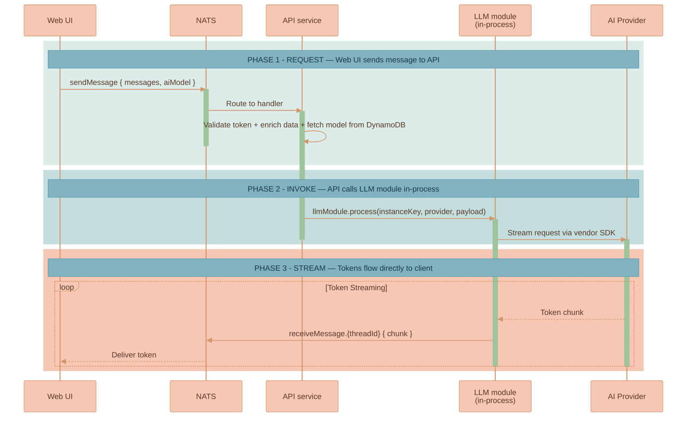
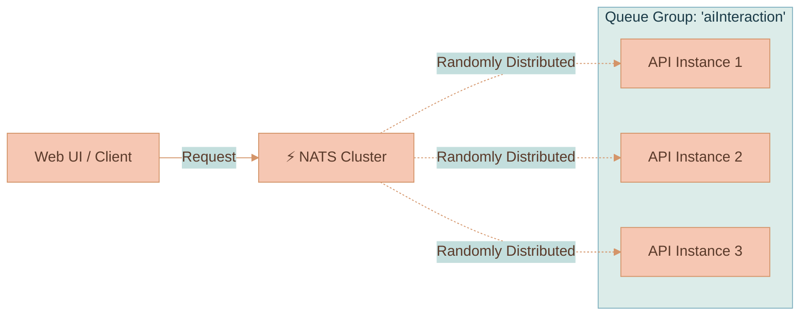
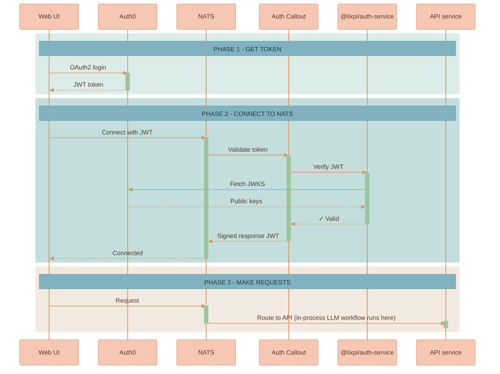
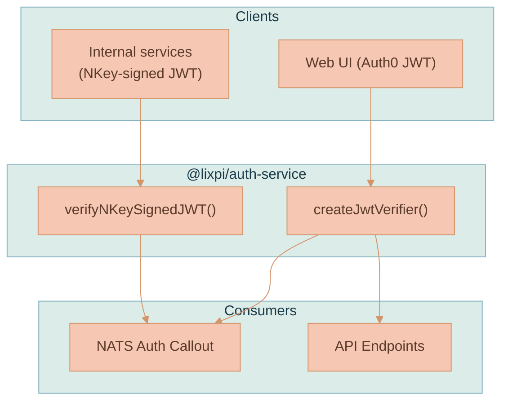

# Lixpi — System Architecture

This document covers the technical internals of Lixpi's architecture. For a high-level overview of how the system works (with diagrams), see the [main README](../README.md).

---

## Services

| Service | Language | Path | Role |
|---------|----------|------|------|
| **web-ui** | Svelte / TypeScript | `services/web-ui/` | Browser SPA — canvas rendering, ProseMirror editors, AI chat UI, context extraction |
| **api** | Node.js / TypeScript | `services/api/` | API service — JWT auth, CRUD, DynamoDB persistence, NATS bridge, **and the in-process LangGraph LLM workflow** at `services/api/src/llm/` (token streaming, image generation, usage tracking) |
| **nats** | Go (3-node cluster) | `services/nats/` | Message bus — pub/sub, request/reply, JetStream Object Store for image storage |
| **localauth0** | Node.js | `services/localauth0/` | Mock Auth0 for zero-config offline development |
| **DynamoDB** | AWS (local via Docker) | — | Document storage, user data, AI model metadata |

Shared TypeScript packages live in `packages/lixpi/`. Infrastructure-as-Code lives in `infrastructure/pulumi/`.

> **Historical note.** LLM orchestration used to live in a separate Python `services/llm-api/` Fargate task using the Python LangGraph package. It was absorbed into `services/api` once `@langchain/langgraph` (TypeScript) reached parity. For the internal-service NATS auth pattern that the Python service used, see [knowledge/INTERNAL-SERVICE-NATS-AUTH-PATTERN.md](knowledge/INTERNAL-SERVICE-NATS-AUTH-PATTERN.md).



---

## NATS as the Communication Backbone

All communication in Lixpi flows through NATS, enabling:

- **End-to-end messaging**: Browser ↔ NATS ↔ Backend services
- **Real-time streaming**: AI token streaming directly to clients
- **Centralized auth**: NATS `auth_callout` delegates authentication to the API service
- **Queue groups**: Automatic load balancing across service instances

### Subject Naming Convention

```
domain.entity.action[.qualifier]

Examples:
  user.get                                                    # Request: Get user data
  document.create                                             # Request: Create document
  ai.interaction.chat.sendMessage                             # Publish: Browser → API
  ai.interaction.chat.receiveMessage.{workspaceId}.{threadId} # Subscribe: LLM workflow → Browser (direct)
```

### Stream Events

The in-process LLM module publishes these events to per-thread NATS subjects (`receiveMessage.{workspaceId}.{threadId}`):

- `START_STREAM` → `STREAMING` chunks → `END_STREAM` for text responses
- `IMAGE_PARTIAL` → `IMAGE_COMPLETE` for images (bypass text pipeline, go directly to canvas renderer)
- `COLLAPSIBLE_START` / `COLLAPSIBLE_END` to wrap `<image_prompt>...</image_prompt>` content emitted by the text model
- A 20-minute circuit breaker timeout prevents runaway requests

### AI Chat Message Sequence



---

## Key Design Decisions

### NATS-Native

The entire system runs through NATS — auth, messaging, file storage (JetStream Object Store), streaming. The browser connects to NATS via WebSocket. The LLM workflow publishes streaming events directly onto per-thread NATS subjects that the browser is already subscribed to, so streaming latency is dominated by the AI provider rather than by Lixpi infrastructure.

### Framework-Agnostic Canvas

The canvas engine (`WorkspaceCanvas.ts`) is pure vanilla TypeScript with zero framework imports. It receives DOM elements and callbacks. Svelte is a thin binding layer. This insulates the canvas logic from framework changes.

### Provider-Agnostic AI

Every AI request sends the full conversation history — no provider-specific session IDs are stored. Users can start a conversation with Claude, switch to GPT, switch to Gemini, and switch back. Adding a new provider means implementing the `BaseProvider` class in `services/api/src/llm/providers/` (a LangGraph 6-node workflow: `validateRequest → streamTokens → [conditional] validateImagePrompt → executeImageGeneration → calculateUsage → cleanup`).

### Client-Side Context Extraction

When a user sends a message, the browser-side `AiChatThreadService` traverses the edge graph, extracts content from connected nodes (documents, images, upstream threads), and assembles the multimodal payload. The API service forwards it without needing to understand the graph structure.

---

## Scalability & Load Balancing

The `api` service is stateless (it now hosts the LLM workflow in-process) and scales horizontally with zero configuration changes.

1. **Service Registration**: A new instance connects to NATS and subscribes to its relevant subjects using a queue group name (e.g., `aiInteraction`).
2. **Automatic Discovery**: NATS immediately recognizes the new subscriber as part of the group.
3. **Load Distribution**: NATS delivers each message to **one** group member, chosen at random.
4. **Fault Tolerance**: If an instance crashes, NATS detects the disconnection and reroutes traffic to the remaining healthy instances.

No routing configuration updates needed — add or remove instances dynamically.

### NATS Queue Groups

Instead of using traditional external load balancers (like Nginx or AWS ALB), we leverage NATS **Queue Groups**. When multiple instances of a service subscribe to the same subject with the same queue group name, NATS automatically distributes messages among them.



**Future split.** If LLM streaming workload grows enough to want deployment isolation from the gateway (so an API deploy doesn't interrupt long-running streams), the LLM module's `getSubscriptions()` surface lets it be hosted by a separate `llm-workers` ECS service running the same Docker image with a different CMD. See [`services/api/src/llm/README.md`](../services/api/src/llm/README.md) for the future-split path.

---

## Authentication & Security

### Authentication Flow



### Authentication Architecture

All token verification is handled by `@lixpi/auth-service`, a shared package used by:
- **NATS Auth Callout** — validates tokens during NATS connection
- **API HTTP endpoints** — validates Bearer tokens on REST calls



### Two Authentication Modes

1. **User Authentication (Auth0/LocalAuth0)**
   - OAuth2 flow with RS256 JWTs
   - JWKS endpoint validation via `@lixpi/auth-service`
   - Permissions derived from subscription configurations

2. **Service Authentication (NKey-signed JWTs)** — see [`knowledge/INTERNAL-SERVICE-NATS-AUTH-PATTERN.md`](knowledge/INTERNAL-SERVICE-NATS-AUTH-PATTERN.md) for the full recipe.
   - For internal services that need to publish/subscribe on NATS without depending on Auth0.
   - Ed25519 cryptographic signatures verified locally.
   - No external Auth0 dependency.
   - The `serviceAuthConfigs` array in `services/api/src/server.ts` is currently empty — register a new entry per service.

**LocalAuth0** provides zero-config offline development — generates RS256 keypairs, issues JWTs matching production Auth0's OAuth flows, and persists state in a Docker volume.

---

## Further Reading

- [Product Overview](PRODUCT-OVERVIEW.md) — capabilities, canvas primitives, artifact piping, image generation
- [Development Guide](DEVELOPMENT.md) — building services, local auth, Pulumi
- [Canvas Engine](features/CANVAS-ENGINE.md) — rendering, pan/zoom, node interaction
- [Image Generation](features/IMAGE-GENERATION.md) — progressive streaming, placement modes, multi-turn editing
- [Workspace Feature](features/WORKSPACE-FEATURE.md) — workspace management and persistence
