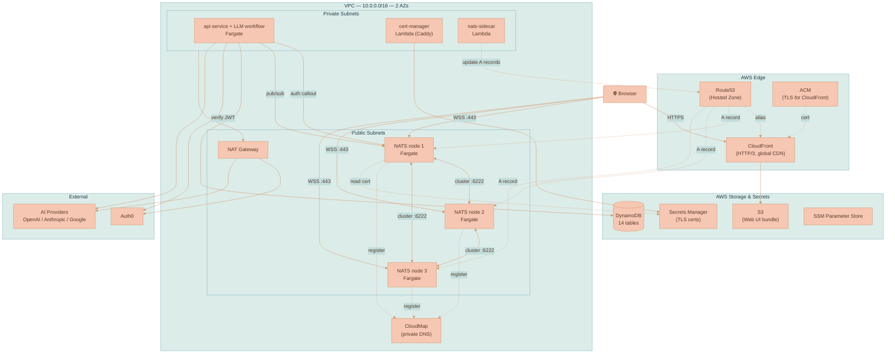
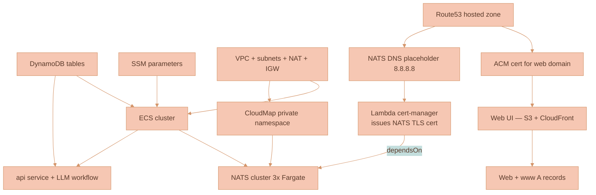
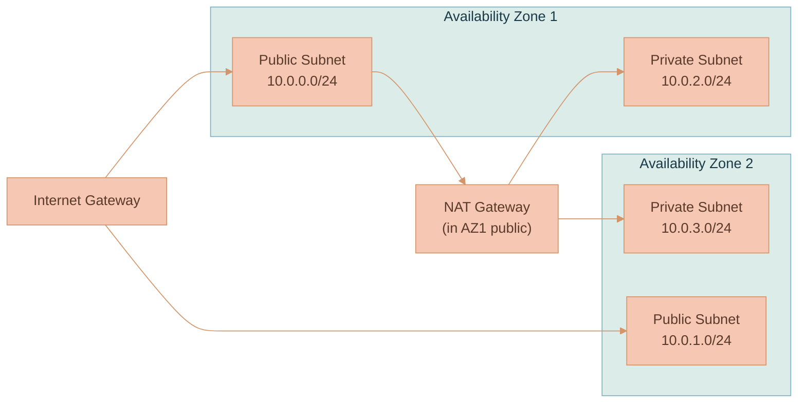
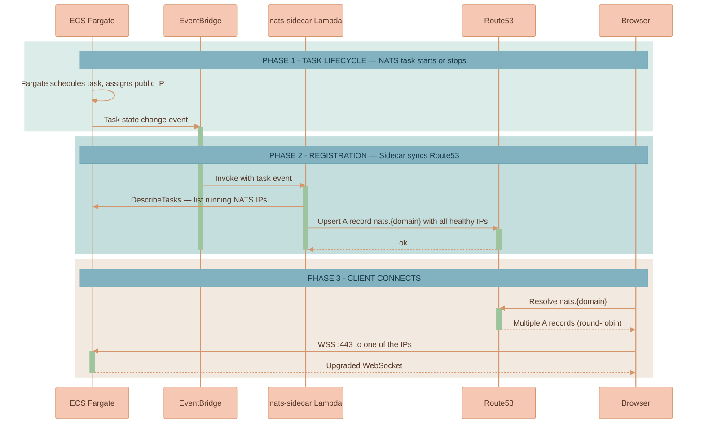
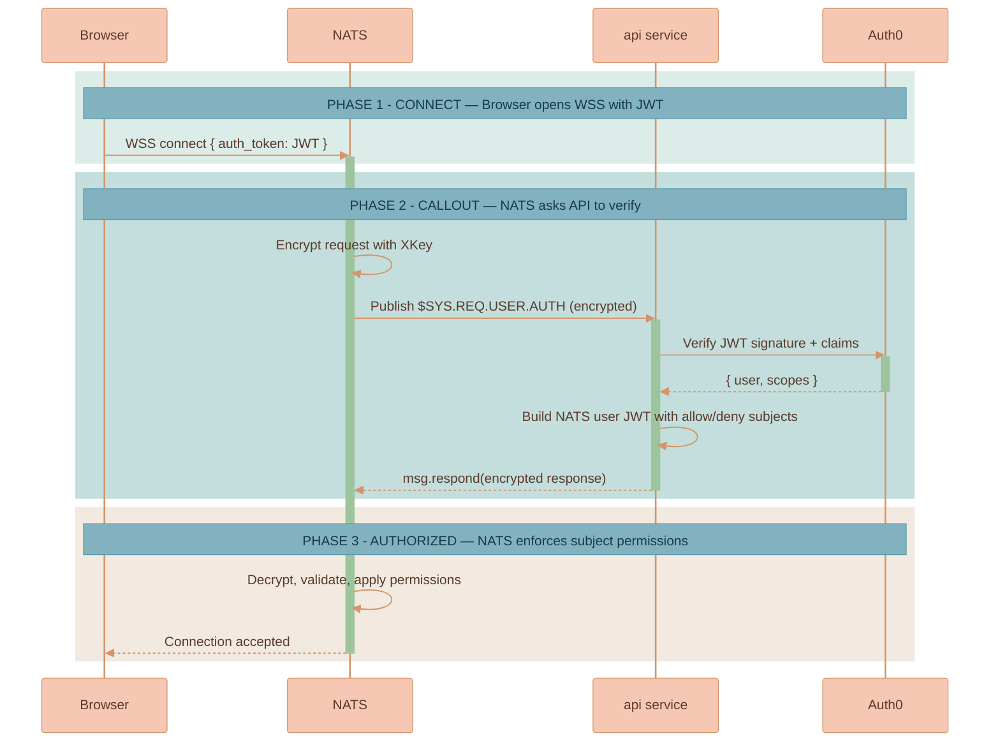
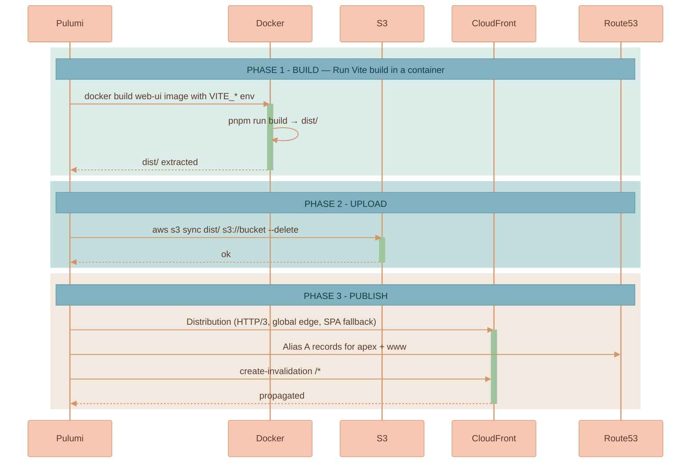
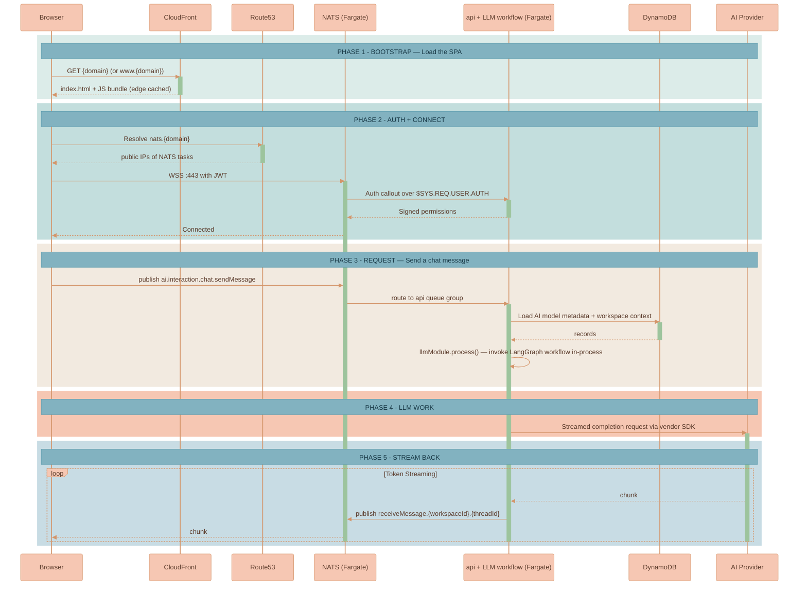
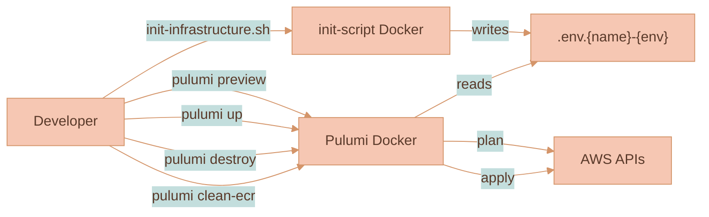

# Infrastructure and AWS Deployment

This document explains how Lixpi is deployed to AWS. It covers how Pulumi provisions the infrastructure, how each service lives inside AWS, how services talk to each other, and how the whole thing scales.

For the runtime architecture and service responsibilities, see [ARCHITECTURE.md](ARCHITECTURE.md). For local development, see [DEVELOPMENT.md](DEVELOPMENT.md).

## Core Concepts

**Pulumi** — Infrastructure-as-Code tool. Lixpi uses the Pulumi **TypeScript** SDK to describe every AWS resource (VPC, ECS, DynamoDB, CloudFront, Route53, Lambda, IAM, ACM, CloudMap). The Pulumi program itself runs inside a Docker container so developers don't need Pulumi installed locally.

**Stack** — A named Pulumi environment (for example `shelby-dev` or `production`). Each stack has its own state and its own AWS resources. One stack = one full copy of Lixpi.

**ECS on Fargate** — AWS's serverless container runtime. Every Lixpi backend service runs as a Fargate task; there are no EC2 instances to manage.

**CloudMap** — AWS service discovery. NATS servers use a **private** CloudMap namespace to find each other inside the VPC, and a Route53 **public** DNS record (managed by a small Lambda sidecar) so browsers can reach them over the internet.

**CloudFront + S3** — The Web UI is a static SPA built into an S3 bucket and served through a global CloudFront distribution.

**NATS auth callout** — Instead of storing NATS user credentials, the API service acts as a live authorization service. NATS asks the API "can this JWT connect?", the API answers, and NATS enforces the answer.

## High-Level AWS Topology



### Component Table

| Component | AWS Resource | Purpose |
|-----------|--------------|---------|
| `web-ui` | S3 + CloudFront | Static SPA served from a global CDN with HTTP/3 |
| `api` | ECS/Fargate (private subnets) | CRUD, auth callout, DynamoDB access, AND in-process LangGraph LLM workflow (token streaming, image generation, vendor SDK egress) |
| `nats` | ECS/Fargate (public subnets, 3 tasks) | Message bus — clients connect directly |
| `cert-manager` | Lambda (Caddy + ACME) | Issues real TLS certs for the NATS domain |
| `nats-sidecar` | Lambda | Watches ECS task IPs and updates Route53 A records |
| `DynamoDB` | 14 tables (on-demand) | Application data, with streams on selected tables |
| `Route53` | Hosted zone | DNS for web UI, API, NATS |
| `ACM` | Certificate | TLS for CloudFront (web UI) |
| `Secrets Manager` | Secrets | Stores NATS TLS certs issued by cert-manager |
| `SSM` | Parameter Store | Cross-stack parameters and config |
| `CloudMap` | Private namespace | Internal NATS cluster discovery |

## Pulumi: How Infrastructure is Described

The Pulumi program lives in [infrastructure/pulumi/src/](../infrastructure/pulumi/src/). The entry point is [pulumiProgram.ts](../infrastructure/pulumi/src/pulumiProgram.ts), which calls resource factories in order.

### Project Layout

```
infrastructure/pulumi/src/
  cli.ts                  # yargs CLI: init | up | preview | destroy | ...
  stackManager.ts         # Wraps @pulumi/pulumi automation API
  workspace.ts            # Pulumi workspace + AWS config
  pulumiProgram.ts        # The actual infra program (top-level orchestrator)
  local-dynamodb-init.ts  # DynamoDB Local bootstrap for dev
  resources/
    network.ts            # VPC, subnets, IGW, NAT, route tables
    ECS-cluster.ts        # Shared Fargate cluster
    NATS-cluster/         # 3-node NATS cluster + service discovery sidecar
    main-api-service.ts   # api service (ECS task) — also hosts the LLM workflow in-process
    web-ui.ts             # S3 + CloudFront distribution
    db/DynamoDB-tables.ts # 14 DynamoDB tables (shared definitions)
    dns-records.ts        # Route53 records + hosted zone
    certificate.ts        # ACM certificate for the web domain
    certificate-manager/  # Lambda-based Caddy TLS issuer for NATS
    SSM-parameters.ts     # Cross-stack SSM parameters
```

### Dockerized Pulumi Runner

Developers never run `pulumi` directly. [infrastructure/pulumi/Dockerfile](../infrastructure/pulumi/Dockerfile) packages the CLI, AWS tools, and Node runtime. The image mounts the repo, reads the `.env.<name>-<environment>` file, and runs a single command:

```bash
# Triggered by the top-level shell scripts
docker run ... lixpi/pulumi up
```

The CLI supports `init`, `up`, `preview`, `destroy`, `force-destroy`, `clean-ecr`, `refresh`, `outputs`, `list-stacks`, `create-stack`, `remove-stack`, `cancel` — see [cli.ts](../infrastructure/pulumi/src/cli.ts).

### Local vs AWS Mode

The program inspects `ENVIRONMENT`. When it's `local`, only the DynamoDB tables are created (against DynamoDB Local through a custom provider), and the program returns early. Everything else — VPC, ECS, NATS, certs, CloudFront — is created only when `ENVIRONMENT !== 'local'`.

```typescript
const DEPLOY_TO_AWS = process.env.ENVIRONMENT !== 'local'
const USE_LOCAL_DYNAMODB = !DEPLOY_TO_AWS
// ... create DynamoDB tables (always)
if (!DEPLOY_TO_AWS) return { dynamoDBtables }
// ... everything else runs only for real AWS stacks
```

### Deployment Order

Pulumi figures out the dependency graph automatically, but the program is written in the order that matches the dependency chain. A few edges are explicit via `dependsOn`:



The explicit `dependsOn` relationship worth highlighting:

- **NATS depends on cert-manager** — NATS must not start until Caddy has written a valid TLS cert to Secrets Manager, otherwise the cluster boots with self-signed certs and browsers reject the WebSocket handshake.

## Network Layout

[network.ts](../infrastructure/pulumi/src/resources/network.ts) builds a classic two-AZ VPC:



| Subnet | CIDR | What runs there |
|--------|------|-----------------|
| Public AZ1 | `10.0.0.0/24` | NATS task, NAT Gateway |
| Public AZ2 | `10.0.1.0/24` | NATS task |
| Private AZ1 | `10.0.2.0/24` | api, Lambdas |
| Private AZ2 | `10.0.3.0/24` | api, Lambdas |

**Why NATS sits in public subnets.** Browsers connect directly to NATS over WebSocket-Secure. Putting NATS tasks in public subnets means each Fargate task gets a routable public IP, and the Lambda sidecar can publish those IPs to Route53.

**Why api sits in private subnets.** It doesn't accept inbound traffic from the internet at all — the only inbound channel is NATS. Outbound traffic (Auth0, OpenAI, Anthropic, Google, Stability) goes through the single NAT Gateway.

## NATS Cluster: The Most Interesting Piece

NATS is where Lixpi makes its boldest design choice: **no load balancer, no API Gateway, browsers connect straight to Fargate tasks over WebSocket-Secure**. The whole thing is glued together by CloudMap, a Lambda sidecar, and a Caddy-based Lambda that owns the TLS certificate lifecycle. See [infrastructure/pulumi/src/resources/NATS-cluster/](../infrastructure/pulumi/src/resources/NATS-cluster/).

### Ports

| Port | Purpose | Exposed to |
|------|---------|------------|
| `4222` | Native NATS client protocol | Internet (TCP) |
| `443` | NATS WebSocket (WSS) | Internet (browsers) |
| `6222` | Cluster routing (gossip) | VPC CIDR only |
| `8222` | HTTP management / `/healthz` | VPC CIDR only |

### Cluster Discovery

Internal node-to-node discovery uses the **private** CloudMap namespace. Each NATS task auto-registers its private IP under `nats.cloudmap.<domain>.internal` with a 10-second TTL and `MULTIVALUE` routing. On boot, every task seeds itself with a single route URL:

```
nats://sys:<password>@nats.cloudmap.<domain>.internal:6222
```

NATS gossip then discovers the other two peers, forming a full mesh.

### Public Client Access

Browsers need a real public DNS name with valid TLS. CloudMap's public namespace would work, but it ties DNS to AWS internals and makes certificate management awkward. Instead, Lixpi uses a **tiny Lambda sidecar** ([nats-service-discovery-sidecar.ts](../infrastructure/pulumi/src/resources/NATS-cluster/nats-service-discovery-sidecar.ts)):



So clients get the same load-balancing behavior as a proper ALB, but with roughly zero latency overhead and no ALB cost.

### TLS for NATS (Caddy in Lambda)

ACM can't issue certs for endpoints that aren't behind an AWS load balancer, so Lixpi runs its own ACME client. [certificate-manager/](../infrastructure/pulumi/src/resources/certificate-manager/) packages **Caddy** inside a Lambda container:

1. Pulumi creates a placeholder A record at `nats.{domain}` pointing at `8.8.8.8` so the domain exists in DNS (required for the ACME DNS-01 challenge).
2. Lambda runs Caddy with the Route53 DNS provider plugin.
3. Caddy talks to Let's Encrypt, solves DNS-01 by creating `_acme-challenge.*` TXT records, gets the cert.
4. The cert and key are written to Secrets Manager under a prefix like `nats-certs-<org>-<stage>`.
5. Each NATS Fargate task pulls the cert from Secrets Manager on boot via `certificate-helper.ts`.

The cert-manager Lambda has a 15-minute timeout and 1 GB of memory — plenty for issuance and renewal, cheap because it runs rarely.

### NATS Auth Callout — The Security Boundary

NATS doesn't store user passwords. Instead, the `api` service **is** the authority: when a browser connects with an Auth0 JWT, NATS asks the API "is this valid, and what can they subscribe to?" See the [NATS cluster README](../infrastructure/pulumi/src/resources/NATS-cluster/README.md) for the full configuration.



A critical detail buried in the code: the API service **must** connect to NATS with `tls://`, not `nats://`. The auth callout reply path uses an internal NATS subject that only trusted (TLS) clients are allowed to publish to. Without TLS, subscriptions work but responses silently fail and browsers time out on connect.

## ECS Services: api

The `api` service follows the standard pattern: a Docker image pushed to ECR, a Fargate task definition, an IAM role scoped to the exact resources it needs, CloudWatch logs, and a security group with zero ingress (it only receives work through NATS).

| Service | CPU | Memory | Subnets | Public IP | Inbound | Scale |
|---------|-----|--------|---------|-----------|---------|-------|
| `api` | 512 | 1024 MB | Private | no | none | 1 task (configurable) |

The CPU/memory baseline is sized to accommodate the in-process LangGraph LLM workflow (token streaming + image generation + vendor SDK egress) that previously ran in the separate `llm-api` Fargate task.

### Why No Load Balancer?

Because there is nothing to route *to*. The service pulls work off NATS subjects using **queue groups**. When you add a second `api` task, it joins the same queue group, NATS starts distributing messages round-robin across both tasks, and no configuration anywhere else needs to change. This is the "NATS as the backbone" design from [ARCHITECTURE.md](ARCHITECTURE.md) taken to its logical conclusion: the load balancer is the message bus.

### Deployment Strategy

The service uses standard rolling deploy settings:

- `deploymentMinimumHealthyPercent: 50` — at least half the desired tasks stay up during a deploy.
- `deploymentMaximumPercent: 200` — ECS may double the task count briefly to swap in new images.
- `deploymentCircuitBreaker.enable: true, rollback: true` — if new tasks fail health checks, ECS rolls back automatically.
- `forceNewDeployment: true` — every `pulumi up` replaces running tasks so new code actually ships.

### IAM Bindings — Principle of Least Privilege

Each service gets a `taskRole` with only the permissions it actually needs:

- `api` — DynamoDB R/W on its bound tables, SSM read, CloudWatch Logs write. AI provider keys (OpenAI, Anthropic, Google, Stability) are passed via env vars; egress to vendor APIs flows through the NAT Gateway.
- `nats` — CloudWatch Logs + Secrets Manager read (for the TLS cert). Nothing else.

> **Historical note.** The previous architecture split AI orchestration into a separate `llm-api` Fargate task with its own narrower IAM role (no DynamoDB) so a compromise of the LLM container couldn't touch user data. After the migration to in-process LangGraph TS, the API container is the trust boundary for both. If that trade-off becomes a concern, the LLM module's `getSubscriptions()` surface lets it be hosted by a separate `llm-workers` ECS service running the same image with a narrower IAM role; the in-process auth callout would register `svc:llm-workers` as a NATS internal service.

## Web UI Deployment

[web-ui.ts](../infrastructure/pulumi/src/resources/web-ui.ts) treats the SPA as static assets, not a running service:



Some things to note:

- **403 and 404 → index.html with 200** — this turns CloudFront into a proper SPA host; client-side routing handles deep links.
- **HTTP/3 + `PriceClass_All`** — edge locations worldwide, with the latest protocol for low-latency connections.
- **`VITE_NATS_SERVER` is baked at build time** — the SPA knows which NATS cluster to connect to from the HTML it was served.

## DynamoDB

[db/DynamoDB-tables.ts](../infrastructure/pulumi/src/resources/db/DynamoDB-tables.ts) defines 14 tables through a single shared table-definition function (`getTableDefinitions()`). The same definitions are reused by [local-dynamodb-init.ts](../infrastructure/pulumi/src/local-dynamodb-init.ts) to bootstrap DynamoDB Local for development, so local and cloud schemas can never drift.

Highlights:

| Table | Hash / Range | Indexes | Notes |
|-------|--------------|---------|-------|
| `USERS` | `userId` | — | |
| `WORKSPACES` / `WORKSPACES_META` | `workspaceId` | — | Split for hot canvas state vs cold meta |
| `WORKSPACES_ACCESS_LIST` | `userId / workspaceId` | LSI on createdAt, updatedAt | |
| `DOCUMENTS` | `documentId / revision` | GSI on `workspaceId`, TTL `revisionExpiresAt` | Versioned documents |
| `AI_CHAT_THREADS` | `workspaceId / threadId` | LSI on createdAt | Threads scoped per workspace |
| `AI_TOKENS_USAGE_TRANSACTIONS` | `userId / transactionProcessedAt` | LSI x4 (document, model, org, formatted date) | Usage ledger |
| `FINANCIAL_TRANSACTIONS` | `userId / transactionId` | LSI on status, createdAt, provider | Billing |
| `AI_MODELS_LIST` | `provider / model` | — | Provider/model registry |

All real-AWS stacks enable DynamoDB **streams** with `NEW_AND_OLD_IMAGES` (skipped only for local DynamoDB). **Deletion protection** is additionally enabled on production stacks only.

## How Services Communicate — End to End

This is the per-request picture for an AI chat message, showing every hop on AWS. It's a concrete version of the abstract diagram in [ARCHITECTURE.md](ARCHITECTURE.md), with the infrastructure pieces filled in.



Two things to note:

1. **Stream tokens flow directly from API to NATS.** The API does the setup work (DynamoDB lookup, context enrichment, auth) then runs the LangGraph workflow in-process and publishes tokens to a subject the browser is already subscribed to. Streaming latency is dominated by the AI provider, not by Lixpi's infrastructure.
2. **Scale-out is drop-in.** Add a second `api` task and NATS starts splitting `ai.interaction.chat.sendMessage` messages between the two workers automatically. No load balancer config to update.

## Scaling and Capacity

### Horizontal Scaling Profile

| Service | Scaling mechanism | Notes |
|---------|-------------------|-------|
| `web-ui` | CloudFront edge cache | No origin scaling needed; global CDN |
| `api` | ECS desired count + NATS queue group `aiInteraction` | Stateless — add tasks freely. Hosts both the gateway logic and the in-process LangGraph LLM workflow. CPU-bound on token streaming. |
| `nats` | App Auto Scaling target (CPU 70%, memory 80%) + ECS desired count | The program provisions `minCount=3, maxCount=3` by default — see "NATS cluster sizing" below |
| `DynamoDB` | On-demand capacity mode (default) | No manual scaling; pay per request |
| `Lambda` (cert-manager, sidecar) | AWS-managed | Short-lived, invoked rarely |

The NATS cluster template already contains a full auto-scaling block (`appautoscaling.Target` + target tracking on CPU 70% / memory 80%) — it's only dormant because `minCount === maxCount` in the default config. Set them to different values in `pulumiProgram.ts` and scaling goes live.

### NATS Cluster Sizing

The default deployment runs **three** Fargate tasks with `256 CPU units / 512 MB` each. That is deliberately modest — it's the smallest valid Fargate shape — and it is more than enough for small-to-medium workloads because NATS is astonishingly efficient:

- The NATS server is a single Go binary that typically uses **under 20 MB of RAM** per node (per [nats.io/about](https://nats.io/about/)).
- A single NATS node can sustain **millions of messages per second with sub-millisecond latencies** on commodity hardware.
- Unlike RabbitMQ, Kafka, or a traditional ALB, message routing in NATS is zero-copy and runs in a single-threaded I/O loop, which means throughput scales linearly with nodes and CPU cores.

### Realistic Traffic Ceiling of the Default Setup

Using published NATS performance characteristics and the default Fargate sizing, a back-of-envelope capacity picture for the default three-node cluster looks like this:

| Dimension | Default setup | Approximate ceiling |
|-----------|---------------|---------------------|
| Concurrent WebSocket clients | 3 nodes × 0.5 vCPU | **10,000–30,000 idle connections** per cluster (connections are cheap in NATS) |
| Messages/sec, cluster total | 3 nodes × 0.5 vCPU | **~500k–1M msgs/sec** for small payloads — far more than any chat workload needs |
| Latency (p50) | Same-region, intra-VPC | **< 1 ms** for NATS itself; end-to-end latency is dominated by the AI provider (seconds) |
| Concurrent in-flight AI streams | 1 × `api` @ 0.5 vCPU | ~25–50 concurrent streams per task; add tasks for more |
| DynamoDB throughput | On-demand | Scales automatically to table-level limits (40k RCU/WCU per table by default) |

In practice the **first bottleneck is `api` CPU** (token streaming parsing in the LangGraph workflow), not NATS. The second is **AI provider rate limits**, not AWS. NATS itself won't be the limiting factor until the cluster is pushed into the hundreds of thousands of simultaneous active users per region.

### Scaling Up for Real Load

If a stack needs to handle higher real-world load, the steps in order of impact are:

1. **Increase `api` desiredCount.** Each new task joins the NATS queue group and picks up work immediately. DynamoDB on-demand absorbs the extra read/write.
2. **Bump NATS task size or count.** Raise `cpu: 256 → 1024`, `memory: 512 → 2048`, and/or set `maxCount > minCount` to turn on auto-scaling. Three nodes is the sweet spot for HA; going beyond five starts to produce diminishing returns for core pub/sub because gossip traffic grows quadratically.
3. **Turn on JetStream replication for critical streams.** JetStream is enabled on the `AUTH` account and already backs the Object Store used for image storage. For higher durability, raise the replica count on streams that matter (R3 across the three cluster nodes) so that a single node failure doesn't drop data.
4. **Split the LLM workflow into a separate `llm-workers` ECS service.** Once `api` task density becomes the deployment bottleneck (an API deploy interrupts long-running streams), use the LLM module's `getSubscriptions()` surface to host the workflow in a dedicated service with separate scaling. See [`services/api/src/llm/README.md`](../services/api/src/llm/README.md).
5. **Add a second region** only when global latency becomes the dominant cost. NATS supports super-clusters and leaf nodes natively, but this is rarely worth the operational overhead before the 100k-MAU mark.

### Failure Modes and Recovery

| Failure | What happens |
|---------|--------------|
| One NATS task dies | ECS replaces it; Lambda sidecar removes the dead IP from Route53; surviving nodes carry traffic via gossip with no client disruption for existing connections in the other two nodes. Browsers reconnect transparently using the remaining A records. |
| AZ2 fails | NATS tasks in AZ1 keep serving traffic. `api` tasks in AZ1 keep running. |
| AZ1 fails | NATS tasks in AZ2 keep serving clients. Private-subnet tasks (`api`, Lambdas) in AZ2 remain healthy but **lose outbound internet egress** because there is only one NAT Gateway and it lives in AZ1. Full multi-AZ egress would require a second NAT Gateway (one per AZ). |
| `api` task dies | NATS queue group re-routes new messages to the surviving task. ECS replaces the dead task within ~60 seconds. Any in-flight LLM streams on the dead task are terminated; the browser sees a circuit-breaker timeout (20 min by default) and the user can retry. |
| Cert-manager Lambda fails | Existing certs keep working until they expire. Alarming on Lambda errors is the remediation path. |
| CloudFront origin S3 unavailable | Edge cache continues serving existing assets. New users hit stale cache until restored. |
| DynamoDB throttle | Retryable errors; `api` handles retries. On-demand mode makes this rare. |

## Environments and Stacks

Every developer and environment has its own full AWS copy — there are no shared environments. A stack is bootstrapped by the init-script ([infrastructure/init-script/](../infrastructure/init-script/)) which:

1. Prompts for a name and environment type (`local`, `dev`, `production`).
2. Generates fresh NATS NKeys + XKeys + passwords using `@nats-io/nkeys`.
3. Writes an `.env.<name>-<environment>` file at the repo root.
4. Optionally writes AWS SSO config.

From there the top-level scripts (`start.sh`, `init-infrastructure.sh`) pick up the env file and run the Pulumi Docker container with the right command.

## Operational Workflow



### Common Commands

| Command | Purpose |
|---------|---------|
| `pulumi preview` | Dry run — show what would change |
| `pulumi up` | Apply changes |
| `pulumi refresh` | Reconcile state with real AWS |
| `pulumi destroy` | Tear down everything in the stack |
| `pulumi force-destroy` | Clean ECR images first, then destroy (ECR repos refuse to delete while they hold images) |
| `pulumi clean-ecr` | Delete all images from the stack's ECR repos |
| `pulumi outputs` | Show stack outputs (endpoint URLs, IDs) |

## Observability

- **CloudWatch Logs** — Every ECS task streams to `/aws/ecs/<service-name>` with retention configured via `CLOUDWATCH_LOG_RETENTION_DAYS`.
- **Container Insights** — Opt-in per stack via `CLOUDWATCH_CONTAINER_INSIGHTS_ENABLED`. When on, ECS publishes CPU/memory/task-count metrics and you get per-task debugging in the console.
- **NATS monitoring** — Every NATS node exposes `/healthz` and `/varz` on port 8222 inside the VPC; the ECS health check uses `/healthz`. For deeper metrics, point the [Prometheus NATS exporter](https://github.com/nats-io/prometheus-nats-exporter) at the same endpoint.
- **DynamoDB metrics** — Native CloudWatch metrics cover throttles, latency, item counts per table.
