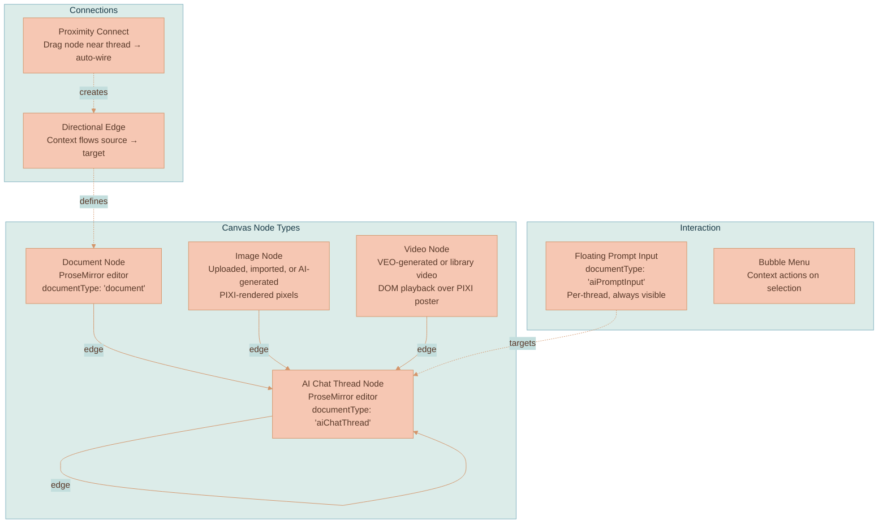
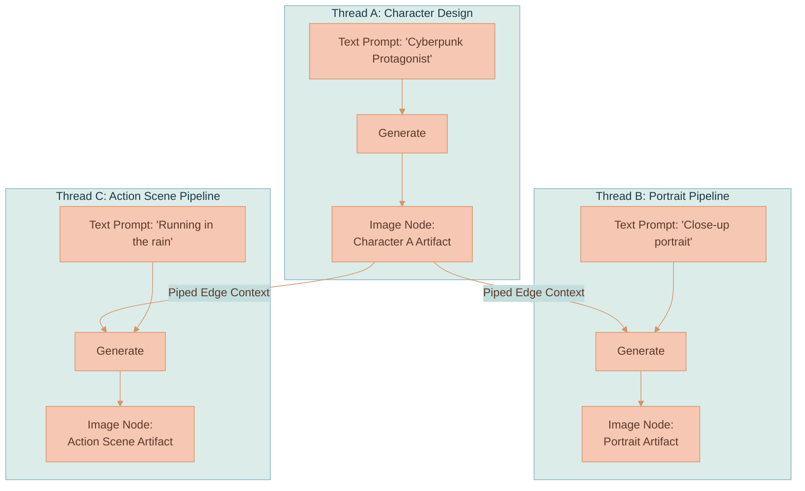
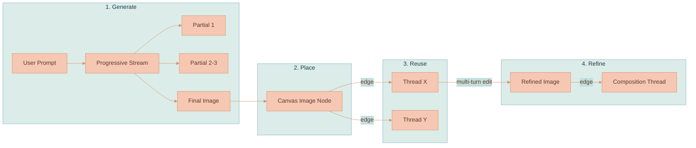
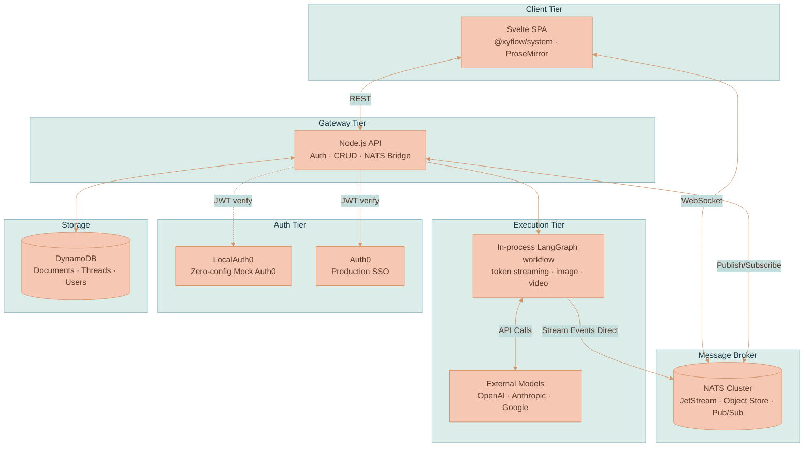
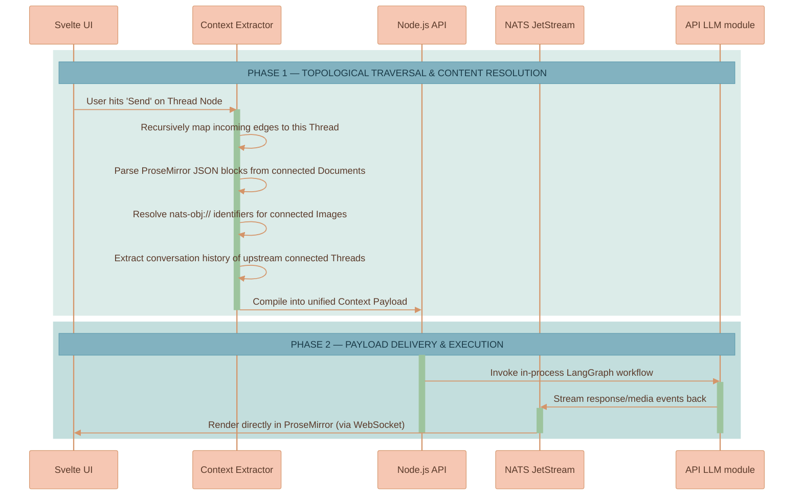
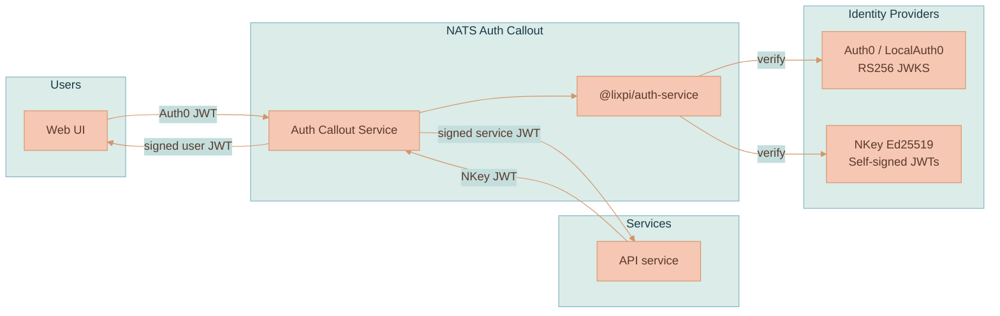

# Lixpi - Product Overview

Lixpi is a visual, node-based workflow engine engineered for building advanced AI image and video generation pipelines. Functionally, it sits at the intersection of an infinite spatial canvas (similar to Miro) and a visual logic execution pipeline (similar to n8n). Conceived and architected well before n8n's public release, Lixpi introduces a fundamental paradigm shift for generative AI tools: **spatial arrangement IS the workflow**.

Instead of writing complex workflow DSLs or using linear chat prompts, users map out ideas topologically. The spatial relationships between documents, images, and AI chat threads on the canvas directly dictate the context extraction, dependency chains, and execution sequence of the underlying AI models.

---

## 1. Core Concept & Capabilities

Lixpi solves the problem of "context collapse" and isolated text-generation loops found in traditional AI interfaces.

It is tailored specifically for complex multi-model setups, excelling at **AI image and video generation workflows**. The standout feature is its mechanical ability to enable complex scene creation and maintain strict character consistency without relying solely on fragile prompt engineering.

By treating all generated text, images, and video iterations as concrete "nodes" that exist statically on the canvas, engineers and creators can physically pipe these individual artifacts into subsequent generation threads. This visual piping ensures that any AI model downstream receives the exact generated output of an upstream model as direct, unambiguous context.

---

## 2. Canvas Primitives

The workspace canvas is an infinite, zoomable surface rendered in vanilla TypeScript using `@xyflow/system` for pan/zoom coordinate math. Text-bearing nodes embed ProseMirror editors; media nodes use specialized canvas chrome. The canvas supports four node types and directional edges between them.

| Node Type | Editor | Resize | Persistence |
|-----------|--------|--------|-------------|
| **Document** | ProseMirror (`documentType: 'document'`) | Free | DynamoDB Documents table |
| **Image** | None (PIXI pixels + DOM chrome) | Aspect-ratio locked | NATS JetStream Object Store |
| **Video** | None (PIXI poster + DOM `<video>` chrome) | Aspect-ratio locked | NATS JetStream Object Store |
| **AI Chat Thread** | ProseMirror (`documentType: 'aiChatThread'`) | Free | DynamoDB AI-Chat-Threads table |

**Edges** are directional connections stored in `canvasState.edges`. Each edge means "include your content as context for the target." Edges can be created by explicit handle drag or by **Proximity Connect** — dragging a node within range of an AI thread shows a dashed ghost line; dropping commits the connection.

**Floating Prompt Input** is a separate ProseMirror editor (`documentType: 'aiPromptInput'`) that appears below each AI thread node. It provides rich-text composition, an AI model selector dropdown, an image generation size picker, and Cmd/Ctrl+Enter to submit. The input is decoupled from threads — it only handles composition; an `AiPromptInputController` routes messages to the correct target.

**Media Library** is a canvas-owned right-side panel for reusable media. It exposes existing extracted Features without changing their extraction persistence path, and lets a user explicitly save completed canvas images or videos as independent JetStream Object Store copies. Inserting saved media creates fresh workspace objects and fresh canvas nodes, so library media survives deletion of its source node.

**AI Chat Panel and Sessions** are workspace-owned UI and conversation state, not a canvas-node requirement. The right-side AI Chat launcher opens an empty panel without creating a chat record. A standalone chat is created only after the user submits its first prompt. Panel visibility, open tabs, active tab, panel width, prompt drafts, compact `Follow` / `Pinned` and `With Sources` controls, and whether the history list is expanded are persisted in the workspace. Sessions is collapsed by default; when expanded it can reopen closed sessions until they are explicitly deleted.

---

## 3. Artifact Piping & Character Consistency

In typical AI generators, maintaining the exact same character across multiple different poses or scenes using text prompts alone is notoriously difficult. Lixpi solves this through **Artifact Piping**.

When an AI thread generates an image, that image becomes an independent artifact node on the canvas. You can then draw directional edges from this single image node into multiple separate AI threads to use as source material.

By piping the exact same reference artifact into different threads, consistency is guaranteed mechanically. This architecture extends to video generation: images can seed image-to-video, prior videos contribute a representative still for branch grounding, and explicit **Extend video in new thread** actions pass the MP4 to VEO's video-extension input.

---

## 4. Image Generation Pipeline

Image generation is powered by OpenAI's gpt-image-1 via the Responses API and Google's Gemini models (Nano Banana) via the Gen AI SDK. The pipeline includes progressive streaming, canvas placement, and multi-turn editing.

**Progressive streaming**: An animated placeholder appears immediately when generation starts (`IMAGE_PARTIAL` with empty data). Up to 3 progressively sharper partial previews update the canvas node in real-time. The final high-resolution image replaces them (`IMAGE_COMPLETE`). All images are stored in NATS JetStream Object Store with SHA-256 content-hash deduplication.

**Placement**: Generated images appear as separate canvas nodes connected back to the source thread/response by an edge. The retired overlapping-thread placement prototype is archived in [ANCHORED-GENERATED-IMAGES.md](knowledge/archive/ANCHORED-GENERATED-IMAGES.md).

**Multi-turn editing**: "Edit in New Thread" creates a fresh AI thread pre-linked to the image, carrying OpenAI's `previousResponseId` for fidelity continuity. The AI remembers the exact image it generated and can make targeted modifications without regenerating from scratch. Users can branch at any point — editing the same image in multiple directions simultaneously.

**Size options**: OpenAI: Square (1024×1024), Landscape (1536×1024), Portrait (1024×1536), Auto. Google: 1:1, 3:2, 2:3, 16:9, 9:16, 4:3, 3:4, 4:5, 5:4, 21:9, Auto. The size picker adapts automatically based on the selected provider.

## 5. Video Generation Pipeline

Video generation is powered by Google VEO through the same dual-model architecture as images. The user selects a text model and an explicit video model; the text model emits a `generate_video` tool call with a cinematic prompt, then the API's in-process LangGraph workflow routes that prompt to a transient VEO provider.

VEO generation is asynchronous: the API submits a `generateVideos` operation, polls until completion, publishes keepalive events while no partial frames exist, downloads and validates the MP4, extracts a frame-0 poster and representative mid-frame with `ffmpeg`, and stores the result in NATS Object Store. The completed clip becomes a `VideoCanvasNode`.

On the canvas, PIXI renders the poster/placeholder for stable geometry, while a visible browser-composited `<video>` element owns actual playback, seeking, scrubbing, PiP, and fullscreen. Hovering the video reveals the shared SVG control bar. Prior video nodes can be piped into later AI threads as representative stills, or extended directly through VEO's video input using **Extend video in new thread**. See [Video Generation](media-generation/VIDEO-GENERATION.md) for the full architecture.

---

## 6. System Architecture

Lixpi operates on a highly decoupled microservices architecture. All inter-service communication flows through NATS — no REST polling for real-time data.

| Service | Language | Role |
|---------|----------|------|
| **web-ui** | Svelte / TypeScript | Browser SPA — canvas rendering, ProseMirror editors, AI chat UI, context extraction |
| **api** | Node.js / TypeScript | Gateway + in-process LangGraph workflow — JWT auth, CRUD operations, DynamoDB persistence, NATS bridge, token streaming, image generation, video generation |
| **nats** | Go (3-node cluster) | Message bus — pub/sub, request/reply, JetStream Object Store for image and video storage |
| **localauth0** | Rust (vendored `primait/localauth0`) | Mock Auth0 for zero-config offline development — RS256 JWT signing, JWKS, same OAuth flows as production |

### Key Architecture Decisions

**NATS-native**: The entire system runs through NATS — auth, messaging, file storage (Object Store), streaming. The browser connects via WebSocket directly to NATS. The API-hosted LLM workflow publishes tokens, image events, and video events straight to per-thread NATS subjects that the browser subscribes to.

**Framework-agnostic canvas**: `WorkspaceCanvas.ts` is pure vanilla TypeScript with zero framework imports. It receives DOM elements and callbacks. Svelte is a thin binding layer. This insulates the canvas from framework churn.

**Provider-agnostic AI**: Every AI request sends the full conversation history — no provider-specific session IDs. Users can start a conversation with Claude, switch to GPT-5, switch to Gemini, and switch back. Adding a new provider means implementing the `BaseProvider` class in `services/api/src/llm/providers/`, which plugs into the shared LangGraph workflow.

**Context extraction is client-side**: When a user sends a message, the browser-side `AiChatThreadService` traverses the edge graph, extracts content from connected nodes, and assembles the multimodal payload. Images and videos contribute Object Store references; videos use representative stills for model context unless the user explicitly starts a video-extension flow.

---

## 7. Multi-Model Support

Each AI thread has a model selector dropdown. Users can switch models between messages mid-conversation.

| Provider | Models | Capabilities |
|----------|--------|-------------|
| **OpenAI** | GPT-5, GPT-4.1, GPT-4.1-mini, GPT-4.1-nano, o3, o4-mini | Text generation |
| **OpenAI** | gpt-image-1 | Image generation (progressive streaming) |
| **Anthropic** | Claude 4 Opus, Claude Sonnet 4 | Text generation |
| **Google** | Gemini 2.5 Pro, Gemini 2.5 Flash | Text generation |
| **Google** | Nano Banana, Nano Banana Pro, Nano Banana 2 | Image generation (progressive streaming via Thinking) |
| **Google** | Veo 3, Veo 3 Fast, Veo 3.1 | Video generation with audio (async submit/poll) — see [Video Generation](media-generation/VIDEO-GENERATION.md) |

Each model carries metadata: context window size, max completion, supported modalities, and detailed pricing (input/output token rates, cached rates, image tiers by resolution, per-second video rates). Five modalities are defined in the type system: `text`, `image`, `audio`, `voice`, `video` — **image and video are implemented** (the latter via Google VEO 3); `audio` and `voice` remain infrastructure-ready.

---

## 8. Context Extraction Flow

When a user submits a prompt in an AI chat thread, the system traverses the preceding node graph to build the LLM's multimodal context payload.

### Execution Steps:
1. **Graph Traversal**: `findConnectedNodes()` filters workspace edges targeting the active thread. Traversal depth is configurable: `'direct'` (one hop, default) or `'full'` (recursive with cycle detection).
2. **Content Extraction**: `extractConnectedContext()` parses connected nodes — ProseMirror JSON → plain text for documents, `nats-obj://` URL references for images and video representative stills, full conversation history for upstream threads.
3. **Message Assembly**: `buildContextMessage()` assembles everything into multimodal `input_text` + `input_image` blocks, prepended to the conversation history.
4. **Media Resolution**: The API LLM module resolves `nats-obj://` URLs to base64 data URLs using magic-byte MIME detection, then converts to the target provider's format.

---

## 9. Streaming Architecture

The complete token path from AI provider to rendered DOM:

```mermaid
%%{init: {'theme': 'base', 'themeVariables': { 'primaryColor': '#F6C7B3', 'primaryTextColor': '#5a3a2a', 'primaryBorderColor': '#d4956a', 'secondaryColor': '#C3DEDD', 'secondaryTextColor': '#1a3a47', 'secondaryBorderColor': '#4a8a9d', 'tertiaryColor': '#DCECE9', 'tertiaryTextColor': '#1a3a47', 'tertiaryBorderColor': '#82B2C0', 'lineColor': '#d4956a', 'textColor': '#5a3a2a'}}}%%
graph LR
    subgraph "AI Provider"
        LLM[OpenAI / Anthropic]
    end

    subgraph "API Service"
        LG[In-process LangGraph Workflow]
        Pub[NATS Publish]
    end

    subgraph "NATS"
        Subj["ai.interaction.chat<br/>.receiveMessage<br/>.{workspaceId}.{threadId}"]
    end

    subgraph "Browser"
        AIS[AiInteractionService]
        MSP[MarkdownStreamParser]
        Plug[aiChatThreadPlugin]
        SI[StreamingInserter]
        DOM[ProseMirror DOM]
    end

    LLM -->|SSE tokens / operation results| LG
    LG --> Pub
    Pub -->|STREAMING chunks| Subj
    Subj -->|WebSocket| AIS
    AIS -->|raw text| MSP
    MSP -->|structured segments| Plug
    Plug -->|ProseMirror transactions| SI
    SI --> DOM
```

**Stream events**: `START_STREAM` → `STREAMING` chunks → `END_STREAM`. Image events (`IMAGE_PARTIAL`, `IMAGE_COMPLETE`) and video events (`VIDEO_PENDING`, `VIDEO_GENERATING`, `VIDEO_COMPLETE`, `VIDEO_ERROR`) bypass the text parser and go directly to chat/canvas media handlers.

**MarkdownStreamParser** converts raw token text into structured segments (headers, paragraphs, code blocks, inline marks). The `StreamingInserter` translates these into ProseMirror transactions that insert content into the editor DOM in real-time.

**Circuit breaker**: A 20-minute timeout prevents runaway requests from consuming resources indefinitely.

---

## 10. Authentication & Security

Lixpi uses a dual authentication model — Auth0 JWTs for users, Ed25519 NKey JWTs for internal services.

**NATS Auth Callout** intercepts every NATS connection attempt. It decrypts the request, verifies the token via `@lixpi/auth-service`, builds permissions, and returns a signed JWT to NATS. Backend services run with scoped service permissions; browser clients receive user-scoped permissions.

**LocalAuth0** provides zero-config offline development. It generates RS256 keypairs, issues JWTs matching production Auth0's OAuth flows, and persists state in a Docker volume. No Auth0 account needed, no internet required.

---

## 11. Shared Infrastructure

Shared packages keep service contracts in sync:

| Package | Purpose |
|---------|---------|
| `@lixpi/constants` | NATS subjects (single JSON source of truth), shared types, AI model metadata with pricing |
| `@lixpi/nats-service` | TypeScript NATS client, JetStream Object Store helpers, NKey auth |
| `@lixpi/auth-service` | JWT verification (Auth0 RS256 + NKey Ed25519) used by API and NATS Auth Callout |
| `@lixpi/nats-auth-callout-service` | NATS connection auth with per-service permission scoping |
| `@xyflow/system` (vendored) | Framework-agnostic pan/zoom/coordinate math — used at the low-level API, not React Flow or Svelte Flow |

---

## Further Reading

This page is the product-level picture. For the technical deep dives, start at the [documentation index](README.md):

- **Platform** — [System Architecture](platform/SYSTEM-ARCHITECTURE.md), [AI Generation Pipeline](platform/AI-GENERATION-PIPELINE.md), [Streaming & Events](platform/STREAMING-AND-EVENTS.md), [Authentication](platform/AUTHENTICATION.md).
- **Canvas** — [Workspace Model](canvas/WORKSPACE-MODEL.md), [Rendering Engine](canvas/RENDERING-ENGINE.md).
- **AI chat** — [Chat Panel & Sessions](ai-chat/CHAT-PANEL-AND-SESSIONS.md), [Context Relevance](ai-chat/CONTEXT-RELEVANCE.md).
- **Media generation** — [Image Generation](media-generation/IMAGE-GENERATION.md), [Video Generation](media-generation/VIDEO-GENERATION.md), [Branch Lineage & Provenance](media-generation/BRANCH-LINEAGE.md).
- **Library** — [Feature Extraction](library/FEATURE-EXTRACTION-OVERVIEW.md), [Media Library](library/MEDIA-LIBRARY.md), [Workspace Export & Import](library/WORKSPACE-EXPORT-IMPORT.md).
