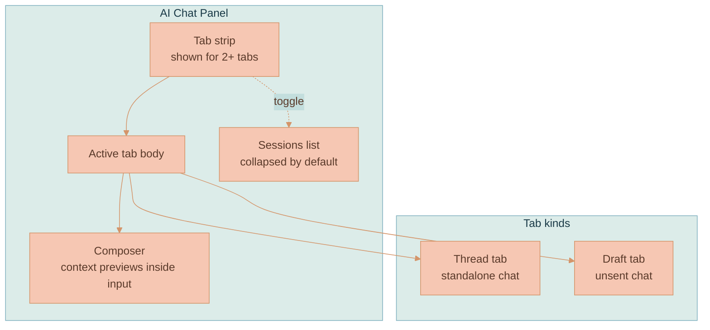
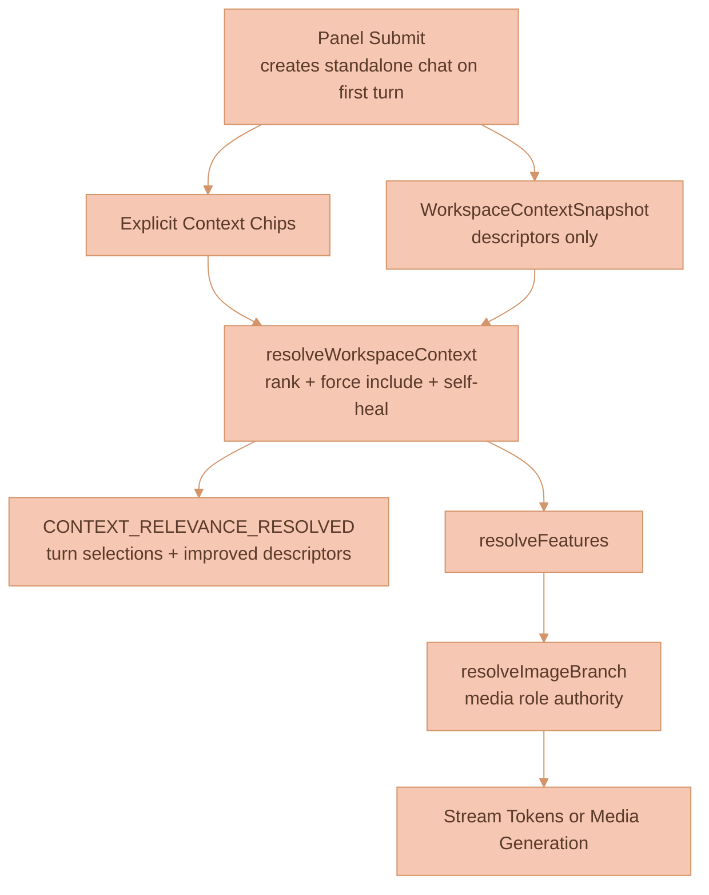

# Chat Panel and Sessions

The AI Chat panel is a workspace-owned right-side surface that opens, persists,
and restores independently of any canvas node. It hosts durable standalone chat
tabs, prompt drafts, explicit composer context previews, automatic workspace
relevance feedback, and a collapsible Sessions list for standalone chats.
Feature extraction runs share the same right-side panel shell but render on the
top-level `Features` surface.

The panel is a presentation surface, not a conversation entity. Opening it,
resizing it, toggling Sessions, editing a draft, or changing composer context all
persist through `CanvasState.aiChatPanel` until submit — but none of them create
a durable session record. A standalone chat exists only once the user submits a prompt.
This page covers the panel surface and the session model; the relevance engine
that selects context for each turn is owned by
[Workspace Context Relevance](./CONTEXT-RELEVANCE.md), what happens when a turn
is submitted is owned by the
[AI Generation Pipeline](../platform/AI-GENERATION-PIPELINE.md), and the
per-thread streaming subject and event catalog are owned by
[Streaming and Events](../platform/STREAMING-AND-EVENTS.md).


Context grouping nodes (the old context-region clouds) were removed from the
live product. Historical renderer samples are archived under the
[context-region archive](../knowledge/archive/context-region-clouds/README.md).
Current context relevance is documented in
[Workspace Context Relevance](./CONTEXT-RELEVANCE.md).


## Core Concepts

**AI Chat Panel** — A singleton workspace surface. It can be open with zero
tabs. Opening, closing, resizing, toggling Sessions, editing a draft, and
changing explicit composer context persist through `CanvasState.aiChatPanel`
until the next submit; none of these create a durable session record by
themselves.

**Standalone Chat** — An `AiChatThread` with owner `{ type: 'standalone' }`,
created only when the user submits the first prompt from a panel draft. Its
outgoing context is explicit chips plus the API's automatic workspace relevance
selection for that turn.

**Context Preview** — A composer-embedded explicit force-include preview.
Previews are removable, sanitized against live canvas nodes, and cleared after
submit so the next turn falls back to automatic workspace relevance. The chip vs
auto-chip distinction and the relevance engine that consumes them live in
[Workspace Context Relevance](./CONTEXT-RELEVANCE.md).

**Feature-Extraction Session** — An `ExtractionRun` produced by the image
"Ask AI" extraction flow. It reconstructs its timeline and result from a stored
source-context snapshot and pipeline trace, and points at, but does not own, any
resulting Feature. Pipeline internals are owned by the
[Extraction Pipeline](../library/EXTRACTION-PIPELINE.md).

## Session Kinds

The Sessions list merges two durable session kinds. They differ in identity,
how their context is reconstructed, and what deletion removes.

| Session kind | Durable identity | Context behavior | Deletion owner |
|---|---|---|---|
| Standalone chat | `AiChatThread.threadId`, owner `{ type: 'standalone' }` | Explicit chips are force-included; workspace relevance adds auto selections per turn | User deletes from Sessions |
| Feature-extraction session | `ExtractionRun.extractionRunId` | Stored extraction source-context snapshot plus pipeline trace | User deletes the session; the Feature remains |

## The Panel as a Singleton Surface

The panel is a single workspace-owned surface, not one panel per chat. It can be
open with zero tabs — opening it is purely presentation. The right-side launcher
and canvas-state persistence are supplied by
`services/web-ui/src/components/WorkspaceCanvas.svelte`, while the panel host
itself is the canvas-owned TypeScript stack in
`services/web-ui/src/infographics/workspace/WorkspaceCanvas.ts`.

Standalone chat creation is lazy. A standalone `AiChatThread` with owner
`{ type: 'standalone' }` is created **only when the user submits the first
prompt** from a panel draft. Until then, the draft and chips persist as panel
state without any conversation record existing.

Generated-media branch roots are ordinary image/video nodes. Their originating
prompt and references live on `generatedBy` and are shown through the generated
media info panel. See [Branch Lineage](../media-generation/BRANCH-LINEAGE.md).

## The Tabbed Panel

The panel hosts normal standalone chat tabs and unsent draft tabs without
displacing the user's current thread. Feature extraction uses the top-level
`Features` surface in the same right-side panel shell. The tab system follows
Cursor IDE / Linear AI / Claude.ai / VS Code conventions.



- **Tab strip pinned at the top** of the floating panel when more than one tab
  is open. A single open tab renders only a divider at the strip's top edge.
- **Open tabs** render through the shared SVG
  `services/web-ui/src/components/slidingTabsSwitch/` primitive. Each tab shows
  a centered text label, truncates to the available segment width, and reveals a
  close control on the left while hovered. The active tab is the sliding
  indicator surface, not a per-tab border.
- **Selecting canvas nodes** can add explicit composer context while the panel is
  open; it does not create or activate a canvas thread node.
- **All extraction triggers** open the top-level `Features` surface with a
  pending extracted-feature placeholder.
- **Closing the last tab** leaves the durable session reopenable from Sessions;
  panel visibility is controlled by `aiChatPanel.isOpen`.
- **Overflow** is a horizontal scroll on the strip, driven by
  `settings.aiChatThread.panelTabs.minTabWidth`, not an overflow dropdown. This
  keeps tab positions predictable, matching Cursor.

## Composer Context Previews

The old Follow / Pinned / With Sources controls are gone. The panel now renders
explicit draft context as media/document previews inside the prompt input's
white composer area:

- Explicit previews are stored in `CanvasState.aiChatPanel.contextChips` as the
  current draft's forced node ids.
- Selecting eligible canvas nodes while the panel is open can add previews.
- Removing a preview does not tear down the ProseMirror composer or draft.
- Deleted nodes and duplicate IDs are sanitized out of persisted panel state.
- Generated branch roots are normal media chip targets; their provenance is
  reconstructed from `generatedBy` metadata rather than from a separate canvas
  node.
- `CONTEXT_RELEVANCE_RESOLVED` is submitted-turn feedback. Its automatic
  selections do not render in or mutate the current draft composer.
- Submitting a prompt snapshots the explicit preview ids for that turn, clears
  the explicit set, and lets the next prompt fall back to automatic workspace
  relevance unless the user selects new context.

On submit, explicit chips are resolved through the same extraction path used by
canvas-thread context. The browser also sends a `WorkspaceContextSnapshot`, a
descriptors-only index of context-bearing workspace nodes. The API ranks that
snapshot, force-includes chip and edge-connected nodes, and streams its
resolution back to the panel.


The composer preview strip is the panel's surface for context; the ranking, self-heal,
force-include, and auto-chip behavior all live in the relevance engine. For the
chip vs auto-chip contract and the resolver flow, see
[Workspace Context Relevance](./CONTEXT-RELEVANCE.md).


## What Happens on Submit

Submitting a turn is where the panel hands off to the shared workflow. The panel
sends the prompt, explicit chips, and the `WorkspaceContextSnapshot`; the API
resolves context, routes the turn, and streams back.



`resolveWorkspaceContext` runs on every chat turn, including text-only turns.
`resolveImageBranch` remains the authority for visual media roles when an image
or video model is selected. The shared LangGraph workflow, routing, and usage
accounting are documented in the
[AI Generation Pipeline](../platform/AI-GENERATION-PIPELINE.md); streaming
mechanics and the event catalog are in
[Streaming and Events](../platform/STREAMING-AND-EVENTS.md).

When a media-generation matrix creates API-planned branch forks, the chat
thread stores lineage ids on the streamed message pieces instead of baking panel
chrome into those messages. Reasoning sections carry `branchOriginNodeId` and
`branchForkNodeId`; generated image/video atoms retain the same ids for canvas
reconstruction, while their provider badge rows stay model/provider-only. The
shared lineage-event projector decides what to render for each view: the live
conversation can show the full `Branch started` / `Branch fork created` context,
a branch-root canvas panel materializes only `Branch started`, and a branch-fork
or media-run panel renders only fork-local `Branch fork created` markers.

## Feature Extraction Surface

When an extraction is triggered (for example via an image's "Ask AI" handler), a
placeholder feature row appears on the `Features` surface. The inspector shows a
confirmation section first; confirming starts the extraction run and mounts the
pipeline progress in that same inspector. The unconfirmed placeholder is local
UI state; the durable extraction session starts when the user confirms.

1. **Placeholder feature row.** Shows the pending run in the Features list before
   server-side extraction starts.
2. **Confirmation section.** Explains that extraction analyzes the selected
   source and connected context, exposes dedicated Reasoning model and Image model selectors,
   generates source-safe samples, and saves a workspace Feature.
3. **Stage timeline.** After confirmation, a stage-aware timeline renders one
   row per streamed pipeline stage event, each showing stage name, model name,
   duration, and status, with expandable prompt/output detail.
4. **Agent reasoning.** Streamed reasoning renders under the active stage.
5. **Final feature card.** Appears when the `feature_card` block streams in at
   completion. The created Feature event adds the normal saved Feature row to the
   library.

The extraction surface reads local pending placeholders before confirmation.
After confirmation, state comes from API-owned `ExtractionRun` records, not
`CanvasState`. Started runs reconstruct persisted timeline state from stored
trace events, stage reasoning, feature-card payload, source snapshot, and model
config. While running, live updates arrive on the same streaming subject pattern
used by chat threads, with `extractionRunId` substituted for the thread id.


The Features surface is the panel's view of an extraction run. The six-stage
extraction pipeline, its stage trace events, and `/use` resolution are covered
in the [Extraction Pipeline](../library/EXTRACTION-PIPELINE.md) and
[Using Features](../library/USING-FEATURES.md).


## Sessions List

Sessions is collapsed by default and toggled from the history icon in the panel
control row. When expanded it opens directly under that control row, above the
tab strip when the strip is rendered, and lists submitted standalone chats and
submitted feature-extraction sessions for the workspace, sorted by most recent
update. Rows include a title, absolute update date plus relative recency, and
compact metadata such as message count, status, extraction provider, or source
count. Closing a tab only changes panel presentation; the session remains
reopenable.

The plus control beside the history toggle starts a fresh panel draft with empty
context. If another tab is already open, the draft is added as its own tab so the
existing session remains open. This does not create a durable standalone chat
until the user submits the first prompt. Closing the last open tab uses the same
blank draft path without rendering a tab strip, clearing context chips, active
thread ids, and legacy last-active thread state before the next prompt.

Standalone and extraction entries both expose a permanent-delete control:

- Deleting a **standalone chat** removes that conversation and its saved prompt
  draft.
- Deleting an **extraction session** removes only the run metadata/transcript; a
  saved Feature is independent and remains available in the library.

## State and Persistence

The panel's entire presentation state lives under `CanvasState.aiChatPanel`,
persisted with the rest of canvas state. Defaults and chip sanitization are
handled in
`services/web-ui/src/infographics/workspace/aiChatPanelState.ts`.

```typescript
aiChatPanel?: {
    isOpen: boolean
    isSessionHistoryOpen: boolean
    tabs: Array<{ tabId: string; type: 'thread' | 'extraction' | 'draft'; refId: string; title: string }>
    activeTabId?: string
    contextChips: string[]
    width?: number
    drafts?: Record<string, { content?: object }>
}
```

| Field | Purpose |
|-------|---------|
| `isOpen` | Whether the panel surface is visible |
| `isSessionHistoryOpen` | Whether the Sessions list is expanded |
| `tabs` | Ordered tab presentation: thread vs extraction, ref id, title |
| `activeTabId` | The currently focused tab |
| `contextChips` | Current draft's explicit force-include preview node IDs; cleared after submit |
| `width` | Persisted panel width |
| `drafts` | Per-tab ProseMirror draft content |

Persistence flows through the existing `onCanvasStateChange?.()` hook and the
`WORKSPACE_SUBJECTS.UPDATE_CANVAS_STATE` channel for cross-device sync. Three
DynamoDB tables back the durable records the panel surfaces:

| Table | Holds | Workspace-deletion cleanup |
|-------|-------|----------------------------|
| `WORKSPACES` | `canvasState.aiChatPanel` (tabs, active tab, open/collapsed state, width, `contextChips`, drafts) | Removed with the workspace row |
| `AI_CHAT_THREADS` | Durable standalone conversations | `AiChatThread.deleteWorkspaceAiChatThreads({ workspaceId })` before the workspace row is removed |
| `EXTRACTION_RUNS` | Extraction-session transcript/trace history | `ExtractionRun.deleteWorkspaceRuns({ workspaceId })` |

`CONTEXT_RELEVANCE_RESOLVED` is stream feedback, not persisted panel state. The
browser uses it for submitted-turn context bookkeeping and local descriptor
patches; it does not inject automatic selections into the draft composer.

## Current Status

The panel, standalone ownership model, composer context previews, workspace relevance
feedback, Sessions projection, and extraction-session history are implemented in
the web UI and API:

- The panel host is the canvas-owned TypeScript stack in
  `services/web-ui/src/infographics/workspace/WorkspaceCanvas.ts`.
- Open tabs are mounted as a D3 SVG `slidingTabsSwitch`, composed from
  `slidingSwitch` and `tagPill`.
- `services/web-ui/src/components/WorkspaceCanvas.svelte` supplies the right-side
  launcher and canvas-state persistence.
- Panel presentation state is persisted under `CanvasState.aiChatPanel`, with
  defaults and chip sanitization in
  `services/web-ui/src/infographics/workspace/aiChatPanelState.ts`.
- Standalone chat creation and deletion live in
  `services/api/src/models/ai-chat-thread.ts` and
  `services/api/src/NATS/subscriptions/ai-chat-thread-subjects.ts`.
- Workspace relevance runs in
  `services/api/src/llm/graph/workspace-context-resolver.ts` before feature
  resolution and image/video branch routing.
- Extraction-session source snapshots, workspace listing, and non-cascade
  deletion live in `services/api/src/models/extraction-run.ts` and
  `services/api/src/NATS/subscriptions/extraction-subjects.ts`.


Durable reload recovery of an in-flight normal-chat response is still deferred.
The panel restores persisted editor content and tabs, but not an interrupted
live stream. A user who reloads mid-response sees the restored transcript up to
the last persisted state, not the tokens that were streaming at reload time.


## Implementation Map

| Area | File |
|------|------|
| Panel host | `services/web-ui/src/infographics/workspace/WorkspaceCanvas.ts` |
| Panel tab switch | `services/web-ui/src/components/slidingTabsSwitch/slidingTabsSwitch.ts` |
| Sliding switch primitive | `services/web-ui/src/components/slidingSwitch/slidingSwitch.ts` |
| Tab pill primitive | `services/web-ui/src/components/tagPill/tagPill.ts` |
| Launcher + persistence | `services/web-ui/src/components/WorkspaceCanvas.svelte` |
| Panel state + draft context sanitization | `services/web-ui/src/infographics/workspace/aiChatPanelState.ts` |
| Panel tab settings | `services/web-ui/src/settings.ts` |
| Standalone thread model | `services/api/src/models/ai-chat-thread.ts` |
| Standalone thread subjects | `services/api/src/NATS/subscriptions/ai-chat-thread-subjects.ts` |
| Workspace relevance resolver | `services/api/src/llm/graph/workspace-context-resolver.ts` |
| Extraction run model | `services/api/src/models/extraction-run.ts` |
| Extraction subjects | `services/api/src/NATS/subscriptions/extraction-subjects.ts` |

## References

- [Workspace Context Relevance](./CONTEXT-RELEVANCE.md) — context chips, automatic selections, and the relevance engine
- [Media and Content Descriptors](./MEDIA-DESCRIPTORS.md) — descriptors that drive relevance
- [AI Generation Pipeline](../platform/AI-GENERATION-PIPELINE.md) — what happens on submit (workflow, routing, usage)
- [Streaming and Events](../platform/STREAMING-AND-EVENTS.md) — per-thread streaming subject and event catalog
- [Branch Lineage](../media-generation/BRANCH-LINEAGE.md) — generated-media branch roots, provenance, and branch-tree layout
- [Extraction Pipeline](../library/EXTRACTION-PIPELINE.md) — the six-stage extraction internals
- [Using Features](../library/USING-FEATURES.md) — `/use` and `/extract`, the library, and feature application
- [Workspace Model](../canvas/WORKSPACE-MODEL.md) — canvas state and node model
