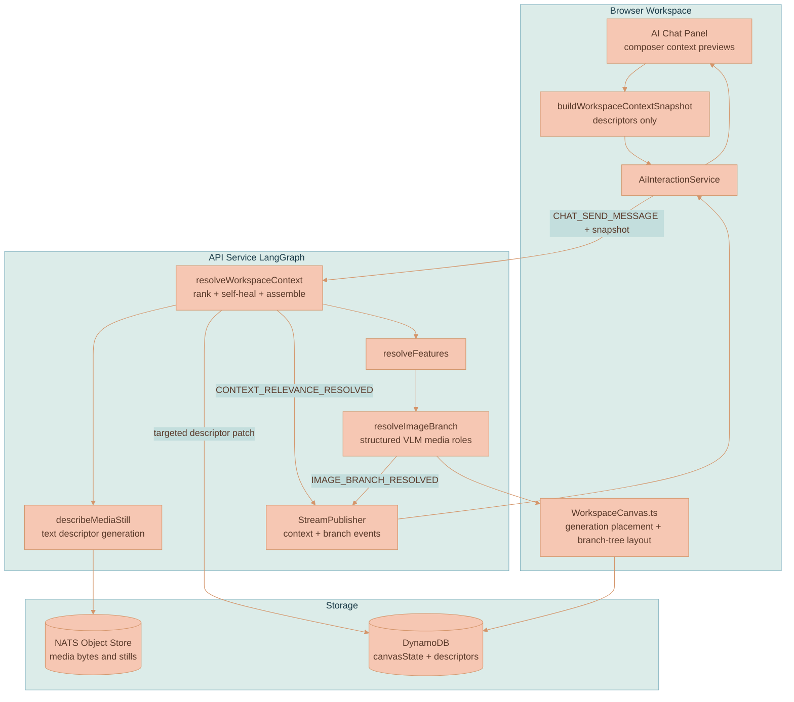
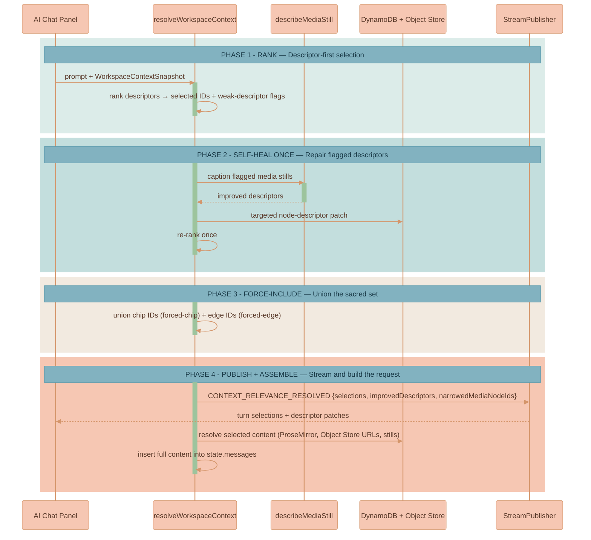

# Workspace Context Relevance

Workspace context relevance makes the AI Chat panel workspace-aware without
reviving context-region clouds. Every chat turn sends the API a compact,
descriptors-only index of the current canvas. The API ranks that index,
force-includes explicit chips and edge-connected nodes, repairs weak descriptors
once when needed, and assembles only the selected content into the model
request.

The reduction is deliberate. Descriptors (see
[Media and Content Descriptors](./MEDIA-DESCRIPTORS.md)) are cheap text the
relevance model can scan over the whole canvas; full content and pixels are
resolved only for the nodes that survive ranking. This page covers the relevance
engine itself — the concepts, the resolver behavior, and the data contracts. The
shared workflow node that runs it (`resolveWorkspaceContext`) is documented in
the [AI Generation Pipeline](../platform/AI-GENERATION-PIPELINE.md); the pixel
role authority for media that reaches an image/video model is
[`resolveImageBranch`](../media-generation/BRANCH-LINEAGE.md). This feature
replaces the live context-region system; historical cloud rendering samples live
only in the
[context-region archive](../knowledge/archive/context-region-clouds/README.md).

## Core Concepts

**Content Descriptor** — A short summary plus entity/style tags stored on every
context-bearing canvas node: images, videos, documents, and AI chat thread
nodes. `MediaDescriptor` remains an alias for media nodes, but the shared shape
is `ContentDescriptor`. Full lifecycle, sourcing, and self-heal detail live in
[Media and Content Descriptors](./MEDIA-DESCRIPTORS.md).

**Context Chip** — An explicit force-include selected in the AI Chat panel.
Chips live in `CanvasState.aiChatPanel.contextChips` for the current draft,
render as media/document previews inside the composer, are removable by the
user, and clear after submit.

**Automatic Selection** — A submitted-turn selection created from
`CONTEXT_RELEVANCE_RESOLVED`. Automatic selections show what the relevance
engine used for the request that is already in flight. They are never persisted
into panel state and never injected into the draft composer.

**Workspace Context Snapshot** — A browser-built descriptors-only request
payload. It indexes context-bearing nodes with descriptor status, summary/tags,
media object references, branch IDs, and force-include flags. It never embeds
pixels.

**Workspace Context Resolution** — The API relevance result. It contains
selected node IDs, selection roles (`forced-chip`, `forced-edge`, `auto`),
rationales, improved descriptors, and the narrowed media node set that
downstream image/video branch routing sees.

**Placement Anchor** — A media node that can help place a fresh/reference-only
generation on the canvas without becoming lineage. Placement anchors are
context, not connector parentage. See
[Branch Lineage](../media-generation/BRANCH-LINEAGE.md).

**Lineage Source** — A verified connector source for a generated output: only a
chat thread root, API lineage marker, or API-selected existing generated-media
branch member can become the parent edge. Reference/style/source media cannot
become lineage parents by themselves. See
[Branch Lineage](../media-generation/BRANCH-LINEAGE.md).

## Why This Exists

The removed context-region cloud combined three jobs: visual grouping, chat
ownership, and generation provenance. That made the bubble a cage. A user had to
gather items into a region or manually pin them before the AI could use them,
even when another canvas item was obviously relevant.

Sending the whole canvas as pixels does not scale either. The image/video branch
resolver is intentionally pixel-grounded and expensive per candidate. Workspace
relevance does the cheap narrowing first using descriptors, then lets
[`resolveImageBranch`](../media-generation/BRANCH-LINEAGE.md) remain the visual
authority for media that actually reaches the image/video model.

The design keeps three boundaries clear:

- Explicit chips and edge-connected nodes are always included.
- Automatic relevance can add context, but it cannot remove forced context.
- Pixel role assignment stays in `resolveImageBranch`; workspace relevance only
  narrows candidates and assembles selected content.

## Product Principles

- **Descriptors are the reduction.** Relevance ranks compact text metadata
  first; full content and pixels are resolved only for selected nodes.
- **Explicit context is sacred.** Context chips and edge-forced nodes are
  force-included on every turn.
- **Automatic context is submitted-turn state.** Auto-selected nodes can be
  shown in response, trace, or generated-media provenance surfaces, but they do
  not mutate the next draft's composer context.
- **One pixel authority.** The workspace relevance stage never decides
  target/style/reference visual roles for media. The structured VLM branch
  resolver does that.
- **References are context, not lineage.** Reference, style, source, and
  relevance-selected media may affect prompt routing and placement, but they do
  not become connector parents unless the API lineage plan selects an existing
  generated-media branch member as the parent.
- **Branch roots record births.** The first generated image or video in a branch
  stores the prompt, references, and resolver metadata on `generatedBy`.
  Continuations attach to the existing branch and do not create another
  provenance node.
- **Context regions are gone.** Live code should not depend on `contextRegion`
  nodes, region sessions, cloud settings, or context-region subjects.

## System Architecture

The browser builds the snapshot and streams it with the chat message; the API
ranks, self-heals, and assembles; storage holds canvas state, descriptors, and
the media bytes the resolver pulls stills from.



| Component | Responsibility |
|-----------|----------------|
| `buildWorkspaceContextSnapshot` | Builds the descriptors-only index from live canvas nodes |
| `AiInteractionService` | Sends the snapshot with the chat turn and applies streamed resolution back to the panel |
| `resolveWorkspaceContext` | Ranks descriptors, self-heals once, force-includes, assembles selected content |
| `describeMediaStill` | Generates text descriptors during self-heal |
| `resolveImageBranch` | Structured VLM media-role authority over the narrowed media set |
| `StreamPublisher` | Emits `CONTEXT_RELEVANCE_RESOLVED` and branch events |

## Relevance Resolver Behavior

`resolveWorkspaceContext` is the first shared graph node and runs on **every**
chat turn, including text-only turns. The resolver is descriptor-first and
bounded — it ranks, repairs at most once, unions in the forced set, publishes,
and assembles.



1. **Rank.** A text-capable resolver model receives the prompt plus
   `WorkspaceContextSnapshot`. It returns selected node IDs, short rationales,
   and nodes that need better descriptors.
2. **Self-heal once.** Missing, failed, analyzing, or too-thin descriptors are
   repaired within the same turn. Media uses `describeMediaStill`; documents and
   threads use text descriptor generation. The API persists improved descriptors
   through a targeted node-descriptor patch and re-ranks once. This bound is
   detailed in [Media and Content Descriptors](./MEDIA-DESCRIPTORS.md).
3. **Force-include.** Explicit chip IDs and edge-connected IDs are unioned into
   the result as `forced-chip` and `forced-edge`. Automatic relevance can add to
   this set but can never remove from it.
4. **Publish.** The API emits `CONTEXT_RELEVANCE_RESOLVED` with selections,
   improved descriptors, and `narrowedMediaNodeIds`. On failure it emits
   `CONTEXT_RELEVANCE_ERROR` and the graph error path closes the stream visibly.
   See [Streaming and Events](../platform/STREAMING-AND-EVENTS.md) for the full
   event catalog.
5. **Assemble.** Full content for selected nodes is inserted into
   `state.messages`. Documents and threads resolve from stored ProseMirror
   content. Media resolves through Object Store URLs and stills. The narrowed
   media set feeds `imageBranchCandidateSnapshot`.

The stage can improve recall on text-only turns as well as media turns. For
"summarize my canvas," it can select salient docs, threads, images, and videos
without invoking pixel branch routing.

## Context Chips vs Automatic Selections

The AI Chat panel owns the composer context previews. Opening the panel creates no session
and no hidden canvas node; the first submit creates a standalone `AiChatThread`
only when a prompt is sent (see
[Chat Panel and Sessions](./CHAT-PANEL-AND-SESSIONS.md)).

| Aspect | Context Chip (explicit) | Automatic selection |
|--------|-------------------------|-----------|
| Origin | User selects an eligible canvas node | Relevance engine selection in `CONTEXT_RELEVANCE_RESOLVED` |
| Persistence | Stored as the current draft's `CanvasState.aiChatPanel.contextChips`; cleared after submit | Ephemeral; never persisted |
| Selection role | `forced-chip` | `auto` |
| Force-included? | Yes, for the submitted turn | No — re-evaluated each turn |
| Composer behavior | Renders in the draft composer until submit | Never renders in or mutates the draft composer |

Explicit chips are stored in `CanvasState.aiChatPanel.contextChips` while the
prompt is being drafted. Selecting canvas nodes while the panel is open can add
new eligible nodes as chips. Deleted nodes and duplicate IDs are sanitized out
of panel state, and submit clears the explicit chip set after the turn snapshots
it.
Generated-media branch roots are normal image/video nodes. They can be selected
as context like other media, and their branch provenance is reconstructed from
`generatedBy` metadata (see [Branch Lineage](../media-generation/BRANCH-LINEAGE.md)).

Automatic selections are derived from the relevance resolution for the submitted
turn. They are not persisted, and they do not become context previews for the
next unsubmitted draft. The engine may select the same nodes again on a later
turn if they are still relevant.

## Data Contracts

The shared contracts live in `packages/lixpi/constants/ts/types.ts`. The
snapshot is the browser request payload; the resolution is the API result.

```typescript
export type WorkspaceContextNode = {
    nodeId: string
    type: CanvasNodeType
    referenceId?: string
    descriptorStatus?: ContentDescriptorStatus
    title?: string
    descriptorSummary?: string
    entityTags?: string[]
    styleTags?: string[]
    fileId?: string
    imageUrl?: string
    branchId?: string
    isExplicitChip: boolean
    isEdgeForced: boolean
}

export type WorkspaceContextSnapshot = {
    resolverVersion: string
    workspaceId: string
    threadId: string
    promptText: string
    nodes: WorkspaceContextNode[]
}

export type WorkspaceContextSelection = {
    nodeId: string
    role: 'forced-chip' | 'forced-edge' | 'auto'
    rationale?: string
}

export type WorkspaceContextResolution = {
    resolverVersion: string
    selections: WorkspaceContextSelection[]
    improvedDescriptors?: Record<string, ContentDescriptor>
    narrowedMediaNodeIds: string[]
}
```

| Contract | Direction | Role |
|----------|-----------|------|
| `WorkspaceContextNode` | Browser → API | One descriptor-only entry per context-bearing node, with force-include flags |
| `WorkspaceContextSnapshot` | Browser → API | The full descriptors-only index for one chat turn; never embeds pixels |
| `WorkspaceContextSelection` | API → Browser | One selected node plus its role and rationale |
| `WorkspaceContextResolution` | API → Browser | The relevance result, including improved descriptors and the narrowed media set |

## Multimodal Content Block Format

When the resolver assembles selected content into `state.messages`,
`buildContextMessage()` formats it as multimodal content blocks: `input_text`
for text and `input_image` for images and video stills. The API LLM module
converts these into provider-specific formats as needed.

```typescript
// Text content block
{ type: 'input_text'; text: string }

// Image content block
{ type: 'input_image'; image_url: string; detail?: 'auto' | 'low' | 'high' }
```

Explicit context extraction on a standalone send resolves chip nodes through
`extractSelectedContext({ nodeIds })`, and the same multimodal block format
carries that content to the model. Video candidates contribute a still rather
than the clip — see
[Media and Content Descriptors](./MEDIA-DESCRIPTORS.md#why-videos-send-a-still-not-the-clip).

## Context-Region Removal

The descriptor-first relevance engine replaced the context-region cloud
primitive outright. The live product no longer has:

- `contextRegion` in `CanvasNode`
- `ContextRegionCanvasNode`
- `settings.contextRegion`
- `workspace.contextRegion.delete`
- context-region session kind
- context-region cloud renderer wiring
- `Follow`, `Pinned`, or `With Sources` panel controls

Old workspaces with stale `contextRegion` nodes are skipped by an inert renderer
guard. There is no migration or compatibility behavior beyond that guard.

Recovery-grade implementation notes and archived renderer samples live under the
[context-region archive](../knowledge/archive/context-region-clouds/README.md).
There is no live context-region feature page.

## Implementation Map

| Area | File |
|------|------|
| Shared contracts | `packages/lixpi/constants/ts/types.ts` |
| Panel state | `services/web-ui/src/infographics/workspace/aiChatPanelState.ts` |
| Snapshot builders | `services/web-ui/src/services/ai-image-branching.ts` |
| Workspace relevance resolver | `services/api/src/llm/graph/workspace-context-resolver.ts` |
| Shared LangGraph workflow | `services/api/src/llm/providers/base-provider.ts` |
| Provider state channels | `services/api/src/llm/graph/state.ts` |
| Stream events | `services/api/src/llm/graph/stream-publisher.ts` |
| Browser stream handling | `services/web-ui/src/services/ai-interaction-service.ts` |
| Explicit context extraction | `services/web-ui/src/services/ai-chat-thread-service.ts` |
| Attachment conversion | `services/api/src/llm/utils/attachments.ts` |
| Descriptor generation | `services/api/src/llm/media-descriptor.ts`, `services/api/src/NATS/subscriptions/media-descriptor-subjects.ts`, `services/web-ui/src/services/media-descriptor-service.ts` |
| Canvas placement and branch-tree layout | `services/web-ui/src/infographics/workspace/WorkspaceCanvas.ts`, `services/web-ui/src/infographics/workspace/branchTreeLayout.ts` |

## References

- [Media and Content Descriptors](./MEDIA-DESCRIPTORS.md) — descriptor shape, sourcing, self-heal, indicator
- [Chat Panel and Sessions](./CHAT-PANEL-AND-SESSIONS.md) — the panel that owns composer context previews
- [AI Generation Pipeline](../platform/AI-GENERATION-PIPELINE.md) — the `resolveWorkspaceContext` workflow node, routing, and usage
- [Streaming and Events](../platform/STREAMING-AND-EVENTS.md) — `CONTEXT_RELEVANCE_RESOLVED` and the full event catalog
- [Branch Lineage](../media-generation/BRANCH-LINEAGE.md) — `resolveImageBranch`, structured VLM media-role assignment, placement anchors
- [Image Generation](../media-generation/IMAGE-GENERATION.md) — image tool routing and streaming
- [Video Generation](../media-generation/VIDEO-GENERATION.md) — video generation and VEO references
- [Workspace Model](../canvas/WORKSPACE-MODEL.md) — canvas data model and node chrome
- [Context-region archive](../knowledge/archive/context-region-clouds/README.md) — removed cloud primitive samples
