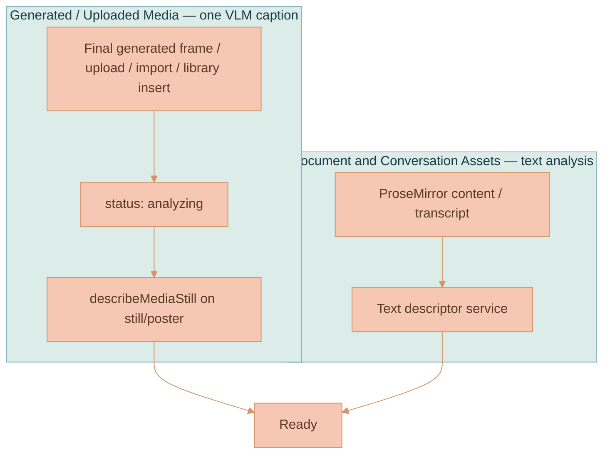

# Media and Content Descriptors

Every context-bearing Asset can carry a compact, model-friendly
**descriptor**: a one-to-two sentence summary plus a few entity and style tags.
Images and videos still expose the historical `MediaDescriptor` name, but the
canonical shared contract is now `ContentDescriptor` because documents and AI
conversation Assets use the same shape. Canvas nodes carry only `assetId`; they
resolve the descriptor from `assetsStore` and never persist a copy.

Descriptors exist so workspace-wide features can tell nodes apart and feed short
textual hints into model context without re-analyzing every artifact. They are
the cheap reduction that lets the workspace narrow a whole canvas down to a
handful of relevant nodes before any expensive pixel work runs. Their main
consumers are [Workspace Context Relevance](./CONTEXT-RELEVANCE.md) and
[Branch Lineage](../media-generation/BRANCH-LINEAGE.md). The canvas info panel
also renders ready descriptors for media nodes.

The descriptor is deliberately short so it can fit into a resolver transcript or
workspace relevance prompt without bloat. The summary is capped at
`MEDIA_DESCRIPTOR_SUMMARY_MAX_LENGTH` (280 chars) and stamped with
`MEDIA_DESCRIPTOR_VERSION` so stale descriptors can be detected later.


The summary length cap and the version stamp are the two mechanisms that keep
descriptors both prompt-cheap and self-expiring. A descriptor written by an
older `MEDIA_DESCRIPTOR_VERSION` can be flagged for repair on a later turn even
if it is otherwise `ready`.


## Shape

`ContentDescriptor` (`packages/lixpi/constants/ts/types.ts`) is the optional
`Asset.descriptor` component. `Asset-Meta` projects its summary and tags for
catalog listing, while workspace placements resolve the authoritative Asset.
`MediaDescriptor` is an alias for the same type.

```typescript
export type ContentDescriptor = {
    status: 'analyzing' | 'ready' | 'failed'
    summary: string
    entityTags: string[]
    styleTags: string[]
    source: 'analysis'
    version: string
    updatedAt: number
}

export type MediaDescriptor = ContentDescriptor
```

| Field | Type | Purpose |
|-------|------|---------|
| `status` | `'analyzing' \| 'ready' \| 'failed'` | Lifecycle; drives analyzing indicators and self-heal decisions |
| `summary` | `string` | 1-2 sentences naming the dominant subjects and overall look/content |
| `entityTags` | `string[]` | A few concrete subjects, objects, people, or concepts |
| `styleTags` | `string[]` | A few medium, palette, mood, lighting, or document-style descriptors |
| `source` | `'analysis'` | Descriptor produced from media pixels or document/conversation text |
| `version` | `string` | `MEDIA_DESCRIPTOR_VERSION` |
| `updatedAt` | `number` | Last write timestamp |

## How It Is Sourced

There are two sourcing paths. Media is always described from the actual pixels
with a single Vision-Language-Model (VLM) pass; documents and threads use a text
summarization pass. Generation prompts, revised prompts, and branch resolver
summaries are never used as media descriptions.



### Media — one VLM caption

When an AI-generated image finalizes, when a generated video completes, or when
media is uploaded/imported/materialized onto the canvas, the Asset is updated
with a `status: 'analyzing'` descriptor. The browser requests
`MEDIA_DESCRIBE`, and the API handler
(`services/api/src/NATS/subscriptions/media-descriptor-subjects.ts`) calls
`describeMediaStill` (`services/api/src/llm/media-descriptor.ts`) against the
stored image, final frame, representative frame, or poster. The media-analysis
model is API-owned through `settings.mediaDescriptor.defaultVlmModelId` in
`services/api/src/settings.ts`, not selected by the browser. For video,
captioning runs on the representative still/poster, never the MP4.

### Document and conversation Assets — text analysis

Document and conversation Assets get descriptors from their text
content/transcript. Plain canvas document typing and Asset creation do not
proactively request descriptor analysis. Missing or weak document/conversation descriptors are
repaired during workspace context self-heal when an AI turn needs the node.
These descriptors let the workspace relevance engine rank documents and
conversations alongside media using one uniform contract.

## Self-Heal

[`resolveWorkspaceContext`](../platform/AI-GENERATION-PIPELINE.md) can repair
weak descriptors inside the same chat turn. Assets resolved through nodes with missing, failed,
analyzing, or too-thin descriptors can be flagged by the relevance model. The
API improves flagged descriptors once, persists them through an Asset revision
update, re-ranks the workspace snapshot, and streams
`improvedDescriptors` in `CONTEXT_RELEVANCE_RESOLVED`.


Self-heal is **bounded to one improvement round per turn**. The resolver does
not loop until every descriptor is perfect; it repairs the flagged set once,
re-ranks, and proceeds. This keeps a single chat turn from fanning out into an
unbounded number of VLM captions.


The browser applies improved descriptors to `assetsStore` so every placement's
analyzing indicator and info panel updates without a reload. See
[Workspace Context Relevance](./CONTEXT-RELEVANCE.md) for how self-heal sits
inside the larger rank → force-include → assemble flow.

## Canvas Analyzing Indicator

While media `status === 'analyzing'`, the media node's info button pulses
(`.media-info-button.is-analyzing`, animation `workspace-media-analyzing-pulse`)
and its title/aria-label explains what is happening. Opening the panel shows an
"Analyzing media..." note. When ready, the same panel renders the summary and
tags via `buildMediaDescriptorSection`.

Documents and conversation nodes use descriptors for relevance, not media chrome —
they do not render the analyzing pulse. See
[Workspace Model](../canvas/WORKSPACE-MODEL.md) for the canvas node chrome these
indicators attach to.

## Why Videos Send a Still, Not the Clip

A video candidate contributes the Asset's `representativeFrame` rendition,
falling back to its `poster` rendition, as the still the resolver and captioner see. This keeps
per-candidate VLM cost identical to an image and means an edit to a previous
video can continue that video's branch without sending the MP4. See
[Video Generation](../media-generation/VIDEO-GENERATION.md) for frame extraction
and VEO anchoring.

## References

- [Workspace Context Relevance](./CONTEXT-RELEVANCE.md) — workspace relevance, self-heal, and automatic selections
- [Branch Lineage](../media-generation/BRANCH-LINEAGE.md) — how descriptors/tags feed branch grounding
- [Image Generation](../media-generation/IMAGE-GENERATION.md) — generated-image completion and final-frame storage
- [Video Generation](../media-generation/VIDEO-GENERATION.md) — mid-frame extraction and VEO image-to-video anchoring
- [Workspace Model](../canvas/WORKSPACE-MODEL.md) — canvas media nodes and chrome
- [AI Generation Pipeline](../platform/AI-GENERATION-PIPELINE.md) — the `resolveWorkspaceContext` workflow node that drives self-heal
