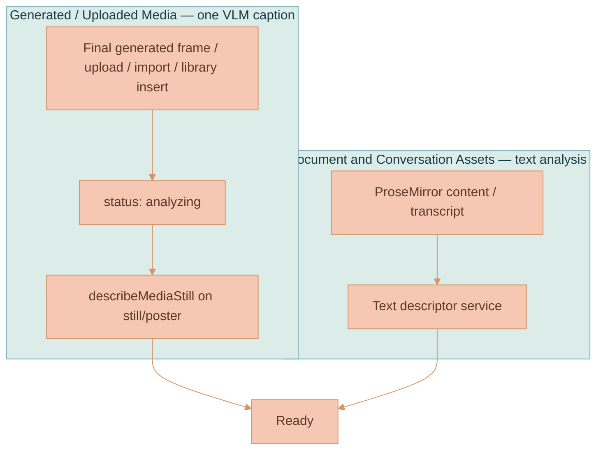

# Media and Content Descriptors

Every context-bearing Asset can carry a compact, model-friendly
**descriptor**: a one-to-two sentence summary plus a few entity and style tags.
The same final media VLM call also returns a specific two-to-three-word title,
which replaces the Asset's provisional upload/generated title.
Images and videos still expose the historical `MediaDescriptor` name, but the
canonical shared contract is now `ContentDescriptor` because documents and AI
conversation Assets use the same shape. Canvas nodes carry only `assetId`; they
resolve the descriptor from `assetsStore` and never persist a copy.

Descriptors let the UI and model-facing traces identify explicitly selected
media without re-analyzing it. Their main consumers are
[Explicit Workspace Context](./CONTEXT-RELEVANCE.md),
[Branch Lineage](../media-generation/BRANCH-LINEAGE.md), and the canvas media
info panel. Descriptors do not select context or add canvas nodes to a request.

The descriptor is deliberately short so it can fit into a resolver transcript
without bloat. The summary is capped at
`MEDIA_DESCRIPTOR_SUMMARY_MAX_LENGTH` (280 chars) and stamped with
`MEDIA_DESCRIPTOR_VERSION` so stale descriptors can be detected later. Media
titles are capped at `MEDIA_DESCRIPTOR_TITLE_MAX_WORDS` (three words).


The summary length cap and the version stamp are the two mechanisms that keep
descriptors both prompt-cheap and self-expiring. A descriptor written by an
older `MEDIA_DESCRIPTOR_VERSION` can be flagged for repair on a later turn even
if it is otherwise `ready`.


## Shape

`ContentDescriptor` (`packages/lixpi/constants/ts/types.ts`) is the optional
`Asset.descriptor` component. The VLM title is stored in `Asset.title`, not
duplicated inside `ContentDescriptor`. `Asset-Meta` projects its title, summary, and tags for
catalog listing, while workspace placements resolve the authoritative Asset.
`MediaDescriptor` is an alias for the same type.

```typescript
export type ContentDescriptor = {
    status: 'analyzing' | 'ready' | 'failed'
    summary: string
    entityTags: string[]
    styleTags: string[]
    source: 'analysis'
    version: string
    updatedAt: number
}

export type MediaDescriptor = ContentDescriptor
```

| Field | Type | Purpose |
|-------|------|---------|
| `status` | `'analyzing' \| 'ready' \| 'failed'` | Lifecycle; drives analyzing indicators and self-heal decisions |
| `summary` | `string` | 1-2 sentences naming the dominant subjects and overall look/content |
| `entityTags` | `string[]` | A few concrete subjects, objects, people, or concepts |
| `styleTags` | `string[]` | A few medium, palette, mood, lighting, or document-style descriptors |
| `source` | `'analysis'` | Descriptor produced from media pixels or document/conversation text |
| `version` | `string` | `MEDIA_DESCRIPTOR_VERSION` |
| `updatedAt` | `number` | Last write timestamp |

## How It Is Sourced

There are two sourcing paths. Media is always described from the actual pixels
with a single Vision-Language-Model (VLM) pass; documents and threads use a text
summarization pass. Generation prompts, revised prompts, and branch resolver
summaries are never used as media descriptions.



### Media — one VLM caption

When an AI-generated image finalizes, when a generated video completes, or when
media is uploaded/imported/materialized onto the canvas, the Asset is updated
with a `status: 'analyzing'` descriptor. The browser requests
`MEDIA_DESCRIBE`, and the API handler
(`services/api/src/NATS/subscriptions/media-descriptor-subjects.ts`) calls
`describeMediaStill` (`services/api/src/llm/media-descriptor.ts`) against the
stored image, final frame, representative frame, or poster. The media-analysis
model is API-owned through `settings.mediaDescriptor.defaultVlmModelId` in
`services/api/src/settings.ts`, not selected by the browser. For video,
captioning runs on the representative still/poster, never the MP4. The
structured response contains `title`, `summary`, `entityTags`, and `styleTags`;
the API persists the media title and descriptor together under one Asset
revision.

### Document and conversation Assets — text analysis

Document and conversation Assets get descriptors from their text
content/transcript when `MEDIA_DESCRIBE` is requested for that Asset. Plain
canvas document typing and Asset creation do not proactively request descriptor
analysis. Explicit context loads the authoritative document content regardless
of descriptor availability.

## Descriptor Requests

`MEDIA_DESCRIBE` is the only descriptor analysis entry point. Media requests use
the configured media VLM; text Assets require an explicit text model. Context
resolution does not repair descriptors, call a descriptor model, or re-rank a
submitted snapshot.

## Canvas Analyzing Indicator

While media `status === 'analyzing'`, the media node's info button pulses
(`.media-info-button.is-analyzing`, animation `workspace-media-analyzing-pulse`)
and its title/aria-label explains what is happening. Opening the panel shows an
"Analyzing media..." note. When ready, the media title remains visible over the
top of the node, while the expanded panel renders the summary and tags first,
before Asset diagnostics and provenance.

Documents and conversation nodes do not render the media analyzing pulse. See
[Workspace Model](../canvas/WORKSPACE-MODEL.md) for the canvas node chrome these
indicators attach to.

## Why Videos Send a Still, Not the Clip

A video candidate contributes the Asset's `representativeFrame` rendition,
falling back to its `poster` rendition, as the still the resolver and captioner see. This keeps
per-candidate VLM cost identical to an image and means an edit to a previous
video can continue that video's branch without sending the MP4. See
[Video Generation](../media-generation/VIDEO-GENERATION.md) for frame extraction
and VEO anchoring.

## References

- [Explicit Workspace Context](./CONTEXT-RELEVANCE.md): prompt references, context chips, and authorization
- [Branch Lineage](../media-generation/BRANCH-LINEAGE.md): how descriptors/tags feed branch grounding
- [Image Generation](../media-generation/IMAGE-GENERATION.md): generated-image completion and final-frame storage
- [Video Generation](../media-generation/VIDEO-GENERATION.md): mid-frame extraction and VEO image-to-video anchoring
- [Workspace Model](../canvas/WORKSPACE-MODEL.md): canvas media nodes and chrome
- [AI Generation Pipeline](../platform/AI-GENERATION-PIPELINE.md): the shared generation workflow
