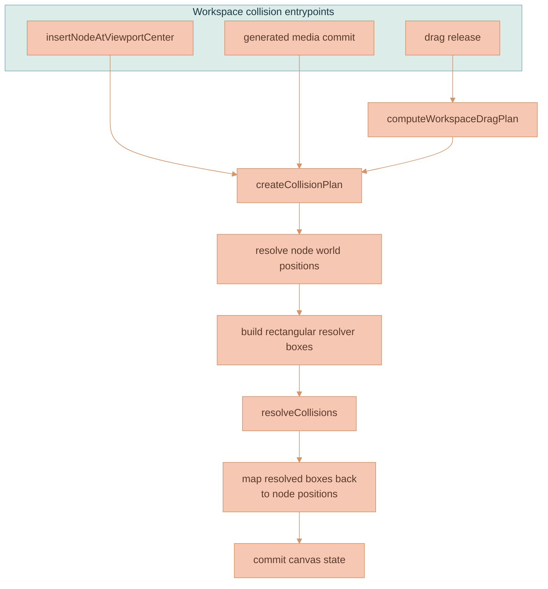

# Collision Resolution

Collision resolution keeps newly inserted and released workspace nodes from sitting on top of each other. When the toolbar drops a node at the viewport center, when a generation commits a new media node, or when a drag is released, the canvas nudges overlapping nodes apart so the surface stays legible.

This is a **workspace-engine behavior, not a Svelte behavior**. The Svelte wrapper may create domain objects after app/service work, but placement, viewport-coordinate math, drag-release planning, and collision resolution belong in [`services/web-ui/src/infographics/workspace`](../../services/web-ui/src/infographics/workspace) or shared infographics utilities — never in the component layer.


This page is part of the canvas domain. For the DOM/PIXI rendering architecture and canvas configuration ownership rules see [Rendering Engine](./RENDERING-ENGINE.md); for the workspace data model, node types, and user-facing canvas concepts see [Workspace Model](./WORKSPACE-MODEL.md).


## Two Layers

Collision resolution is implemented as two layers with a hard separation of concerns: a generic geometry resolver, and a workspace-aware plan that feeds it.

| Layer | File | Responsibility |
|---|---|---|
| Shared resolver | [`resolveCollisions.ts`](../../services/web-ui/src/infographics/utils/resolveCollisions.ts) | Geometry-agnostic. Accepts rectangular boxes and pushes overlapping boxes apart. Knows nothing about canvas node types, parentage, Svelte, PIXI, or viewport state. |
| Workspace plan | [`WorkspaceCanvas.ts`](../../services/web-ui/src/infographics/workspace/WorkspaceCanvas.ts) | Builds workspace-specific collision plans. Converts canvas nodes into world-space resolver boxes, applies parent/child exclusions, and converts resolved world positions back to persisted node positions. |

The split is deliberate: all workspace-specific knowledge (node types, generated-image metadata, parent-child containment, framework state) lives in the plan; the resolver stays a pure rectangle pusher that any future surface can reuse.

## Architecture

Every collision-producing entrypoint funnels into a single collision plan, which builds world-space boxes, runs the shared resolver, and remaps the results back onto node positions before committing canvas state.

| Component | Responsibility |
|---|---|
| `insertNodeAtViewportCenter(...)` | Renderer API used by toolbar insertions. Computes viewport-centered placement inside the workspace engine and resolves top-level collisions before emitting canvas state. |
| `computeWorkspaceDragPlan(...)` | Decides whether a drag release is allowed to run collision resolution and whether parent-container descendants participate in the drag. |
| `createCollisionPlan(...)` | Converts canvas nodes into world-space rectangular resolver boxes and adds parent/child exclusions. |
| `resolveCollisions(...)` | Shared rectangle resolver. It knows nothing about canvas node types, parentage, Svelte, PIXI, or viewport state. |

Workspace collision parameters live in `settings.workspaceCollision`. Each collision-producing flow (`insertion`, `dragRelease`, and `branchTree`) has per-canvas-node-type iterations, margin, and overlap threshold for `document`, `image`, `video`, `branchOrigin`, `branchFork`, and `branchLine`.

## Core Resolver

`resolveCollisions(...)` receives an array of boxes shaped like `{ id, x, y, width, height }` and returns a map of moved box positions by id. It returns **only the boxes that actually moved**, so callers can apply a minimal set of position updates.

The resolver flow is:

1. Expand each box by the requested margin.
2. Use any per-box margin / overlap-threshold overrides supplied by the workspace plan; otherwise use the resolver defaults.
3. Check every pair in an O(n²) loop.
4. Skip pairs listed in `excludePairs`.
5. Compute overlap on the x and y axes.
6. If both overlaps exceed the threshold, ask `shouldResolvePair(...)` whether the broad-phase overlap should be resolved.
7. Move both boxes apart along the smaller overlap axis.
8. Repeat until no boxes move or the iteration limit is reached.
9. Return only the boxes that actually moved.


This resolver must stay geometry-agnostic. Do **not** teach it about canvas node types, generated image metadata, parent-child containment, or framework state. Add workspace-specific behavior in the collision plan that feeds it.


## Branch-Tree Layout (Rigid-Box Separation)

Generated images and videos that share a lineage form a **branch tree** (see [Branch Lineage & Provenance](../media-generation/BRANCH-LINEAGE.md)). Trees are laid out by a deterministic tidy-tree algorithm that runs **before** the resolver — never inside it. This is the modular extension of the conflict-resolution system: a new pure sibling of the resolver, plus a workspace adapter, that reuses the unchanged resolver verbatim.

| Layer | File | Responsibility |
|---|---|---|
| Pure tidy tree | [`utils/layoutTree.ts`](../../services/web-ui/src/infographics/utils/layoutTree.ts) | Geometry-agnostic, block-allocation tidy-tree layout (left-to-right). Places abstract `{ id, parentId, width, height }` nodes; each subtree owns a disjoint vertical band, so the output is provably overlap-free. Knows nothing about the canvas, PIXI, or `branchId`. |
| Branch-tree adapter | [`workspace/branchTreeLayout.ts`](../../services/web-ui/src/infographics/workspace/branchTreeLayout.ts) | Builds the generated-media forest from canvas nodes + lineage edges, tidies each tree (roots keep their anchor), then feeds **one rigid bounding box per tree** plus one box per loose top-level node into the unchanged `resolveCollisions`. |

On every generated-media add/remove the affected trees re-tidy, then `rebalanceBranchTreesAndResolve(...)` hands the resolver rigid per-tree boxes. When a tree box is pushed, **every member translates by the same delta**, so a tree never loses its internal balance because an unrelated node moved nearby. The resolver itself is unchanged — only the *granularity* of the boxes it receives differs (one box per tree instead of one per node). This answers the "do loose nodes interact with trees?" question: they push each other only as whole rigid blocks, never by re-laying-out a tree.

## When Resolution Runs

Several user actions can produce overlapping nodes. Each routes through the resolver via the plan, but the trigger and the scope differ:

| Path | Collision behavior |
|---|---|
| Toolbar document/image insertion | Svelte creates the node data and calls `renderer.insertNodeAtViewportCenter(...)`. The renderer computes viewport-centered placement and resolves top-level collisions. |
| Image or video generation commit | The generated media node is added to the canvas, parent/child pairs are excluded, and the resolver can move colliding nodes. |
| Image-to-image branch continuation | The new media node is placed from the latest branch node, then the resolver can move colliding nodes. |
| Generated output placement beside source media | The new generated media node is placed near the source/reference bounds, then the branch tree re-tidies and top-level collisions are resolved. |
| Drag release | `computeWorkspaceDragPlan(...)` decides whether collision resolution is allowed. Single-node drags can resolve; rigid group drags preserve spacing; parent-container drags can resolve against top-level peers; selected branch-lineage marker groups can resolve so manually dragged markers never overlap each other. |

For generated-media commit placement specifically, the affected branch tree is re-tidied by `rebalanceBranchTreesAndResolve(...)` **first** (see [Branch-Tree Layout](#branch-tree-layout-rigid-box-separation)), and the resolver runs only as a rigid-box cleanup pass afterward. See [Branch Lineage & Provenance](../media-generation/BRANCH-LINEAGE.md) for how lineage placement is computed.


Do not duplicate this behavior in [`WorkspaceCanvas.svelte`](../../services/web-ui/src/components/WorkspaceCanvas.svelte). The Svelte file is a thin integration wrapper for DOM refs, stores, service calls, upload plumbing, and callbacks.


## Parent And Child Rules

Parented nodes create one special case: a parent container and its real children are **allowed** to overlap, because containment is the point. Before resolving collisions in full-node flows, `WorkspaceCanvas.ts` builds `excludePairs` for parent/child pairs so the generic resolver does not push children out of their container.

Coordinate spaces matter here. When a resolved child position is returned from the resolver, it is converted from world coordinates back to **parent-relative** coordinates before being persisted. Top-level nodes keep the resolved world position directly.

## Invariants

These properties must hold across all collision-producing flows:

- Collision resolution must run through `resolveCollisions.ts`. Do not create a second resolver in Svelte or a feature-specific component.
- Workspace-specific collision knowledge belongs in `WorkspaceCanvas.ts` or a workspace utility, not in the generic resolver.
- Parent/child pairs must be excluded from collision resolution so containment does not push children out of their parent container.
- Persisted child positions must remain parent-relative after world-space collision resolution.
- Group drags must preserve rigid spacing unless the drag plan explicitly allows collision resolution.
- Generated branch media is laid out by the tidy-tree algorithm first ([`layoutTree.ts`](../../services/web-ui/src/infographics/utils/layoutTree.ts) → [`branchTreeLayout.ts`](../../services/web-ui/src/infographics/workspace/branchTreeLayout.ts)); the resolver receives one rigid box per tree as a cleanup pass and never lays out the tree itself.

## Troubleshooting

| Symptom | Likely cause | Check |
|---|---|---|
| A newly inserted toolbar node overlaps an existing node | Insertion bypassed `renderer.insertNodeAtViewportCenter(...)` or top-level resolution | Check `WorkspaceCanvas.svelte` for direct position/collision logic. |
| Children are pushed out of a parent container after drag | Parent/child `excludePairs` were not passed to the resolver | Check the collision-exclusion set before `resolveCollisions(...)`. |
| Adopted child nodes persist at wrong coordinates | Resolved world position was not converted back to parent-relative position | Check `toParentRelativePosition(...)` usage after collision resolution. |
| Multi-selected nodes lose their spacing after drag | Drag plan allowed global collision resolution for a rigid group move | Check `computeWorkspaceDragPlan(...)` in `workspaceDragPlan.ts`. |

## Related Documentation

- [Rendering Engine](./RENDERING-ENGINE.md) documents the full DOM/PIXI canvas rendering architecture and canvas configuration ownership rules.
- [Workspace Model](./WORKSPACE-MODEL.md) documents the workspace feature, data flow, node types, and user-facing canvas concepts.
- [Branch Lineage & Provenance](../media-generation/BRANCH-LINEAGE.md) documents how generated-media nodes are placed by lineage before collision resolution runs as a cleanup pass.
