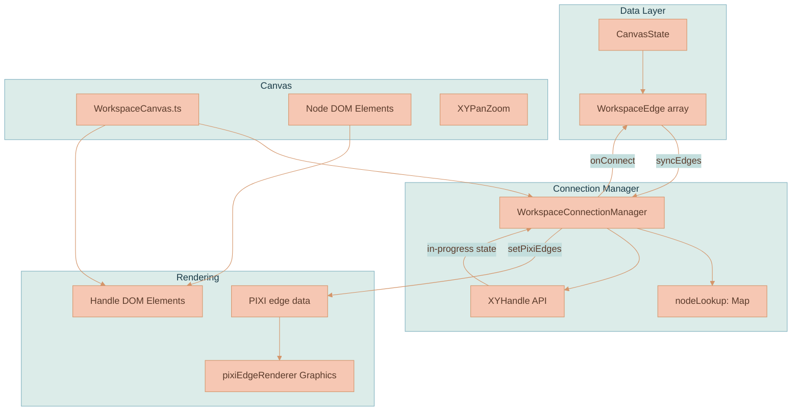
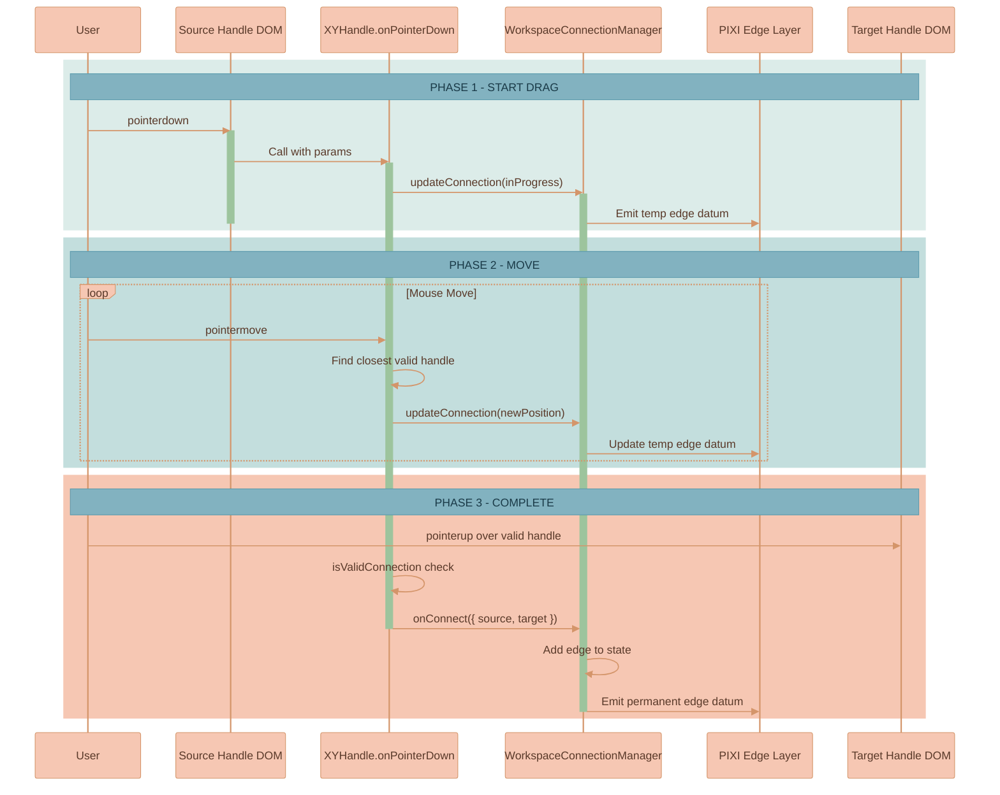
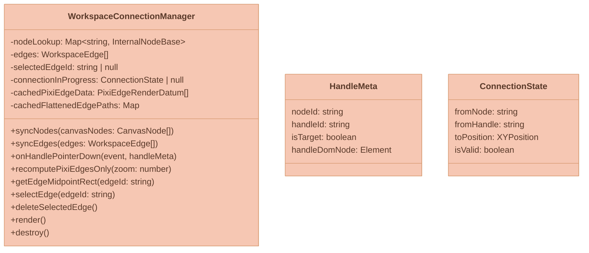
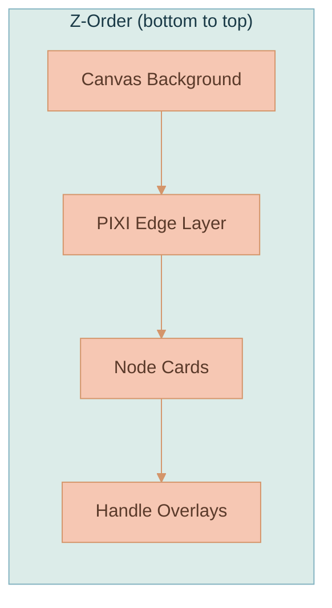
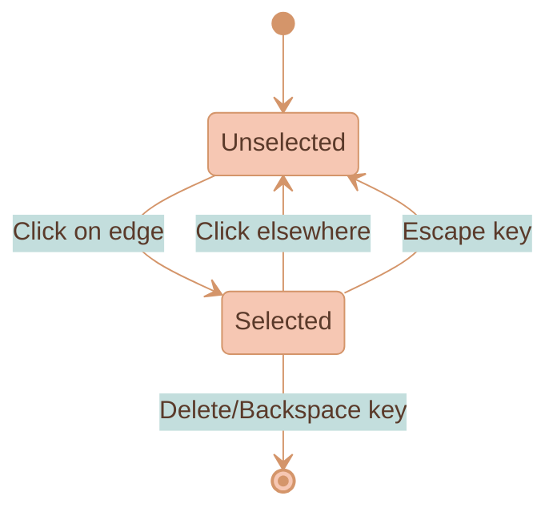
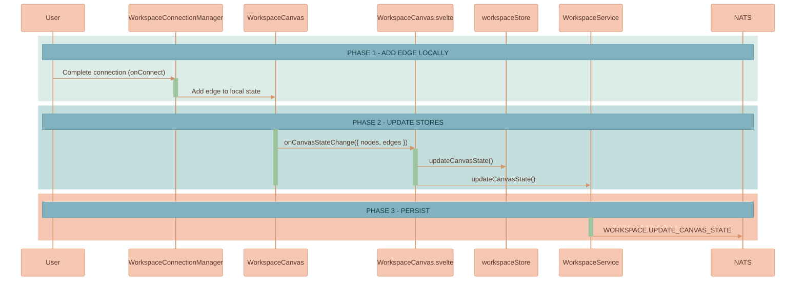

# Edges & Connections

Visual connections (edges/arrows) between canvas nodes let users show relationships, context flows, and dependencies between workspace entities. A user drags from a handle on one node to another to create a relationship line. Edges are not purely cosmetic: an edge-connected node is force-included in the AI context for a chat turn, and an edge with a `sourceMessageId` records which AI response produced a generated image. That data shape is defined in [Workspace Model](./WORKSPACE-MODEL.md#workspaceedge); this page covers how connections are made, routed, drawn, selected, and persisted.


This page is part of the canvas domain. For the `WorkspaceEdge` schema and the surrounding data model see [Workspace Model](./WORKSPACE-MODEL.md). For how edge geometry is painted into the PIXI layer and kept aligned with the DOM see [Rendering Engine](./RENDERING-ENGINE.md). For how `sourceMessageId` feeds AI context resolution see [Context Relevance](../ai-chat/CONTEXT-RELEVANCE.md).


## Key Features

- **Connection handles** on each node (visible on hover).
- **Drag-to-connect** interaction using `XYHandle.onPointerDown` from `@xyflow/system`.
- **Edge rendering** through PIXI edge data produced by [`WorkspaceConnectionManager.ts`](../../services/web-ui/src/infographics/workspace/WorkspaceConnectionManager.ts) and drawn by [`pixiEdgeRenderer.ts`](../../services/web-ui/src/infographics/workspace/rendering/pixiEdgeRenderer.ts).
- **Edge selection and deletion** (click to select, Delete/Backspace to remove).
- **Persistence** of edges in `CanvasState`.

## Architecture

`CanvasState` owns the array of edges. `WorkspaceConnectionManager` keeps a node lookup and drives the `XYHandle` API; it produces PIXI edge data that the PIXI edge renderer draws, while handle DOM elements sit on top of node cards as the interaction surface.



## Connection Flow

A connection is a three-phase drag: pointer-down on a source handle starts an in-progress edge, pointer-move tracks the closest valid handle and updates a temporary edge datum, and a pointer-up over a valid handle commits a permanent edge.



## WorkspaceConnectionManager

The connection system's brain lives at [`WorkspaceConnectionManager.ts`](../../services/web-ui/src/infographics/workspace/WorkspaceConnectionManager.ts). It owns the node lookup, the in-progress connection state, the edge list, the selected-edge state, and the cached PIXI edge data and flattened paths used for hit testing.



### Responsibilities

- Maintains `nodeLookup` (a Map of node ID → internal node representation with handle bounds).
- Tracks in-progress connection state for rendering the temporary line.
- Validates connections (no duplicates, no self-loops).
- Delegates to `XYHandle.onPointerDown` for the actual drag interaction.
- Builds PIXI edge render data from shared connector path math.
- Uses cached flattened PIXI path data for edge hit testing and bubble-menu anchoring.
- Manages edge selection state.

## Handle DOM Elements

Each workspace node has connection handles at the left (target) and right (source) edges:

```text
┌─────────────────────────────────────────┐
│ ○                                     ○ │
│ left                               right│
│ (target)                         (source)│
│                                         │
│         Node Content                    │
│                                         │
└─────────────────────────────────────────┘
```

Handles are:

- Hidden by default, shown on node hover (CSS).
- Marked with `data-nodeid`, `data-handleid`, and `data-handlepos` attributes (required by `XYHandle`).
- Wired with a `pointerdown` listener that calls `WorkspaceConnectionManager.onHandlePointerDown`.

## Edge Rendering

Edges are rendered as PIXI `Graphics` by [`pixiEdgeRenderer.ts`](../../services/web-ui/src/infographics/workspace/rendering/pixiEdgeRenderer.ts). `WorkspaceConnectionManager` builds edge render data with shared path helpers from [`paths.ts`](../../services/web-ui/src/infographics/connectors/paths.ts), then sends it to the PIXI media layer for drawing, hit testing, and bubble-menu anchoring. For the full DOM/PIXI ownership split and the viewport bridge that keeps the two layers aligned, see [Rendering Engine](./RENDERING-ENGINE.md).



Edge styling:

- **Path type**: `horizontal-bezier`.
- **Stroke width**: `2px` from the zoom-compensation floor upward.
- **Marker (arrowhead) size**: `16px` from the zoom-compensation floor upward.
- **Color**: CSS connector custom properties from the workspace pane, using the focus color when selected.
- **Dashes**: temporary (in-progress) and proximity edges render dashed.

## Routing

`WorkspaceConnectionManager` handles edge state and path planning, while `pixiEdgeRenderer.ts` draws committed edges as PIXI graphics. The routing style is configured in `settings.connector.lineCurve`; the current default is `horizontal-bezier`.

| Behavior | Rule |
|----------|------|
| **Auto-alignment** | If a source node is vertically aligned with its target, the connection snaps to a perfectly straight horizontal line by adjusting `targetT`. |
| **Corner snapping** | If nodes are not aligned, the connector snaps to the nearest top/bottom corner (`t = 0.05` or `t = 0.95`) to minimize diagonal visual clutter. |
| **Drag visualization** | While dragging, connections use a smooth bezier curve to distinguish them from committed orthogonal edges. |
| **Message-level anchoring** | See [Message-Level Anchoring](#message-level-anchoring) below. |

## Message-Level Anchoring

When an edge has a `sourceMessageId` — connecting a specific AI response to a generated image — the renderer dynamically calculates `sourceT` to anchor the arrow exactly to that message bubble in the DOM. It also intelligently adjusts `targetT` so the arrow points in a straight line to the target image height, preventing the "diving arrow" effect where a connector would otherwise plunge diagonally toward the image's vertical center.

The `sourceMessageId` is the same property defined on `WorkspaceEdge` (see [Workspace Model](./WORKSPACE-MODEL.md#workspaceedge)); it ties a generated image back to the exact `aiResponseMessage` that produced it, and that linkage is what lets context extraction associate images with their originating conversation turns ([Context Relevance](../ai-chat/CONTEXT-RELEVANCE.md)).

## Proximity Connect

Dragging a node (Document or Image) near an AI Chat Thread automatically suggests a connection with a dashed "ghost" line. Dropping the node creates the link. The proximity threshold is **1200px**, and the system prevents duplicate connections. This makes it easy to pull source material into a thread's context without precisely targeting a handle.

## Edge Selection and Deletion

An edge starts unselected; clicking it selects it (and shows a bubble menu below the edge with a Delete action). Clicking elsewhere or pressing Escape deselects it; Delete or Backspace removes the selected edge.



When an edge is selected, it is visually highlighted and a bubble menu appears below the edge with a Delete action. Hit testing for selection uses the cached flattened PIXI path data maintained by the connection manager.

## Edge Persistence

Edge changes follow the same pattern as node changes — committed locally first, pushed into the stores, then persisted over NATS via `WORKSPACE.UPDATE_CANVAS_STATE`. Unlike debounced pan/zoom, edge create/delete/reconnect persists immediately.



## Related Pages

- [Workspace Model](./WORKSPACE-MODEL.md) — the `WorkspaceEdge` schema, `CanvasState`, and persistence cadence.
- [Rendering Engine](./RENDERING-ENGINE.md) — the PIXI edge layer, z-order, and DOM/PIXI alignment.
- [Context Relevance](../ai-chat/CONTEXT-RELEVANCE.md) — how edge-connected nodes and `sourceMessageId` feed AI context.
- [Branch Lineage & Provenance](../media-generation/BRANCH-LINEAGE.md) — how generated-image edges are created with `sourceMessageId` during a branch.
