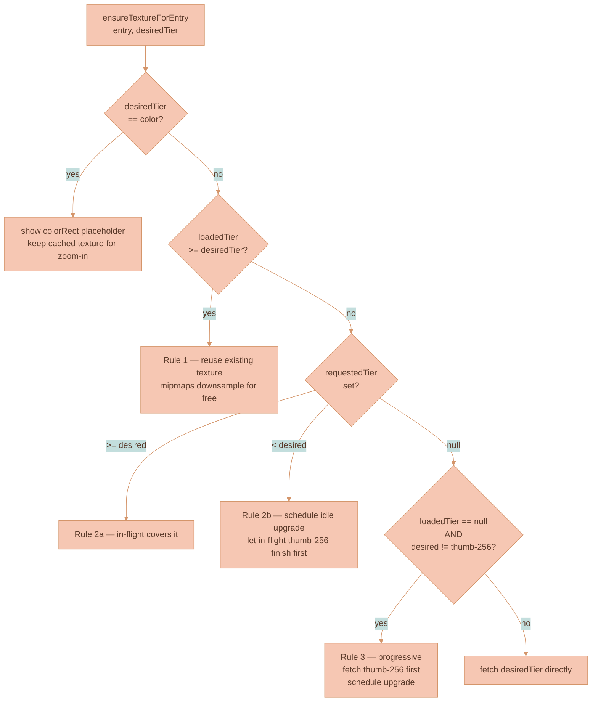

# Image Rendering Performance

This page documents the throughput and memory machinery of the PIXI media layer: the level-of-detail (LoD) tier system, the texture-loading rules, visibility-driven loading, idle prefetch, the six-worker decode pool, the texture cache, mipmaps, and the diffed edge renderer. It also catalogs what has already been optimized, the known issues a future round of work should tackle, and every tuning constant that exists today.

For the renderer ownership split, the layer stack, the viewport bridge, the sync pipeline, and the PIXI initialization contract that this machinery plugs into, see [Rendering Engine](./RENDERING-ENGINE.md). That page is the spine; this page is the performance detail.

## Image Rendering Pipeline

### LoD Tiers

Zoom level maps to a level-of-detail tier:

| Zoom range | Tier | What it loads |
|------------|------|---------------|
| `< 0.1` | `color` | Just a tinted `Graphics` rect — no texture |
| `0.1 – 0.4` | `thumb-256` | URL with `?size=256` |
| `0.4 – 1.0` | `thumb-1024` | URL with `?size=1024` |
| `≥ 1.0` | `full` | Full-resolution URL |

`tierRank()` orders the tiers (`color < thumb-256 < thumb-1024 < full`).

### Texture Loading Rules

The `ensureTextureForEntry(entry, desiredTier)` function is idempotent and follows three cardinal rules:

**Rule 1 — never downgrade.** Mipmaps make a `full`-resolution texture render perfectly at any zoom level; refetching `thumb-256` when `full` is already on the GPU is pure waste and was the root cause of zoom-out lag.

**Rule 2 — never duplicate in-flight.** If a request is already in flight that covers our needs, do nothing. If it's a lower tier (the progressive thumb-256 first step), schedule an idle upgrade and let the in-flight request finish.

**Rule 3 — progressive thumb-256 first.** When an entry has nothing loaded yet and the desired tier is bigger than `thumb-256`, load `thumb-256` first for instant visual feedback, then schedule a background upgrade to the desired tier in idle time.

### Visibility-Driven Loading

Texture fetches are gated by visibility. `updateVisibleImages()`:

1. Computes the visible world rect with a `VISIBILITY_MARGIN = 1200` world-unit ring.
2. Searches the RBush spatial index for entries whose rects intersect.
3. For each entry:
   - If visibility transitioned (true ↔ false), updates `sprite.renderable` and `colorRect.renderable`.
   - If visible, calls `ensureTextureForEntry(entry, currentTier)` (idempotent — no-op if already loaded).

Non-visible entries keep any cached texture they have. They will get their textures evicted only under genuine cache pressure (see [Texture Cache](#texture-cache) below).

### Idle Prefetch

`schedulePrefetch()` runs in `requestIdleCallback` slots (with a `setTimeout` fallback) and prefetches `thumb-256` for **all** unloaded entries in the workspace, sorted by world-distance from viewport centre. A `PREFETCH_BATCH_SIZE = 20` cap means each idle tick processes only the 20 nearest unloaded entries; if more remain, the next idle slot picks them up.

This gives the canvas an "always-warm" cache: panning around the workspace reveals images that already have a texture on the GPU, so there is no progressive-fetch flash.

### Decode Pool

Decoding goes through `pixiImageDecoder.ts`, which lazily spawns up to **6 web workers** in a round-robin pool. Six matches the typical browser per-origin connection limit so every available TCP slot is used for image fetching while multiple CPU cores handle the (CPU-bound) `createImageBitmap` step in parallel.

A single shared auth-token promise is reused across all concurrent `resolveImageSrc` calls in a 30-second window so 200 in-flight image loads don't each invoke `getTokenSilently()` independently.

### Texture Cache

`textureCache: Map<url, { texture, bytes, refCount, lastUsed }>` deduplicates GPU uploads by URL. Each `acquireTexture(url)` either returns the cached entry (bumping `refCount` + `lastUsed`) or decodes and creates a new texture.

Limits: **2000 textures** OR **768 MB**. When either ceiling is exceeded, `evictTextures()` runs in two passes:

1. **Idle eviction (LRU)**: drop textures with `refCount == 0` (already detached from any sprite), oldest first.
2. **Pressure eviction**: under genuine memory pressure, detach textures from **non-visible** sprites (LRU first), so their cache slot can be reclaimed. The sprite reverts to its color placeholder; visibility re-fetches the right tier on demand. **Visible sprites are never evicted from under the user.**

### Mipmaps

Every texture is created with `texture.source.autoGenerateMipmaps = true` before its first GPU upload. Without mipmaps, a 1024 px texture rendered at 10 px (zoom 0.01×) forces the GPU to sample the full 1 MB texel buffer for each output pixel — catastrophic with hundreds of images visible. With mipmaps, the GPU selects the pre-computed 8 × 8 or 16 × 16 MIP level and texture-cache pressure drops by ~4 orders of magnitude.

### Edge Renderer

`pixiEdgeRenderer.ts` reuses `Graphics` objects across renders. Each edge is keyed by `id` and has a fingerprint (`svgPath | strokeColor | strokeWidth | arrows`); the `Graphics` is only repainted when the fingerprint changes. Removed edges are destroyed; new ones are allocated. This eliminates the original O(edges) destroy + alloc + GPU-upload cycle on every `scheduleEdgesRender` call.

## Performance: What Has Been Optimized

The PIXI media layer has gone through several rounds of perf hardening. The current state:

| Optimization | What it does |
|-------------|--------------|
| **Six-worker decode pool** | Replaces a single decode worker. Image fetch + decode runs on up to 6 CPU cores simultaneously, saturating the browser's per-origin connection limit instead of serializing every decode behind a single message handler. |
| **Mipmaps on every texture** | `autoGenerateMipmaps: true` so zoom-out doesn't sample full-resolution texels. |
| **Shared auth token** | All concurrent `resolveImageSrc` calls share one `getTokenSilently()` promise (refreshed every 30 s) so 200 in-flight loads don't each await an independent auth round-trip. |
| **Auto-ticker disabled** | `autoStart: false` + `app.ticker.stop()`. All renders are rAF-coalesced via `scheduleRender()` so an idle canvas costs zero GPU. |
| **rAF-coalesced visibility scan** | 60 Hz wheel-zoom triggers one `updateVisibleImages()` per frame, not 60. |
| **Lazy texture loads (visibility-driven)** | Textures are loaded only for sprites whose world rects intersect the visible margin; non-visible sprites cost zero network. |
| **Never-downgrade tier policy** | Once a higher-tier texture is on the GPU, zoom-out never re-fetches a lower tier — mipmaps handle downsampling for free. |
| **Progressive `thumb-256`-first** | First-paint loads tiny thumbnails for visible sprites; full-tier upgrades happen in idle. |
| **Idle prefetch (capped)** | Up to 20 unloaded entries per idle tick get pre-cached at `thumb-256`, sorted by viewport distance. Pan reveals already-loaded images. |
| **DOM `` pixel surface eliminated** | Canvas image nodes contain no DOM image element; PIXI is the only image pixel renderer for stored, external, and generated-partial sources. |
| **DOM video playback split** | Completed videos use PIXI only for poster/placeholder geometry and keep the real `<video>` visible in chrome, so playback and scrubbing do not drive a PIXI video texture loop or interfere with connector rendering. |
| **Visual-state-gated PIXI `sync()`** | Media entries resync on initial create, full DOM rerenders, local commits, and store renders with node/edge visual changes. Viewport-only renders do not upsert media entries. |
| **Incremental RBush** | The spatial index is updated per-node (`remove` + `insert`) only when geometry actually changed, avoiding full rebuilds on every sync. |
| **`drawColorRect` skip-when-unchanged** | Placeholder geometry is only rebuilt when the node's width or height actually changed; transform updates are matrix-only. |
| **`syncDomOwnership` skip when no-op** | `classList.toggle` only runs for nodes whose ownership state actually changed. |
| **PIXI edge renderer diff** | `Graphics` objects are reused across renders; geometry is only repainted when the edge fingerprint changes. |

## Known Performance Issues and Improvement Opportunities

These are the issues a future round of work should tackle. Listed in priority order — biggest gains first.

### 1. The API does not actually serve resized thumbnails


**This is the biggest unrealized win in the entire LoD system.**


`pixiMediaLayerLogic.addPixiLodSizeParam()` appends `?size=256` or `?size=1024` to the image URL. The API handler at [`services/api/src/routes/file-routes.ts`](../../services/api/src/routes/file-routes.ts) (`GET /:workspaceId/:fileId`) **ignores those query params completely** and serves the full-resolution object back from NATS Object Store. The `?size=` value only changes the URL string, not the bytes.

Consequences:

- **`thumb-256` and `thumb-1024` requests download the same bytes as `full`.** The progressive `thumb-256`-first strategy currently doesn't make first-paint faster on the network side; it only helps because the GPU upload is smaller after decode (since `createImageBitmap` decodes the original size).
- **Browser cache is fragmented by URL.** A `thumb-256` and a `full` request for the same image are two separate cache entries with the same bytes. Effective cache hit rate for stored images is much lower than it should be.
- **Idle prefetch downloads full-size payloads.** Caching the entire workspace at "thumb-256" is, today, caching the workspace at full resolution.

**Fix options, in increasing complexity:**

1. **Resize on the API.** Add a `?size=` aware handler that pipes the NATS object through `sharp` (or equivalent) into a 256 / 1024 resized buffer. Store resized variants in a small in-memory or on-disk cache keyed by `(fileId, size)`. This is a small backend change with very large frontend impact.
2. **Server-side proxies generated at upload time.** When an image is uploaded, also store `fileId.thumb-256.webp` and `fileId.thumb-1024.webp` in NATS Object Store. The GET handler picks the right key based on the size param. No on-request resize cost.
3. **Client-side resize on first decode.** After decoding the full bitmap, downscale to the tier dimensions inside the decode worker and only upload the smaller texture to the GPU. Saves GPU memory and PCIe upload bandwidth, but doesn't save network or main-thread decode CPU.

**Recommended: option 2.** Generate `thumb-256.webp` and `thumb-1024.webp` at upload time, both in NATS Object Store. Adds at most ~20 % storage but gives instant LoD payloads for every viewport size. WebP at 75 % quality for a 256 × 256 image is typically ~10 KB, so the entire workspace cache fits comfortably in RAM.

### 2. `getComputedStyle` on every edge render

`WorkspaceConnectionManager.render()` reads `--connector-line-default-color` and `--connector-line-focus-color` via `getComputedStyle(paneEl)` on every render. `getComputedStyle` can force a style flush.

**Fix:** cache the resolved CSS variable values once at construction and on a `MutationObserver` for `<html>` class changes (theme toggle).

### 3. `selectEdge` triggers a synchronous, non-coalesced render

`WorkspaceConnectionManager.selectEdge()` calls `this.render()` synchronously — it does not go through the `scheduleEdgesRender()` rAF coalescer. For a graph with hundreds of edges, clicking to select one runs a full edge-data rebuild + PIXI repaint outside the frame loop.

**Fix:** route `selectEdge` through `scheduleEdgesRender()`. Selection ID is mutated synchronously; render is deferred.

### 4. Selection / marquee / group overlay `Graphics.clear()` per update

`setSelectedImageNodes`, `setMarqueeRect`, and `setSelectionOverlayBounds` always call `g.clear()` and rebuild geometry, even when the bounds and zoom-dependent stroke width haven't changed within an epsilon. Less impactful than the image-side `drawColorRect` skip but the same shape of optimization.

**Fix:** mirror the `colorRectW / colorRectH` skip pattern in those three functions.

### 5. Workspace-switch full sprite teardown

When the user switches workspaces, every PIXI sprite + `Graphics` is destroyed and re-created. For users moving between two image-heavy workspaces back-to-back, this flushes both texture and sprite caches.

**Fix:** key the texture cache by `(workspaceId, fileId, tier)` (it already is, via `acquireTexture(url)` URLs) but **don't** call `destroy()` on every sprite during workspace switch — keep them parked in a pool keyed by `nodeId`, and reuse the pool when the user comes back. A LRU on the pool prevents unbounded memory.

This is a bigger refactor (multi-workspace sprite lifecycle) and only worth doing if profiling shows the pattern is common.

### 6. PIXI v8 VRAM regression for large texture counts

PIXI v8 (any 8.x version) has a known regression where `Texture.from(bitmap)` uses ~2× the GPU memory of v7 because the WebGPU upload path internally converts ImageBitmap → canvas, doubling the allocation (see [pixijs/pixijs#11331](https://github.com/pixijs/pixijs/issues/11331)). The fix landed in a PR merged ~May 2025 and Lixpi pins `^8.14.0` to pick it up. **Verify with `pnpm why pixi.js` that the resolved version is ≥ 8.14.0** — if a transitive dependency pins an older 8.x, the regression returns and Safari iOS will crash on workspaces with dozens of images.

### 7. Decode worker pool has no priority

The 6-worker decode pool is round-robin. There is no notion of "the user is looking at this area right now, prioritize it over background prefetch." If the user opens a large workspace and immediately starts panning, prefetch decodes still occupy worker slots even though visibility-driven decodes for the focus area should jump the queue.

**Fix:** add an `urgent: boolean` flag to `decodeImageInWorker(url, urgent)`. Maintain two queues per worker; drain `urgent` before `normal`. `ensureTextureForEntry` calls from `updateVisibleImages` set `urgent: true`; calls from `schedulePrefetch` set `urgent: false`.

### 8. No connection-aware backoff

If the API is slow or returning errors, the PIXI layer keeps retrying indefinitely (each visibility pass calls `ensureTextureForEntry` which fires a new fetch on every error path). With hundreds of nodes this can hammer a struggling backend.

**Fix:** track per-entry retry count + last error timestamp. On error, set a cooldown (`Math.min(2 ** retries, 30) * 1000` ms) before another fetch is allowed for that entry. Reset on success.

## Performance Tuning Constants

When tuning, these are the knobs that exist today (all in `pixiMediaLayer.ts` unless noted):

| Constant | Default | What it does | When to change |
|----------|---------|--------------|----------------|
| `VISIBILITY_MARGIN` | `1200` | World-unit margin past the viewport. Sprites within this band are eligible for texture loading. | Increase for smoother pan reveal at the cost of more in-flight loads. |
| `PREFETCH_MARGIN` | `4000` | Reserved margin for a prefetch ring; current prefetch loops over all entries. | Re-introduce as a hard cap if prefetch becomes too aggressive on huge workspaces. |
| `PREFETCH_BATCH_SIZE` | `20` | Max entries processed per idle prefetch tick. | Lower if idle decoding starves urgent visibility loads; raise if first-screen prefetch is too slow. |
| `MAX_TEXTURES` | `2000` | Hard count limit for the texture cache. | Lower on memory-constrained devices (iPad, mobile). |
| `MAX_TEXTURE_BYTES` | `768 MB` | Hard byte limit for the texture cache. | Lower for low-VRAM devices. WebGL on iPad has ~256 MB practical ceiling. |
| `POOL_SIZE` (`pixiImageDecoder.ts`) | `6` | Decode worker pool size. | Match to typical browser per-origin connection limit; do not exceed it. |
| Token re-resolve window | `30_000` ms | How long the shared auth token is reused before re-fetching. | Lower if tokens have a shorter TTL than 30 s. |

## Related pages

- [Rendering Engine](./RENDERING-ENGINE.md) — the renderer ownership split, layer stack, viewport bridge, sync pipeline, render scheduling, and PIXI initialization contract that this performance machinery plugs into.
- [Rendering Architecture for a Media-Heavy Canvas](../knowledge/RENDERING-ARCHITECTURE-FOR-MEDIA-HEAVY-CANVAS.md) — the canonical rationale for the DOM/PIXI split.
