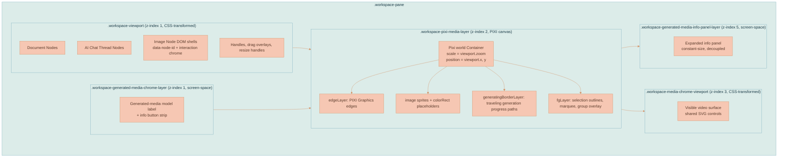
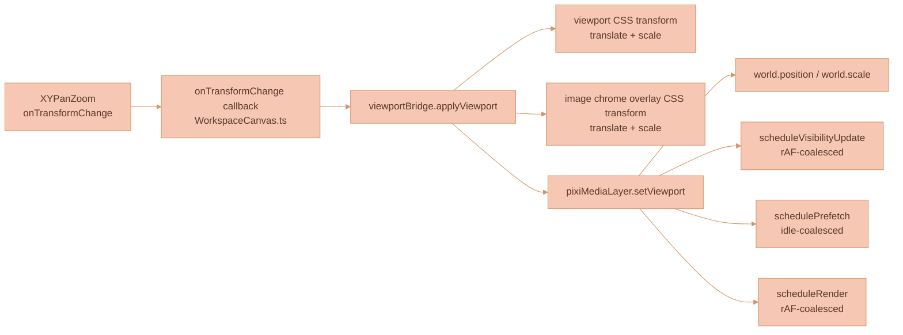
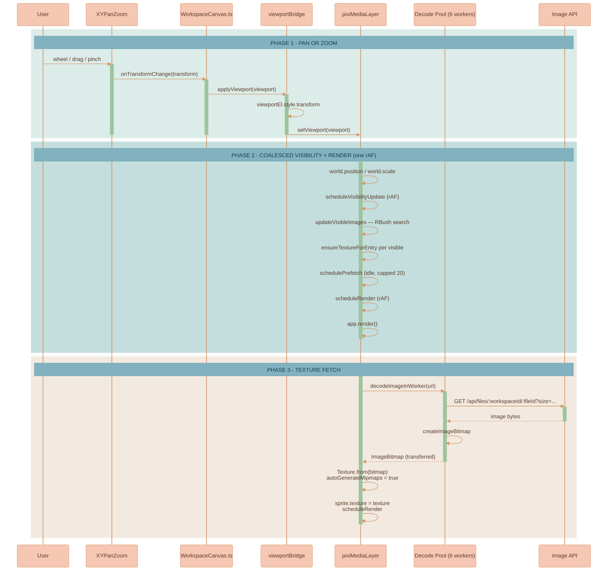

# Rendering Engine

The workspace canvas is a **DOM interaction shell with PIXI v8 visual layers**. Two renderers cooperate, split by workload rather than by node type:

- **DOM** owns text-rich controls and interaction structure: ProseMirror, the workspace-owned AI Chat panel and Sessions surface, the right-side Media Library panel, prompt inputs, bubble menus, resize/drag/selection orchestration, parent-child containment, and handles. The AI Chat panel can be open with zero tabs; its UI state is persisted in canvas state.
- **PIXI v8** owns high-volume pixels, connector strokes, and canvas chrome: image pixel rendering, video poster/placeholder rendering, generated-image progress outlines, workspace connector pixels, image-node selection chrome, and marquee/group overlays.

This page covers that split and the machinery that keeps DOM and PIXI in lockstep: the layer stack, the viewport bridge, viewport state ownership, the sync pipeline, render scheduling, and the PIXI initialization contract.


The canonical architectural rationale — *why* the canvas splits work between DOM and PIXI, and what the leading media-heavy canvases do — lives in [Rendering Architecture for a Media-Heavy Canvas](../knowledge/RENDERING-ARCHITECTURE-FOR-MEDIA-HEAVY-CANVAS.md). This page documents the *current implementation*; that page documents the *decision*.


The renderers map to concrete modules:

| Renderer | Owns | Module |
|----------|------|--------|
| PIXI media layer | Image pixels, video posters/placeholders, generated-image progress outlines, connector pixels, image-node selection chrome, marquee/group overlays | [`pixiMediaLayer.ts`](../../services/web-ui/src/infographics/workspace/pixiMediaLayer.ts) |
| DOM video chrome | Completed video playback and controls in the transformed chrome layer (browser-composited `<video>`) | See [Video Player Controls](../media-generation/VIDEO-PLAYER-CONTROLS.md) |
| Reusable PIXI outline | Traveling progress outlines | [`pixiTravelingOutlineRenderer.ts`](../../packages/lixpi/canvas-engine/src/frontend/rendering/progress/pixiTravelingOutlineRenderer.ts) |

The current path is **renderer ownership by workload**: DOM owns text-rich controls and interaction structure; PIXI owns high-volume pixels, connector strokes, and canvas chrome.

## Why This Matters

When working on canvas code, you need to know two libraries:

1. **`@xyflow/system`** for pan/zoom and connection math (no Svelte/React wrappers). The Svelte layer (`WorkspaceCanvas.svelte`) is a thin binding.
2. **PIXI v8** for the media layer (`Application`, `Container`, `Sprite`, `Texture`). The PIXI documentation is the source of truth: <https://pixijs.com/8.x/guides/components/application>.

For everything about level-of-detail tiers, the texture cache, the decode pool, mipmaps, the edge renderer diff, and the performance tuning constants, see [Image Rendering Performance](./IMAGE-RENDERING-PERFORMANCE.md). This page covers ownership and the per-frame sync machinery; that page covers throughput and memory.

## Canvas implementation code

The active canvas implementation lives in `services/web-ui/src/infographics/`. Key files:

| File | Purpose |
|------|---------|
| `workspace/WorkspaceCanvas.ts` | Main canvas orchestrator: DOM nodes, ProseMirror integration, drag/resize/selection, viewport, and PIXI media sync points |
| `workspace/aiChatPanelState.ts` | Persisted AI Chat panel defaults and context-chip sanitization |
| `workspace/mediaLibraryPanel.ts` | Framework-agnostic Media Library surface: Feature adapter, saved image/video browsing, scope filters, and insertion actions |
| `workspace/media-library-panel.scss` | Right-side Media Library layout and full-content wrapping rules |
| `packages/lixpi/canvas-engine/src/shared/collision/resolve-collisions.ts` | Shared geometry-agnostic rectangle collision resolver used by workspace insertion, generated image commit, and drag-release cleanup paths |
| `workspace/pixiMediaLayer.ts` | PIXI v8 media layer for image pixels, video posters/placeholders, and generated-image outline synchronization — sprite registry, texture cache, LoD-tier loader, visibility scanner, prefetch scheduler |
| `workspace/pixiMediaLayerLogic.ts` | Pure helpers: tier ranking, world-position math, src URL building, LoD-size param injection, world-rect math |
| `packages/lixpi/canvas-engine/src/frontend/rendering/progress/pixiTravelingOutlineRenderer.ts` | Reusable PIXI traveling outline renderer — rounded-path math, track/segment painting, shared easing, active-only animation loop |
| `workspace/pixiImageDecoder.ts` | Six-worker decode pool: round-robin dispatch with per-worker request tracking |
| `workspace/pixiImageDecodeWorker.ts` | Worker body: `fetch` → `createImageBitmap` and post the bitmap back |
| `workspace/rendering/pixiEdgeRenderer.ts` | PIXI edge renderer (diffed; reuses `Graphics`) |
| `workspace/rendering/viewportBridge.ts` | Single call site that applies a viewport to DOM CSS and PIXI media |
| `workspace/branchTreeLayout.ts` | Builds the generated-media branch forest, lays each lineage out as a balanced tidy tree, and feeds rigid per-tree boxes to the shared resolver (see [Collision Resolution](./COLLISION-RESOLUTION.md)) |
| `packages/lixpi/canvas-engine/src/shared/tree-layout/layout-tree.ts` | Pure, geometry-agnostic block-allocation tidy-tree layout reused by `branchTreeLayout.ts` |
| `workspace/rendering/mediaNodeRegistry.ts` | Dispatches non-image media nodes to specialized handlers; video nodes are handled by `videoNodeHandler.ts` |
| `workspace/rendering/videoNodeHandler.ts` | Video node renderer that owns PIXI poster/placeholder sprites and the authenticated `HTMLVideoElement` consumed by DOM video chrome |
| `workspace/workspaceRenderStatePlan.ts` | Pure render-state reconciliation for pending local visual commits while store acknowledgements arrive |
| `workspace/workspaceViewportStatePlan.ts` | Pure stale viewport-only render guard; keeps delayed store viewport updates from overriding the live transform |
| `workspace/WorkspaceConnectionManager.ts` | Edge creation, proximity connect, candidate detection, and the data feed for `pixiEdgeRenderer` |
| `packages/lixpi/canvas-engine/src/frontend/connectors/index.ts` | Frontend connector exports for path helpers and connection utilities |
| `packages/lixpi/canvas-engine/src/shared/zoom-scaling/zoom-scaling.ts` | Shared bounded zoom-scaling helpers for connector chrome, canvas bubble menus, generated-media icon strips, and resize handles |

Use the incremental canvas architecture documented here as the implementation recipe: preserve the existing `infographics/workspace` entrypoint, harden the PIXI media layer, and move one renderer responsibility at a time only after parity checks pass.

## Canvas Configuration Ownership

All configurable web UI settings belong in [`settings.ts`](../../services/web-ui/src/settings.ts). This includes feature flags, colors, shadows, dimensions, gaps, hit radii, animation timing, title sizing, generated-image placement spacing, and other values that product/design tuning may reasonably adjust without changing the interaction algorithm.

Do not add new configurable magic-number constants or UI behavior flags directly to [`WorkspaceCanvas.ts`](../../services/web-ui/src/infographics/workspace/WorkspaceCanvas.ts), Svelte wrappers, PIXI rendering layers, or helper modules. Add them to `settings` first and read them from the consuming code. For example, the AI chat resize/drag rail hit target lives at `settings.aiChatThread.rail.dragGrabWidth`, and the Media Library uses `settings.mediaLibrary.panelWidthFraction`.

`settings` must stay organized by logical groups. Each top-level group is its own subsection, such as `aiChatThread`, `connector`, `selection`, or `mediaNode`; a group may contain nested subsections when a domain has a clear child domain, such as `aiChatThread.rail` or `mediaNode.image`. Every group and nested group must have a blank line before and after it in the object literal. Every key must have a short comment explaining what the value means and how changing it affects the application. Do not create a second global web UI settings module.

Use object getters in `settings` only when a setting must compute its value from sibling keys with `this`, such as a `styles` list referencing sibling `palettes`. Static values must remain plain properties; do not use getters just to organize or label settings.

## `@xyflow/system` reference

The vendored `@xyflow/system` package has its own documentation set stored in [`../vendor-documentation/xyflow/`](../vendor-documentation/xyflow/overview.md). Start from the top-level guide and follow its links to per-module docs:

```text
documentation/vendor-documentation/xyflow/
  overview.md                    ← start here (system vs wrappers, limitations, Lixpi integration)
  src/
    ├── pan-zoom.md              — Viewport pan & zoom (XYPanZoom)
    ├── drag.md                  — Node dragging (XYDrag)
    ├── connections.md           — Connection handles (XYHandle)
    ├── resize.md                — Node resizing (XYResizer)
    ├── minimap.md               — Minimap (XYMinimap)
    ├── edge-routing.md          — Edge path calculation (bezier, smoothstep, straight)
    ├── dom-contract.md          — CSS classes, DOM structure, z-index layers, theming
    ├── types-and-constants.md   — Type hierarchies, coordinate spaces, error IDs
    └── utilities.md             — Coordinate conversion, spatial math, node adoption
```

## Rendering Architecture

### Layer Stack

The canvas is a stack of three layers inside `.workspace-pane`. Two are CSS-transformed DOM viewports and one is a PIXI canvas; all three share one viewport transform every frame (see [Viewport Bridge](#viewport-bridge)).



The PIXI media canvas sits **above** the DOM viewport and the generated-media icon strip, so active traveling generation outlines render over provider badges and info buttons. Completed video DOM surfaces sit in `.workspace-media-chrome-viewport`, a separate CSS-transformed DOM overlay above the PIXI media canvas. Generated media model labels and info buttons sit in `.workspace-generated-media-chrome-layer`, a screen-space DOM overlay projected from media node bounds with bounded zoom compensation; the strip contains only the provider badge and info button, its width tracks the media node's projected width, and its top gap lives under `settings.mediaNode.generatedMediaChrome`. The PIXI media layer has `pointer-events: none`, so the visually lower info button remains clickable. The expandable provenance panels are fully decoupled from that strip: they render in `.workspace-generated-media-info-panel-layer`, a separate screen-space DOM overlay positioned from the same media node bounds and matched to the media node's on-screen width, but their content is not nested in or transformed by the icon strip. The lower zoom breakpoint and related size knobs for the zoom-compensated canvas-chrome families live in `settings.ts`: `settings.connector.scaling`, `settings.canvasBubbleMenu.zoomScaling`, `settings.mediaNode.generatedMediaChrome`, and `settings.mediaNode.resizeHandle`. Provenance panels expand to their full content height, so long prompts and reference metadata are not cropped. Video chrome uses the same viewport transform as the media world and is positioned over the PIXI poster sprite so browser playback, seeking, Picture-in-Picture, fullscreen, and the shared SVG controls documented in [Video Player Controls](../media-generation/VIDEO-PLAYER-CONTROLS.md) stay independent from connector rendering. Image/video node DOM shells are kept as `<div data-node-id>` elements for two reasons:

Screen-fixed composer chrome has an additional PIXI glass layer: `workspace-pixi-screen-glass` sits above the PIXI edge/world stack and below the DOM composer/action controls. Before each PIXI render, `pixiMediaLayer` hides that glass layer, captures the current PIXI stage into a render texture, then shows the layer and draws the captured pixels back through a rounded 10px border mask with a per-target liquid normal-map displacement filter and baked closed-strip glass material. Because the source is the PIXI stage, the border refracts PIXI-rendered edges, image/video sprites, generating outlines, and foreground overlays; browser DOM surfaces remain outside the PIXI refraction source.

The screen-glass renderer is intentionally a capture-and-replay pass, not a CSS backdrop filter. The DOM controls provide hit testing and text/icons. PIXI provides the visual refraction by sampling the already-rendered stage. The displacement map is a single stable canvas-backed texture for the renderer lifetime: sync writes new image data into that canvas, resizes the existing `TextureSource` when pane size changes, and calls `texture.source.update()`. The renderer does not swap `displacementSprite.texture` during normal sync, because Pixi filter resources can be retained by GPU bind groups between frames.

1. They host core interaction chrome — drag overlay and resize handles.
2. They provide stable DOM geometry for selection, drag, resize, and bubble-menu integration.

Canvas image nodes create no DOM `` element. Stored, external, data-URL, and generated partial image sources all go through the PIXI media layer, so there is no duplicate hidden loader or fallback pixel surface. Completed video nodes are the deliberate exception: PIXI renders the poster/placeholder and stable geometry, while the actual MP4 frames come from the visible DOM `<video>` element in chrome. Generated-image partial pixels and the traveling in-progress outline are rendered by PIXI, not by a DOM/SVG overlay.

There is no separate provenance layer: a branch lineage's first generated image **is** the branch root, carries its own provenance (originating prompt + references on `generatedBy`), and renders through the normal media + chrome path. How a lineage is placed as a balanced tidy tree is documented in [Branch Lineage & Provenance](../media-generation/BRANCH-LINEAGE.md) and [Collision Resolution](./COLLISION-RESOLUTION.md).

### Canvas Chrome Zoom Scaling

Canvas chrome uses one shared scaling vocabulary from [`zoom-scaling.ts`](../../packages/lixpi/canvas-engine/src/shared/zoom-scaling/zoom-scaling.ts):

- **World-size helpers** return CSS or geometry values in canvas/world units. Use them for elements that live inside a viewport-transformed DOM layer, for connector marker offsets, and for connector hit areas. The viewport transform multiplies those values by `zoom` after layout.
- **Screen-size helpers** return final screen-pixel values. Use them for screen-space overlays and PIXI graphics that project world points manually into screen coordinates.
- **Plain bounded options** preserve constant screen size from the configured lower breakpoint upward, then thin below that breakpoint.
- **Adaptive bounded options** are created with `getAdaptiveBoundedZoomScalingOptions(...)`. They keep chrome at the configured screen-pixel size at 100% and higher zoom, shrink it with the bounded canvas-chrome low-zoom power curve below 100% (`0.45` unless the setting overrides it), and keep thinning below the configured lower breakpoint.

The split prevents double compensation. A world-space caller must not pass its already-expanded size into a screen-space renderer, and a screen-space renderer must not divide by zoom again. The generated-media strip, canvas bubble menu, resize handles, and connector chrome opt into adaptive bounded options so low zoom does not make fixed-size controls look larger than the zoomed-out content around them.

PIXI connector edges are a special case in the layer stack. Their paths are stored in world coordinates, but the edge graphics are painted on the screen-space `edgeLayer`. `WorkspaceConnectionManager.ts` keeps marker offsets and hit widths in world units for geometry and interaction, while `PixiEdgeRenderDatum` carries stroke and arrowhead sizes as base screen pixels. `pixiEdgeRenderer.ts` projects path points to screen coordinates and applies the adaptive bounded screen-size curve once for stroke width and arrowhead size.

Completed-video resize hit testing crosses the same boundary. The visible video chrome is inside the viewport-transformed overlay, but pointer coordinates from `clientX/clientY` are screen pixels. The resize-hit calculation computes handle size in world units, multiplies by the live zoom, and compares that screen-pixel radius to the pointer offset from `getBoundingClientRect()`.

### Viewport Bridge

Pan/zoom flows through a single call site so DOM and the media PIXI world stay in exact agreement on every frame.



This gives DOM and the media PIXI world a single, consistent transform every frame. PIXI renders stay owned by their layer schedulers instead of being triggered from unrelated viewport acknowledgement paths.

### Viewport State Ownership

During active pan, zoom, drag, and resize, the live viewport in [`WorkspaceCanvas.ts`](../../services/web-ui/src/infographics/workspace/WorkspaceCanvas.ts) is the rendering source of truth. The Svelte/store viewport is an acknowledgement and persistence path, not an authority that can replay over the live transform while the canvas is already on screen.

This rule exists because stale viewport-only renders can look exactly like node-position bugs. The failure signature is:

- `viewportChanged: true`
- `visualStateChanged: false`
- `needsRerender: false`
- `oldViewport` and `newViewport` differ by a large pan delta
- no drag commit, node upsert, edge sync, or PIXI live-transform event explains the visual move

In that state, applying the incoming store viewport through `viewportBridge.applyViewport(...)` teleports the DOM viewport and PIXI media world together. The user sees media jump even though no node changed position. The effect is easiest to reproduce after panning far enough that a node leaves the visible area and then dragging or revealing it again, because the stale viewport delta is large and PIXI culling makes the transform replay visually obvious.

Keep these ownership rules intact:

1. `XYPanZoom` `onTransformChange` must update `lastTransform`, `currentCanvasState.viewport`, and any pending local visual commit viewport immediately before calling `viewportBridge.applyViewport(...)`.
2. [`WorkspaceCanvas.svelte`](../../services/web-ui/src/components/WorkspaceCanvas.svelte) must persist canvas state with the current live `viewport`, even when the caller passes a `CanvasState` object captured before the latest pan.
3. Debounced viewport saves must capture the scheduled viewport and abort if a newer viewport arrives before the timer fires.
4. Store renders that only change viewport, do not change visual node/edge state, do not require a full rerender, and disagree with the live viewport must preserve the live viewport. That guard is isolated in [`workspaceViewportStatePlan.ts`](../../services/web-ui/src/infographics/workspace/workspaceViewportStatePlan.ts).
5. Do not call `viewportBridge.applyViewport(...)` from stale-render acknowledgement paths. Use `panZoom.syncViewport(liveViewport)` to keep XYFlow's internal state aligned with the live transform without repainting a stale transform onto DOM and PIXI.


Regression coverage lives in [`workspaceViewportStatePlan.test.ts`](../../services/web-ui/src/infographics/workspace/workspaceViewportStatePlan.test.ts), [`workspaceRenderStatePlan.test.ts`](../../services/web-ui/src/infographics/workspace/workspaceRenderStatePlan.test.ts), and the viewport ownership source-shape tests in [`workspace-canvas.test.ts`](../../services/web-ui/src/infographics/workspace/workspace-canvas.test.ts). If you change viewport persistence, render-state reconciliation, or PIXI viewport sync, update those tests in the same change.


### Sync Pipeline

`pixiMediaLayer.sync(canvasState)` is called from the canvas orchestration points that actually need visual layer reconciliation: initial create, full DOM node rerenders, local `commitCanvasState`, and incoming store renders whose node/edge visual sync key changed. Viewport-only renders do not resync media entries; they go through the viewport bridge or the stale viewport guard. Each media sync:

1. Removes deleted entries: `releaseTexture` → `spatialIndex.remove` → destroys sprite + colorRect.
2. Calls `upsertAllEntries` → image nodes update directly and video nodes route through `mediaNodeRegistry` to `videoNodeHandler`; each changed entry updates only what actually changed:
   - **Sprite transform** (position + width/height): always updated; cheap matrix update.
   - **Color-rect geometry** (`Graphics.clear()` + `roundRect()` + `fill()`): rebuilt only when width or height changed since last upsert.
   - **Spatial index entry**: removed and re-inserted only when the world rect actually changed.
   - **Video chrome attachment**: the handler owns the authenticated `HTMLVideoElement`; `WorkspaceCanvas.ts` positions that same element in `.workspace-video-chrome` when the node is complete.
3. Reconciles `generatingBorderLayer` from the transient generating-node set by synchronizing bounds into `PixiTravelingOutlineRenderer`; each active generated image gets its PIXI track and traveling segment until completion or failure clears it.
4. Single `updateVisibleImages()` pass to mark renderable flags and fire texture loads for newly-visible entries.
5. Schedules an idle prefetch tick.
6. Schedules a render via rAF.

### Render Scheduling

PIXI's auto-ticker is **disabled** (`autoStart: false` + `app.ticker.stop()`). Every render goes through `scheduleRender()`, which coalesces multiple call sites into one `requestAnimationFrame(() => app.render())`. `PixiTravelingOutlineRenderer` runs a bounded rAF loop only while an outline datum is active; when no generation is active, the media layer has no continuous render cost.

`updateVisibleImages` is also rAF-coalesced (`scheduleVisibilityUpdate`), so a 60 Hz wheel-zoom that triggers `setViewport` on every tick performs the spatial-index scan + entry iteration **once per frame**, not 60 times.

## PIXI Initialization Contract

`createPixiMediaLayer` accepts an `onHealthChange(health)` callback for `initializing → ready → destroyed`. PIXI initialization errors are fatal: the app logs the initialization error and rethrows it. Canvas image nodes do not create a DOM pixel fallback.

Stored, external, and generated-image partial sources are resolved and rendered through PIXI only. Video nodes resolve the poster through PIXI, but completed playback uses the browser-composited `<video>` element created by `videoNodeHandler.ts` and hosted by `WorkspaceCanvas.ts`. `WorkspaceCanvas.ts` publishes active generating node IDs to `pixiMediaLayer`, which supplies bounds to `PixiTravelingOutlineRenderer` until completion or failure.

## Source-of-Truth Diagram

A single pan or zoom gesture flows from the input device through `XYPanZoom`, into the viewport bridge, and out to all viewport consumers in one frame; texture fetches happen only for entries that actually need a higher tier.



The level-of-detail tier selection, the texture-loading rules behind `ensureTextureForEntry`, the decode pool, and the texture cache that this diagram references are all documented in [Image Rendering Performance](./IMAGE-RENDERING-PERFORMANCE.md).

## Related pages

- [Image Rendering Performance](./IMAGE-RENDERING-PERFORMANCE.md) — LoD tiers, texture cache, decode pool, mipmaps, edge renderer, optimizations, known issues, tuning constants.
- [Rendering Architecture for a Media-Heavy Canvas](../knowledge/RENDERING-ARCHITECTURE-FOR-MEDIA-HEAVY-CANVAS.md) — the canonical rationale for the DOM/PIXI split.
- [Video Player Controls](../media-generation/VIDEO-PLAYER-CONTROLS.md) — the DOM video chrome layer and the shared SVG control bar.
- [Branch Lineage & Provenance](../media-generation/BRANCH-LINEAGE.md) — how generated media gets parentage, branch identity, and provenance (carried on the branch-root image), and how a lineage is laid out as a balanced tree.
- [`@xyflow/system` reference](../vendor-documentation/xyflow/overview.md) — pan/zoom and connection math.
