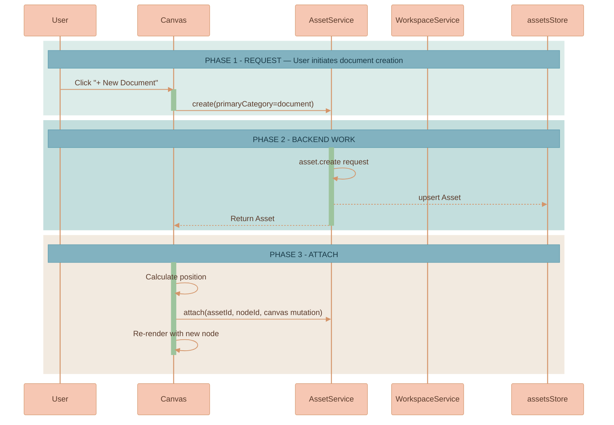
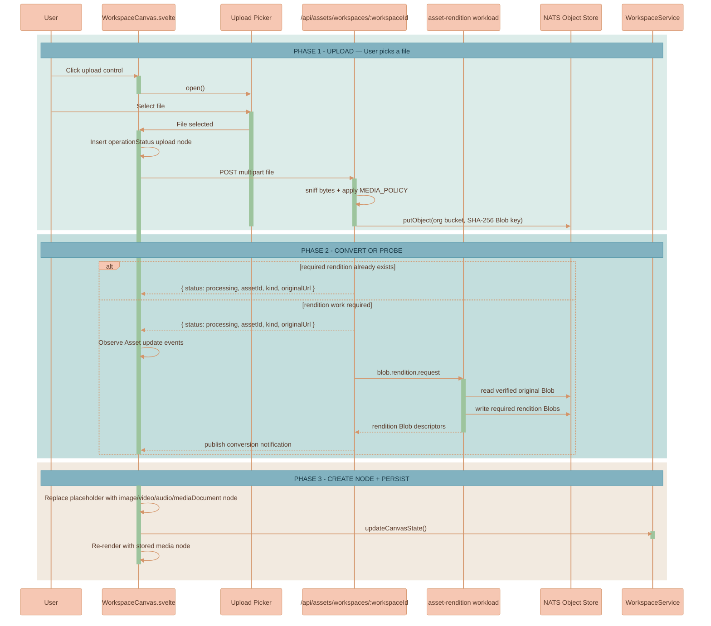
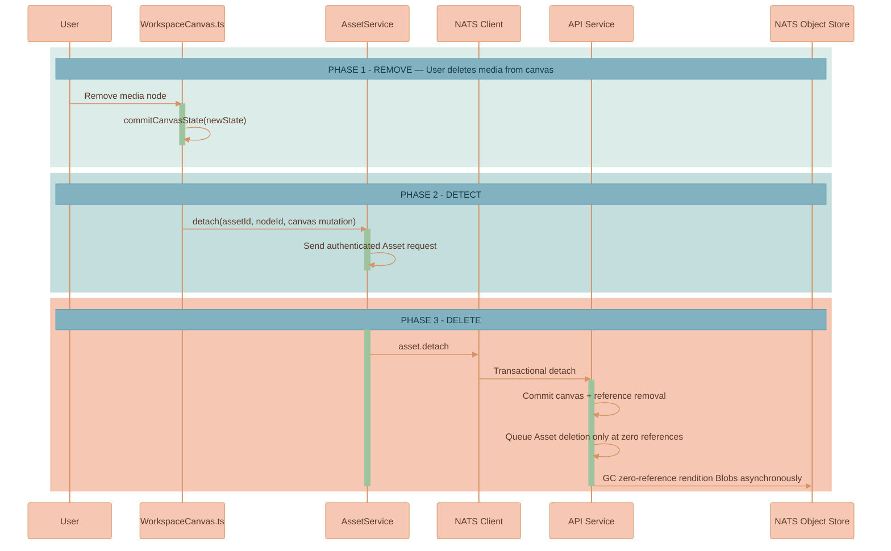
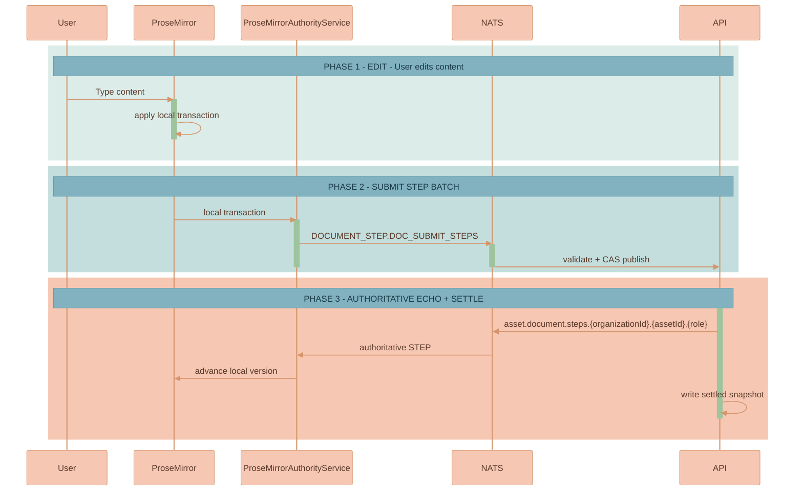
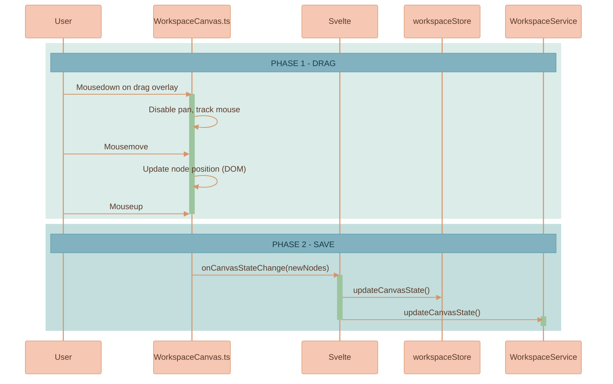

# User Flows

This page walks through the canvas interactions a user performs day to day, each illustrated with a sequence diagram across the Svelte component, the framework-agnostic canvas engine, the frontend services, and the backend. Read it alongside the [Workspace Model](./WORKSPACE-MODEL.md), which defines every entity these flows read and write, and [Edges & Connections](./EDGES-AND-CONNECTIONS.md), which covers the connect/disconnect interactions that are not repeated here.


This page is part of the canvas domain. The "why" of each persisted shape lives in [Workspace Model](./WORKSPACE-MODEL.md); how the result is drawn lives in [Rendering Engine](./RENDERING-ENGINE.md). AI-driven flows (generating an image or video from a chat thread) are documented in [Image Generation](../media-generation/IMAGE-GENERATION.md), [Video Generation](../media-generation/VIDEO-GENERATION.md), and [Branch Lineage & Provenance](../media-generation/BRANCH-LINEAGE.md).


## Opening a Workspace

Selecting a workspace fetches the Workspace record, then `AssetService` resolves the Assets referenced by canvas nodes, conversation-panel tabs, and workspace-scoped document/conversation projections before the canvas renders.

The route resumes mutable `content` and `conversation` roles from their Blob snapshots plus later Asset-step events. Periodic synchronization refreshes global Asset metadata and rendition state without replacing local node topology.

## Creating a Document

Clicking "+ New Document" creates an Asset with a title-free `content` role. The canvas computes a local node position and attaches the `(assetId, nodeId)` membership through the Asset reference transaction.

## Adding a File

The canvas upload control accepts images, videos, audio, PDFs, office documents, text, and Markdown. The browser posts the selected file to the Workspace Asset endpoint; the API sniffs the bytes, stores a content-addressed original Blob in the Workspace organization's bucket, creates an Asset, and queues the NEX rendition workload. The browser keeps a generic `operationStatus` upload node until the Asset has the rendition required by its node kind.

The server is authoritative for detected kind, media facts, rendition status, and canvas hints. Canvas nodes persist only `assetId` and geometry; `canonical`, `poster`, `representativeFrame`, and document-preview details remain Asset renditions. URL insertion uses `POST /api/assets/workspaces/:workspaceId/import-url`, with the same public-URL checks and byte-sniffed ingest pipeline, so a canvas media node is never backed only by an external URL.

On load the client verifies that stored image node dimensions match the natural aspect ratio; if they do not match it corrects the node dimensions and persists the corrected values, so stale image nodes self-heal. Image resize uses a diagonal-based algorithm for smooth, aspect-locked resizing, and the UI computes resize handle size and offsets dynamically so handles stay visually consistent regardless of canvas zoom.

## Asset Library Membership

Every Asset is created with one typed catalog reference, so uploads, generated outputs, documents, and conversations are immediately discoverable in their authorized scope. The node action opens Asset details; it does not create a copy or a second catalog record. Scope controls discovery (`Workspace`, `Mine`, or `Organization`), while `All available` is the union of authorized projections.

Because placement and catalog references are independent, removing a canvas node does not remove a catalog entry. Workspace deletion removes that Workspace's placements and Workspace-owned catalog references; the Asset survives whenever any reference remains. The full contract is documented in [Media Library](../library/MEDIA-LIBRARY.md).

## Deleting Canvas Media

When an Asset-backed node is removed, the browser submits an Asset detach with the new canvas state. The API atomically commits the canvas mutation and removes the node ID from the Workspace reference. An Asset enters maintenance deletion only when its reference count reaches zero.

Detachment never deletes bytes inline. Maintenance rechecks Asset and Blob reference counts before deletion, and catalog references protect the Asset independently of canvas placement. See [Workspace Model](./WORKSPACE-MODEL.md) and [Data Storage](../platform/DATA-STORAGE.md).

## Editing Content

Typing in a document's ProseMirror editor applies locally first, then the authority service submits a short batch of ProseMirror steps to the API. The API accepts ordered steps through `DOCUMENT_STEP.DOC_SUBMIT_STEPS`, echoes authoritative step events, and writes the settled `Document.content` snapshot after the edit burst.

## Moving a Document

Dragging a node disables pan and updates the node's DOM position live; on mouse-up the canvas reports the new positions, the store updates, and `WorkspaceService.updateCanvasState()` persists them immediately (unlike pan/zoom, which is debounced).

On drop, collision resolution may nudge overlapping nodes apart so the surface stays legible; see [Collision Resolution](./COLLISION-RESOLUTION.md). Dragging a document or image near an AI chat thread also surfaces a proximity-connect suggestion — that interaction is documented in [Edges & Connections](./EDGES-AND-CONNECTIONS.md#proximity-connect).
