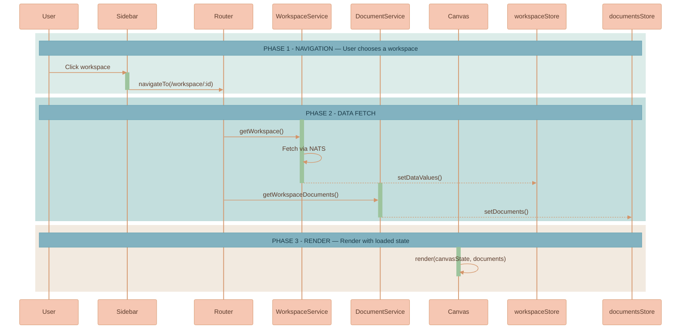
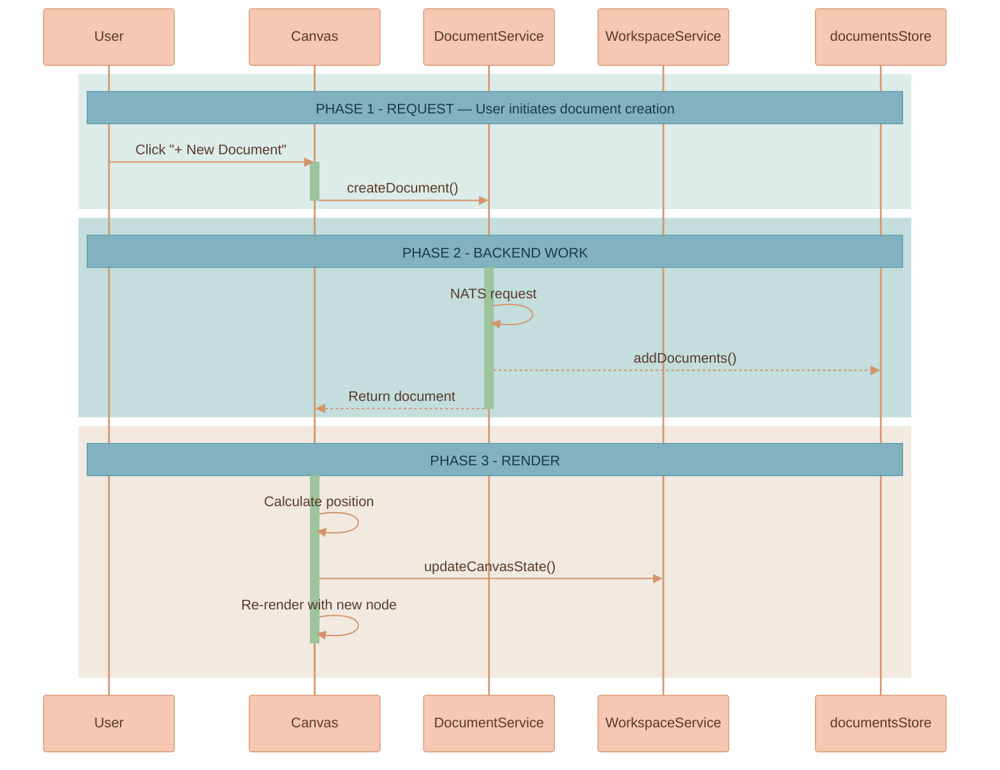
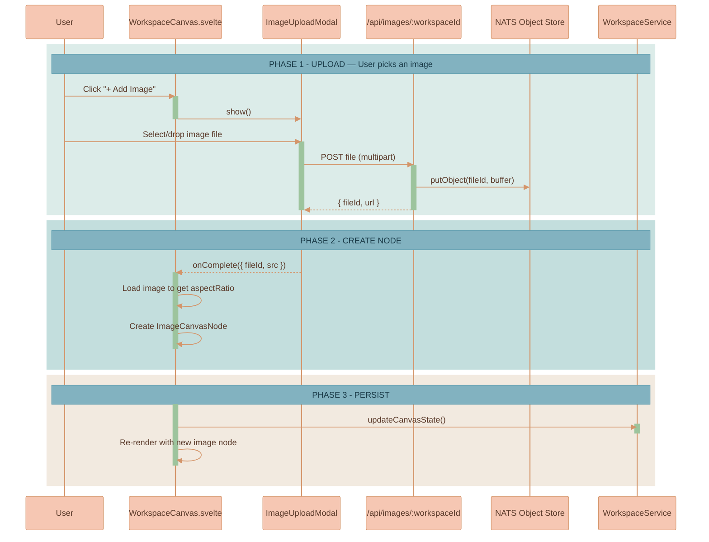
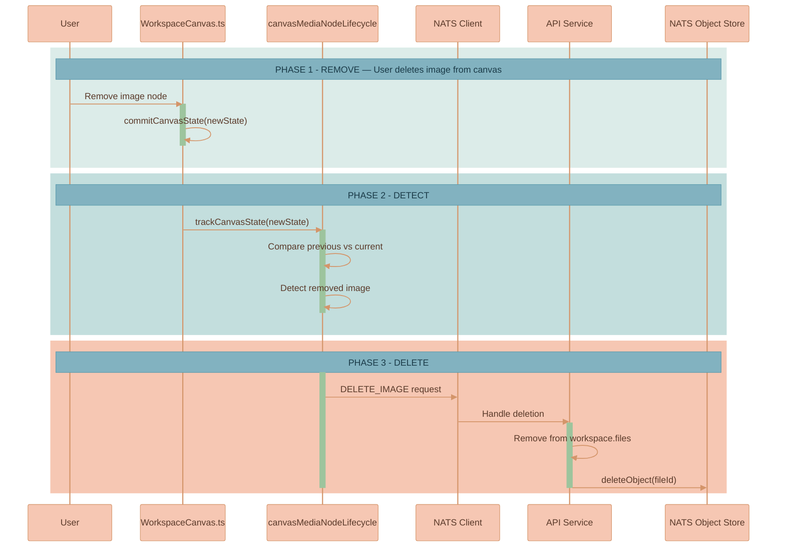
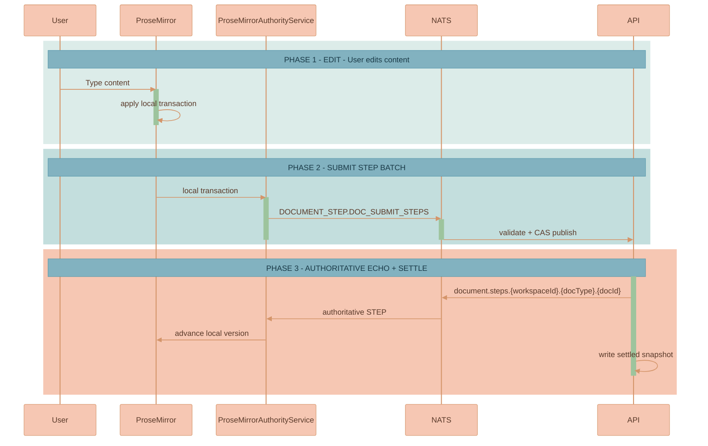
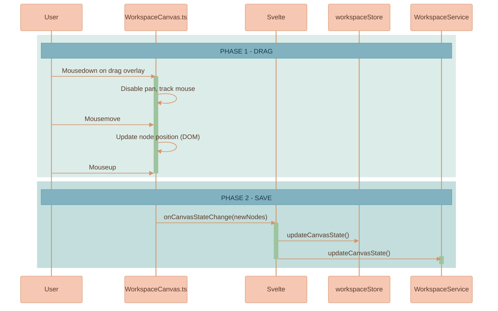

# User Flows

This page walks through the canvas interactions a user performs day to day, each illustrated with a sequence diagram across the Svelte component, the framework-agnostic canvas engine, the frontend services, and the backend. Read it alongside the [Workspace Model](./WORKSPACE-MODEL.md), which defines every entity these flows read and write, and [Edges & Connections](./EDGES-AND-CONNECTIONS.md), which covers the connect/disconnect interactions that are not repeated here.


This page is part of the canvas domain. The "why" of each persisted shape lives in [Workspace Model](./WORKSPACE-MODEL.md); how the result is drawn lives in [Rendering Engine](./RENDERING-ENGINE.md). AI-driven flows (generating an image or video from a chat thread) are documented in [Image Generation](../media-generation/IMAGE-GENERATION.md), [Video Generation](../media-generation/VIDEO-GENERATION.md), and [Branch Lineage & Provenance](../media-generation/BRANCH-LINEAGE.md).


## Opening a Workspace

Selecting a workspace in the sidebar navigates the router, which fetches the workspace and its documents through their services and hydrates the stores before the canvas renders with the loaded state.

The workspace route loads the workspace record, documents, and AI chat threads before rendering. The canvas still tracks visible nodes for render/performance decisions, but document/thread data is not fetched lazily today.

## Creating a Document

Clicking "+ New Document" asks `DocumentService` to create the document, adds it to the store, then the canvas computes a position, creates a `document` node, and persists the updated canvas state.

## Adding an Image

Adding an image opens the upload modal, posts the file to the workspace image endpoint (which stores it in Object Store), then the canvas loads the image to read its aspect ratio, creates an `ImageCanvasNode`, and persists the canvas state.

After an image is uploaded or imported from a public URL, the client loads the persisted workspace object to determine the natural aspect ratio. URL insertion uses `POST /api/images/:workspaceId/import-url`, which validates and stores the fetched image in the workspace Object Store **before** creating a canvas node; a canvas image node is therefore never backed only by an external URL. The validation and import rules for URLs live in [Media Library](../library/MEDIA-LIBRARY.md). On load the client verifies that the stored node dimensions match that ratio; if they do not match it corrects the node dimensions and persists the corrected values, so stale nodes self-heal. Image resize uses a diagonal-based algorithm for smooth, aspect-locked resizing, and the UI computes resize handle size and offsets dynamically so handles stay visually consistent regardless of canvas zoom.

## Saving Media to the Media Library

Completed image and video nodes expose `Add to Media Library` in their canvas bubble menu. Saving is **explicit**: it copies the image bytes (or video MP4 plus poster bytes) from `workspace-{workspaceId}-files/{fileId}` into a Media Library scope-owned Object Store bucket and writes a generic media-metadata record. New saves start in `Workspace` scope; users can view or move items through `Workspace`, `Mine`, `Organization`, and `Public` scopes, or browse `All available`. Saving confirms in place with a transient message on the canvas and does not open or switch the panel. Re-saving the same source media is deduplicated — the server returns the existing library item instead of writing a second independent copy. Partially streaming AI-generated images and VEO videos still polling do not expose the action until a stored final object exists.

Because a saved copy is independent, removing the original canvas media does **not** remove its Media Library copy, and deleting a workspace removes only the library items still scoped to that workspace. The full saved-media panel, scopes, ownership, materialization-back-to-canvas, and Feature-promotion rules are documented in [Media Library](../library/MEDIA-LIBRARY.md).

## Deleting an Image

When an image node is removed from the canvas — by user action or programmatically — the lifecycle tracker diffs the canvas state, detects the removed `fileId`, and issues a delete request over NATS. The API re-reads the workspace and deletes bytes only when canonical `canvasState` no longer references the file.

Video nodes follow the same shape over the `DELETE_VIDEO` subject. The delete handler refuses to remove bytes while canonical canvas state still references the MP4, poster, or representative frame. Neither deletion path touches Media Library items, which are independent saved copies; the full lifecycle is described in [Media Node Lifecycle Management](./WORKSPACE-MODEL.md#media-node-lifecycle-management).

## Editing Content

Typing in a document's ProseMirror editor applies locally first, then the authority service submits a short batch of ProseMirror steps to the API. The API accepts ordered steps through `DOCUMENT_STEP.DOC_SUBMIT_STEPS`, echoes authoritative step events, and writes the settled `Document.content` snapshot after the edit burst.

## Moving a Document

Dragging a node disables pan and updates the node's DOM position live; on mouse-up the canvas reports the new positions, the store updates, and `WorkspaceService.updateCanvasState()` persists them immediately (unlike pan/zoom, which is debounced).

On drop, collision resolution may nudge overlapping nodes apart so the surface stays legible; see [Collision Resolution](./COLLISION-RESOLUTION.md). Dragging a document or image near an AI chat thread also surfaces a proximity-connect suggestion — that interaction is documented in [Edges & Connections](./EDGES-AND-CONNECTIONS.md#proximity-connect).
