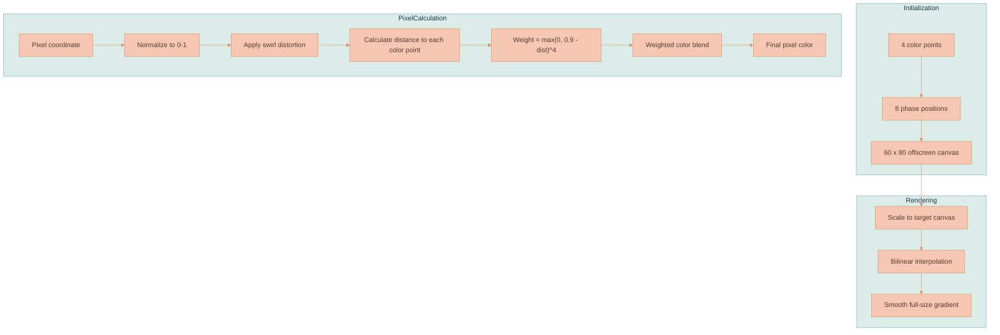
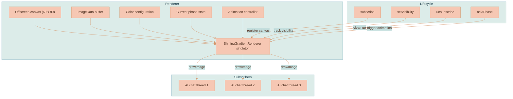
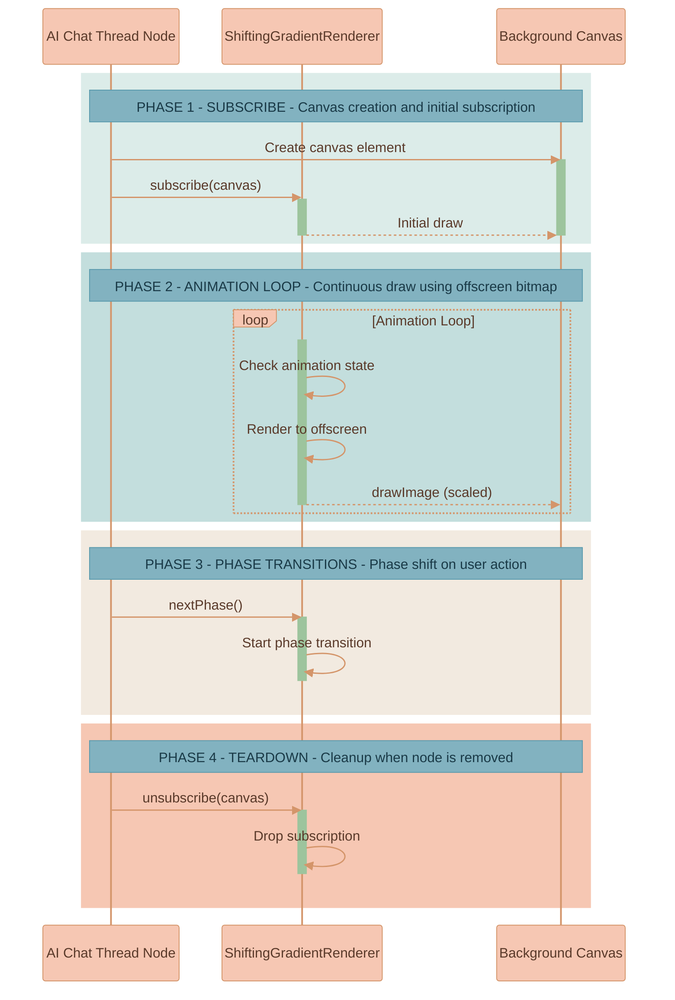

# Visual Effects

This page covers the web UI visual-effects ecosystem: gradients (freeform bitmap gradients, animated shifting backgrounds, SVG gradient borders), the PIXI traveling outline used for generation progress, and the shared easing curves that animate all of them.

The system is organized so that **reusable rendering math lives in shared renderer classes, the palette lives in `settings.ts`, and each consumer owns only its own lifecycle**. The bulk of this page is reference material — the families and shared modules up front, then a deep dive into the animated shifting-gradient background, the color-analysis workflow, and troubleshooting.


This page is part of the canvas domain. The shifting gradient is used by legacy AI chat thread node surfaces and the current AI Chat panel composer; the PIXI traveling outline is the generated-image progress border. For how visible canvas nodes are placed and rendered see [Rendering Engine](./RENDERING-ENGINE.md) and [Image Rendering Performance](./IMAGE-RENDERING-PERFORMANCE.md).


## System Overview

The visual-effects system has three rendering families:

| Family | Renderer | Output | Consumers |
|---|---|---|---|
| Freeform bitmap gradient | `FreeformGradientRenderer` | Canvas `ImageData` generated from four color anchors, eight phase positions, inverse-distance blending, and swirl distortion | AI chat thread and floating prompt shifting backgrounds |
| SVG linear gradient | `SvgGradientRenderer` | D3-created `<linearGradient>` stops and rotating endpoint animation | Document context selection, document thread border |
| PIXI traveling outline | `PixiTravelingOutlineRenderer` | PIXI `Graphics` track with a colored segment traveling around a rounded perimeter while active | Generated-image progress border and future PIXI outlined progress surfaces |

Animation curves are centralized in `Easing` where a surface uses shared easing, while surface-specific lifecycle remains with each consumer:

- `ShiftingGradientRenderer` owns canvas subscription and phase-transition lifecycle.
- SVG consumers own their D3 element creation while delegating reusable gradient construction and rotation to `SvgGradientRenderer`.
- `PixiTravelingOutlineRenderer` owns traveling PIXI outline geometry, paint, and bounded animation lifecycle while consumers provide active bounds and style.

## Shared Modules

| Class | Location | Responsibility |
|---|---|---|
| `Easing` | [`services/web-ui/src/utils/animations/easing.ts`](../../services/web-ui/src/utils/animations/easing.ts) | Cubic-bezier evaluation plus shared hover and shifting-gradient transition curves |
| `FreeformGradientRenderer` | [`services/web-ui/src/utils/animations/gradients/freeformGradient.ts`](../../services/web-ui/src/utils/animations/gradients/freeformGradient.ts) | Color parsing, phase positions, freeform sampling, image-data painting, and canvas bitmap drawing |
| `ShiftingGradientRenderer` | [`services/web-ui/src/utils/animations/gradients/shiftingGradientRenderer.ts`](../../services/web-ui/src/utils/animations/gradients/shiftingGradientRenderer.ts) | Singleton-per-color-set canvas renderer, subscriptions, visibility, resize redraws, optional pattern overlays, and animated phase changes |
| `SvgGradientRenderer` | [`services/web-ui/src/utils/animations/gradients/svgGradient.ts`](../../services/web-ui/src/utils/animations/gradients/svgGradient.ts) | Linear gradient stop construction, repeating border stops, and rotating linear-gradient animation |
| `PixiTravelingOutlineRenderer` | [`services/web-ui/src/utils/animations/gradients/pixiTravelingOutlineRenderer.ts`](../../services/web-ui/src/utils/animations/gradients/pixiTravelingOutlineRenderer.ts) | Reusable PIXI rounded track and traveling colored-segment renderer with active-only animation lifecycle |

### Reuse Rules

- New Canvas or PIXI freeform gradient surfaces should call `FreeformGradientRenderer`; they should not copy the pixel sampling, phase, or swirl algorithm into consumer files.
- New SVG animated gradient borders should call `SvgGradientRenderer` for stop construction and rotation.
- New PIXI traveling progress outlines should call `PixiTravelingOutlineRenderer` and supply their own style and active bounds.
- Runtime JavaScript animations that match existing interaction motion should use `Easing`, not reimplement cubic-bezier calculations.
- Visual color choices belong in `settings.ts`; renderer classes consume configured colors rather than owning product palettes.

## Palette Ownership

The system intentionally has separate palettes for different visual roles:

| Setting | Purpose | Consumers |
|---|---|---|
| `settings.gradient.styles.shiftingColors` | Dreamy pastel canvas/SVG accent palette | AI chat thread and floating prompt backgrounds, document thread border, document context selection |
| `settings.mediaNode.generationBorder.styles.snakeColors` | Bright traveling progress path palette | PIXI generated-image progress outline |

## Gradient Consumers

### SVG Gradient Borders and Selection

`SvgGradientRenderer` supplies reusable forms of SVG gradient construction:

- `appendLinearGradientStops()` lays out ordinary linear stops for document context selection.
- `appendRepeatingLinearGradientStops()` creates looping stops for animated borders.
- `startRotatingLinearGradient()` rotates gradient endpoints for document thread borders, defaulting to `Easing.hoverTransition()`.

These SVG consumers use `settings.gradient.styles.shiftingColors`; they reuse the palette but do not run the freeform pixel sampler.

### PIXI Generated-Image Progress Outline

`PixiTravelingOutlineRenderer` renders a subdued rounded track and a bright colored segment moving around its perimeter with PIXI `Graphics`. It is **not** tied to generated images: consumers synchronize arbitrary active outline bounds and style data into it. The workspace media layer uses it for generated-image progress with the blue-to-purple-to-orange palette configured in `settings.mediaNode.generationBorder`. The renderer defaults to `Easing.travelingOutlineTransition()`, which gives each lap a gentle pace pulse without slowing to a near-stop at the wrap boundary. The workspace removes its outline when generation completes or fails.

### Static CSS Gradient Surfaces

Some UI surfaces use CSS gradients without participating in freeform bitmap rendering or SVG animation. They remain documented here so the palette relationship is visible:

| Surface | Definition | Relationship |
|---|---|---|
| AI chat thread vertical rail | `settings.aiChatThread.rail.styles.gradient`, applied by `WorkspaceCanvas.ts` and rendered in `workspace-canvas.scss` | A static two-color accent related to the pastel shifting palette |
| Model/dropdown highlights | `components/dropdown/_dropdown-mixins.scss` | Uses the same simple lavender/periwinkle two-color accent as the rail |
| AI user message bubbles and canvas provenance prompt bubbles | `components/proseMirror/plugins/aiChatThreadPlugin/ai-chat-thread.scss`, `infographics/workspace/workspace-canvas.scss` | Local dark bubble treatment; not part of the animated palette system |
| Generated-image action readability fade | `components/proseMirror/plugins/aiChatThreadPlugin/ai-chat-thread.scss` | Local media overlay fade; not a reusable gradient asset |
| Media Library feature thumbnail placeholder | `infographics/workspace/media-library-panel.scss` | Local placeholder treatment; not part of animated gradient rendering |
| Theme/sidebar and editor-theme backgrounds | `sass/_variables.scss`, `sass/themes/_minimalist-chic.scss`, `components/proseMirror/themes/cm6-themes/packages/gruvbox-light/src/index.ts` | General theme styling; outside the workspace gradient renderer contract |


Do not route ordinary CSS background treatments through `FreeformGradientRenderer` or `SvgGradientRenderer`. Those classes own generated texture and animated SVG behavior; simple component backgrounds should stay with their component/theme styling unless they become a shared product token.


## Easing Curves

| Method | Cubic Bezier | Used For |
|---|---|---|
| `Easing.hoverTransition()` | `(0.19, 1, 0.22, 1)` | Context-region active thought-circle transition and rotating SVG gradients |
| `Easing.shiftingGradientTransition()` | `(0.33, 0, 0, 1)` | Freeform phase transition in `ShiftingGradientRenderer` |
| `Easing.travelingOutlineTransition()` | Smooth periodic pace pulse, `0.6x` to `1.4x` linear speed | PIXI traveling outline motion without a lap-boundary stall |

## Test Coverage

| Test | Coverage |
|---|---|
| [`easing.test.ts`](../../services/web-ui/src/utils/animations/easing.test.ts) | Cubic-bezier identity/clamping, valid curve bounds, and shared easing profiles |
| [`freeformGradient.test.ts`](../../services/web-ui/src/utils/animations/gradients/freeformGradient.test.ts) | Colors, phases, sampling, bitmap painting, and context drawing |
| [`svgGradient.test.ts`](../../services/web-ui/src/utils/animations/gradients/svgGradient.test.ts) | Stop creation, repeated stops, rotating transitions, and shared default easing |
| [`pixiTravelingOutlineRenderer.test.ts`](../../services/web-ui/src/utils/animations/gradients/pixiTravelingOutlineRenderer.test.ts) | Rounded perimeter sampling, default eased travel, and colored segment interpolation |
| [`shiftingGradientRenderer.test.ts`](../../services/web-ui/src/utils/animations/gradients/shiftingGradientRenderer.test.ts) | Singleton lifecycle, animation phase changes, pixels, subscriptions, resize redraw, patterns, and teardown |

Run the web UI suite inside its container:

```bash
docker exec lixpi-web-ui pnpm test:run
```

## Shifting Gradient Background

Legacy AI chat thread nodes and current AI prompt input surfaces can use an animated freeform gradient background that smoothly shifts between color positions.

The remainder of this section preserves the implementation details for that background: its algorithm, singleton lifecycle, color-analysis workflow, performance characteristics, customization, CSS integration, optional pattern overlay, and troubleshooting.

### Inspiration

We took inspiration from animated freeform gradient wallpapers found in modern messaging apps. The clever trick is rendering to a tiny 60×80 pixel bitmap and then letting the browser's bilinear interpolation do the heavy lifting when scaling up. The result is buttery smooth gradients at virtually zero CPU cost.

We've built our own implementation that works as a singleton renderer powering multiple canvas elements simultaneously.

### How It Works

The gradient uses four color points positioned around the canvas. Each pixel's color is calculated using inverse distance weighting — the closer a pixel is to a color point, the more that color influences the final result. The weighting uses a `distance^4` falloff, which creates those nice soft blobs rather than harsh linear gradients.

On top of that, there's a swirl distortion applied to the coordinates before the color calculation. This prevents the gradient from looking too "geometric" — it adds an organic, flowing quality.

#### The Algorithm



#### Phase Positions

The gradient has 8 predefined phases, each defining where the 4 color points sit on the canvas. When the user sends a message, the gradient animates from one phase to the next, creating that subtle shift effect.

```
Phase 0: Color points mostly in upper-right area
Phase 1: Points spread between upper-left and lower-right
Phase 2: Points moving toward center and bottom
...and so on through Phase 7
```

The animation uses a cubic bezier easing curve (`0.33, 0, 0, 1`) which gives it that nice ease-out feel — fast at the start, gentle landing at the end.

### Shifting Background Architecture



The renderer caches one singleton instance per configured color set. In ordinary workspace usage, prompt input surfaces using the same color set subscribe to one shared renderer and share its single 60×80 offscreen canvas. This is efficient — the gradient is not recalculated for every surface.

#### Shifting Background Components

| Component | Location | Purpose |
|-----------|----------|---------|
| Shifting gradient controller | [`shiftingGradientRenderer.ts`](../../services/web-ui/src/utils/animations/gradients/shiftingGradientRenderer.ts) | `ShiftingGradientRenderer` singleton class for subscriber and canvas lifecycle control |
| Freeform gradient renderer | [`freeformGradient.ts`](../../services/web-ui/src/utils/animations/gradients/freeformGradient.ts) | `FreeformGradientRenderer` class for shared color parsing, phase positions, swirl sampling, and bitmap painting |
| Easing utilities | [`easing.ts`](../../services/web-ui/src/utils/animations/easing.ts) | `Easing` class for shared cubic-bezier easing used by Canvas, PIXI, and SVG transitions |

#### Swirl Distortion

The swirl effect is what makes the gradient feel organic rather than mathematical. Here's how it works:

1. Calculate distance from pixel to center (0.5, 0.5)
2. Rotation angle = `(distance × 0.35)² × 0.8 × 8.0`
3. Rotate the coordinate around the center by that angle

Pixels near the center barely rotate. Pixels near the edges rotate more. This creates a subtle spiral effect in the final gradient.

### Shifting Background Color Selection

The gradient uses 4 colors that blend together. Choosing good colors is important — they need to:

1. Be harmonious (work well together when blended)
2. Have appropriate contrast (not too similar, not too jarring)
3. Match the overall design aesthetic

The current colors are ultra-light pastels inspired by a desert sunset sky palette. They are defined centrally in `settings.ts` as the `gradient.styles.shiftingColors` property and shared across the shifting gradient background and SVG document shape/context selection borders:

```typescript
// settings.ts
styles: {
    shiftingColors: ['#FFF5FA', '#F5EFF9', '#E6E9F6', '#F3E4F2'],
}
```

`FreeformGradientRenderer` converts these hex values to RGB at startup:

```typescript
const GRADIENT_COLORS = {
    color1: { r: 0xff, g: 0xf5, b: 0xfa }, // #FFF5FA - whisper pink
    color2: { r: 0xf5, g: 0xef, b: 0xf9 }, // #F5EFF9 - whisper lavender
    color3: { r: 0xe6, g: 0xe9, b: 0xf6 }, // #E6E9F6 - whisper periwinkle
    color4: { r: 0xf3, g: 0xe4, b: 0xf2 }, // #F3E4F2 - whisper orchid
}
```

### Color Analysis Tool

When you want to extract colors from a reference image (like a gradient wallpaper screenshot), there is a standalone Python utility that does perceptual color fitting. It is a first-pass analysis helper, not an authoritative visual matcher — always verify its output in `region-gradient-preview.html` or the actual app before copying values into production code.

#### Location

```
random-useful-things/image-color-analysis-tool/advanced_gradient_color_analysis.py
```

#### What It Does

```mermaid
%%{init: {'theme': 'base', 'themeVariables': { 'primaryColor': '#F6C7B3', 'primaryTextColor': '#5a3a2a', 'primaryBorderColor': '#d4956a', 'secondaryColor': '#C3DEDD', 'secondaryTextColor': '#1a3a47', 'secondaryBorderColor': '#4a8a9d', 'tertiaryColor': '#DCECE9', 'tertiaryTextColor': '#1a3a47', 'tertiaryBorderColor': '#82B2C0', 'lineColor': '#d4956a', 'textColor': '#5a3a2a'}}}%%
graph LR
    subgraph Input
        IMG["Reference image"]
    end

    subgraph Preprocessing
        BLUR["Gaussian blur"]
        GRID["50 x 50 sample grid"]
    end

    subgraph Analysis
        LAB["Convert to LAB color space"]
        LCH["Analyze lightness, chroma, hue"]
        REGIONS["Extract regional averages"]
    end

    subgraph Optimization
        DE["Differential evolution"]
        DELTAE["Delta E perceptual error"]
        PHASES["Test multiple phases"]
    end

    subgraph Output
        COLORS["Optimized 4 colors"]
        PHASE["Best phase number"]
        TS["TypeScript code snippet"]
    end

    IMG --> BLUR
    BLUR --> GRID
    GRID --> LAB
    LAB --> LCH
    LCH --> REGIONS
    REGIONS --> DE
    DE --> DELTAE
    DELTAE --> PHASES
    PHASES --> COLORS
    COLORS --> PHASE
    PHASE --> TS
```



#### How to Use It

1. Get your reference image (screenshot of a gradient you like).
2. Run the analysis, passing the image as a local file path or an HTTP/HTTPS URL.

The script imports `numpy`, `Pillow` (`PIL`), `scipy`, and `colormath`. For local one-off use you can install them directly:

```bash
python -m pip install numpy pillow scipy colormath
```

Then run the script from the repo root with a local path:

```bash
python random-useful-things/image-color-analysis-tool/advanced_gradient_color_analysis.py random-useful-things/image-color-analysis-tool/gradient-sample.png
```

It also accepts a URL:

```bash
python random-useful-things/image-color-analysis-tool/advanced_gradient_color_analysis.py https://example.com/reference-gradient.png
```

If no argument is passed, the script falls back to a hard-coded default URL in `main()`. Do not rely on that default for reproducible work — remote images can disappear, change, block automated requests, or fail when network access is unavailable.


**The old container command is stale.** Earlier docs ran this tool inside a `lixpi-llm-api` container (`docker compose exec -T lixpi-llm-api python ...`, copying files into `services/llm-api/src/tmp`). **That Python `llm-api` service no longer exists** — it was absorbed into the TypeScript `api` service. Because this is a standalone Python utility, run it in **any environment that has the required Python dependencies** (`numpy`, `Pillow`, `scipy`, `colormath`) — for example a local Python install as shown above, or any Python container where you mount or copy the script and image. If you do run it through a Lixpi container, reconfirm the current container name and the writable/mounted path first; do not assume the former `lixpi-llm-api` paths.


The script prints all results to stdout; it does not write JSON, images, or reports to disk.

#### Understanding the Output

The tool outputs several sections:

**Color Distribution Analysis**
```
Lightness range: 54.5 - 94.4
Lightness mean: 73.3, std: 7.3
Chroma range: 0.6 - 40.3
Hue range: 110.3° - 230.5°
```

This tells you about the overall color properties of the reference image. Lightness is in the LAB L* scale (0=black, 100=white). Hue is in degrees (0°=red, 120°=green, 240°=blue).

**Regional Color Averages**
```
top_right: #90BA8A
center_right: #9EBF94
top_left: #B8CA8B
bottom_center: #8FB396
```

The tool samples different regions of the image and reports the average color in each. This gives you a quick sense of the gradient structure.

**Perceptual Optimization Results**

The tool runs optimization for multiple phases and reports the perceptual error (Delta E) for each:

```
Phase 0:
  Perceptual error (Delta E): 11.01
  Colors:
    1: #7DB467 (L=68.0)
    2: #A9B181 (L=70.5)
    ...
```

Lower Delta E = better match to the reference. The tool picks the phase with the lowest error.

**Final TypeScript Snippet**

At the end, you get ready-to-paste code:

```typescript
const GRADIENT_COLORS = {
    color1: { r: 0x7c, g: 0xbb, b: 0x6c }, // #7CBB6C
    color2: { r: 0xab, g: 0xb8, b: 0x87 }, // #ABB887
    color3: { r: 0x9f, g: 0xcd, b: 0x91 }, // #9FCD91
    color4: { r: 0x80, g: 0xb2, b: 0x91 }, // #80B291
}

const CURRENT_PHASE = 0
```

The printed TypeScript object is the tool's old configuration shape. The current app stores the palette as a hex array in `settings.ts` (`gradient.styles.shiftingColors`), so convert the colors manually rather than pasting the snippet verbatim.

#### Why LAB Color Space?

The tool uses CIE LAB color space for optimization because it's perceptually uniform. In RGB, a numerical difference of 10 units might look huge in one color range and invisible in another. In LAB, equal numerical distances correspond to roughly equal perceived differences. Delta E is just the Euclidean distance in LAB space.

#### Pattern Overlay Removal

Many gradient wallpapers have decorative pattern overlays (icons, doodles, etc.). The tool applies Gaussian blur to remove these high-frequency patterns before analysis, so you're measuring the underlying gradient colors, not the overlay. The blur removes small texture — it does **not** remove large foreground UI such as cards, screenshots, labels, borders, or shadows, which will still bias the result. Crop or mask large foreground content before running the tool.

### Integration with Prompt Surfaces

When an AI prompt surface uses the shifting-gradient background, it subscribes to the gradient renderer:



#### Visibility Optimization

We use `IntersectionObserver` to track which nodes are actually visible on screen. Hidden nodes (scrolled out of view or behind other elements) don't receive gradient updates, saving rendering work.

### Performance Characteristics

| Metric | Value | Notes |
|--------|-------|-------|
| Bitmap size | 60×80 pixels | 4,800 pixels total |
| Render cost | ~5000 pixel ops | Per frame, trivial for modern CPUs |
| Memory | ~20KB | One offscreen canvas + ImageData |
| Animation FPS | 60fps | Uses requestAnimationFrame |
| Phase transition | 500ms | Cubic-bezier eased |

The design is intentionally simple. No WebGL, no shaders, just plain Canvas 2D. This keeps it portable and predictable across browsers.

### Shifting Background Customization

#### Changing Colors

Edit the `gradient.styles.shiftingColors` array in `settings.ts`:

```typescript
shiftingColors: ['#FFF5FA', '#F5EFF9', '#E6E9F6', '#F3E4F2']
```

These hex values are converted to RGB at startup by `FreeformGradientRenderer` in `services/web-ui/src/utils/animations/gradients/freeformGradient.ts`. Document shape borders reuse them through SVG gradient rendering; generated-image progress outlines use the separate palette in `settings.mediaNode.generationBorder.styles.snakeColors`.

#### Changing Animation Speed

Edit `ANIMATION_DURATION_MS`:

```typescript
const ANIMATION_DURATION_MS = 500  // milliseconds
```

#### Changing Swirl Intensity

Edit `FreeformGradientRenderer.swirlFactor` in `services/web-ui/src/utils/animations/gradients/freeformGradient.ts`:

```typescript
private static readonly swirlFactor = 0.35  // 0 = no swirl, 1 = extreme swirl
```

#### Changing Initial Phase

Edit the shared initial phase in `FreeformGradientRenderer`:

```typescript
static readonly initialPhase = 4  // 0-7
```

### CSS Integration

The gradient canvas is positioned behind the AI chat thread content using CSS. The canvas element itself is given a class that positions it absolutely within the node container:

```scss
.workspace-ai-chat-thread-node {
    position: relative;

    .shifting-gradient-canvas {
        position: absolute;
        inset: 0;
        border-radius: inherit;
        z-index: 0;
    }

    .ai-chat-content {
        position: relative;
        z-index: 1;
    }
}
```

### Pattern Overlay Support

The renderer supports an optional pattern overlay (decorative icons/doodles on top of the gradient). This isn't currently used but the infrastructure exists:

```typescript
// In services/web-ui/src/utils/animations/gradients/shiftingGradientRenderer.ts
private pattern: {
    image: HTMLImageElement
    options: Required<PatternOptions>
} | null = null
```

If enabled, patterns are drawn after the gradient with configurable alpha, blend mode, tint color, and scale.

### Shifting Background Troubleshooting

**Gradient looks banded/posterized**
- Check that `imageSmoothingEnabled = true` is set on the target canvas context
- Ensure `imageSmoothingQuality = 'high'`

**Gradient not animating**
- Verify the canvas is subscribed via `subscribe(canvas)`
- Check that visibility is set correctly via `setVisibility(canvas, true)`
- Confirm the animation loop is running (check for subscribers)

**Colors don't match reference image**
- Run the color analysis tool to get proper color values
- Pay attention to the lightness values — the gradient renderer doesn't add brightness
- Check if the reference has a pattern overlay that's affecting perception

**Multiple nodes showing different states**
- Nodes using the same configured color set share one cached renderer and should show the same state
- If nodes configured with the same colors differ, check whether they obtained different renderer instances or missed a subscription update

## References

- CIE LAB color space: https://en.wikipedia.org/wiki/CIELAB_color_space
- Delta E color difference: https://en.wikipedia.org/wiki/Color_difference#CIELAB_%CE%94E*

## Related Documentation

- [Rendering Engine](./RENDERING-ENGINE.md) — the DOM/PIXI ownership split that hosts these gradient and outline surfaces.
- [Image Rendering Performance](./IMAGE-RENDERING-PERFORMANCE.md) — the media layer that drives the generated-image progress outline.
- [Branch Lineage & Provenance](../media-generation/BRANCH-LINEAGE.md) — generated media whose progress the PIXI traveling outline visualizes.
