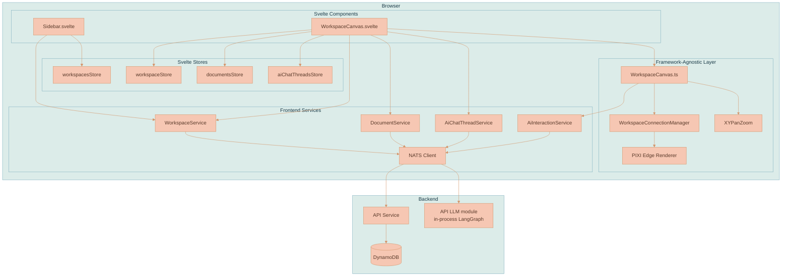
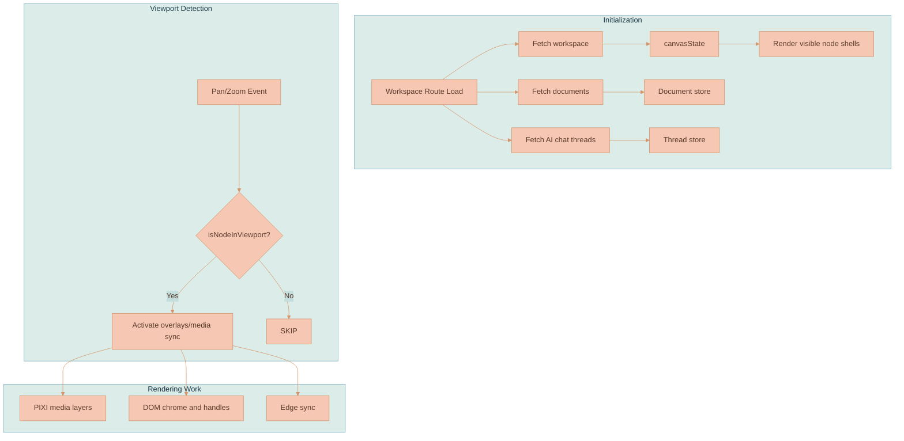

# Workspace Model

A **workspace** is the primary container where users organize and edit their documents, images, videos, and AI context. It is an infinite canvas where cards float, can be arranged freely, resized, and edited in place. The spatial arrangement is not decoration — connections between nodes carry context to the AI, and the layout of generated media records its provenance.

This page explains **what a workspace is made of**: the core concepts a user manipulates, the persisted data model behind them, the frontend stores that hold live state, and the backend NATS/HTTP surface that reads and writes it. It does **not** cover *how* the canvas is drawn or *how* users interact with it turn by turn — those live in sibling pages.


This page is part of the canvas domain. For the DOM/PIXI rendering architecture, the layer stack, and canvas configuration ownership see [Rendering Engine](./RENDERING-ENGINE.md). For texture caching, level-of-detail tiers, and the decode pool see [Image Rendering Performance](./IMAGE-RENDERING-PERFORMANCE.md). For drag-release and insertion overlap rules see [Collision Resolution](./COLLISION-RESOLUTION.md). For step-by-step interaction flows see [User Flows](./USER-FLOWS.md), and for the connection system see [Edges & Connections](./EDGES-AND-CONNECTIONS.md).


## Core Concepts

| Concept | Definition |
|---------|------------|
| **Workspace** | A named container owned by a user. Holds a canvas state (viewport position, zoom, and node positions) plus references to documents, AI chat threads, and uploaded files. |
| **Canvas Node** | A positioned item on the canvas. It is one of four kinds — document, image, video, or AI chat thread — and stores position, dimensions, and type-specific data. |
| **Document** | The actual text content (ProseMirror JSON). It lives separately from its canvas representation, so the same document could theoretically appear in multiple workspaces. Documents use `documentType: 'document'` and contain block-level content (paragraphs, headings, lists, and so on). |
| **AI Chat Thread** | A persisted AI conversation session stored in the AI-Chat-Threads DynamoDB table. A thread is standalone; its ProseMirror history is rendered in an AI Chat panel tab and streamed through its own `AiInteractionService`. |
| **AI Chat Panel** | A workspace-owned right-side surface that can be opened without creating a chat session; a standalone thread is created only when the first prompt is submitted. See [Chat Panel & Sessions](../ai-chat/CHAT-PANEL-AND-SESSIONS.md). |
| **Image** | An uploaded, imported, generated, or restored image file stored in NATS Object Store. Canvas nodes reference workspace-owned image objects and delete them when removed from the canvas; a user can explicitly save a separate Media Library copy that is **not** deleted with the source node. |
| **Video** | A generated or restored MP4 stored in NATS Object Store with a poster and an optional representative still. The canvas renders a PIXI poster behind a browser-composited `<video>` surface so playback, scrubbing, fullscreen, and shared controls do not depend on a PIXI video texture loop. See [Video Player Controls](../media-generation/VIDEO-PLAYER-CONTROLS.md). |
| **Branch Root** | The first generated image or video in a branch. It records the prompt, references, resolver metadata, and visual summaries on its own `generatedBy` metadata; no separate provenance node is persisted. See [Branch Lineage & Provenance](../media-generation/BRANCH-LINEAGE.md). |
| **Viewport** | The current view: x/y offset and zoom level, persisted so users return to where they left off. While a workspace is open, the live viewport inside [`WorkspaceCanvas.ts`](../../services/web-ui/src/infographics/workspace/WorkspaceCanvas.ts) is the rendering source of truth; Svelte/store persistence is an acknowledgement path. A delayed store render must not replay an older viewport-only state over the current transform. |

## System Architecture

The browser holds a thin Svelte component layer over a framework-agnostic canvas engine. Components own data fetching through frontend services; the engine owns geometry, the connection manager, and pan/zoom. All persistence travels over NATS to the API service, which fronts DynamoDB and runs the AI workflow in-process.



| Layer | Responsibility |
|-------|----------------|
| Svelte components | Route handling, fetching domain objects through services, mounting the canvas. They may create domain objects after service work but do not own geometry. |
| Svelte stores | Hold live workspace, document, and thread state for reactive rendering. |
| Framework-agnostic layer | [`WorkspaceCanvas.ts`](../../services/web-ui/src/infographics/workspace/WorkspaceCanvas.ts) owns geometry, viewport, node DOM, and the PIXI media layer; the connection manager and pan/zoom are its collaborators. |
| Frontend services | Wrap NATS request/response and streaming for workspaces, documents, threads, and AI interaction. |
| Backend | The API service validates access, persists to DynamoDB, and hosts the in-process LangGraph AI workflow ([AI Generation Pipeline](../platform/AI-GENERATION-PIPELINE.md)). |

## Data Model

### Workspace (Backend)

```typescript
type Workspace = {
    workspaceId: string
    name: string
    accessType: 'private' | 'shared'
    files: string[]              // Document IDs
    canvasState: CanvasState
    createdAt: number
    updatedAt: number
}
```

### CanvasState

`CanvasState` is the persisted heart of a workspace: the viewport, every node, every edge, the AI chat panel UI state, and any in-flight feature-extraction runs.

```typescript
type CanvasState = {
    viewport: {
        x: number      // Pan offset X
        y: number      // Pan offset Y
        zoom: number   // 0.1 to 2.0
    }
    nodes: CanvasNode[]
    edges: WorkspaceEdge[]  // Connections between nodes
    aiChatPanel?: {
        isOpen: boolean
        isSessionHistoryOpen: boolean
        tabs: Array<{ tabId: string; type: 'thread' | 'extraction'; refId: string; title: string }>
        activeTabId?: string
        contextChips: string[]
        width?: number
        drafts?: Record<string, { content?: object }>
    }
    featureExtractionRuns?: Record<string, CanvasFeatureExtractionState>
}
```

The `aiChatPanel` sub-object persists panel presentation only — visibility, Sessions expansion, open tabs, active tab, width, explicit context chips, and prompt drafts. Opening or editing the panel does **not** create a conversation entity; see [Chat Panel & Sessions](../ai-chat/CHAT-PANEL-AND-SESSIONS.md). The `contextChips` array is the explicit-context input to per-turn workspace relevance ([Context Relevance](../ai-chat/CONTEXT-RELEVANCE.md)).

### WorkspaceEdge

Edges represent visual connections between canvas nodes, used for showing context flows and dependencies.

```typescript
type WorkspaceEdge = {
    edgeId: string
    sourceNodeId: string
    targetNodeId: string
    sourceHandle?: string  // e.g., 'right'
    targetHandle?: string  // e.g., 'left'
    sourceT?: number       // Position along source side (0=top, 1=bottom, 0.5=center). Default: 0.5
    targetT?: number       // Position along target side (0=top, 1=bottom, 0.5=center). Default: 0.5
    sourceMessageId?: string  // Links edge to a specific aiResponseMessage (by its id attr) within the source AI chat thread
}
```

The `sourceT` and `targetT` properties let edges attach at any vertical position along a node's side, not just the center. When a user creates a connection by dragging, the `t` values are computed from the pointer position where the drag started and where it was dropped.

The `sourceMessageId` property enables precise per-response-message tracking for AI-generated images. When an AI chat thread generates an image, the resulting canvas image node is connected back to the thread via an edge whose `sourceMessageId` identifies the specific `aiResponseMessage` that produced it. This lets context extraction associate images with their originating conversation turns. The rendering and anchoring behavior of this property lives in [Edges & Connections](./EDGES-AND-CONNECTIONS.md).

### Connection Routing

Edges are planned by `WorkspaceConnectionManager` and drawn by the PIXI edge renderer. The current default routing style is `horizontal-bezier`, with auto-alignment to straight lines where possible, message-level anchoring to a specific AI response message, dashed drag previews, and selection/deletion behavior documented in [Edges & Connections](./EDGES-AND-CONNECTIONS.md).

### AI Generated Content Layout

When an AI chat session generates images or videos, the workspace places them automatically to keep a clean layout: first outputs sit near the active chat context or the combined bounds of selected/reference media, branch continuations become a balanced generated-media tree, generated nodes use a fixed canvas-unit size regardless of zoom, and a synchronous partial tracker prevents overlapping or skipped slots during simultaneous stream updates. Reference/style/source media can anchor and animate placement without becoming a connector parent unless the API lineage plan selects an existing generated-media branch member as the parent. The first generated media node is the branch root and carries its own provenance. The complete placement, spacing, provenance chrome, and references-vs-lineage rules live in [Branch Lineage & Provenance](../media-generation/BRANCH-LINEAGE.md).

### CanvasNode

Canvas nodes use a discriminated union keyed on the `type` field. There are four node types: `document`, `image`, `video`, and `aiChatThread`. Every node shares `nodeId`, `position`, and `dimensions`; the rest is type-specific.

```typescript
type CanvasNodeType = 'document' | 'image' | 'aiChatThread' | 'video'

// Document node - contains a ProseMirror editor
type DocumentCanvasNode = {
    nodeId: string
    type: 'document'
    referenceId: string    // Points to Document.documentId
    position: { x: number; y: number }
    dimensions: { width: number; height: number }
}

// Image node - displays an uploaded, imported, generated, or restored image
type ImageCanvasNode = {
    nodeId: string
    type: 'image'
    fileId: string         // Points to file in NATS Object Store
    workspaceId: string    // For deletion context
    src: string            // Full URL for rendering
    aspectRatio: number    // Used for aspect-ratio-locked resize
    position: { x: number; y: number }
    dimensions: { width: number; height: number }
}

// Video node - displays a generated or restored MP4
type VideoCanvasNode = {
    nodeId: string
    type: 'video'
    fileId: string
    posterFileId: string
    frameFileId?: string
    workspaceId: string
    src: string
    posterSrc: string
    aspectRatio: number
    durationSeconds: number
    hasAudio: boolean
    position: { x: number; y: number }
    dimensions: { width: number; height: number }
}

// AI Chat Thread node - contains an AI conversation
type AiChatThreadCanvasNode = {
    nodeId: string
    type: 'aiChatThread'
    referenceId: string    // Points to AiChatThread.threadId
    position: { x: number; y: number }
    dimensions: { width: number; height: number }
}

type CanvasNode =
    | DocumentCanvasNode
    | ImageCanvasNode
    | VideoCanvasNode
    | AiChatThreadCanvasNode
```

| Node type | Reference target | Key type-specific fields |
|-----------|------------------|--------------------------|
| `document` | `referenceId` → `Document.documentId` | — (content fetched lazily) |
| `image` | `fileId` → NATS Object Store | `workspaceId`, `src`, `aspectRatio` |
| `video` | `fileId` → NATS Object Store | `posterFileId`, optional `frameFileId`, `src`, `posterSrc`, `aspectRatio`, `durationSeconds`, `hasAudio` |
| `aiChatThread` | `referenceId` → `AiChatThread.threadId` | — (history streamed/fetched) |

The shared multimodal, workspace-context, descriptor, and canvas-node types are defined in [`packages/lixpi/constants/ts/types.ts`](../../packages/lixpi/constants/ts/types.ts).

## Frontend Stores

State is split across four stores so the sidebar, the open workspace, its documents, and its threads can load and update independently.

### workspacesStore

Holds the list of workspaces shown in the sidebar. Minimal metadata only (id, name, timestamps).

```typescript
{
    meta: { loadingStatus },
    data: WorkspaceMeta[]
}
```

### workspaceStore

The currently open workspace with full canvas state.

```typescript
{
    meta: { loadingStatus, isInEdit, requiresSave },
    data: {
        workspaceId,
        name,
        canvasState,
        files,
        ...
    }
}
```

The `files` array is metadata for objects in the workspace's NATS Object Store bucket. Backend file registration uses atomic DynamoDB append, and file removal uses a conditional indexed remove instead of rewriting the whole list, so a delete cannot overwrite concurrent media registrations.

### documentsStore

Documents belonging to the current workspace.

```typescript
{
    meta: { loadingStatus },
    data: Document[]
}
```

### aiChatThreadsStore

AI chat threads belonging to the current workspace.

```typescript
{
    meta: { loadingStatus },
    data: Map<string, AiChatThread>  // Keyed by threadId for O(1) lookup
}
```

## Backend API (NATS Subjects)

Workspace, document, and thread persistence all travel over NATS request/response. AI streaming uses its own per-thread subject documented in [Streaming & Events](../platform/STREAMING-AND-EVENTS.md).

| Subject | Purpose |
|---------|---------|
| `WORKSPACE.GET_USER_WORKSPACES` | List user's workspaces |
| `WORKSPACE.GET_WORKSPACE` | Get single workspace with canvas state |
| `WORKSPACE.CREATE_WORKSPACE` | Create new workspace |
| `WORKSPACE.UPDATE_WORKSPACE` | Update name |
| `WORKSPACE.UPDATE_CANVAS_STATE` | Persist viewport and node positions |
| `WORKSPACE.DELETE_WORKSPACE` | Delete workspace |
| `WORKSPACE.GET_WORKSPACE_DOCUMENTS` | Get documents in workspace |
| `DOCUMENT.CREATE_DOCUMENT` | Create document |
| `DOCUMENT.UPDATE_DOCUMENT` | Update document content/title |
| `DOCUMENT.DELETE_DOCUMENT` | Delete document |
| `AI_CHAT_THREAD.CREATE` | Create AI chat thread |
| `AI_CHAT_THREAD.GET` | Get AI chat thread by workspaceId + threadId |
| `AI_CHAT_THREAD.UPDATE` | Update AI chat thread content |
| `AI_CHAT_THREAD.DELETE` | Delete AI chat thread |
| `AI_CHAT_THREAD.GET_BY_WORKSPACE` | Get all AI chat threads in workspace |
| `AI_INTERACTION.CHAT_SEND_MESSAGE` | Send message to AI for processing |
| `AI_INTERACTION.CHAT_STOP_MESSAGE` | Stop active AI streaming |
| `AI_INTERACTION.FEATURE_EXTRACT.LIST_BY_WORKSPACE` | List extraction sessions for Sessions history |
| `AI_INTERACTION.FEATURE_EXTRACT.DELETE` | Delete an extraction session without deleting its saved Feature |
| `WORKSPACE_IMAGE.DELETE_IMAGE` | Delete image from Object Store |
| `WORKSPACE_VIDEO.DELETE_VIDEO` | Delete video from Object Store |
| `WORKSPACE.MEDIA_LIBRARY.CREATE_FROM_IMAGE` | Copy a stored canvas image into the Media Library |
| `WORKSPACE.MEDIA_LIBRARY.CREATE_FROM_VIDEO` | Copy a stored canvas video and poster into the Media Library |
| `WORKSPACE.MEDIA_LIBRARY.LIST_AVAILABLE` | List saved media visible in selected scopes |
| `WORKSPACE.MEDIA_LIBRARY.MATERIALIZE_IMAGE_TO_WORKSPACE` | Copy a saved image into workspace storage for canvas insertion |
| `WORKSPACE.MEDIA_LIBRARY.MATERIALIZE_VIDEO_TO_WORKSPACE` | Copy a saved video and poster into workspace storage for canvas insertion |
| `WORKSPACE.MEDIA_LIBRARY.CHANGE_SCOPE` | Copy a library object to a new scope and update metadata |
| `WORKSPACE.MEDIA_LIBRARY.DELETE` | Delete a saved library item and its stored object(s) |

### Media HTTP Endpoints

Image and video bytes are served over authenticated HTTP rather than NATS, so the browser can stream pixels and use HTTP Range requests for video.

| Endpoint | Method | Purpose |
|----------|--------|---------|
| `/api/images/:workspaceId` | POST | Upload image (multipart/form-data) |
| `/api/images/:workspaceId/import-url` | POST | Fetch a public image URL into workspace Object Store before canvas insertion |
| `/api/images/:workspaceId/:fileId` | GET | Serve image with auth token |
| `/api/videos/:workspaceId` | POST | Upload replacement or user-supplied video, store its MP4, and best-effort extract a poster |
| `/api/videos/:workspaceId/:fileId` | GET | Serve video with auth token and HTTP Range support |
| `/api/media-library/items/:itemId/content` | GET | Serve an ACL-checked saved Media Library image preview or Range-capable video preview |
| `/api/media-library/items/:itemId/poster` | GET | Serve an ACL-checked saved Media Library video poster |
| `/api/workspaces/:workspaceId/export` | GET | Download workspace as ZIP archive (see [Workspace Export & Import](../library/WORKSPACE-EXPORT-IMPORT.md)) |

## Persistence Strategy

Different changes persist on different cadences so continuous interactions never hammer the backend, while discrete structural changes save immediately.

| Change | Cadence | Path |
|--------|---------|------|
| Viewport pan/zoom | Debounced ~1s | `WORKSPACE.UPDATE_CANVAS_STATE` |
| Node position/dimensions after drag/resize | Immediate via `onCanvasStateChange` | `WORKSPACE.UPDATE_CANVAS_STATE` |
| Edge create / delete / reconnect | Immediate | `WORKSPACE.UPDATE_CANVAS_STATE` |
| Document content | Debounced | `DocumentService.updateDocument()` |
| AI chat thread content | Debounced | `AiChatThreadService.updateAiChatThread()` |
| AI chat panel UI (open/close, tabs, width, chips, drafts) | On change | persisted inside `canvasState.aiChatPanel` |

Canvas-state changes are debounced (1 second) before persisting, which prevents hammering the backend during continuous pan/zoom. Document content changes are handled by `DocumentService.updateDocument()`, which has its own debouncing; AI chat thread content changes are handled by `AiChatThreadService.updateAiChatThread()` with similar debouncing.

AI chat panel state is stored inside `canvasState.aiChatPanel`. Opening or closing the panel, expanding or collapsing Sessions, opening or closing tabs, resizing it, changing context controls, and editing prompt drafts persist workspace UI state but do **not** create a conversation entity. Submitting from an empty panel creates a standalone chat session. Sessions is collapsed by default and toggled from the history icon in the panel control row; when expanded it lists standalone chats and extraction sessions. Closing a tab only changes panel presentation and the session remains reopenable; explicit standalone or extraction deletion removes that session and its saved prompt draft, while a saved Feature remains independent when its extraction session is deleted. The full panel and Sessions behavior is documented in [Chat Panel & Sessions](../ai-chat/CHAT-PANEL-AND-SESSIONS.md).

## Media Node Lifecycle Management

Media nodes on the canvas are tracked by [`canvasMediaNodeLifecycle.ts`](../../services/web-ui/src/infographics/workspace/canvasMediaNodeLifecycle.ts). Each supported node type provides a small tracking/deletion config, so images, videos, and future media types share one state-diff implementation. When a tracked media node is removed from the canvas state:

1. The tracker compares the previous and current canvas states.
2. It detects which tracked media keys are missing from the current canvas state.
3. It calls the configured deletion utility for that node type.

This ensures orphaned workspace-node media does not accumulate in storage. Image nodes use `deleteImage()` from [`imageUtils.ts`](../../services/web-ui/src/utils/imageUtils.ts). Video nodes use `deleteVideo()` from [`videoUtils.ts`](../../services/web-ui/src/utils/videoUtils.ts), which deletes the MP4 and best-effort poster image. Neither path deletes Media Library items — those are intentionally independent saved copies with their own scope and deletion lifecycle (see [Media Library](../library/MEDIA-LIBRARY.md)).

## Workspace Load and Visibility Tracking

Canvas nodes store dimensions in `canvasState`, and the workspace route currently loads the workspace record, documents, and AI chat threads up front. Visibility tracking still matters for rendering work: the canvas can decide which node shells, media sprites, outlines, and overlays should be active around the viewport.



### Loading Strategy

- **Route-level fetch** — The workspace route loads workspace metadata, canvas state, documents, and AI chat threads before render.
- **No viewport fetch path today** — Visibility tracking does not fetch document/thread records lazily.
- **No unloading** — Once route data is loaded, it remains in the stores until navigation or refresh.
- **ResizeObserver** — Pane bounds are tracked for accurate visibility detection during window resizes.

## Related Pages

- [Rendering Engine](./RENDERING-ENGINE.md) — the DOM/PIXI ownership split, the layer stack, the viewport bridge, and the sync pipeline that turns this model into pixels.
- [Image Rendering Performance](./IMAGE-RENDERING-PERFORMANCE.md) — texture cache, LoD tiers, the decode pool, and known performance issues.
- [User Flows](./USER-FLOWS.md) — opening a workspace, creating documents, and adding/saving/deleting/moving/editing media.
- [Edges & Connections](./EDGES-AND-CONNECTIONS.md) — the connection manager, routing, proximity connect, and message-level anchoring.
- [Branch Lineage & Provenance](../media-generation/BRANCH-LINEAGE.md) — generated-media placement, branch-root provenance, and balanced branch-tree layout.
- [Chat Panel & Sessions](../ai-chat/CHAT-PANEL-AND-SESSIONS.md) and [Context Relevance](../ai-chat/CONTEXT-RELEVANCE.md) — the AI chat panel and per-turn workspace relevance.
