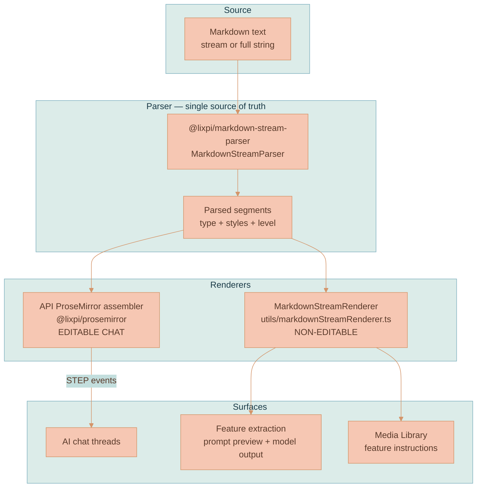

# Markdown Rendering

Markdown shows up in AI chat responses, feature-extraction surfaces, Media Library instructions, and future model-output surfaces. To keep parsing behavior consistent, runtime markdown must be tokenized by `@lixpi/markdown-stream-parser`. The rendering path depends on where the text lands:

- AI chat text is parsed on the API and assembled into ProseMirror steps through `@lixpi/prosemirror`.
- Non-editable browser surfaces use `MarkdownStreamRenderer`.


This convention governs **runtime markdown in the web UI** (model output, feature instructions, and similar surfaces). It is distinct from the documentation site's own **build-time Markdoc renderer** in [`documentation/site/`](../site/README.md), which turns these `.md` docs into static HTML. The two do not share code or this rule.


## The Rule

All runtime markdown rendering must go through [`@lixpi/markdown-stream-parser`](https://github.com/Lixpi/markdown-stream-parser). Never hand-roll markdown-to-HTML, never render raw markdown as plain text, never add a second markdown library (`marked`, `markdown-it`, `remark`, ...), and never fork the segment-to-DOM or segment-to-ProseMirror mapping into a new file.

There are two application paths:



| Surface | Renderer | Source |
|---------|----------|--------|
| Editable AI chat ProseMirror content | API-side `AiChatProseMirrorStreamAssembler` plus shared `@lixpi/prosemirror` assembly helpers | [`ai-chat-stream-assembler.ts`](../../services/api/src/prosemirror/ai-chat-stream-assembler.ts), [`stream-assembly.ts`](../../packages/lixpi/prosemirror/src/stream-assembly.ts) |
| **Non-editable** content (everything else) | The unified `MarkdownStreamRenderer` | [`markdownStreamRenderer.ts`](../../services/web-ui/src/utils/markdownStreamRenderer.ts) |

Both consume the same parser and segment shape. If a new surface needs markdown, reuse one of these paths and extend it where needed.

## Parser Contract

`MarkdownStreamParser` is a streaming, instance-per-stream singleton. Each emitted segment has the shape:

```typescript
{
    status: 'STREAMING' | 'END_STREAM'
    segment: {
        segment: string          // the text content
        styles: string[]         // inline styles on this run
        type: string             // block type
        level?: number           // heading level (1–6) when type === 'header'
        isBlockDefining: boolean  // true when a new block starts
        isProcessingNewLine: boolean
    }
}
```

- **Block types:** `paragraph`, `header` (with `level` 1–6), `code` (fenced code block).
- **Inline styles:** `bold`, `italic`, `strikethrough`, `code`.

Instance lifecycle: `MarkdownStreamParser.getInstance(id)` → `subscribeToTokenParse(cb)` → `startParsing()` → `parseToken(chunk)` per chunk → `stopParsing()` (flushes the last block and emits `END_STREAM`) → `removeInstance(id)`.

The segment/token TypeScript shapes (`MarkdownParsedSegment`, `MarkdownStreamToken`) currently live in [`@lixpi/constants`](../../packages/lixpi/constants/ts/types.ts) because the published parser version defines its segment internally but does not export it (`subscribeToTokenParse` is typed `any`).


A newer version of `@lixpi/markdown-stream-parser` is in development that **exports proper segment types**. Once it is released, drop the `@lixpi/constants` copies and import the types directly from the package.


## Editable AI Chat Assembly

The editable AI chat path is server-authored:

1. `StreamPublisher` mirrors text chunks into `AiChatProseMirrorStreamAssembler`.
2. The assembler owns a headless `EditorState` through `HeadlessProseMirrorEngine`.
3. `MarkdownStreamParser` emits segments.
4. `applyStreamingSegmentToTransaction()` from `@lixpi/prosemirror` converts each segment into ProseMirror transaction steps.
5. `ProseMirrorStepTransport` publishes `STEP` events to `document.steps.{workspaceId}.aiChatThread.{threadId}`.
6. `ProseMirrorAuthorityService` applies each step in the browser with `Step.fromJSON(view.state.schema, event.step)`.

The browser does not run a separate markdown-to-ProseMirror parser for AI chat text. It renders the document produced by the API, while `aiChatThreadPlugin` still owns NodeViews, decorations, request construction, and non-ProseMirror pipeline side effects.

## Non-Editable Rendering: `MarkdownStreamRenderer`

[`src/utils/markdownStreamRenderer.ts`](../../services/web-ui/src/utils/markdownStreamRenderer.ts) is the **only** approved way to render markdown outside ProseMirror. It owns its `contentEl`, drives the parser, and applies styles to each segment as plain DOM (built with the `html` helper from `domTemplates.ts`).

**Streaming** (tokens arrive over time — e.g. live model output). Because the renderer owns `contentEl`, it survives container re-renders; re-attach `contentEl` after a rebuild instead of recreating it:

```typescript
import { MarkdownStreamRenderer } from '$src/utils/markdownStreamRenderer.ts'

const renderer = new MarkdownStreamRenderer(`${runId}:${stage}`, 'my-scroll-box lixpi-markdown')
container.appendChild(renderer.contentEl)
// for each streamed chunk:
renderer.push(chunk)
// when the stream ends:
renderer.finalize()
```

**Static** (the full string is already available — e.g. a saved feature's instructions, a prompt preview):

```typescript
import { renderMarkdownStatic } from '$src/utils/markdownStreamRenderer.ts'

mountEl.appendChild(renderMarkdownStatic(feature.instructions, `feature:${feature.featureId}`, 'feature-library-instructions-body lixpi-markdown'))
```

- The `instanceId` must be unique per concurrent render (the parser is a singleton keyed by id).
- The optional `className` is applied to the content element; always include `lixpi-markdown` so the global styles apply, plus any surface-specific scroll/layout class.

## Styles

Markdown element styles are **global** and live in [`src/sass/_markdown.scss`](../../services/web-ui/src/sass/_markdown.scss) under `.lixpi-markdown` / `.lixpi-md-*` (imported by `src/sass/styles.scss`). They are global on purpose so the renderer looks the same on every surface. Do not redefine markdown element styles in a component stylesheet — only add surface-specific container styles (scroll box, max-height, background) on your own class alongside `lixpi-markdown`.

## Forbidden

- `element.innerHTML = someMarkdown`, or any string-built markdown HTML.
- Rendering markdown source as text (`<pre>${markdown}</pre>`, `${feature.instructions}` straight into the DOM).
- Importing a markdown library other than `@lixpi/markdown-stream-parser`.
- Copying the segment→DOM mapping into a new file instead of using `MarkdownStreamRenderer`.

## Consumers

| Consumer | What it renders | How |
|----------|-----------------|-----|
| AI chat thread | Streamed assistant responses | API ProseMirror assembler + document step stream |
| Feature-extraction surface | Stage prompt previews, streamed model output | `MarkdownStreamRenderer` / `renderMarkdownStatic` |
| Media Library | Saved feature instructions ("Application notes") | `renderMarkdownStatic` |

See also: [Feature Extraction — Overview](../library/FEATURE-EXTRACTION-OVERVIEW.md), [Using Features](../library/USING-FEATURES.md), and [Media Library](../library/MEDIA-LIBRARY.md).
