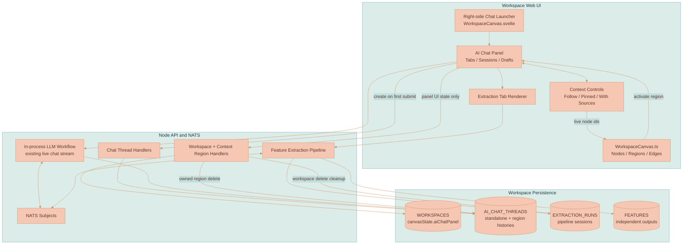
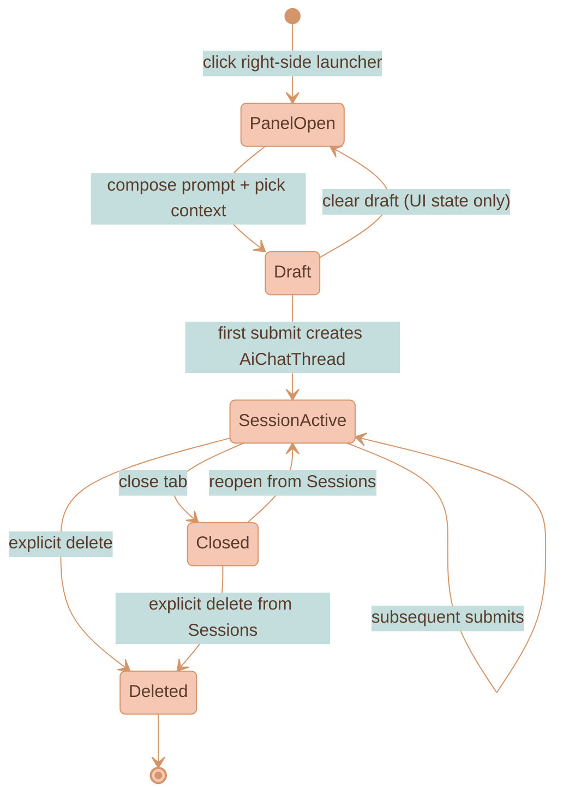
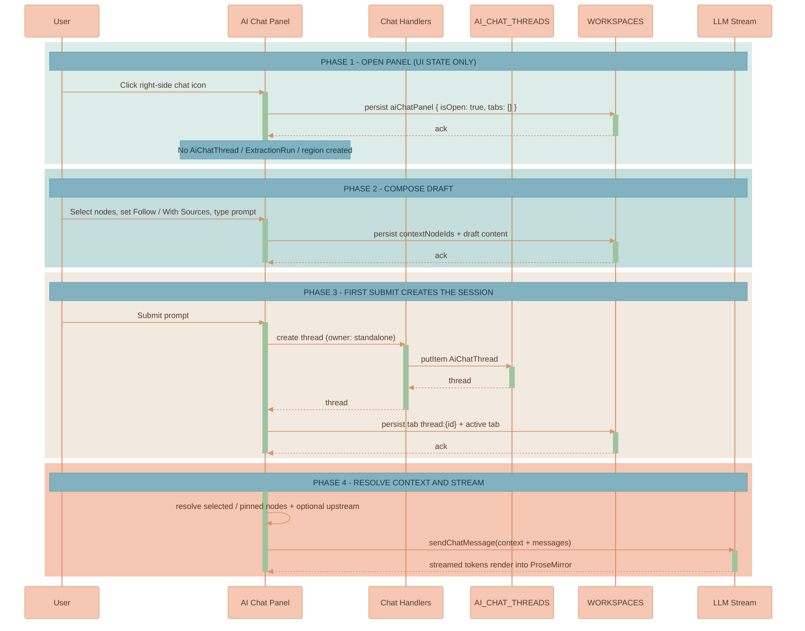
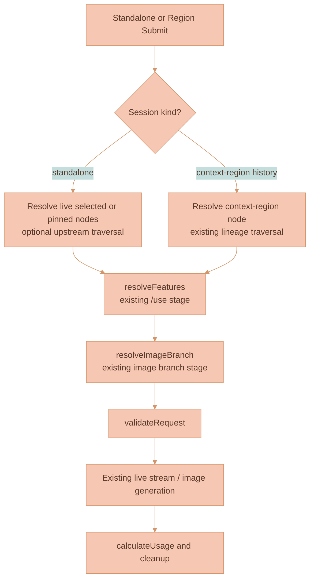
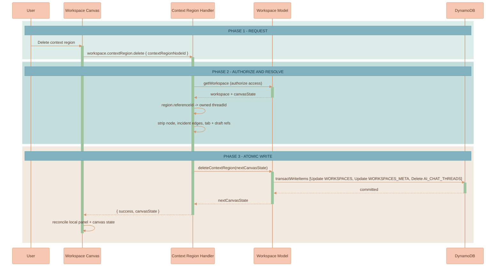

# AI Chat Workspace Sessions

The AI Chat panel is a workspace-owned right-side surface that opens, persists, and restores independently of any canvas node. It hosts durable chat tabs, prompt drafts, compact standalone context controls, and a collapsible Sessions list that merges standalone chats, context-region histories, and feature-extraction sessions for the workspace. Context regions remain spatial containers that own a dedicated conversation history; they no longer determine whether chat exists.

This document is the current source of truth for how the AI Chat panel and its session model work. For the spatial cloud surface that owns region history, see [CONTEXT-REGION-CLOUDS.md](CONTEXT-REGION-CLOUDS.md). For the extraction pipeline behind extraction sessions, see [FEATURE-EXTRACTION-AND-LIBRARY.md](FEATURE-EXTRACTION-AND-LIBRARY.md). For the canvas host and renderer ownership, see [CANVAS-ENGINE.md](CANVAS-ENGINE.md) and [WORKSPACE-FEATURE.md](WORKSPACE-FEATURE.md).

## Current Status

The panel, session ownership model, standalone context controls, Sessions projection, and extraction-session history are implemented in the web UI and API:

- The panel host is the canvas-owned vanilla TypeScript stack in [WorkspaceCanvas.ts](../../services/web-ui/src/infographics/workspace/WorkspaceCanvas.ts); the Svelte wrapper [WorkspaceCanvas.svelte](../../services/web-ui/src/components/WorkspaceCanvas.svelte) supplies the right-side launcher and canvas-state persistence.
- Panel presentation state is persisted under `CanvasState.aiChatPanel`, with defaults, legacy migration, and standalone-context filtering in [aiChatPanelState.ts](../../services/web-ui/src/infographics/workspace/aiChatPanelState.ts).
- Thread ownership and the safe destructive operations live in [ai-chat-thread.ts](../../services/api/src/models/ai-chat-thread.ts), [ai-chat-thread-subjects.ts](../../services/api/src/NATS/subscriptions/ai-chat-thread-subjects.ts), and [workspace.ts](../../services/api/src/models/workspace.ts).
- Extraction-session source snapshots, workspace listing, and non-cascade deletion live in [extraction-run.ts](../../services/api/src/models/extraction-run.ts) and [extraction-subjects.ts](../../services/api/src/NATS/subscriptions/extraction-subjects.ts).

Two areas are intentionally deferred and must not be treated as shipped guarantees: durable reload recovery of an in-flight normal-chat response (see [Deferred: Durable Streaming Reload Recovery](#deferred-durable-streaming-reload-recovery)) and indexed extraction-history querying (see [Known Limitations](#known-limitations)).

## Why This Exists

Lixpi is a spatial AI workflow system in which documents, images, generated media, and context relationships live on a workspace canvas, and upstream graph content becomes context for downstream generation ([PRODUCT-OVERVIEW.md](../PRODUCT-OVERVIEW.md)). Context regions strengthen that model by grouping items into one creative context field whose PIXI cloud is a visual surface over a persisted canvas node ([CONTEXT-REGION-CLOUDS.md](CONTEXT-REGION-CLOUDS.md)).

Earlier, the UI treated that spatial primitive as the existence condition for chat. A context region's `referenceId` pointed at an `AiChatThread`, and panel activation and restoration were shaped around a single region-backed thread. The persistence layer never required that coupling — chat records were already stored by `workspaceId` and `threadId`, and streaming was addressed by those same identifiers — but the user experience did. As a result:

- A user who wanted to ask about one selected image, compare several selected items, or return to a previous extraction session could not do so without creating or activating a region.
- Closing the only closeable extraction tab still left a forced region-thread tab behind.
- Reload restoration was shaped around one region-backed thread rather than the tabs the user left open.
- Image extraction stored its source/context setup only in an in-memory map, so a reload before submission lost the work.
- Workspace deletion did not remove `AI_CHAT_THREADS` or `EXTRACTION_RUNS`, despite both being workspace-owned data.

The fix separates **presentation state**, **session records**, and **spatial context ownership** so that opening chat never implies creating a region, while existing region histories and the extraction pipeline keep working unchanged. The interaction model follows the workspace-scoped list/reopen/explicit-delete split popularized by VS Code's [Manage chat sessions](https://code.visualstudio.com/docs/copilot/chat/chat-sessions), adapted for Lixpi's additional region-owned and extraction session kinds.

## Product Principles

1. **A region is not a chat panel.** No standalone chat action creates a context region implicitly.
2. **Context ownership determines deletion.** A region-owned history cannot be deleted independently of its region; a standalone or extraction session can be deleted without affecting unrelated domain entities.
3. **Closing is not deleting.** Removing a tab only changes workspace UI state; the session remains reopenable until explicit deletion or workspace deletion.
4. **Visible context must match submitted context.** The panel shows the selected or pinned live items and whether upstream expansion is enabled before a standalone submission is sent.
5. **Existing spatial workflows remain stable.** Existing regions continue to resolve their own history and context through their current `referenceId` link and graph-traversal semantics.

## Core Concepts

**AI Chat Panel** — A singleton, workspace-owned right-side surface. It can be open with zero tabs and no selected region. Opening, closing, resizing, toggling Sessions, switching context mode, and editing a draft persist through `CanvasState.aiChatPanel`; none of these create a durable session record.

**Workspace Chat Session** — A durable conversation record that can appear in the Sessions list and be opened as a tab. It is distinct from the panel, from a canvas node, and from a saved Feature. There are three kinds.

**Standalone Chat** — An `AiChatThread` with `owner.type === 'standalone'`, created only when the user submits the first prompt from a panel draft. Its context comes from the panel-level selected/pinned live canvas items at submit time.

**Context-Region History** — An `AiChatThread` referenced by a `ContextRegionCanvasNode.referenceId`. Creating or activating a region opens this history in a tab. It uses the region's contents, edges, history, and branch lineage, and cannot be deleted independently while its region exists.

**Feature-Extraction Session** — An `ExtractionRun` produced by the image "Ask AI" extraction flow. It reconstructs its timeline and result from a stored source-context snapshot and pipeline trace, and points at — but does not own — any resulting Feature.

### Session Kinds

| Session kind | Durable identity | Context behavior | Deletion owner |
|---|---|---|---|
| Standalone chat | `AiChatThread.threadId`, `owner.type: 'standalone'` | Panel-level selected/pinned live canvas items at submit time | User deletes from Sessions |
| Context-region history | `AiChatThread.threadId` referenced by `ContextRegionCanvasNode.referenceId` | Region contents, edges, history, and branch lineage | Deleted only with the region |
| Feature-extraction session | `ExtractionRun.extractionRunId` | Stored extraction source-context snapshot plus pipeline trace | User deletes the session; the Feature remains |

### Eligible Standalone Inputs

Standalone context accepts every non-context-region canvas input already supported by the extractor: document/text content, image/media references, and supported upstream chat content. A context-region node is never treated as an ordinary standalone input — activating it opens its owned region-history tab instead. The `With Sources` toggle (`includeUpstreamContext`) applies equally to `Follow` and `Pinned`; when off, only the directly listed live nodes resolve, and when on, the existing recursive, deduplicating upstream traversal is applied from each listed target. `getStandaloneContextNodeIds` in [aiChatPanelState.ts](../../services/web-ui/src/infographics/workspace/aiChatPanelState.ts) filters context-region nodes out of standalone context, and `extractSelectedContext` in [ai-chat-thread-service.ts](../../services/web-ui/src/services/ai-chat-thread-service.ts) skips them again at resolve time.

## Architecture

The implementation separates panel presentation state from session records and from spatial context ownership, rather than introducing a new unified session table.



| Component | Responsibility |
|---|---|
| Panel state in `WORKSPACES` | Restore the panel shell, tabs, controls, and pre-submit drafts without creating any session. |
| `AI_CHAT_THREADS` | Own submitted standalone conversations and context-region conversation histories. |
| `EXTRACTION_RUNS` | Own extraction transcript/trace history and point to, but not own, any generated Feature. |
| Context region node | Own spatial grouping and its history link; activating it focuses the linked tab. |
| Existing normal-chat stream path | Continue rendering active responses; durable mid-stream reload recovery is deferred. |

### Why a UI Projection, Not a Unified Session Table

A single `WORKSPACE_CHAT_SESSIONS` table could store standalone, region, and extraction sessions as one union, making one history query trivial. It does not fit this codebase safely: Lixpi already has working `AI_CHAT_THREADS` queried by workspace and `EXTRACTION_RUNS` tied to the extraction pipeline and resulting Feature. Moving both into a new table would require dual writes or record migration, risk breaking existing region `referenceId` histories and extraction traces, and still could not eliminate the underlying lifecycle distinction.

The design therefore uses a unified **UI projection**: query `AI_CHAT_THREADS`, list `EXTRACTION_RUNS` for the workspace, classify region histories through explicit or legacy ownership, then merge and render in the panel. A dedicated session index or table is reconsidered only if search or larger-scale browsing requires it.

## Data Model

These types live in [types.ts](../../packages/lixpi/constants/ts/types.ts). `CanvasAiChatPanelState` is structured workspace UI metadata because it must be written before any session exists; `AiChatThread` and `ExtractionRun` remain separate durable records because their lifecycles and deletion rules differ.

```typescript
type AiChatThreadOwner =
    | { type: 'standalone' }
    | { type: 'contextRegion'; contextRegionNodeId: string }

type AiChatThread = {
    workspaceId: string
    threadId: string
    content: object                // Existing ProseMirror conversation document.
    aiModel: string
    title?: string                 // Sessions/tab label without parsing the editor document.
    owner?: AiChatThreadOwner      // Optional only while legacy rows are being classified.
    status: AiChatThreadStatus
    createdAt: number
    updatedAt: number
}

type CanvasAiChatSidebarTab = {
    tabId: string
    type: 'thread' | 'extraction'
    refId: string                  // threadId or extractionRunId.
    title: string
}

type CanvasAiChatPromptDraft = {
    content?: object               // Persisted ProseMirror prompt document only.
}

type CanvasAiChatPanelState = {
    isOpen: boolean
    isSessionHistoryOpen: boolean
    tabs: CanvasAiChatSidebarTab[]
    activeTabId?: string
    contextMode: 'followSelection' | 'pinnedContext'
    includeUpstreamContext: boolean
    contextNodeIds: string[]       // Live node references used only by standalone drafts/chats.
    width?: number
    drafts?: Record<string, CanvasAiChatPromptDraft>
}

type CanvasState = {
    // ...existing viewport, nodes, edges...
    aiChatPanel?: CanvasAiChatPanelState
    featureExtractionRuns?: Record<string, CanvasFeatureExtractionState>

    // Legacy read/migration fields; mirrored on write for compatibility.
    lastActiveAiChatThreadId?: string
    aiChatSidebarTabs?: CanvasAiChatSidebarTab[]
    activeAiChatSidebarTabId?: string
}

type CanvasFeatureExtractionState = {
    extractionRunId: string
    status: ExtractionRunStatus
    sourceContextSnapshot?: object // Persists pre-submit extraction setup in canvas state.
    updatedAt: number
    // Streamed timeline/result fields (userText, stageReasoning, featureCard, traceEvents, ...) omitted for brevity.
}

type ExtractionRun = {
    extractionRunId: string
    workspaceId: string
    userId: string
    status: ExtractionRunStatus
    featureId?: string             // Reference only; run deletion does not delete the Feature.
    transcriptJson?: object
    sourceContextSnapshot?: object
    trace?: StageTraceEvent[]
    createdAt: number
    updatedAt: number
}
```

| Field | Stored on | Purpose |
|---|---|---|
| `owner.type` | `AiChatThread` | Distinguishes `standalone` history from `contextRegion`-owned history. |
| `owner.contextRegionNodeId` | `AiChatThread` (region histories) | Explicit ownership without removing the existing `ContextRegionCanvasNode.referenceId` link. |
| `title` | `AiChatThread` | Supplies Sessions/tab labels without parsing the editor document. |
| `isSessionHistoryOpen` | `CanvasAiChatPanelState` | Persists whether Sessions is expanded; defaults to `false`. |
| `contextMode` | `CanvasAiChatPanelState` | `followSelection` or `pinnedContext`, applied to standalone drafts/submissions. |
| `includeUpstreamContext` | `CanvasAiChatPanelState` | Whether selected/pinned items expand through upstream traversal. |
| `contextNodeIds` | `CanvasAiChatPanelState` | Live node references currently exposed as standalone context. |
| `sourceContextSnapshot` | `CanvasFeatureExtractionState` / `ExtractionRun` | Restores pending extraction inputs from canvas state and is persisted onto the submitted run. |

## Storage Architecture

### DynamoDB

| Table | Key schema | Role in this feature |
|---|---|---|
| `WORKSPACES` | `PK workspaceId` | Stores `canvasState.aiChatPanel`; legacy tab metadata migrates lazily on read. |
| `AI_CHAT_THREADS` | `PK workspaceId`, `SK threadId`, LSI `createdAt` ([DynamoDB-tables.ts](../../infrastructure/pulumi/src/resources/db/DynamoDB-tables.ts)) | The existing workspace query lists standalone and region-owned histories; `owner` and `title` are added attributes with no key migration. |
| `EXTRACTION_RUNS` | `PK extractionRunId`, `SK workspaceId` ([DynamoDB-tables.ts](../../infrastructure/pulumi/src/resources/db/DynamoDB-tables.ts)) | Stores `sourceContextSnapshot`; workspace listing and cleanup currently scan and filter by `workspaceId` in application code. |

No new Feature table relationships are introduced. `ExtractionRun.featureId` is a one-way result reference; a deleted run cannot cascade to `FEATURES`, `FEATURES_META`, Feature ACL records, or sample objects.

### Owned Deletion

The generic `UPDATE_CANVAS_STATE` handler accepts a complete canvas update and cannot, on its own, enforce that deleting a region also deletes its owned history. Two mechanisms close that gap:

- `workspace.contextRegion.delete` is a semantic operation. `Workspace.deleteContextRegion` in [workspace.ts](../../services/api/src/models/workspace.ts) resolves the region's `referenceId` thread, strips the region node, its incident edges, and any panel tab/draft that referenced the thread, then atomically updates the workspace row and deletes the owned `AI_CHAT_THREADS` row through a single `transactWriteItems` call ([dynamodb-service.ts](../../packages/lixpi/dynamodb-service/src/dynamodb-service.ts)). A region and its history cannot be left half-deleted.
- The generic AI-chat delete handler in [ai-chat-thread-subjects.ts](../../services/api/src/NATS/subscriptions/ai-chat-thread-subjects.ts) rejects a thread with `CONTEXT_REGION_HISTORY_CANNOT_BE_DELETED` whenever a context-region canvas node still references its `threadId`. This blocks Sessions or a stale client from deleting region history independently, even for legacy rows that lack `owner` metadata.

Workspace deletion invokes `AiChatThread.deleteWorkspaceAiChatThreads({ workspaceId })` and `ExtractionRun.deleteWorkspaceRuns({ workspaceId })` before the workspace row is removed, in addition to existing document, feature, and media cleanup. Promoted Feature sample preservation is unchanged.

### Object Storage

No Object Store layout or IAM binding changes are required. Feature extraction continues using the existing workspace files bucket and the promoted-feature preservation behavior documented in [FEATURE-EXTRACTION-AND-LIBRARY.md](FEATURE-EXTRACTION-AND-LIBRARY.md). Deleting a session removes only its metadata/transcript records; it never deletes Feature samples.

## NATS Subjects

Panel persistence, chat CRUD, normal streaming, and starting/status-checking extraction reuse existing subjects. Only the ownership and session-management operations were added (see [nats-subjects.json](../../packages/lixpi/constants/nats-subjects.json)):

```jsonc
{
  "WORKSPACE_SUBJECTS": {
    "DELETE_CONTEXT_REGION": "workspace.contextRegion.delete"
  },
  "AI_INTERACTION_SUBJECTS": {
    "FEATURE_EXTRACT": {
      "LIST_BY_WORKSPACE": "ai.interaction.feature.extract.listByWorkspace",
      "DELETE": "ai.interaction.feature.extract.delete"
    }
  }
}
```

Normal chat streaming continues on `ai.interaction.chat.receiveMessage.{workspaceId}.{threadId}`. No new durable response-recovery payload is part of the current implementation.

## Session Lifecycle

A standalone session captures the central new behavior: panel UI state and a session record have separate lifecycles, and closing a tab is not deletion.



Up to and including `Draft`, only `CanvasState.aiChatPanel` changes — no `AiChatThread` exists. The transition into `SessionActive` is the only step that writes a durable record. `Closed` and `SessionActive` differ only in whether a tab is open; the record is identical and reopenable until `Deleted`.

## UX Flows

### Right-Side AI Chat Launcher

A right-side chat icon sits alongside the existing right-side workspace tools. Clicking it toggles the panel: the icon shows the chat glyph while closed and a collapse glyph while open, and the layout shifts left to make room. The launcher opens the panel even with zero sessions and no selected region.

An empty panel shows the compact context controls, a Sessions toggle, and an empty composer; Sessions is collapsed by default. Opening, closing, resizing, toggling Sessions, switching mode, and editing the draft persist through `CanvasState.aiChatPanel` but create no session record. On reload, `isOpen`, `isSessionHistoryOpen`, width, open tab order, active tab or empty state, selection mode, `With Sources`, current context-node references, and prompt-document drafts are restored. The launcher is wired in [WorkspaceCanvas.svelte](../../services/web-ui/src/components/WorkspaceCanvas.svelte) and drives `toggleAiChatPanel` on the canvas controller in [WorkspaceCanvas.ts](../../services/web-ui/src/infographics/workspace/WorkspaceCanvas.ts).

### Standalone Chat and Context Controls

With no active standalone session, the composer is an unsent panel draft. The context control is panel-global. It exposes a `Follow` / `Pinned` slider — the reusable D3-managed [contextSelector](../../services/web-ui/src/components/contextSelector/) whose indicator position is animated by CSS rather than D3 to avoid a `DOMMatrix` interpolation failure on percentage transforms — and a `With Sources` switch implemented with the relocated D3 SVG [toggleSwitch](../../services/web-ui/src/components/toggleSwitch/). The stored values remain `followSelection`, `pinnedContext`, and `includeUpstreamContext`.

- **`Follow`** tracks the current canvas selection: supported selection changes update `contextNodeIds`. Clicking a context region does not load it as ordinary content — it opens that region's tab instead.
- **`Pinned`** freezes the currently loaded node ids; later selection changes are ignored. At submit time the latest content of each retained node is resolved, and missing or context-region nodes are filtered out. There is no separate chip add/remove control.

The first submission creates a `standalone` `AiChatThread`, converts the draft into an open standalone tab, persists the new tab in panel state, resolves the selected/pinned (and optionally upstream) context, and publishes through the existing chat request path. Subsequent submissions reuse the active standalone session with the current control state; context is attached only to the outgoing request and is never silently copied into the stored thread as a node or region. The standalone-creation path is `createStandaloneThreadAndSubmit` in [WorkspaceCanvas.ts](../../services/web-ui/src/infographics/workspace/WorkspaceCanvas.ts), and context resolution is `extractSelectedContext` in [ai-chat-thread-service.ts](../../services/web-ui/src/services/ai-chat-thread-service.ts).



### Context-Region History Tabs

Every context region has a dedicated conversation history. `Create Context Region` (the renamed toolbar action in [WorkspaceCanvas.svelte](../../services/web-ui/src/components/WorkspaceCanvas.svelte)) creates an `AiChatThread` with `owner.type: 'contextRegion'`, creates a `ContextRegionCanvasNode` referencing it, places the region on the canvas, opens the panel, and selects the region-history tab. Clicking an existing cloud activates the region, keeps its active-region cloud feedback, and opens or focuses the same tab. Region tabs submit through the existing region target and lineage resolver; the panel-global selection controls do not alter region context.

A region tab can be closed; its record remains in Sessions and reopens from either Sessions or the cloud. Its Sessions delete action is disabled. Existing regions whose threads predate `owner` metadata still qualify through their `referenceId` link. Region activation is `activateAiChatPanel` in [WorkspaceCanvas.ts](../../services/web-ui/src/infographics/workspace/WorkspaceCanvas.ts); ownership and chat-panel behavior for regions are also summarized in [CONTEXT-REGION-CLOUDS.md](CONTEXT-REGION-CLOUDS.md).

### Sessions List

Sessions is collapsed by default; its history icon stays in the control row even with no open tabs. Expanding it lists submitted standalone chats, context-region histories, and submitted feature-extraction sessions for the workspace, sorted by most recent update. Chat sessions are projected from `getWorkspaceAiChatThreads()`; extraction sessions are hydrated once per panel open from `FEATURE_EXTRACT.LIST_BY_WORKSPACE` into `canvasState.featureExtractionRuns`.

Clicking an entry opens or focuses its tab. Closing a tab never removes an entry. Standalone and extraction entries expose a permanent-delete control; a context-region entry shows its region ownership and offers no delete while the region exists. The tab strip and expanded/collapsed state come from `CanvasState.aiChatPanel`, while the entries come from domain records — so closing a tab never deletes a record.

### Feature-Extraction Sessions

Selecting "Ask AI" on a canvas image opens an extraction tab without creating a context region and writes a pending `CanvasFeatureExtractionState` whose `sourceContextSnapshot` captures the image URL and any connected upstream context. The runtime pending-context map is rehydrated from that canvas state when the tab is rendered, so reopening the tab restores the setup. No API `ExtractionRun` exists until submission.

On submit, the API creates an `ExtractionRun` with its `sourceContextSnapshot`, starts the existing six-stage extraction pipeline, and the draft identity becomes a durable extraction-session identity. Submitted runs appear in Sessions and can be deleted; their resulting `featureId` is informational, and deleting a run never calls Feature deletion. The opening path is `onAskAi` in [WorkspaceCanvas.ts](../../services/web-ui/src/infographics/workspace/WorkspaceCanvas.ts); the tab renderer and submit path are in [extractionTab.ts](../../services/web-ui/src/infographics/workspace/extractionTab.ts); the API handlers are in [extraction-subjects.ts](../../services/api/src/NATS/subscriptions/extraction-subjects.ts). See [FEATURE-EXTRACTION-AND-LIBRARY.md](FEATURE-EXTRACTION-AND-LIBRARY.md) for the pipeline itself.

## Context Resolution

Chat graph resolution remains in the existing LLM workflow. The change is in how request context is assembled before the request is published: standalone tabs resolve a panel-loaded target list with an optional upstream toggle, while region tabs keep their existing region-target traversal.



| Path | Resolver | Notes |
|---|---|---|
| Standalone | `extractSelectedContext({ nodeIds, includeUpstream })` | `nodeIds` come from `getStandaloneContextNodeIds`; context-region nodes are excluded; upstream traversal reuses the existing recursive, deduplicating extractor. |
| Context-region history | `extractConnectedContext(regionNodeId)` | Unchanged region target plus lineage; panel selection controls do not apply. |
| Both | `resolveFeatures` → `resolveImageBranch` | `/use` feature resolution and structured image-branch routing run as today (see [IMAGE-BRANCH-LINEAGE.md](IMAGE-BRANCH-LINEAGE.md)). |

## Ownership and Deletion Semantics

The transactional region delete is the safety-critical path: it removes the region node, its incident edges, the owned chat history, and any panel tab/draft referencing that thread in one atomic operation.



| Action | Session created? | Result | Deletion result |
|---|---|---|---|
| Open the panel, type nothing, reload | No | Empty panel and draft UI reopen | Nothing to delete from Sessions |
| Select an image in `Follow`, submit | Yes, standalone | New standalone tab in Sessions | User may delete the chat |
| Click `Create Context Region` | Yes, region-owned history | Region tab opens, cloud active | History cannot be deleted separately |
| Click an existing cloud | No new record | Its region-history tab opens | Deleting the region deletes the history |
| Submit feature extraction, then reload and reopen | Yes, extraction run | Extraction tab reconstructs from snapshot | Delete the run only; the Feature stays |
| Close every tab, leave panel visible | No | Empty panel remains; Sessions can reopen records | No records deleted |
| Delete the workspace | No additional record | Workspace disappears | All chats and extraction runs removed; promoted Feature samples follow existing preservation rule |

## Compatibility and Migration

Existing workspaces already encode region history as `ContextRegionCanvasNode.referenceId → AiChatThread.threadId`; that link remains valid. When an `AiChatThread` lacks `owner` metadata, the read and delete layers derive `contextRegion` ownership if any current region references it, and otherwise treat it as `standalone`. New writes set explicit ownership.

For panel state, `getAiChatPanelState` in [aiChatPanelState.ts](../../services/web-ui/src/infographics/workspace/aiChatPanelState.ts) reads the legacy `lastActiveAiChatThreadId`, `aiChatSidebarTabs`, and `activeAiChatSidebarTabId` fields and migrates them into `aiChatPanel` (a sole legacy thread id becomes one `thread:` tab, and the panel opens if a legacy thread existed). `setAiChatPanelState` continues to mirror `aiChatSidebarTabs` and `activeAiChatSidebarTabId` on write so older readers stay compatible during the transition. This avoids a destructive bulk migration.

## Deferred: Durable Streaming Reload Recovery

The panel and already-persisted editor content restore after reload, but an active normal-chat response is still driven by the mounted browser editor and the live NATS stream described in [PRODUCT-OVERVIEW.md](../PRODUCT-OVERVIEW.md). There is no server-side `streamState` or per-request `requestId` recovery, so reattaching safely to an in-progress normal-chat response across a reload is not guaranteed and must not be claimed as a shipped behavior.

A future change would assign each normal chat request a `requestId`, persist recoverable progress and completed output into `AiChatThread.streamState`, and reconcile persisted state on tab restoration without duplicate segment application. Editable chat content must keep using the existing ProseMirror `aiChatThreadPlugin`, and non-editable surfaces must keep using the existing markdown-stream rendering rule — recovery must not be solved by keeping a hidden region or editor mounted, and no new markdown conversion path should be introduced.

## Known Limitations

- **Extraction history uses table scans.** `ExtractionRun.listWorkspaceRuns()` and `deleteWorkspaceRuns()` scan `EXTRACTION_RUNS` and filter by `workspaceId` in application code. This is acceptable at current session volume; a workspace-and-updated-time access path should be added before history volume grows.
- **Drafts persist prompt content only.** `CanvasAiChatPromptDraft` stores the ProseMirror prompt document; the selected model and image-generation controls are not persisted with the draft.
- **Region-history labels.** A newly created region history is stored with the thread title `New AI Chat`, and the Sessions list falls back to a generic `Context Region` label when no title is present, rather than a dedicated region display name.
- **Per-keystroke draft writes.** Prompt drafts persist through the existing whole-canvas-state path. Drafts are kept compact for now; if write volume becomes measurable, debouncing or a dedicated workspace-preferences record is the escalation.

## References

### Internal Lixpi Documentation

- [Product Overview](../PRODUCT-OVERVIEW.md)
- [Canvas Engine](CANVAS-ENGINE.md)
- [Workspace Feature](WORKSPACE-FEATURE.md)
- [Context Region Clouds](CONTEXT-REGION-CLOUDS.md)
- [Feature Extraction & Library](FEATURE-EXTRACTION-AND-LIBRARY.md)
- [Image Branch Lineage](IMAGE-BRANCH-LINEAGE.md)
- [Media Library](MEDIA-LIBRARY.md)
- [Mermaid Diagrams Style Guide](../documentation-style-guides/MERMAID-DIAGRAMS-STYLE-GUIDE.md)

### External Product Prior Art

- Visual Studio Code, [Manage chat sessions](https://code.visualstudio.com/docs/copilot/chat/chat-sessions)
