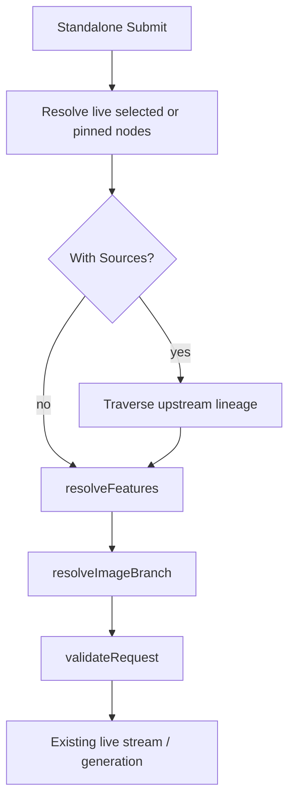

# AI Chat Workspace Sessions

The AI Chat panel is a workspace-owned right-side surface that opens, persists,
and restores independently of any canvas node. It hosts durable standalone chat
tabs, prompt drafts, compact context controls, and a collapsible Sessions list
that merges standalone chats with feature-extraction sessions for the workspace.

Context grouping nodes were removed from the live product. Historical renderer
samples are archived under
[`documentation/knowledge/archive/context-region-clouds/`](../knowledge/archive/context-region-clouds/).

## Current Status

The panel, standalone ownership model, context controls, Sessions projection,
and extraction-session history are implemented in the web UI and API:

- The panel host is the canvas-owned TypeScript stack in
  [`WorkspaceCanvas.ts`](../../services/web-ui/src/infographics/workspace/WorkspaceCanvas.ts).
- [`WorkspaceCanvas.svelte`](../../services/web-ui/src/components/WorkspaceCanvas.svelte)
  supplies the right-side launcher and canvas-state persistence.
- Panel presentation state is persisted under `CanvasState.aiChatPanel`, with
  defaults and legacy tab migration in
  [`aiChatPanelState.ts`](../../services/web-ui/src/infographics/workspace/aiChatPanelState.ts).
- Standalone chat creation and deletion live in
  [`ai-chat-thread.ts`](../../services/api/src/models/ai-chat-thread.ts) and
  [`ai-chat-thread-subjects.ts`](../../services/api/src/NATS/subscriptions/ai-chat-thread-subjects.ts).
- Extraction-session source snapshots, workspace listing, and non-cascade
  deletion live in
  [`extraction-run.ts`](../../services/api/src/models/extraction-run.ts) and
  [`extraction-subjects.ts`](../../services/api/src/NATS/subscriptions/extraction-subjects.ts).

Durable reload recovery of an in-flight normal-chat response is still deferred;
the panel restores persisted editor content and tabs, but not an interrupted
live stream.

## Core Concepts

**AI Chat Panel** - A singleton workspace surface. It can be open with zero
tabs. Opening, closing, resizing, toggling Sessions, switching context mode, and
editing a draft persist through `CanvasState.aiChatPanel`; none of these create
a durable session record.

**Standalone Chat** - An `AiChatThread` with owner `{ type: 'standalone' }`,
created only when the user submits the first prompt from a panel draft. Its
context comes from the panel-level selected or pinned live canvas items at submit
time.

**Feature-Extraction Session** - An `ExtractionRun` produced by the image
"Ask AI" extraction flow. It reconstructs its timeline and result from a stored
source-context snapshot and pipeline trace, and points at, but does not own, any
resulting Feature.

| Session kind | Durable identity | Context behavior | Deletion owner |
|---|---|---|---|
| Standalone chat | `AiChatThread.threadId`, owner `{ type: 'standalone' }` | Panel-level selected or pinned live canvas items at submit time | User deletes from Sessions |
| Feature-extraction session | `ExtractionRun.extractionRunId` | Stored extraction source-context snapshot plus pipeline trace | User deletes the session; the Feature remains |

## Context Controls

Standalone context accepts every supported canvas input already handled by the
extractor: document text content, image/media references, and supported upstream
chat content.

- **Follow** tracks the current canvas selection.
- **Pinned** freezes the currently loaded node ids; later selection changes are
  ignored.
- **With Sources** traverses upstream canvas lineage from the loaded targets.

The first submission creates a standalone `AiChatThread`, converts the draft
into an open tab, persists the new tab in panel state, resolves the selected or
pinned context, and publishes through the existing chat request path. Subsequent
submissions reuse the active standalone session with the current control state.
Context is attached only to the outgoing request; it is never silently copied
into the stored thread as a canvas node.

## Sessions List

Sessions is collapsed by default and toggled from the history icon in the panel
control row. When expanded it lists submitted standalone chats and submitted
feature-extraction sessions for the workspace, sorted by most recent update.
Closing a tab only changes panel presentation and the session remains
reopenable.

Standalone and extraction entries expose a permanent-delete control. Deleting an
extraction session removes only the run metadata/transcript; a saved Feature is
independent and remains available.

## State And Persistence

`WORKSPACES` stores `canvasState.aiChatPanel`: tab presentation, active tab,
open/collapsed panel state, width, context controls, and drafts.

`AI_CHAT_THREADS` stores durable standalone conversations. Workspace deletion
invokes `AiChatThread.deleteWorkspaceAiChatThreads({ workspaceId })` before the
workspace row is removed.

`EXTRACTION_RUNS` stores extraction-session transcript/trace history. Workspace
deletion invokes `ExtractionRun.deleteWorkspaceRuns({ workspaceId })`.

## Context Resolution

The browser resolves standalone context with
`extractSelectedContext({ nodeIds, includeUpstream })`. Feature use resolution
and image-branch routing continue through the existing LLM workflow stages.
