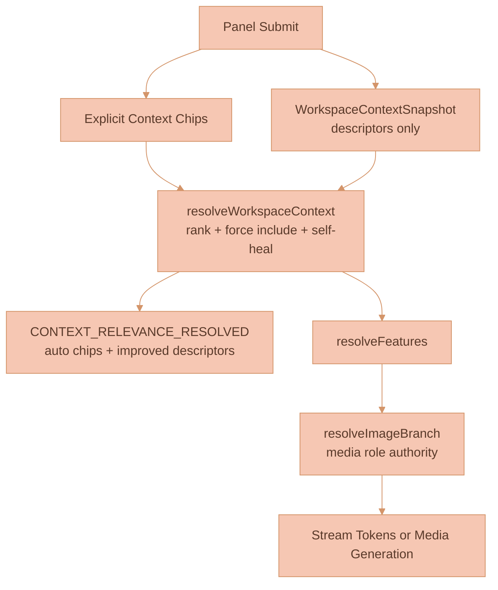

# AI Chat Workspace Sessions

The AI Chat panel is a workspace-owned right-side surface that opens, persists,
and restores independently of any canvas node. It hosts durable standalone chat
tabs, prompt drafts, explicit context chips, automatic workspace relevance
feedback, and a collapsible Sessions list that merges standalone chats with
feature-extraction sessions for the workspace.

Context grouping nodes were removed from the live product. Historical renderer
samples are archived under
[documentation/knowledge/archive/context-region-clouds](../knowledge/archive/context-region-clouds/README.md).
Current context relevance and branch-origin provenance are documented in
[WORKSPACE-CONTEXT-RELEVANCE-AND-BRANCH-ORIGINS.md](WORKSPACE-CONTEXT-RELEVANCE-AND-BRANCH-ORIGINS.md).

## Current Status

The panel, standalone ownership model, context chip tray, workspace relevance
feedback, Sessions projection, and extraction-session history are implemented in
the web UI and API:

- The panel host is the canvas-owned TypeScript stack in
  [WorkspaceCanvas.ts](../../services/web-ui/src/infographics/workspace/WorkspaceCanvas.ts).
- [WorkspaceCanvas.svelte](../../services/web-ui/src/components/WorkspaceCanvas.svelte)
  supplies the right-side launcher and canvas-state persistence.
- Panel presentation state is persisted under `CanvasState.aiChatPanel`, with
  defaults and chip sanitization in
  [aiChatPanelState.ts](../../services/web-ui/src/infographics/workspace/aiChatPanelState.ts).
- Standalone chat creation and deletion live in
  [ai-chat-thread.ts](../../services/api/src/models/ai-chat-thread.ts) and
  [ai-chat-thread-subjects.ts](../../services/api/src/NATS/subscriptions/ai-chat-thread-subjects.ts).
- Workspace relevance runs in
  [workspace-context-resolver.ts](../../services/api/src/llm/graph/workspace-context-resolver.ts)
  before feature resolution and image/video branch routing.
- Extraction-session source snapshots, workspace listing, and non-cascade
  deletion live in
  [extraction-run.ts](../../services/api/src/models/extraction-run.ts) and
  [extraction-subjects.ts](../../services/api/src/NATS/subscriptions/extraction-subjects.ts).

Durable reload recovery of an in-flight normal-chat response is still deferred;
the panel restores persisted editor content and tabs, but not an interrupted
live stream.

## Core Concepts

**AI Chat Panel** - A singleton workspace surface. It can be open with zero
tabs. Opening, closing, resizing, toggling Sessions, editing a draft, and
changing explicit context chips persist through `CanvasState.aiChatPanel`; none
of these create a durable session record by themselves.

**Standalone Chat** - An `AiChatThread` with owner `{ type: 'standalone' }`,
created only when the user submits the first prompt from a panel draft. Its
outgoing context is explicit chips plus the API's automatic workspace relevance
selection for that turn.

**Context Chip** - A persisted explicit force-include in the panel's context
tray. Chips are removable and sanitized against live canvas nodes.

**Auto Chip** - An ephemeral relevance-selected node shown after
`CONTEXT_RELEVANCE_RESOLVED`. Auto chips explain what the API selected
automatically; they are not persisted into panel state.

**Feature-Extraction Session** - An `ExtractionRun` produced by the image
"Ask AI" extraction flow. It reconstructs its timeline and result from a stored
source-context snapshot and pipeline trace, and points at, but does not own, any
resulting Feature.

| Session kind | Durable identity | Context behavior | Deletion owner |
|---|---|---|---|
| Standalone chat | `AiChatThread.threadId`, owner `{ type: 'standalone' }` | Explicit chips are force-included; workspace relevance adds auto selections per turn | User deletes from Sessions |
| Feature-extraction session | `ExtractionRun.extractionRunId` | Stored extraction source-context snapshot plus pipeline trace | User deletes the session; the Feature remains |

## Context Tray

The old Follow/Pinned/With Sources controls are gone. The panel now uses a chip
tray above the composer:

- Explicit chips persist in `CanvasState.aiChatPanel.contextChips`.
- Selecting eligible canvas nodes while the panel is open can add chips.
- Removing a chip does not tear down the ProseMirror composer or draft.
- Deleted nodes and duplicate IDs are sanitized out of persisted panel state.
- `branchOrigin` nodes are not chip targets; clicking one adds its stored
  reference nodes as chips and seeds the prompt draft.
- Auto chips render after `CONTEXT_RELEVANCE_RESOLVED` and can be removed from
  the visible tray without persisting.

On submit, explicit chips are resolved through the same extraction path used by
canvas-thread context. The browser also sends a `WorkspaceContextSnapshot`, a
descriptors-only index of context-bearing workspace nodes. The API ranks that
snapshot, force-includes chip and edge-connected nodes, and streams its
resolution back to the panel.

## Context Resolution

`resolveWorkspaceContext` runs on every chat turn, including text-only turns.
`resolveImageBranch` remains the authority for visual media roles when an image
or video model is selected.

## Sessions List

Sessions is collapsed by default and toggled from the history icon in the panel
control row. When expanded it lists submitted standalone chats and submitted
feature-extraction sessions for the workspace, sorted by most recent update.
Closing a tab only changes panel presentation and the session remains
reopenable.

Standalone and extraction entries expose a permanent-delete control. Deleting an
extraction session removes only the run metadata/transcript; a saved Feature is
independent and remains available.

## State And Persistence

`WORKSPACES` stores `canvasState.aiChatPanel`: tab presentation, active tab,
open/collapsed panel state, width, explicit `contextChips`, and drafts.

`AI_CHAT_THREADS` stores durable standalone conversations. Workspace deletion
invokes `AiChatThread.deleteWorkspaceAiChatThreads({ workspaceId })` before the
workspace row is removed.

`EXTRACTION_RUNS` stores extraction-session transcript/trace history. Workspace
deletion invokes `ExtractionRun.deleteWorkspaceRuns({ workspaceId })`.

`CONTEXT_RELEVANCE_RESOLVED` is stream feedback, not persisted panel state. The
browser uses it to render auto chips and patch improved descriptors into local
canvas state.

## References

- [WORKSPACE-CONTEXT-RELEVANCE-AND-BRANCH-ORIGINS.md](WORKSPACE-CONTEXT-RELEVANCE-AND-BRANCH-ORIGINS.md)
- [IMAGE-BRANCH-LINEAGE.md](IMAGE-BRANCH-LINEAGE.md)
- [MEDIA-DESCRIPTORS.md](MEDIA-DESCRIPTORS.md)
- [WORKSPACE-FEATURE.md](WORKSPACE-FEATURE.md)
