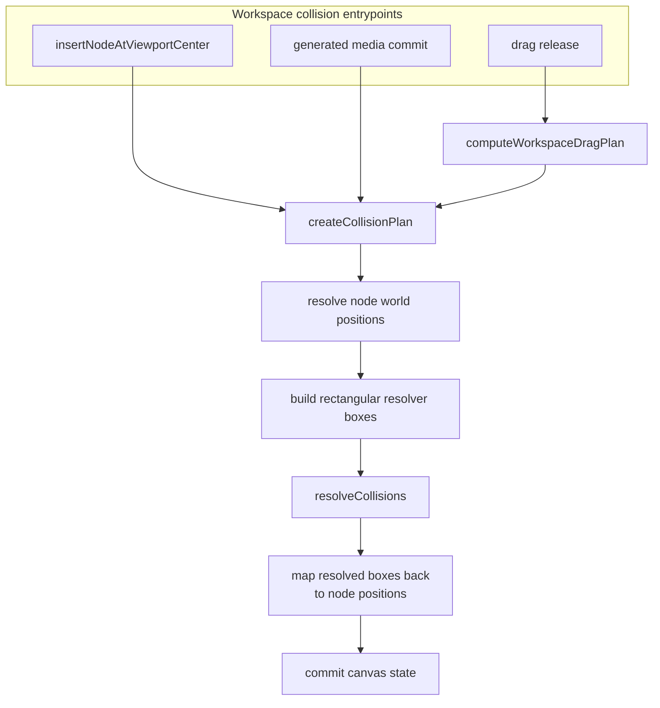

# Canvas Collision Resolution

Canvas collision resolution keeps newly inserted and released workspace nodes
from sitting on top of each other. It is a workspace-engine behavior, not a
Svelte behavior. The Svelte wrapper can create domain objects after app/service
work, but placement, viewport-coordinate math, drag-release planning, and
collision resolution belong in `services/web-ui/src/infographics/workspace` or
shared infographics utilities.

## Current Status

Collision resolution is implemented as two layers:

- [`resolveCollisions.ts`](../../services/web-ui/src/infographics/utils/resolveCollisions.ts)
  is the shared, geometry-agnostic resolver. It accepts rectangular boxes and
  pushes overlapping boxes apart.
- [`WorkspaceCanvas.ts`](../../services/web-ui/src/infographics/workspace/WorkspaceCanvas.ts)
  builds workspace-specific collision plans. It converts canvas nodes into
  world-space resolver boxes, applies parent/child exclusions, and converts
  resolved world positions back to persisted node positions.

## Architecture

| Component | Responsibility |
|---|---|
| `insertNodeAtViewportCenter(...)` | Renderer API used by toolbar insertions. Computes viewport-centered placement inside the workspace engine and resolves top-level collisions before emitting canvas state. |
| `computeWorkspaceDragPlan(...)` | Decides whether a drag release is allowed to run collision resolution and whether parent-container descendants participate in the drag. |
| `createCollisionPlan(...)` | Converts canvas nodes into world-space rectangular resolver boxes and adds parent/child exclusions. |
| `resolveCollisions(...)` | Shared rectangle resolver. It knows nothing about canvas node types, parentage, Svelte, PIXI, or viewport state. |

## Core Resolver

`resolveCollisions(...)` receives an array of boxes shaped like
`{ id, x, y, width, height }` and returns a map of moved box positions by id.

The resolver flow is:

1. Expand each box by the requested margin.
2. Check every pair in an O(n^2) loop.
3. Skip pairs listed in `excludePairs`.
4. Compute overlap on the x and y axes.
5. If both overlaps exceed the threshold, ask `shouldResolvePair(...)` whether
   the broad-phase overlap should be resolved.
6. Move both boxes apart along the smaller overlap axis.
7. Repeat until no boxes move or the iteration limit is reached.
8. Return only the boxes that actually moved.

This resolver should stay geometry-agnostic. Do not teach it about canvas node
types, generated image metadata, parent-child containment, or framework state.
Add workspace-specific behavior in the collision plan that feeds it.

## When Resolution Runs

| Path | Collision behavior |
|---|---|
| Toolbar document/image insertion | Svelte creates the node data and calls `renderer.insertNodeAtViewportCenter(...)`. The renderer computes viewport-centered placement and resolves top-level collisions. |
| Image or video generation commit | The generated media node is added to the canvas, parent/child pairs are excluded, and the resolver can move colliding nodes. |
| Image-to-image branch continuation | The new media node is placed from the latest branch node, then the resolver can move colliding nodes. |
| Edit-in-new-thread creation beside source media | The new AI chat thread node is placed next to the source media, then top-level collisions are resolved. |
| Drag release | `computeWorkspaceDragPlan(...)` decides whether collision resolution is allowed. Single-node drags can resolve; rigid group drags preserve spacing; parent-container drags can resolve against top-level peers. |

Do not duplicate this behavior in
[`WorkspaceCanvas.svelte`](../../services/web-ui/src/components/WorkspaceCanvas.svelte).
The Svelte file is a thin integration wrapper for DOM refs, stores, service
calls, upload plumbing, and callbacks.

## Parent And Child Rules

Parented nodes create one special case: a parent container and its real children
are allowed to overlap because containment is the point. Before resolving
collisions in full-node flows, `WorkspaceCanvas.ts` builds `excludePairs` for
parent/child pairs so the generic resolver does not push children out of their
container.

When a resolved child position is returned from the resolver, it is converted
from world coordinates back to parent-relative coordinates before being
persisted. Top-level nodes keep the resolved world position directly.

## Invariants

- Collision resolution must run through `resolveCollisions.ts`. Do not create a
  second resolver in Svelte or a feature-specific component.
- Workspace-specific collision knowledge belongs in `WorkspaceCanvas.ts` or a
  workspace utility, not in the generic resolver.
- Parent/child pairs must be excluded from collision resolution so containment
  does not push children out of their parent container.
- Persisted child positions must remain parent-relative after world-space
  collision resolution.
- Group drags must preserve rigid spacing unless the drag plan explicitly allows
  collision resolution.
- Generated branch media should keep lineage placement first; collision
  resolution is a cleanup pass after placement, not the branch-layout algorithm.

## Troubleshooting

| Symptom | Likely cause | Check |
|---|---|---|
| A newly inserted toolbar node overlaps an existing node | Insertion bypassed `renderer.insertNodeAtViewportCenter(...)` or top-level resolution | Check `WorkspaceCanvas.svelte` for direct position/collision logic. |
| Children are pushed out of a parent container after drag | Parent/child `excludePairs` were not passed to the resolver | Check the collision-exclusion set before `resolveCollisions(...)`. |
| Adopted child nodes persist at wrong coordinates | Resolved world position was not converted back to parent-relative position | Check `toParentRelativePosition(...)` usage after collision resolution. |
| Multi-selected nodes lose their spacing after drag | Drag plan allowed global collision resolution for a rigid group move | Check `computeWorkspaceDragPlan(...)` in `workspaceDragPlan.ts`. |

## Related Documentation

- [CANVAS-ENGINE.md](CANVAS-ENGINE.md) documents the full DOM/PIXI canvas
  rendering architecture and canvas configuration ownership rules.
- [WORKSPACE-FEATURE.md](WORKSPACE-FEATURE.md) documents the workspace feature,
  data flow, node types, and user-facing canvas concepts.
