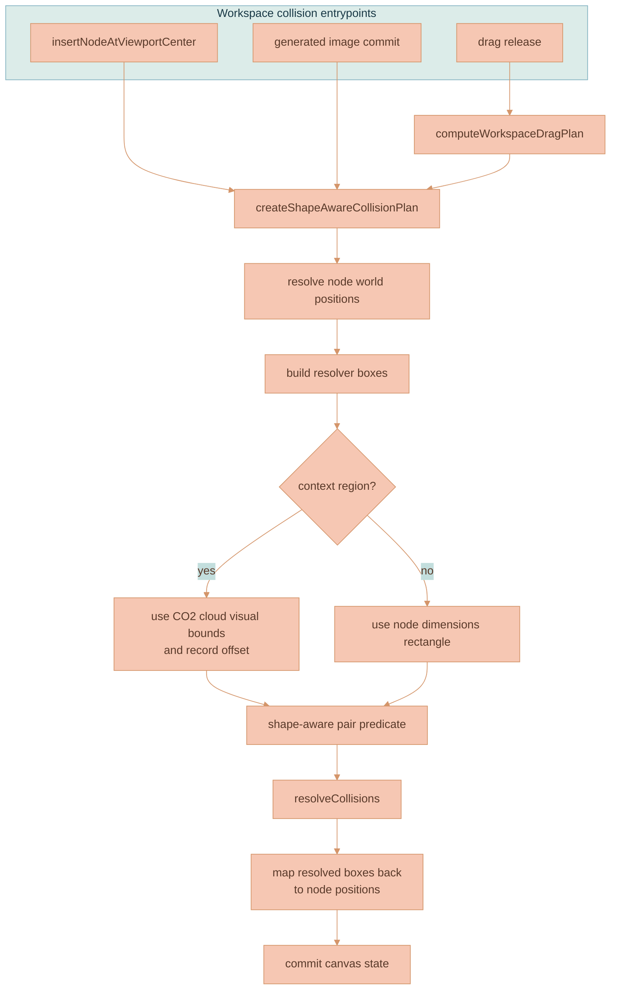

# Canvas Collision Resolution

Canvas collision resolution keeps newly inserted and released workspace nodes from sitting on top of each other. It is a workspace-engine behavior, not a Svelte behavior. The Svelte wrapper can create domain objects after app/service work, but placement, viewport-coordinate math, shape-aware collision planning, and collision resolution belong in `services/web-ui/src/infographics/workspace` or shared infographics utilities.

This document describes how collision resolution works today and where future changes should happen.

## Current Status

Collision resolution is implemented as two layers:

- [resolveCollisions.ts](../../services/web-ui/src/infographics/utils/resolveCollisions.ts) is the shared, geometry-agnostic resolver. It accepts rectangular boxes and pushes overlapping boxes apart.
- [WorkspaceCanvas.ts](../../services/web-ui/src/infographics/workspace/WorkspaceCanvas.ts) builds workspace-specific collision plans. It converts canvas nodes into resolver boxes, swaps context-region rectangles for CO2 cloud bounds, filters false-positive cloud overlaps, applies parent/child exclusions, and converts resolved world positions back to persisted node positions.

Context-region cloud geometry comes from [contextRegionClouds.ts](../../services/web-ui/src/infographics/workspace/rendering/contextRegionClouds.ts). Collision checks use the same cloud geometry family as hit testing, connector anchoring, resize-edge detection, marquee fallback, and drop adoption. Rectangles are allowed as broad-phase boxes, but the irregular cloud outline is the interaction truth.

## Architecture

| Component | Responsibility |
|---|---|
| `insertNodeAtViewportCenter(...)` | Renderer API used by toolbar insertions. Computes viewport-centered placement inside the workspace engine and resolves top-level collisions before emitting canvas state. |
| `computeWorkspaceDragPlan(...)` | Decides whether a drag release is allowed to run collision resolution and whether context-region descendants participate in the drag. |
| `createShapeAwareCollisionPlan(...)` | Converts canvas nodes into resolver boxes, including context-region cloud bounds and shape-aware pair checks. |
| `resolveCollisions(...)` | Shared rectangle resolver. It knows nothing about canvas nodes, context regions, parentage, Svelte, PIXI, or viewport state. |
| `contextRegionClouds.ts` | Supplies the irregular cloud geometry used to avoid rectangular false positives around transparent cloud corners. |

## Core Resolver

`resolveCollisions(...)` is intentionally small and generic. It receives an array of boxes shaped like `{ id, x, y, width, height }` and returns a map of moved box positions by id.

The resolver flow is:

1. Expand each box by the requested margin.
2. Check every pair in an O(n²) loop.
3. Skip pairs listed in `excludePairs`.
4. Compute overlap on the x and y axes.
5. If both overlaps exceed the threshold, ask `shouldResolvePair(...)` whether the broad-phase overlap is real.
6. Move both boxes apart along the smaller overlap axis.
7. Repeat until no boxes move or the iteration limit is reached.
8. Return only the boxes that actually moved.

This resolver should stay geometry-agnostic. Do not teach it about canvas node types, context-region clouds, generated image metadata, parent-child containment, or framework state. Add workspace-specific behavior in the collision plan that feeds it.

## Shape-Aware Collision Planning

`WorkspaceCanvas.ts` turns persisted canvas nodes into temporary resolver boxes. The important detail is that resolver boxes are in world coordinates, while some persisted nodes may be parent-relative.

For normal nodes, the resolver box is the node's world position plus persisted dimensions.

For context regions, the resolver box is not the transparent DOM proxy rectangle. The planner builds a `ContextRegionCloudDatum`, asks `getContextRegionCloudBounds(...)` for the visible cloud bounds, and records the offset between the persisted node position and that cloud-bound box. After resolution, that offset is applied in reverse so the persisted node position remains the logical region position, not the cloud-bound origin.

The collision plan also provides `shouldResolvePair(...)`. This predicate keeps rectangular broad-phase checks from becoming the final truth:

| Pair type | Final overlap check |
|---|---|
| Context region + context region | `contextRegionCloudsIntersect(...)` |
| Context region + rectangular node | `rectIntersectsContextRegionCloud(...)` |
| Rectangular node + rectangular node | Rectangle overlap from `resolveCollisions(...)` is enough |

This is why context regions can keep their irregular shape without requiring the generic resolver to understand cloud masks.

## When Resolution Runs

Collision resolution runs only from workspace-engine paths that own canvas behavior.

| Path | Collision behavior |
|---|---|
| Toolbar document/image/context-region insertion | Svelte creates the node data and calls `renderer.insertNodeAtViewportCenter(...)`. The renderer computes viewport-centered placement and resolves top-level collisions. |
| Image generation commit | The generated image is added to the canvas, parent/child pairs are excluded, and the shape-aware resolver can move colliding nodes. |
| Image-to-image branch continuation | The new image is placed from the latest branch image, then the shape-aware resolver can move colliding nodes. |
| Edit-thread/context-region creation beside a source image | The context region is placed next to the source image, then top-level collisions are resolved. |
| Drag release | `computeWorkspaceDragPlan(...)` decides whether collision resolution is allowed. Single-node drags can resolve; group drags preserve rigid spacing; context-region drags resolve against top-level peers. |

Do not duplicate this behavior in [WorkspaceCanvas.svelte](../../services/web-ui/src/components/WorkspaceCanvas.svelte). The Svelte file is a thin integration wrapper for DOM refs, stores, service calls, upload plumbing, and callbacks. If a future toolbar action needs collision-aware placement, expose a renderer API in `WorkspaceCanvas.ts` and reuse the workspace collision path.

## Parent, Child, And Context-Region Rules

Parented nodes create one special case: a region and its real children are allowed to overlap because containment is the point. Before resolving collisions in full-node flows, `WorkspaceCanvas.ts` builds `excludePairs` for parent/child pairs so the generic resolver does not push adopted children out of their container.

When a resolved child position is returned from the resolver, it is converted from world coordinates back to parent-relative coordinates before being persisted. Top-level nodes keep the resolved world position directly.

Context-region drag planning has additional constraints:

- A context-region drag includes real parented descendants for live visual movement.
- Generated output image nodes are excluded from context-region drag sets unless they are real selected or parented participants in a future interaction model.
- Merely connected nodes do not move with a region.
- Multi-node non-region drags skip global collision resolution so the selected group keeps its rigid spacing.

## Configuration And Tuning

The generic resolver accepts options for iteration count, overlap threshold, margin, excluded pairs, and pair filtering. Those options are call-site behavior, not user-facing theme settings by themselves.

If a collision-related value becomes a product/design tuning knob, put it in [webUiThemeSettings.ts](../../services/web-ui/src/webUiThemeSettings.ts) following the canvas configuration ownership rules in [CANVAS-ENGINE.md](CANVAS-ENGINE.md). Do not add new configurable magic numbers directly to Svelte, PIXI layers, or ad hoc helper modules.

## Invariants

Keep these rules intact when changing collision behavior:

- Collision resolution must run through [resolveCollisions.ts](../../services/web-ui/src/infographics/utils/resolveCollisions.ts). Do not create a second resolver in Svelte or a feature-specific component.
- Workspace-specific collision knowledge belongs in `WorkspaceCanvas.ts` or a workspace utility, not in the generic resolver.
- Context-region collisions must respect the same CO2 cloud geometry used by hit testing, resize-edge detection, connector anchoring, marquee fallback, and adoption scoring.
- Parent/child pairs must be excluded from collision resolution so containment does not push children out of their region.
- Persisted child positions must remain parent-relative after world-space collision resolution.
- Group drags must preserve rigid spacing unless the drag plan explicitly allows collision resolution.
- Generated branch images should keep their lineage placement first; collision resolution is a cleanup pass after placement, not the branch-layout algorithm.

## Troubleshooting

| Symptom | Likely cause | Check |
|---|---|---|
| A newly inserted toolbar node overlaps an existing region | Insertion bypassed `renderer.insertNodeAtViewportCenter(...)` or top-level resolution | Check [WorkspaceCanvas.svelte](../../services/web-ui/src/components/WorkspaceCanvas.svelte) for direct position/collision logic. |
| Context regions repel nodes from transparent corners | Rectangular bounds became the final truth | Check `shouldResolvePair(...)` in [WorkspaceCanvas.ts](../../services/web-ui/src/infographics/workspace/WorkspaceCanvas.ts) and the cloud geometry calls. |
| Children are pushed out of a context region after drop | Parent/child `excludePairs` were not passed to the resolver | Check the collision-exclusion set before `resolveCollisions(...)`. |
| Adopted child nodes persist at wrong coordinates | Resolved world position was not converted back to parent-relative position | Check `toParentRelativePosition(...)` usage after collision resolution. |
| Multi-selected nodes lose their spacing after drag | Drag plan allowed global collision resolution for a rigid group move | Check `computeWorkspaceDragPlan(...)` in [workspaceDragPlan.ts](../../services/web-ui/src/infographics/workspace/workspaceDragPlan.ts). |
| A context region drag moves generated outputs unexpectedly | Generated image exclusions were removed from the drag plan | Check generated-output filtering in `includeContextRegionDescendants(...)`. |

## Related Documentation

- [CANVAS-ENGINE.md](CANVAS-ENGINE.md) documents the full DOM/SVG/PIXI canvas rendering architecture and canvas configuration ownership rules.
- [CONTEXT-REGION-CLOUDS.md](CONTEXT-REGION-CLOUDS.md) documents the context-region cloud geometry used by collision filtering, hit testing, anchoring, and adoption scoring.
- [WORKSPACE-FEATURE.md](WORKSPACE-FEATURE.md) documents the workspace feature, data flow, node types, and user-facing canvas concepts.