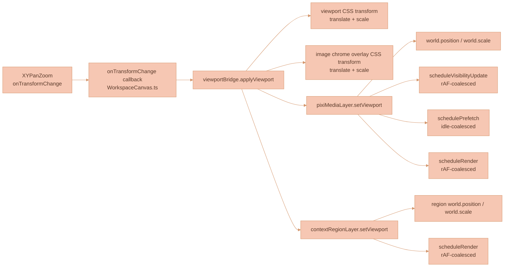
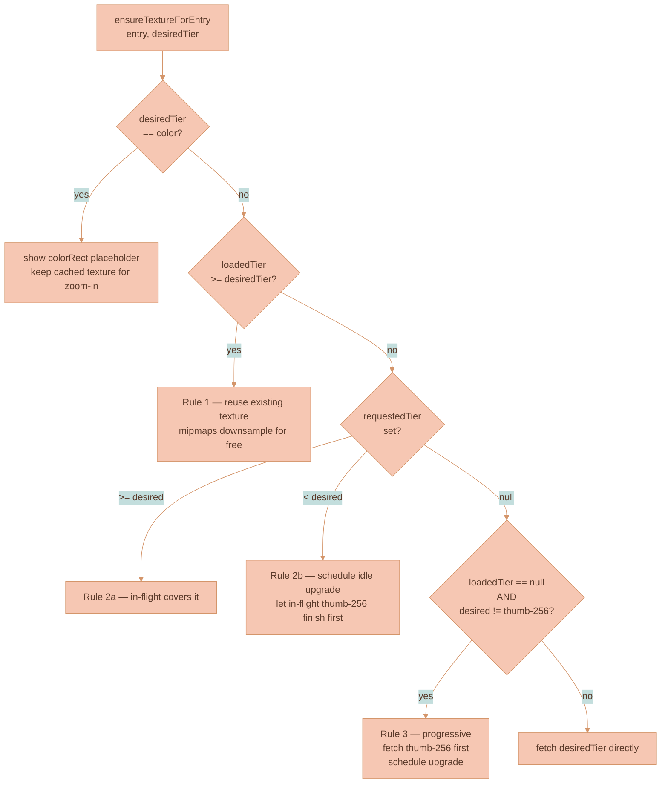
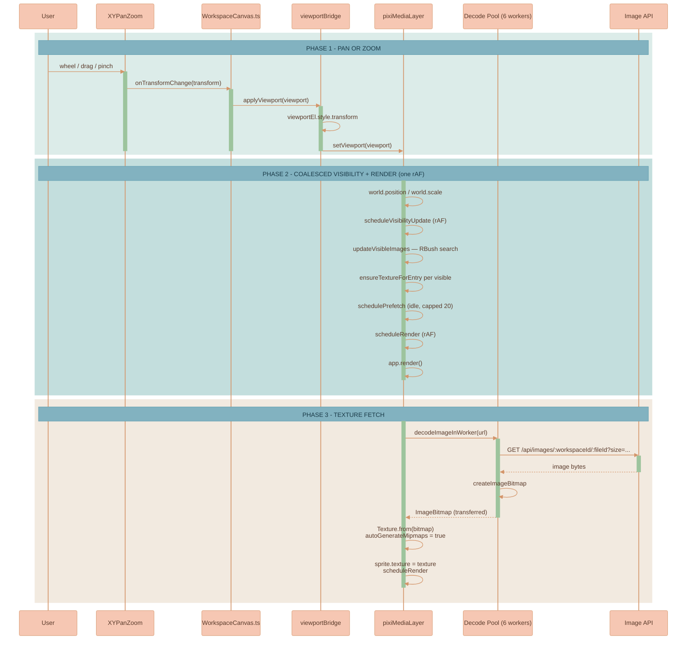

# Canvas Engine

The workspace canvas is a **DOM interaction shell with PIXI v8 visual layers**. The `services/web-ui/src/infographics/workspace/WorkspaceCanvas.ts` stack owns rich UI and stateful interactions: ProseMirror, the workspace-owned AI Chat panel and Sessions surface, the right-side Media Library panel, prompt inputs, bubble menus, resize/drag/selection orchestration, parent-child containment, and handles. The AI Chat panel can be open with zero tabs and without a context region; its UI state is persisted in canvas state. PIXI v8 owns image pixel rendering, video poster/placeholder rendering, generated-image progress outlines, workspace connector pixels, image-node selection chrome, and marquee/group overlays through `services/web-ui/src/infographics/workspace/pixiMediaLayer.ts`; browser-composited DOM video surfaces own completed video playback and controls in the transformed chrome layer; the reusable `services/web-ui/src/utils/animations/gradients/pixiTravelingOutlineRenderer.ts` paints traveling progress outlines; `services/web-ui/src/infographics/workspace/rendering/pixiContextRegionLayer.ts` owns context-region CO2-shaped cloud visuals.

The canonical architectural rationale lives in `documentation/knowledge/RENDERING-ARCHITECTURE-FOR-MEDIA-HEAVY-CANVAS.md`. The current path is renderer ownership by workload: DOM owns text-rich controls and interaction structure; PIXI owns high-volume pixels, connector strokes, context-region clouds, and canvas chrome.

## Why This Matters

When working on canvas code, you need to know two libraries:

1. **`@xyflow/system`** for pan/zoom and connection math (no Svelte/React wrappers). The Svelte layer (`WorkspaceCanvas.svelte`) is a thin binding.
2. **PIXI v8** for the media layer (`Application`, `Container`, `Sprite`, `Texture`). The PIXI documentation is the source of truth: <https://pixijs.com/8.x/guides/components/application>.

## Documentation Navigation

### Canvas feature documentation

For the workspace feature itself — node types, stores, services, data flow, architecture diagrams — see `documentation/features/WORKSPACE-FEATURE.md`.

For context-region cloud rendering, shape-based hit testing, adoption scoring, and performance constraints, see [CONTEXT-REGION-CLOUDS.md](CONTEXT-REGION-CLOUDS.md).

For workspace collision resolution, placement cleanup, drag-release collision rules, and context-region shape-aware collision planning, see [CANVAS-COLLISION-RESOLUTION.md](CANVAS-COLLISION-RESOLUTION.md).

### Canvas implementation code

The active canvas implementation lives in `services/web-ui/src/infographics/`. Key files:

| File | Purpose |
|------|---------|
| `workspace/WorkspaceCanvas.ts` | Main canvas orchestrator: DOM nodes, ProseMirror integration, drag/resize/selection, viewport, and PIXI media/context-region sync points |
| `workspace/aiChatPanelState.ts` | Persisted AI Chat panel defaults, legacy-tab migration, and standalone selected-context filtering |
| `workspace/mediaLibraryPanel.ts` | Framework-agnostic Media Library surface: Feature adapter, saved image/video browsing, scope filters, and insertion actions |
| `workspace/media-library-panel.scss` | Right-side Media Library layout and full-content wrapping rules |
| `utils/resolveCollisions.ts` | Shared geometry-agnostic rectangle collision resolver used by workspace insertion, generated image commit, and drag-release cleanup paths |
| `workspace/pixiMediaLayer.ts` | PIXI v8 media layer for image pixels, video posters/placeholders, and generated-image outline synchronization — sprite registry, texture cache, LoD-tier loader, visibility scanner, prefetch scheduler |
| `workspace/pixiMediaLayerLogic.ts` | Pure helpers: tier ranking, world-position math, src URL building, LoD-size param injection, world-rect math |
| `utils/animations/gradients/pixiTravelingOutlineRenderer.ts` | Reusable PIXI traveling outline renderer — rounded-path math, track/segment painting, shared easing, active-only animation loop |
| `workspace/pixiImageDecoder.ts` | Six-worker decode pool: round-robin dispatch with per-worker request tracking |
| `workspace/pixiImageDecodeWorker.ts` | Worker body: `fetch` → `createImageBitmap` and post the bitmap back |
| `workspace/rendering/contextRegionClouds.ts` | Pure context-region cloud geometry: style selection, CO2 SVG-mask hit zones, title hit zones, and adoption scoring |
| `workspace/rendering/pixiContextRegionLayer.ts` | PIXI v8 context-region layer — shared CO2-shaped seafoam textures, cloud sprites, PIXI title text, optional baked border, culling, bounded pulse animation |
| `workspace/rendering/pixiEdgeRenderer.ts` | PIXI edge renderer (diffed; reuses `Graphics`) |
| `workspace/rendering/viewportBridge.ts` | Single call site that applies a viewport to DOM CSS, PIXI media, and PIXI context-region layers |
| `workspace/rendering/mediaNodeRegistry.ts` | Dispatches non-image media nodes to specialized handlers; video nodes are handled by `videoNodeHandler.ts` |
| `workspace/rendering/videoNodeHandler.ts` | Video node renderer that owns PIXI poster/placeholder sprites and the authenticated `HTMLVideoElement` consumed by DOM video chrome |
| `workspace/workspaceRenderStatePlan.ts` | Pure render-state reconciliation for pending local visual commits while store acknowledgements arrive |
| `workspace/workspaceViewportStatePlan.ts` | Pure stale viewport-only render guard; keeps delayed store viewport updates from overriding the live transform |
| `workspace/WorkspaceConnectionManager.ts` | Edge creation, proximity connect, candidate detection, and the data feed for `pixiEdgeRenderer` |
| `connectors/renderer.ts` | SVG connector rendering (still authoritative for hit testing) |
| `utils/zoomScaling.ts` | Zoom-compensated handle scaling |

Use the incremental canvas architecture documented here as the implementation recipe: preserve the existing `infographics/workspace` entrypoint, harden the PIXI media layer, and move one renderer responsibility at a time only after parity checks pass.

### Canvas Configuration Ownership

All configurable web UI settings belong in [settings.ts](../../services/web-ui/src/settings.ts). This includes feature flags, colors, shadows, dimensions, gaps, hit radii, animation timing, title sizing, generated-image placement spacing, and other values that product/design tuning may reasonably adjust without changing the interaction algorithm.

Do not add new configurable magic-number constants or UI behavior flags directly to [WorkspaceCanvas.ts](../../services/web-ui/src/infographics/workspace/WorkspaceCanvas.ts), Svelte wrappers, PIXI rendering layers, or helper modules. Add them to `settings` first and read them from the consuming code. For example, the AI chat resize/drag rail hit target lives at `settings.aiChatThread.rail.dragGrabWidth`, and the Media Library uses `settings.mediaLibrary.panelWidthFraction`.

`settings` must stay organized by logical groups. Each top-level group is its own subsection, such as `aiChatThread`, `connector`, `selection`, or `imageNode`; a group may contain nested subsections when a domain has a clear child domain, such as `aiChatThread.rail` or `contextRegion.cloud`. Every group and nested group must have a blank line before and after it in the object literal. Every key must have a short comment explaining what the value means and how changing it affects the application. Do not create a second global web UI settings module.

Use object getters in `settings` only when a setting must compute its value from sibling keys with `this`, such as a `styles` list referencing sibling `palettes`. Static values must remain plain properties; do not use getters just to organize or label settings.

### @xyflow/system reference

The vendored `@xyflow/system` package has its own documentation set stored in `documentation/vendor-documentation/xyflow/`. Start from the top-level guide and follow its links to per-module docs:

```
documentation/vendor-documentation/xyflow/
  overview.md                    ← start here (system vs wrappers, limitations, Lixpi integration)
  src/
    ├── pan-zoom.md              — Viewport pan & zoom (XYPanZoom)
    ├── drag.md                  — Node dragging (XYDrag)
    ├── connections.md           — Connection handles (XYHandle)
    ├── resize.md                — Node resizing (XYResizer)
    ├── minimap.md               — Minimap (XYMinimap)
    ├── edge-routing.md          — Edge path calculation (bezier, smoothstep, straight)
    ├── dom-contract.md          — CSS classes, DOM structure, z-index layers, theming
    ├── types-and-constants.md   — Type hierarchies, coordinate spaces, error IDs
    └── utilities.md             — Coordinate conversion, spatial math, node adoption
```

---

## Rendering Architecture

### Layer Stack

```mermaid
%%{init: {'theme': 'base', 'themeVariables': { 'primaryColor': '#F6C7B3', 'primaryTextColor': '#5a3a2a', 'primaryBorderColor': '#d4956a', 'secondaryColor': '#C3DEDD', 'secondaryTextColor': '#1a3a47', 'secondaryBorderColor': '#4a8a9d', 'tertiaryColor': '#DCECE9', 'tertiaryTextColor': '#1a3a47', 'tertiaryBorderColor': '#82B2C0', 'lineColor': '#d4956a', 'textColor': '#5a3a2a'}}}%%
flowchart TB
    subgraph Pane[".workspace-pane"]
        subgraph RegionPixi[".workspace-pixi-context-region-layer (z-index 0, PIXI canvas)"]
            REGION_WORLD[Context region world Container<br/>scale = viewport.zoom<br/>position = viewport.x, y]
            CLOUDS[CO2 cloud sprites<br/>title Text]
        end
        subgraph Viewport[".workspace-viewport (z-index 1, CSS-transformed)"]
            DOC[Document Nodes]
            THR[AI Chat Thread Nodes]
            REGION_PROXY[Context region DOM proxies<br/>transparent data-node-id geometry]
            IMG_DOM[Image Node DOM shells<br/>data-node-id + interaction chrome]
            HANDLE[Handles, drag overlays, resize handles]
        end
        subgraph PixiCanvas[".workspace-pixi-media-layer (z-index 2, PIXI canvas)"]
            WORLD[Pixi world Container<br/>scale = viewport.zoom<br/>position = viewport.x, y]
            EDGE_PIXI[edgeLayer: PIXI Graphics edges]
            IMG_SPR[image sprites + colorRect placeholders]
            GEN_BORDER[generatingBorderLayer: traveling generation progress paths]
            FG[fgLayer: selection outlines, marquee, group overlay]
        end
        subgraph ImageChrome[".workspace-image-chrome-viewport (z-index 3, CSS-transformed)"]
            IMG_CHROME[Generated-image provider badge<br/>info button + provenance panel]
            VIDEO_CHROME[Visible video surface<br/>shared SVG controls]
        end
    end

    RegionPixi --> Viewport
    REGION_WORLD --> CLOUDS
    Viewport --> PixiCanvas
    WORLD --> EDGE_PIXI
    WORLD --> IMG_SPR
    WORLD --> GEN_BORDER
    WORLD --> FG
    PixiCanvas --> ImageChrome
```



The PIXI image canvas sits **above** the DOM viewport; the PIXI context-region canvas sits **below** it. Generated-image provider badges, info buttons, full-width provenance panels, and completed video DOM surfaces sit in `.workspace-image-chrome-viewport`, a separate CSS-transformed DOM overlay above the PIXI media canvas. Provenance panels use the exact image-node width and expand to their full content height, so long prompts and reference metadata are not cropped. Video chrome uses the same viewport transform but is positioned over the PIXI poster sprite so browser playback, seeking, Picture-in-Picture, fullscreen, and SVG controls stay independent from connector rendering. Image/video node DOM shells are kept as `<div data-node-id>` elements for two reasons:

1. They host core interaction chrome — drag overlay and resize handles.
2. They provide stable DOM geometry for selection, drag, resize, and bubble-menu integration.

Canvas image nodes create no DOM `` element. Stored, external, data-URL, and generated partial image sources all go through the PIXI media layer, so there is no duplicate hidden loader or fallback pixel surface. Completed video nodes are the deliberate exception: PIXI renders the poster/placeholder and stable geometry, while the actual MP4 frames come from the visible DOM `<video>` element in chrome. Generated-image partial pixels and the traveling in-progress outline are rendered by PIXI, not by a DOM/SVG overlay.

Context-region DOM elements are also kept, but only as transparent geometry proxies for existing drag, selection, connection-manager, and parent-child state paths. Their visible CO2-shaped cloud and title text are drawn by `pixiContextRegionLayer`. Empty-region pointer behavior starts in the pane background handler, calls `contextRegionLayer.hitTest(worldPoint)`, and then reuses the existing drag handler for the matched node.

### Viewport Bridge

Pan/zoom flows through a single call site:



This gives DOM and PIXI a single, consistent transform every frame. There is no second `app.render()` call from elsewhere in the codebase.

### Viewport State Ownership

During active pan, zoom, drag, resize, and context-region interaction, the live viewport in [WorkspaceCanvas.ts](../../services/web-ui/src/infographics/workspace/WorkspaceCanvas.ts) is the rendering source of truth. The Svelte/store viewport is an acknowledgement and persistence path, not an authority that can replay over the live transform while the canvas is already on screen.

This rule exists because stale viewport-only renders can look exactly like node-position bugs. The failure signature is:

- `viewportChanged: true`
- `visualStateChanged: false`
- `needsRerender: false`
- `oldViewport` and `newViewport` differ by a large pan delta
- no drag commit, node upsert, edge sync, or PIXI live-transform event explains the visual move

In that state, applying the incoming store viewport through `viewportBridge.applyViewport(...)` teleports the DOM viewport, PIXI media world, and PIXI context-region world together. The user sees clouds and images jump even though no node changed position. The effect is easiest to reproduce after panning far enough that a region leaves the visible area and then dragging or revealing it again, because the stale viewport delta is large and PIXI culling makes the transform replay visually obvious.

Keep these ownership rules intact:

1. `XYPanZoom` `onTransformChange` must update `lastTransform`, `currentCanvasState.viewport`, and any pending local visual commit viewport immediately before calling `viewportBridge.applyViewport(...)`.
2. [WorkspaceCanvas.svelte](../../services/web-ui/src/components/WorkspaceCanvas.svelte) must persist canvas state with the current live `viewport`, even when the caller passes a `CanvasState` object captured before the latest pan.
3. Debounced viewport saves must capture the scheduled viewport and abort if a newer viewport arrives before the timer fires.
4. Store renders that only change viewport, do not change visual node/edge state, do not require a full rerender, and disagree with the live viewport must preserve the live viewport. That guard is isolated in [workspaceViewportStatePlan.ts](../../services/web-ui/src/infographics/workspace/workspaceViewportStatePlan.ts).
5. Do not call `viewportBridge.applyViewport(...)` from stale-render acknowledgement paths. Use `panZoom.syncViewport(liveViewport)` to keep XYFlow's internal state aligned with the live transform without repainting a stale transform onto DOM and PIXI.

Regression coverage lives in [workspaceViewportStatePlan.test.ts](../../services/web-ui/src/infographics/workspace/workspaceViewportStatePlan.test.ts), [workspaceRenderStatePlan.test.ts](../../services/web-ui/src/infographics/workspace/workspaceRenderStatePlan.test.ts), and the viewport ownership source-shape tests in [workspace-canvas.test.ts](../../services/web-ui/src/infographics/workspace/workspace-canvas.test.ts). If you change viewport persistence, render-state reconciliation, or PIXI viewport sync, update those tests in the same change.

### Sync Pipeline

`pixiMediaLayer.sync(canvasState)` is called from the canvas orchestration points that actually need visual layer reconciliation: initial create, full DOM node rerenders, local `commitCanvasState`, and incoming store renders whose node/edge visual sync key changed. Viewport-only renders do not resync media entries; they go through the viewport bridge or the stale viewport guard. Each media sync:

1. Removes deleted entries: `releaseTexture` → `spatialIndex.remove` → destroys sprite + colorRect.
2. Calls `upsertAllEntries` → image nodes update directly and video nodes route through `mediaNodeRegistry` to `videoNodeHandler`; each changed entry updates only what actually changed:
   - **Sprite transform** (position + width/height): always updated; cheap matrix update.
   - **Color-rect geometry** (`Graphics.clear()` + `roundRect()` + `fill()`): rebuilt only when width or height changed since last upsert.
   - **Spatial index entry**: removed and re-inserted only when the world rect actually changed.
   - **Video chrome attachment**: the handler owns the authenticated `HTMLVideoElement`; `WorkspaceCanvas.ts` positions that same element in `.workspace-video-chrome` when the node is complete.
3. Reconciles `generatingBorderLayer` from the transient generating-node set by synchronizing bounds into `PixiTravelingOutlineRenderer`; each active generated image gets its PIXI track and traveling segment until completion or failure clears it.
4. Single `updateVisibleImages()` pass to mark renderable flags and fire texture loads for newly-visible entries.
5. Schedules an idle prefetch tick.
6. Schedules a render via rAF.

`contextRegionLayer.sync(getContextRegionCloudDatums())` runs alongside media sync after state commits, full DOM rerenders, and selection changes. Each sync:

1. Builds world-space region datums from persisted canvas nodes plus live drag/resize overrides.
2. Selects a deterministic cloud style from `contextRegionClouds.ts` based on node ID and aspect ratio.
3. Reuses one generated seafoam `Texture` per cloud style and border setting instead of generating per-node bitmaps.
4. Updates sprite position/size and title text only when geometry or zoom changed.
5. Culls off-screen clouds with the same viewport world-rect helper used by the media layer.
6. Schedules a render via rAF.

Cloud connector anchoring, resize-edge hit testing, body hit testing, and drag-adoption scoring use the same sampled CO2 SVG mask from `contextRegionClouds.ts`, so connector lines follow the visible irregular outline and transparent rectangle corners do not behave like region body hits or drop targets. `WorkspaceConnectionManager.ts` keeps SVG connector paths and PIXI edge data aligned by applying cloud-anchor offsets from `getContextRegionCloudAnchorPoint(...)` during each edge render, including live resize renders.

### Render Scheduling

PIXI's auto-ticker is **disabled** (`autoStart: false` + `app.ticker.stop()`). Every render goes through `scheduleRender()`, which coalesces multiple call sites into one `requestAnimationFrame(() => app.render())`. `PixiTravelingOutlineRenderer` runs a bounded rAF loop only while an outline datum is active; when no generation is active, the media layer has no continuous render cost.

`updateVisibleImages` is also rAF-coalesced (`scheduleVisibilityUpdate`), so a 60 Hz wheel-zoom that triggers `setViewport` on every tick performs the spatial-index scan + entry iteration **once per frame**, not 60 times.

---

## Image Rendering Pipeline

### LoD Tiers

Zoom level maps to a level-of-detail tier:

| Zoom range | Tier | What it loads |
|------------|------|---------------|
| `< 0.1` | `color` | Just a tinted `Graphics` rect — no texture |
| `0.1 – 0.4` | `thumb-256` | URL with `?size=256` |
| `0.4 – 1.0` | `thumb-1024` | URL with `?size=1024` |
| `≥ 1.0` | `full` | Full-resolution URL |

`tierRank()` orders the tiers (`color < thumb-256 < thumb-1024 < full`).

### Texture Loading Rules

The `ensureTextureForEntry(entry, desiredTier)` function is idempotent and follows three cardinal rules:



**Rule 1 — never downgrade.** Mipmaps make a `full`-resolution texture render perfectly at any zoom level; refetching `thumb-256` when `full` is already on the GPU is pure waste and was the root cause of zoom-out lag.

**Rule 2 — never duplicate in-flight.** If a request is already in flight that covers our needs, do nothing. If it's a lower tier (the progressive thumb-256 first step), schedule an idle upgrade and let the in-flight request finish.

**Rule 3 — progressive thumb-256 first.** When an entry has nothing loaded yet and the desired tier is bigger than `thumb-256`, load `thumb-256` first for instant visual feedback, then schedule a background upgrade to the desired tier in idle time.

### Visibility-Driven Loading

Texture fetches are gated by visibility. `updateVisibleImages()`:

1. Computes the visible world rect with a `VISIBILITY_MARGIN = 1200` world-unit ring.
2. Searches the RBush spatial index for entries whose rects intersect.
3. For each entry:
   - If visibility transitioned (true ↔ false), updates `sprite.renderable` and `colorRect.renderable`.
   - If visible, calls `ensureTextureForEntry(entry, currentTier)` (idempotent — no-op if already loaded).

Non-visible entries keep any cached texture they have. They will get their textures evicted only under genuine cache pressure (see Cache Eviction below).

### Idle Prefetch

`schedulePrefetch()` runs in `requestIdleCallback` slots (with a `setTimeout` fallback) and prefetches `thumb-256` for **all** unloaded entries in the workspace, sorted by world-distance from viewport centre. A `PREFETCH_BATCH_SIZE = 20` cap means each idle tick processes only the 20 nearest unloaded entries; if more remain, the next idle slot picks them up.

This gives the canvas an "always-warm" cache: panning around the workspace reveals images that already have a texture on the GPU, so there is no progressive-fetch flash.

### Decode Pool

Decoding goes through `pixiImageDecoder.ts`, which lazily spawns up to **6 web workers** in a round-robin pool. Six matches the typical browser per-origin connection limit so every available TCP slot is used for image fetching while multiple CPU cores handle the (CPU-bound) `createImageBitmap` step in parallel.

A single shared auth-token promise is reused across all concurrent `resolveImageSrc` calls in a 30-second window so 200 in-flight image loads don't each invoke `getTokenSilently()` independently.

### Texture Cache

`textureCache: Map<url, { texture, bytes, refCount, lastUsed }>` deduplicates GPU uploads by URL. Each `acquireTexture(url)` either returns the cached entry (bumping `refCount` + `lastUsed`) or decodes and creates a new texture.

Limits: **2000 textures** OR **768 MB**. When either ceiling is exceeded, `evictTextures()` runs in two passes:

1. **Idle eviction (LRU)**: drop textures with `refCount == 0` (already detached from any sprite), oldest first.
2. **Pressure eviction**: under genuine memory pressure, detach textures from **non-visible** sprites (LRU first), so their cache slot can be reclaimed. The sprite reverts to its color placeholder; visibility re-fetches the right tier on demand. **Visible sprites are never evicted from under the user.**

### Mipmaps

Every texture is created with `texture.source.autoGenerateMipmaps = true` before its first GPU upload. Without mipmaps, a 1024 px texture rendered at 10 px (zoom 0.01×) forces the GPU to sample the full 1 MB texel buffer for each output pixel — catastrophic with hundreds of images visible. With mipmaps, the GPU selects the pre-computed 8 × 8 or 16 × 16 MIP level and texture-cache pressure drops by ~4 orders of magnitude.

### Edge Renderer

`pixiEdgeRenderer.ts` reuses `Graphics` objects across renders. Each edge is keyed by `id` and has a fingerprint (`svgPath | strokeColor | strokeWidth | arrows`); the `Graphics` is only repainted when the fingerprint changes. Removed edges are destroyed; new ones are allocated. This eliminates the original O(edges) destroy + alloc + GPU-upload cycle on every `scheduleEdgesRender` call.

---

## Performance: What Has Been Optimized

The PIXI media layer has gone through several rounds of perf hardening. The current state:

| Optimization | What it does |
|-------------|--------------|
| **Six-worker decode pool** | Replaces a single decode worker. Image fetch + decode runs on up to 6 CPU cores simultaneously, saturating the browser's per-origin connection limit instead of serializing every decode behind a single message handler. |
| **Mipmaps on every texture** | `autoGenerateMipmaps: true` so zoom-out doesn't sample full-resolution texels. |
| **Shared auth token** | All concurrent `resolveImageSrc` calls share one `getTokenSilently()` promise (refreshed every 30 s) so 200 in-flight loads don't each await an independent auth round-trip. |
| **Auto-ticker disabled** | `autoStart: false` + `app.ticker.stop()`. All renders are rAF-coalesced via `scheduleRender()` so an idle canvas costs zero GPU. |
| **rAF-coalesced visibility scan** | 60 Hz wheel-zoom triggers one `updateVisibleImages()` per frame, not 60. |
| **Lazy texture loads (visibility-driven)** | Textures are loaded only for sprites whose world rects intersect the visible margin; non-visible sprites cost zero network. |
| **Never-downgrade tier policy** | Once a higher-tier texture is on the GPU, zoom-out never re-fetches a lower tier — mipmaps handle downsampling for free. |
| **Progressive `thumb-256`-first** | First-paint loads tiny thumbnails for visible sprites; full-tier upgrades happen in idle. |
| **Idle prefetch (capped)** | Up to 20 unloaded entries per idle tick get pre-cached at `thumb-256`, sorted by viewport distance. Pan reveals already-loaded images. |
| **DOM `` pixel surface eliminated** | Canvas image nodes contain no DOM image element; PIXI is the only image pixel renderer for stored, external, and generated-partial sources. |
| **DOM video playback split** | Completed videos use PIXI only for poster/placeholder geometry and keep the real `<video>` visible in chrome, so playback and scrubbing do not drive a PIXI video texture loop or interfere with connector rendering. |
| **Visual-state-gated PIXI `sync()`** | Media entries resync on initial create, full DOM rerenders, local commits, and store renders with node/edge visual changes. Viewport-only renders do not upsert media entries. |
| **Incremental RBush** | The spatial index is updated per-node (`remove` + `insert`) only when geometry actually changed, avoiding full rebuilds on every sync. |
| **`drawColorRect` skip-when-unchanged** | Placeholder geometry is only rebuilt when the node's width or height actually changed; transform updates are matrix-only. |
| **`syncDomOwnership` skip when no-op** | `classList.toggle` only runs for nodes whose ownership state actually changed. |
| **PIXI edge renderer diff** | `Graphics` objects are reused across renders; geometry is only repainted when the edge fingerprint changes. |

---

## Known Performance Issues and Improvement Opportunities

These are the issues a future round of work should tackle. Listed in priority order — biggest gains first.

### 1. The API does not actually serve resized thumbnails

**This is the biggest unrealized win in the entire LoD system.**

`pixiMediaLayerLogic.addPixiLodSizeParam()` appends `?size=256` or `?size=1024` to the image URL. The API handler at `services/api/src/routes/image-routes.ts` (`GET /:workspaceId/:fileId`) **ignores those query params completely** and serves the full-resolution object back from NATS Object Store. The `?size=` value only changes the URL string, not the bytes.

Consequences:

- **`thumb-256` and `thumb-1024` requests download the same bytes as `full`.** The progressive `thumb-256`-first strategy currently doesn't make first-paint faster on the network side; it only helps because the GPU upload is smaller after decode (since `createImageBitmap` decodes the original size).
- **Browser cache is fragmented by URL.** A `thumb-256` and a `full` request for the same image are two separate cache entries with the same bytes. Effective cache hit rate for stored images is much lower than it should be.
- **Idle prefetch downloads full-size payloads.** Caching the entire workspace at "thumb-256" is, today, caching the workspace at full resolution.

**Fix options, in increasing complexity:**

1. **Resize on the API.** Add a `?size=` aware handler that pipes the NATS object through `sharp` (or equivalent) into a 256 / 1024 resized buffer. Store resized variants in a small in-memory or on-disk cache keyed by `(fileId, size)`. This is a small backend change with very large frontend impact.
2. **Server-side proxies generated at upload time.** When an image is uploaded, also store `fileId.thumb-256.webp` and `fileId.thumb-1024.webp` in NATS Object Store. The GET handler picks the right key based on the size param. No on-request resize cost.
3. **Client-side resize on first decode.** After decoding the full bitmap, downscale to the tier dimensions inside the decode worker and only upload the smaller texture to the GPU. Saves GPU memory and PCIe upload bandwidth, but doesn't save network or main-thread decode CPU.

**Recommended: option 2.** Generate `thumb-256.webp` and `thumb-1024.webp` at upload time, both in NATS Object Store. Adds at most ~20 % storage but gives instant LoD payloads for every viewport size. WebP at 75 % quality for a 256 × 256 image is typically ~10 KB, so the entire workspace cache fits comfortably in RAM.

### 2. `getComputedStyle` on every edge render

`WorkspaceConnectionManager.render()` reads `--connector-line-default-color` and `--connector-line-focus-color` via `getComputedStyle(paneEl)` on every render. `getComputedStyle` can force a style flush.

**Fix:** cache the resolved CSS variable values once at construction and on a `MutationObserver` for `<html>` class changes (theme toggle).

### 3. `selectEdge` triggers a synchronous, non-coalesced render

`WorkspaceConnectionManager.selectEdge()` calls `this.render()` synchronously — it does not go through the `scheduleEdgesRender()` rAF coalescer. For a graph with hundreds of edges, clicking to select one runs a full edge-data rebuild + PIXI repaint outside the frame loop.

**Fix:** route `selectEdge` through `scheduleEdgesRender()`. Selection ID is mutated synchronously; render is deferred.

### 4. Selection / marquee / group overlay `Graphics.clear()` per update

`setSelectedImageNodes`, `setMarqueeRect`, and `setSelectionOverlayBounds` always call `g.clear()` and rebuild geometry, even when the bounds and zoom-dependent stroke width haven't changed within an epsilon. Less impactful than the image-side `drawColorRect` skip but the same shape of optimization.

**Fix:** mirror the `colorRectW / colorRectH` skip pattern in those three functions.

### 5. Workspace-switch full sprite teardown

When the user switches workspaces, every PIXI sprite + `Graphics` is destroyed and re-created. For users moving between two image-heavy workspaces back-to-back, this flushes both texture and sprite caches.

**Fix:** key the texture cache by `(workspaceId, fileId, tier)` (it already is, via `acquireTexture(url)` URLs) but **don't** call `destroy()` on every sprite during workspace switch — keep them parked in a pool keyed by `nodeId`, and reuse the pool when the user comes back. A LRU on the pool prevents unbounded memory.

This is a bigger refactor (multi-workspace sprite lifecycle) and only worth doing if profiling shows the pattern is common.

### 6. PIXI v8 VRAM regression for large texture counts

PIXI v8 (any 8.x version) has a known regression where `Texture.from(bitmap)` uses ~2× the GPU memory of v7 because the WebGPU upload path internally converts ImageBitmap → canvas, doubling the allocation (see [pixijs/pixijs#11331](https://github.com/pixijs/pixijs/issues/11331)). The fix landed in a PR merged ~May 2025 and Lixpi pins `^8.14.0` to pick it up. **Verify with `pnpm why pixi.js` that the resolved version is ≥ 8.14.0** — if a transitive dependency pins an older 8.x, the regression returns and Safari iOS will crash on workspaces with dozens of images.

### 7. Decode worker pool has no priority

The 6-worker decode pool is round-robin. There is no notion of "the user is looking at this region right now, prioritize it over background prefetch." If the user opens a large workspace and immediately starts panning, prefetch decodes still occupy worker slots even though visibility-driven decodes for the focus area should jump the queue.

**Fix:** add an `urgent: boolean` flag to `decodeImageInWorker(url, urgent)`. Maintain two queues per worker; drain `urgent` before `normal`. `ensureTextureForEntry` calls from `updateVisibleImages` set `urgent: true`; calls from `schedulePrefetch` set `urgent: false`.

### 8. No connection-aware backoff

If the API is slow or returning errors, the PIXI layer keeps retrying indefinitely (each visibility pass calls `ensureTextureForEntry` which fires a new fetch on every error path). With hundreds of nodes this can hammer a struggling backend.

**Fix:** track per-entry retry count + last error timestamp. On error, set a cooldown (`Math.min(2 ** retries, 30) * 1000` ms) before another fetch is allowed for that entry. Reset on success.

---

## Performance Tuning Constants

When tuning, these are the knobs that exist today (all in `pixiMediaLayer.ts` unless noted):

| Constant | Default | What it does | When to change |
|----------|---------|--------------|----------------|
| `VISIBILITY_MARGIN` | `1200` | World-unit margin past the viewport. Sprites within this band are eligible for texture loading. | Increase for smoother pan reveal at the cost of more in-flight loads. |
| `PREFETCH_MARGIN` | `4000` | Reserved margin for a prefetch ring; current prefetch loops over all entries. | Re-introduce as a hard cap if prefetch becomes too aggressive on huge workspaces. |
| `PREFETCH_BATCH_SIZE` | `20` | Max entries processed per idle prefetch tick. | Lower if idle decoding starves urgent visibility loads; raise if first-screen prefetch is too slow. |
| `MAX_TEXTURES` | `2000` | Hard count limit for the texture cache. | Lower on memory-constrained devices (iPad, mobile). |
| `MAX_TEXTURE_BYTES` | `768 MB` | Hard byte limit for the texture cache. | Lower for low-VRAM devices. WebGL on iPad has ~256 MB practical ceiling. |
| `POOL_SIZE` (`pixiImageDecoder.ts`) | `6` | Decode worker pool size. | Match to typical browser per-origin connection limit; do not exceed it. |
| Token re-resolve window | `30_000` ms | How long the shared auth token is reused before re-fetching. | Lower if tokens have a shorter TTL than 30 s. |

---

## PIXI Initialization Contract

`createPixiMediaLayer` accepts an `onHealthChange(health)` callback for `initializing → ready → destroyed`. PIXI initialization errors are fatal: the app logs the initialization error and rethrows it. Canvas image nodes do not create a DOM pixel fallback.

Stored, external, and generated-image partial sources are resolved and rendered through PIXI only. Video nodes resolve the poster through PIXI, but completed playback uses the browser-composited `<video>` element created by `videoNodeHandler.ts` and hosted by `WorkspaceCanvas.ts`. `WorkspaceCanvas.ts` publishes active generating node IDs to `pixiMediaLayer`, which supplies bounds to `PixiTravelingOutlineRenderer` until completion or failure.

---

## Source-of-Truth Diagram


