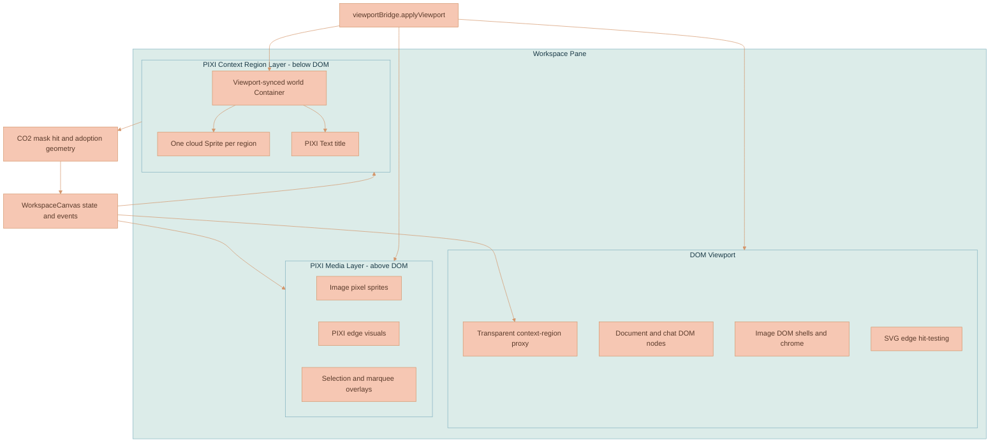

# Context Region Clouds

Context region clouds are the PIXI-rendered visual surface for workspace context regions. They provide an organic cloud-shaped context field while preserving the existing workspace state model, drag model, parent-child containment, and AI chat thread activation flow.

This document is the current source of truth for how context region clouds work.

## Current Status

Context region clouds are implemented in the web UI and run as part of the hybrid workspace canvas:

- The visible cloud and title are drawn by PIXI v8 in [pixiContextRegionLayer.ts](../../services/web-ui/src/infographics/workspace/rendering/pixiContextRegionLayer.ts).
- Pure geometry, style selection, hit testing, title bounds, and adoption scoring live in [contextRegionClouds.ts](../../services/web-ui/src/infographics/workspace/rendering/contextRegionClouds.ts).
- [WorkspaceCanvas.ts](../../services/web-ui/src/infographics/workspace/WorkspaceCanvas.ts) still owns canvas state, transparent DOM proxy nodes, drag, selection, activation, parent-child containment, and pane-level pointer routing.
- [viewportBridge.ts](../../services/web-ui/src/infographics/workspace/rendering/viewportBridge.ts) applies the same viewport transform to DOM nodes, the PIXI media layer, and the PIXI context-region layer.
- Context-region settings live in [settings.ts](../../services/web-ui/src/settings.ts), with cloud-specific settings nested under `contextRegion.cloud`.

The cloud renderer itself does not require a persisted visual-style field. Context-region lifecycle does have persisted chat ownership: deleting a context region uses the workspace delete operation to remove the region and its dedicated chat history atomically.

## Product Role

The workspace canvas is where users arrange documents, images, AI chat threads, generated outputs, and contextual groupings. A context region means "these items belong together as one creative context." The cloud is meant to read as a soft context field behind content, not as a panel competing with the content.

The original visual reference was the cloud-like NATS cluster region in [services-architecture-diagram.jpeg](../assets/services-architecture-diagram.jpeg). That image was used as style direction only. The shipped renderer does not crop, trace, or ship that asset.

The important product principles are:

1. The cloud outline is the interaction truth.
2. The visual should stay behind the user's documents and images.
3. Pan, zoom, drag, resize, and selection must remain fast with hundreds of regions.
4. Motion should be event feedback, not continuous decoration.
5. Runtime state should stay simple unless users explicitly get style controls later.

## Chat Ownership

A context region is a spatial collection of canvas items plus lineage/history ownership; it is not the AI Chat panel and it is not a general standalone chat session.

- `Create Context Region` creates the region and a dedicated `AiChatThread`, then opens that history in the AI Chat panel.
- Clicking a cloud activates the region and reopens its dedicated history tab, independent of the panel's standalone context mode.
- The AI Chat launcher can open the panel with no context region and no created conversation.
- Region-owned history appears in Sessions but cannot be deleted separately while the region exists.
- Deleting the region removes its node and dedicated history in the same workspace operation.

## Architecture

The workspace remains a DOM/SVG/PIXI hybrid. Context regions are special because their visible pixels are in a PIXI canvas below the DOM viewport, while their state and interaction proxy remain in the DOM.



The layer order is deliberate:

| Layer | Why it exists |
|---|---|
| PIXI context-region layer below DOM | Draws seafoam cloud backdrops and titles without covering document/editor DOM content. |
| DOM viewport | Keeps ProseMirror, chat, drag overlays, selection paths, transparent region proxies, image chrome, and connector handle hit targets. |
| PIXI media layer above DOM | Draws image pixels, edge visuals, image selection outlines, and other high-volume visual surfaces. |

Do not move region visuals into the media layer. The media layer sits above DOM content, so a semi-transparent cloud there can wash over documents and image chrome.

## Runtime Data Model

Persisted canvas nodes remain unchanged. Existing context-region-compatible nodes provide:

| Field | Source | Purpose |
|---|---|---|
| `nodeId` | `CanvasNode` | Stable identity for selection, drag, texture style hashing, and layer entries. |
| `referenceId` | `ContextRegionCanvasNode` | Links the region to its dedicated persisted chat history. |
| `position` | `CanvasNode` | Persisted position. Child positions remain parent-relative. |
| `dimensions` | `CanvasNode` | Logical region width and height. |
| `parentId` on child nodes | Existing canvas containment | Tracks documents/images adopted into the region. |

The renderer builds runtime-only `ContextRegionCloudDatum` values:

```typescript
type ContextRegionCloudDatum = {
    nodeId: string
    referenceId: string
    x: number
    y: number
    width: number
    height: number
    title: string
    selected: boolean
    active: boolean
}
```

`WorkspaceCanvas` resolves parent-chain world positions and live drag/resize overrides before creating these datums. The PIXI layer therefore receives world-space geometry even when persisted child nodes remain parent-relative. `active` marks the context region whose linked AI chat panel is currently active; it is runtime UI state, not persisted visual style.

Visual style is not persisted. `getContextRegionCloudStyle(nodeId, width, height)` chooses a deterministic seafoam style from the node id and aspect class (`wide`, `square`, or `tall`). This keeps reloads stable without turning current visual tuning into a data contract.

## Shape Source

The current visible shape is a CO2 SVG cloud silhouette:

- One main cloud path.
- One top-left thought circle.
- A 512 by 512 viewbox.
- The same shape concept is used for rendered pixels, body hit testing, title placement, and drop-adoption scoring.

The constants currently live in both [pixiContextRegionLayer.ts](../../services/web-ui/src/infographics/workspace/rendering/pixiContextRegionLayer.ts) and [contextRegionClouds.ts](../../services/web-ui/src/infographics/workspace/rendering/contextRegionClouds.ts). If the silhouette changes, update both modules in the same change or first extract a shared shape module. A mismatch here causes the most confusing class of bugs: pixels show one shape while clicks/drops behave like another.

The implementation intentionally uses a custom SVG path parser instead of `Path2D(svgString)`. During visual iteration, constructing `Path2D` from SVG path strings was unreliable enough to cause blank rendering in the target browser/runtime path. The custom parser handles the command subset needed by the CO2 path (`m`, `c`, `s`, and `z`) and is duplicated in rendering and sampling form:

- `drawSvgPath(...)` paints the path into Canvas2D for texture generation.
- `sampleSvgPath(...)` converts cubic segments into points for polygon hit testing.

The texture stays square and preserves the CO2 cloud proportions. For non-square logical regions, the logical rectangle is centered inside a square visual backdrop whose side length is `max(width, height) + bleed * 2`. That avoids crushing the cloud silhouette into a cheap-looking stretched blob.

## Visual Texture

Each cloud style bakes a shared Canvas2D texture, then PIXI renders that texture as a `Sprite`. The texture size, mask threshold, resize edge hit radius, gradient colors, gradient positions, active thought-circle gradient, opacity, and animation values, cloud style variants, palette values, border, title, frame, and pulse values are configured in the `contextRegion.cloud` subsection of [settings.ts](../../services/web-ui/src/settings.ts).

The current palette is seafoam, taken from `random-useful-things/image-color-analysis-tool/region-gradient-preview.html` and tuned to keep the patchy grain visible:

| Role | Color |
|---|---|
| Gradient color 1 | `#DDECE7` |
| Gradient color 2 | `#C7DAD4` |
| Gradient color 3 | `#EEF8F5` |
| Gradient color 4 | `#D6E7E1` |
| Base fill | `#E5F2EE` |
| Edge/accent | `#A1C3BA` / `#8FB5AB` |
| Title text | `#1F2937` |
| Region-contained image frame | `#FCFCFA` |

The texture pipeline is intentionally bake-heavy and runtime-light:

1. Create the CO2 cloud mask in an offscreen canvas.
2. Paint per-pixel seafoam gradient color into the mask using weighted gradient stops with a subtle swirl.
3. Add fractal/value-noise modulation for paper grain, pigment variation, and fiber-like texture.
4. Add translucent paint pools biased by aspect and seed.
5. Add soft subtractive cutbacks so the cloud does not read as a solid blob.
6. Add fine pigment speckles.
7. Optionally add the exact vector border ring when `settings.contextRegion.cloud.borderEnabled` is `true`.
8. Apply the CO2 mask once at the end with `destination-in`.
9. Convert the canvas to a PIXI `Texture` and cache it by texture version, border state, and style key.

The reference-like feel comes from the perimeter, uneven alpha, edge pooling, grain, translucent wash, and color variation. The implementation reaches that through the CO2 silhouette plus patchy seafoam texture.

The active context region keeps the shared seafoam cloud texture and adds small PIXI sprites over only the detached thought circle. Surface and dot gradient colors live in `settings.contextRegion.cloud.palettes`, and the cloud renderer settings reference those palette entries. Its texture bake uses `FreeformGradientRenderer` in `services/web-ui/src/utils/animations/gradients/freeformGradient.ts`; its transition uses `Easing` in `services/web-ui/src/utils/animations/easing.ts`. When active context changes, the sprites crossfade between two trigger-driven gradient phases with a brief opacity bloom configured under `settings.contextRegion.cloud`; the result marks active context without reintroducing a full selected cloud outline. See [GRADIENTS.md](GRADIENTS.md) for shared gradient ownership and extension rules.

## Theme Configuration

Do not duplicate the context-region setting inventory or values in this document. The source of truth is [settings.ts](../../services/web-ui/src/settings.ts), specifically `settings.contextRegion` and its nested `settings.contextRegion.cloud` subsection.

Any new configurable context-region value must go through `settings.ts` instead of becoming a local magic-number constant. Keep context-region settings under `contextRegion`; use nested subsections such as `contextRegion.cloud` for child domains; put a blank line before and after each logical group; and add a short comment beside every config key explaining what it means and how changing it affects the app. Use getters only when a setting needs to self-reference sibling settings through `this`, such as cloud styles or surface and active thought-circle gradients referencing cloud palettes; keep ordinary static values as plain properties.

CO2 path constants are still code-level geometry, not theme settings. If the cloud silhouette changes, update rendering and hit/adoption geometry together.

## Border Configuration

The cloud border is optional and controlled centrally:

```typescript
settings.contextRegion.cloud.borderEnabled: boolean
```

The default is `false`.

When enabled, the border is baked into the shared texture as an exact vector ring. It is not a separate selection outline sprite and it is not drawn by runtime chrome. Keeping it baked into the texture prevents duplicate or drifting cloud outlines during selection and pulse transforms.

The texture cache key includes border state. If the default changes, the cache naturally produces separate `border` and `no-border` textures.

## Hit Testing, Anchoring, And Adoption

Context region hit testing is shape-based:

1. `WorkspaceCanvas` converts the pointer to world coordinates.
2. It first checks image and document node rectangles through `getNodeHitBeforeContextRegion(...)` so region hits do not steal clicks from content inside the cloud.
3. If no foreground node wins, it asks `contextRegionLayer.hitTest(worldPoint)`.
4. The layer checks datums from topmost to bottommost.
5. `hitTestContextRegionCloud(...)` checks the title rect first, then the CO2 body shape and edge band.
6. A hit returns `title`, `body`, `resize`, or `none`.

Context region DOM proxies do not create DOM resize handles. Hovering the sampled cloud edge returns a `resize` hit with the matching sector handle and cursor.

Connector anchoring uses the same geometry source. `getContextRegionCloudAnchorPoint(...)` starts from the logical side/t value used by `WorkspaceConnectionManager`, then ray-scans inward against the CO2 cloud mask to find the visible cloud outline. The connection manager applies that point as an edge-specific endpoint offset in PIXI edge data. When the region is resized, the next edge render rebuilds the cloud datum from the live dimensions, so lines keep the same visual gap from the irregular outline instead of sticking to the transparent DOM rectangle.

Drop adoption uses the same geometry model. `scoreRectAgainstContextRegionCloud(...)` broad-phase checks the square cloud bounds, then samples the dragged node's center, corners, edge midpoints, and drop point against the CO2 cloud shape. Transparent corners do not count as region body or drop target.

This shared geometry rule is non-negotiable: visible pixels, connector anchors, resize hits, body clicks, title placement, and adoption scoring must remain aligned. Rectangular math is allowed only as a cheap broad phase.

## Interaction Invariants

Context regions are visually different from normal rectangular nodes, but they still pass through the shared canvas interaction system. Keep these invariants intact when changing selection, marquee, drag, resize, edge, or PIXI rendering behavior.

### Plain Clicks And Selection Overlays

A plain click on a single context region must not draw a selection border, cloud outline, group rectangle, or filled overlay. Plain single-node clicks on editable document and AI chat thread nodes also must not show the group overlay, because that overlay can block ProseMirror editing.

The selection rectangle is reserved for two states:

1. More than one selected node.
2. A selection created by marquee, even if the marquee contains only one node.

This rule belongs in `shouldShowSelectionGroupOverlay()` in [WorkspaceCanvas.ts](../../services/web-ui/src/infographics/workspace/WorkspaceCanvas.ts): empty selection returns `false`, multi-selection returns `true`, and single selection returns `selectionIsFromMarquee`. Do not special-case context regions in that function.

Context regions should use bounded pulse feedback for activation. Do not reintroduce selected cloud chrome in [pixiContextRegionLayer.ts](../../services/web-ui/src/infographics/workspace/rendering/pixiContextRegionLayer.ts). The PIXI context-region layer should draw the cloud surface and title, not a second selected silhouette.

### Marquee Starts Only From Empty Canvas Movement

Marquee selection must start only when all of these are true:

1. The pointer down happened on empty canvas after image/document/thread/context-region hit precedence failed.
2. The user moved farther than the drag threshold.
3. Any previous marquee and stale selection state was cleared before assigning the new `marqueeSelection` object.

Do not create `marqueeSelection` during `mousedown`. Creating it before pointer movement makes plain empty-canvas clicks clear selection and makes context-region cloud clicks look like accidental marquee starts.

When checking context-region hits before marquee, use both layers of hit detection:

- `contextRegionLayer.hitTest(worldPoint)` for title/body shape hits.
- The region's visual cloud bounds from `getSelectionOverlayBoundsForNode(...)` as a fallback before treating the point as empty canvas.

The bounds fallback exists because the visible cloud can extend beyond the transparent DOM proxy rectangle and beyond the strict interior/title hit zones. It is only a guard against empty-canvas fallthrough; foreground image/document/thread hits still win first.

### Drag And Resize Scope

Dragging or resizing a context region must not automatically include connected, generated, or leaf nodes. A region move is visually about the region and its real contained descendants, not every related image or generated output in the graph.

The drag plan should follow these rules:

| Situation | Drag participants |
|---|---|
| Single context-region drag | The region plus real parented descendants needed for live visual movement. |
| Multi-selected context-region drag | Every selected context region plus each selected region's real parented descendants. |
| Generated output image nodes | Excluded from context-region drag sets. |
| Connected nodes through edges | Excluded unless they are also real selected or parented drag participants. |

Keep this logic centralized in [workspaceDragPlan.ts](../../services/web-ui/src/infographics/workspace/workspaceDragPlan.ts). Do not rebuild ad hoc participant sets in `WorkspaceCanvas.ts`.

### Edge Visibility And PIXI Graphics Paths

Connector lines are independent of node selection. Selecting a context region must not filter, hide, or resync edges differently. If a selection visual creates artifacts around connectors, fix the selection visual or PIXI renderer; do not hide edges based on selected nodes.

PIXI `Graphics` path state must be isolated. In [pixiEdgeRenderer.ts](../../services/web-ui/src/infographics/workspace/rendering/pixiEdgeRenderer.ts), edge painting starts a new path before drawing the SVG path, and arrowhead drawing starts and closes its own path before fill. Without that path isolation, a previous edge segment can weld to a later arrowhead and produce long stray lines.

The same cleanup principle applies to context-region chrome: if `Graphics` children are rebuilt, remove and destroy old children first. Stale `Graphics` objects are a common cause of ghost outlines after selection, drag, or rerender.

### Regression Coverage

Changes in this area should update or add focused regression coverage in the same commit:

| Test file | What it protects |
|---|---|
| [workspace-canvas.test.ts](../../services/web-ui/src/infographics/workspace/workspace-canvas.test.ts) | Selection overlay source rules, no plain-click border, marquee defer-until-move behavior, context-region bounds hit fallback, connector visibility, and pane hit precedence. |
| [workspaceDragPlan.test.ts](../../services/web-ui/src/infographics/workspace/workspaceDragPlan.test.ts) | Context-region drag participant sets, multi-region group drag, and generated image exclusions. |
| [contextRegionClouds.test.ts](../../services/web-ui/src/infographics/workspace/rendering/contextRegionClouds.test.ts) | CO2 silhouette hit testing, connector anchor sampling, selection-rect intersection, and adoption scoring. |
| [WorkspaceConnectionManager.test.ts](../../services/web-ui/src/infographics/workspace/WorkspaceConnectionManager.test.ts) | Context-region connector endpoints use cloud-outline anchors and recalculate after region resize. |
| [pixiContextRegionLayer.test.ts](../../services/web-ui/src/infographics/workspace/rendering/pixiContextRegionLayer.test.ts) | No selected-cloud chrome path and proper `Graphics` cleanup. |
| [pixiEdgeRenderer.test.ts](../../services/web-ui/src/infographics/workspace/rendering/pixiEdgeRenderer.test.ts) | Edge and arrowhead `Graphics` path isolation. |

If a future change intentionally changes one of these invariants, update this document and the tests together so the new behavior is explicit.

## Workspace Integration

`WorkspaceCanvas` remains the orchestration owner:

- Builds region datums from current canvas nodes and AI chat thread titles.
- Keeps transparent context-region DOM nodes registered with `data-node-id` so existing drag, selection, connection, and parent-child paths still work.
- Skips resize-handle creation for context-region proxies.
- Routes pane-background clicks through image/document precedence, then cloud hit testing, then visual-bounds fallback before empty-canvas marquee handling.
- Calls the normal drag machinery when a cloud body/title is clicked, so dragging a region still uses the existing canvas drag lifecycle.
- Includes context-region descendants in the live dragged set so real parented children move visually with the parent region during drag, not only after commit.
- Excludes generated image leaves from context-region drag sets unless a future interaction model explicitly makes those nodes real region children.
- Shows the group selection rectangle only for marquee-sourced selections or multi-selection, never for a plain single context-region click.
- Uses CO2 cloud scoring when releasing a dragged node to decide parent adoption.
- Keeps generated output image nodes from being adopted into regions.

The transparent DOM proxy is compatibility glue, not the visual surface. Do not reintroduce a visible DOM region card or shifting-gradient rectangle unless the product direction changes again.

## Viewport And Rendering Lifecycle

`viewportBridge.applyViewport(...)` is the single sync point for pan/zoom. It applies:

- CSS `translate(...) scale(...)` to the DOM viewport.
- `world.position` and `world.scale` to the PIXI media layer.
- `world.position` and `world.scale` to the PIXI context-region layer.

The live viewport in `WorkspaceCanvas.ts` owns rendering during interaction. Svelte/store viewport persistence is an acknowledgement path. Do not let a delayed store render that changes only `viewport` replay an older pan transform over the current DOM and PIXI worlds. The stale-render guard in `workspaceViewportStatePlan.ts` must preserve the live viewport when `viewportChanged` is true but visual node/edge state did not change and no full rerender is needed.

This matters for clouds because context-region visuals are viewport-synced PIXI sprites below the DOM layer. A stale viewport replay moves the cloud layer, media layer, and DOM viewport together, so the symptom looks like a cloud or generated image position jump even though the persisted node coordinates are unchanged.

The context-region PIXI application is initialized with:

- `preference: 'webgpu'`.
- Transparent background.
- `autoStart: false`.
- `sharedTicker: false`.
- Device-pixel-ratio capped resolution.
- Manual render scheduling.

The PIXI ticker is stopped. Renders are coalesced through `requestAnimationFrame`, and idle clouds do not consume GPU/CPU every frame. The only animation path is the bounded pulse (`PULSE_DURATION_MS = 700`) triggered per region; it briefly changes alpha and lifts the backdrop, then returns to idle and stops scheduling pulse frames.

Offscreen clouds are culled with a generous world-rect margin. Culling toggles `container.renderable`, not data ownership.

## Performance Model

The performance target is hundreds of clouds on an infinite canvas with fast pan/zoom/scale. The implementation follows the Pixi v8 research from the original docs:

| Research finding | Current design choice |
|---|---|
| Sprites are the cheapest common PIXI primitive for repeated textured visuals. | Each region gets one main cloud `Sprite` plus small title `Text`. |
| Texture generation, filters, masks, and render textures are expensive if repeated per region. | Textures are baked once per style and border state, then shared. |
| `cacheAsTexture()` and `generateTexture()` are useful for static content but risky when recached frequently or used for huge sparse textures. | Runtime does not create per-region `RenderTexture`s or recache on drag/resize. |
| Live filters need careful `filterArea` tuning and become costly at scale. | No live per-region blur, displacement, noise, or mask filters are used. |
| Manual render loops are valid when content is mostly static. | Auto ticker is disabled; renders happen only on sync, viewport, culling, or bounded pulse. |
| Culling should be explicit for large scenes. | Offscreen cloud containers are marked non-renderable. |

The texture cache key includes `CONTEXT_REGION_TEXTURE_VERSION`, border state, and style key. Increment the texture version when changing the baked texture algorithm in a way that could otherwise reuse stale cached results during a session.

## Research Notes

These implementation notes capture the constraints behind the current renderer.

### Visual anatomy

The architecture-diagram cloud reference worked because it had:

- Multi-lobed perimeter rather than a single ellipse.
- Broken alpha edge.
- Darker pigment near portions of the perimeter.
- Soft interior wash variation.
- Paper-like granulation.
- Enough transparency that content feels embedded instead of covered.

Smooth ellipse-based clouds read as synthetic and radial. The CO2 silhouette provides the macro shape; the seafoam texture provides the internal wash and grain.

### Pixi documentation findings

The fetched Pixi v8 docs supported these decisions:

- `Application` initialization is async and should be configured explicitly.
- Manual rendering is appropriate when no continuous animation is needed.
- `Sprite` plus shared `Texture` is the right runtime primitive for many repeated visuals.
- `Graphics` is fine for simple vector drawing but should not be cleared and rebuilt every frame for hundreds of decorative shapes.
- `cacheAsTexture()` and `renderer.generateTexture(...)` are useful tools, but recaching dynamic or very large content can create memory and frame-time problems.
- Filters such as blur, noise, and displacement can create interesting watercolor effects, but live per-region filter stacks are the wrong baseline for hundreds of clouds.
- Culling, explicit bounds, and non-interactive visual layers keep large scenes tractable.

### Alternative outcomes

| Alternative | Decision |
|---|---|
| Keep DOM/CSS regions and add masks | Rejected for current feature. It keeps DOM paint/layout cost and does not naturally solve shared texture reuse or shape-based adoption. |
| Draw every cloud from PIXI `Graphics` at runtime | Rejected as baseline. It can make scallops, but not the textured watercolor/seafoam wash without more cached layers. |
| Per-region `RenderTexture` generation | Deferred. Good for selected hero regions or future high-fidelity paths, but too much memory/churn for hundreds of arbitrary regions. |
| Custom shader/SDF watercolor | Deferred. High ceiling, higher risk, harder tuning, and unnecessary for the current accepted direction. |
| Authored bitmap atlas | Still viable future work if art direction requires hand-authored variation. Not used now. |
| SVG/CSS filters | Rejected as baseline. It does not fit the existing PIXI texture/culling pipeline and still needs custom hit testing. |
| Canvas2D-only background renderer | Rejected because PIXI already owns adjacent high-volume rendering, texture lifecycle, and viewport sync patterns. |

## Gotchas And Don'ts

Do not reintroduce rectangular body hit testing. Rectangles are broad-phase only.

Do not use a handmade `hitPolygon` style manifest unless it is generated from, or strictly aligned with, the visible silhouette.

Do not add context-region resize handles through the DOM proxy or PIXI chrome unless the interaction is redesigned. The current cloud hit API has no resize-handle branch.

Do not use `Path2D(svgString)` for the CO2 path without testing the target browser/runtime path. The custom parser exists because SVG-string `Path2D` was unreliable during implementation.

Do not apply masks component-by-component. Apply the CO2 mask once at the end of texture generation so grain, pools, cutbacks, speckles, and border remain coherent.

Do not create a separate selected outline cloud sprite. Selection should stay subtle and should not require a second silhouette copy.

Do not make `shouldShowSelectionGroupOverlay()` depend on context-region node type. Plain single context-region clicks must not draw a border; only marquee selection and multi-selection show the rectangle.

Do not assign `marqueeSelection` on `mousedown`. Defer marquee state until pointer movement crosses the threshold from an empty-canvas start.

Do not let context-region visual bounds fall through to empty-canvas marquee. The visible cloud can extend beyond the transparent DOM proxy and strict body/title hit shape.

Do not include generated output images or merely connected nodes in context-region drag/resize participant sets.

Do not hide or filter connector edges based on node selection. Connector visibility is independent of selection state.

Do not draw multiple PIXI `Graphics` paths without path isolation or cleanup. Begin a fresh path before edge drawing, begin and close arrowhead paths, and destroy stale context-region chrome children before replacing them.

Do not animate every cloud continuously. Use bounded event pulses and then stop scheduling frames.

Do not generate or upload per-region textures while dragging, resizing, panning, or zooming. Runtime gestures should update transforms and culling only.

Do not put context-region visuals in the media PIXI layer above DOM content.

Do not make the cloud opaque enough to compete with documents, images, or chat text. The region is context atmosphere.

Do not copy, crop, trace, or ship [services-architecture-diagram.jpeg](../assets/services-architecture-diagram.jpeg) as an asset. It is reference material only.

Do not persist visual style keys yet. Style selection is deterministic runtime behavior. Persist only if a future user-facing style picker is designed.

Do not wash out the seafoam gradient with too much alpha, bloom, or white overlay. The preview gradient colors should remain visibly present beneath the patchy grain.

Do not edit `WorkspaceCanvas` region behavior without checking image/document hit precedence. Region body hits must not steal clicks from content inside the cloud.

Do not update only one copy of the CO2 path constants. Rendering and hit/adoption geometry must move together.

Do not treat persisted `canvasState.viewport` as authoritative during an active interaction. The live transform in `WorkspaceCanvas.ts` must win over delayed viewport-only Svelte/store renders.

## Troubleshooting

| Symptom | Likely cause | Check |
|---|---|---|
| Cloud pixels and clicks do not line up | Renderer shape and geometry shape diverged | Compare CO2 constants in `pixiContextRegionLayer.ts` and `contextRegionClouds.ts`. |
| Cloud becomes a square/rectangle hit target | Rectangular broad phase used as final hit | Inspect `hitTestContextRegionCloud(...)` and adoption scoring. |
| Image clicks inside a region start dragging the region | Foreground hit precedence broke | Check `getNodeHitBeforeContextRegion(...)` in `WorkspaceCanvas.ts`. |
| Clicking the visible cloud starts marquee | Visual-bounds fallback was removed or runs after empty-canvas handling | Check `getContextRegionBoundsHit(...)` and pane `mousedown` ordering in `WorkspaceCanvas.ts`. |
| Plain click on a context region draws a rectangle or border | `shouldShowSelectionGroupOverlay()` special-cased context regions | The function should return `false` for empty selection, `true` for multi-selection, and `selectionIsFromMarquee` for single selection. |
| Empty-canvas click clears selection even without movement | Marquee state is created on `mousedown` | Create `marqueeSelection` only after pointer movement exceeds the threshold. |
| Children lag behind while dragging a region | Descendants were not included in live drag set | Check `includeContextRegionDescendants(...)` and live transforms. |
| Multi-selected context regions do not move together | Drag plan ignored the selected set for context-region drags | Check `computeWorkspaceDragPlan(...)` in `workspaceDragPlan.ts`. |
| Generated images move with a context region unexpectedly | Drag participant set includes related leaves instead of real region children | Check generated-output exclusions in `workspaceDragPlan.ts`. |
| Connector lines disappear when selecting regions | Edge rendering is filtered by selection | Keep `connectionManager.syncEdges(...)` and PIXI edge sync independent of selected node IDs. |
| Long stray lines appear through arrowheads | PIXI `Graphics` path state leaked between edge path and arrowhead drawing | Check `beginPath()` / `closePath()` isolation in `pixiEdgeRenderer.ts`. |
| A ghost cloud appears on selection | Separate selection silhouette was reintroduced | Keep selection chrome separate from a duplicate cloud sprite. |
| Texture looks pale or flat | Gradient/overlay alpha washed out color and grain | Check seafoam gradient mix, bloom overlays, and final alpha. |
| Border does not match the cloud | Border drawn as generic stroke or separate sprite | Use the baked exact vector ring path controlled by `contextRegion.cloud.borderEnabled`. |
| Pan/zoom stutters with many regions | Runtime work moved into gestures | Look for per-region texture generation, live filters, or continuous ticker usage. |
| Clouds or generated images jump after panning, with no node-position commit | Stale viewport-only store render replayed an older transform | Check whether the render changed only `viewport` while visual state stayed equivalent, then verify the stale viewport guard in `workspaceViewportStatePlan.ts` still preserves the live transform. |

## Future Work

These ideas are intentionally not part of the current implementation, but the research supports them if the product needs more fidelity later:

- Extract the CO2 path and sampled geometry into one shared module to remove duplicated constants.
- Add authored original bitmap atlas variants for more visual variety, still rendered as shared sprites.
- Add resolution tiers or low-memory texture variants if GPU memory pressure appears on lower-end devices.
- Consider a shader/SDF approach only after the shared-texture path reaches its visual ceiling.
- Add a user-facing region style/palette picker only with an explicit persisted data model and migration plan.
- Add a stress harness or Playwright visual scenario with hundreds of regions once this visual design stabilizes further.

## Related Documentation

- [CANVAS-ENGINE.md](CANVAS-ENGINE.md) documents the full DOM/SVG/PIXI canvas rendering architecture.
- [WORKSPACE-FEATURE.md](WORKSPACE-FEATURE.md) documents the workspace feature, data flow, and user-facing canvas concepts.
- [GRADIENTS.md](GRADIENTS.md) documents the shared gradient/easing ecosystem used by context-region textures, active thought circles, AI chat backgrounds, and SVG gradient borders.

## Research Sources

Internal sources:

- [PRODUCT-OVERVIEW.md](../PRODUCT-OVERVIEW.md)
- [CANVAS-ENGINE.md](CANVAS-ENGINE.md)
- [WORKSPACE-FEATURE.md](WORKSPACE-FEATURE.md)
- [services-architecture-diagram.jpeg](../assets/services-architecture-diagram.jpeg)
- [pixiContextRegionLayer.ts](../../services/web-ui/src/infographics/workspace/rendering/pixiContextRegionLayer.ts)
- [contextRegionClouds.ts](../../services/web-ui/src/infographics/workspace/rendering/contextRegionClouds.ts)
- [WorkspaceCanvas.ts](../../services/web-ui/src/infographics/workspace/WorkspaceCanvas.ts)
- [viewportBridge.ts](../../services/web-ui/src/infographics/workspace/rendering/viewportBridge.ts)
- [workspace-canvas.scss](../../services/web-ui/src/infographics/workspace/workspace-canvas.scss)
- [settings.ts](../../services/web-ui/src/settings.ts)

PixiJS v8 sources fetched during research:

- <https://pixijs.com/8.x/guides/components/application>
- <https://pixijs.com/8.x/guides/components/application/culler-plugin>
- <https://pixijs.com/8.x/guides/concepts/render-loop>
- <https://pixijs.com/8.x/guides/concepts/render-groups>
- <https://pixijs.com/8.x/guides/concepts/render-layers>
- <https://pixijs.com/8.x/guides/components/scene-objects/container>
- <https://pixijs.com/8.x/guides/components/scene-objects/container/cache-as-texture>
- <https://pixijs.com/8.x/guides/components/scene-objects/graphics>
- <https://pixijs.com/8.x/guides/components/scene-objects/sprite>
- <https://pixijs.com/8.x/guides/components/textures>
- <https://pixijs.download/release/docs/app.Application.html>
- <https://pixijs.download/release/docs/scene.Graphics.html>
- <https://pixijs.download/release/docs/scene.GraphicsContext.html>
- <https://pixijs.download/release/docs/scene.Sprite.html>
- <https://pixijs.download/release/docs/scene.RenderLayer.html>
- <https://pixijs.download/release/docs/rendering.RenderTexture.html>
- <https://pixijs.download/release/docs/filters.BlurFilter.html>

External background:

- Curtis et al., "Computer-generated watercolor," SIGGRAPH. The current implementation does not simulate watercolor physics, but the paper's language around pigment glazing, edge darkening, granulation, paper texture, and diffusion informed the visual diagnosis.
