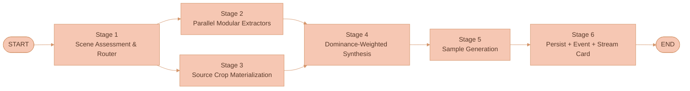
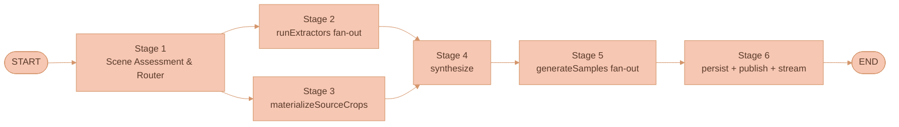

# Feature Extraction & Library

Lixpi treats **features** as a first-class primitive: reusable, scoped, named library entries that capture the essence of any visual abstraction (painting style, color palette, mood, stroke pattern, lighting setup, character design, anything the user names) extracted from one or more reference inputs (images, documents, threads, or combinations).

Extraction runs through a six-stage modular pipeline implemented under [`services/api/src/llm/extraction/`](../../services/api/src/llm/extraction/) — scene assessment & router → parallel per-axis extractors (palette, lighting, character design, line quality, medium signature, composition, mood, surface texture, background treatment, edge treatment) → deterministic source-pixel crops → dominance-weighted synthesis → sample generation → persistence. The router stage produces an axis-by-axis dominance score so the synthesis foregrounds the work's actually distinctive traits (a cel-shaded chibi-cat's huge expressive eyes and warm window light, never generic "watercolor" tropes the trained prior would default to).

Features are applied later via `/use loose-watercolor` in any prompt; the server resolves the reference at send time and injects the feature's instructions, samples, and **deterministically-extracted content-free source crops** as system context. The downstream model sees pixel evidence of the medium — but never the full source frame, so subject layout cannot leak. The architecture is the FIBO-schema axis decomposition + FaceScanPaliGemma parallel per-axis-extractor pattern + Art-Historians dominance-weighting, lifted to VLM orchestration against closed-API image models. See ["Research foundations"](#research-foundations) for the prior-art mapping.

The image bubble's "Ask AI" handler (in [`WorkspaceCanvas.ts`](../../services/web-ui/src/infographics/workspace/WorkspaceCanvas.ts) `initCanvasBubbleMenu`) is wired to feature extraction rather than the older `contextRegion` thread-node flow. Extracted Features are now displayed in the `Features` category of the canvas-owned Media Library panel; their persistence, subjects, extraction stages, and `/use` resolution remain unchanged. `/use` and `/extract` are first-class slash commands, the AI chat panel is tabbed (so extraction never displaces a user's current thread), and the chat graph carries a `resolveFeatures` pre-stage that resolves `/use` chips at send time.

## Why this exists

Lixpi is a node-based visual canvas for AI image and video generation pipelines. Its defining win is **artifact piping for character consistency** — the same image node piped into multiple threads via directional edges guarantees identical character/object reproduction downstream (see [`PRODUCT-OVERVIEW.md`](../PRODUCT-OVERVIEW.md) §3).

Feature extraction addresses a parallel problem: **stylistic and aesthetic consistency without subject leakage**. When an artist, art director, or brand designer wants to apply a specific painting style, color palette, mood, lighting setup, or stroke pattern across many generations, the alternatives all fail:

1. **Re-type the style description from scratch every time.** Lossy. Inconsistent. Doesn't survive across workspaces. Doesn't survive across collaborators.
2. **Pipe the original reference image as edge context.** Carries unwanted subject content into outputs. A portrait of a watercolor cat ends up appearing — at least in spirit — in every generation that was supposed to merely *borrow its watercolor look*. The artist's reference content leaks into work that has nothing to do with cats.
3. **Maintain an external prompt cheat-sheet (Notion, Google Doc, etc.).** Breaks the spatial workflow paradigm. Not searchable from the canvas. Not shareable as first-class data.

None of these preserve a pure, reusable, shareable abstraction of *just the style* with no content leakage. Features close that gap.

## Design principles

Four principles drive every design decision. They are the tiebreakers when trade-offs come up:

1. **The artist's reference subject must never leak into downstream generations, but the artist's medium must be preserved with fidelity.** If you extract a watercolor style from a picture of your cat, generations that use that feature must not contain cats unless the user explicitly asks — *and* they must carry the cat's paper tooth, dry-brush direction, and deckle-edge frame, not a generic smooth watercolor. Both halves are non-negotiable: subject leakage is the headline anti-feature; texture loss is what makes the feature unusable in practice. The strategy that solves both is content-free pixel cropping (see ["Anti-leakage strategy"](#anti-leakage-strategy)) — withhold subject layout, forward medium evidence.
2. **Extraction must capture the work's actually distinctive traits, not its trained-prior category.** A digital cel-shaded illustration is a digital cel-shaded illustration, not "soft storybook watercolor." A chibi-style character's huge expressive eyes are the signature, not a background paper tooth that doesn't exist. The architecture forces the model to commit to a medium classification before any axis extractor runs, and uses a router stage to score each attribute axis 0–1 on dominance so the dominant signature is foregrounded in the synthesis. If the user disagrees with the router, they re-run with an explicit intent string ("extract just the character design").
3. **Features are reusable across the artist's entire workflow.** A user who builds a library of 50 personal styles, palettes, and moods has effectively built a small in-house DSL for their visual brand. Switching workspaces, sharing with their org, or publishing to the community is one click.
4. **Application is frictionless.** Typing `/use my-watercolor` in any prompt feels as natural as @-mentioning a coworker.

## What's deliberately out of scope

- **A `feature` canvas node type.** Features are library-only; drag-to-canvas placement is parked for a later iteration.
- **Inline editing of feature instructions** in the library card. Edits go through "Open in extraction tab → Re-extract."
- **Versioning / revision history** of features. The `version` field is reserved but only `1` is written today.
- **A search index for public features.** A simple GSI scan covers the current implementation; OpenSearch/Algolia-class search is deferred.
- **Admin moderation UI.** Reports flag features into a `'reported'` status that excludes them from public lists; restoration is a manual DB operation today.
- **Multi-step autonomous-planning agent behavior** (DeepAgents-style `write_todos` planning, dynamic subagent spawning, virtual filesystem for cross-step reasoning). The pipeline is multi-stage and runs many parallel VLM calls, but the stage graph is fixed and deterministic. See ["Why LangGraph parallel branches and not DeepAgents"](#why-langgraph-parallel-branches-and-not-deepagents).
- **Procedural / synthetic texture generation.** Earlier iterations explored an SVG-path renderer that synthesized "texture specimens" from regex-matched keyword parameters; the marks produced had no relationship to the source's actual textures and the path was removed. There is no synthesis-from-text path anywhere in the pipeline — all visual evidence is pixel-grounded.

## What is an extracted feature?

A **feature** is a reusable, scoped library entry that captures the essence of one specific visual abstraction. Conceptually it's a "saved style preset" generalized far beyond style.

Every feature contains:

| Field | Description |
|---|---|
| `category` | Synthesis-determined from the dominant attribute axis (or user intent override): `illustration-style`, `painting-style`, `color-palette`, `mood`, `lighting-setup`, `character-design`, `composition-rule`, `surface-texture`, `prompt-pattern`, or any axis-grouping the synthesis stage names. The router stage produces a `medium` classification (digital-illustration, watercolor, oil, photograph, etc.) which feeds into `parameters.mediumSignature` — the user-facing `category` is the dominant axis, the underlying medium is structured metadata. |
| `name` | Synthesized from the dominant axis traits (e.g., `cel-shaded-chibi-cat-style` or `dusty-sage-and-coral-palette`) or from the user's explicit intent if provided. Used for `/use {name}` references. |
| `summary` | One line that names the dominant signature traits explicitly (e.g., "Cel-shaded digital chibi-cat illustration with oversized expressive eyes, soft warm window lighting, and a painterly cream background — digital, NOT traditional watercolor"). Used in the library list and in the hover info bubble. |
| `tags` | Short string tags derived from dominant axes. Tags reflect the actual extracted traits, not generic medium tropes (a digital illustration is not tagged `watercolor` unless the router and `MediumSignatureExtractor` both confirm it is). |
| `instructions` | A markdown body — the rich how-to-apply guide the LLM consumes when the feature is invoked. Written by the synthesis stage. Sections are weighted by axis dominance: ≥ 0.8 axes get dedicated top-level sections; 0.5–0.8 axes get short sections; 0.3–0.5 axes are mentioned briefly; < 0.3 axes are absent. Always opens with a "DO NOT" section enumerating training-prior tropes the synthesis explicitly rejected (e.g., "this is digital — DO NOT add paper tooth, dry-brush, deckle edges, or wash bleeds"). Anywhere from 200 to 3500 words. This is the workhorse field. |
| `parameters` | Nested per-axis structured JSON. Top-level fields include `axisDominance` (the router's 0–1 scores per axis), and one nested block per axis that was extracted (e.g., `parameters.palette`, `parameters.lighting`, `parameters.characterDesign`, `parameters.mediumSignature`, etc.). Every axis block has the same envelope: `{ dominance: number, fields: {...axis-specific schema}, rationale: string }`. The full Stage 1 `sceneAssessment` is also nested at `parameters.sceneAssessment` for downstream consumers. Filterable on any nested path. |
| `sampleImages` | A mixed list of three sample kinds, agent-decided with category-specific minimums. Each entry has a `kind` discriminator: (a) `source-crop` — a deterministic content-free crop of the original source image (paper-edge, background corner, fur-detail, deckle-edge, etc.), extracted by sharp from agent-specified bounding boxes; (b) `texture-specimen` — for `surface-texture`, a 2×2 composite of source crops built deterministically by the backend (no procedural synthesis); (c) `applied-medium-probe` — a model-rendered neutral subject (sphere on a plank, cube + cloth) that the image router generates with the source crops attached as visual style references plus strict anti-leakage instructions. `color-palette` always has a palette-board sample first. All samples stored as workspace image objects via `storeWorkspaceImage`. |
| `scope` | One of `workspace` / `user` / `organization` / `public`. Default `workspace`. |
| `status` | `'active'`, `'reported'` (auto-flipped past report threshold), `'removed'`. |
| `sourceContext` | Provenance: which `extractionRunId` produced it, which workspace it was born in. |
| `version` | Schema version, currently `1`. Reserved for future revisions. |

Why **hybrid representation** (structured envelope + markdown body + freeform `parameters` blob)? Because:

- Pure markdown loses queryability (can't filter "all warm-tone palettes" or "features with stroke type = crosshatch").
- Pure structured JSON loses expressiveness (no fixed schema can capture every conceivable artistic concept the user might invent — agent-determined categories are the whole point).
- Hybrid lets the agent fill in whatever structured signals make sense for the category, while keeping a free-form prose explanation for everything else. The LLM consumes the markdown; the library UI uses the envelope + parameters for filtering and display.

### Per-axis extraction contracts (and validators)

The feature system is flexible, but flexibility cannot mean accepting slop. Each extractor enforces a strict output schema; the synthesis stage enforces global contracts; and the persistence layer enforces medium-correctness sanity checks. Failures short-circuit the run rather than silently saving a vague feature.

The full list of axis contracts lives in [`services/api/src/llm/extraction/extractors/<axis>-extractor.ts`](../../services/api/src/llm/extraction/extractors/) (one file per axis). The headline contracts the validator enforces:

**`palette` axis.** Required fields: `palette[]` of 5–12 entries (at least 4) each with `name`, `hex`, `role`, `usage` (percent), `temperature`, `notes`; plus `harmony`, `contrast`, `usageGuidance`, `backgroundTreatment`, `shadowStrategy`, `highlightStrategy`, `avoid`. If the user's intent string explicitly asks for "palette" / "color" / "colors" and the analysis model does not return concrete hex values, the run fails validation rather than saving a vague feature.

**`character-design` axis.** Only applicable when the router's `subjects[]` is non-empty. Required fields: `archetype` (e.g., `chibi-kitten`, `realistic-portrait`, `stylized-figure`), `proportions` (head-to-body ratio, eye-to-face ratio, limb proportions), `featureEmphasis[]` (which features are oversized/exaggerated — eyes, paws, ears, etc.), `expression`, `pose`, `shadingApproach` (`cel-shaded`, `painterly`, `photoreal`, `line-art`, etc.), `silhouetteStyle`, `lineTreatment`. The validator rejects extractions where `featureEmphasis` is empty for a clearly stylized subject — a chibi kitten always emphasizes something.

**`medium-signature` axis.** Required fields: `medium` (must match the router's `medium` classification), `techniqueSignatures[]` (`cel-shading`, `glazing`, `dry-brush`, `digital-airbrush`, etc.), `softwareGuess[]` (best-effort: `Procreate`, `Photoshop`, `traditional`, etc.), `digitalArtifacts[]` (clean anti-aliased edges, perfect gradient tools, pixel-perfect symmetry), `traditionalArtifacts[]` (paper tooth, wash bleeds, dry-brush, granulation). The validator enforces: if `medium = digital-illustration` then `traditionalArtifacts` should be empty or near-empty — a non-empty `traditionalArtifacts` on a digital medium triggers a re-evaluation flag (see Risk #6). This is the primary structural fix for the v0 "watercolor on a digital cat" bug.

**`surface-texture` axis.** Only applicable when the router scores `surface-texture` dominance ≥ 0.3. Required fields: `baseSurface`, `grain`, `markPattern`, `edgeBehavior`, `density`, `scale`, `repeatability`, `applicationGuidance`, `visibleArtifacts[]`. The validator distinguishes between digital-imitating-traditional (a digital airbrush "watercolor" effect) and actually-traditional (real paper); the former has `medium-signature.medium = digital-illustration` with non-trivial `techniqueSignatures`, the latter has `medium-signature.medium = traditional-watercolor`. The earlier monolithic extractor collapsed both into "watercolor"; this split is the structural fix.

**Other axes (`lighting`, `line-quality`, `composition`, `mood`, `background-treatment`, `edge-treatment`).** Each has its own schema documented in its extractor file. Schemas are strict (the VLM is configured for structured output via Gemini's `responseSchema` or OpenAI's `response_format: json_schema` or Anthropic's tool-use enforcement).

**Source crops contract (Stage 3, all extractions).** The router's `subjects[]` and `regions[]` bounding boxes feed Stage 3. The pipeline materializes 3–8 crops per reference image: 2–4 sub-anatomical crops on each primary subject (focused on the parts the router named in the subject description), 1–2 content-free crops per identified background region, 1 composition-preserving low-res thumbnail. Each crop must be ≥ 128 px on each axis after clamping. If fewer than 3 valid crops materialize, the run fails before synthesis.

**Sample requirements (Stage 5).** All visual features require saved sample images. The synthesis stage's `recommendedSampleSubjects` drives Stage 5; if the synthesis selects a `texture-specimen` sample for a `surface-texture`-dominant feature, the backend composites it deterministically from source crops (2×2 grid via sharp — the v0 `renderTextureReferenceSheet` SVG path is removed entirely). For `palette`-dominant features, sample 0 is always a deterministic palette board. For `character-design`-dominant features, sample 0 is typically a model-rendered neutral character (a generic stylized animal head, not the source subject) generated with source crops as visual reference. If any required sample cannot be generated, validated as PNG/JPEG, stored, and read back, the run fails rather than saving a library item that says "No sample image saved."

### Concrete examples

The `Visual evidence` column shows the full sample composition: source crops (pixel-grounded medium evidence) + specimen composite (where applicable) + model-rendered applied-medium probes.

| User request | Detected category | Auto-named | Visual evidence stored on the feature |
|---|---|---|---|
| "extract painting style from these 3 watercolor pieces" | `painting-style` | `loose-watercolor` | 4 source crops (paper-edge, background, fur-detail, deckle-edge from the 3 inputs) + 2 model-rendered applied-medium probes (sphere on a wooden table; abstract landscape) |
| "save the surface texture of this storybook cat" | `surface-texture` | `soft-storybook-watercolor-tooth` | 4 source crops (paper-tooth, dry-brush fibre, deckle-edge, background corner) + 1 deterministic 2×2 texture-specimen composite of those crops + 1 model-rendered applied-medium probe (ceramic sphere on a plain plank) |
| "save this as a color palette" | `color-palette` | `dusty-sage-and-coral` | 1 palette-board sample (swatches, hex codes, roles, usage proportions). No source crops required — palette features are concrete via hex values. |
| "extract the mood" | `mood` | `melancholy-late-autumn` | 3 source crops (light-quality regions, ambient color, atmosphere-edge) + 1 model-rendered applied-medium probe (generic empty room with afternoon light) |
| "stroke pattern from this etching" | `stroke-pattern` | `crosshatch-rough` | 3 source crops (stroke-density region, edge-crosshatch, white-space) + 2 model-rendered probes (sphere; cube) |
| "the lighting setup in this portrait" | `lighting-setup` | `north-window-soft` | 3 source crops (rim-light region, falloff-gradient, shadow-edge) + 1 model-rendered probe (generic head-and-shoulders silhouette in that light) |
| "save these as a composition rule" (user provides 4 reference compositions) | `composition-rule` | `rule-of-thirds-with-leading-diagonal` | 0 samples — agent decides this is best expressed as instructions only; sample images would mislead. Source crops do not apply to composition (it's about layout relationships, not pixel evidence). |
| "extract the prompt-engineering pattern I keep using for product photos" (user supplies 2 prior chat threads, no images) | `prompt-pattern` | `clean-product-shot-recipe` | 0 samples — non-image input, instructions-only feature |

The agent picks count + subjects per category according to its analysis. The schema accommodates 0 samples for cases where samples wouldn't help (or where the input is non-visual).

### Inputs are not limited to images

The user's brief explicitly: *"a given input which often includes images, one or a few images. It's not limited to just images though."*

The extraction tool accepts whatever the existing context-extraction layer produces — see [`extractConnectedContext`](../../services/web-ui/src/services/ai-chat-thread-service.ts) and the existing multimodal context flow (PRODUCT-OVERVIEW.md §7). That includes:

- Image canvas nodes (resolved to `nats-obj://` URLs → base64 in [`attachments.ts`](../../services/api/src/llm/utils/attachments.ts))
- Document canvas nodes (ProseMirror JSON → plain text)
- Upstream AI chat thread canvas nodes (full conversation history)
- Mixed combinations of the above

A feature extracted from a thread of past conversations is just as valid as one from images. The agent decides what kind of feature is appropriate based on what it sees.

## The extraction pipeline (multi-stage, modular, dominance-weighted)

Extraction is a fixed six-stage LangGraph that runs against the user's selected analysis model. The graph is deterministic — there is no LLM-driven planner; the stages and their dependencies are wired in code under [`services/api/src/llm/extraction/orchestrator.ts`](../../services/api/src/llm/extraction/orchestrator.ts). The router stage classifies the work and scores every applicable axis on dominance; downstream extractors fan out in parallel and each owns one axis; the synthesis stage fuses the outputs into a single feature definition weighted by router scores; sample generation produces visual probes; persistence writes the feature record + emits live events.

### Research foundations

The architecture is the practical translation of three convergent 2025-2026 findings for VLM-orchestrated visual analysis against closed-API image models:

1. **Structured-schema axis decomposition.** FIBO ([arXiv:2511.06876](https://arxiv.org/html/2511.06876v1)) shows that a single Gemini-2.5 call with a strict JSON schema enforcing parallel axes (`short_description`, `objects`, `background_setting`, `lighting`, `aesthetics`, `photographic_characteristics`, `style_medium`, `artistic_style`, `text_render`, `context`) reliably forces the VLM to populate every axis independently rather than collapsing everything into one "style" label. The schema is the constraint; without it, the model defaults to its training-prior trope.
2. **Parallel per-axis extractors.** FaceScanPaliGemma ([Nature Sci Reports](https://www.nature.com/articles/s41598-026-39584-3)) proves the multi-agent pattern: "*four fine-tuned Google PaliGemma models, each specialized for a specific facial attribute classification.*" Each agent owns one axis with a focused prompt and a tight schema. The pattern transfers directly — one VLM call per axis (palette, lighting, line-quality, surface-texture, character-design, composition, mood, medium, background-treatment), each with its own focused system prompt, fused at the end.
3. **Dominance-weighted attribution.** "Does AI See like Art Historians?" ([arXiv:2603.11024](https://arxiv.org/html/2603.11024)) attacks dominance ranking via Semi-NMF + PMI on internal latents — which cannot run against closed APIs. The practical VLM equivalent is a **router VLM pass** that explicitly scores each axis 0–1 on "how strongly this reference expresses this axis." The router's scores then weight downstream emphasis: dominant axes get deeper extractor analysis and proportional weight in the synthesized feature; weak axes are skipped or mentioned lightly.

StyleGallery ([arXiv:2603.10354](https://arxiv.org/html/2603.10354v2)) is the only earlier paper that anticipates miscategorization — it allows user/SAM-provided masks as a fallback when automatic segmentation fails. The pipeline adopts the same posture: the router stage explicitly identifies the medium (digital vs traditional) and the focus hierarchy; if the user disagrees with the router, they re-run with an explicit intent override.

What none of the cited papers solve, and what the pipeline must own itself: **the case where the rendering of the subject IS the style** (a cel-shaded character with huge eyes; an iconic painting where subject IS style). Every prior paper treats subjects as content and rendering as style; for the chibi-cat case the cel-shaded eyes ARE the style. The `character-design` extractor handles this explicitly — it captures the rendering-of-the-subject as a first-class axis distinct from background style.

### What worked, what didn't

Two failed iterations preceded the current architecture. Both are documented here because their failure modes shaped specific decisions in the live system and the corresponding code paths have been deleted to prevent regression.

**v0 — single-pass monolithic extractor (failed).** A single VLM call sent the analysis model a long, contradictory system prompt asking it to do everything at once — identify category, write instructions, pick samples, list parameters — in one forward pass. The system prompt also leaked traditional-media vocabulary (`paper tooth`, `wash`, `substrate`, `dry-brush`) which biased the model. Concrete failure: a digital cel-shaded chibi-cat illustration was labeled `surface-texture` / `soft-storybook-watercolor-tooth` with tags `[watercolor, storybook, soft, paper-tooth, dry-brush, deckle-edge, painterly]`. The actual signature traits — huge expressive green eyes, soft cel-shaded fur, tabby markings, chibi proportions, painterly digital background, warm window light — were lost. Three independent failure causes were diagnosed: no first-stage scene assessment that commits to a medium classification; no per-axis decomposition that captures distinctive traits as parallel signals; no dominance weighting that foregrounds the actually-dominant signature. All three are addressed by the current six-stage pipeline. The monolithic system prompt (`FEATURE_EXTRACTION_INSTRUCTIONS` in `load-prompts.ts`) was removed.

**v0.5 — procedural SVG "texture specimen" (failed).** When category was `surface-texture`, the v0 pipeline rendered the first sample image by running a procedural SVG generator (`renderTextureReferenceSheet` in `base-provider.ts`) that drew random wavy lines, speckles, and brush-stroke noise based on regex-matched keyword parameters. The marks generated had no relationship to the source's actual textures — feeding the same procedural slop downstream made `/use`-applied generations lose all medium fidelity. The function and ~200 LOC of SVG-path helpers were deleted; the texture specimen is now a deterministic 2×2 composite of real source-pixel crops (Stage 5).

**v0 — pixel withholding (failed in a different way).** An earlier version of the anti-leakage strategy aggressively forbade forwarding any source pixels to either sample generation or downstream `/use` calls. Subject leakage was solved; texture fidelity was destroyed. The generated dog images were generic smooth watercolor with no trace of the source's paper tooth or dry-brush direction. The fix was lifting StyleBrush's content-free cropping strategy to inference time: source pixels still reach the downstream model, but as sub-frame crops chosen to carry medium evidence without subject layout (see ["Anti-leakage strategy"](#anti-leakage-strategy)).

**v0 — `extract_feature` chat tool (failed by overload).** The first design exposed extraction as a chat-LLM tool call: the user's chat agent would call `extract_feature` mid-conversation. The chat model had to wear two hats (chat assistant + visual analyst) and we paid a context-management cost for every extraction; chat-prompt biases (watercolor terminology) leaked into extraction output. The tool was removed; extraction is now a dedicated server-side pipeline triggered by `AI_INTERACTION_SUBJECTS.FEATURE_EXTRACT.START`, with its own LangGraph independent of the chat graph.

**What's working today.** The six-stage pipeline correctly classifies medium (digital-illustration vs traditional-watercolor) before any axis extractor runs, captures rendering-of-the-subject as a first-class signature via the `character-design` extractor, and emits live `StageTraceEvent` rows the user can watch in the extraction tab. Adaptive thinking (Opus 4.7, Sonnet 4.6) streams visible reasoning during the router and synthesis stages. Source crops carry pixel evidence into downstream `/use` calls without forwarding the full source frame.

**What's still rough.** Anti-leakage on highly distinctive subjects (an iconic painting where subject IS style) is imperfect — sub-anatomical crops still carry recognizable identity. The router occasionally under-scores axes that are obvious to a human (e.g., scoring `character-design = 0.3` for a clearly character-driven image), causing the wrong axis to dominate the synthesis; current mitigation is re-running with an explicit intent string. Cost is non-trivial: one extraction runs the router + 4–10 parallel extractors + synthesis + samples, roughly 10× the v0 single-pass cost. Mitigations and v2 escalations are documented in ["Known limitations and trade-offs"](#known-limitations-and-trade-offs).

### The six stages



**Stage 1 — Scene assessment & router.** A single VLM call (Claude Opus or Gemini 2.5 Pro — the user's selected analysis model). Strict structured-output schema enforces these fields:

- `references[].subjects[]` — every distinct subject in the reference image(s) with normalized bounding box, salience rank, and a one-line description (e.g. `{ label: "cat", bbox: [0.18, 0.12, 0.82, 0.95], salience: 1, description: "round chibi-style orange tabby kitten, front-facing, large green eyes" }`).
- `references[].regions[]` — non-subject regions worth capturing (background, frame, foreground floor, etc.) with bounding boxes.
- `medium` — explicit medium classification: `digital-illustration`, `digital-painting`, `cel-shaded-3d`, `traditional-watercolor`, `oil-painting`, `pencil-drawing`, `photograph`, `mixed-media`, etc. **The router must commit to a medium before any other extractor runs.** This is the primary fix for the v0 "watercolor-default" bug.
- `axisDominance` — every applicable attribute axis scored 0–1. Initial axis set: `palette`, `lighting`, `line-quality`, `surface-texture`, `character-design`, `composition`, `mood`, `medium-signature`, `background-treatment`, `color-temperature`, `edge-treatment`. The router must populate every score, not just the ones it considers dominant. Scores < 0.3 mean "skip this extractor"; scores ≥ 0.3 mean "run this extractor"; the score is also carried forward and used to weight the synthesis.
- `intentResolution` — if the user provided an intent string ("save the palette", "extract the texture"), the router resolves it to a forced category and a forced extractor subset. If no intent, the router proposes the dominant category from the scores.
- `notes` — free-form prose where the router can record observations that don't fit the structured fields.

The router system prompt is explicitly **media-neutral**: no watercolor terminology, no paper tooth, no wash opacity, no substrate. The prompt asks the model to describe what it sees with concrete vocabulary (line presence, shading approach, color blocking, edge softness, surface artifacts) without defaulting to a medium category. Medium classification happens in its own explicit field.

**Stage 2 — Parallel modular extractors.** For every axis with `dominance >= 0.3`, the pipeline runs that axis's dedicated extractor IN PARALLEL via `Promise.all()`. Each extractor is a self-contained module implementing the `FeatureExtractor` interface (see "Modular extractor architecture" below). Each extractor receives the Stage 1 scene assessment + reference images + its own focused system prompt, and produces a structured `AxisExtraction` JSON conforming to its axis-specific schema. Extractor failures are isolated — one failing axis does not block the rest.

**Stage 3 — Source crop materialization.** Runs in parallel with Stage 2 (no model dependency). Sharp deterministically extracts crops from the source images based on Stage 1's subject + region bounding boxes:

- For each primary subject: 2–4 sub-anatomical crops focused on the distinctive parts the router named in the subject description (e.g., for "kitten with large green eyes": eye crop, fur texture crop, marking crop, body silhouette crop).
- For each background region: 1–2 content-free crops.
- Composition-preserving full-image thumbnail at low res.

Each crop is stored as a workspace image with full metadata (`kind: 'source-crop'`, `cropRegion`, `label`, `purpose`, `sourceImageRef`).

**Stage 4 — Dominance-weighted synthesis.** A single VLM call (reasoning-strong analysis model). Inputs: the Stage 1 scene assessment + all Stage 2 axis extractions + their dominance scores. The synthesis prompt instructs:

- Construct a feature where the dominant axes are foregrounded and the secondary axes are mentioned proportionally.
- Pick a `category` (and `name`) that reflects the dominant axis grouping, NOT a generic medium default. If `character-design` is dominant, the category is `character-design` or `illustration-style`, not `surface-texture`. If `palette` is dominant, category is `color-palette`.
- Write `instructions` (markdown) with sections weighted by dominance — a 0.95 character-design score gets a long detailed section; a 0.4 lighting score gets a short paragraph.
- Compose the `parameters` object as a nested per-axis structure with each axis's full extraction + dominance score + a synthesis-level commentary.
- Pick `recommendedSampleSubjects` for stage 5 (typically a neutral character probe + a neutral object probe; for palette-dominant features, a palette board).
- Pick `tags` derived from dominant axes (e.g., `chibi`, `cel-shaded`, `digital-illustration`, `warm-window-light`, `oversized-eyes`, `cute`) — NOT from medium tropes the router rejected (no `watercolor` tag for a digital illustration).

**Stage 5 — Sample generation.** For each `recommendedSampleSubject`, generate the sample. For pure-pixel samples (texture specimens, palette boards), composite deterministically via sharp from source crops or color blocks. For model-rendered probes (sphere on a plank, neutral character), call `runImageRouter` with the source crops attached as visual references plus the synthesized feature brief plus the strict anti-leakage instruction. Source crops are the primary pixel evidence; model-rendered probes are auxiliary.

**Stage 6 — Persist + event + stream feature card.** Save the Feature, the ExtractionRun trace, publish `FEATURE_SUBJECTS.CREATE`, stream the feature_card block to the extraction tab.

### Modular extractor architecture

Every extractor implements the same TypeScript interface. New extractors are added by dropping a file into `services/api/src/llm/extractors/` and registering it in `services/api/src/llm/extractors/registry.ts`. The orchestration pipeline does not change when extractors are added — only the registry grows.

```typescript
interface FeatureExtractor {
  readonly axis: string                       // e.g., 'palette', 'character-design'
  readonly displayName: string                // for trace logs and the UI
  readonly description: string                // for self-documentation
  readonly outputSchema: object               // JSON schema the VLM must conform to
  readonly systemPrompt: string               // focused prompt for this axis
  readonly minDominance: number               // skip if router score is below this
  applicableTo(scene: SceneAssessment, intent?: string): boolean
  extract(args: {
    scene: SceneAssessment
    references: ReferenceImage[]
    intent?: string
    analysisModel: AnalysisModelConfig
    logger: StageLogger
  }): Promise<AxisExtraction>
}

interface AxisExtraction {
  axis: string
  dominance: number                            // copied from router score
  fields: Record<string, any>                  // axis-specific structured fields
  rationale: string                            // why these fields, in the model's words
  rawResponse?: unknown                        // for trace persistence
}
```

**Live extractor set:**

| Extractor | Focus | Schema highlights |
|---|---|---|
| `PaletteExtractor` | Color identity | `palette[]` (name, hex, role, usage proportion, temperature, notes), `harmony`, `contrast`, `temperature`, `backgroundTreatment`, `shadowStrategy`, `highlightStrategy`, `avoid` |
| `LightingExtractor` | Light source + behavior | `direction`, `quality` (hard/soft/diffused), `temperature`, `keyLight`, `fill`, `rim`, `ambient`, `shadowSoftness`, `shadowColor`, `timeOfDay`, `practicals[]` |
| `LineQualityExtractor` | Line treatment | `linePresence` (line-less/contour/sketchy/inked), `lineWeight`, `lineVariation`, `lineColor`, `outlineBehavior`, `interiorLines` |
| `SurfaceTextureExtractor` | Substrate + marks | `baseSurface`, `grain`, `markPattern`, `edgeBehavior`, `density`, `scale`, `repeatability`, `visibleArtifacts`. Only applicable when the router classifies the medium as traditional OR when texture-mimicking digital effects are present. |
| `CharacterDesignExtractor` | Subject rendering | `archetype`, `proportions` (head-to-body ratio, eye-to-face ratio), `featureEmphasis` (which features are oversized/exaggerated), `expression`, `pose`, `shadingApproach` (cel-shaded/painterly/photoreal), `silhouetteStyle`. **Only applicable when subjects are present.** This is the extractor that captures "huge cel-shaded green eyes" as a first-class signature. |
| `CompositionExtractor` | Framing + layout | `framing`, `aspectRatio`, `focusHierarchy`, `negativeSpace`, `compositionRule` (rule of thirds, golden ratio, centered, etc.), `perspective`, `viewpoint` |
| `MoodExtractor` | Emotional register | `primaryMood` (cozy, melancholic, energetic, etc.), `secondaryMoods[]`, `atmosphere`, `pace`, `timeOfDay`, `season`, `intendedAudience` (children, adult, etc.) |
| `MediumSignatureExtractor` | Technique fingerprint | `medium` (digital-illustration, watercolor, oil, etc. — must match the router's classification), `techniqueSignatures[]` (cel-shading, glazing, dry-brush, etc.), `softwareGuess[]` (Procreate/Photoshop/traditional/etc.), `digitalArtifacts[]`, `traditionalArtifacts[]` |
| `BackgroundTreatmentExtractor` | Background vs subject | `backgroundStyle`, `backgroundFocus` (sharp/blurred/abstracted), `backgroundElements[]`, `backgroundPalette`, `relationshipToSubject` (continuous/contrasting/decorative) |
| `EdgeTreatmentExtractor` | Image edges | `framePresence` (none/painterly/torn/clean), `frameTreatment`, `vignette`, `falloffBehavior` |

**Adding a new extractor.** A future engineer adds `services/api/src/llm/extractors/seasonal-mood-extractor.ts` that implements the interface, registers it in `registry.ts`, and ships. The router prompt is regenerated (it's templated from the registry) so it scores the new axis. No other pipeline code changes. Over months, the extractor library grows from 10 to 30 to 50, each one tuned narrowly for one attribute.

### Dominance-weighted synthesis

The synthesis stage must NOT treat all extractor outputs equally. The router's `axisDominance` scores drive how much real estate each axis gets in the final feature:

- **Dominance ≥ 0.8 (signature axes):** these get a top-level section in the markdown instructions, prominent mention in `summary`, top-rank in `tags`, and the relevant parameters block sits near the root of the `parameters` JSON.
- **Dominance 0.5–0.8 (strong supporting axes):** smaller dedicated sections, listed in tags, parameters nested under the relevant top-level grouping.
- **Dominance 0.3–0.5 (minor axes):** a single sentence in instructions, may or may not be tagged, parameters present but compact.
- **Dominance < 0.3:** extractor was not run; the axis is absent from the feature.

The synthesis prompt explicitly receives the dominance scores and is instructed to write proportionally. The output `parameters` JSON has a top-level `axisDominance` map so consumers (the resolver, the library UI, the v2 evaluator) can see the weighting.

For the cat case the new pipeline would produce something like (sketch, not authoritative):

```jsonc
{
  "category": "illustration-style",
  "name": "soft-chibi-digital-watercolor-look-with-oversized-expression",
  "summary": "Cel-shaded digital chibi-cat illustration with oversized expressive eyes, soft warm window lighting, and a painterly cream background — digital, NOT traditional watercolor.",
  "tags": ["chibi", "cel-shaded", "digital-illustration", "oversized-eyes", "warm-window-light", "cute", "children-book", "tabby"],
  "axisDominance": {
    "character-design": 0.95,
    "lighting": 0.7,
    "palette": 0.65,
    "medium-signature": 0.6,
    "background-treatment": 0.55,
    "mood": 0.5,
    "composition": 0.4
  },
  "parameters": {
    "characterDesign": { "archetype": "chibi-kitten", "proportions": { "headToBody": "1.2:1", "eyeToFace": "0.32" }, "featureEmphasis": ["eyes", "paws", "ear-tufts"], "shadingApproach": "soft-cel-shaded-with-painterly-falloff", "silhouetteStyle": "rounded-compact" },
    "lighting": { "direction": "right-window", "quality": "soft-diffused", "temperature": "warm-cream", "keyLight": "warm", "fill": "cool-shadow", "timeOfDay": "afternoon" },
    "palette": { "palette": [...], "harmony": "warm-orange-cream-with-cool-green-accents", "contrast": "low" },
    "mediumSignature": { "medium": "digital-illustration", "techniqueSignatures": ["cel-shading", "soft-painterly-edges", "digital-airbrush-falloff"], "digitalArtifacts": ["clean-anti-aliased-edges", "perfect-gradient-tools"], "traditionalArtifacts": [] },
    "backgroundTreatment": { "backgroundStyle": "painterly-blurred", "backgroundFocus": "soft-blurred", "backgroundElements": ["potted-plant-left", "potted-plant-right", "window-frame", "wall-art"], "backgroundPalette": "muted-sage-and-cream", "relationshipToSubject": "complementary-cozy-interior" },
    "mood": { "primaryMood": "warm-cozy-friendly", "atmosphere": "afternoon-indoor", "intendedAudience": "children-book" },
    "composition": { "framing": "square", "focusHierarchy": "subject-center-dominant", "perspective": "eye-level-with-subject" }
  },
  "instructions": "## Application notes\n\nThis is a DIGITAL illustration aesthetic, not a traditional watercolor. Render with clean digital tools (cel-shading + soft painterly falloff). DO NOT add paper tooth, dry-brush artifacts, deckle edges, or wash bleeds — those are traditional-watercolor markers that would falsify the look.\n\n### Character design (dominant — 0.95)\n[...long section on chibi proportions, oversized eyes, cel-shading approach, expressive features...]\n\n### Lighting (strong — 0.70)\n[...]\n\n[...etc...]"
}
```

Compare with the earlier monolithic extractor's result on the same input: `category: surface-texture`, `name: soft-storybook-watercolor-tooth`, tags `[watercolor, storybook, soft, paper-tooth, dry-brush, ...]`. The current pipeline classifies the medium correctly, names the dominant axis (character-design), captures the actual signature traits, and weights them by visual presence.

## Observability and tracing

Every stage emits structured trace events. These are: (a) logged to stdout in dev (structured JSON via [`@lixpi/debug-tools`](https://github.com/...)), (b) streamed to the extraction tab UI in real time so the user can watch the pipeline progress with model names and step status, (c) persisted in `ExtractionRun.trace[]` for post-hoc audit and regeneration.

```typescript
type StageTraceEvent = {
  extractionRunId: string
  stage: 'router' | `extractor:${string}` | 'crops' | 'synthesis' | `sample:${number}` | 'persist'
  modelName?: string               // 'claude-opus-4-7' | 'gemini-2.5-pro' | 'gpt-image-1' | 'sharp'
  promptHash?: string              // sha256 of the system + user prompts
  promptPreview?: string           // first 800 chars for human audit
  startedAt: number                // epoch ms
  finishedAt: number
  durationMs: number
  status: 'ok' | 'error' | 'skipped'
  errorMessage?: string
  inputSummary?: string            // 'router: 1 reference image, intent: "save the style"'
  outputSummary?: string           // 'router: medium=digital-illustration, dominantAxes=[character-design 0.95, lighting 0.70]'
  outputBytes?: number             // size of the structured output, for cost tracking
  metricTags?: Record<string, string | number>  // free-form for future metrics
}
```

**Extraction tab UI** (Phase 7 update): the existing 4-step strip is replaced by a stage-aware timeline that renders one row per `StageTraceEvent` as it streams in. Each row shows: stage name, model name, duration, status (spinner / ok / failed), and an expandable detail panel showing the prompt preview and output summary. The user can see exactly what model ran what prompt for how long.

**Persistence.** `ExtractionRun.trace: StageTraceEvent[]` is appended on every stage event. A future "re-run with same trace" button could replay an extraction with the same model/prompt configuration.

**Cost tracking.** Each stage event includes the model name and output bytes. Aggregated per run, we get a per-extraction cost breakdown. For an extraction that runs 10 extractors in parallel + 1 router + 1 synthesis + N sample generations, this is non-trivial cost — we need visibility.

## Anti-leakage strategy

Naive style-transfer pipelines pass the full reference image into the downstream model and instruct it to "use this style." The model often reproduces objects, identities, compositions, or backgrounds from the reference. This violates principle #1.

An earlier iteration attempted to solve leakage by withholding the source pixels entirely — the image-gen call would only ever see the agent's text summary of the style. **That strategy produces no leakage and also no fidelity.** A text reconstruction of "loose cold-press watercolor with dry-brush fur strokes and a ragged deckle edge" is interpreted by the image model as a generic watercolor; the source's actual paper tooth, dry-brush direction, and edge frequency are lost the moment they are flattened to prose. The procedural-SVG "texture specimen" failure and the generic-smooth-watercolor downstream generations were the direct consequences.

The 2026 disentanglement literature converges on a different answer: **the source pixels are the only ground truth for what a style looks like, and every cited paper operates on them at inference time**. Leakage is prevented in the model architecture or via reference-image augmentation, not by replacing the reference with text.

- **StyleDecoupler** ([arXiv:2601.17697](https://arxiv.org/html/2601.17697v1)) — information-theoretic separation of style from content on the encoded reference image; plug-and-play on frozen VLMs.
- **DICE** ([arXiv:2602.08059](https://arxiv.org/html/2602.08059v1)) — contrastive subspace decomposition on encoded references; training-free.
- **StyleGallery** ([arXiv:2603.10354](https://arxiv.org/html/2603.10354v2)) — "supports arbitrary reference images as input"; uses semantic-region masking on the diffusion features of the actual reference pixels to constrain style features to matched regions and prevent subject copy.
- **UniCSG** ([arXiv:2604.17850](https://arxiv.org/html/2604.17850v1)) — staged training combining latent-space semantic disentanglement with frequency-aware detail reconstruction on the actual reference; explicitly engineered to prevent reference-content leakage.
- **StyleBrush** ([arXiv:2408.09496](https://arxiv.org/html/2408.09496v1)) — dual-branch architecture: "ReferenceNet, which extracts style from the reference image, and Structure Guider, which extracts structural features from the input image." Leakage is prevented by a "random cropping strategy to prevent ReferenceNet from learning the structural information of the content image."

The cited industry products do the same. Recraft custom styles ingest up to 5 reference images at style-creation time and use them at every generation downstream. Magnific custom styles do the same. There is no production style-transfer system in 2026 that operates from a text reconstruction of the style.

These SOTA approaches require model-architecture or training access that is not available against closed model APIs. The closest practical equivalent is what the pipeline implements: **pixel-grounded anti-leakage via deterministic content-free cropping of the source, combined with prompt-level subject suppression — StyleBrush's training-time random crop strategy lifted to inference time.**

### How the strategy works

1. **During extraction**, the analysis model (Claude Opus or equivalent vision-LLM) receives the full reference inputs (images / docs / threads) and produces the feature's `instructions`, `parameters`, and — critically — a `sourceImageCrops` list of bounded rectangles on the source images: regions labeled `paper-edge`, `background`, `corner`, `deckle-edge`, `texture-detail`, `subject-detail`. The agent picks 3–6 regions that carry the medium's marks (paper tooth, dry-brush fibre, deckle edge) without showing the full subject layout. The agent's analysis call is the only step that ever sees the unredacted originals.

2. **The backend deterministically materializes those crops** from the source bytes via sharp. Each crop is clamped to source dimensions, validated as ≥ 128 px on each axis, stored as a workspace image object with `kind: 'source-crop'`, and read back to verify integrity. For `surface-texture`, the first sample (the texture specimen) is built deterministically by compositing 4 of those crops into a 2×2 labeled tile via sharp. **The v0 procedural SVG renderer is deleted; there is no synthetic mark generation.** The texture specimen is real source pixels.

3. **When generating model-rendered "applied medium" probes** (sphere on a plank, cube + cloth, etc.), the image-router call receives:
   - the agent's `instructions` and `parameters`,
   - the neutral-subject prompt,
   - 2–3 of the extracted source crops as visual style references (NOT the full source images),
   - the strict anti-leakage instruction:

     > Render the requested subject using the medium evidenced by the attached reference crops. The crops are evidence of the medium's marks, palette, paper tooth, edges, and density — do NOT reproduce any subject, identity, object, pose, or composition. Treat them as a style swatch, not a scene. A fragment of fur in a crop is not permission to draw a cat.

4. **When the feature is later applied via `/use`**, `resolveFeatures` fetches the feature record and forwards to the downstream image-gen call: the feature `instructions` + `parameters`, the texture-specimen sample, 1–2 model-generated applied-medium probes, **AND 2–3 of the original content-free source crops** (downscaled to ≤ 512 px on the longest edge). The strict anti-leakage instruction is included verbatim. The downstream model has pixel evidence of what the medium looks like — both as crops of the original and as applied probes — without ever receiving the full source layout, the source subject's pose, or the source composition.

This bar is **stronger than the early "withhold all pixels" approach** (which produced text-only reconstruction and lost all textural fidelity) and **weaker than the SOTA latent-space disentanglement** (which cannot run against closed model APIs). It is exactly what the cited research recommends given API-only access, and exactly what Recraft and Magnific ship in production.

### Why content-free cropping works

A 256–512 px square crop of the cat's paper-edge or background corner carries: paper tooth, deckle behavior, palette restraint, edge frequency, mark density. It does not carry: cat face, cat pose, cat composition. The model latches onto the texture frequency content but cannot reproduce the subject because no pixel of the subject is in the crop. This is the same disentanglement that StyleBrush's random-crop training enforces, achieved here at inference time by deliberate spatial selection rather than random data augmentation.

For source images where the subject occupies most of the frame and there is no content-free background (e.g. a tightly-cropped portrait), the agent is instructed to pick **sub-anatomical crops**: a 256 px square of "fur close-up showing dry-brush direction" carries the brushwork without carrying the cat's pose, eyes, or recognizable outline. The constraint is the spatial extent of the crop, not its content; a small enough crop of fur reads as "watercolor on hairy texture," not as "cat."

If the agent cannot identify any content-free or sub-anatomical region (e.g. an iconic painting where the subject IS the style — Mona Lisa, The Scream), the validator fails the extraction with a clear error. The v2 escalation path (Recraft custom-style API) applies for those cases.

### Sample preview correctness and QA

The referenced papers converge on the same warning: style cannot be reliably inferred, demonstrated, or evaluated from a text description; the pixel data must reach the model. The current bar is stricter sample plumbing and content-free source forwarding:

1. **A feature thumbnail is only real when a sample image object exists and can be read.** The library must treat missing `sampleZeroKey` / `sampleZeroUrl` as "no preview yet," not as evidence that previews are identical.
2. **The image router must return the final generated image data to Stage 5 (`generateSamples`).** Publishing `IMAGE_COMPLETE` to the chat stream is not enough; the sample stage needs base64 bytes so it can store a workspace image object, read it back, and populate `sampleImages` with `fileId` / `imageUrl`.
3. **Sample prompts must attach source crops as visual references**, not only the neutral-subject text prompt. `generatedImagePrompt` carries the anti-leakage instruction, `instructions`, `parameters`, and the neutral subject; the image-router request additionally attaches the agent-selected `source-crop` samples as `input_image` blocks. The full original source images are never attached to either sample generation or downstream `/use` calls.
4. **Sample metadata must be preserved.** `FeatureSampleRef` stores `idx`, `kind` (`source-crop` | `texture-specimen` | `applied-medium-probe`), `subject`, `rationale`, `aspectRatio`, `ext`, and (for source crops) `cropRegion: { imageRef, x, y, width, height, label, purpose }` so later UI, audits, and regeneration can explain why each sample exists.
5. **Sample order must be stable by `idx`.** Parallel generation may finish out of order, but persistence and metadata should sort by sample index before creating the feature.

The current implementation accepts that visual diversity is provider-dependent. A follow-up could add a preview QA loop: compute perceptual hashes and CLIP-similarity scores between the source crops and the model-rendered probes (probes should score similar in texture-frequency space, dissimilar in subject space). DICE / StyleGallery / UniCSG metrics inspire that evaluator.

**v2 escalation path** (out of scope here): for pathological subjects where content-free cropping is impossible (an iconic painting, a celebrity, a brand mascot where subject IS style), route sample generation and feature application through a specialized style-transfer model (Recraft custom-style API or a self-hosted disentanglement model) that does latent-space separation. The current architecture isolates the choice of sample-generation backend behind the existing `runImageRouter`, so swapping in a different backend later is a single-file change.

## Entry points: how extraction is triggered

All three converge on the same dedicated 6-stage extraction LangGraph and produce a feature the same way.

### 1. Image bubble's "Ask AI" button (rewired)

The current handler creates a `contextRegion` thread node + edge — see [`WorkspaceCanvas.ts`](../../services/web-ui/src/infographics/workspace/WorkspaceCanvas.ts) `initCanvasBubbleMenu` ~lines 359–425. The user explicitly: *"The functionality of this ask ai button is changed. It must not create another context region."*

New handler:

1. Creates an `ExtractionRun` record via NATS request (`AI_INTERACTION_SUBJECTS.FEATURE_EXTRACT.START`).
2. Opens a new `extraction` tab in the AI chat panel referencing the new `extractionRunId`.
3. Starts the LangGraph extraction with the source image's `nats-obj://` URL as input — plus any directly upstream connected nodes via the existing `findConnectedNodes` traversal so wired docs / threads are also factored in.
4. Source canvas state is otherwise untouched — no new region appears, no new edge is drawn, no thread node is created.

The bubble menu definition file [`canvasBubbleMenuItems.ts`](../../services/web-ui/src/infographics/workspace/canvasBubbleMenuItems.ts) does not change — it just re-fires `callbacks.onAskAi(activeNodeId)`. The behavior swap is entirely in the callback body. We keep the `magicIcon` and the "Ask AI" label (the UX intent — invoke AI on this artifact — is unchanged); the tooltip becomes "Ask AI · Extract feature."

### 2. Natural language inside any thread

The chat agent does NOT call a `extract_feature` tool — that was the v0 design and is removed. Instead, a lightweight chat-level intent classifier (regex + small keyword vocabulary on the user's last message) detects extraction intent ("save this style", "extract the palette") and publishes `AI_INTERACTION_SUBJECTS.FEATURE_EXTRACT.START` with the connected context as references and the user's natural-language string as `intent`. The dedicated 6-stage extraction LangGraph runs server-side; a feature card streams back into the chat thread as an embedded block when extraction completes.

### 3. `/extract` slash command

Typing `/extract` in any prompt input opens a new `extraction` tab in the panel. The new tab inherits the current thread's full edge-graph context (connected images / docs / upstream threads via existing `extractConnectedContext`) and seeds the extraction with whatever text the user typed after `/extract` as the user's request. Submitting in the new tab runs the extraction. The original thread is untouched.

## Applying features via `/use`

This is the daily-use path that earns the feature its keep.

1. User types `/` in any prompt input → the existing [`slashCommandsMenuPlugin`](../../services/web-ui/src/components/proseMirror/plugins/slashCommandsMenuPlugin/) opens its filter menu (already supports filtering, arrow-key nav, Enter/Tab to select, Esc / click-out to dismiss — see its [README](../../services/web-ui/src/components/proseMirror/plugins/slashCommandsMenuPlugin/README.md)).
2. Selecting `/use` swaps the menu for a feature picker — flat scrollable list of accessible features. Each row shows: icon + category badge + name + 1-line summary + scope chip (Workspace / Mine / Org / Public). Recent 3 features pinned at the top. Filters as the user types after `/use`. Source data: `FEATURE_SUBJECTS.LIST_BY_SCOPE` aggregated across all four scopes (paged for `public`).
3. Picking a feature inserts a **feature reference inline node** at the slash position. The chip is a small pill (`@loose-watercolor`) styled to be obviously highlighted (per user requirement: *"highlighted so that it would be obvious that the feature was used"*). Color-coded by category.
4. **Hovering the chip** after a 200 ms grace opens a hover info bubble (reusing the existing [`primitives/infoBubble/`](../../services/web-ui/src/components/proseMirror/plugins/primitives/infoBubble/)). The bubble shows the feature card: name, category badge, summary, tags, sample thumbnails (lazy-loaded via the new `GET /api/features/:id/samples/:idx` route), and an "Open in Library" link. Cached per `featureId` for the editor session — second hover is instant.
5. **On send**, the client walks the ProseMirror JSON, collects all `feature_reference` node IDs, and includes them as a separate `referencedFeatureIds: string[]` field on the outgoing `AiInteractionChatSendMessagePayload`. The visible message text retains the feature names (so the LLM has a textual hook), but the authoritative reference is the ID list.
6. **Server-side**, a new `resolveFeatures` LangGraph pre-stage (inserted before `validateRequest`) fetches each referenced feature from DDB (ACL-checked against the requester), downloads relevant samples from the NATS Object Store, and prepends a structured system message containing the features' instructions + parameters + base64-encoded samples. The LLM sees authoritative, current feature data on every send. Edits to a feature propagate to every future use without re-typing.

This is **server-resolved by ID**, not client-injected text. Three reasons (per clarification round):

- Messages don't bloat. A feature with 3 samples could be hundreds of KB; multiplying that across every chip in every message would clog persistence and the wire.
- Editing a feature retroactively improves all future invocations — the user's growing taste applies to all past chips automatically.
- ACL is enforced server-side every time, so demoting a feature from `public` to `workspace` immediately revokes access for non-members.

## The Media Library panel

**Closed state**: a single Media Library icon in `.workspace-floating-toolbar` in [`WorkspaceCanvas.svelte`](../../services/web-ui/src/components/WorkspaceCanvas.svelte). Svelte invokes the canvas API and imports the stylesheet; panel behavior remains in the vanilla TypeScript canvas layer.

**Open state**:

- The canvas-owned panel opens on the right and uses two-thirds of the workspace pane space available after any AI chat panel and configured gaps. When chat is visible it remains rightmost and the Media Library sits immediately to its left.
- The top-level categories are `Features` and `Images`. Documents and videos are not represented in this implementation.
- Scope filters preserve `Workspace`, `Mine`, `Organization`, and `Public`, with a one-click `All available` aggregate view; the initial scope is the current workspace.
- Feature cards continue to use `FEATURE_SUBJECTS` and the dedicated Feature data model. The panel is a UI adapter only; it does not migrate feature records or alter extraction and `/use` behavior.
- Image cards represent explicit saved copies: `Add to Media Library` on a completed canvas image creates an independent JetStream Object Store object; adding that library item back to the canvas creates a fresh workspace image object and node.
- Names, summaries, instructions, tags, metadata, and feedback wrap in the browse surface; the panel does not use ellipsis or line clamping.
- The `+ Extract new` action remains available within the `Features` category, and Feature event subscriptions continue to update the Feature view.

**Tech stack**: vanilla TypeScript module attached to `paneEl`, mirroring the existing AI chat floating panel pattern in [`WorkspaceCanvas.ts`](../../services/web-ui/src/infographics/workspace/WorkspaceCanvas.ts). The active module is [`mediaLibraryPanel.ts`](../../services/web-ui/src/infographics/workspace/mediaLibraryPanel.ts), with [`media-library-panel.scss`](../../services/web-ui/src/infographics/workspace/media-library-panel.scss). No new Svelte panel component is introduced.

## The tabbed AI chat panel

The current panel in `renderActiveAiChatPanel` (~lines 1328–1533 of [`WorkspaceCanvas.ts`](../../services/web-ui/src/infographics/workspace/WorkspaceCanvas.ts)) renders exactly one thread at a time, driven by `lastActiveAiChatThreadId`. To host the new `extraction` UX without displacing the user's current thread, we replace this with a tabbed panel.

Researched against Cursor IDE / Linear AI / Claude.ai / VS Code conventions (per user request to confirm the tab system design):

- **Tab strip pinned at the top** of the floating panel, always visible (even with one tab — predictability over minimalism here).
- **Each tab**: small icon (thread vs extraction), truncated 24-char title, streaming dot when the tab is actively receiving tokens, close X visible on hover.
- **Click a thread node on canvas** → if the tab exists, activate; else add a new tab. (This is the interaction model from VS Code editor tabs and Cursor's chat tabs.)
- **All extraction triggers** → open a new `extraction` tab.
- **Closing the last tab** collapses the panel, preserving today's behavior driven by `lastActiveAiChatThreadId`.
- **Overflow**: horizontal scroll on the strip with edge fades. Not an overflow dropdown — keeps things predictable, matches Cursor.
- **Keyboard shortcuts** (window-level when panel has focus):
  - `Cmd/Ctrl + W` — close active tab.
  - `Cmd/Ctrl + 1..9` — jump to tab by index.
  - `Cmd/Ctrl + Shift + [` / `]` — previous / next tab.

**State model**: tabs persist in `canvasState` server-side as `panelTabs: PanelTab[]` and `activePanelTabId?: string`, where `PanelTab = { tabId; type: 'thread' | 'extraction'; refId; pinned?; openedAt }`. Persistence flows through the existing `onCanvasStateChange?.()` hook (already used at WorkspaceCanvas.ts ~line 418), plus the existing `WORKSPACE_SUBJECTS.UPDATE_CANVAS_STATE` channel for cross-device sync.

**Migration**: if `panelTabs` is undefined but `lastActiveAiChatThreadId` is set, on first render we synthesize a single `thread` tab and persist. Existing workspaces upgrade silently.

## Extraction tab UX

The extraction tab is what the user sees while extraction is running and after it completes. It must operate at the same message abstraction as normal AI chat threads: a user message is inserted into the visible history, then one assistant response contains the extraction progress, details, reasoning, and final feature card.

1. **User message**. Shows the exact extraction request the user submitted, using the same `ai-user-message` visual structure as normal chat history.
2. **Assistant response with vertical progress**. The assistant response uses the normal `ai-response-message` visual structure. Inside it, the four-step vertical progress bar is always visible:
   - `Analyzing input` → `Extracting essence` → `Generating samples (n)` → `Saving to library`.
  - Each step receives streamed `extractionStatus` / `extractionDetail` events from the LangGraph workflow.
  - Step details are expanded by default for now. The UI can collapse them later after the interaction is proven.
3. **Agent reasoning**. Renders the streamed transcript inside the assistant response. It can remain separately collapsible, but it is not a substitute for per-step details.
4. **Final feature card** (appears when the special `feature_card` block streams in at completion). Shows: name, category badge, scope chip (workspace by default), summary, tags, sample thumbnails, action buttons: `Open in Library`, `Change scope`, `Edit`, `Delete`.

**Persistence**: the tab body subscribes to `EXTRACTION_RUNS` updates by id; after page reload, the transcript is restored from the stored ProseMirror JSON. While running, live updates come via the streaming subject (reuses the existing `ai.interaction.chat.receiveMessage.{workspaceId}.{aiChatThreadId}` subject pattern with `extractionRunId` substituted for `aiChatThreadId` — the streaming infrastructure is agnostic to ID type).

## Feature scope and sharing model

Four levels, in order of openness:

| Scope | Visibility | Default? |
|---|---|---|
| `workspace` | Everyone with access to that specific workspace | Yes — features extracted are workspace-local by default per the user's brief |
| `user` | Only the owner; visible across all their workspaces (their private library) | No — user promotes |
| `organization` | Everyone in the owner's organization, across all org workspaces | No |
| `public` | Anyone authenticated to Lixpi (community-shared, instant publish) | No |

Promotion is one-click in the feature card. Promoting to `public` shows a confirmation modal explaining anyone can find it. Demotion (e.g. from `public` back to `workspace`) breaks `/use` chips for users who lost access — those references gracefully degrade to "feature no longer available" in the resolution stage. (Same UX as accidentally deleting a referenced image; we explicitly do not snapshot feature content into messages.)

**Public moderation** is **instant publish + community-driven reports**:

- Any user can flag a public feature via the `Report` button on its card.
- The `FEATURE_SUBJECTS.REPORT_ABUSE` handler increments `reportCount`. When `reportCount >= REPORT_THRESHOLD` (configurable, default 5), the feature's `status` flips from `'active'` to `'reported'`, and `LIST_BY_SCOPE` queries for `public` exclude reported features.
- Restoration (false-positive reports, etc.) is a manual DB operation today. An admin UI is parking-lotted.

**Public discovery** is a simple GSI scan on the `byScopeAndOwner` index with partition `public#public` sorted by `updatedAt`. A real search index (OpenSearch / Algolia) is deferred until discovery patterns are clear.

## Storage architecture

We mirror the existing `MAIN + _META + _ACCESS_LIST` triad pattern from [`infrastructure/pulumi/src/resources/db/DynamoDB-tables.ts`](../../infrastructure/pulumi/src/resources/db/DynamoDB-tables.ts) (used today by `DOCUMENTS`, `WORKSPACES`, `ORGANIZATIONS`, etc.).

### New DynamoDB tables

| Table | PK | SK | Indexes | Purpose |
|---|---|---|---|---|
| `FEATURES` | `featureId` | `version` | LSI `updatedAt`; **GSI `byScopeAndOwner` (PK `scope#scopeOwnerId`, SK `updatedAt`)** | Primary feature record. The composite GSI's partition key uses `scope#scopeOwnerId` where `scopeOwnerId` is the workspaceId / userId / organizationId / fixed `'public'` — one GSI covers all four scope queries. |
| `FEATURES_META` | `featureId` | — | — | Lightweight projection for list rendering (name, category, summary, scope, sample-0 thumbnail key, updatedAt). Avoids fetching full instructions blobs for the library list. |
| `FEATURES_ACCESS_LIST` | `userId` | `featureId` | — | Explicit per-feature ACL beyond the scope rules (e.g. "share this `workspace`-scoped feature with one specific user outside the workspace"). Mirrors the existing `DOCUMENTS_ACCESS_LIST`. |
| `EXTRACTION_RUNS` | `extractionRunId` | `workspaceId` | LSI `userId`, LSI `createdAt` | Persists the extraction tab's transcript (ProseMirror JSON) + status + resulting `featureId` + source-context snapshot. Lets us restore the extraction tab UX on reload and supports historical browsing. |

### NATS Object Store layout (sample images)

We use the existing per-workspace NATS JetStream Object Store buckets — `workspace-{workspaceId}-files`, created on workspace creation in [`workspace-subjects.ts`](../../services/api/src/NATS/subscriptions/workspace-subjects.ts).

Sample images (all three kinds — `source-crop`, `texture-specimen`, `applied-medium-probe`) are stored through the existing [`storeWorkspaceImage`](../../services/api/src/services/image-storage.ts) path in the **originating workspace's bucket** (the workspace where the feature was extracted, regardless of its current scope). `Feature.sampleImages[]` stores the logical sample index plus the `kind` discriminator, the workspace image `fileId`, the `imageUrl`, and (for source crops) the `cropRegion` metadata. `FeatureMeta.sampleZeroUrl` carries the first preview for fast library rendering — for `surface-texture` features that is the deterministic texture-specimen composite; for other visual features it is typically a source-crop with the most representative medium evidence.

The full original source images are **never** persisted to `Feature.sampleImages`. They live exclusively in their original canvas image nodes and the workspace image store entries they were uploaded to; the feature record references them only via `sourceContext.sourceImages[].imageUrl` as provenance metadata, not as visual evidence. This ensures that exporting / sharing / promoting a feature never carries the full source frame.

The older `features/{featureId}/sample-{idx}.{ext}` object-key layout is treated as a legacy fallback only. New extractions must validate the generated bytes as PNG or JPEG, store them as workspace image objects, and immediately read the object back by `fileId` before persisting the feature. If any required visual sample cannot be generated, stored, and read back, the extraction fails and no feature is saved.

Cross-scope reads always go through a new ACL-checked API proxy: `GET /api/features/:featureId/samples/:sampleIndex`. The handler verifies the requester's access (via the feature's scope + ACL list), then streams the bytes from the appropriate workspace bucket. This avoids inventing four parallel bucket strategies (per workspace / user / org / public) — features keep their physical home in their birth workspace, and visibility is governed entirely by the feature record's scope + ACL.

If the originating workspace is later deleted, its features' samples become orphaned. Cleanup policy: when a workspace is deleted, all features whose `sourceContext.sourceWorkspaceId` matches are also deleted unless they've been promoted to `user` / `organization` / `public` scope, in which case the samples are migrated to a new owner bucket (`user-{ownerUserId}-features`) before workspace teardown. This migration is part of Phase 11.

### NATS subjects

Extend [`packages/lixpi/constants/nats-subjects.json`](../../packages/lixpi/constants/nats-subjects.json):

```jsonc
"WORKSPACE_SUBJECTS": {
  "FEATURE_SUBJECTS": {
    "CREATE": "workspace.feature.create",
    "GET": "workspace.feature.get",
    "LIST_BY_SCOPE": "workspace.feature.listByScope",
    "UPDATE": "workspace.feature.update",
    "DELETE": "workspace.feature.delete",
    "CHANGE_SCOPE": "workspace.feature.changeScope",
    "REPORT_ABUSE": "workspace.feature.reportAbuse",
    "GET_SAMPLE_URL": "workspace.feature.getSampleUrl"
  }
},
"FEATURE_LIBRARY_SUBJECTS": {
  "LIST_GLOBAL": "feature.listGlobal"   // user / public scope queries that span workspaces
},
"AI_INTERACTION_SUBJECTS": {
  "FEATURE_EXTRACT": {
    "START": "ai.interaction.feature.extract.start",
    "STOP": "ai.interaction.feature.extract.stop",
    "STATUS": "ai.interaction.feature.extract.status"
  }
}
```

Transcript streaming reuses the existing `CHAT_SEND_MESSAGE_RESPONSE` subject pattern with `extractionRunId` substituting for `aiChatThreadId` — the existing streaming infra (`StreamPublisher`, `MarkdownStreamParser`, the aiChatThreadPlugin) is agnostic to ID type.

### Extension to `CanvasState`

Extend [`packages/lixpi/constants/ts/types.ts`](../../packages/lixpi/constants/ts/types.ts):

```typescript
type CanvasState = {
  viewport: CanvasViewport
  nodes: CanvasNode[]
  edges: WorkspaceEdge[]
  lastActiveAiChatThreadId?: string   // existing — kept for migration

  panelTabs: PanelTab[]               // NEW — persists tab strip
  activePanelTabId?: string           // NEW — which tab is active
}

type PanelTab = {
  tabId: string
  type: 'thread' | 'extraction'
  refId: string                        // threadId or extractionRunId
  pinned?: boolean                     // reserved for v2
  openedAt: number
}
```

`CanvasNodeType` is **not** extended — features are library-only per the canvas-presence decision.

### Extension to `AiInteractionChatSendMessagePayload`

```typescript
type AiInteractionChatSendMessagePayload = {
  messages: Array<{ role: string; content: MessageContent }>
  aiModel: AiModelId
  threadId: string
  referencedFeatureIds?: string[]   // NEW — populated by client when message contains feature_reference nodes
}
```

## LangGraph architecture changes

Modify the shared workflow in [`services/api/src/llm/providers/base-provider.ts`](../../services/api/src/llm/providers/base-provider.ts). Two distinct graph topologies — one for normal chat (with the new `resolveFeatures` pre-stage and the existing image branch) and one for extraction runs (the new 6-stage pipeline).

### Normal chat topology (with `/use` resolution)

```mermaid
%%{init: {'theme': 'base', 'themeVariables': { 'primaryColor': '#F6C7B3', 'primaryTextColor': '#5a3a2a', 'primaryBorderColor': '#d4956a', 'secondaryColor': '#C3DEDD', 'secondaryTextColor': '#1a3a47', 'secondaryBorderColor': '#4a8a9d', 'tertiaryColor': '#DCECE9', 'tertiaryTextColor': '#1a3a47', 'tertiaryBorderColor': '#82B2C0', 'lineColor': '#d4956a', 'textColor': '#5a3a2a'}}}%%
graph LR
    Start([START]) --> Resolve[resolveFeatures]
    Resolve --> Validate[validateRequest]
    Validate --> Stream[streamTokens]
    Stream -->|generate_image| ValImg[validateImagePrompt]
    Stream -->|skip| Usage[calculateUsage]
    ValImg --> ExecImg[executeImageGeneration]
    ExecImg --> Usage
    Usage --> Cleanup[cleanup]
    Cleanup --> Finish([END])
```



`resolveFeatures` is always-on pre-stage; the chat flow is otherwise unchanged. The `extract_feature` tool of v0 is **removed from this graph** — extraction is no longer a chat-LLM tool call; it's its own dedicated graph (below).

### Extraction-run topology (new 6-stage pipeline)



Each "fan-out" node internally runs `Promise.all()` over independent VLM / image-router calls. Each individual call is a `StageTraceEvent` emitter — model name, prompt hash, duration, status logged and streamed. Failures are isolated within each fan-out (one failing extractor does not halt the run; the synthesis stage receives whatever extractor outputs succeeded plus a `failedAxes[]` list).

### Why a dedicated extraction graph vs. extending the chat graph

The v0 architecture hijacked the chat graph: extraction ran by having the chat LLM call an `extract_feature` tool, which then triggered `executeFeatureExtraction`. This was a forced fit — the chat LLM had to wear two hats (chat assistant + visual analyst) and we paid a context-management cost for every extraction. The new design separates them: extraction has its own graph with its own state, its own stream subjects, and its own pipeline nodes. The chat graph retains only the `resolveFeatures` pre-stage to handle `/use` chip resolution. Cleaner separation of concerns; cleaner per-stage tracing; no more "the chat LLM hallucinated watercolor terminology" failure mode.

### `resolveFeatures` — always-on pre-stage

New file: `services/api/src/llm/graph/feature-resolver.ts`.

For each `featureId` in `state.referencedFeatureIds`:

1. Fetch the `Feature` from DDB (via `Feature.getFeature` with ACL check against `state.eventMeta.userId`).
2. Download the feature's samples from the NATS Object Store, downscaled to ≤ 512 px on the longest edge to bound base64 cost. Partition the result by `kind`:
   - `source-crop` samples → the pixel-grounded style evidence (paper tooth, dry-brush direction, deckle edge). For downstream image-gen calls these are the **primary** visual references attached as `input_image` blocks.
   - `texture-specimen` and `applied-medium-probe` samples → auxiliary visual references that demonstrate how the medium reads at swatch level and on a neutral subject.
3. Prepend a structured system message to `state.messages` (before the user's request). Format:

   ```
   <feature id="..." name="loose-storybook-watercolor-tooth" category="surface-texture" scope="user">
     <summary>Cold-press watercolor on a ragged deckle frame with visible paper tooth and dry-brush fur strokes</summary>
     <instructions>
       … the full markdown body …
     </instructions>
     <parameters>{ "baseSurface": "cold-press watercolor paper", "grain": "...", ... }</parameters>
     <sourceCrops>
       <crop idx="0" label="paper-tooth detail" purpose="texture-evidence">{base64}</crop>
       <crop idx="1" label="deckle edge" purpose="texture-evidence">{base64}</crop>
       <crop idx="2" label="dry-brush fibre detail" purpose="texture-evidence">{base64}</crop>
     </sourceCrops>
     <samples>
       <sample idx="0" kind="texture-specimen">{base64}</sample>
       <sample idx="1" kind="applied-medium-probe" subject="ceramic sphere on a plain plank">{base64}</sample>
     </samples>
   </feature>
   ```

   (XML-style tags chosen for clarity; final wire format may be JSON or markdown-frontmatter — TBD during implementation. The point is the LLM gets a single authoritative blob per feature with both pixel evidence and prose.)

4. Inject the strict anti-leakage instruction once at the top of the resolved system context:

   > The attached `<sourceCrops>` are evidence of the medium — paper tooth, mark density, palette restraint, edge behavior. They are intentionally sub-frame so they cannot leak subject layout. Use them as a style swatch, never as a scene. Do not reproduce any subject, identity, pose, or composition the crops happen to contain — a fragment of fur is not permission to draw a cat.

5. **Routing to the image-gen call**: when the downstream invocation is the image router, the resolved `source-crop` samples (primary) and the `texture-specimen` + `applied-medium-probe` samples (auxiliary) are forwarded as `input_image` blocks on the multimodal request. The user's text request and the strict anti-leakage instruction are the only text the image-gen model sees. When the downstream model is a chat-only model, the resolved feature is included as a text-only system block (no image attachments).
6. Emit a metric event: `feature.resolve.duration`, `feature.resolve.cache.hit/miss`, `feature.resolve.sample.bytes`, `feature.resolve.sourceCrop.bytes`.

**Caching**: in-process LRU keyed by `(featureId, version)`, TTL 60s. Bounds `resolveFeatures` cost in chat-heavy sessions.

### Pipeline stage implementations

The six stages live in `services/api/src/llm/extraction/` as a dedicated subsystem. Each stage is a single LangGraph node; fan-out nodes (`runExtractors`, `generateSamples`) internally use `Promise.all()` to run independent VLM / image-router calls in parallel.

**`stage1-router.ts` — `runRouter(state)`.** Calls the analysis model with a media-neutral system prompt and a strict structured-output schema. The schema is generated at boot from the extractor registry (see "Modular extractor architecture") so the router always knows which axes exist. Outputs the `SceneAssessment` (subjects, regions, medium, axisDominance, intentResolution, notes). Emits one `StageTraceEvent` with stage=`router`, modelName, promptHash, duration, status, outputSummary. The router system prompt explicitly forbids reaching for category defaults — it must commit to a medium classification grounded in concrete observations.

**`stage2-extractors.ts` — `runExtractors(state)`.** Reads `state.sceneAssessment.axisDominance`. Selects every axis with `dominance >= extractor.minDominance` AND `extractor.applicableTo(scene, intent) === true`. Fans out via `Promise.all(selected.map(ext => ext.extract({...})))`. Each individual extractor call emits its own `StageTraceEvent` with stage=`extractor:<axis>`. If an extractor throws, the failure is caught, logged, recorded in `state.failedAxes[]`, and the pipeline continues; the synthesis stage gets whatever succeeded.

**`stage3-crops.ts` — `materializeSourceCrops(state)`.** Pure deterministic: download source image bytes, sharp.extract() crops per the router's `subjects[]` and `regions[]` bboxes, validate ≥ 128 px per axis, store via `storeWorkspaceImage`, read back by `fileId`. Emits `StageTraceEvent` with stage=`crops` and modelName=`sharp`. Runs in parallel with Stage 2 (no model dependency).

**`stage4-synthesis.ts` — `synthesizeFeature(state)`.** Calls the analysis model with the Stage 1 scene assessment, all Stage 2 axis extractions, the dominance scores, and the failed-axes list. The synthesis prompt is dominance-aware: it instructs the model to write `instructions` sections proportionally to dominance, pick a `category` reflecting the dominant axis, and surface a "DO NOT" section enumerating the training-prior tropes the router rejected (for the chibi-cat case: "do not add paper tooth, dry-brush, deckle edges, wash bleeds — this is digital"). Output: `FeatureDraft` (category, name, summary, tags, instructions, parameters, recommendedSampleSubjects). Emits `StageTraceEvent` stage=`synthesis`.

**`stage5-samples.ts` — `generateSamples(state)`.** For each `recommendedSampleSubject`, dispatch to the appropriate sample builder:
- `palette-board` → deterministic palette swatch composition via sharp from `parameters.palette[]` hex values
- `texture-specimen` → deterministic 2×2 composite of source crops via sharp
- `applied-medium-probe` → image-router call with source crops as visual references + the synthesized feature brief + strict anti-leakage instruction

Sample builders run in parallel via `Promise.all()`. Each emits its own `StageTraceEvent` with stage=`sample:<idx>`. If a required sample fails, the run fails (no half-extractions persisted).

**`stage6-persist.ts` — `persistFeature(state)`.** `Feature.create({ ...draft, scope: 'workspace', ownerUserId, workspaceId, sourceContext, status: 'active', version: 1 })`. Updates `ExtractionRun.markComplete(featureId, traceEvents)`. Publishes `FEATURE_SUBJECTS.CREATE`. Streams the `feature_card` block.

### Extractor registry

New file: `services/api/src/llm/extraction/extractors/registry.ts`. Exports a `getExtractors(): FeatureExtractor[]` that returns every registered extractor. Each extractor is a separate file (`palette-extractor.ts`, `character-design-extractor.ts`, etc.) exporting a default object implementing the `FeatureExtractor` interface. The registry imports them and exports the array. Adding a new extractor = create file + add import to registry = ship. The router prompt is templated from the registry (it lists every available axis with its description so the model can score it), so a new axis flows through to the router automatically.

### `extract_feature` tool — removed from chat graph

The v0 chat-LLM tool `extract_feature` is **removed** from the chat-graph topology. Extraction is no longer something the chat LLM does as a side effect of generation — it's a first-class server-side pipeline triggered by `AI_INTERACTION_SUBJECTS.FEATURE_EXTRACT.START`.

Natural-language extraction triggers ("hey, save this watercolor style for later") in a chat thread are handled by a lightweight chat-level helper that detects the intent and publishes a `FEATURE_EXTRACT.START` NATS message with the connected context as references and the user's natural-language string as `intent`. The detection is a simple intent classifier (regex + 1–2 keyword categories on the user's last message); the chat LLM does not need to call into a feature-extraction tool.

This means:
- `services/api/src/llm/tools/extract-feature.ts` (and its provider registrations in `openai-provider.ts`, `anthropic-provider.ts`, `google-provider.ts`) is **deleted**.
- `state.featureExtractionSpec` (and its reducer in `graph/state.ts`) is **removed**.
- The chat-graph conditional branch on `extract_feature` is **removed**.
- The router/extractor pipeline owns extraction end-to-end with no chat-LLM hand-off.

### Why LangGraph parallel branches and not DeepAgents

The user's brief originally asked us to evaluate DeepAgents. The earlier round of this plan dismissed it on the grounds that "feature extraction is single-shot and deterministic." That was wrong — the new pipeline runs many parallel VLM calls. We re-evaluated DeepAgents specifically for the new architecture and the verdict still stands, but for different reasons:

**What DeepAgents is** ([docs](https://docs.langchain.com/oss/javascript/deepagents/overview)): LangChain's "agent harness" wrapping LangGraph with a built-in `write_todos` planner, a virtual filesystem (`ls` / `read_file` / `write_file` / `edit_file`) backed by pluggable backends, a `task` tool that spawns specialized subagents with isolated context, auto-summarization for long sessions, long-term memory via LangGraph's Memory Store, filesystem permission rules, and human-in-the-loop interrupts. Its sweet spot is **LLM-driven planning loops** where the agent decides what to do next based on what it just learned — coding agents, research agents, ops agents.

**Our pipeline is multi-stage with parallel VLM calls but the stage graph is fixed.** No LLM decides "I should run the palette extractor next, then the lighting extractor." The pipeline runs them all in parallel deterministically based on the router's score. No `write_todos` planning loop is involved; no agent reflection is required between stages; no virtual filesystem state crosses stages. The intermediate state is structured TypeScript objects in `ProviderState`, not files an agent reads back.

Adopting DeepAgents would mean:
- Replacing `Promise.all()` parallel fan-out (clean, ~10 lines) with DeepAgents `task` subagent spawning (more infrastructure, more conceptual surface).
- Paying the planning-loop overhead the pipeline does not need — community comparisons cite ~20× cost vs deterministic LangGraph for simple flows ([referenced article](https://medium.com/@kylas.kai/langgraph-vs-deepagents-what-if-the-cost-of-convenience-is-20x-24e0d1859ba2)).
- Losing direct control over the streaming pipeline ([`StreamPublisher`](../../services/api/src/llm/graph/stream-publisher.ts) + [`ImagePublisher`](../../services/api/src/llm/graph/image-publisher.ts)) that powers per-stage trace events to the UI.
- Adding a new dependency surface for a use case that fits LangGraph's parallel-branch primitives cleanly.

**Verdict: LangGraph parallel branches.** The modular extractor pattern is conceptually the same as DeepAgents subagents (focused context, focused tools, isolated execution) — but we implement it with `Promise.all()` over `FeatureExtractor` instances rather than via the DeepAgents library. This keeps the graph deterministic, the cost predictable, the streaming pipeline under our control, and adds no new dependencies. If a future feature genuinely needs LLM-driven planning (e.g. "auto-organize my library" — a meta-agent that crawls features, dedupes near-duplicates, suggests scope changes), revisit DeepAgents for that feature in isolation.

## Architecture diagram (full system)

```mermaid
%%{init: {'theme': 'base', 'themeVariables': { 'primaryColor': '#F6C7B3', 'primaryTextColor': '#5a3a2a', 'primaryBorderColor': '#d4956a', 'secondaryColor': '#C3DEDD', 'secondaryTextColor': '#1a3a47', 'secondaryBorderColor': '#4a8a9d', 'tertiaryColor': '#DCECE9', 'tertiaryTextColor': '#1a3a47', 'tertiaryBorderColor': '#82B2C0', 'lineColor': '#d4956a', 'textColor': '#5a3a2a'}}}%%
graph LR
    subgraph "Web UI Client"
        Bubble[Image bubble<br/>Ask AI rewired]
        Slash["/extract slash"]
        SlashUse["/use slash"]
        Tabs[Panel tab strip]
        ExtractTab[Extraction tab<br/>stage-aware timeline + card]
        Library[Media Library<br/>right-side panel<br/>Features + Images]
        Chip[Feature ref chip<br/>hover info bubble]
    end
    subgraph "API services"
        FeatHandlers[Feature NATS handlers<br/>create / list / update / delete / scope]
        FeatModel[Feature data layer<br/>FEATURES + META + ACL]
        ExtractRunHandlers[ExtractionRun handlers<br/>trace persistence]
        SamplesAPI["GET /api/features/{id}/samples/{idx}<br/>ACL-checked image proxy"]
    end
    subgraph "Extraction LangGraph (6 stages)"
        Router[Stage 1<br/>Router VLM]
        Extractors[Stage 2<br/>Parallel extractors VLM fan-out]
        Crops[Stage 3<br/>Source crops sharp]
        Synth[Stage 4<br/>Synthesis VLM]
        Samples[Stage 5<br/>Samples sharp + image router]
        Persist[Stage 6<br/>Persist + publish + stream]
    end
    subgraph "Chat LangGraph"
        Resolve[resolveFeatures pre-stage<br/>injects system context for /use]
        ChatStream[streamTokens / image gen]
    end
    subgraph "Storage"
        DDB[(DynamoDB<br/>FEATURES_*<br/>EXTRACTION_RUNS<br/>incl. trace[])]
        ObjStore[("NATS Object Store<br/>workspace-{ws}-files")]
    end
    subgraph "NATS subjects"
        Subjects[workspace.feature.*<br/>ai.interaction.feature.extract.*<br/>StageTraceEvent stream]
    end

    Bubble --> ExtractTab
    Slash --> ExtractTab
    SlashUse --> Chip
    ExtractTab --> Subjects
    Subjects --> ExtractRunHandlers
    ExtractRunHandlers --> Router --> Extractors --> Synth --> Samples --> Persist
    Router --> Crops --> Synth
    Persist --> DDB
    Persist --> FeatHandlers
    Samples --> ObjStore
    Crops --> ObjStore
    Library --> FeatHandlers
    FeatHandlers --> FeatModel --> DDB
    Chip -. hover .-> SamplesAPI
    Chip -. hover .-> FeatHandlers
    Chip -.-> Resolve
    Resolve --> DDB
    Resolve --> ObjStore
    Resolve --> ChatStream
    Router -. trace event .-> Subjects
    Extractors -. trace events .-> Subjects
    Crops -. trace event .-> Subjects
    Synth -. trace event .-> Subjects
    Samples -. trace events .-> Subjects
    Persist -. trace event .-> Subjects
```

## Reference flow: end-to-end walkthrough

The reference image is a digital cel-shaded chibi-cat illustration — round body, oversized green eyes, soft cel-shaded tabby fur, painterly digital background with potted plants and a window, warm window light, square painterly frame. This is the exact case the earlier monolithic extractor mislabeled as watercolor. The pipeline today classifies it correctly and captures the actual signature traits.

1. **The artist uploads a digital chibi-cat illustration.** Bytes land in the workspace's NATS Object Store bucket.

2. **They click the Ask AI wand.** Bubble menu appears, they click the leftmost wand icon. (The v0 "create a thread region" path is gone.)

3. **A new extraction tab opens.** The AI chat panel slides in; a new `Extraction` tab appears in the tab strip. The stage-aware timeline shows `Stage 1 — Scene Assessment & Router` as `running`. The artist optionally types an intent ("save this whole style") and submits, or just submits empty (= extract the dominant signature).

4. **Stage 1 — Router runs.** Server-side, an `ExtractionRun` is created and `AI_INTERACTION_SUBJECTS.FEATURE_EXTRACT.START` is published. The router-stage node calls Claude Opus (the user's selected analysis model) with a media-neutral structured-output schema. The model sees the cat image and produces:

   ```jsonc
   {
     "references": [{
       "subjects": [
         { "label": "kitten", "bbox": [0.18, 0.18, 0.82, 0.95], "salience": 1, "description": "round chibi-style orange tabby kitten, front-facing, oversized green eyes, soft cel-shaded fur, white chest and paws, distinctive eye highlights and pink nose" }
       ],
       "regions": [
         { "label": "background-left", "bbox": [0.0, 0.18, 0.18, 0.95], "description": "painterly digital wall with potted plant" },
         { "label": "background-right", "bbox": [0.82, 0.18, 1.0, 0.95], "description": "window with second potted plant, warm afternoon light" },
         { "label": "frame", "bbox": [0.0, 0.0, 1.0, 1.0], "description": "soft painterly square frame, lavender tint" }
       ]
     }],
     "medium": "digital-illustration",
     "axisDominance": {
       "character-design": 0.95,
       "lighting": 0.70,
       "palette": 0.65,
       "medium-signature": 0.60,
       "background-treatment": 0.55,
       "mood": 0.50,
       "composition": 0.40,
       "edge-treatment": 0.35,
       "surface-texture": 0.10,
       "line-quality": 0.20
     },
     "intentResolution": { "forcedCategory": null, "forcedAxes": null, "proposedCategory": "illustration-style" },
     "notes": "Digital illustration; clean anti-aliased edges, soft airbrush falloff, cel-shaded fur with painterly highlights. NO traditional-medium artifacts — do not call this watercolor."
   }
   ```

   `StageTraceEvent` emitted: `stage=router, modelName=claude-opus-4-7, durationMs=4380, status=ok, outputSummary=medium=digital-illustration, dominantAxes=[character-design 0.95, lighting 0.70, palette 0.65]`. The timeline UI shows this row with the model name and a green check.

5. **Stages 2 + 3 run in parallel.** Stage 2 (extractors) fans out: with the threshold at 0.3, the pipeline runs `character-design`, `lighting`, `palette`, `medium-signature`, `background-treatment`, `mood`, `composition`, `edge-treatment` — eight VLM calls in parallel, each with its own focused prompt and strict schema. `surface-texture` (0.10) and `line-quality` (0.20) are skipped. Eight `StageTraceEvent` rows stream into the timeline as each extractor completes:
   - `extractor:character-design, modelName=claude-opus-4-7, durationMs=5210, status=ok` — captures `archetype=chibi-kitten`, `proportions={ headToBody: '1.2:1', eyeToFace: '0.32' }`, `featureEmphasis=['eyes', 'paws', 'ear-tufts']`, `shadingApproach=soft-cel-shaded-with-painterly-falloff`.
   - `extractor:medium-signature, durationMs=4090, status=ok` — confirms `medium=digital-illustration`, `techniqueSignatures=['cel-shading', 'soft-painterly-edges', 'digital-airbrush-falloff']`, `digitalArtifacts=['clean-anti-aliased-edges', 'perfect-gradient-tools']`, `traditionalArtifacts=[]`.
   - ...and so on for the other 6 extractors.

   Stage 3 (source crops) runs in parallel: sharp deterministically extracts the kitten's eye region, fur close-up, marking close-up, body silhouette, the left background plant region, the right window-and-plant region, and a low-res full-image composition thumbnail. Each crop stored as a workspace image with `kind: 'source-crop'` and `cropRegion` metadata. `StageTraceEvent`: `stage=crops, modelName=sharp, durationMs=320, status=ok, outputSummary=7 crops materialized (4 subject, 2 background, 1 composition)`.

6. **Stage 4 — Synthesis.** The synthesis node calls Claude Opus again with all eight axis extractions + the scene assessment + the dominance scores. Output:

   ```jsonc
   {
     "category": "illustration-style",
     "name": "cel-shaded-chibi-cat-warm-window",
     "summary": "Digital cel-shaded chibi-cat illustration with oversized expressive green eyes, soft warm window lighting, and a painterly cream background. Digital — NOT traditional watercolor.",
     "tags": ["chibi", "cel-shaded", "digital-illustration", "oversized-eyes", "warm-window-light", "cute", "children-book", "tabby"],
     "parameters": {
       "axisDominance": { ... },
       "sceneAssessment": { ... },
       "characterDesign": { ... },
       "lighting": { ... },
       "palette": { ... },
       "mediumSignature": { "medium": "digital-illustration", "techniqueSignatures": ["cel-shading", "soft-painterly-edges"], "digitalArtifacts": ["clean-anti-aliased-edges"], "traditionalArtifacts": [] },
       "backgroundTreatment": { ... },
       "mood": { ... },
       "composition": { ... },
       "edgeTreatment": { ... }
     },
     "instructions": "## Application notes\n\n**This is a DIGITAL illustration aesthetic, not a traditional watercolor.** Render with clean digital tools (cel-shading + soft painterly falloff). **DO NOT** add paper tooth, dry-brush artifacts, deckle edges, or wash bleeds — those are traditional-watercolor markers that would falsify the look.\n\n### Character design (signature, dominance 0.95)\n[...long section on chibi proportions, oversized eye design, cel-shading approach, expressive features, paw/ear emphasis...]\n\n### Lighting (strong supporting, dominance 0.70)\n[...soft warm window light from the right, cool fill, low contrast, afternoon feel...]\n\n### Palette (strong supporting, dominance 0.65)\n[...warm orange/cream subject palette + cool sage/green accents in background + warm cream window glow...]\n\n[...etc, sections weighted proportionally...]",
     "recommendedSampleSubjects": [
       { "kind": "applied-medium-probe", "prompt": "a generic neutral cartoon character head, front-facing, in the extracted style", "aspectRatio": "1024x1024", "rationale": "tests character-design transfer to a non-cat subject" },
       { "kind": "applied-medium-probe", "prompt": "a simple still-life of a ceramic mug on a wooden table", "aspectRatio": "1024x1024", "rationale": "tests the medium-signature on a non-character subject" }
     ]
   }
   ```

   `StageTraceEvent`: `stage=synthesis, modelName=claude-opus-4-7, durationMs=6850, status=ok, outputSummary=category=illustration-style, name=cel-shaded-chibi-cat-warm-window`.

7. **Stage 5 — Sample generation.** Two model-rendered applied-medium probes fan out via the image router. Each call receives:
   - The synthesized feature brief (instructions + parameters)
   - 3 source crops attached as visual references (eye close-up, fur-detail crop, background-plant crop)
   - The strict anti-leakage instruction
   - The neutral subject prompt

   The image model renders a generic chibi-style character head and a stylized still-life — both in cel-shaded digital style with the warm window lighting, painterly cream background, and palette of the source. Neither is a cat. Two `StageTraceEvent` rows: `sample:0, modelName=gemini-2.5-flash-image, durationMs=8120, status=ok` and `sample:1, durationMs=7980, status=ok`.

8. **Stage 6 — Persist + stream feature card.** `Feature.create({...})` writes the feature with all 11 sample references (7 source crops + 2 applied-medium probes; no texture specimen for this case since `surface-texture` was 0.10 and skipped). `FEATURE_SUBJECTS.CREATE` fires; the library panel in any open session updates live. A `feature_card` block streams to the extraction tab: name `cel-shaded-chibi-cat-warm-window`, category `illustration-style`, scope `Workspace`, summary, tags as pills, sample thumbnails, an expandable "Show pipeline trace" panel with all 12 `StageTraceEvent` rows. Total run duration: ~37 seconds.

9. **The artist promotes scope to `User`.** Confirmation modal; one click. The chip flips to `Mine`.

10. **Days later, in a different workspace, generating a dog portrait.** They type:

    > Generate a portrait of my dog Mavis, /

    The slash menu opens. They type `use`, press Enter; the picker shows their recent 3 features with `cel-shaded-chibi-cat-warm-window` at the top. Enter again. A highlighted chip pills in: `@cel-shaded-chibi-cat-warm-window`. They continue:

    > Generate a portrait of my dog Mavis, [@cel-shaded-chibi-cat-warm-window], sitting on a windowsill

11. **Hover the chip.** 200 ms grace; the info bubble shows the full feature card — name, category, scope, summary, the dominant-axis tags, the 9 sample thumbnails (lazy-loaded via `GET /api/features/:id/samples/:idx`). They hover off; the bubble fades.

12. **They send.** Client walks the ProseMirror JSON, finds the feature ref, populates `referencedFeatureIds: ['<uuid>']` on the outgoing payload.

13. **Server resolves.** `resolveFeatures` pre-stage fires. The feature is fetched (ACL check passes). Source crops + applied-medium probes are downloaded from the originating workspace bucket (downscaled to 512 px). A structured system block is prepended:

    ```
    <feature name="cel-shaded-chibi-cat-warm-window" category="illustration-style" scope="user">
      <summary>Digital cel-shaded chibi illustration with oversized expressive eyes...</summary>
      <instructions>... full markdown body with DO-NOT-watercolor warning ...</instructions>
      <parameters>{ axisDominance, sceneAssessment, characterDesign, lighting, palette, mediumSignature, ... }</parameters>
      <sourceCrops>
        <crop idx="0" label="eye-detail">{base64}</crop>
        <crop idx="1" label="fur-detail">{base64}</crop>
        <crop idx="2" label="background-plant">{base64}</crop>
      </sourceCrops>
      <samples>
        <sample idx="0" kind="applied-medium-probe">{base64 — neutral character head}</sample>
        <sample idx="1" kind="applied-medium-probe">{base64 — still-life mug}</sample>
      </samples>
    </feature>
    ```

14. **The image-gen call runs.** Prompt: "portrait of dog Mavis sitting on a windowsill." System: the feature brief + the strict anti-leakage instruction. Reference materials: the 3 source crops (eye-detail, fur-detail, background-plant) + 2 applied-medium probes. The model sees pixel evidence of: cel-shaded eye design with oversized rendering, soft cel-shaded fur, warm-lit painterly background. The model renders Mavis as a chibi-style digital dog with oversized green eyes, soft cel-shaded golden fur, sitting on a windowsill with warm afternoon light and a painterly background — visibly in the SAME style as the cat, NOT a generic watercolor. **The cat's actual signature traits transferred because the pipeline captured them as first-class extractor outputs, not as a misclassified "watercolor" label.**

15. **The artist iterates.** Different scenes, identical style. The library grows. **That's the win.**

## File structure

The implementation maps onto the following paths. Use this section as an index when navigating the code.

**Shared types and constants:**
- [`packages/lixpi/constants/ts/types.ts`](../../packages/lixpi/constants/ts/types.ts) — `Feature`, `FeatureMeta`, `FeatureAccessList`, `FeatureScope`, `FeatureSampleRef` (with `kind` and `cropRegion`), `FeatureSourceImageCrop`, `SceneAssessment`, `AxisExtraction`, `FeatureDraft`, `StageTraceEvent`, `ExtractionRun` (with `trace`), `CanvasFeatureExtractionState` (with `traceEvents`), `referencedFeatureIds` on `AiInteractionChatSendMessagePayload`.
- [`packages/lixpi/constants/nats-subjects.json`](../../packages/lixpi/constants/nats-subjects.json) — `WORKSPACE_SUBJECTS.FEATURE_SUBJECTS.*`, `FEATURE_LIBRARY_SUBJECTS.LIST_GLOBAL`, `AI_INTERACTION_SUBJECTS.FEATURE_EXTRACT.*`.
- [`packages/lixpi/constants/ts/aws-resources.ts`](../../packages/lixpi/constants/ts/aws-resources.ts) — DDB table identifiers `FEATURES`, `FEATURES_META`, `FEATURES_ACCESS_LIST`, `EXTRACTION_RUNS`.

**Infrastructure:**
- [`infrastructure/pulumi/src/resources/db/DynamoDB-tables.ts`](../../infrastructure/pulumi/src/resources/db/DynamoDB-tables.ts) — table definitions including the `byScopeAndOwner` GSI on `FEATURES`.

**API services — data layer:**
- [`services/api/src/models/feature.ts`](../../services/api/src/models/feature.ts) — `createFeature`, `getFeature`, `listByScope`, `updateFeature`, `deleteFeature`, `changeScope`, `incrementReportCount`, `canRead`.
- [`services/api/src/models/extraction-run.ts`](../../services/api/src/models/extraction-run.ts) — `createRun`, `getRun`, `updateStatus`, `appendTrace`, `markComplete`, `markFailed`.

**API services — NATS handlers:**
- [`services/api/src/NATS/subscriptions/feature-subjects.ts`](../../services/api/src/NATS/subscriptions/feature-subjects.ts) — feature CRUD over NATS.
- [`services/api/src/NATS/subscriptions/extraction-subjects.ts`](../../services/api/src/NATS/subscriptions/extraction-subjects.ts) — extracts the user's intent string from the last user message, resolves analysis and image models, dispatches to `processExtraction`.

**API services — REST routes:**
- [`services/api/src/routes/feature-routes.ts`](../../services/api/src/routes/feature-routes.ts) — `GET /api/features/:featureId/samples/:sampleIndex`, ACL-checked image proxy.

**Extraction LangGraph (the six-stage pipeline):**
- [`services/api/src/llm/extraction/types.ts`](../../services/api/src/llm/extraction/types.ts) — `ExtractionInput`, `ExtractionState`, `StageLogger`, `FeatureExtractor`, `ExtractionDeps`.
- [`services/api/src/llm/extraction/orchestrator.ts`](../../services/api/src/llm/extraction/orchestrator.ts) — the six-stage runner; side-effect imports the extractor registry at boot.
- [`services/api/src/llm/extraction/trace.ts`](../../services/api/src/llm/extraction/trace.ts) — `createStageLogger`; emits `StageTraceEvent` to stdout, the streaming subject, and the `ExtractionRun.trace[]` field.
- [`services/api/src/llm/extraction/vlm-client.ts`](../../services/api/src/llm/extraction/vlm-client.ts) — capability-aware structured-output caller. Per-provider strategies; streams text and `thinking_delta` events through `onTextChunk`.
- [`services/api/src/llm/extraction/capabilities.ts`](../../services/api/src/llm/extraction/capabilities.ts) — pattern matches the analysis model version to detect `thinkingMode` (`adaptive` / `manual` / `none`), `requiresAutoToolChoiceWithThinking`, `supportsTemperature`.
- [`services/api/src/llm/extraction/stage1-router.ts`](../../services/api/src/llm/extraction/stage1-router.ts) — scene assessment + axis dominance scoring + intent resolution. Schema is generated from the extractor registry at call time.
- [`services/api/src/llm/extraction/stage2-extractors.ts`](../../services/api/src/llm/extraction/stage2-extractors.ts) — parallel fan-out via `Promise.allSettled`; isolated failures recorded in `failedAxes`.
- [`services/api/src/llm/extraction/stage3-crops.ts`](../../services/api/src/llm/extraction/stage3-crops.ts) — sharp-based deterministic crop materialization from router bboxes; ≥ 128 px-per-axis validation; seeded RNG keyed by `extractionRunId` for reproducible crops.
- [`services/api/src/llm/extraction/stage4-synthesis.ts`](../../services/api/src/llm/extraction/stage4-synthesis.ts) — dominance-weighted synthesis prompt; produces the `FeatureDraft` with mandatory `## DO NOT` section.
- [`services/api/src/llm/extraction/stage5-samples.ts`](../../services/api/src/llm/extraction/stage5-samples.ts) — three sample builders: deterministic palette boards, 2×2 texture-specimen composites, model-rendered applied-medium probes via `runImageRouter` with source crops attached.
- [`services/api/src/llm/extraction/stage6-persist.ts`](../../services/api/src/llm/extraction/stage6-persist.ts) — `Feature.createFeature`, `ExtractionRun.markComplete`, publishes `WORKSPACE_SUBJECTS.FEATURE_SUBJECTS.EVENTS.CREATED`, streams the `feature_card` block to the extraction tab.

**Extractor registry (modular, one file per axis):**
- [`services/api/src/llm/extraction/extractors/registry.ts`](../../services/api/src/llm/extraction/extractors/registry.ts) — `registerExtractor`, `getExtractors`, `getExtractor`, `getRegisteredAxes`.
- [`services/api/src/llm/extraction/extractors/_helpers.ts`](../../services/api/src/llm/extraction/extractors/_helpers.ts) — shared `runAxisVlm` wrapper, schema envelope (`fields` + `rationale`).
- One file per axis: `palette-extractor.ts`, `medium-signature-extractor.ts`, `character-design-extractor.ts`, `lighting-extractor.ts`, `composition-extractor.ts`, `mood-extractor.ts`, `background-treatment-extractor.ts`, `edge-treatment-extractor.ts`, `line-quality-extractor.ts`, `surface-texture-extractor.ts`. New axes are added by dropping a file here and importing it from `orchestrator.ts`.

**Chat graph integration (for `/use` chip resolution):**
- [`services/api/src/llm/graph/feature-resolver.ts`](../../services/api/src/llm/graph/feature-resolver.ts) — the `resolveFeatures` pre-stage; LRU cache; partitions samples by `kind` and forwards them as `input_image` blocks on multimodal requests.
- [`services/api/src/llm/providers/base-provider.ts`](../../services/api/src/llm/providers/base-provider.ts) — `resolveFeatures` wired as the first graph node before `validateRequest`.

**LLM module integration:**
- [`services/api/src/llm/index.ts`](../../services/api/src/llm/index.ts) — `processExtraction` on `LlmModule`; instantiates `ExtractionOrchestrator` with `runImageRouter` and `storeWorkspaceImage` deps.

**Web UI:**
- [`services/web-ui/src/infographics/workspace/extractionTab.ts`](../../services/web-ui/src/infographics/workspace/extractionTab.ts) — stage-aware timeline rendering one row per streamed `StageTraceEvent`; reasoning panel auto-opens on first chunk; feature card rendering; persisted state restoration.
- [`services/web-ui/src/infographics/workspace/mediaLibraryPanel.ts`](../../services/web-ui/src/infographics/workspace/mediaLibraryPanel.ts) — right-side Media Library panel; adapts existing Features and manages explicitly saved Images.
- [`services/web-ui/src/infographics/workspace/WorkspaceCanvas.ts`](../../services/web-ui/src/infographics/workspace/WorkspaceCanvas.ts) — bubble-menu Ask-AI handler wired to extraction; panel-tabs controller; library-panel toggle wiring.
- [`services/web-ui/src/components/WorkspaceCanvas.svelte`](../../services/web-ui/src/components/WorkspaceCanvas.svelte) — adds the library-toggle icon to `.workspace-floating-toolbar` (the only Svelte change).
- [`services/web-ui/src/infographics/workspace/media-library-panel.scss`](../../services/web-ui/src/infographics/workspace/media-library-panel.scss) — Media Library panel + stage timeline styles with full-content wrapping.
- [`services/web-ui/src/components/proseMirror/plugins/slashCommandsMenuPlugin/commandRegistry.ts`](../../services/web-ui/src/components/proseMirror/plugins/slashCommandsMenuPlugin/commandRegistry.ts) — `/use` and `/extract` slash commands.

---

The remainder of this section preserves the historical phase breakdown that drove the implementation. It is kept as documentation of the work sequence, not as instructions for new contributors — those should start from the file map above.

### Historical phase sequence

The work was sequenced into 11 phases, each independently shippable and testable. Foundation primitives (types, DB, NATS subjects) landed first; the LangGraph extension second; the UI surfaces last.

### Phase 1 — Types, constants, NATS subjects (foundation)

Single source of truth, used by web-ui + api.

**Files**:

- Extend [`packages/lixpi/constants/ts/types.ts`](../../packages/lixpi/constants/ts/types.ts) with: `FeatureScope`, `Feature` (with nested per-axis `parameters` structure incl. `axisDominance` and `sceneAssessment`), `FeatureMeta`, `FeatureAccessList`, `FeatureSampleRef` (incl. `kind: 'source-crop' | 'texture-specimen' | 'applied-medium-probe'` and optional `cropRegion: { imageRef, x, y, width, height, label, purpose }`), `SceneAssessment`, `AxisExtraction`, `FeatureDraft`, `StageTraceEvent` (the per-stage trace event shape), `FeatureReferenceMessageBlock`, `ExtractionRun` (with `trace: StageTraceEvent[]`), `ExtractionRunStatus`, `PanelTab` (and the extension to `CanvasState`), and `referencedFeatureIds?: string[]` on `AiInteractionChatSendMessagePayload`.
- Extend [`packages/lixpi/constants/nats-subjects.json`](../../packages/lixpi/constants/nats-subjects.json) with `WORKSPACE_SUBJECTS.FEATURE_SUBJECTS.*`, top-level `FEATURE_LIBRARY_SUBJECTS.LIST_GLOBAL`, and `AI_INTERACTION_SUBJECTS.FEATURE_EXTRACT.*`.

**Tests**: type compilation; subject string format snapshot.

### Phase 2 — DynamoDB tables + Pulumi infra

**Files**:

- [`infrastructure/pulumi/src/resources/db/DynamoDB-tables.ts`](../../infrastructure/pulumi/src/resources/db/DynamoDB-tables.ts) — add `FEATURES`, `FEATURES_META`, `FEATURES_ACCESS_LIST`, `EXTRACTION_RUNS` definitions to `getTableDefinitions()` (~lines 32–191).
- [`infrastructure/pulumi/src/pulumiProgram.ts`](../../infrastructure/pulumi/src/pulumiProgram.ts) — wire the four new tables into `createMainApiService(...).resourceBindings.tables`.

**Side-quest** (called out during exploration): the existing `resourceBindings.tables` may be missing `WORKSPACES` and `AI_CHAT_THREADS`. Verify against the model files in `services/api/src/models/` and add them if confirmed missing. If this is a real production gap, treat it as a separate ticket; do not block this phase on it.

**Tests**: Pulumi preview against a dev stack to confirm table creation + IAM grants.

### Phase 3 — API layer (NATS handlers + sample image proxy)

**Files**:

- New `services/api/src/models/feature.ts`: `createFeature`, `getFeature(featureId, requesterContext)`, `listByScope(scope, scopeOwnerId, requesterContext, paging)`, `updateFeature`, `deleteFeature`, `changeScope`, `incrementReportCount`, `canRead(userId, feature)` (ACL helper).
- New `services/api/src/models/extraction-run.ts`: `createRun`, `getRun`, `appendTranscriptDelta`, `markComplete(runId, featureId)`, `markFailed(runId, error)`.
- New `services/api/src/NATS/subscriptions/feature-subjects.ts` — subscribes to `WORKSPACE_SUBJECTS.FEATURE_SUBJECTS.*`, mirrors structure of [`document-subjects.ts`](../../services/api/src/NATS/subscriptions/document-subjects.ts).
- New `services/api/src/NATS/subscriptions/extraction-subjects.ts` — handles `AI_INTERACTION_SUBJECTS.FEATURE_EXTRACT.START`/`STOP`/`STATUS`. Calls into LangGraph (Phase 4).
- New REST route `GET /api/features/:featureId/samples/:sampleIndex` in `services/api/src/routes/` — ACL-checks via `Feature.canRead`, then streams the image bytes from the NATS Object Store using the existing helpers in [`image-storage.ts`](../../services/api/src/services/image-storage.ts).

**Tests**: model-layer unit tests for ACL paths (workspace / user / org / public); integration test of the sample-proxy route; one-end-to-end NATS-handler test.

### Phase 4 — Extraction pipeline (6 stages + extractor registry + tracing)

Phase 4 is the heart of the rewrite. It is split into 4 independently-shippable sub-phases (4a–4d) so the work can land incrementally with each sub-phase testable end-to-end behind a feature flag.

#### Phase 4a — Extraction graph skeleton + tracing infrastructure

**Files**:
- New `services/api/src/llm/extraction/types.ts` — `SceneAssessment`, `AxisExtraction`, `FeatureDraft`, `StageTraceEvent`, `ExtractionState` types.
- New `services/api/src/llm/extraction/trace.ts` — `StageLogger` helper (emits to stdout, to stream-publisher, to `ExtractionRun.trace[]`).
- New `services/api/src/llm/extraction/graph.ts` — the extraction LangGraph: 6 nodes (`runRouter`, `runExtractors`, `materializeSourceCrops`, `synthesizeFeature`, `generateSamples`, `persistFeature`). Wiring only — each node delegates to its own file.
- Stage stubs (no-op implementations that emit a trace event and return): `services/api/src/llm/extraction/stage1-router.ts`, `stage2-extractors.ts`, `stage3-crops.ts`, `stage4-synthesis.ts`, `stage5-samples.ts`, `stage6-persist.ts`.
- Modify [`services/api/src/NATS/subscriptions/extraction-subjects.ts`](../../services/api/src/NATS/subscriptions/extraction-subjects.ts) to invoke the new extraction graph instead of the chat graph for extraction runs.
- Modify [`services/api/src/models/extraction-run.ts`](../../services/api/src/models/extraction-run.ts) — add `trace: StageTraceEvent[]` field and `appendTrace(event)` method.

**Tests**: graph snapshot; trace event format snapshot; end-to-end stub run that emits 6 trace events and writes them to DDB.

#### Phase 4b — Stage 1 router + extractor registry + 4 baseline extractors

**Files**:
- New `services/api/src/llm/extraction/extractors/registry.ts` — exports `getExtractors(): FeatureExtractor[]`.
- New extractor modules (one file each in `services/api/src/llm/extraction/extractors/`):
  - `palette-extractor.ts`
  - `medium-signature-extractor.ts` (critical — this is the digital-vs-traditional discriminator)
  - `character-design-extractor.ts` (critical — captures the "rendering of the subject" signature)
  - `lighting-extractor.ts`
- Implement `stage1-router.ts` with media-neutral structured-output schema generated from the registry.
- Implement `stage2-extractors.ts` with `Promise.all()` fan-out + isolated failure handling.
- Modify [`services/api/src/llm/prompts/load-prompts.ts`](../../services/api/src/llm/prompts/load-prompts.ts) — delete the v0 `FEATURE_EXTRACTION_INSTRUCTIONS` (the long monolithic prompt that biased toward watercolor terminology). Replace with stage-specific prompts (`ROUTER_SYSTEM_PROMPT`, `SYNTHESIS_SYSTEM_PROMPT`) plus the per-extractor system prompts inlined in each extractor module.

**Tests**: unit tests for each extractor (mock VLM, snapshot output structure); integration test that runs router → 4 extractors against a recorded VLM response.

#### Phase 4c — Stages 3–6 + remaining 6 extractors

**Files**:
- Implement `stage3-crops.ts` — source crop materialization via sharp from router bboxes; store-then-readback.
- Implement `stage4-synthesis.ts` — dominance-weighted synthesis prompt; produces `FeatureDraft`.
- Implement `stage5-samples.ts` — three sample builders: deterministic palette board, deterministic 2×2 texture composite (only when surface-texture dominant — replaces v0 procedural SVG), model-rendered applied-medium probe via `runImageRouter` with source crops attached. **Delete** the v0 `renderTextureReferenceSheet` SVG helpers in `services/api/src/llm/providers/base-provider.ts`.
- Implement `stage6-persist.ts` — `Feature.create`, `ExtractionRun.markComplete`, `FEATURE_SUBJECTS.CREATE`, stream feature_card.
- Add remaining extractors: `composition-extractor.ts`, `mood-extractor.ts`, `background-treatment-extractor.ts`, `edge-treatment-extractor.ts`, `line-quality-extractor.ts`, `surface-texture-extractor.ts`.

**Tests**: stage-3 crop materialization unit tests (sharp); stage-4 synthesis against recorded VLM (snapshot the structured output); stage-5 deterministic builders (palette board pixel snapshot, 2×2 texture composite layout); stage-6 full DDB round-trip.

#### Phase 4d — `resolveFeatures` + chat-graph cleanup

**Files**:
- New `services/api/src/llm/graph/feature-resolver.ts` — the `resolveFeatures` pre-stage logic (DDB fetch + Object Store fetch + system-message construction + LRU cache). Partitions samples by `kind`; forwards source-crop samples (primary) plus texture-specimen and applied-medium-probe samples (auxiliary) as `input_image` blocks. Injects the strict anti-leakage instruction once at the top.
- Modify [`services/api/src/llm/providers/base-provider.ts`](../../services/api/src/llm/providers/base-provider.ts) — register `resolveFeatures` between `START` and `validateRequest`. **Remove** the `validateFeatureSpec` and `executeFeatureExtraction` nodes (subsumed by Phase 4a–4c's dedicated extraction graph). **Remove** the conditional edge from `streamTokens` to `validateFeatureSpec`.
- **Delete** `services/api/src/llm/tools/extract-feature.ts` (the chat-level tool is gone — extraction is its own pipeline).
- Modify [`openai-provider.ts`](../../services/api/src/llm/providers/openai-provider.ts), [`anthropic-provider.ts`](../../services/api/src/llm/providers/anthropic-provider.ts), [`google-provider.ts`](../../services/api/src/llm/providers/google-provider.ts) — remove the `extract_feature` tool registration. Keep `generate_image`.
- Modify [`services/api/src/llm/graph/state.ts`](../../services/api/src/llm/graph/state.ts) — **remove** `featureExtractionSpec` field and reducer; **remove** `isExtractionRun` field (extraction runs use a different graph entirely now).

**Tests**: chat graph snapshot (confirms `extract_feature` is gone, `resolveFeatures` is the first node); `/use` flow end-to-end test that confirms a feature's source crops + samples reach the image-router call as `input_image` blocks.

### Phase 5 — Tab system in the AI chat panel

**Files**:

- Refactor [`services/web-ui/src/infographics/workspace/WorkspaceCanvas.ts`](../../services/web-ui/src/infographics/workspace/WorkspaceCanvas.ts) `renderActiveAiChatPanel` (~lines 1328–1533) into a `PanelTabsController`:
  - Tab strip rendered as a horizontal flex row at the top of `.workspace-ai-chat-floating-panel`.
  - Body factory dispatches by `PanelTab.type`: `renderThreadTabBody(threadId)` (factor out today's panel body) or `renderExtractionTabBody(extractionRunId)` (Phase 7).
  - Persistence via existing `onCanvasStateChange?.()` hook.
  - Reactive bridge: subscribe to `WORKSPACE_SUBJECTS.UPDATE_CANVAS_STATE` for cross-device tab sync.
  - Window-level keyboard listener: `Cmd/Ctrl+W`, `Cmd/Ctrl+1..9`, `Cmd/Ctrl+Shift+[`/`]` — only active when panel is focused.
  - Migration: if `panelTabs` undefined and `lastActiveAiChatThreadId` set, synthesize a single thread tab and persist on first render.

**Tests**: jsdom test of tab-state reducers; manual visual QA pass.

### Phase 6 — Rewire image Ask-AI bubble button

**Files**:

- Modify [`WorkspaceCanvas.ts`](../../services/web-ui/src/infographics/workspace/WorkspaceCanvas.ts) — replace the `onAskAi` callback in `initCanvasBubbleMenu` (~lines 359–425) with the new flow: `ExtractionRun` create → open new `extraction` tab → `FEATURE_EXTRACT.START` with image + edge-graph context.

The bubble menu definition file [`canvasBubbleMenuItems.ts`](../../services/web-ui/src/infographics/workspace/canvasBubbleMenuItems.ts) does not change — only the callback body. Keep the `magicIcon` and the "Ask AI" label; tooltip becomes "Ask AI · Extract feature."

**Tests**: integration test that clicking the wand emits the right NATS request and opens an extraction tab.

### Phase 7 — Extraction tab UX (stage-aware timeline)

**Files**:

- New `services/web-ui/src/infographics/workspace/extractionTab.ts` (vanilla TS, attached to panel body element):
  - **Stage-aware timeline** rendered as a chronological list of `StageTraceEvent` rows. Each row shows: stage name (`Stage 1 — Scene Assessment & Router`, `Stage 2 — palette extractor`, etc.), model name (e.g., `claude-opus-4-7`), duration, status (spinner / check / failed), and an expandable detail panel with the prompt preview, input summary, and output summary. Replaces the static 4-step strip of v0 entirely.
  - Streams in `StageTraceEvent` rows as they arrive on the subscription subject.
  - Final feature card block (name, category, scope, summary, tags, samples, axisDominance breakdown bar chart, action buttons including "Show full pipeline trace").
  - Restores state from `EXTRACTION_RUNS.trace[]` on reload (the full trace is persisted).

**Tests**: jsdom rendering + simulated streaming `StageTraceEvent` sequence; visual QA pass.

### Phase 8 — ProseMirror feature reference inline node + hover info bubble

**Files**:

- New plugin: `services/web-ui/src/components/proseMirror/plugins/featureReferencePlugin/`:
  - `featureReferenceNode.ts` — inline atom node spec.
  - `featureReferenceNodeView.ts` — NodeView with hover info bubble using existing [`primitives/infoBubble/`](../../services/web-ui/src/components/proseMirror/plugins/primitives/infoBubble/). Lazy-loads feature data + samples; caches per featureId per editor session.
  - `featureReferencePlugin.ts` — registers the node into prompt-input + thread schemas.
  - `featureReference.scss` — chip styling per "obviously highlighted" requirement.
  - `index.ts` — exports.
  - `README.md` — pattern documentation matching the rest of the plugins folder.

- Modify [`services/web-ui/src/services/ai-chat-thread-service.ts`](../../services/web-ui/src/services/ai-chat-thread-service.ts) and the `AiPromptInputController` send path — walk the ProseMirror JSON, collect feature_reference IDs, populate `referencedFeatureIds` on outgoing `AiInteractionChatSendMessagePayload`.

**Tests**: ProseMirror plugin unit tests (insertion, deletion, hover trigger, payload extraction).

### Phase 9 — Slash commands (`/use` and `/extract`)

**Files**:

- Modify [`services/web-ui/src/components/proseMirror/plugins/slashCommandsMenuPlugin/commandRegistry.ts`](../../services/web-ui/src/components/proseMirror/plugins/slashCommandsMenuPlugin/commandRegistry.ts) — add `SLASH_COMMANDS` entries:
  - **`/use`** (aliases: `feature`, `f`): on execute, opens a feature picker submenu (flat list, filterable, recent at top, source via `FEATURE_SUBJECTS.LIST_BY_SCOPE` aggregated). On select, inserts a `feature_reference` ProseMirror node at the slash trigger position.
  - **`/extract`** (aliases: `extract-feature`, `ext`): on execute, opens a new `extraction` tab in the panel; captures any text typed after `/extract` as the extraction seed; inherits the current thread's edge-graph context via existing `findConnectedNodes` + `extractConnectedContext`.

The existing slash menu plugin already supports filtering, arrow keys, Esc, click-out — no changes needed there.

**Tests**: slash menu trigger + command execution + feature insertion.

### Phase 10 — Feature Library panel (historical design; replaced by Media Library)

**Files**:

- Superseded by `services/web-ui/src/infographics/workspace/mediaLibraryPanel.ts` (vanilla TS, attached to `paneEl`, mirrors existing chat panel styling pattern):
  - Media Library toggle icon in [`services/web-ui/src/components/WorkspaceCanvas.svelte`](../../services/web-ui/src/components/WorkspaceCanvas.svelte) `.workspace-floating-toolbar`. ARIA label: "Media Library."
  - Right-side two-thirds layout that shifts left of the AI chat panel.
  - Header: title, search input, scope tabs, close X.
  - Body: features grouped by category, each row a feature card with thumbnail, name, summary, scope chip, action buttons.
  - Footer-right floating button: `+ Extract new`.
  - Live updates via `FEATURE_SUBJECTS.CREATE`/`UPDATE`/`DELETE` NATS broadcasts.
- SCSS: `services/web-ui/src/infographics/workspace/media-library-panel.scss` for right-side layout, responsive positioning, and non-truncating content.

**Tests**: visual QA + scope-tab filter unit tests.

### Phase 11 — Public publishing + report action + workspace-deletion migration

**Files**:

- Library card: `Change scope` UI (dropdown with 4 levels + confirmation modal for `public` promotion).
- Library card: `Report` button on public features → emits `FEATURE_SUBJECTS.REPORT_ABUSE`.
- API handler: increment `reportCount`, threshold-flip to `'reported'` status when ≥ `REPORT_THRESHOLD`.
- Modify the `WORKSPACE_SUBJECTS.DELETE_WORKSPACE` handler in [`workspace-subjects.ts`](../../services/api/src/NATS/subscriptions/workspace-subjects.ts): when a workspace is deleted, find all features born in that workspace; for those still scoped to the workspace, delete; for those promoted to user/org/public, migrate samples to a new `user-{ownerUserId}-features` bucket before workspace teardown.

**Tests**: report-threshold integration test; workspace-deletion migration test with both workspace-scoped and promoted features.

## Known limitations and trade-offs

Each item below is a real failure mode the pipeline can hit. Mitigations are what the live system does today; escalation paths are what would be added if the mitigation isn't enough.

1. **Anti-leakage robustness for distinctive subjects.** Content-free cropping + prompt-level subject suppression is imperfect for highly characteristic subjects (a specific celebrity, a specific brand mascot, an iconic painting where subject IS the style — Mona Lisa, The Scream). For those, even a sub-anatomical crop carries recognizable identity (a slice of the Mona Lisa's smile is still the Mona Lisa). The 2026 disentanglement papers do better via latent-space subspace decomposition that is not accessible against closed APIs. **Mitigation:** the extraction validator fails the run if the agent cannot identify any content-free or sub-anatomical region on the source. **Escalation path:** route sample generation and feature application through a specialized style-only API (Recraft custom-style API or a self-hosted disentanglement model) for stronger guarantees.

1b. **Source-crop quality depends on the analysis model's visual reasoning.** The agent (Claude Opus or equivalent) must look at the cat image and correctly identify which pixel regions carry medium evidence without subject information. A weaker analysis model could pick crops that contain the cat's face or eyes, leaking subject downstream. **Mitigation**: the tool prompt names allowed labels (`paper-edge`, `background`, `corner`, `deckle-edge`, `texture-detail`, `subject-detail`) and includes few-shot examples in the system prompt; the backend validates that each crop is ≥ 128 px on each axis (so the agent cannot accidentally pick a crop that's just one whisker tip from one anatomical part); future v2 work adds a CLIP-similarity check that flags crops that are too subject-correlated.

2. **`resolveFeatures` cost at scale.** Every send with N feature chips means N feature fetches + 0..3N sample fetches. We're mitigating with: in-process LRU cache keyed by `(featureId, version)` with 60s TTL; downscale-to-512px-then-base64 cap on injected samples; metrics on cache hit-rate and sample bytes injected. **If we still see issues, fall back to `nats-obj://` URL injection** and let the providers download (OpenAI Responses API supports image_url; need to verify Anthropic / Google paths).

3. **Library panel + chat panel real-estate conflict.** Library slides from the top, chat panel sits on the right. They can coexist visually but interaction-wise we need to confirm: does opening the library auto-collapse the chat panel? My default: **no, let them coexist**. Confirm during build.

4. **Pulumi IAM gap noted by exploration.** The api service's `resourceBindings.tables` may already be missing `WORKSPACES` and `AI_CHAT_THREADS`. Verify before adding the four new tables; if confirmed, fix in Phase 2 or open a separate ticket.

5. **Public moderation policy gaps.** Instant publish + community reports cover the data path, but the policy layer is incomplete: there is no admin UI for reviewing reported features, no appeal mechanism, and no takedown flow for legal/copyright/CSAM. **These need to land before public scope is widely advertised.** The current data path is in place; the policy layer is a separate launch gate.

6. **Slash menu performance with thousands of features.** As users / orgs accumulate libraries, the `/use` picker will need pagination + server-side search rather than the current client-side filter. Escalation path: add a search subject backed by a real index.

7. **Cross-provider structured-output drift.** OpenAI (`response_format: json_schema`), Anthropic (tool-use enforcement), and Google (`responseSchema`) have different structured-output APIs but all support strict JSON-schema enforcement. Each extractor and the router rely on this. **Risk**: schema compliance is provider-specific and not always 100%; an extractor may receive a malformed response. **Mitigation**: every extractor validates its response against the schema via `zod` (or `ajv`); validation failure marks that axis as failed and the pipeline continues with the rest.

8. **Extraction-tab trace fidelity on reload.** We persist every `StageTraceEvent` to `EXTRACTION_RUNS.trace[]` as soon as it's emitted. If the user reloads mid-run, the in-progress stage may have an incomplete event (no `finishedAt`). **Mitigation**: on reload, render the trace from `EXTRACTION_RUNS.trace[]`; if `ExtractionRun.status === 'running'`, also re-subscribe to the live stream subject so any subsequent events flow in.

9. **Extraction cost.** Each extraction now runs: 1 router VLM call + up to 10 parallel extractor VLM calls + 1 synthesis VLM call + 0–3 image-router calls for samples = 12–14 model calls per extraction in the worst case. Against Claude Opus this is non-trivial — roughly 10× the v0 single-pass cost. **Mitigation**: (a) the per-stage trace exposes cost so the user knows what's being spent; (b) the router's threshold (default 0.3) is configurable per workspace — workspace admins can require dominance ≥ 0.5 to gate down to 4–6 extractors; (c) extractor system prompts and schemas are tight so per-call token use is minimal; (d) we cache the router result per `(imageHashSet, intent)` so repeated extractions on the same reference set skip Stage 1.

10. **Router miscalibration.** The dominance scores from the router determine which extractors run. A miscalibrated router might score `character-design = 0.2` for an obviously character-driven image (skipping the most important axis). **Mitigation**: the router schema includes a `notes` field where the router can flag uncertainty; the synthesis stage receives the router notes and can request a re-run on missing axes (one re-extraction retry, capped). v2 adds a CLIP-similarity verifier that compares synthesized samples to the source and triggers a re-run if signature axes weren't captured.

11. **Medium misclassification (the v0 watercolor-on-digital bug).** Even with media-neutral prompts, the router could classify a soft digital painting as `traditional-watercolor`. **Mitigation**: the `MediumSignatureExtractor` runs as part of Stage 2 with a forced cross-check — if it disagrees with the router's `medium` classification, it returns a `mediumMismatch` flag and the synthesis stage prefers the extractor's verdict (since it ran with a focused prompt). v2 adds a third tier: a small classifier model (CLIP-based) that votes alongside the two VLM calls.

12. **Extractor library quality drift over time.** As contributors add new extractors, prompt quality varies. **Mitigation**: every extractor module must include (a) a strict output schema, (b) a small recorded-VLM-response golden-test fixture, (c) a README explaining what the axis is and isn't. The CI fails if any extractor lacks these. New axes are reviewed for schema strictness before merging.

## Future work

The items below are deliberate non-features as of today. They are not blockers; the live system is fully functional without them.

- **Feature versioning / revision history.** The `version` field exists on the schema for forward compatibility; multi-revision history with rollback is deferred.
- **Drag-to-reorder tabs** and **pinned tabs** in the AI chat panel. The tab strip uses chronological order only.
- **Drag-to-canvas placement** of features as canvas nodes. Features are non-spatial today. A future `feature` `CanvasNodeType` could wrap an embedded library entry, with edges to threads auto-applying the feature on every send — leveraging Lixpi's spatial-is-the-workflow paradigm.
- **Inline editing of feature instructions** in the library card. Reads, deletes, change-scope, and report exist today; edits go through "Open in extraction tab → Re-extract."
- **i18n of category names.** Categories are free-form, agent-determined; localized UI labels are post-launch work.
- **Batch extraction** ("extract 5 different features from this collection of references"). Single-extraction only today.
- **Feature composition** (a feature that references other features as building blocks). One level of indirection only.
- **Admin moderation UI** for public features. CLI / direct-DB-driven today.
- **Feature analytics** (most-used, most-shared, trending public features). Deferred until we have data.
- **Per-feature usage limits** (rate-limit aggressive `/use` patterns). Addressed if abuse appears.

## References

### Primary architecture-shaping prior art

- **FIBO** — Generating an Image From 1,000 Words. Structured 10-axis JSON schema for VLM-based image captioning that forces parallel axis population; the schema precedent for our Stage 1 router output. https://arxiv.org/html/2511.06876v1 — Qwen-3-VL-4B fine-tune at https://huggingface.co/briaai/FIBO
- **FaceScanPaliGemma** — multi-agent VLM with one specialized model per facial attribute axis. Proves the parallel-per-axis-extractor pattern works. The architectural precedent for our Stage 2 fan-out. https://www.nature.com/articles/s41598-026-39584-3
- **"Does AI See like Art Historians?"** — hierarchical concept decomposition with dominance-weighted attribution via Semi-NMF + PMI. The dominance-ranking precedent for our router's `axisDominance` scores. https://arxiv.org/html/2603.11024
- **CHI 2025 — Leveraging Multimodal LLM for Inspirational UI Search** — five-component prompting strategy (Assistant Persona, Task Instruction, Feature List, Feature Definition and Instruction, Response Form) with YAML output. The production-validated prompt-engineering blueprint we use for the extractor system prompts. https://arxiv.org/html/2501.17799v1

### Earlier disentanglement literature (architecturally inspired, not directly transferable)

- **StyleDecoupler** — info-theoretic style/content separation on frozen VLM embeddings. https://arxiv.org/html/2601.17697v1
- **DICE** — contrastive subspace decomposition on attention features. https://arxiv.org/html/2602.08059v1
- **StyleGallery** — semantic-region segmentation + clustered region matching; the only paper that explicitly anticipates miscategorization and supports SAM-provided masks as a fallback. https://arxiv.org/html/2603.10354v2
- **UniCSG** — staged training combining latent-space disentanglement with frequency-aware reconstruction. https://arxiv.org/html/2604.17850v1
- **StyleBrush** — dual-branch architecture; the random-cropping strategy we lift to inference time for anti-leakage. https://arxiv.org/html/2408.09496v1

### Industry production references

- **Recraft custom styles** — monolithic style vector + 5 reference images + 4-category coarse taxonomy. https://recraft.ai/docs/using-recraft/styles/custom-styles/how-to-create-a-custom-style
- **Magnific custom styles** — monolithic LoRA fine-tune from 10–50 reference images. https://www.magnific.com/ai/custom-styles
- **LangChain DeepAgents (JS)** — evaluated and not adopted; see ["Why LangGraph parallel branches and not DeepAgents"](#why-langgraph-parallel-branches-and-not-deepagents). https://docs.langchain.com/oss/javascript/deepagents/overview · https://github.com/langchain-ai/deepagentsjs

### Lower-priority but useful

- **COCO-Tree** — hierarchical concept trees with Visual Relevance Score × Linguistic Relevance Score. https://arxiv.org/html/2510.11012
- **AttrVR (Attribute-based Visual Reprogramming)** — DesAttrs vs DistAttrs framing (common vs distinctive features per axis). https://arxiv.org/abs/2501.13982
- **PromptSculptor** — multi-agent text-to-image prompt optimization (validates the multi-agent prompt-engineering pattern). https://arxiv.org/pdf/2509.12446
- **PEVLM** — block-parallel VLM encoding for latency reduction (relevant if running parallel VLM calls becomes a bottleneck). https://arxiv.org/html/2506.19651v1

### Lixpi internal

- Lixpi product overview: [`documentation/PRODUCT-OVERVIEW.md`](../PRODUCT-OVERVIEW.md)
- Lixpi LLM module README: [`services/api/src/llm/README.md`](../../services/api/src/llm/README.md)
- Mermaid diagram style guide: [`documentation/documentation-style-guides/MERMAID-DIAGRAMS-STYLE-GUIDE.md`](../documentation-style-guides/MERMAID-DIAGRAMS-STYLE-GUIDE.md)
- Writing implementation plans: [`documentation/development-workflow/WRITING-IMPLEMENTATION-PLANS.md`](../development-workflow/WRITING-IMPLEMENTATION-PLANS.md)
