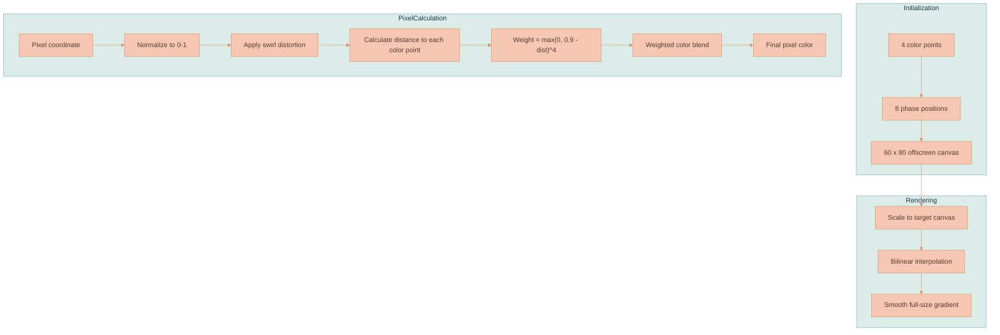
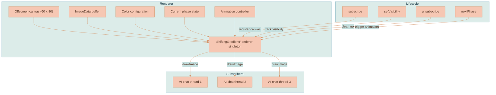
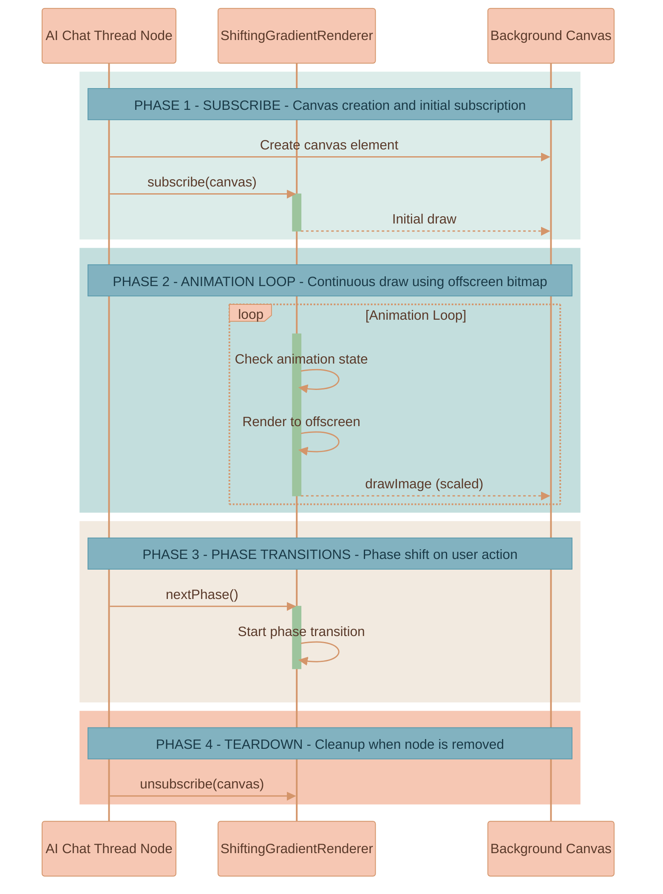

# Gradient Rendering and Animation System

This document is the source of truth for the web UI gradient ecosystem: freeform bitmap gradients, animated shifting backgrounds, context-region cloud gradients, SVG gradient borders, and the shared easing curves that animate them. Detailed context-region shape, hit testing, and PIXI layer behavior remains in [CONTEXT-REGION-CLOUDS.md](CONTEXT-REGION-CLOUDS.md).

## System Overview

The gradient system has two rendering families:

| Family | Renderer | Output | Consumers |
|---|---|---|---|
| Freeform bitmap gradient | `FreeformGradientRenderer` | Canvas `ImageData` generated from four color anchors, eight phase positions, inverse-distance blending, and swirl distortion | AI chat thread and floating prompt shifting backgrounds, context-region watercolor surface sampling, active thought-circle textures |
| SVG linear gradient | `SvgGradientRenderer` | D3-created `<linearGradient>` stops and rotating endpoint animation | Document context selection, document thread border, generated-image border |

Animation curves are centralized in `Easing`, while surface-specific lifecycle remains with each consumer. `ShiftingGradientRenderer` owns canvas subscription and phase-transition lifecycle; `pixiContextRegionLayer.ts` owns PIXI texture caching and active-region overlay lifecycle; SVG consumers own their D3 element creation while delegating reusable gradient construction and rotation to `SvgGradientRenderer`.

## Shared Modules

| Class | Location | Responsibility |
|---|---|---|
| `Easing` | `services/web-ui/src/utils/animations/easing.ts` | Cubic-bezier evaluation plus shared hover and shifting-gradient transition curves |
| `FreeformGradientRenderer` | `services/web-ui/src/utils/animations/gradients/freeformGradient.ts` | Color parsing, phase positions, freeform sampling, image-data painting, and canvas bitmap drawing |
| `ShiftingGradientRenderer` | `services/web-ui/src/utils/animations/gradients/shiftingGradientRenderer.ts` | Singleton-per-color-set canvas renderer, subscriptions, visibility, resize redraws, optional pattern overlays, and animated phase changes |
| `SvgGradientRenderer` | `services/web-ui/src/utils/animations/gradients/svgGradient.ts` | Linear gradient stop construction, repeating border stops, and rotating linear-gradient animation |

### Reuse Rules

- New Canvas or PIXI freeform gradient surfaces should call `FreeformGradientRenderer`; they should not copy the pixel sampling, phase, or swirl algorithm into consumer files.
- New SVG animated gradient borders should call `SvgGradientRenderer` for stop construction and rotation.
- Runtime JavaScript animations that match existing interaction motion should use `Easing`, not reimplement cubic-bezier calculations.
- Visual color choices belong in `webUiThemeSettings.ts`; renderer classes consume configured colors rather than owning product palettes.

## Palette Ownership

The system intentionally has separate palettes for different visual roles:

| Setting | Purpose | Consumers |
|---|---|---|
| `webUiThemeSettings.shiftingGradientColors` | Dreamy pastel canvas/SVG accent palette | AI chat thread and floating prompt backgrounds, generated-image animated border, document thread border, document context selection |
| `webUiThemeSettings.contextRegion.cloud.palettes.surfaceGradient` through `contextRegion.cloud.gradientColors` | Translucent seafoam watercolor surface palette | PIXI context-region cloud surface sampling |
| `webUiThemeSettings.contextRegion.cloud.palettes.activeThoughtCircle` through `contextRegion.cloud.activeThoughtCircleGradientColors` | Soft sage active marker palette | PIXI active context-region detached thought circle |

The context-region renderer uses the palette getters rather than hard-coded arrays so cloud surface tuning and active-indicator tuning remain explicit theme configuration. `gradientPositions` controls the cloud surface anchor placement; active thought-circle textures use the shared phase positions from `FreeformGradientRenderer`.

## Gradient Consumers

### Context Region Cloud Surface

`pixiContextRegionLayer.ts` uses `FreeformGradientRenderer.sampleColor()` while baking the watercolor texture for the full CO2 cloud. This preserves the same soft freeform color language as the animated canvas gradient while still mixing in cloud-specific mask alpha, grain, pools, bloom, border, and local radial/linear highlight overlay passes. Its freeform colors come from `contextRegion.cloud.gradientColors`; its paint overlays remain private to the watercolor texture pipeline because they describe cloud material rather than a reusable gradient surface.

### Active Context Region Thought Circle

The active context-region marker is not a solid fill or a second cloud silhouette. PIXI adds gradient overlay sprites only over the detached thought-circle geometry. The overlay bitmap is generated by `FreeformGradientRenderer.drawBitmap()` from `contextRegion.cloud.activeThoughtCircleGradientColors`, then clipped into the circle.

When active chat context changes, the layer crossfades between adjacent freeform phases with a bounded opacity bloom. This animation uses `Easing.hoverTransition()` and requestAnimationFrame only while a transition is active; it does not introduce a persistent ticker. The full rendering and interaction contract is documented in [CONTEXT-REGION-CLOUDS.md](CONTEXT-REGION-CLOUDS.md).

### SVG Gradient Borders and Selection

`SvgGradientRenderer` supplies two reusable forms of SVG gradient construction:

- `appendLinearGradientStops()` lays out ordinary linear stops for document context selection.
- `appendRepeatingLinearGradientStops()` creates looping stops for animated borders.
- `startRotatingLinearGradient()` rotates gradient endpoints for document thread and generated-image borders, defaulting to `Easing.hoverTransition()`.

These SVG consumers use `shiftingGradientColors`; they reuse the palette but do not run the freeform pixel sampler.

### Static CSS Gradient Surfaces

Some UI surfaces use CSS gradients without participating in freeform bitmap rendering or SVG animation. They remain documented here so the palette relationship is visible:

| Surface | Definition | Relationship |
|---|---|---|
| AI chat thread vertical rail | `webUiThemeSettings.aiChatThreadRailGradient`, applied by `WorkspaceCanvas.ts` and rendered in `workspace-canvas.scss` | A static two-color accent related to the pastel shifting palette |
| Model/dropdown highlights | `components/dropdown/_dropdown-mixins.scss` | Uses the same simple lavender/periwinkle two-color accent as the rail |
| AI user message bubbles and canvas provenance prompt bubbles | `components/proseMirror/plugins/aiChatThreadPlugin/ai-chat-thread.scss`, `infographics/workspace/workspace-canvas.scss` | Local dark bubble treatment; not part of the animated palette system |
| Generated-image action readability fade | `components/proseMirror/plugins/aiChatThreadPlugin/ai-chat-thread.scss` | Local media overlay fade; not a reusable gradient asset |
| Media Library feature thumbnail placeholder | `infographics/workspace/media-library-panel.scss` | Local placeholder treatment; not part of animated gradient rendering |
| Theme/sidebar and editor-theme backgrounds | `sass/_variables.scss`, `sass/themes/_minimalist-chic.scss`, `components/proseMirror/themes/cm6-themes/packages/gruvbox-light/src/index.ts` | General theme styling; outside the workspace gradient renderer contract |

Do not route ordinary CSS background treatments through `FreeformGradientRenderer` or `SvgGradientRenderer`. Those classes own generated texture and animated SVG behavior; simple component backgrounds should stay with their component/theme styling unless they become a shared product token.

## Easing Curves

| Method | Cubic Bezier | Used For |
|---|---|---|
| `Easing.hoverTransition()` | `(0.19, 1, 0.22, 1)` | Context-region active thought-circle transition and rotating SVG gradients |
| `Easing.shiftingGradientTransition()` | `(0.33, 0, 0, 1)` | Freeform phase transition in `ShiftingGradientRenderer` |

## Test Coverage

| Test | Coverage |
|---|---|
| `services/web-ui/src/utils/animations/easing.test.ts` | Cubic-bezier identity/clamping, valid curve bounds, and shared easing profiles |
| `services/web-ui/src/utils/animations/gradients/freeformGradient.test.ts` | Colors, phases, sampling, bitmap painting, and context drawing |
| `services/web-ui/src/utils/animations/gradients/svgGradient.test.ts` | Stop creation, repeated stops, rotating transitions, and shared default easing |
| `services/web-ui/src/utils/animations/gradients/shiftingGradientRenderer.test.ts` | Singleton lifecycle, animation phase changes, pixels, subscriptions, resize redraw, patterns, and teardown |
| `services/web-ui/src/infographics/workspace/rendering/pixiContextRegionLayer.test.ts` | Active thought-circle-only PIXI integration regression guards |

Run the web UI suite inside its container:

```bash
docker exec lixpi-web-ui pnpm test:run
```

## Shifting Gradient Background

AI chat thread nodes in the workspace use an animated freeform gradient background that smoothly shifts between color positions. This creates a living, breathing feel for the AI conversation space. Floating AI prompt inputs can use the same renderer through their feature flag.

The remainder of this section preserves the implementation details for that background: its algorithm, singleton lifecycle, color-analysis workflow, performance characteristics, customization, CSS integration, optional pattern overlay, and troubleshooting.

### Inspiration

We took inspiration from animated freeform gradient wallpapers found in modern messaging apps. The clever trick is rendering to a tiny 60×80 pixel bitmap and then letting the browser's bilinear interpolation do the heavy lifting when scaling up. The result is buttery smooth gradients at virtually zero CPU cost.

We've built our own implementation that works as a singleton renderer powering multiple canvas elements simultaneously.

### How It Works

The gradient uses four color points positioned around the canvas. Each pixel's color is calculated using inverse distance weighting — the closer a pixel is to a color point, the more that color influences the final result. The weighting uses a `distance^4` falloff, which creates those nice soft blobs rather than harsh linear gradients.

On top of that, there's a swirl distortion applied to the coordinates before the color calculation. This prevents the gradient from looking too "geometric" — it adds an organic, flowing quality.

#### The Algorithm



#### Phase Positions

The gradient has 8 predefined phases, each defining where the 4 color points sit on the canvas. When the user sends a message, the gradient animates from one phase to the next, creating that subtle shift effect.

```
Phase 0: Color points mostly in upper-right area
Phase 1: Points spread between upper-left and lower-right
Phase 2: Points moving toward center and bottom
...and so on through Phase 7
```

The animation uses a cubic bezier easing curve (`0.33, 0, 0, 1`) which gives it that nice ease-out feel — fast at the start, gentle landing at the end.

### Shifting Background Architecture



The renderer caches one singleton instance per configured color set. In ordinary workspace usage, all AI chat thread nodes and floating prompt inputs use the default color set, subscribe to one shared renderer, and share its single 60×80 offscreen canvas. This is efficient — the gradient is not recalculated for every node.

#### Shifting Background Components

| Component | Location | Purpose |
|-----------|----------|---------|
| Shifting gradient controller | `services/web-ui/src/utils/animations/gradients/shiftingGradientRenderer.ts` | `ShiftingGradientRenderer` singleton class for subscriber and canvas lifecycle control |
| Freeform gradient renderer | `services/web-ui/src/utils/animations/gradients/freeformGradient.ts` | `FreeformGradientRenderer` class for shared color parsing, phase positions, swirl sampling, and bitmap painting |
| Easing utilities | `services/web-ui/src/utils/animations/easing.ts` | `Easing` class for shared cubic-bezier easing used by Canvas, PIXI, and SVG transitions |

#### Swirl Distortion

The swirl effect is what makes the gradient feel organic rather than mathematical. Here's how it works:

1. Calculate distance from pixel to center (0.5, 0.5)
2. Rotation angle = `(distance × 0.35)² × 0.8 × 8.0`
3. Rotate the coordinate around the center by that angle

Pixels near the center barely rotate. Pixels near the edges rotate more. This creates a subtle spiral effect in the final gradient.

### Shifting Background Color Selection

The gradient uses 4 colors that blend together. Choosing good colors is important — they need to:

1. Be harmonious (work well together when blended)
2. Have appropriate contrast (not too similar, not too jarring)
3. Match the overall design aesthetic

The current colors are ultra-light pastels inspired by a desert sunset sky palette. They are defined centrally in `webUiThemeSettings.ts` as the `shiftingGradientColors` property and shared across the shifting gradient background, image generation animated border (`WorkspaceCanvas.ts`), and document shape borders (`documentThreadShape.ts`, `documentContextSelection.ts`):

```typescript
// webUiThemeSettings.ts
shiftingGradientColors: ['#FFF5FA', '#F5EFF9', '#E6E9F6', '#F3E4F2']
```

`FreeformGradientRenderer` converts these hex values to RGB at startup:

```typescript
const GRADIENT_COLORS = {
    color1: { r: 0xff, g: 0xf5, b: 0xfa }, // #FFF5FA - whisper pink
    color2: { r: 0xf5, g: 0xef, b: 0xf9 }, // #F5EFF9 - whisper lavender
    color3: { r: 0xe6, g: 0xe9, b: 0xf6 }, // #E6E9F6 - whisper periwinkle
    color4: { r: 0xf3, g: 0xe4, b: 0xf2 }, // #F3E4F2 - whisper orchid
}
```

### Color Analysis Tool

When you want to extract colors from a reference image (like a gradient wallpaper screenshot), we have a Python tool that does perceptual color fitting.

#### Location

```
random-useful-things/image-color-analysis-tool/advanced_gradient_color_analysis.py
```

#### What It Does

```mermaid
%%{init: {'theme': 'base', 'themeVariables': { 'primaryColor': '#F6C7B3', 'primaryTextColor': '#5a3a2a', 'primaryBorderColor': '#d4956a', 'secondaryColor': '#C3DEDD', 'secondaryTextColor': '#1a3a47', 'secondaryBorderColor': '#4a8a9d', 'tertiaryColor': '#DCECE9', 'tertiaryTextColor': '#1a3a47', 'tertiaryBorderColor': '#82B2C0', 'lineColor': '#d4956a', 'textColor': '#5a3a2a'}}}%%
graph LR
    subgraph Input
        IMG["Reference image"]
    end

    subgraph Preprocessing
        BLUR["Gaussian blur"]
        GRID["50 x 50 sample grid"]
    end

    subgraph Analysis
        LAB["Convert to LAB color space"]
        LCH["Analyze lightness, chroma, hue"]
        REGIONS["Extract regional averages"]
    end

    subgraph Optimization
        DE["Differential evolution"]
        DELTAE["Delta E perceptual error"]
        PHASES["Test multiple phases"]
    end

    subgraph Output
        COLORS["Optimized 4 colors"]
        PHASE["Best phase number"]
        TS["TypeScript code snippet"]
    end

    IMG --> BLUR
    BLUR --> GRID
    GRID --> LAB
    LAB --> LCH
    LCH --> REGIONS
    REGIONS --> DE
    DE --> DELTAE
    DELTAE --> PHASES
    PHASES --> COLORS
    COLORS --> PHASE
    PHASE --> TS
```



#### How to Use It

1. Get your reference image (screenshot of a gradient you like)
2. Copy it to a location accessible inside the Docker container
3. Run the analysis

```bash
# Copy the tool and image to the llm-api container's mounted directory
cp random-useful-things/image-color-analysis-tool/advanced_gradient_color_analysis.py services/llm-api/src/tmp/
cp my-gradient.jpg services/llm-api/src/tmp/

# Run analysis (the llm-api container has the required Python dependencies)
docker compose exec -T lixpi-llm-api python \
  /app/src/tmp/advanced_gradient_color_analysis.py \
  /app/src/tmp/my-gradient.jpg
```

The tool accepts either a local file path or a URL.

#### Understanding the Output

The tool outputs several sections:

**Color Distribution Analysis**
```
Lightness range: 54.5 - 94.4
Lightness mean: 73.3, std: 7.3
Chroma range: 0.6 - 40.3
Hue range: 110.3° - 230.5°
```

This tells you about the overall color properties of the reference image. Lightness is in the LAB L* scale (0=black, 100=white). Hue is in degrees (0°=red, 120°=green, 240°=blue).

**Regional Color Averages**
```
top_right: #90BA8A
center_right: #9EBF94
top_left: #B8CA8B
bottom_center: #8FB396
```

The tool samples different regions of the image and reports the average color in each. This gives you a quick sense of the gradient structure.

**Perceptual Optimization Results**

The tool runs optimization for multiple phases and reports the perceptual error (Delta E) for each:

```
Phase 0:
  Perceptual error (Delta E): 11.01
  Colors:
    1: #7DB467 (L=68.0)
    2: #A9B181 (L=70.5)
    ...
```

Lower Delta E = better match to the reference. The tool picks the phase with the lowest error.

**Final TypeScript Snippet**

At the end, you get ready-to-paste code:

```typescript
const GRADIENT_COLORS = {
    color1: { r: 0x7c, g: 0xbb, b: 0x6c }, // #7CBB6C
    color2: { r: 0xab, g: 0xb8, b: 0x87 }, // #ABB887
    color3: { r: 0x9f, g: 0xcd, b: 0x91 }, // #9FCD91
    color4: { r: 0x80, g: 0xb2, b: 0x91 }, // #80B291
}

const CURRENT_PHASE = 0
```

#### Why LAB Color Space?

The tool uses CIE LAB color space for optimization because it's perceptually uniform. In RGB, a numerical difference of 10 units might look huge in one color range and invisible in another. In LAB, equal numerical distances correspond to roughly equal perceived differences. Delta E is just the Euclidean distance in LAB space.

#### Pattern Overlay Removal

Many gradient wallpapers have decorative pattern overlays (icons, doodles, etc.). The tool applies Gaussian blur to remove these high-frequency patterns before analysis, so you're measuring the underlying gradient colors, not the overlay.

### Integration with AI Chat Threads

When an AI chat thread node is created on the workspace canvas, it subscribes to the gradient renderer:



#### Visibility Optimization

We use `IntersectionObserver` to track which nodes are actually visible on screen. Hidden nodes (scrolled out of view or behind other elements) don't receive gradient updates, saving rendering work.

### Performance Characteristics

| Metric | Value | Notes |
|--------|-------|-------|
| Bitmap size | 60×80 pixels | 4,800 pixels total |
| Render cost | ~5000 pixel ops | Per frame, trivial for modern CPUs |
| Memory | ~20KB | One offscreen canvas + ImageData |
| Animation FPS | 60fps | Uses requestAnimationFrame |
| Phase transition | 500ms | Cubic-bezier eased |

The design is intentionally simple. No WebGL, no shaders, just plain Canvas 2D. This keeps it portable and predictable across browsers.

### Shifting Background Customization

#### Changing Colors

Edit the `shiftingGradientColors` array in `webUiThemeSettings.ts`:

```typescript
shiftingGradientColors: ['#FFF5FA', '#F5EFF9', '#E6E9F6', '#F3E4F2']
```

These hex values are converted to RGB at startup by `FreeformGradientRenderer` in `services/web-ui/src/utils/animations/gradients/freeformGradient.ts`. The same colors are also used by the image generation animated border in `WorkspaceCanvas.ts` and the document shape borders in `documentThreadShape.ts` / `documentContextSelection.ts`.

#### Changing Animation Speed

Edit `ANIMATION_DURATION_MS`:

```typescript
const ANIMATION_DURATION_MS = 500  // milliseconds
```

#### Changing Swirl Intensity

Edit `FreeformGradientRenderer.swirlFactor` in `services/web-ui/src/utils/animations/gradients/freeformGradient.ts`:

```typescript
private static readonly swirlFactor = 0.35  // 0 = no swirl, 1 = extreme swirl
```

#### Changing Initial Phase

Edit the shared initial phase in `FreeformGradientRenderer`:

```typescript
static readonly initialPhase = 4  // 0-7
```

### CSS Integration

The gradient canvas is positioned behind the AI chat thread content using CSS. The canvas element itself is given a class that positions it absolutely within the node container:

```scss
.workspace-ai-chat-thread-node {
    position: relative;

    .shifting-gradient-canvas {
        position: absolute;
        inset: 0;
        border-radius: inherit;
        z-index: 0;
    }

    .ai-chat-content {
        position: relative;
        z-index: 1;
    }
}
```

### Pattern Overlay Support

The renderer supports an optional pattern overlay (decorative icons/doodles on top of the gradient). This isn't currently used but the infrastructure exists:

```typescript
// In services/web-ui/src/utils/animations/gradients/shiftingGradientRenderer.ts
private pattern: {
    image: HTMLImageElement
    options: Required<PatternOptions>
} | null = null
```

If enabled, patterns are drawn after the gradient with configurable alpha, blend mode, tint color, and scale.

### Shifting Background Troubleshooting

**Gradient looks banded/posterized**
- Check that `imageSmoothingEnabled = true` is set on the target canvas context
- Ensure `imageSmoothingQuality = 'high'`

**Gradient not animating**
- Verify the canvas is subscribed via `subscribe(canvas)`
- Check that visibility is set correctly via `setVisibility(canvas, true)`
- Confirm the animation loop is running (check for subscribers)

**Colors don't match reference image**
- Run the color analysis tool to get proper color values
- Pay attention to the lightness values — the gradient renderer doesn't add brightness
- Check if the reference has a pattern overlay that's affecting perception

**Multiple nodes showing different states**
- Nodes using the same configured color set share one cached renderer and should show the same state
- If nodes configured with the same colors differ, check whether they obtained different renderer instances or missed a subscription update

## References

- CIE LAB color space: https://en.wikipedia.org/wiki/CIELAB_color_space
- Delta E color difference: https://en.wikipedia.org/wiki/Color_difference#CIELAB_%CE%94E*
