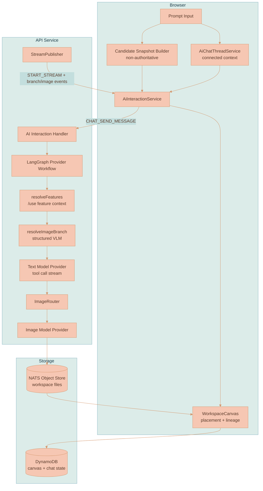
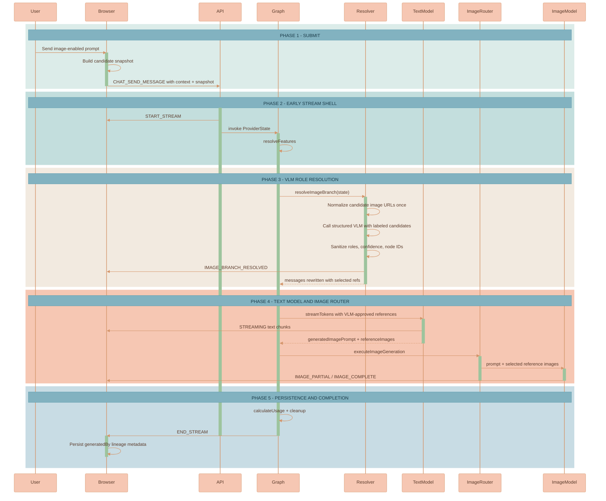
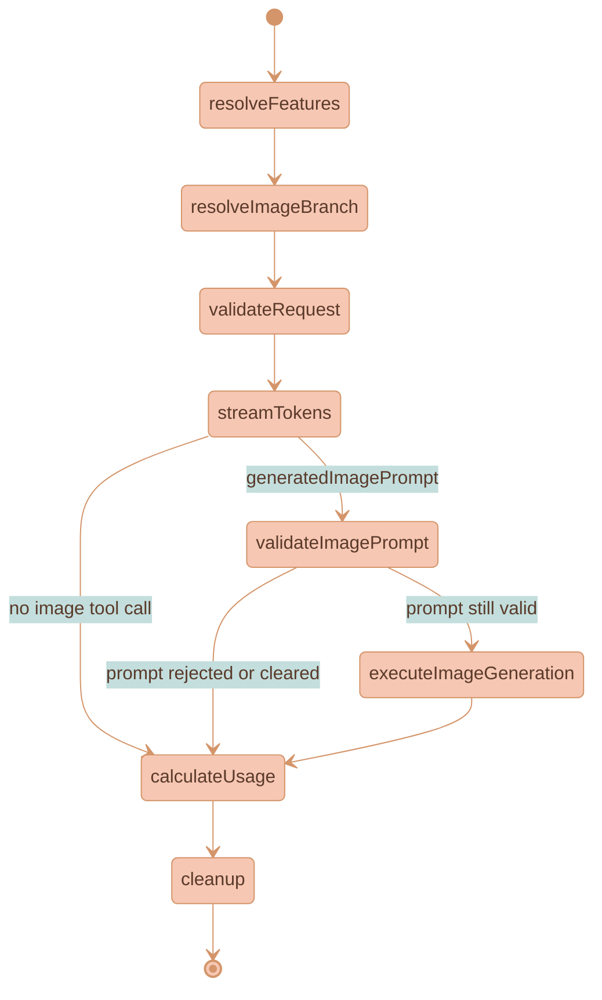

# Image Branch Lineage

Image Branch Lineage makes AI-generated images first-class canvas artifacts with explicit parentage, branch identity, visual summaries, and resolver audit metadata. It is the feature that lets Lixpi answer visual follow-up prompts such as "that guy," "the goat," "this one," or "in the style of that landscape painting" without guessing from text alone.

The key rule is simple: when an image model is selected, generated-image reference routing is always resolved by a structured VLM call in the API before the text model prepares the image prompt. The browser builds a candidate snapshot, but the browser never decides which image references reach the image model. The API-side VLM resolution is the routing authority.

This feature is part of Lixpi's artifact-piping architecture described in [PRODUCT-OVERVIEW.md](../PRODUCT-OVERVIEW.md). Generated images become persistent canvas nodes that can be piped into later threads, reused as exact visual context, and branched into multiple edit directions.

## Core Concepts

**Image Branch** - A lineage of generated image nodes that represent edits or variants of the same visual artifact. Descendants share a `branchId` when the VLM resolves a prompt as continuing an existing target image.

**Parent Image** - The generated image node selected as the edit parent for a new generated image. It is stored as `generatedBy.parentImageNodeId` and used for canvas edge placement.

**Base Context** - Images, documents, and thread content connected to the current AI thread through workspace edges or contained in its context region. Base context narrows candidates and can also be selected by the VLM as visual reference material.

**Candidate Snapshot** - A deterministic browser-built list of labeled image candidates. It includes canvas image node IDs, file IDs, branch hints, ancestor hints, source context IDs, prompt snippets, thread transcript labels, and `nats-obj://` image URLs. It is useful context, not a decision.

**Structured VLM Resolver** - The API-side `resolveImageBranch` LangGraph node. It shows the user prompt plus labeled candidate images to a vision-language model and requires strict JSON describing target, base-context, style-reference, comparison-target, and excluded roles.

**Reference Image Set** - The exact `referenceImageNodeIds` returned by the VLM. These are the only candidate image references inserted into the provider message that downstream `extractReferenceImages()` and `ImageRouter` use.

**Resolver Audit Metadata** - The resolver model provider, model ID, confidence, rationale, excluded node IDs, operation kind, visual summaries, and schema version persisted on generated image metadata for later candidate labeling and debugging.

## Why This Exists

Image branch routing is a visual reference-grounding problem, not a string parsing problem. A user can create a portrait branch, create or reference a landscape painting, and then ask:

```text
draw a goat in the style of that landscape painting
```

The system must understand several visual roles at once:

- The goat is the requested new subject.
- The landscape painting is style evidence.
- Any existing generated portrait branch is unrelated and should not condition the image model.

Regexes, latest-leaf heuristics, and prompt-derived tags all fail this class of problem because they do not inspect the pixels. A generated image can diverge from the original prompt, provider revised prompts may be empty, and natural-language references are often ambiguous until grounded against the visible candidates.

Lixpi solves this by combining deterministic graph narrowing with VLM role assignment. The graph determines which artifacts are plausible candidates. The VLM decides their visual roles.

## Product Principles

- **VLM-grounded beats text-inferred.** If an image reference decision affects pixels, a vision-language model must see the labeled visual candidates.
- **Graph narrows candidates; VLM assigns roles.** Deterministic code collects and labels candidate artifacts, but it does not select the target branch.
- **Context is selective.** Base context and generated variants have different roles. Only VLM-selected candidate images become image-model references.
- **One decision feeds routing and placement.** The references sent to the image model and the generated image's canvas edge come from the same resolver result.
- **No silent guessing.** Resolver failure is user-visible and stops image generation instead of falling back to regexes, recency, or all-variant injection.
- **Feature extraction remains independent.** `/use` feature references resolve before branch resolution and their injected feature image blocks are preserved by the branch resolver.

## System Architecture



## Runtime Flow

Top-level chat requests publish `START_STREAM` before graph prework begins, so the browser immediately enters a receiving state while feature resolution, image URL normalization, and branch VLM resolution run. The actual text-model tokens still wait until branch resolution completes because the provider must receive the VLM-approved image references.



## LangGraph Workflow

The shared provider workflow lives in [base-provider.ts](../../services/api/src/llm/providers/base-provider.ts). It runs feature resolution before branch resolution and branch resolution before request validation and provider streaming.



The `resolveImageBranch` node is a no-op when no image model is selected. When an image model is selected, it requires `imageBranchCandidateSnapshot`; missing snapshots publish `IMAGE_BRANCH_RESOLUTION_ERROR` and fail the graph.

## Data Model

The shared contracts live in [packages/lixpi/constants/ts/types.ts](../../packages/lixpi/constants/ts/types.ts). The representation is intentionally split into browser-built candidates, API-built resolutions, and persisted generated-image metadata.

```typescript
export type ImageGenerationOperationKind =
    | 'new_image'
    | 'edit_existing'
    | 'style_transfer'
    | 'compare_branches'
    | 'fresh_branch'

export type ImageBranchSelectionMode =
    | 'context-only'
    | 'edit-active-branch'
    | 'all-branches'
    | 'fresh-branch'
    | 'ambiguous'

export type ImageBranchCandidateRoleHint =
    | 'base-context'
    | 'generated-variant'
    | 'branch-leaf'
    | 'branch-ancestor'
    | 'embedded-thread-image'
```

### Candidate Snapshot

`ImageBranchCandidateSnapshot` is created by [ai-image-branching.ts](../../services/web-ui/src/services/ai-image-branching.ts). It contains enough context for the VLM to inspect candidates, but it is not routing authority.

```typescript
export type ImageBranchCandidateImage = {
    nodeId: string
    fileId?: string
    workspaceId?: string
    imageUrl: string
    roleHints: ImageBranchCandidateRoleHint[]
    branchId?: string
    parentImageNodeId?: string
    ancestorNodeIds: string[]
    sourceContextNodeIds: string[]
    sourceMessageId?: string
    promptText?: string
    visualEntitySummary?: string
    visualStyleSummary?: string
    entityTags?: string[]
    styleTags?: string[]
    createdAt?: number
}

export type ImageBranchCandidateSnapshot = {
    resolverVersion: string
    threadId: string
    regionNodeId: string
    promptText: string
    promptFingerprint: string
    candidates: ImageBranchCandidateImage[]
    transcriptContext: string
}
```

### VLM Resolution

`ImageBranchVlmResolution` is created only by the API resolver. It is streamed to the browser and used to rewrite provider messages.

```typescript
export type ImageBranchVlmResolution = {
    resolverKind: 'structured-vlm'
    resolverVersion: string
    resolverModelProvider: string
    resolverModelId: string
    mode: ImageBranchSelectionMode
    operationKind: ImageGenerationOperationKind
    targetImageNodeId: string | null
    parentImageNodeId?: string
    branchId: string | null
    includeGeneratedNodeIds: string[]
    referenceImageNodeIds: string[]
    sourceContextNodeIds: string[]
    styleReferenceNodeIds: string[]
    excludedNodeIds: string[]
    visualEntitySummary?: string
    visualStyleSummary?: string
    entityTags: string[]
    styleTags: string[]
    confidence: number
    rationale: string
    decisions: ImageBranchVlmReferenceDecision[]
}
```

### Persisted Generated Metadata

Generated image nodes store resolver output in `ImageGeneratedByMetadata` so future snapshots can label candidates with branch and visual summary context.

| Field | Meaning |
|-------|---------|
| `branchId` | Stable ID for one generated-image lineage. |
| `parentImageNodeId` | Image node selected as edit parent or placement parent. |
| `sourceContextNodeIds` | Context nodes relevant to generation. |
| `referenceImageNodeIds` | Exact candidate node IDs sent as image-model references. |
| `operationKind` | VLM-classified operation, such as `new_image`, `edit_existing`, or `style_transfer`. |
| `promptText` | User-authored prompt text for audit. |
| `promptFingerprint` | Stable browser fingerprint of normalized prompt text. |
| `visualEntitySummary` | VLM visible-subject summary for future candidate labels. |
| `visualStyleSummary` | VLM visible-style or medium summary for future candidate labels. |
| `entityTags` | VLM-derived visible subject tags. |
| `styleTags` | VLM-derived visible style tags. |
| `targetImageNodeId` | Candidate image selected as the edit target. |
| `styleReferenceNodeIds` | Images selected as style, palette, medium, composition, or mood evidence. |
| `excludedNodeIds` | Candidate images rejected by the resolver. |
| `resolverKind` | `structured-vlm`. |
| `resolverModelProvider` | Provider used for branch resolution. |
| `resolverModelId` | Exact resolver model ID. |
| `resolverRationale` | Short VLM-grounded explanation. |
| `resolverConfidence` | Sanitized confidence from `0` to `1`. |
| `resolverVersion` | Schema version, currently `image-branch-vlm-v1`. |
| `createdAt` | Generation placement timestamp. |

## Candidate Snapshot Construction

The browser builds the candidate snapshot in [ai-image-branching.ts](../../services/web-ui/src/services/ai-image-branching.ts). The main entry point is `buildImageBranchCandidateSnapshot()`.

Candidate construction collects:

- Incoming edge context for the target context region or AI chat thread.
- Image nodes contained by or connected to that context.
- Generated images produced by the current thread.
- Branch ancestors through generated metadata and workspace edges.
- Leaf generated images so the VLM can distinguish latest branch tips from older ancestors.
- Prompt text, revised prompts, VLM summaries, entity/style tags, and transcript text recovered from ProseMirror response messages.
- Stable `nats-obj://workspace-{workspaceId}-files/{fileId}` URLs when file IDs are available.

The snapshot builder merges duplicate candidate sources by `nodeId`, unions role hints, unions ancestor and source context IDs, and combines prompt text with separators. It does not rank or select a winner.

## API Resolver Behavior

The authoritative resolver lives in [image-branch-resolver.ts](../../services/api/src/llm/graph/image-branch-resolver.ts). It runs only for image-enabled requests.

The resolver does the following work:

1. Chooses a resolver provider and model. `IMAGE_BRANCH_RESOLVER_PROVIDER` and `IMAGE_BRANCH_RESOLVER_MODEL_VERSION` can override the chat provider; otherwise the chat provider/model is used when it is VLM-capable.
2. Supports Anthropic, OpenAI, and Google as resolver providers.
3. Normalizes candidate image URLs once through `resolveImageUrls()`, including NATS Object Store fetch, MIME normalization, and downscaling.
4. Builds a VLM prompt containing the user prompt, prompt fingerprint, thread ID, region node ID, compact candidate metadata JSON, transcript context, and each labeled candidate image.
5. Calls `callStructuredVlm()` with the `resolve_image_branch` schema and low temperature.
6. Sanitizes the model output, validates all returned node IDs against the candidate set, clamps confidence, rejects invalid roles, and fails `mode: "ambiguous"` or confidence below `0.2`.
7. Builds or reuses a `branchId`. Existing target branch IDs are preserved; otherwise a new `branch-{uuid}` is created.
8. Strips original candidate image blocks from `state.messages` while preserving non-candidate image blocks such as `/use` feature references.
9. Prepends a new `image_branch_vlm_resolution` message containing only selected `referenceImageNodeIds`, using the already-normalized candidate image URLs.
10. Publishes `IMAGE_BRANCH_RESOLVED` with the sanitized resolution.

The selected normalized URLs are reused by the downstream text provider and image router. This prevents repeated NATS fetches and repeated downscaling of the same candidate references.

## Stream Lifecycle

Top-level chat requests start the stream before graph invocation in [base-provider.ts](../../services/api/src/llm/providers/base-provider.ts). This creates the empty assistant response shell immediately while pre-stream VLM work runs.

`StreamPublisher` in [stream-publisher.ts](../../services/api/src/llm/graph/stream-publisher.ts) makes `start()` and `end()` idempotent:

- Provider implementations can still call `publisher.start()` when their stream begins without duplicating `START_STREAM`.
- `END_STREAM` is ignored before `START_STREAM`.
- Pre-stream errors publish `ERROR` and then `END_STREAM`, so the browser does not remain stuck in a receiving state.
- Transient image-model providers called through `ImageRouter` still skip their own stream lifecycle because the parent chat stream owns it.

Branch-specific stream events use the same per-thread receive subject as token and image events:

```typescript
export type ImageBranchResolvedStreamPayload = {
    status: 'IMAGE_BRANCH_RESOLVED'
    aiProvider: string
    resolution: ImageBranchVlmResolution
}

export type ImageBranchResolutionErrorStreamPayload = {
    status: 'IMAGE_BRANCH_RESOLUTION_ERROR'
    aiProvider: string
    error: string
}
```

[ai-interaction-service.ts](../../services/web-ui/src/services/ai-interaction-service.ts) bypasses the markdown parser for these events and forwards `image_branch_resolved` or `image_branch_resolution_error` segments to the AI chat thread plugin.

## Canvas Placement And Persistence

[WorkspaceCanvas.ts](../../services/web-ui/src/infographics/workspace/WorkspaceCanvas.ts) stores pending generation placement by thread ID.

On submit with an image model selected:

1. `rememberGeneratedImagePlacement()` extracts prompt text from the outgoing messages.
2. It builds `ImageBranchCandidateSnapshot` from the current canvas state and thread transcript labels.
3. It stores a temporary branch ID and pending placement record.
4. It sends the snapshot through `AiInteractionService` with the chat request.

When `IMAGE_BRANCH_RESOLVED` arrives:

1. `onImageBranchResolvedToCanvas` finds the pending placement.
2. It sets the placement `sourceNodeId` from `targetImageNodeId`, `parentImageNodeId`, or the original region node.
3. It stores the full VLM resolution in the placement.

When `IMAGE_PARTIAL` arrives:

1. The canvas creates or updates the generated image node placeholder.
2. The placeholder edge uses the VLM-selected source node if one was resolved.
3. The image node's `generatedBy` metadata includes `getPendingGeneratedImageLineage()` output.
4. If placement continues from an image node, the placeholder is vertically centered on that preceding image rather than top-aligned to it.

When `IMAGE_COMPLETE` arrives:

1. The partial node is upgraded with final file ID, image URL, response ID, revised prompt, provider badge, and response message ID.
2. The edge `sourceMessageId` is set to the AI response message ID when applicable.
3. Resolver metadata is persisted onto `generatedBy`.
4. Pending placement is cleared.

PIXI reports intrinsic dimensions whenever placeholder, partial, or final pixels load. For generated image-to-image continuations, each intrinsic-size correction recomputes the node's vertical position from its image lineage anchor center. A square placeholder, landscape partial, and portrait final therefore remain on one branch center line even though their rectangles change size.

The finalized generated-image node also gets canvas provenance chrome: the provider badge and info button render in the image chrome overlay, and the full-width info panel uses `generatedBy.responseMessageId` plus the persisted chat thread to show the original user prompt, producing AI response, and the same image-generation trace metadata shown in chat history without cropping long prompts or reference metadata.

When `IMAGE_BRANCH_RESOLUTION_ERROR` or a later image error arrives, the pending placement is cleared. If a partial image already exists, the canvas shows an image error placeholder briefly and removes the failed node from canvas state.

## Provider And Image Router Interaction

Branch resolution happens before the text provider streams. This is intentional. The text provider must write the image prompt using the exact reference set the VLM selected.

After the provider emits a `generate_image` tool call:

- `extractReferenceImages()` reads selected `input_image` blocks from `state.messages`.
- `ImageRouter` logs the invocation chain, including chat provider/model, image provider/model, routed prompt length, selected reference count, and short reference fingerprints.
- The transient image-model provider is called with `enableImageGeneration: true`, so it publishes `IMAGE_PARTIAL` and `IMAGE_COMPLETE` but does not start or end a second text stream.

The API's `ImageRouter` reference fingerprints should match the VLM resolution's `referenceImageNodeIds`. If the resolver excludes a distractor, that distractor should not appear in `referenceImagesCount` or the logged fingerprints.

## Examples

| User Request | Existing State | VLM Resolver Decision | References Sent |
|--------------|----------------|-----------------------|-----------------|
| `make a painting of that guy look like cubist oil painting` | Base portrait, base painting, portrait branch, goat branch | Target is the visible person/portrait generated branch; goat branch excluded | Selected portrait target and any selected style/base context |
| `make the goat wearing sunglasses` | Portrait branch and goat branch | Target is goat branch; portrait branch excluded | Selected goat branch target |
| `draw a goat in the style of that landscape painting` | Base portrait, base landscape painting, portrait branch | New goat subject; landscape is style reference; portrait branch excluded | Selected base/style images, no portrait variant |
| `make it more expressive` | Multiple generated branches in one thread | VLM resolves `it` against visible candidate pixels and transcript context | Selected target branch only |
| `compare both variants side by side` | Two visible generated leaf variants | Both leaf variants are comparison targets | Both selected generated leaves |
| `go back to the first portrait and make it noir` | Multiple portrait descendants | Earlier portrait candidate is selected by ordinal and visual identity | Selected earlier portrait target |
| `make a new unrelated robot in this style` | Several generated branches exist | Fresh subject; style source resolved separately; unrelated branches excluded | Selected style reference only |

## Storage Architecture

No new table or bucket exists for this feature.

**DynamoDB** stores richer generated-image metadata inside the existing workspace `canvasState.nodes[]`. The AI chat transcript remains in the existing AI chat thread item. Candidate snapshots are request payloads, not persisted records.

**NATS Object Store** remains the file storage layer for candidate and generated images. Candidate image URLs use the existing `nats-obj://workspace-{workspaceId}-files/{fileId}` convention.

**IAM and service access** do not change. The API already has NATS Object Store access, model-provider credentials, and workspace persistence access.

## Failure Handling

The resolver fails visibly instead of silently guessing.

Failure cases include:

- Image model selected but no `imageBranchCandidateSnapshot` was sent.
- Resolver provider/model is missing or not VLM-capable.
- The VLM returns unknown node IDs.
- The VLM returns an invalid role or invalid operation kind.
- The VLM excludes its own target image.
- The VLM target image is missing from `referenceImageNodeIds`.
- The VLM returns `mode: "ambiguous"`.
- Confidence is below `0.2`.

The API publishes `IMAGE_BRANCH_RESOLUTION_ERROR`, then the graph error path publishes `ERROR` and closes the stream. The browser clears pending placement, removes partial image state when necessary, and ends the receiving UI state.

## Alternative Evaluation

### Expanding Regexes

Regexes are fast and transparent. They can annotate candidate labels, such as ordinal phrases or rough prompt hints. They cannot be routing authority because they cannot see pixels, resolve pronouns, or separate target identity from style evidence.

### Latest Leaf Selection

Choosing the newest generated leaf works in single-branch sessions and fails in parallel branches. Chronology is useful metadata for the VLM, not identity.

### Including Every Generated Variant

Including every variant maximizes recall but contaminates image generation. Generated variants are strong visual conditions. Unrelated portrait, goat, landscape, and style variants should not all reach the image model together.

### Text-Only LLM Resolver

A text-only LLM can read labels and prompts but still cannot inspect generated pixels. Since images can differ from prompt text, a text-only resolver repeats the same failure class with a more expensive model.

### LangGraph Checkpointing

Checkpointing is useful for run continuity, replay, and debugging. It does not solve visual reference grounding because branch decisions depend on the canvas artifact graph and the actual candidate images.

### Separate Artifact Table

A dedicated `IMAGE_ARTIFACTS` table would help cross-workspace lineage queries and artifact-library use cases. It is not required for the current feature because workspace canvas state already persists nodes, edges, files, and generated metadata.

## Observability

The implementation emits enough logs to compare frontend candidate construction, resolver output, and image-router input.

- Browser logs `[CANVAS] image branch candidate snapshot` with thread ID, candidate count, prompt fingerprint, and candidate node IDs.
- API logs `[ImageBranchResolver] resolved` with workspace ID, thread ID, resolver provider/model, mode, operation kind, selected references, excluded nodes, and confidence.
- Browser logs `[CANVAS] image branch VLM resolution` with placement source, branch ID, reference IDs, excluded IDs, confidence, and rationale.
- `ImageRouter` logs the invocation chain with selected reference count and reference fingerprints.

For a correct run, the selected `referenceImageNodeIds` from the resolver should correspond to the `ImageRouter` reference fingerprints. Excluded nodes should not appear in the routed image references.

## Current Implementation Map

| Area | File |
|------|------|
| Shared branch contracts | [types.ts](../../packages/lixpi/constants/ts/types.ts) |
| Stream status constants | [ai-interaction-constants.json](../../packages/lixpi/constants/ai-interaction-constants.json), [index.ts](../../packages/lixpi/constants/ts/index.ts) |
| Browser candidate snapshots | [ai-image-branching.ts](../../services/web-ui/src/services/ai-image-branching.ts) |
| Candidate snapshot tests | [ai-image-branching.test.ts](../../services/web-ui/src/services/ai-image-branching.test.ts) |
| NATS request forwarding | [ai-interaction-subjects.ts](../../services/api/src/NATS/subscriptions/ai-interaction-subjects.ts) |
| Shared LangGraph workflow | [base-provider.ts](../../services/api/src/llm/providers/base-provider.ts) |
| Provider state channels | [state.ts](../../services/api/src/llm/graph/state.ts) |
| Structured VLM resolver | [image-branch-resolver.ts](../../services/api/src/llm/graph/image-branch-resolver.ts) |
| Resolver tests | [image-branch-resolver.test.ts](../../services/api/src/llm/graph/image-branch-resolver.test.ts) |
| Stream publisher events | [stream-publisher.ts](../../services/api/src/llm/graph/stream-publisher.ts) |
| Browser stream handling | [ai-interaction-service.ts](../../services/web-ui/src/services/ai-interaction-service.ts) |
| ProseMirror event delegation | [aiChatThreadPlugin.ts](../../services/web-ui/src/components/proseMirror/plugins/aiChatThreadPlugin/aiChatThreadPlugin.ts) |
| Canvas placement and lineage persistence | [WorkspaceCanvas.ts](../../services/web-ui/src/infographics/workspace/WorkspaceCanvas.ts) |
| Image routing | [image-router.ts](../../services/api/src/llm/tools/image-router.ts) |
| Image-reference extraction | [image-generation.ts](../../services/api/src/llm/tools/image-generation.ts) |
| Image URL normalization/downscaling | [attachments.ts](../../services/api/src/llm/utils/attachments.ts) |

## Operational Constraints

- The resolver is intentionally in front of text-provider streaming. Starting real provider tokens before branch resolution would let the text model see an unapproved reference set and could reintroduce wrong-image contamination.
- The early `START_STREAM` event is UI lifecycle plumbing, not semantic text. It prevents the UI from appearing frozen while pre-stream VLM work runs.
- Candidate snapshots should remain compact. Dense workspaces can grow candidate counts quickly, so browser narrowing and transcript compaction matter.
- Feature extraction image blocks are not candidate branch blocks and must remain in `state.messages` after branch cleanup.
- `style.setProperty()` and `applyStyle()` conventions in the web UI are unrelated to lineage, but canvas-side branch event handling follows the same workspace coding conventions.

## Future Extensions

- Manual disambiguation picker when the resolver returns `ambiguous`.
- Cross-workspace artifact registry for reusable generated assets.
- Dedicated image artifact table for independent lineage queries.
- Branch contact-sheet candidates when a thread contains many historical variants.
- Graph checkpoint review UI for resolver replay and debugging.
- Provider-specific edit-session hints as fidelity metadata, while keeping VLM role resolution as routing authority.

## References

### Internal Docs

- [PRODUCT-OVERVIEW.md](../PRODUCT-OVERVIEW.md)
- [IMAGE-GENERATION.md](IMAGE-GENERATION.md)
- [WORKSPACE-FEATURE.md](WORKSPACE-FEATURE.md)
- [FEATURE-EXTRACTION-AND-LIBRARY.md](FEATURE-EXTRACTION-AND-LIBRARY.md)
- [CANVAS-ENGINE.md](CANVAS-ENGINE.md)

### Standards And Provenance

- W3C PROV overview: https://www.w3.org/TR/prov-overview/
- YesWorkflow: https://arxiv.org/abs/1502.02403

### Dialogue And Reference Resolution

- Visual Dialog: https://arxiv.org/abs/1611.08669
- MultiWOZ: https://arxiv.org/abs/1810.00278
- Scaling Multi-Domain Dialogue State Tracking via Query Reformulation: https://arxiv.org/abs/1903.05164
- Visual Pronoun Coreference Resolution in Dialogues: https://arxiv.org/abs/1909.00421
- DialoGLUE: https://arxiv.org/abs/2009.13570
- Disambiguating Reference in Visually Grounded Dialogues: https://arxiv.org/abs/2505.11726
- Generative Agents: https://arxiv.org/abs/2304.03442
- MemGPT: https://arxiv.org/abs/2310.08560

### Image Editing And Image Conditioning

- SDEdit: https://arxiv.org/abs/2108.01073
- Prompt-to-Prompt: https://arxiv.org/abs/2208.01626
- Imagic: https://arxiv.org/abs/2210.09276
- InstructPix2Pix: https://arxiv.org/abs/2211.09800
- IP-Adapter: https://arxiv.org/abs/2308.06721
- StyleBrush: https://arxiv.org/abs/2408.09496
