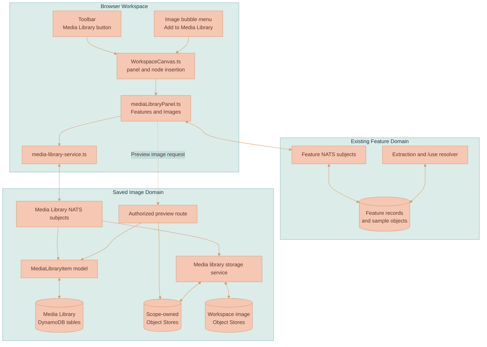
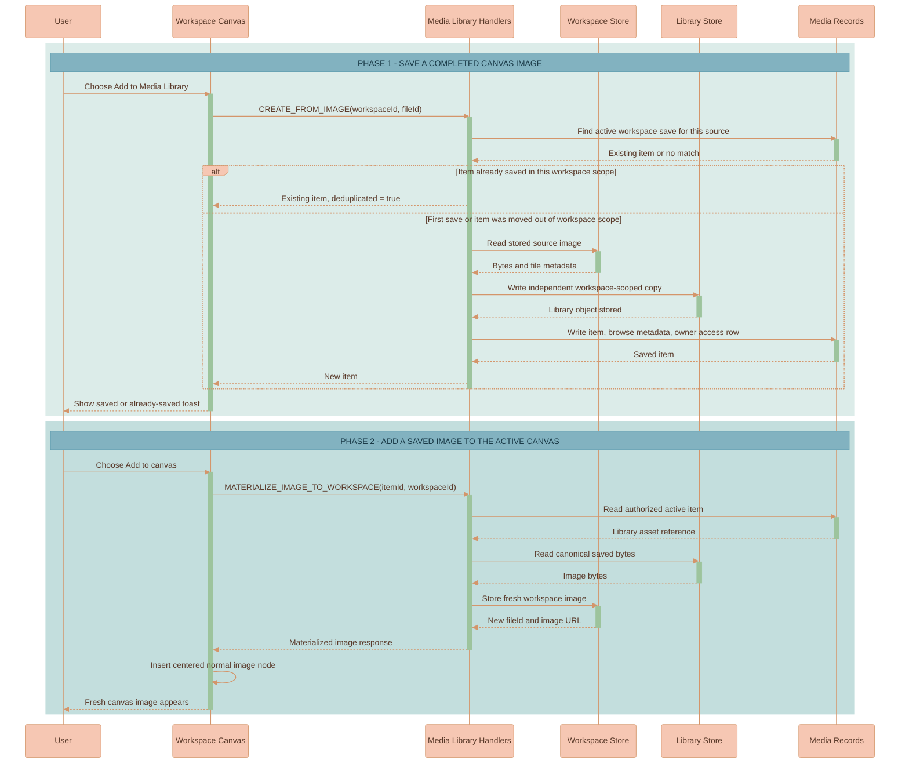

# Media Library

The Media Library is the right-side canvas panel for media a user has chosen to keep. It has two categories: **Features**, which exposes the existing extracted-feature library, and **Images**, which stores reusable copies of finished canvas images.

The important detail is ownership. A saved image is not a bookmark to a canvas node and is not an alias to the workspace image object. Saving makes a separate Object Store copy. Adding it back to a canvas makes another workspace copy. A user can therefore tidy or delete the original canvas image without losing the image they saved for reuse.

For the larger canvas rendering and placement architecture, see [CANVAS-ENGINE.md](CANVAS-ENGINE.md) and [WORKSPACE-FEATURE.md](WORKSPACE-FEATURE.md). For feature extraction, sample images, and `/use` prompt references, see [FEATURE-EXTRACTION-AND-LIBRARY.md](FEATURE-EXTRACTION-AND-LIBRARY.md).

## Core Concepts

**Media Library** — A canvas-owned panel rendered by [`mediaLibraryPanel.ts`](../../services/web-ui/src/infographics/workspace/mediaLibraryPanel.ts). The first time it is opened for a canvas instance, it starts on `Features` with the current `Workspace` scope selected.

**Feature** — An extracted reusable feature such as a palette or style instruction. Features appear inside the Media Library, but they still use the established Feature model, NATS subjects, samples, extraction workflow, and `/use` resolution. They are not `MediaLibraryImageItem` records.

**Saved Image** — A library-owned copy of a stored canvas image. It has its own item ID, scope, metadata record, preview route, and Object Store object.

**Canvas Image** — An image node whose bytes belong to a workspace. Uploaded images, imported URL images, completed generated images, and images restored from the library all become normal stored canvas images.

**Materialization** — Copying a saved library image into the active workspace so it can be inserted as a new normal image node. The new node does not inherit AI-generation lineage or the deleted state of any earlier canvas node.

**Scope** — The visibility and storage owner of a saved image: `Workspace`, `Mine`, `Organization`, or `Public`. Images are first saved to the active workspace. Moving scope moves the canonical library copy as well as its browse metadata.

## What Users Can Do

- Open **Media Library** from the workspace toolbar.
- Browse extracted `Features` or explicitly saved `Images`.
- Search the active category and switch between `Workspace`, `Mine`, `Organization`, `Public`, and `All available`.
- Select a completed stored image on the canvas and choose **Add to Media Library**.
- Add a saved image back to the active canvas as a fresh image node.
- Move an image they own into another available scope or delete it from the library.
- Continue to use, delete, or report extracted Features through the same feature behavior that existed before the panel was renamed.

The panel does not collect every image automatically. It contains images only after an explicit save action.

## Architecture

The panel is part of the framework-agnostic canvas layer. Svelte owns the toolbar hook and image-upload/import integration, while `WorkspaceCanvas.ts` owns panel toggling, bubble-menu saving, and new-node insertion. The API keeps image media separate from the extraction domain.



### Ownership Boundary

Workspace images and saved images live in different objects:

```text
workspace-{workspaceId}-files/{fileId}

media-library-workspace-{workspaceId}-files/{itemId}
media-library-user-{userId}-files/{itemId}
media-library-organization-{organizationId}-files/{itemId}
media-library-public-files/{itemId}
```

This gives the feature its deletion behavior:

| Action | Object that changes | Object that remains untouched |
|--------|---------------------|-------------------------------|
| Save a canvas image | A new library object is written | The source workspace object |
| Delete the original canvas image | Its workspace object is removed through normal canvas lifecycle | Any saved library copy |
| Add a saved image to canvas | A new workspace image object is written | The library object |
| Delete the newly added canvas copy | That new workspace object is removed | The library object |
| Move image scope | A copy is written in the destination library bucket, then metadata points to it | Canvas copies |

## Panel Behavior

The old feature-only drawer is replaced by [`mediaLibraryPanel.ts`](../../services/web-ui/src/infographics/workspace/mediaLibraryPanel.ts) and [`media-library-panel.scss`](../../services/web-ui/src/infographics/workspace/media-library-panel.scss).

### Position and Layout

- The panel opens from the right side of the workspace pane.
- Its width is two-thirds of the space available after panel gaps and any open AI chat panel are reserved.
- If AI chat is open, AI chat remains rightmost and the Media Library moves immediately to its left.
- `webUiThemeSettings.mediaLibrary.panelWidthFraction` and `edgeGap` own these layout values.
- Body content scrolls vertically; names, feature summaries, tags, instructions, image metadata, and feedback wrap instead of being shortened with ellipses or line clamps.

### Categories

The initial category is `Features`, preserving the path users already had from the old Feature Library. After a user changes category or scope, closing and reopening the panel in the same canvas instance retains that in-memory selection.

| Category | Contents | Main actions |
|----------|----------|--------------|
| `Features` | Existing extracted feature metadata and full detail records | Expand details, view samples and palette data, `Use`, request deletion for non-public items, report public items, start extraction |
| `Images` | Saved image metadata and authorized previews | `Add to canvas`, move scope, delete |

Feature `created` and `deleted` events update the panel's cached Feature rows. Media Library `created`, `updated`, and `deleted` events reload image rows while the panel is open on `Images`. A successful image save on the canvas displays an in-place toast; it does not force the panel open or switch the current category.

### Filters

The panel exposes `Workspace`, `Mine`, `Organization`, `Public`, and `All available`.

- The panel's initial filter is `Workspace`; filter selection is retained in memory when the panel is closed and reopened on the same canvas instance.
- `All available` asks the backend for readable images from all accessible workspaces, the current user's own scope, organizations the user belongs to, and public items.
- Image search is applied by the image-list request against `displayName`.
- Feature search stays in the Feature rendering path and matches feature name, summary, category, and tags.

## Saving and Reusing Images

### Eligible Canvas Images

`Add to Media Library` appears in the image bubble menu when an image node has a stored `fileId` and is not still tracked as a partial generated image. The backend then verifies that the corresponding workspace object really exists before it saves anything.

This includes:

- Uploaded images.
- Images imported from a URL after the server has stored them in the workspace.
- Completed AI-generated images.
- Images previously added to the canvas from the Media Library.

A generated image that is still streaming does not show the action.

### Save and Add-to-Canvas Flow



Repeated saving is intentionally conservative. If the same user saves the same source `fileId` again while its active saved item is still scoped to that workspace, the handler returns that existing item and does not copy bytes again. If the user has moved the item to `Mine`, `Organization`, or `Public`, saving the source again creates a new workspace-scoped item.

When a saved image is added to the canvas, [`WorkspaceCanvas.ts`](../../services/web-ui/src/infographics/workspace/WorkspaceCanvas.ts) sends the materialized response through its existing centered insertion and collision-resolution path. The inserted node is a regular `ImageCanvasNode`; it does not borrow generation edges or provenance from the image that was originally saved.

## URL Image Imports

An image inserted from a URL must be a real workspace image before it can behave like other canvas media. [`WorkspaceCanvas.svelte`](../../services/web-ui/src/components/WorkspaceCanvas.svelte) now sends URL insertion through `POST /api/images/:workspaceId/import-url`, then builds a node only from the stored response returned by that route.

[`remote-image-import.ts`](../../services/api/src/services/remote-image-import.ts) applies the server-side rules:

- Only `http` and `https` URLs whose destination passes the server's address checks are accepted.
- URLs containing credentials are rejected.
- DNS results and literal addresses are rejected for implemented private/local ranges, including IPv4 private, loopback, link-local, carrier-grade NAT and multicast ranges, plus IPv6 loopback, unique-local and link-local ranges and IPv4-mapped forms of denied IPv4 addresses.
- Redirects are followed manually, with the same address check applied at every hop, for at most four redirects.
- Fetches time out after 15 seconds.
- The response must use an allowed image MIME type and fit within the shared image-size limit.
- `sharp` must be able to read intrinsic width and height before the image is stored.

On success, the image goes through [`image-storage.ts`](../../services/api/src/services/image-storage.ts), receives a workspace `fileId`, and becomes eligible for normal canvas lifecycle and Media Library saving. On failure, no canvas image node is created.

## Scopes and Access

Saved images start in `Workspace` scope and can be moved only by the user who saved them. The scope determines both who may read the item and which Object Store bucket owns its canonical bytes.

| Scope in UI | Persisted scope | Stored under | Readable by |
|-------------|-----------------|--------------|-------------|
| `Workspace` | `workspace` | Active workspace ID | Item owner and users with access to that workspace |
| `Mine` | `user` | Saving user's ID | Item owner |
| `Organization` | `organization` | Selected organization ID | Item owner and members with access to that organization |
| `Public` | `public` | `public` sentinel | Any authenticated user |

The image preview route, `GET /api/media-library/items/:itemId/content`, performs the same scope check before reading Object Store bytes. It resolves all workspaces and organizations available to the requesting user so an item visible under `All available` can also render its preview.

The access-list table currently receives an owner row when an item is created. Browsing, preview, and materialization use the read checks in [`media-library-item.ts`](../../services/api/src/models/media-library-item.ts); scope changes and deletion use its owner-only lookup from the NATS handlers. There is not yet a separate per-item sharing UI.

## Data Model

Features remain in their Feature records. The stored media record implemented by the Media Library is an image:

```typescript
type MediaLibraryImageItem = {
    itemId: string
    version: 1
    kind: 'image'
    displayName: string
    ownerUserId: string
    originWorkspaceId: string
    sourceFileId: string
    scope: 'workspace' | 'user' | 'organization' | 'public'
    scopeOwnerId: string
    scopeAndOwner: string
    status: 'active' | 'deleted'
    asset: {
        bucketName: string
        objectKey: string
        mimeType: string
        byteSize: number
        originalName: string
    }
    image: {
        width: number
        height: number
        aspectRatio: number
    }
    createdAt: number
    updatedAt: number
}
```

`sourceFileId` records where a save came from; it is used to avoid repeated workspace saves, not to render or restore the item. `asset.bucketName` and `asset.objectKey` point to the independent library object. The browser panel's list path uses `MediaLibraryImageMeta`, which contains preview URL and display metadata without those storage pointers. The authorized `workspace.mediaLibrary.get` subject returns the full image item, including its asset reference.

### DynamoDB Tables

| Table | Key | Secondary lookup | Purpose |
|-------|-----|------------------|---------|
| `Media-Library-Items` | `itemId`, `version` | GSI `scopeAndOwner`, `updatedAt` | Full saved-image record including server-owned asset reference |
| `Media-Library-Items-Meta` | `itemId` | GSI `scopeAndOwner`, `updatedAt` | Browse response metadata and preview URL |
| `Media-Library-Items-Access-List` | `principalId`, `itemId` | LSI `updatedAt` | Owner access entry created with an item |

## Service Surface

### NATS Subjects

The image category talks to `WORKSPACE_SUBJECTS.MEDIA_LIBRARY_SUBJECTS`:

| Subject | What it does |
|---------|--------------|
| `workspace.mediaLibrary.image.createFromCanvas` | Verifies workspace access, reuses an existing active save by the same user for the same source file in that workspace scope, or copies the stored image into a new saved item |
| `workspace.mediaLibrary.get` | Returns an authorized full image item |
| `workspace.mediaLibrary.listAvailable` | Lists authorized image metadata for requested scopes and optional filename query |
| `workspace.mediaLibrary.image.materializeToWorkspace` | Copies a saved image to the active workspace using normal workspace image storage |
| `workspace.mediaLibrary.changeScope` | Copies an owned item to its new scope bucket and updates its metadata |
| `workspace.mediaLibrary.delete` | Removes an owned saved item and its library object |

The subjects publish `created`, `updated`, and `deleted` Media Library events. The open `Images` category listens for those events and reloads its results.

The `Features` category continues to use `WORKSPACE_SUBJECTS.FEATURE_SUBJECTS`, including existing list, detail, deletion, report, and feature events.

### HTTP Routes

| Route | Purpose |
|-------|---------|
| `POST /api/images/:workspaceId/import-url` | Fetch a public remote image safely and store it as a workspace image before node insertion |
| `GET /api/media-library/items/:itemId/content` | Return authorized saved-image bytes for panel previews |

## Lifecycle and Failure Handling

Saving writes the library object before publishing item metadata. If the metadata records cannot be created, the handler attempts to delete the copied object instead of leaving a usable item pointing nowhere.

Changing scope follows the same copy-first rule. It writes the destination object, updates the item and metadata records, and then removes the old object. If metadata update fails, the copied destination object is retained for reconciliation rather than deleting a possible recovery copy. If removing the old object fails after a successful move, the item still points at the new canonical copy.

Deleting a library image removes its records and then attempts to remove its current library object. It does not remove canvas copies previously materialized from that item.

The workspace deletion handler attempts to delete saved images still scoped to that workspace and remove its workspace-scoped Media Library bucket before deleting the workspace. Cleanup failures are logged and do not stop workspace deletion, so failed cleanup may leave orphaned media records or bytes. Images already moved to `Mine`, `Organization`, or `Public` are not included in this workspace-scoped cleanup.

## Implementation Map

| Area | File | Responsibility |
|------|------|----------------|
| Panel UI | [`services/web-ui/src/infographics/workspace/mediaLibraryPanel.ts`](../../services/web-ui/src/infographics/workspace/mediaLibraryPanel.ts) | Category tabs, scope filters, existing Feature rendering/actions, image rows, preview URLs and actions |
| Panel layout | [`services/web-ui/src/infographics/workspace/media-library-panel.scss`](../../services/web-ui/src/infographics/workspace/media-library-panel.scss) | Right-side placement, AI-chat offset, wrapping and scrolling |
| Canvas integration | [`services/web-ui/src/infographics/workspace/WorkspaceCanvas.ts`](../../services/web-ui/src/infographics/workspace/WorkspaceCanvas.ts) | Toggle panel, save selected images, show feedback, materialize and insert image nodes |
| Toolbar and URL import | [`services/web-ui/src/components/WorkspaceCanvas.svelte`](../../services/web-ui/src/components/WorkspaceCanvas.svelte) | Media Library toolbar button and stored URL-image ingestion |
| Browser service | [`services/web-ui/src/services/media-library-service.ts`](../../services/web-ui/src/services/media-library-service.ts) | NATS requests for image list/save/materialize/scope/delete actions |
| Shared contracts | [`packages/lixpi/constants/ts/types.ts`](../../packages/lixpi/constants/ts/types.ts) | Scope, category, image item and metadata types |
| NATS contract | [`packages/lixpi/constants/nats-subjects.json`](../../packages/lixpi/constants/nats-subjects.json) | Media Library subject names and events |
| Item model | [`services/api/src/models/media-library-item.ts`](../../services/api/src/models/media-library-item.ts) | Records, browse metadata, access decisions and save deduplication |
| Object copy service | [`services/api/src/services/media-library-storage.ts`](../../services/api/src/services/media-library-storage.ts) | Canvas-to-library copy, scope copy, materialization and object cleanup |
| NATS handlers | [`services/api/src/NATS/subscriptions/media-library-subjects.ts`](../../services/api/src/NATS/subscriptions/media-library-subjects.ts) | Authorized lifecycle operations and events |
| Preview route | [`services/api/src/routes/media-library-routes.ts`](../../services/api/src/routes/media-library-routes.ts) | Authorized image preview bytes |
| URL ingestion | [`services/api/src/services/remote-image-import.ts`](../../services/api/src/services/remote-image-import.ts) | Public-URL validation, bounded download and stored import |
| Infrastructure | [`infrastructure/pulumi/src/resources/db/DynamoDB-tables.ts`](../../infrastructure/pulumi/src/resources/db/DynamoDB-tables.ts) | Media Library DynamoDB tables |

## Current Boundaries

- The stored media domain currently supports images only. Documents and videos do not appear as disabled categories.
- Images enter the library only through explicit saving from a completed stored canvas image.
- Features share the panel but not the new image records or Object Store path.
- Public saved images may be read by authenticated users; image reporting or moderation actions have not been added.
- Panel category, filter, and search selection are transient UI state. Saved records and copied image bytes persist.

## Test Coverage

The implementation has focused coverage for the boundaries that make saving safe:

| Test file | Covered behavior |
|-----------|------------------|
| [`services/api/src/models/media-library-item.test.ts`](../../services/api/src/models/media-library-item.test.ts) | Scope keys and item read authorization |
| [`services/api/src/services/media-library-storage.test.ts`](../../services/api/src/services/media-library-storage.test.ts) | Independent save copy, materialization and scope storage ownership |
| [`services/api/src/NATS/subscriptions/media-library-subjects.test.ts`](../../services/api/src/NATS/subscriptions/media-library-subjects.test.ts) | Save deduplication, materialization and scope-change failure behavior |
| [`services/api/src/routes/media-library-routes.test.ts`](../../services/api/src/routes/media-library-routes.test.ts) | Preview authorization across accessible workspaces and organizations |
| [`services/api/src/services/remote-image-import.test.ts`](../../services/api/src/services/remote-image-import.test.ts) | Network destination rejection for URL imports |
| [`services/web-ui/src/infographics/workspace/mediaLibraryPanel.test.ts`](../../services/web-ui/src/infographics/workspace/mediaLibraryPanel.test.ts) | Panel categories, full-content rendering, layout and insertion integration |
| [`services/web-ui/src/infographics/workspace/canvasBubbleMenuItems.test.ts`](../../services/web-ui/src/infographics/workspace/canvasBubbleMenuItems.test.ts) | Image save action and eligibility hiding |
