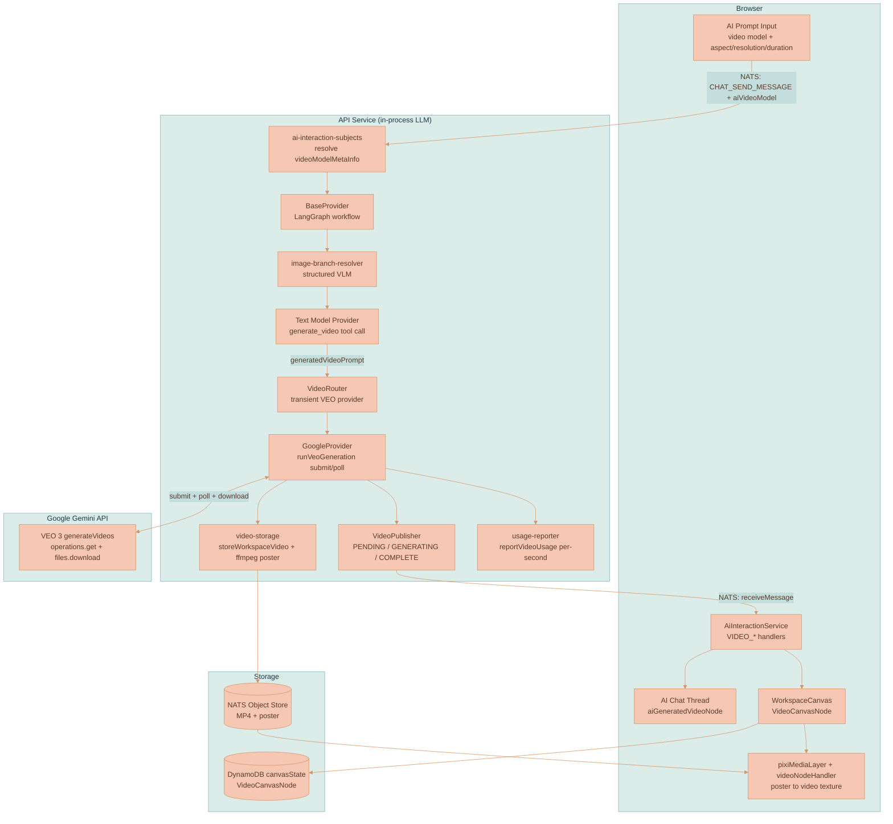
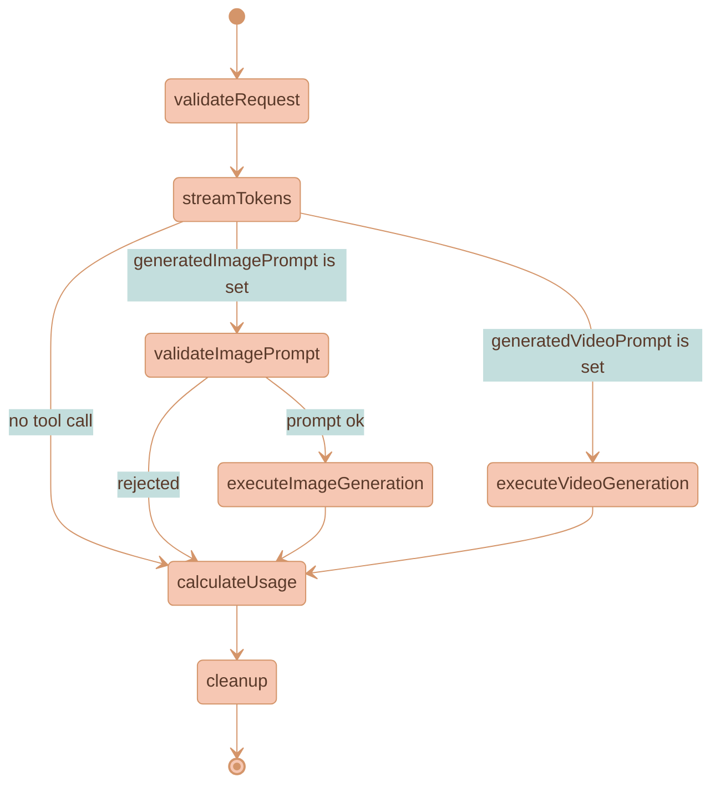

# Video Generation (Google VEO 3)

The platform generates short video clips with synchronized audio using the same dual-model architecture that powers [image generation](IMAGE-GENERATION.md). A **text model** (Claude, GPT, Gemini) analyzes the request, writes a cinematic enhanced prompt, and emits a `generate_video` tool call; the workflow routes that prompt to a selected **video model** (Google VEO 3 / 3.1) which produces an MP4. The finished clip lands on the workspace canvas as a new, playable `VideoCanvasNode` that can be piped into downstream AI threads as context — the same "artifact piping" the canvas provides for images.

Video **extends** the image pipeline rather than replacing it. It adds a sibling branch to the shared LangGraph workflow, a `generate_video` tool mirroring `generate_image`, a `VideoRouter` mirroring `ImageRouter`, and a `VideoPublisher` mirroring `ImagePublisher`. The one place it cannot mirror image generation is **execution**: VEO is long-running and asynchronous (submit → poll an operation until done, ≈11s–6min, with no partial frames), so the progressive `IMAGE_PARTIAL` streaming model is replaced by a placeholder + keepalive + `VIDEO_COMPLETE` model.

## Core Concepts

**Dual-Model Routing** — The user selects a text model and a video model independently. The text model receives the conversation (including any reference images), writes a comprehensive video prompt, and emits a `generate_video` tool call. The system routes that prompt to the selected video model via the `VideoRouter`.

**Opt-In Tool, No Auto-Select** — Unlike the image-model dropdown (which auto-selects a default), the Video-model dropdown stays on its "Video Model" placeholder until the user explicitly picks one. While `aiVideoModel` is empty, the `generate_video` tool is never injected, so existing text-only and image-only flows are unchanged. When both an image model and a video model are selected, **both tools are injected** and the text model chooses per intent (`generate_video` for motion/clips, `generate_image` for stills).

**Asynchronous Execution, Run In-Request** — `client.models.generateVideos(...)` returns an operation; the provider polls `client.operations.getVideosOperation(...)` until `operation.done`, then downloads the MP4. This submit+poll loop runs **synchronously inside the existing LangGraph request**, reusing the in-process model + `AbortController` + circuit breaker (`LLM_TIMEOUT_MS`, default 20 min). Because the request now occupies a worker for minutes with no token traffic, the poll loop publishes a `VIDEO_GENERATING` keepalive every `VEO_POLL_INTERVAL_MS` (default 10s) so the browser never looks frozen.

**VLM-Grounded References** — VEO's headline capability is character consistency via image-to-video. Video reuses the structured VLM resolver (`resolveImageBranch`) that image generation uses to answer "which connected pixels does *that character* mean?" The resolver's gate is generalized to run whenever an image **or** video model is selected, and its output is mapped onto VEO inputs.

**Inline PIXI Playback** — A finished video plays inline on the canvas as a PIXI texture, consistent with the "PIXI owns pixels" rule in [CANVAS-ENGINE.md](CANVAS-ENGINE.md). The backend extracts a poster frame (ffmpeg, frame 0); the canvas shows the poster until the user clicks the node, then swaps to a live, looping video texture.

**New `VideoCanvasNode` Type** — Generated videos persist as a new discriminated member of the `CanvasNode` union (`type: 'video'`), alongside `image`, `document`, `aiChatThread`, and `contextRegion`. There is no new database table — like images, video nodes live in the workspace `canvasState.nodes[]`, with MP4 + poster bytes in the NATS Object Store.

## System Architecture



## LangGraph State Machine

Every provider (Anthropic, OpenAI, Google) shares the same LangGraph workflow defined in `BaseProvider` (`services/api/src/llm/providers/base-provider.ts`). Image generation already added one conditional branch; video adds a second. After `streamTokens`, a single 3-way router (`routeAfterStream`) sends the request down the image branch, the video branch, or straight to usage.



`resolveFeatures` and `resolveImageBranch` run ahead of `streamTokens` (omitted above for clarity). Note that the video branch has **no** validate-prompt node — VEO prompts have no strict character limit, so unlike images there is no prompt-rewrite/validation step.

### State (`ProviderState`)

The video fields mirror the image fields and use the same "keep if undefined" channel reducers (`services/api/src/llm/graph/state.ts`). The VLM branch resolution is **shared** with image generation, so there is no separate video resolution field.

| Field | Type | Purpose |
|-------|------|---------|
| `enableVideoGeneration` | `boolean` | `true` when the provider is invoked as the video model by `VideoRouter` |
| `videoModelMetaInfo` | `AiModelMetaInfo` | Video model pricing + metadata (resolved by the gateway) |
| `videoModelVersion` | `string` | Selected video model id (e.g. `veo-3.0-generate-001`) |
| `videoProviderName` | `ProviderName` | Video model provider (`Google`) |
| `videoAspectRatio` | `string` | `16:9` \| `9:16` |
| `videoResolution` | `string` | `720p` \| `1080p` \| `4k` |
| `videoDurationSeconds` | `number` | `4` \| `6` \| `8` |
| `generatedVideoPrompt` | `string` | Enhanced prompt extracted from the text model's `generate_video` tool call |
| `videoFirstFrameImage` | `string` | VLM-selected first frame, as a data URL (image-to-video) |
| `videoReferenceImages` | `string[]` | VLM-selected style/content references (≤3) |
| `videoSourceForExtension` | `string` | `nats-obj://…` URI of a source MP4 to extend (multi-turn) |
| `generatedVideos` | `string[]` | Resulting video URLs/ids |
| `videoUsage` | `VideoUsage` | `{ durationSeconds, resolution, aspectRatio }` for billing |

### Workflow Nodes

**`streamTokens`** — Runs the text model. When a video model is selected, the `generate_video` tool is injected and `video_generation_instructions.txt` is appended to the system prompt. If the model emits a `generate_video` tool call, the provider sets `state.generatedVideoPrompt`.

**`routeAfterStream`** — The post-stream conditional. `generatedVideoPrompt` → `generate_video`; else `generatedImagePrompt` → `generate_image`; else `skip`. A video tool call takes precedence; the model normally emits at most one media tool call per turn.

**`executeVideoGeneration`** — Publishes `VIDEO_GENERATION_TRACE` (tool prompt + selected/excluded references) **before** running, so chat history can render the trace even if VEO later fails, then calls `runVideoRouter`. On error it publishes `VIDEO_ERROR` via the stream publisher.

**`calculateUsage`** — When `state.videoUsage` is present, calls `reportVideoUsage` (per-second pricing).

## End-to-End Flow

The user has a stylized fox character image on the canvas and wants it to move. They drag an edge from the fox image into an AI chat thread, select a text model **and** Veo 3, choose `16:9` / `720p` / `8s`, and type *"animate this fox trotting through soft falling snow, gentle ambient wind."*

```mermaid
%%{init: {'theme': 'base', 'themeVariables': { 'noteBkgColor': '#82B2C0', 'noteTextColor': '#1a3a47', 'noteBorderColor': '#5a9aad', 'actorBkg': '#F6C7B3', 'actorBorder': '#d4956a', 'actorTextColor': '#5a3a2a', 'actorLineColor': '#d4956a', 'signalColor': '#d4956a', 'signalTextColor': '#5a3a2a', 'labelBoxBkgColor': '#F6C7B3', 'labelBoxBorderColor': '#d4956a', 'labelTextColor': '#5a3a2a', 'loopTextColor': '#5a3a2a', 'activationBorderColor': '#9DC49D', 'activationBkgColor': '#9DC49D', 'sequenceNumberColor': '#5a3a2a'}}}%%
sequenceDiagram
    participant User
    participant Canvas as WorkspaceCanvas
    participant NATS
    participant TextModel as Text Model Provider
    participant Router as VideoRouter
    participant VEO as GoogleProvider (VEO)
    participant VeoApi as Google VEO API

    %% ═══════════════════════════════════════════════════════════════
    %% PHASE 1: REQUEST + VLM RESOLUTION
    %% ═══════════════════════════════════════════════════════════════
    rect rgb(220, 236, 233)
        Note over User, VeoApi: PHASE 1 - REQUEST — User submits with a video model; gateway resolves it, VLM grounds references
        User->>Canvas: "animate this fox…" + Veo 3, 16:9 / 720p / 8s
        activate Canvas
        Canvas->>NATS: CHAT_SEND_MESSAGE { aiVideoModel, video params, candidate snapshot }
        deactivate Canvas
        NATS->>TextModel: resolve videoModelMetaInfo, run resolveImageBranch (VLM)
        activate TextModel
        Note over TextModel: VLM picks the fox as first frame<br/>IMAGE_BRANCH_RESOLVED streamed to browser
    end

    %% ═══════════════════════════════════════════════════════════════
    %% PHASE 2: TEXT MODEL GENERATES ENHANCED PROMPT
    %% ═══════════════════════════════════════════════════════════════
    rect rgb(195, 222, 221)
        Note over User, VeoApi: PHASE 2 - TEXT MODEL — Writes a cinematic prompt and emits the generate_video tool call
        TextModel->>NATS: text chunks (enhanced prompt in <video_prompt> tags)
        TextModel->>TextModel: detect generate_video tool call → generatedVideoPrompt
        TextModel->>Router: executeVideoGeneration → runVideoRouter(state)
        deactivate TextModel
        activate Router
        Router->>NATS: VIDEO_GENERATION_TRACE
    end

    %% ═══════════════════════════════════════════════════════════════
    %% PHASE 3: VEO SUBMIT + POLL
    %% ═══════════════════════════════════════════════════════════════
    rect rgb(242, 234, 224)
        Note over User, VeoApi: PHASE 3 - VEO SUBMIT + POLL — Async generation with keepalive pings (no partial frames)
        Router->>VEO: transient provider, enableVideoGeneration
        activate VEO
        VEO->>NATS: VIDEO_PENDING
        NATS->>Canvas: placeholder VideoCanvasNode + traveling outline
        VEO->>VeoApi: generateVideos { prompt, image: fox, aspect/resolution/duration }
        activate VeoApi
        loop every VEO_POLL_INTERVAL_MS until operation.done
            VEO->>VeoApi: operations.getVideosOperation
            VEO->>NATS: VIDEO_GENERATING (keepalive)
        end
        VeoApi-->>VEO: operation.done → generatedVideos[0].video
        deactivate VeoApi
    end

    %% ═══════════════════════════════════════════════════════════════
    %% PHASE 4: STORE + COMPLETE
    %% ═══════════════════════════════════════════════════════════════
    rect rgb(246, 199, 179)
        Note over User, VeoApi: PHASE 4 - STORE + COMPLETE — Download, validate, ffmpeg poster, store, finalize
        VEO->>VEO: download MP4, validate ftyp, ffmpeg frame-0 poster
        VEO->>NATS: store MP4 + poster (Object Store), then VIDEO_COMPLETE
        deactivate VEO
        deactivate Router
        NATS->>Canvas: upgrade node → poster + MP4; remove outline
    end

    %% ═══════════════════════════════════════════════════════════════
    %% PHASE 5: PLAYBACK
    %% ═══════════════════════════════════════════════════════════════
    rect rgb(200, 220, 228)
        Note over User, VeoApi: PHASE 5 - PLAYBACK — Poster at rest; click swaps to a live looping texture
        User->>Canvas: click the video node
        activate Canvas
        Canvas->>Canvas: videoNodeHandler swaps poster → muted looping video texture
        deactivate Canvas
    end
```

## The `generate_video` Tool

### Definition

`generate_video` is defined in `services/api/src/llm/tools/video-generation.ts` and formatted per provider. Unlike `generate_image`, it has no per-model `maxChars` machinery — VEO prompts have no strict length limit.

| Provider | Format |
|----------|--------|
| OpenAI | `{ type: 'function', name, description, parameters }` |
| Anthropic | `{ name, description, input_schema }` |
| Google | `{ name, description, parameters }` (wrapped in a `FunctionDeclaration`) |

All share one schema — a single required `prompt` string:

```jsonc
{
  "type": "object",
  "properties": {
    "prompt": {
      "type": "string",
      "description": "A detailed, cinematic prompt for video generation…"
    }
  },
  "required": ["prompt"]
}
```

### Injection

The tool is injected into the text model's request only when:

```
injectVideoTool = hasVideoModel && !enableImageGeneration && !enableVideoGeneration
```

This prevents recursion — the transient VEO provider (and the transient image provider) never see the `generate_video` tool. Both `generate_image` and `generate_video` can be injected in the same turn; the model picks one.

### Extraction

After the text model completes, each provider extracts the tool call from its own response shape via `extractVideoToolCall(provider, response)`:

- **OpenAI** — scans `response.output[*]` for `type: 'function_call'`, `name: 'generate_video'`
- **Anthropic** — scans `finalMessage.content[*]` for `type: 'tool_use'`, `name: 'generate_video'`
- **Google** — iterates `response.candidates[*].content.parts[*].functionCall`

### System Prompt Enhancement

When a video model is selected, the text model's system prompt is augmented via `getSystemPrompt(…, includeVideoGeneration = true)`, which appends `prompts/video_generation_instructions.txt`. The instructions tell the model to:

1. **Always use the `generate_video` tool** for motion/clip/animation requests — never describe video in prose. When both a video and image model are available, pick the tool matching intent.
2. **Show the enhanced prompt** wrapped in `<video_prompt>…</video_prompt>` XML tags (explicitly *not* a blockquote or code block — a deliberate divergence from the image flow's `>` quote block) so the user sees exactly what is sent.
3. **Write like a film director** — cover subject + action, camera movement, setting + depth, lighting + color, mood/pacing/style, and audio. Prompts must be ≥120 words and describe one coherent continuous shot.
4. **Handle image-to-video** — when a reference is provided, begin with *"Animate the provided reference image as the first frame,"* then describe motion + camera while preserving the subject's identity.
5. **Specify audio explicitly** — VEO generates synchronized audio: spoken dialogue in double quotes with speaker + delivery, named sound effects, and optional music.

## VLM Reference Resolution

The structured VLM resolver (`services/api/src/llm/graph/image-branch-resolver.ts`) is shared with image generation. Its gate now runs when `imageModelVersion` **or** `videoModelVersion` is set, and it requires the browser-built `imageBranchCandidateSnapshot`. For video, the resolver's selected references are mapped onto VEO's mutually-exclusive inputs:

| Resolver outcome | VEO input |
|---|---|
| Target identified (edit / style-transfer / continuation) | `videoFirstFrameImage` → VEO `image` (first frame, image-to-video) |
| No target, references present | `videoReferenceImages` (≤3) → VEO `referenceImages` (`referenceType: 'style'`) |
| No references | neither set → text-to-video |

VEO's `image` (first frame) and `referenceImages` are **mutually exclusive** per the SDK, so the resolver populates exactly one path. The browser receives the same `IMAGE_BRANCH_RESOLVED` event it already understands for images.

## VEO Provider Path (Google)

`GoogleProvider.runVeoGeneration` (`services/api/src/llm/providers/google-provider.ts`) runs only when `enableVideoGeneration && modelNameImpliesVideoOutput` — a non-VEO Google model never enters this path. The existing image branch is untouched.

**Config** — `numberOfVideos: 1`, `generateAudio: true`, `personGeneration: 'allow_adult'`, plus `aspectRatio` / `resolution` / `durationSeconds` from state and the request's `abortSignal`.

**Input precedence** — exactly one conditioning input is sent, in this order:

1. **Extension** (`videoSourceForExtension`) → VEO `video`. The source MP4 bytes are read from the workspace Object Store (`fetchObjectStoreBytes`) and passed as base64. Extension is mutually exclusive with image/references per the API, and takes precedence.
2. **First frame** (`videoFirstFrameImage`) → VEO `image` (image-to-video).
3. **Reference images** (`videoReferenceImages`, ≤3) → VEO `referenceImages`.
4. **Text-to-video** — none of the above.

**Submit + poll** — `client.models.generateVideos(...)` returns an operation; the provider loops on `client.operations.getVideosOperation(...)` every `VEO_POLL_INTERVAL_MS`, publishing a `VIDEO_GENERATING` keepalive each tick and honoring the abort signal, until `operation.done`.

**Download** — `fetchVideoBytes` uses inline `videoBytes` (base64) when present, otherwise `client.files.download(...)` to a temp file. `VideoPublisher.complete` validates the MP4 (`ftyp` box) before storing; non-MP4 bytes throw.

**Poster** — `extractPosterFrame` shells `ffmpeg` to extract frame 0 as a PNG. It is **best-effort**: if ffmpeg is unavailable or fails, video generation still completes without a poster (the media layer falls back to decoding the MP4). `ffmpeg` is installed in the API container image.

## Storage & Durability

Video reuses the workspace bucket and the same content-hash dedup as images.

- **MP4** → `workspace-{workspaceId}-files/{fileId}` via `storeWorkspaceVideo` (`services/api/src/services/video-storage.ts`), a sibling of `storeWorkspaceImage` with SHA-256 content-hash dedup and `mimeType: 'video/mp4'`.
- **Poster** → stored as a normal workspace **image** via `storeWorkspaceImage`, so the existing `GET /api/images/...` route serves it for PIXI at low LoD.

**Self-healing dedup (durability).** In line with the NATS Object Store durability work (PR #208 / LIX-207, see [WORKSPACE-EXPORT.md](WORKSPACE-EXPORT.md)), the hash-dedup short-circuit only returns "duplicate" after confirming the bytes are actually present (`getObjectInfo`). If a hash is registered in `workspace.files` but its bytes are missing, `storeWorkspaceVideo` re-stores them so the dangling reference self-heals instead of returning a URL to lost bytes. Object-store reads/deletes are open-only and never auto-create a bucket.

**HTTP route** — `GET /api/videos/:workspaceId/:fileId` (`services/api/src/routes/video-routes.ts`) streams the MP4 with **HTTP Range support** (206 Partial Content) so HTML5 `<video>` / PIXI `VideoSource` can seek; it returns 404 when the object or bucket is missing. Authentication mirrors the image route (Bearer or `?token=`). The poster reuses `GET /api/images/...`.

**Deletion** — `workspace.video.delete` (`video-subjects.ts`) removes the MP4 from the Object Store and its `workspace.files` entry. On the canvas, `canvasVideoLifecycle.ts` tracks `VideoCanvasNode`s across state commits and, when one disappears, fires `deleteVideo(fileId, workspaceId, posterFileId)` — the MP4 via the video subject and the poster via the image-delete subject (the poster is a normal image). Workspace deletion cleans up video Media Library items by branching on `item.kind`.

## NATS Events

Video events reuse the per-thread receive subject `ai.interaction.chat.receiveMessage.{workspaceId}.{aiChatThreadId}`; only the `status` values are new (added to `packages/lixpi/constants/ai-interaction-constants.json`). `AiInteractionService` maps each status to a chat segment.

| Status | Payload | Browser segment | Purpose |
|--------|---------|-----------------|---------|
| `VIDEO_GENERATION_TRACE` | `{ videoGenerationTrace }` | `video_generation_trace` | Tool prompt + selected/excluded references (audit) |
| `VIDEO_PENDING` | — | `video_pending` | Create placeholder node + start traveling outline |
| `VIDEO_GENERATING` | — | `video_generating` | Keepalive ping during the poll loop |
| `VIDEO_COMPLETE` | `{ videoUrl, fileId, posterUrl, posterFileId, durationSeconds, aspectRatio, hasAudio, responseId, revisedPrompt, videoModelId, videoModelProvider }` | `video_complete` | Finalize node; PIXI renders poster |
| `VIDEO_ERROR` | `{ error }` | `video_error` | Surface failure; clean up |

One new subject group under `WORKSPACE_SUBJECTS` in `packages/lixpi/constants/nats-subjects.json`:

```jsonc
"VIDEO_SUBJECTS": { "DELETE_VIDEO": "workspace.video.delete" }
```

The `CHAT_SEND_MESSAGE` payload gains `aiVideoModel`, `videoAspectRatio`, `videoResolution`, `videoDuration`, and `videoSourceForExtension`. The gateway (`ai-interaction-subjects.ts`) resolves `aiVideoModel` (`Provider:model`) to `videoModelMetaInfo` and forwards the video params (coercing `videoDuration` to a number).

## Canvas Node & Playback

### `VideoCanvasNode`

A new member of the `CanvasNode` union (`packages/lixpi/constants/ts/types.ts`). No new table — it lives in `canvasState.nodes[]`.

| Field | Type | Purpose |
|-------|------|---------|
| `nodeId` | `string` | Stable canvas identity |
| `type` | `'video'` | Discriminant in `CanvasNode` / `CanvasNodeType` |
| `fileId` | `string` | MP4 object key in `workspace-{workspaceId}-files` |
| `posterFileId` | `string` | ffmpeg frame-0 poster (an image object key) |
| `workspaceId` | `string` | Deletion + bucket context |
| `src` | `string` | Tokenized MP4 URL (Range-capable video route) |
| `posterSrc` | `string` | Tokenized poster image URL (PIXI low-LoD) |
| `aspectRatio` | `number` | width / height (e.g. 16:9 → 1.778) |
| `durationSeconds` | `number` | `4` \| `6` \| `8` |
| `hasAudio` | `boolean` | VEO 3 generates audio by default |
| `position` / `dimensions` | `{x,y}` / `{w,h}` | Canvas geometry |
| `generatedBy` | `VideoGeneratedByMetadata?` | Provenance + branch lineage (mirrors `ImageGeneratedByMetadata`, adds `videoModel`, `resolution`, `durationSeconds`, `veoOperationName`, `sourceVideoNodeId`) |

### Playback (`videoNodeHandler.ts`)

The handler is registered through the `mediaNodeRegistry` and dispatched by `pixiMediaLayer`. The visible surface is owned by PIXI (a `Sprite` + rounded mask + dark `colorRect` placeholder); the DOM only hosts interaction chrome, matching the image DOM-shell pattern.

- A **detached `<video>` element** (created with `document.createElement`, never attached to the visible DOM — muted, `playsInline`, `loop`, `crossOrigin: 'anonymous'`) is the texture source. The visible pixels are always the PIXI sprite.
- On load, the **poster** texture is shown so the node is visible immediately without decoding the MP4.
- On **click**, the handler swaps the sprite to a live `Texture.from(videoElement)` and starts playback, driving repaints via `requestVideoFrameCallback` (falling back to `requestAnimationFrame`). **Pause** reverts to the poster.
- Intrinsic `videoWidth/Height` from `loadedmetadata` feeds aspect-correct sizing.

> **v1 scope.** Playback is **click-to-play**, not auto-play-on-focus. The off-screen-pause heuristics and a hard concurrent-player cap are intentionally **not** implemented yet — VEO clips are short (≤8s) and single-clip playback is the common case. The handler is structured so those refinements can land later without changing the registry contract.

### Lifecycle & bubble menu

On `VIDEO_PENDING`, `WorkspaceCanvas` (`setAiGeneratedVideoCallbacks`) drops a placeholder `VideoCanvasNode` near the source region with a traveling progress outline; on `VIDEO_COMPLETE` it upgrades the node to poster + MP4 with `generatedBy` lineage and removes the outline; on `VIDEO_ERROR` it cleans up. The in-chat `aiGeneratedVideoNode` mirrors the generated-image node, showing pending / keepalive / playable / error states while the `<video_prompt>` text streams. The canvas bubble menu exposes a `CANVAS_VIDEO_CONTEXT` with **Extend video in new thread**, **Connect** (shared with images), and **Delete video**.

## Model Sync & Pricing

`ai-models-synchronization.ts` makes VEO models discoverable:

- A new `video_generation` modality (`{ title: 'Video Generation', shortTitle: 'VID GEN' }`); VEO models carry modalities `['video', 'video_generation']`.
- `'veo'` removed from the Google blacklist; `fetchGoogleModels` allows VEO ids through (keeping `-preview` ids, dropping dated snapshots).
- Per-model option lists reused as `ImageSizeOption[]`: aspect `16:9` / `9:16`; resolution `720p` / `1080p` / `4K`; duration `4s` / `6s` / `8s`.
- **Per-second pricing** on `AiModel.pricing.video` (`{ measuringUnit: 'seconds', pricePer: '1', price }`). Current prices are **placeholders** to reconcile against [Gemini pricing](https://ai.google.dev/gemini-api/docs/pricing).
- Friendly titles: `veo-3.0-generate-001` → "Veo 3", `veo-3.0-fast-generate-001` → "Veo 3 Fast", `veo-3.1-generate-preview` → "Veo 3.1", etc.

The three frontend video dropdowns (`createGenericVideoAspectDropdown` / `…Resolution…` / `…Duration…` in `aiControls.ts`) read their options straight off the selected model's `videoAspectRatios` / `videoResolutions` / `videoDurations`. The options are **independent** — there is no dependent constraint (e.g. resolution does not force a duration). The Video-model dropdown filters models by the `video_generation` modality and is excluded from the text-model list.

## Usage Metering

`reportVideoUsage` (`services/api/src/llm/usage/usage-reporter.ts`) computes per-second cost: `pricePerSecond = pricing.video.price`, `resale = pricePerSecond × resaleMargin`, and `purchasedFor` / `soldToClientFor` over `durationSeconds`. It returns a `VideoUsageReport`.

> **Current limitation.** Video usage is **computed but not yet published to NATS** — the report is built and returned, with a `TODO` to wire a `usage.videos.ai` subject (token and image usage already publish). Per-second billing reconciliation depends on finalizing the placeholder VEO prices.

## Media Library (Video)

Videos are first-class Media Library items alongside images, reusing the same scope/access model and buckets ([MEDIA-LIBRARY.md](MEDIA-LIBRARY.md)). The item is `kind: 'video'`-discriminated (`MediaLibraryVideoItem`), carrying a separate `poster` asset reference so the panel renders a still without decoding the MP4.

| Subject | Handler |
|---------|---------|
| `workspace.mediaLibrary.video.createFromCanvas` | `copyWorkspaceVideoToLibrary` → `createVideoItem` (copies MP4 + optional poster into the library bucket) |
| `workspace.mediaLibrary.video.materializeToWorkspace` | `materializeLibraryVideoToWorkspace` (re-stores MP4 via `storeWorkspaceVideo`, poster via `storeWorkspaceImage`) |
| `workspace.mediaLibrary.get` | kind-discriminated; returns image or video meta |
| `workspace.mediaLibrary.changeScope` / `delete` | branch on `item.kind` |

## Multi-Turn Extension

A completed `VideoCanvasNode` can be continued: the bubble-menu **Extend video in new thread** action spawns a thread whose prompt-input node carries `sourceVideoNodeId`. At submit, `WorkspaceCanvas` builds an `nats-obj://workspace-{ws}-files/{fileId}` URI from the source node and sends it as `videoSourceForExtension`. The VEO provider loads those bytes and passes them as VEO's `video` (extension) input, which takes precedence over first-frame/reference inputs. The `generate_video` tool and provider code are unchanged — extension is driven entirely through state.

## Differences from Image Generation

| Aspect | Image generation | Video generation (VEO) |
|---|---|---|
| Execution | Synchronous / streaming | Async submit + poll, run in-request |
| Progress to UI | `IMAGE_PARTIAL` progressive previews | `VIDEO_PENDING` + `VIDEO_GENERATING` keepalive, no partial frames |
| Payload | base64 PNG/JPEG | multi-MB MP4 (validated by `ftyp`) |
| Prompt display | `>` quote block | `<video_prompt>…</video_prompt>` XML tags |
| Workflow node | `validateImagePrompt` → `executeImageGeneration` | `executeVideoGeneration` (no validate step) |
| Pricing | per-image tiers | per-second of video |
| HTTP route | whole-object GET | Range-capable GET (seeking) |
| Canvas playback | static texture | poster → click-to-play looping video texture |
| Model selection | auto-selects a default | opt-in (placeholder until chosen) |

## File Structure

```
services/api/src/
├── llm/
│   ├── providers/
│   │   ├── base-provider.ts          # routeAfterStream, executeVideoGeneration, VideoPublisher wiring
│   │   ├── google-provider.ts        # runVeoGeneration (submit/poll/download), VEO config + input precedence
│   │   ├── anthropic-provider.ts     # generate_video injection + extraction
│   │   ├── openai-provider.ts        # generate_video injection + extraction
│   │   └── provider-registry.ts      # runVideoRouter dep, storeWorkspaceVideo
│   ├── tools/
│   │   ├── video-generation.ts       # generate_video tool def + per-provider extractors
│   │   ├── video-router.ts           # VideoRouter — text model → transient VEO provider
│   │   └── video-generation-trace.ts # VIDEO_GENERATION_TRACE builder
│   ├── graph/
│   │   ├── state.ts                  # ProviderState video fields + VideoUsage
│   │   ├── video-publisher.ts        # VIDEO_PENDING/GENERATING/COMPLETE/ERROR, MP4 validation
│   │   ├── image-branch-resolver.ts  # VLM gate generalized to video; VEO ref mapping
│   │   └── stream-publisher.ts       # videoGenerationTrace()
│   ├── usage/usage-reporter.ts       # reportVideoUsage (per-second)
│   ├── config.ts                     # VEO_POLL_INTERVAL_MS
│   └── prompts/
│       ├── load-prompts.ts           # getSystemPrompt(includeVideoGeneration)
│       └── video_generation_instructions.txt
├── services/
│   ├── video-storage.ts              # storeWorkspaceVideo (self-healing dedup) + extractPosterFrame (ffmpeg)
│   └── media-library-storage.ts      # copy/materialize/scope video helpers
├── routes/video-routes.ts            # GET /api/videos/:ws/:fileId (Range)
├── NATS/subscriptions/
│   ├── video-subjects.ts             # workspace.video.delete
│   ├── ai-interaction-subjects.ts    # resolve videoModelMetaInfo + forward video params
│   └── media-library-subjects.ts     # createFromVideo / materializeVideo
└── workloads/functions/ai-models-synchronization/ai-models-synchronization.ts  # un-blacklist VEO, defaults, pricing

services/web-ui/src/
├── infographics/workspace/
│   ├── WorkspaceCanvas.ts            # VideoCanvasNode placement, lifecycle callbacks, extend-in-new-thread
│   ├── rendering/videoNodeHandler.ts # PIXI poster → click-to-play video texture
│   ├── canvasVideoLifecycle.ts       # delete MP4 + poster when a node disappears
│   ├── pixiMediaLayer.ts             # dispatch non-image nodes to the registry
│   └── canvasBubbleMenuItems.ts      # CANVAS_VIDEO_CONTEXT (extend / connect / delete)
├── components/proseMirror/plugins/
│   ├── primitives/aiControls/aiControls.ts             # video model + aspect/resolution/duration dropdowns
│   ├── aiPromptInputPlugin/aiPromptInputNode.ts        # video attrs + submit payload
│   └── aiChatThreadPlugin/aiGeneratedVideoNode.ts      # in-chat pending/playable/error states
├── services/
│   ├── ai-interaction-service.ts     # VIDEO_* handlers → chat segments
│   └── ai-prompt-input-controller.ts # thread video attrs on submit
└── utils/videoUtils.ts               # deleteVideo (MP4 + poster)

packages/lixpi/constants/
├── ts/types.ts                       # VideoCanvasNode, VideoGeneratedByMetadata, MediaLibraryVideoItem, AiModel video fields + pricing.video
├── ai-interaction-constants.json     # VIDEO_* statuses
└── nats-subjects.json                # VIDEO_SUBJECTS + video Media Library subjects
```

## References

### Vendor docs (Google)
- VEO 3 video generation: https://ai.google.dev/gemini-api/docs/video
- VEO dialogue example: https://ai.google.dev/gemini-api/docs/video?example=dialogue
- Veo 3.1 announcement: https://developers.googleblog.com/introducing-veo-3-1-and-new-creative-capabilities-in-the-gemini-api/
- Gemini API pricing: https://ai.google.dev/gemini-api/docs/pricing

### Internal Lixpi docs
- [IMAGE-GENERATION.md](IMAGE-GENERATION.md) — the dual-model + tool-calling pipeline video extends
- [IMAGE-BRANCH-LINEAGE.md](IMAGE-BRANCH-LINEAGE.md) — the structured VLM resolver reused for first-frame + references
- [MEDIA-LIBRARY.md](MEDIA-LIBRARY.md) — scope/ownership model reused for video items
- [CANVAS-ENGINE.md](CANVAS-ENGINE.md) — PIXI media layer, LoD, and the "PIXI owns pixels" rule
- [WORKSPACE-EXPORT.md](WORKSPACE-EXPORT.md) — Object Store durability context for stored media
- [PRODUCT-OVERVIEW.md](../PRODUCT-OVERVIEW.md) — product thesis (image + video pipelines)
