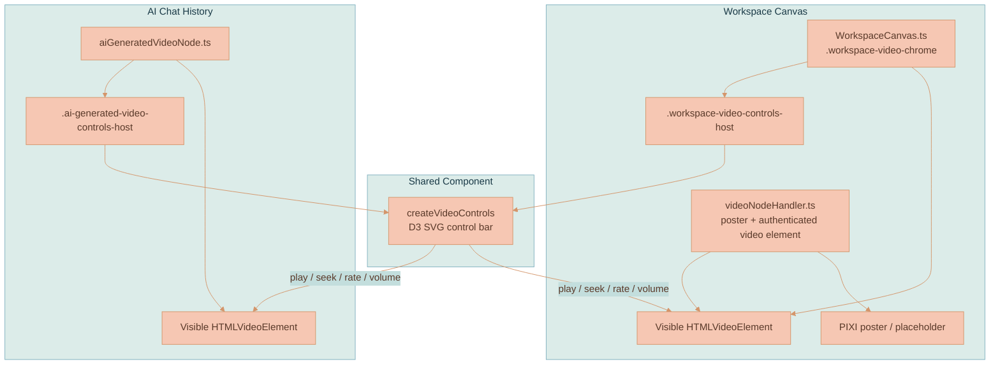

# Video Player Controls

Lixpi uses one shared SVG video control bar for generated and saved videos. The control bar is a framework-agnostic D3 primitive in `services/web-ui/src/components/videoControls/`, mounted in two places:

- over canvas `VideoCanvasNode`s in the transformed workspace chrome layer
- inside in-chat generated video nodes in the ProseMirror AI chat history

The bar controls an `HTMLVideoElement`; it does not render video frames. The host surface owns pixels. On the canvas, PIXI owns the poster/placeholder behind the node and the browser-composited `<video>` element owns completed playback. In chat, the same component controls the visible DOM `<video>`.

For video generation, storage, VEO polling, and branch lineage, see [VIDEO-GENERATION.md](VIDEO-GENERATION.md). For canvas renderer ownership, see [CANVAS-ENGINE.md](CANVAS-ENGINE.md).

## Core Concepts

**Shared SVG Control Bar** - `createVideoControls(parent, config)` appends an SVG `<g>` into a D3 selection and returns `{ render, resize, destroy }`. It follows the same framework-agnostic pattern as `slidingSwitch.ts` and `toggleSwitch.ts`.

**Single Source of Truth** - The supplied `HTMLVideoElement` is the state authority. The control bar reads media events and writes element properties such as `currentTime`, `playbackRate`, `volume`, and `muted`.

**Two Mount Points** - `WorkspaceCanvas.ts` mounts the bar in `.workspace-video-controls-host` for canvas videos. `aiGeneratedVideoNode.ts` mounts the same bar in `.ai-generated-video-controls-host` for chat-history videos.

**Browser-Composited Canvas Playback** - The canvas does not sample a live video texture into PIXI. `videoNodeHandler.ts` creates the authenticated video element and loads the PIXI poster. `WorkspaceCanvas.ts` moves that same element into `.workspace-video-chrome`, above the poster, so browser playback, seeking, PiP, and fullscreen work normally.

**Ephemeral Playback State** - Playback position, speed, volume, PiP, fullscreen, hover visibility, and scrubbing state are not persisted to `canvasState`.

## Control Set

| Control | Behavior |
|---------|----------|
| Play / pause | Calls `videoEl.play()` or `videoEl.pause()` and reflects `play` / `pause` events |
| Skip back / forward | Moves `currentTime` by `skipSeconds` (default `10`) within duration bounds |
| Current time / duration | Renders `m:ss`; duration stays `0:00` until metadata is loaded |
| Scrubber | Shows buffered and played ranges; dragging seeks the element |
| Playback speed | Opens a rate menu, default `[0.5, 0.75, 1, 1.25, 1.5, 2]` |
| Volume / mute | Toggles `muted`; slider writes `volume` and reflects `volumechange` |
| Picture-in-picture | Uses `requestPictureInPicture()` when supported; hidden otherwise |
| Fullscreen | Uses `requestFullscreen()` / `exitFullscreen()` when supported; hidden otherwise |

The layout is responsive. Skip buttons, PiP, fullscreen, and the volume slider hide when the available width is too small. Unsupported browser capabilities hide rather than error.

## Component API

```typescript
export type VideoControlsConfig = {
    id: string
    x: number
    y: number
    width: number
    height?: number
    videoEl: HTMLVideoElement
    skipSeconds?: number
    playbackRates?: number[]
    className?: string
}

export type VideoControlsInstance = {
    render: () => void
    resize: (x: number, y: number, width: number) => void
    destroy: () => void
}
```

`render()` re-syncs SVG state from the element. `resize()` updates bar geometry after canvas node resize or chat player resize. `destroy()` removes SVG nodes, media listeners, document listeners, pointer listeners, and in-flight scrub handlers.

## System Architecture



## Canvas Playback Flow

`videoNodeHandler.ts` creates one `<video preload="metadata" playsinline crossorigin="anonymous">` per `VideoCanvasNode`, loads authenticated `/api/videos` URLs, applies the poster URL, and keeps intrinsic video dimensions available to the canvas. The element begins in `.workspace-hidden-video-host`.

When the video node is playable, `WorkspaceCanvas.ts` creates `.workspace-video-chrome`, moves that same element into `.workspace-video-surface`, and mounts `createVideoControls(...)` in `.workspace-video-controls-host`.

The chrome mirrors normal node interactions:

- pointer movement over the video surface reveals the controls
- leaving the surface schedules a short hide delay so moving between video and controls does not flicker
- double-clicking the surface toggles playback
- pointer down outside the controls starts node drag or corner resize
- pointer events inside `.workspace-video-controls-host` are isolated from drag/resize/selection

This is why the video element must be visibly composited. Browser playback and native APIs are reliable only when the real element is rendered; a hidden element sampled into a PIXI texture can be throttled or blank.

## Chat Playback Flow

`aiGeneratedVideoNode.ts` keeps its pending, keepalive, complete, and error states. On completion it renders a native-controls-disabled `<video>` and overlays the same `createVideoControls(...)` bar at the bottom. A `ResizeObserver` keeps the SVG `viewBox` and control geometry in sync with the chat card width.

The chat video has no PIXI involvement. The same component still works because all state lives on the supplied `HTMLVideoElement`.

## Scrubbing Behavior

Scrubbing is designed to keep paused frames responsive:

1. Pointer down on the scrubber records whether playback was active.
2. If the video was playing, the control pauses it for the drag.
3. Drag movement updates a preview time and queues `videoEl.currentTime`.
4. Only one seek is kept in flight; later drag targets are applied after the current seek settles.
5. `seeked` / `loadeddata` or a short failsafe timer advances the queue.
6. On release, the final target is applied and playback resumes only if the video had been playing before the drag.

This avoids piling many seeks onto short VEO clips while still making paused scrubbing feel immediate.

## Accessibility and Capability Handling

Buttons are SVG groups with `role="button"`, `tabindex="0"`, and `aria-label`s. Enter and Space activate button controls. The speed picker also supports Enter/Space and closes on outside pointer down.

PiP and fullscreen controls are gated by browser support:

- PiP requires `document.pictureInPictureEnabled` and `videoEl.requestPictureInPicture`
- fullscreen requires `videoEl.requestFullscreen` and `document.exitFullscreen`

If a capability is missing or the bar is too narrow, that control is hidden. Failures from `play()`, PiP, fullscreen, or resume-after-scrub are logged as warnings without breaking the rest of the bar.

## Styling

The component inlines SVG attributes rather than relying on global CSS, matching the existing D3 control primitives. It uses a translucent dark rounded bar, white glyphs, subtle hover fills, a buffered rail, a played rail, and a compact speed popup.

Canvas visibility and positioning are controlled by host elements:

| Host | Purpose |
|------|---------|
| `.workspace-video-chrome` | Full video overlay surface above the PIXI poster |
| `.workspace-video-surface` | Holds the visible canvas `<video>` element |
| `.workspace-video-controls-host` | Mounts the canvas SVG bar and auto-hide visibility class |
| `.ai-generated-video-controls-host` | Mounts the in-chat SVG bar |

## Data, Storage, and Transport

Video controls add no persisted data model, NATS subject, API route, Object Store object, or LangGraph state. They operate entirely on an already-loaded `HTMLVideoElement`.

`VideoCanvasNode` remains the persisted canvas data for videos. Playback UI state is deliberately ephemeral.

## Implementation Map

| Area | File |
|------|------|
| Shared control component | [videoControls.ts](../../services/web-ui/src/components/videoControls/videoControls.ts) |
| Component barrel | [index.ts](../../services/web-ui/src/components/videoControls/index.ts) |
| SVG glyphs | [svgIcons/index.ts](../../services/web-ui/src/svgIcons/index.ts) |
| Canvas video element + poster handler | [videoNodeHandler.ts](../../services/web-ui/src/infographics/workspace/rendering/videoNodeHandler.ts) |
| Canvas chrome mount and auto-hide | [WorkspaceCanvas.ts](../../services/web-ui/src/infographics/workspace/WorkspaceCanvas.ts) |
| In-chat video mount | [aiGeneratedVideoNode.ts](../../services/web-ui/src/components/proseMirror/plugins/aiChatThreadPlugin/aiGeneratedVideoNode.ts) |
| Control tests | [videoControls.test.ts](../../services/web-ui/src/components/videoControls/videoControls.test.ts) |
| Canvas source-shape coverage | [workspace-canvas.test.ts](../../services/web-ui/src/infographics/workspace/workspace-canvas.test.ts) |
| Local canvas README | [README.md](../../services/web-ui/src/infographics/workspace/README.md) |

## References

- [VIDEO-GENERATION.md](VIDEO-GENERATION.md) - generated video lifecycle and playback surface
- [CANVAS-ENGINE.md](CANVAS-ENGINE.md) - DOM/PIXI renderer ownership
- [WORKSPACE-FEATURE.md](WORKSPACE-FEATURE.md) - video canvas nodes
- [MEDIA-LIBRARY.md](MEDIA-LIBRARY.md) - saved videos and materialization
