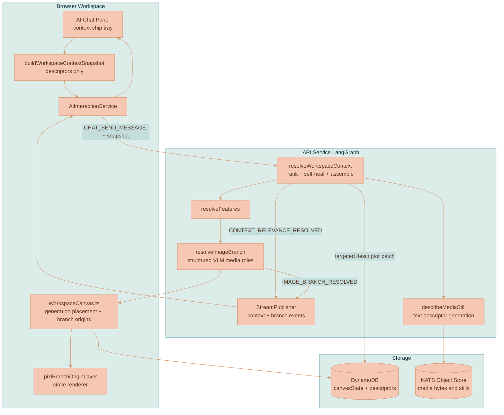
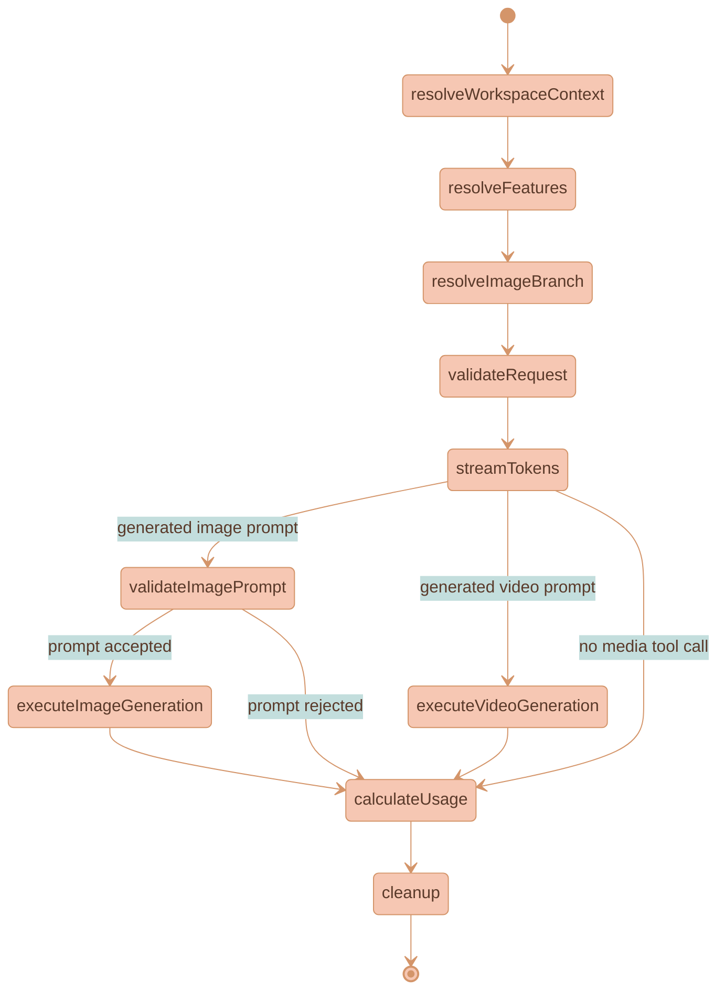

# Workspace Context Relevance and Branch Origins

Workspace context relevance makes the AI Chat panel workspace-aware without reviving context-region clouds. Every chat turn sends the API a compact, descriptors-only index of the current canvas. The API ranks that index, force-includes explicit chips and edge-connected nodes, repairs weak descriptors once when needed, and assembles only the selected content into the model request.

Branch origins preserve generation provenance after the old cloud primitive was removed. A new generated branch gets one persisted `branchOrigin` canvas node that stores the starting prompt and original references. The circle is an entry point and provenance marker, not a chat owner.

This feature sits between the workspace canvas, [AI Chat Workspace Sessions](AI-CHAT-WORKSPACE-SESSIONS.md), [Media Descriptors](MEDIA-DESCRIPTORS.md), and [Image Branch Lineage](IMAGE-BRANCH-LINEAGE.md). It replaces the live context-region system; historical cloud rendering samples live only in the [context-region archive](../knowledge/archive/context-region-clouds/README.md).

## Core Concepts

**Content Descriptor** - A short summary plus entity/style tags stored on every context-bearing canvas node: images, videos, documents, and AI chat thread nodes. `MediaDescriptor` remains an alias for media nodes, but the shared shape is `ContentDescriptor`.

**Context Chip** - A persisted explicit force-include in the AI Chat panel. Chips live in `CanvasState.aiChatPanel.contextChips`, render above the composer, and are removable by the user.

**Auto Chip** - An ephemeral chip created from `CONTEXT_RELEVANCE_RESOLVED`. Auto chips show what the relevance engine selected. They are visually distinct from explicit chips and can be removed from the current turn surface.

**Workspace Context Snapshot** - A browser-built descriptors-only request payload. It indexes context-bearing nodes with descriptor status, summary/tags, media object references, branch IDs, and force-include flags. It never embeds pixels.

**Workspace Context Resolution** - The API relevance result. It contains selected node IDs, selection roles (`forced-chip`, `forced-edge`, `auto`), rationales, improved descriptors, and the narrowed media node set that downstream image/video branch routing sees.

**Branch-Origin Node** - A persisted `branchOrigin` canvas node for one generated branch birth. It stores `branchId`, starting prompt, reference node IDs/file IDs, position, dimensions, and creation time. It renders as a small circle at the branch start.

**Placement Anchor** - A media node that can help place a fresh/reference-only generation on the canvas without becoming lineage. Placement anchors and reference IDs are context. They do not create connector parentage.

**Lineage Source** - A verified connector source for a generated output. Only a chat thread root or a real generated branch continuation can become the parent edge. Reference/style images cannot become lineage parents by themselves.

## Why This Exists

The removed context-region cloud combined three jobs: visual grouping, chat ownership, and generation provenance. That made the bubble a cage. A user had to gather items into a region or manually pin them before the AI could use them, even when another canvas item was obviously relevant.

Sending the whole canvas as pixels does not scale either. The image/video branch resolver is intentionally pixel-grounded and expensive per candidate. Workspace relevance does the cheap narrowing first using descriptors, then lets `resolveImageBranch` remain the visual authority for media that actually reaches the image/video model.

The design keeps three boundaries clear:

- Explicit chips and edge-connected nodes are always included.
- Automatic relevance can add context, but it cannot remove forced context.
- Pixel role assignment stays in `resolveImageBranch`; workspace relevance only narrows candidates and assembles selected content.

## Product Principles

- **Descriptors are the reduction.** Relevance ranks compact text metadata first; full content and pixels are resolved only for selected nodes.
- **Explicit context is sacred.** Context chips and edge-forced nodes are force-included on every turn.
- **Automatic context is visible.** Auto-selected nodes appear as removable auto chips, not invisible prompt material.
- **One pixel authority.** The workspace relevance stage never decides target/style/reference visual roles for media. The structured VLM branch resolver does that.
- **References are context, not lineage.** Reference, style, and relevance-selected media may affect prompt routing and placement, but they do not become connector parents unless the resolver verifies a real continuation.
- **Branch origins record births only.** A branch-origin circle stores prompt and references for a new branch. Continuations attach to the existing branch and do not create another origin.
- **Context regions are gone.** Live code should not depend on `contextRegion` nodes, region sessions, cloud settings, or context-region subjects.

## System Architecture



## LangGraph Workflow

`resolveWorkspaceContext` is the first shared graph node. It runs for text, image, and video turns. `resolveImageBranch` still runs after feature resolution and is a no-op when no image/video model is selected.



## Relevance Resolver Behavior

The resolver is descriptor-first and bounded:

1. **Rank.** A text-capable resolver model receives the prompt plus `WorkspaceContextSnapshot`. It returns selected node IDs, short rationales, and nodes that need better descriptors.
2. **Self-heal once.** Missing, failed, analyzing, or too-thin descriptors are repaired within the same turn. Media uses `describeMediaStill`; documents and threads use text descriptor generation. The API persists improved descriptors through a targeted node-descriptor patch and re-ranks once.
3. **Force-include.** Explicit chip IDs and edge-connected IDs are unioned into the result as `forced-chip` and `forced-edge`.
4. **Publish.** The API emits `CONTEXT_RELEVANCE_RESOLVED` with selections, improved descriptors, and `narrowedMediaNodeIds`. On failure it emits `CONTEXT_RELEVANCE_ERROR` and the graph error path closes the stream visibly.
5. **Assemble.** Full content for selected nodes is inserted into `state.messages`. Documents and threads resolve from stored ProseMirror content. Media resolves through Object Store URLs and stills. The narrowed media set feeds `imageBranchCandidateSnapshot`.

The stage can improve recall on text-only turns as well as media turns. For "summarize my canvas," it can select salient docs, threads, images, and videos without invoking pixel branch routing.

## Context Chips

The AI Chat panel owns the context tray. Opening the panel creates no session and no hidden canvas node. The first submit creates a standalone `AiChatThread` only when a prompt is sent.

Explicit chips are persisted in `CanvasState.aiChatPanel.contextChips`. Selecting canvas nodes while the panel is open can add new eligible nodes as chips. Deleted nodes and duplicate IDs are sanitized out of panel state. `branchOrigin` nodes are not eligible as chips; clicking one seeds the panel with its stored references instead.

Auto chips are derived from the latest relevance resolution. They are not persisted. Removing an auto chip removes it from the visible turn context; the engine may select it again on a later turn if it is still relevant.

## Descriptor Model

`ContentDescriptor` is the shared descriptor contract. Images and videos keep `MediaDescriptor` as an alias, but documents and AI chat thread nodes also carry descriptors so the workspace relevance engine can rank all context-bearing nodes uniformly.

```typescript
export type ContentDescriptor = {
    status: 'analyzing' | 'ready' | 'failed'
    summary: string
    entityTags: string[]
    styleTags: string[]
    source: 'generation' | 'analysis'
    version: string
    updatedAt: number
}

export type MediaDescriptor = ContentDescriptor
```

Generated media descriptors are composed for free from branch resolver summaries and tags. Uploaded media gets one VLM caption over a still. Documents and threads get text summaries from their content and transcript.

## Data Contracts

The shared contracts live in [types.ts](../../packages/lixpi/constants/ts/types.ts).

```typescript
export type WorkspaceContextNode = {
    nodeId: string
    type: CanvasNodeType
    referenceId?: string
    descriptorStatus?: ContentDescriptorStatus
    title?: string
    descriptorSummary?: string
    entityTags?: string[]
    styleTags?: string[]
    fileId?: string
    imageUrl?: string
    branchId?: string
    isExplicitChip: boolean
    isEdgeForced: boolean
}

export type WorkspaceContextSnapshot = {
    resolverVersion: string
    workspaceId: string
    threadId: string
    promptText: string
    nodes: WorkspaceContextNode[]
}

export type WorkspaceContextSelection = {
    nodeId: string
    role: 'forced-chip' | 'forced-edge' | 'auto'
    rationale?: string
}

export type WorkspaceContextResolution = {
    resolverVersion: string
    selections: WorkspaceContextSelection[]
    improvedDescriptors?: Record<string, ContentDescriptor>
    narrowedMediaNodeIds: string[]
}
```

`BranchOriginCanvasNode` is a normal canvas node persisted inside `canvasState.nodes[]`.

```typescript
export type BranchOriginCanvasNode = CanvasNodeParentingFields & {
    nodeId: string
    type: 'branchOrigin'
    branchId: string
    prompt: string
    referenceNodeIds: string[]
    referenceFileIds: string[]
    position: CanvasNodePosition
    dimensions: CanvasNodeDimensions
    createdAt: number
}
```

## Generated Media Placement and Lineage

Standalone AI Chat panel generations no longer require a source `aiChatThread` canvas node. The canvas records pending generated-media placement by thread ID, inserts transparent placeholders from empty `IMAGE_PARTIAL` events, and upgrades those placeholders on `IMAGE_COMPLETE`. Cleanup waits until final placement, branch-origin state, and generated metadata are committed.

Generated media state separates three concepts:

| Field | Meaning |
|-------|---------|
| `sourceNodeId` | Real connector and lineage source only. |
| `placementAnchorNodeId` | Canvas placement helper only. |
| `referenceNodeIds` | Context/reference media for progress outlines, prompt routing, and branch-origin provenance. |

This split prevents relevance-selected or style/reference media from drawing false parent edges into generated outputs.

Style-transfer continuations can still continue a branch. A connector is allowed when the resolver is continuing an existing generated branch target or parent. Accepted continuation signals are `mode === 'edit-active-branch'`, `operationKind === 'edit_existing'`, or a resolver `branchId` matching the generated target node's `generatedBy.branchId`.

Fresh/reference-only outputs use the combined bounds of all reference media plus `settings.imageBranchLineage.rootOutputGap` for placement breathing room. True edit continuations still place from the verified lineage parent.

## Branch-Origin Circles

When a new `branchId` is minted, the canvas persists exactly one `branchOrigin` node and creates an edge from that origin to the first generated output. Continuations attach to the existing branch and do not create new origins.

The circle is placed at the start of the generated output using `settings.branchOrigin.outputGap`. It is rendered by `pixiBranchOriginLayer.ts` with viewport-synced PIXI world transforms, offscreen culling, and bounded pulse animation. A transparent DOM proxy handles hit testing, selection, dragging, and the click action.

Clicking the circle opens the AI Chat panel, adds its stored references as explicit context chips, and seeds the composer draft with the stored starting prompt. The info affordance shows the prompt and reference thumbnails using the same provenance/info-panel styling family as media nodes.

## Progress Outlines

While generation is preparing, selected/reference media can animate with the same PIXI traveling outline used by the generated placeholder. This makes the active context visible before the first real partial arrives.

Reference outlines clear as soon as the first non-empty image partial arrives, and generated-output outlines clear on completion or error. Video generation follows the same placement, lineage, branch-origin, and outline rules as image generation, using `VIDEO_PENDING`, `VIDEO_GENERATING`, and `VIDEO_COMPLETE` instead of progressive image partials.

## Context-Region Removal

The live product no longer has:

- `contextRegion` in `CanvasNode`
- `ContextRegionCanvasNode`
- `settings.contextRegion`
- `workspace.contextRegion.delete`
- context-region session kind
- context-region cloud renderer wiring
- `Follow`, `Pinned`, or `With Sources` panel controls

Old workspaces with stale `contextRegion` nodes are skipped by an inert renderer guard. There is no migration or compatibility behavior beyond that guard.

Recovery-grade implementation notes and archived renderer samples live under [documentation/knowledge/archive/context-region-clouds](../knowledge/archive/context-region-clouds/README.md). There is no live context-region feature page.

## Current Implementation Map

| Area | File |
|------|------|
| Shared contracts | [types.ts](../../packages/lixpi/constants/ts/types.ts) |
| Panel state | [aiChatPanelState.ts](../../services/web-ui/src/infographics/workspace/aiChatPanelState.ts) |
| Snapshot builders | [ai-image-branching.ts](../../services/web-ui/src/services/ai-image-branching.ts) |
| Workspace relevance resolver | [workspace-context-resolver.ts](../../services/api/src/llm/graph/workspace-context-resolver.ts) |
| Shared LangGraph workflow | [base-provider.ts](../../services/api/src/llm/providers/base-provider.ts) |
| Provider state channels | [state.ts](../../services/api/src/llm/graph/state.ts) |
| Stream events | [stream-publisher.ts](../../services/api/src/llm/graph/stream-publisher.ts) |
| Browser stream handling | [ai-interaction-service.ts](../../services/web-ui/src/services/ai-interaction-service.ts) |
| Descriptor generation | [media-descriptor.ts](../../services/api/src/llm/media-descriptor.ts), [media-descriptor-subjects.ts](../../services/api/src/NATS/subscriptions/media-descriptor-subjects.ts), [media-descriptor-service.ts](../../services/web-ui/src/services/media-descriptor-service.ts) |
| Canvas placement and branch origins | [WorkspaceCanvas.ts](../../services/web-ui/src/infographics/workspace/WorkspaceCanvas.ts) |
| Branch-origin rendering | [branchOrigins.ts](../../services/web-ui/src/infographics/workspace/rendering/branchOrigins.ts), [pixiBranchOriginLayer.ts](../../services/web-ui/src/infographics/workspace/rendering/pixiBranchOriginLayer.ts) |
| Viewport bridge | [viewportBridge.ts](../../services/web-ui/src/infographics/workspace/rendering/viewportBridge.ts) |

## References

- [AI-CHAT-WORKSPACE-SESSIONS.md](AI-CHAT-WORKSPACE-SESSIONS.md) - panel sessions and context tray
- [IMAGE-BRANCH-LINEAGE.md](IMAGE-BRANCH-LINEAGE.md) - structured VLM media role assignment
- [IMAGE-GENERATION.md](IMAGE-GENERATION.md) - image tool routing and streaming
- [VIDEO-GENERATION.md](VIDEO-GENERATION.md) - video generation and VEO references
- [MEDIA-DESCRIPTORS.md](MEDIA-DESCRIPTORS.md) - descriptor lifecycle
- [WORKSPACE-FEATURE.md](WORKSPACE-FEATURE.md) - canvas data model and user flows
- [CANVAS-ENGINE.md](CANVAS-ENGINE.md) - DOM/PIXI rendering ownership
