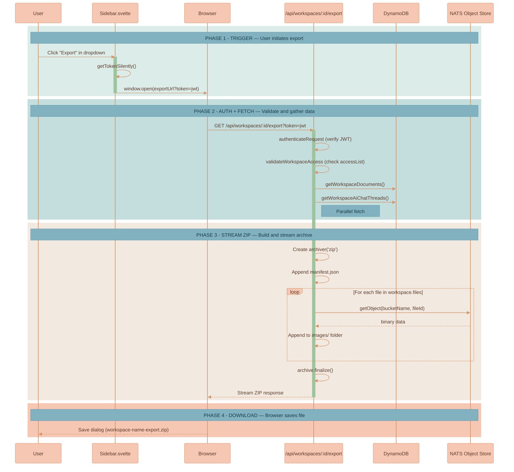
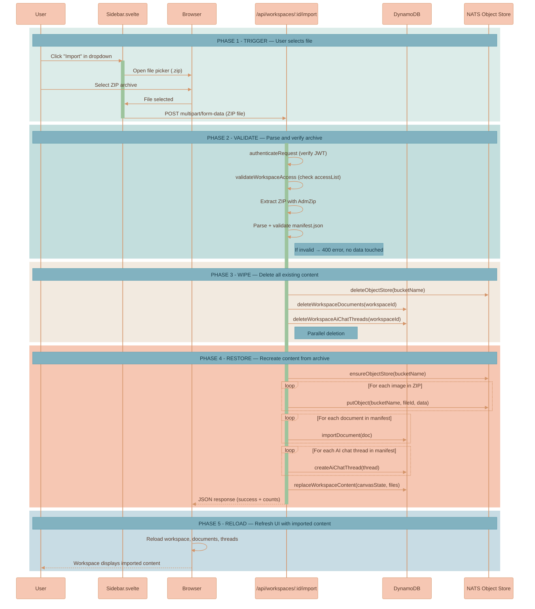

# Workspace Export & Import

Export a complete workspace backup as a downloadable ZIP archive, or import a previously exported archive to replace all content in an existing workspace.

## Overview

The export is triggered from the workspace dropdown menu in the sidebar. It streams a ZIP archive directly from the API to the browser — no temporary files are written to disk.

**Endpoint**: `GET /api/workspaces/:workspaceId/export`
**Route file**: `services/api/src/routes/workspace-export-routes.ts`
**UI trigger**: "Export" item in `Sidebar.svelte` dropdown menu

## Export Contents

The ZIP archive has the following structure:

```
workspace-export.zip
├── manifest.json          # Workspace metadata + all text content
└── images/                # Binary image files from NATS Object Store
    ├── {fileId}.png
    ├── {fileId}.jpg
    └── ...
```

**manifest.json** contains:

```typescript
{
    exportVersion: 1,
    exportedAt: string,                // ISO 8601 timestamp
    workspace: {
        workspaceId: string,
        name: string,
        canvasState: CanvasState,       // Viewport, nodes, edges
        files: DocumentFile[],          // File metadata (id, name, mimeType)
        createdAt: number,
        updatedAt: number,
    },
    documents: Document[],             // All documents (latest revisions)
    aiChatThreads: AiChatThread[],     // All AI chat threads with messages
}
```

## Export Flow



## Implementation Details

- **Streaming**: The ZIP is streamed directly to the HTTP response using the `archiver` npm package — no temporary files are written to disk.
- **Auth**: Supports JWT via query parameter (`?token=`) since the download is triggered via `window.open()`, which cannot set Authorization headers. Also supports `Authorization: Bearer` header.
- **File naming**: Images are stored as `images/{fileId}{extension}` where the extension is derived from the file's MIME type or original filename.
- **Error handling**: Individual image fetch failures are logged but don't abort the export — the manifest and remaining images are still included.
- **Compression**: Uses zlib level 5 (balanced speed/size).

## Dependencies

| Package | Purpose |
|---------|---------|
| `archiver` | ZIP archive creation and streaming |
| `@types/archiver` | TypeScript types (dev) |

---

# Workspace Import

Import a previously exported ZIP archive into an existing workspace, replacing all current content. The import wipes documents, AI chat threads, and images, then restores everything from the archive — keeping workspace identity (ID, name, access list) intact.

## Overview

The import is triggered from the workspace dropdown menu in the sidebar. It opens a file picker for the user to select a `.zip` archive. The file is uploaded to the API, which validates the archive, wipes the workspace content, and restores from the manifest.

**Endpoint**: `POST /api/workspaces/:workspaceId/import`
**Route file**: `services/api/src/routes/workspace-export-routes.ts`
**UI trigger**: "Import" item in `Sidebar.svelte` dropdown menu

## Import Strategy

The import follows a **validate-first, wipe, replace** approach:

1. **Parse** — Extract the ZIP and read `manifest.json` entirely in memory
2. **Validate** — Check export version, required fields, document/thread arrays. If invalid, return 400 — no data is touched
3. **Wipe** — Delete all existing content in parallel: NATS Object Store bucket (all images), DynamoDB documents, DynamoDB AI chat threads
4. **Restore** — Recreate images, documents, AI chat threads, and update workspace canvas state + files array from the manifest

This ensures no garbage is left behind. The NATS bucket is deleted entirely (not individual objects), which guarantees a clean slate for images. Documents and threads are queried by `workspaceId` and each record is deleted individually.

## Import Behavior

- **Workspace identity preserved**: The workspace's ID, name, `accessType`, and `accessList` remain unchanged. Only content (canvas state, documents, threads, images) is replaced.
- **Document IDs preserved**: Original document IDs from the export are reused so canvas node references (which store document IDs) remain valid without remapping.
- **`workspaceId` overridden**: Documents and threads from the manifest receive the target workspace's ID — an export from one workspace can be imported into a different workspace.
- **Cross-workspace import**: Since `workspaceId` is overridden, a user can export from workspace A and import into workspace B.

## Import Flow



## Implementation Details

- **In-memory extraction**: The ZIP is buffered by `multer` and extracted with `adm-zip` — no temporary files on disk.
- **Auth**: Uses `Authorization: Bearer` header (standard `fetch` POST, not `window.open`).
- **Validation-first**: The archive is fully parsed and validated before any existing data is deleted. Invalid archives produce a 400 error with zero data loss.
- **Bucket wipe**: The NATS Object Store bucket is deleted entirely via `deleteObjectStore()`, then recreated via `ensureObjectStore()`. This is faster than deleting individual objects and guarantees no orphans.
- **File size**: Accepts uploads up to 1GB via multer memory storage.
- **Post-import reload**: The frontend automatically reloads workspace data, documents, and AI chat threads if the imported workspace is currently open.

## Dependencies

| Package | Purpose |
|---------|---------|
| `adm-zip` | ZIP archive extraction in memory |
| `@types/adm-zip` | TypeScript types (dev) |
| `multer` | Multipart file upload handling (already used by image routes) |
