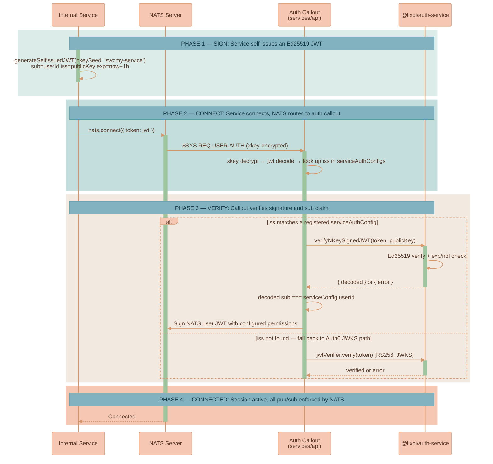

# Internal Service NATS Authentication Pattern

This document describes how internal services authenticate to NATS in the Lixpi system. Use this pattern whenever you add a new internal service (worker, daemon, scheduler) that needs to publish or subscribe on NATS subjects.

The first consumer of this pattern was the `services/llm-api` Python service, which was removed after its workflow was absorbed into `services/api`. The pattern itself is generic and lives on as the recommended way to authenticate internal services.

## When to use it

| Client type | Auth method | Token source |
|---|---|---|
| Web UI / browser users | Auth0 OAuth2/OIDC, RS256 JWTs | Auth0 JWKS endpoint |
| Internal backend services | Self-issued NKey-signed JWTs, Ed25519 | Service signs its own |

Use **NKey JWTs** for any service that:
- Originates traffic from your own infrastructure (ECS task, Lambda, cron job, etc.)
- Should not depend on Auth0 reachability for its own functioning
- Needs a narrow, declarative permissions allowlist on NATS subjects

Do **not** use this for traffic that originates from external clients. The auth callout treats anything signed with a registered service public key as fully trusted within the configured permissions, with no per-user identity check beyond the `sub` claim.

## End-to-end flow



The flow is the same regardless of whether the service is written in Python or TypeScript — both sides of the wire use the same JWT shape.

## The exact code samples

The samples below are extracted verbatim from the existing implementation. If you need to read the full files:
- `packages/lixpi/nats-service/python/nats_service.py:45-101` — Python signing
- `packages/lixpi/nats-service/ts/nats-service.ts:86-138` — TypeScript signing
- `packages/lixpi/auth-service/src/nkey-verifier.ts` — TS verification
- `packages/lixpi/nats-auth-callout-service/src/nats-auth-callout-service.ts` — auth callout

### Step 1: Service signs a JWT with its NKey seed (Python)

`packages/lixpi/nats-service/python/nats_service.py:45-101`:

```python
def generate_self_issued_jwt(nkey_seed: str, user_id: str, expiry_hours: int = 1) -> str:
    # Create NKey pair from seed
    kp = from_seed(nkey_seed.encode())
    public_key = kp.public_key.decode()

    # Create JWT claims
    now = int(time.time())
    claims = {
        "sub": user_id,           # Subject: service identity (e.g. 'svc:llm-service')
        "iss": public_key,        # Issuer: our own public key (NOT a URL)
        "iat": now,
        "exp": now + (expiry_hours * 3600),
    }
    header = {"typ": "JWT", "alg": "EdDSA"}    # Ed25519 signature algorithm

    def base64url_encode(data: dict) -> str:
        json_str = json.dumps(data, separators=(',', ':'))
        encoded = base64.urlsafe_b64encode(json_str.encode()).rstrip(b'=')
        return encoded.decode()

    header_b64 = base64url_encode(header)
    claims_b64 = base64url_encode(claims)
    message = f"{header_b64}.{claims_b64}"

    signature = kp.sign(message.encode())
    signature_b64 = base64.urlsafe_b64encode(signature).rstrip(b'=').decode()

    return f"{message}.{signature_b64}"
```

The `lixpi_nats_service` package wraps this — services don't call `generate_self_issued_jwt` directly. They pass `nkey_seed=` and `user_id=` to `NatsServiceConfig`, and the connection logic at `nats_service.py:321-332` regenerates a fresh JWT on every connect:

```python
def _apply_authentication(self, options: Dict[str, Any]) -> None:
    if self.config.nkey_seed and self.config.user_id:
        # Priority 1: Self-issued JWT using NKey seed (Ed25519 signing)
        info("Generating self-issued JWT...")
        options["token"] = generate_self_issued_jwt(
            nkey_seed=self.config.nkey_seed,
            user_id=self.config.user_id,
            expiry_hours=1,
        )
```

### Step 2: Service signs a JWT with its NKey seed (TypeScript)

`packages/lixpi/nats-service/ts/nats-service.ts:86-138` mirrors the Python version exactly. Same algorithm, same claims, same header — both sides of the wire produce byte-identical JWTs given the same seed and `userId`:

```typescript
export function generateSelfIssuedJWT(nkeySeed: string, userId: string, expiryHours: number = 1): string {
    const kp = fromSeed(Buffer.from(nkeySeed))
    const publicKey = Buffer.from(kp.getPublicKey()).toString('utf-8')

    const now = Math.floor(Date.now() / 1000)
    const claims = {
        sub: userId,
        iss: publicKey,
        iat: now,
        exp: now + (expiryHours * 3600),
    }
    const header = { typ: 'JWT', alg: 'EdDSA' }

    const base64urlEncode = (data: object): string =>
        Buffer.from(JSON.stringify(data))
            .toString('base64')
            .replace(/\+/g, '-').replace(/\//g, '_').replace(/=/g, '')

    const headerB64 = base64urlEncode(header)
    const claimsB64 = base64urlEncode(claims)
    const message = `${headerB64}.${claimsB64}`

    const signature = kp.sign(Buffer.from(message))
    const signatureB64 = Buffer.from(signature)
        .toString('base64')
        .replace(/\+/g, '-').replace(/\//g, '_').replace(/=/g, '')

    return `${message}.${signatureB64}`
}
```

### Step 3: Service starts and connects (canonical example)

The original `services/llm-api/src/main.py:50-62` showed the canonical Python service-init pattern (this file no longer exists in the tree — it was removed after the LLM workflow migrated into `services/api`):

```python
nats_config = NatsServiceConfig(
    servers=[s.strip() for s in settings.NATS_SERVERS.split(',')],
    name="llm-api-service",
    nkey_seed=settings.NATS_NKEY_SEED,    # SU... (Ed25519 seed)
    user_id="svc:llm-service",            # Must match registered serviceAuthConfig.userId
    tls_ca_cert=tls_ca_cert,              # Optional, for self-signed dev certs
    max_reconnect_attempts=-1,
    reconnect_time_wait=0.5,
    subscriptions=subscriptions,
)
nats_client = await NatsService.init(nats_config)
```

The TypeScript equivalent uses `NatsService` from `@lixpi/nats-service` with the same `nkeySeed` + `userId` shape.

### Step 4: Auth callout registers the service (TypeScript)

The auth callout is configured inside `services/api/src/server.ts` when the API server starts. After the `services/llm-api` migration, the `serviceAuthConfigs` array is empty. To re-add an internal service, append an entry like the one that used to register `svc:llm-service`:

```typescript
await startNatsAuthCalloutService({
    natsService: await NATS_Service.getInstance(),
    subscriptions,
    nKeyIssuerSeed: env.NATS_AUTH_NKEY_ISSUER_SEED,
    xKeyIssuerSeed: env.NATS_AUTH_XKEY_ISSUER_SEED,
    jwtAudience: env.AUTH0_API_IDENTIFIER,
    jwtIssuer: /* Auth0 issuer */,
    algorithms: ['RS256'],
    jwksUri: /* Auth0 JWKS URI */,
    natsAuthAccount: env.NATS_AUTH_ACCOUNT,
    serviceAuthConfigs: [
        {
            publicKey: env.NATS_MY_SERVICE_NKEY_PUBLIC,    // UA... (matches `iss` in service JWTs)
            userId: 'svc:my-service',                       // Must match service's user_id / sub claim
            permissions: {
                pub: {
                    allow: [
                        'my.service.responses.>',           // Subjects this service may publish to
                        '$JS.API.>',                        // Optional: JetStream API for object-store access
                        '$JS.FC.>',                         // Optional: JetStream flow control
                        '$JS.ACK.>',                        // Optional: JetStream acknowledgements
                    ],
                },
                sub: {
                    allow: [
                        'my.service.requests',              // Subjects this service may subscribe to
                        '_INBOX.>',                         // Reply inbox for request/reply
                        '$JS.>',                            // Optional: All JetStream subjects
                    ],
                },
            },
        },
    ],
})
```

The `userId` field in `serviceAuthConfigs` must exactly match the `sub` claim in the JWT the service generates. The `publicKey` must match the `iss` claim. If either mismatches, the callout rejects the connection.

### Step 5: Callout verifies the service (TypeScript)

`packages/lixpi/nats-auth-callout-service/src/nats-auth-callout-service.ts:58-87`:

```typescript
const authenticateServiceJWT = async (
    token: string,
    serviceConfig: ServiceAuthConfig,
): Promise<{ userId: string, permissions: ServiceAuthConfig['permissions'] }> => {
    info(`Auth callout: Verifying self-issued JWT (issuer: ${serviceConfig.publicKey.substring(0, 10)}...)`)

    const { decoded, error } = await verifyNKeyJWT({
        token,
        publicKey: serviceConfig.publicKey,
    })
    if (error) {
        err('Self-issued JWT verification failed:', error)
        throw new Error(`Self-issued JWT verification failed: ${error}`)
    }

    const userId = decoded.sub
    if (!userId) throw new Error('User ID ("sub") missing in self-issued JWT')

    if (userId !== serviceConfig.userId) {
        throw new Error(`User ID mismatch: expected ${serviceConfig.userId}, got ${userId}`)
    }

    info(`Auth callout: Service authenticated via self-issued JWT (${userId})`)
    return { userId, permissions: serviceConfig.permissions }
}
```

### Step 6: NKey signature verification (TypeScript)

`packages/lixpi/auth-service/src/nkey-verifier.ts` is the actual cryptographic verification:

```typescript
export const verifyNKeySignedJWT = async ({
    token,
    publicKey,
}: { token: string, publicKey: string }): Promise<NKeyVerificationResult> => {
    if (!token) return { error: 'No token provided' }
    if (!publicKey) return { error: 'No public key provided' }

    try {
        const decoded = jwt.decode(token, { complete: true })
        if (!decoded || typeof decoded === 'string') {
            return { error: 'Invalid JWT format' }
        }
        if (decoded.payload.iss !== publicKey) {
            return { error: `JWT issuer mismatch: expected ${publicKey}, got ${decoded.payload.iss}` }
        }

        const nkey = fromPublic(publicKey)

        const parts = token.split('.')
        if (parts.length !== 3) return { error: 'Invalid JWT structure' }

        const message = `${parts[0]}.${parts[1]}`
        const signatureB64 = parts[2]
        const signature = Buffer.from(signatureB64.replace(/-/g, '+').replace(/_/g, '/'), 'base64')

        if (!nkey.verify(Buffer.from(message), signature)) {
            return { error: 'Invalid NKey signature' }
        }

        const now = Math.floor(Date.now() / 1000)
        if (decoded.payload.exp && decoded.payload.exp < now) return { error: 'JWT expired' }
        if (decoded.payload.nbf && decoded.payload.nbf > now) return { error: 'JWT not yet valid' }

        return { decoded: decoded.payload }
    } catch (error: any) {
        return { error: error.message }
    }
}
```

## Step-by-step recipe: adding a new internal service `my-service`

### 1. Generate an NKey pair

Use the `nsc` CLI (one-time, locally):

```bash
# Install nsc (macOS)
brew install nats-io/nats-tools/nsc

# Generate a user-type NKey pair
nsc generate nkey --user
# Output:
#   SU...   ← seed (secret — never commit, treat like a password)
#   UA...   ← public key (safe to share)
```

You can also use `nk -gen user` from `nats-io/nkeys` if `nsc` isn't installed.

### 2. Add env vars

Add the seed and public key to your environment configuration. The seed lives where secrets live (AWS Secrets Manager / SSM Parameter Store in prod; `.env` in local dev). The public key is not a secret but should still be passed via env config for clarity.

`.env` (local dev):
```bash
NATS_MY_SERVICE_NKEY_SEED=SU...
NATS_MY_SERVICE_NKEY_PUBLIC=UA...
```

`docker-compose.yml` (local dev):
```yaml
my-service:
    environment:
        NATS_NKEY_SEED: ${NATS_MY_SERVICE_NKEY_SEED}
        # ... other config
```

`infrastructure/pulumi/src/resources/main-api-service.ts` (production):
```typescript
environment: {
    // ... existing env
    NATS_MY_SERVICE_NKEY_PUBLIC: env.NATS_MY_SERVICE_NKEY_PUBLIC,    // public — fine to expose
}
```

The seed should be plumbed through Secrets Manager rather than as a plain env var in production.

### 3. Service code: initialize NATS with the seed

**Python** (using `lixpi_nats_service`):

```python
import os
from lixpi_nats_service import NatsService, NatsServiceConfig

config = NatsServiceConfig(
    servers=os.environ["NATS_SERVERS"].split(","),
    name="my-service",
    nkey_seed=os.environ["NATS_NKEY_SEED"],
    user_id="svc:my-service",
    subscriptions=[...],
)
await NatsService.init(config)
```

**TypeScript** (using `@lixpi/nats-service`):

```typescript
import NatsService from '@lixpi/nats-service'

await NatsService.init({
    servers: process.env.NATS_SERVERS!.split(','),
    name: 'my-service',
    nkeySeed: process.env.NATS_NKEY_SEED!,
    userId: 'svc:my-service',
    subscriptions: [/* ... */],
})
```

### 4. Register the service in the auth callout

Append a new entry to `serviceAuthConfigs` in `services/api/src/server.ts`:

```typescript
serviceAuthConfigs: [
    {
        publicKey: env.NATS_MY_SERVICE_NKEY_PUBLIC,
        userId: 'svc:my-service',
        permissions: {
            pub: { allow: ['my.service.responses.>'] },
            sub: { allow: ['my.service.requests', '_INBOX.>'] },
        },
    },
],
```

The `userId` must exactly match what the service sends as `sub` in its JWT. The `publicKey` must match the service's `iss`. Permissions are the *complete* allowlist — anything not listed is denied.

### 5. Pulumi infrastructure

Add a new ECS service for `my-service`. Use `infrastructure/pulumi/src/resources/main-api-service.ts` as a template — copy it, rename, swap the Dockerfile path, and pass in the env vars.

**Do not** also add the public key to the NATS cluster's environment unless its config consumes it. The auth callout runs inside `services/api`, so the NATS cluster doesn't need the public key — verify by reading `infrastructure/pulumi/src/resources/NATS-cluster/NATS-cluster.ts` before adding anything there.

### 6. Verify locally

Start the new service in `docker-compose`. Watch the auth callout logs in `services/api`:

```
Auth callout: Service authenticated via self-issued JWT (svc:my-service)
```

Then test that permissions are enforced. Try publishing to a subject *not* in the allowlist:

```typescript
natsService.publish('not.in.allowlist', { hello: 'world' })
```

The publish should fail with a permissions error visible in the NATS server logs.

## Security & operational notes

### Seeds are secrets
Treat NKey seeds like database passwords:
- Never commit (`.env` files with real seeds belong in `.gitignore`).
- Never log (the `generateSelfIssuedJWT` functions intentionally log only the `userId`, never the seed).
- Production seeds live in AWS Secrets Manager / SSM Parameter Store.
- Public keys are not secrets but should still be passed via env config for clarity, not hardcoded in source.

### Token rotation
- The JWT itself rotates every hour automatically — services regenerate it on every NATS connect.
- The underlying NKey pair should rotate every 90 days, or immediately on suspected compromise.
- Rotation procedure: generate a new pair, deploy the service with the new seed and `services/api` with the new public key in `serviceAuthConfigs` *in the same change*. Mismatches between the two halves cause connection failures.

### Permissions are the security boundary
A compromised service credential can only do what its `permissions` allow. Define them as narrowly as possible.

- The previous `svc:llm-service` example had a fairly broad JetStream allowlist (`$JS.>` on subscribe) because it needed object-store access for image resolution. That's a deliberate trade-off, not a recommended default.
- New services should start with the narrowest possible allowlist and expand only when needed.
- **Never grant `>` on pub.** A service that can publish to any subject can impersonate other services and the API.
- The auth callout's permission list is the *complete* allowlist — `_INBOX.>` is needed for any service that uses NATS request/reply, but is not added implicitly.

### Auth callout is a hard dependency
If `services/api` is down, no NATS clients (web-ui, internal services) can authenticate. Plan recovery scenarios accordingly:
- Long-running connections established before the callout went down stay connected (NATS doesn't re-validate).
- New connections fail until the callout is back.

### Why we don't use Auth0 for internal services
- **No external dependency** on Auth0 reachability for internal traffic. The auth callout never has to call out to Auth0 for service tokens.
- **No Auth0 API costs / rate limits** for service token issuance.
- **Faster verification**: a local Ed25519 signature check is ~µs; an Auth0 JWKS-fetch + RS256 verify is ~ms (and may need a network round trip on cold cache).
- **Better blast radius**: a compromised Auth0 tenant doesn't grant the attacker access to internal NATS subjects (because internal services don't trust Auth0 issuers, only the registered NKey public keys).

## References

- `packages/lixpi/auth-service/README.md` — primitives for JWT verification.
- `packages/lixpi/nats-auth-callout-service/README.md` — auth callout overview.
- `packages/lixpi/nats-service/python/nats_service.py:45-101` — Python signing implementation.
- `packages/lixpi/nats-service/ts/nats-service.ts:86-138` — TypeScript signing implementation (byte-identical output to the Python version).
- `packages/lixpi/auth-service/src/nkey-verifier.ts` — TS verification implementation.
- `packages/lixpi/nats-auth-callout-service/src/nats-auth-callout-service.ts:58-87` — service-auth path inside the callout.

## History

`services/llm-api/` was the original consumer of this pattern. It was a Python FastAPI service that ran a LangGraph workflow for LLM provider orchestration, authenticating to NATS as `svc:llm-service`. It was removed in 2026 once `@langchain/langgraph` (TypeScript) reached parity with the Python version, allowing the workflow to be absorbed into `services/api` directly. The auth pattern itself was preserved in this document as the canonical recipe for any future internal service. Git history (`git log --all -- services/llm-api/`) shows the original Python integration if needed.
