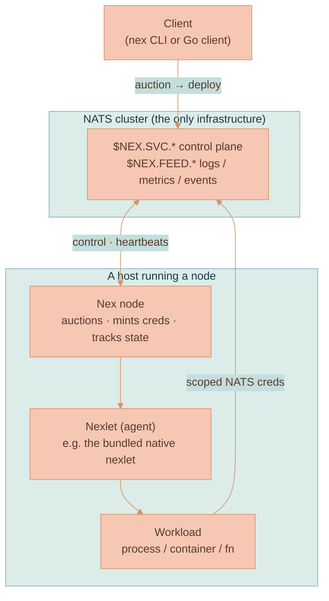

# NATS NEX Execution Engine — How It Works

NEX (the **N**ATS **Ex**ecution Engine) lets you run distributed workloads directly on a NATS cluster — no Kubernetes, no Nomad, no cloud function runtime. You already run NATS; NEX turns that same bus into a place to schedule and supervise processes.

This page is a digestible reference distilled from the six official docs in [`synadia-io/nex/docs/nex`](https://github.com/synadia-io/nex/tree/main/docs/nex) and cross-checked against the source. Where the prose docs and the code disagree, the code wins, and the disagreement is called out.


**Scope and source of truth.** Everything here is verified against `github.com/synadia-io/nex` at the `0.4.1` release (the latest, 2026-03-16) and `main`. The hosted pages at `docs.synadia.com` lag the rewrite and are *not* used as a source. The repo — its `docs/nex`, `models/`, and `agents/native/` directories — is the only authority. Section 16 maps each claim to the file that backs it.


## 1. What NEX is, in one minute

A traditional orchestrator (Kubernetes, Nomad) stands up a control plane — API servers, schedulers, an etcd cluster — and then schedules your containers onto it. NEX deletes that whole layer. Its only dependency is NATS:

- A **node** is a process that connects to NATS, runs placement auctions, and supervises workloads.
- A **nexlet** is a runtime adapter that actually executes a workload (a process, a container, a VM, a function…).
- A **workload** is the thing you want to run, described by a small file called a **Nexfile**.

The deal NEX offers: it is *imperative and minimal*. It places a workload and supervises it; it does **not** give you autoscaling, cron, or self-healing policy out of the box. You build those on top using the events NEX emits over NATS. In exchange you get a system with essentially zero moving parts beyond the NATS you already operate, and every workload is born with a scoped NATS connection.

## 2. The mental model: nodes, nexlets, workloads



**Node.** Started with `nex node up`. One node is fine for local development; many nodes on the same NATS cluster form a pool. A node is a NATS *client* — it does not run its own NATS server unless you ask it to (see embedded NATS, §7.4). Each node: supervises its nexlets, answers placement auctions, mints scoped credentials for workloads, optionally persists workload assignments to a KV bucket, and ships logs/events to `$NEX.FEED.*`.

**Nexlet (agent).** A nexlet is a small Go program implementing the `Agent` interface from the SDK. It advertises which workload `type` and which lifecycles it supports, then receives `StartWorkload` / `StopWorkload` / `GetWorkload` / `QueryWorkloads` calls from the node over NATS. Nexlets can be **embedded** (started inside the node — the native nexlet is, by default), **local** (a child process the node supervises), or **remote** (registering over NATS from another host).

**Workload.** A unit of execution scheduled onto a nexlet. It has a `name`, a `type` (which must match a nexlet’s `register_type`), a `lifecycle`, optional placement `tags`, and a `start_request` blob that the target nexlet validates against its own JSON schema. You normally describe it in a Nexfile (§5).

**How a deploy actually happens** (you rarely touch these subjects directly — the CLI does):

1. The client publishes an **auction** on `$NEX.SVC.<namespace>.control.AUCTION` describing the type, lifecycle, and tags it needs.
2. Every node with a matching nexlet **bids**.
3. The client picks a winner (the CLI picks a random eligible bid) and sends the deploy to `$NEX.SVC.<namespace>.control.ADEPLOY.<bidder_id>`.
4. The winning node **mints scoped NATS credentials** for the workload and calls `StartWorkload` on its nexlet.
5. The nexlet starts the workload, attaches log streams, and acknowledges.
6. If state persistence is on, the node stores the definition so it can replay `StartWorkload` after a restart.

## 3. Workload types and lifecycles

Two independent axes describe a workload. **Type** decides *which nexlet* runs it; **lifecycle** decides *how it behaves over time*.

| Lifecycle | Behavior | Typical use |
|---|---|---|
| `service` | Long-running; the nexlet usually restarts it if the process exits | Web servers, daemons, background workers |
| `job` | Runs to completion, then exits; the nexlet reports terminal state | Batch jobs, data pipelines, one-shot tasks |
| `function` | Event-driven; the nexlet registers NATS trigger subjects and launches an execution per invocation | Webhooks, event handlers, request processors |

A nexlet advertises which lifecycles it supports during registration, and the node refuses an auction whose lifecycle no nexlet implements. The bundled **native** nexlet supports `service` and `job` (not `function`).


**There is no built-in scheduler / cron.** None of the three lifecycles carry a schedule. `function` is *event*-driven (a NATS subject fires it), not *time*-driven. If you need "run every hour," you implement the clock yourself — a `service` that sleeps and loops, an external trigger that publishes to a `function`, or a separate scheduler. This is the single most common wrong assumption about NEX.


## 4. What can actually run on NEX — the real runtime story

This is the part people get wrong, so read it carefully.

NEX’s positioning line (from `index.md` and `README.md`) is: **"Run anything, anywhere — support for containers, native processes, WASM, VMs, and custom runtimes through pluggable nexlets."** That sentence is true *and* easy to misread. The precise version:

- **The architecture supports any runtime.** The node↔nexlet contract is runtime-agnostic. A nexlet that knows how to drive Docker, containerd, Firecracker, or a WASM runtime is a first-class citizen — nothing in NEX is hardwired to "native processes only."
- **Out of the box, NEX bundles exactly one nexlet: `native`.** The entire `agents/` directory in the repo contains a single agent, `agents/native`, which runs OS executables. There is no bundled container, VM, or WASM nexlet.
- **Other runtimes are how you extend NEX, not features you wait for.** To run OCI containers (or VMs, or WASM), you *write a nexlet* — a small Go program against `github.com/synadia-io/nex/sdk/go/agent` that shells out to your runtime. The whole of §"Creating Custom Nexlets" in the docs exists for exactly this. It is the supported, documented path, available today.


**Containers are supported — by writing a nexlet, not by waiting for a roadmap.** "NEX can run containers" and "NEX ships a container nexlet" are different statements. The first is true now (the SDK is the mechanism). The second is false at `0.4.1` (only `native` ships). Treat "container support is on the roadmap / pending" as a **myth** — the extension point is there and documented; what’s missing is a *prebuilt* container nexlet, which you supply.


So when you ask "can I use NEX with Docker?", there are two distinct questions hiding in one:

1. **"Can I run the NEX node itself in Docker?"** — Yes, unconditionally. NEX ships an official Docker image and a CI pipeline that builds it multi-arch. See §7.2.
2. **"Can NEX run my Docker/OCI image as a workload?"** — Only through a container nexlet, which you write (the SDK supports it; no prebuilt one exists at `0.4.1`). If you don’t want to write one, you run your program as a `native` workload instead — and you can still package and ship that program *in a Docker image* (see §7.3).

## 5. The Nexfile

A **Nexfile** is the declarative description of a workload, in YAML or JSON. The CLI auto-discovers a file literally named `Nexfile` in the working directory, or you point at one with `-f` / `--nexfile`.

The schema is small. From `models/nexfile.go`:

| Field | Required | Meaning |
|---|---|---|
| `name` | **yes** | Workload name |
| `type` | **yes** | Must equal a nexlet’s `register_type` (e.g. `native`) |
| `lifecycle` | **yes** | `service` \| `job` \| `function` |
| `start_request` | **yes** | Nexlet-specific payload, validated against that nexlet’s JSON schema |
| `description` | no | Human description |
| `tags` | no | Placement hints; must match node/nexlet tags |

> Note: `namespace` is **not** a Nexfile field — it’s a CLI flag (`--namespace`). The Nexfile describes the workload; the namespace is chosen at deploy time.

A minimal native service (straight from `quickstart.md`):

```yaml
name: "system-reporter"
description: "Reports system stats every 30 seconds"
type: native
lifecycle: service
start_request:
  uri: "file:///bin/sh"
  argv:
    - "-c"
    - "while true; do echo \"[$(date '+%Y-%m-%d %H:%M:%S')] Uptime: $(uptime)\"; sleep 30; done"
```

The CLI validates `start_request` against the target nexlet’s schema **before** sending anything to a node, so schema errors surface locally.

## 6. The native nexlet in depth

The native nexlet (`agents/native`) is the one you get for free. It runs an OS executable and streams its stdout/stderr to NATS. Knowing its exact contract matters, because the prose docs over-state it.

**The real `start_request` schema** (`agents/native/start_request.json`) — these are the *only* fields it accepts:

| Field | Required | Notes |
|---|---|---|
| `uri` | **yes** | Where to get the executable — see schemes below |
| `argv` | no | Array of string arguments |
| `environment` | no | Map of env vars; transmitted **base64-encoded and curve-encrypted** (the CLI/node handle the encryption) |
| `description` | no | Free text |
| `expose_ports` | no | Array of integer ports |


**The prose docs list fields the native schema does not have.** `running-workloads.md` mentions "`workdir`, `stdin`, `artifacts`, etc." for the native nexlet. Those keys are **not** in `agents/native/start_request.json` at `0.4.1` — supplying them is not part of the validated contract. Trust the schema file, not the prose.


**The `uri` field is also the artifact mechanism.** There is no separate "artifacts" field; the scheme on `uri` decides where the binary comes from (`agents/native/artifact.go`):

| Scheme | What happens | Status |
|---|---|---|
| `file://` | Run an executable already on the node host (`cacheFile`) | **Works** |
| `nats://` | Pull the executable from a **JetStream Object Store** bucket, with tag support (`nats://<bucket>/<name>:<tag>` → `cacheObjectStoreArtifact`), cache it locally, `chmod 0755`, and run it | **Works** |
| `oci://` | The URI *parser* understands `oci://domain:port/repo:tag`, but `getArtifact` has no OCI branch — it falls through to `unsupported artifact scheme` | **Parsed, not implemented** at `0.4.1` |


**You can deliver workload binaries over NATS today.** The Object Store path (`nats://`) is fully implemented — you can push a binary into a JetStream Object Store bucket and reference it by `uri`, instead of baking it into the node’s host/image. OCI-registry delivery is anticipated by the URI parser but not yet wired up; don’t plan on `oci://` working at `0.4.1`.


For Lixpi's current centralized auth-callout deployment, prefer `file://`
artifacts mounted into the NEX node over `nats://` artifacts. The NEX 0.4.1
`NkeyMinter` path hands the native nexlet NKey credentials, but its Object Store
artifact fetcher opens the NATS connection with `UserJWTAndSeed`. That mismatch
causes the auth callout to receive a connection with no usable token or raw NKey
challenge fields. `nats://` is still valid NEX behavior in compatible NATS
credential setups; it is not the local Lixpi private-repo path right now.

The native nexlet supports the `service` and `job` lifecycles (it is described in the docs as the reference "process runner which deploys jobs and services"). It does **not** do `function`.

## 7. Every way to run NEX

### 7.1 Install the CLI / node binary

The same `nex` binary is both the CLI and the node runtime. Three ways to get it:

```bash
# 1. Prebuilt release binary (recommended for pinning) — pick your OS/arch from:
#    https://github.com/synadia-io/nex/releases   (latest: 0.4.1)

# 2. go install (needs Go 1.24+; go.mod targets 1.26)
go install github.com/synadia-io/nex/cmd/nex@latest

# 3. From source
git clone --depth 1 https://github.com/synadia-io/nex.git
cd nex
go build -o nex ./cmd/nex
```

You also need a reachable `nats-server`. For a throwaway local node:

```bash
nats-server -a 127.0.0.1 -p 4222
nex -s nats://127.0.0.1:4222 node up
nex -s nats://127.0.0.1:4222 node list   # verify it registered
```

`-s` is shorthand for the NATS server URL. The node comes up with the native nexlet already registered.

### 7.2 Run the official Docker image

NEX publishes an official multi-arch image. The repo’s `.github/workflows/docker.yaml` builds `linux/amd64` + `linux/arm64` from the root `Dockerfile` and pushes to **GitHub Container Registry** on every push to `main` and on every semver tag:

```
ghcr.io/synadia-io/nex            # tags: <version>, <major>.<minor>, sha-<sha>, <branch>, latest
```

(The same workflow also pushes to a Synadia-internal AWS ECR repo named `nex`, which is not public. There is **no** Docker Hub `synadia/nex` push in the repo’s CI — use GHCR.)

```bash
# The image's ENTRYPOINT is /nex, so arguments are nex subcommands:
docker run --rm ghcr.io/synadia-io/nex:0.4.1 --help
docker run --rm ghcr.io/synadia-io/nex:0.4.1 -s nats://host.docker.internal:4222 node up
```


**The official image is `FROM scratch` — it contains only the static `nex` binary.** No shell, no libc, no Node/Python/etc. (The `Dockerfile` is a two-stage build: compile in `golang:latest`, then copy the single binary into `scratch`.) That’s perfect for a node that runs **host binaries via `file://`** or **Object-Store binaries via `nats://`**. It is *not* enough if your workload needs a language runtime — for that, build your own image (next).


### 7.3 Build your own image — the "Dockerfile setup"

When your workload needs a runtime the `scratch` image doesn’t have (Node.js, Python, a shell), put `nex` *into* an image that does. The clean pattern is a multi-stage copy of the official binary into a runtime base:

```dockerfile
# Pull the pinned, prebuilt nex binary from the official image…
FROM ghcr.io/synadia-io/nex:0.4.1 AS nex

# …and drop it into a base that has the runtime your workload needs.
FROM node:22-bookworm-slim
COPY --from=nex /nex /usr/local/bin/nex

# Your workload code + a native Nexfile whose uri points at the runtime:
#   start_request.uri  = "file:///usr/local/bin/node"
#   start_request.argv = ["/app/index.js"]
COPY . /app
WORKDIR /app

# The container starts a node and then deploys the Nexfile.
ENTRYPOINT ["/bin/sh", "-c", "nex -s $NATS_URL node up & nex -s $NATS_URL workload start -f /app/Nexfile && wait"]
```

There are two genuinely different "Docker + NEX" strategies; pick based on whether you’re willing to write Go:

- **Strategy A — native workload in a runtime image (no Go).** What the snippet above does. The node and the workload’s runtime live in one image; the workload runs as a `native` process (`uri: file:///usr/local/bin/node`, etc.). You build a Docker image, but NEX still sees a *native* workload. Zero custom nexlet. This is the pragmatic default when you just want "my Node/Python job, scheduled on NATS, shipped as a container."
- **Strategy B — true OCI/container workloads (write a nexlet).** Write a container nexlet with the Go SDK that implements the `Agent` interface and drives Docker/containerd/Podman. Then Nexfiles of `type: <your-container-type>` can run arbitrary OCI images, and `start_request` carries image/command/resources. More power, more code; nothing prebuilt ships at `0.4.1`.

### 7.4 Embedded NATS vs external NATS

A node normally connects to an *existing* NATS cluster (`--nats.servers`, `--nats.context`, `--nats.creds-file`, `--nats.nkey`). Alternatively, pass `--inats-config /path/to/nats.conf` and the node will **start its own embedded NATS server** and mint its own connection data. Embedded mode is convenient for self-contained demos; production deployments point the node at the real cluster.

### 7.5 Config: flags vs `config.json`

Every `node up` flag can live in a JSON config file instead. The CLI reads, in order, `/etc/nex/config.json`, `~/.config/nex/config.json`, `./config.json`, or an explicit `--config path.json`. Keys mirror flags with dashes → underscores, nested under `node.up`. Append `--check` to any command to print the **resolved** config without starting anything:

```json
{
  "namespace": "system",
  "node": {
    "up": {
      "node_name": "prod-node-1",
      "state": "kv",
      "tags": { "region": "lab", "arch": "amd64" },
      "issuer_nkey": "U...",
      "issuer_nkey_seed": "SU..."
    }
  },
  "nats": { "context": "nex-prod", "timeout": "5s" },
  "logger": { "level": "info", "target": ["std"] }
}
```

## 8. Running a node

`nex --namespace system node up [flags]`. The administrative namespace is `system` by convention; pass it consistently. Key option groups:

**Identity & encryption.** `--node-seed` gives the node a stable ID across restarts (omit for an ephemeral dev node); `--node-xkey-seed` sets the curve key used to encrypt secrets exchanged with nexlets. Both are auto-generated if unspecified.

**Connecting to NATS.** Use `--nats.context` (a preconfigured NATS CLI context) or supply `--nats.servers` + credentials (`--nats.nkey`, `--nats.creds-file`). `--nats.jsdomain` selects the JetStream domain (needed if state/KV lives in a specific domain).

**Credential minting** — a node must issue scoped NATS credentials so its workloads (and any remote nexlets) can talk to NATS. Choose exactly one strategy:

| Strategy | Flags | Use |
|---|---|---|
| Signing key + root account | `--issuer-signing-key`, `--issuer-signing-key-root-account` | The node signs user JWTs |
| User NKEY | `--issuer-nkey`, `--issuer-nkey-seed` | The node clones and restricts that identity per workload |
| Full access (dev only) | *(none provided)* | Falls back to `FullAccessMinter`, which issues unscoped creds — local experiments only |

**Managing nexlets.** The native nexlet auto-starts; disable it with `--disable-native-start`. Add local nexlets with repeated `--agents.uri` / `--agents.argv` / `--agents.env`. Accept remote nexlets with `--allow-remote-agent-registration` (which requires a real minting strategy, not the full-access fallback). `--agent-restart-limit` (default 3) caps supervised-nexlet restarts.

**State.** `--state kv` persists workload assignments to a JetStream KV bucket named `nex-<node_id>`; on restart the node replays each entry by calling `StartWorkload(..., existing=true)`. The empty string keeps everything in memory (workloads don’t survive a restart).

**Operating a running node:**

```bash
nex --namespace system node list                       # table of nodes, state, agent count
nex --namespace system node info <node_id> --full      # tags, xkey, per-agent heartbeats
nex --namespace system node lameduck --node-id <id> --delay 2m   # drain gracefully
```

Lameduck stops new auctions immediately and shuts down existing workloads after the delay — combine it with `Ctrl+C` for clean production shutdowns.

## 9. Running workloads

```bash
# Deploy from a Nexfile (auto-discovered, or -f / --nexfile <path>)
nex --namespace default workload start -f Nexfile

# Or fully inline (the JSON must satisfy the nexlet's schema)
nex --namespace default workload start \
  --type native --lifecycle job --name onetime-task \
  --start-request '{"uri":"file:///usr/local/bin/job","argv":["--once"]}'

nex --namespace default workload list [--show-metadata] [--type native] [--json]
nex --namespace default workload stop  <workload_id>
nex --namespace default workload clone <workload_id> --tags region=canary [--stop]
```

`workload start` prints the new ID on success: `Workload <name> [ww2TFc...] successfully started`. Override Nexfile values with flags (`--tags`, `--name`, …). `clone` re-auctions the same definition onto fresh capacity.

Watch a workload’s output by subscribing to its feed subjects with the `nats` CLI:

```bash
nats sub "$NEX.FEED.default.logs.>"    # stdout / stderr
nats sub "$NEX.FEED.default.event.>"   # started / stopped / triggered lifecycle events
```

## 10. Namespaces and tags

**Namespaces** partition workloads, logs, and events, and they scope credentials — a workload can only publish/subscribe within its namespace unless its nexlet grants more. Administrative actions default to `system`; user workloads typically live in `default` or a custom namespace. Match `--namespace` on deploy, on `workload list`, and on your log subscriptions, or you’ll "lose" workloads that are simply in another namespace.

**Tags** are scheduling metadata (`region=lab`, `arch=amd64`). Nodes/nexlets carry tags; a workload can *require* tags (`--tags key=value`) and the auction only matches nodes that satisfy them. Avoid the reserved `nex.` prefix.

## 11. Security model

- **Scoped credentials.** Every workload is minted NATS credentials limited to the subjects and namespace it needs. Nexlets get their own scoped creds at registration; the node refreshes them on reconnect.
- **Curve (XKey) encryption.** Nodes and nexlets exchange public curve keys so secrets (e.g. the `environment` map) travel encrypted, decrypted only at the destination.
- **Minting strategies.** The signing-key and user-NKEY strategies (see §8) are the real options; `FullAccessMinter` is an explicitly-labeled development-only fallback that hands out unscoped credentials.

## 12. Observability and the subject cheatsheet

Nexlets send a heartbeat every ~10 seconds; the node aggregates them into the health you see in `node info`. Logs, metrics, and events all stream over `$NEX.FEED.*`, so any NATS subscriber is a log collector.

| Purpose | Subject |
|---|---|
| Control plane (auction, deploy, stop, info) | `$NEX.SVC.<namespace>.control.*` (e.g. `…control.AUCTION`, `…control.ADEPLOY.<bidder_id>`) |
| Agent microservice endpoints | `$NEX.SVC.<node_id>.agent.*` (e.g. `…agent.STARTWORKLOAD.<agent_id>.<workload_id>`) |
| Heartbeats | `$NEX.SVC.<node_id>.agent.HEARTBEAT.<agent_id>` |
| Workload logs (stdout/stderr) | `$NEX.FEED.<namespace>.logs.<workload_id>.*` |
| Workload metrics | `$NEX.FEED.<namespace>.metrics.<workload_id>` |
| Workload + node + agent events | `$NEX.FEED.<namespace>.event.*` |

You almost never publish to these by hand — the CLI and Go client wrap them. They matter when you build observability pipelines or custom automation.

## 13. Programmatic access (the Go client)

The `nex` CLI is a thin wrapper over `github.com/synadia-io/nex/client`. Given an existing `*nats.Conn`, you create a namespaced client and call `Auction`, `StartWorkload`, `StopWorkload`, `CloneWorkload`, `ListWorkloads`, `ListNodes`, `GetNodeInfo`, `SetLameduck`. Because it speaks the same subjects as the CLI, code and CLI interoperate. Reach for it from services, operators, or CI when you want to manage NEX without shelling out.

## 14. CLI quick reference

| Command | Does |
|---|---|
| `nex -s <url> node up` | Start a node (native nexlet auto-registers) |
| `nex --namespace system node list` | List nodes |
| `nex --namespace system node info <id> --full` | Inspect a node + its agents |
| `nex --namespace system node lameduck --node-id <id> --delay <d>` | Drain a node |
| `nex --namespace <ns> workload start -f Nexfile` | Deploy a workload |
| `nex --namespace <ns> workload list [--show-metadata] [--json]` | List workloads |
| `nex --namespace <ns> workload stop <id>` | Stop a workload |
| `nex --namespace <ns> workload clone <id> [--tags …] [--stop]` | Re-auction a workload |
| `nex … --check` | Print resolved config without acting |

## 15. Gotchas and doc-vs-source discrepancies

The official docs are useful but imperfect. The traps, all verified against source:

1. **"NEX supports containers" ≠ "NEX ships a container nexlet."** Only `native` ships at `0.4.1`. Containers/VMs/WASM require a nexlet you write (Go SDK). This is an extension point, not a roadmap promise. (§4)
2. **No cron / scheduler.** No lifecycle has a schedule; `function` is event-driven. Own the clock yourself. (§3)
3. **The official Docker image is `scratch`.** Just the binary — no runtime. Multi-stage-copy `/nex` into a runtime base if your workload needs one. (§7.2–7.3)
4. **Image registry is GHCR, not Docker Hub.** The CI publishes `ghcr.io/synadia-io/nex` (+ a private Synadia ECR). There’s no `synadia/nex` Docker Hub push in the repo. (§7.2)
5. **Native `start_request` has 5 fields, not the prose list.** Only `uri`, `argv`, `environment`, `description`, `expose_ports`. `workdir`/`stdin`/`artifacts` are not in the schema. (§6)
6. **Object-Store artifact delivery works now; OCI doesn’t.** `nats://` is implemented; `oci://` is parsed but unimplemented. (§6)
7. **Module path is `synadia-io`, but the docs’ Go snippets say `synadia-labs`.** `go.mod` declares `module github.com/synadia-io/nex`. The `github.com/synadia-labs/...` import paths sprinkled through `concepts.md` / `creating-nexlets.md` are stale doc bugs — use `synadia-io`. (§16)
8. **`namespace` is a CLI flag, not a Nexfile field.** (§5)

## 16. Where each claim comes from (source map)

| Topic | Backing file in `synadia-io/nex` |
|---|---|
| Positioning, workload types, "containers via pluggable nexlets" | `docs/nex/index.md`, `README.md` |
| Node/nexlet/workload model, placement flow, subjects, security, Go client, state | `docs/nex/concepts.md` |
| CLI install, first node, sample Nexfiles | `docs/nex/quickstart.md`, `README.md` |
| Node flags, minting strategies, config.json, embedded NATS, lameduck | `docs/nex/running-nodes.md` |
| `workload start/list/stop/clone`, Nexfile usage, log/event subjects | `docs/nex/running-workloads.md` |
| Writing a custom nexlet (the container/VM/WASM path), Agent interface | `docs/nex/creating-nexlets.md` |
| Nexfile fields + which are required | `models/nexfile.go` |
| Native `start_request` real schema | `agents/native/start_request.json` |
| `uri` schemes `file://` / `nats://` / `oci://` (parsed-not-wired) | `agents/native/artifact.go` |
| Only `native` nexlet ships | `agents/` directory listing (single `native/`) |
| Official Docker image: `scratch`, multi-arch, GHCR | `Dockerfile`, `.github/workflows/docker.yaml` |
| Module path `synadia-io`, Go version | `go.mod` |
| Version `0.4.1` (2026-03-16) | GitHub Releases |

---

**How Lixpi uses this:** the Lixpi-specific deployment — running a NEX node as `services/nex`, with the AI-models sync migrated onto it — is documented at [NEX Execution Engine](../platform/deployment/NEX-EXECUTION-ENGINE.md). This page is the general NEX reference that doc builds on.
