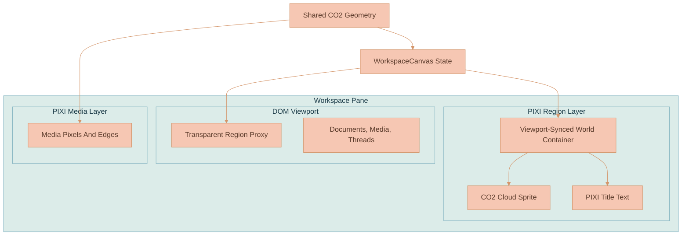

# Archived Context Region Clouds

Context region clouds were the visual and interaction surface for the old workspace `contextRegion` canvas node. They were removed from the live product in Phase 1 of [Workspace-Aware Chat Context & Branch Origins](../../../memory/WORKSPACE-CONTEXT-RELEVANCE-AND-BRANCH-ORIGINS.md), but the implementation is archived here so the renderer can be recovered without reverse-engineering old commits.

## Archive Contents

| File | Purpose |
|---|---|
| [contextRegionClouds.ts](contextRegionClouds.ts) | Pure geometry: deterministic cloud style selection, CO2 hit mask sampling, title bounds, connector anchors, cloud intersection, and adoption scoring. |
| [pixiContextRegionLayer.ts](pixiContextRegionLayer.ts) | PIXI v8 layer: offscreen watercolor texture baking, sprites, title text, viewport sync, culling, hit routing, active thought-circle overlay, and bounded pulses. |
| [contextRegionClouds.test.ts](contextRegionClouds.test.ts) | Geometry regression tests for hit testing, title bounds, anchor points, and adoption scoring. |
| [pixiContextRegionLayer.test.ts](pixiContextRegionLayer.test.ts) | Source-shape tests for PIXI layer lifecycle and active thought-circle behavior. |
| [settings-context-region-snippet.ts](settings-context-region-snippet.ts) | Verbatim `settings.contextRegion` types, helper, and value block from the removal point. |

## What The Clouds Were

Context regions were seafoam CO2-shaped workspace areas that grouped canvas nodes and owned a dedicated `AiChatThread`. The visible cloud lived in a PIXI layer below the DOM viewport; the persisted node and transparent DOM proxy stayed in the regular canvas node model for selection, dragging, parent-child containment, and connector handling.

The cloud was not decorative only. Its outline was the interaction truth for body hits, title hits, resize edge sectors, connector anchoring, collision broad-phase filtering, and drag-release adoption.

## CO2 Silhouette Gotcha

The visible silhouette came from a CO2-style SVG path: a main cloud with a detached top-left thought circle inside a `512 x 512` coordinate space. The shape existed in two copies:

- `pixiContextRegionLayer.ts` painted the SVG paths into offscreen canvases for texture generation and active thought-circle clipping.
- `contextRegionClouds.ts` sampled equivalent path data into polygons for hit testing, title placement, connector anchors, intersection, and adoption scoring.

Those copies had to change together. A mismatch made the worst kind of bug: the user saw one cloud outline while clicks, drops, and connectors behaved like another.

## Custom SVG Path Parser

The implementation intentionally did not use `Path2D(svgString)`. During renderer iteration, `Path2D` from SVG path strings was unreliable enough in the target browser/runtime path to produce blank output. The archived code uses a small parser for the command subset used by the CO2 path:

- `m`
- `c`
- `s`
- `z`

The renderer copy uses `drawSvgPath(...)` to paint the path into `CanvasRenderingContext2D`. The geometry copy uses `sampleSvgPath(...)` to flatten cubic segments into sampled points for polygon math. If the path command set grows, both parser paths need the same capability.

## Texture Pipeline

The renderer was deliberately bake-heavy and runtime-light. Each deterministic style baked one shared square texture, then every region reused that texture as a PIXI `Sprite`.

The bake sequence was:

1. Build the CO2 mask in an offscreen canvas.
2. Paint seafoam gradient color into the mask with weighted anchor positions and subtle swirl.
3. Add value-noise paper grain and pigment variation.
4. Add translucent paint pools biased by aspect ratio and seed.
5. Add soft subtractive cutbacks so the surface did not read as a solid blob.
6. Add small pigment speckles.
7. Optionally bake the exact CO2 vector border ring.
8. Apply the CO2 mask once with `destination-in`.
9. Convert the canvas into a PIXI `Texture` and cache it by texture version, style key, and border state.

Runtime sync only positioned sprites, changed alpha, rendered titles, culled off-screen entries, and ran bounded pulse or active-marker animations. PIXI ticker remained off for the layer; animations used short `requestAnimationFrame` lifecycles.

## Geometry Responsibilities

The archived geometry file was shared by multiple behaviors:

| Behavior | Function Family | Notes |
|---|---|---|
| Cloud visual bounds | `getContextRegionCloudBounds(...)` | Converts logical node rect into the square CO2 backdrop with configured bleed. |
| Body/title hit testing | `hitTestContextRegionCloud(...)` | Checks title first, then CO2 body, then resize edge sectors. |
| Connector anchors | `getContextRegionCloudAnchorPoint(...)` | Starts from side/t anchors and ray-scans toward the visible outline. |
| Drag adoption | `scoreRectAgainstContextRegionCloud(...)` | Samples center, corners, midpoints, and drop point against the CO2 body. |
| Collision | `contextRegionCloudsIntersect(...)`, `rectIntersectsContextRegionCloud(...)` | Uses rectangular broad-phase, then CO2 mask filtering. |

Rectangular math was only a cheap broad phase. Final interaction decisions were shape-aware.

## Viewport, Culling, And Lifecycle

`viewportBridge.ts` applied the same viewport to the DOM viewport, the PIXI media layer, and the context-region layer. That kept DOM proxies, cloud pixels, and media pixels in one coordinate system during pan and zoom.

The context-region layer kept a world `Container` with `autoStart: false` behavior. `sync(...)` received world-space datums from `WorkspaceCanvas`, reconciled entries by `nodeId`, and culled against the current viewport world rect. Destroy paths removed textures, RAF callbacks, PIXI objects, and the host element. Pan/zoom could safely call `setViewport(...)` without rebuilding textures.

## DOM Proxy And PIXI Split

The cloud surface stayed in PIXI because hundreds of watercolor masks and title labels were cheaper as a batched canvas layer than DOM. The proxy stayed in DOM because the existing canvas engine already used DOM elements for:

- Drag start routing
- Selection state
- Parent-child containment
- Connector handle bookkeeping
- Node metadata lookup
- Deletion and keyboard affordances

The DOM proxy was intentionally transparent. It existed for state and interaction plumbing, not visuals. Empty-cloud pointer handling started from the pane background, asked the PIXI layer for shape-aware hits, and then reused the existing drag/selection machinery for the matched node.

## Seafoam Palette

The removal-point palette was:

| Role | Color |
|---|---|
| Surface gradient 1 | `#DDECE7` |
| Surface gradient 2 | `#C7DAD4` |
| Surface gradient 3 | `#EEF8F5` |
| Surface gradient 4 | `#D6E7E1` |
| Base fill | `#E5F2EE` |
| Mist edge | `#A1C3BA` |
| Seafoam edge | `#8FB5AB` |
| Title ink | `#1F2937` |
| Active thought circle 1 | `#A7C39A` |
| Active thought circle 2 | `#9CBB91` |
| Active thought circle 3 | `#91AD86` |
| Active thought circle 4 | `#AFCB9E` |
| Region-contained image frame | `#FCFCFA` |

`settings-context-region-snippet.ts` is the source sample for the full inventory: dimensions, bleed, hit radius, texture size, title metrics, alpha values, animation durations, and style seeds.

## Recovery Steps

1. Restore `contextRegionClouds.ts` and `pixiContextRegionLayer.ts` into `services/web-ui/src/infographics/workspace/rendering/`.
2. Restore the archived tests next to those files.
3. Re-add the archived setting types, helper, and `settings.contextRegion` block from `settings-context-region-snippet.ts` to `services/web-ui/src/settings.ts`.
4. Re-add the `contextRegion` canvas node type and `ContextRegionCanvasNode` shape to `packages/lixpi/constants/ts/types.ts`.
5. Reconnect `viewportBridge.ts` so it accepts `getContextRegionLayer` and calls `setViewport(...)`.
6. Reconnect `WorkspaceCanvas.ts` to create the PIXI layer, build cloud datums from canvas nodes, call `sync(...)`, route pane hits through `contextRegionLayer.hitTest(...)`, and destroy the layer during cleanup.
7. Restore DOM proxy classes and SCSS only for transparent region nodes and region-contained image frames.
8. Restore `WorkspaceConnectionManager` cloud anchor offsets if region nodes should accept connectors.
9. Restore drag/adoption/collision branches from the archived tests and source if region parenting is required.
10. Restore API ownership only if regions must again own chat history: `AiChatThreadOwner` region variant, delete-region workspace transaction, NATS subject, and Sessions deletion guard.
11. Run only the permitted Dockerized web-ui tests after recovery, for example `docker exec lixpi-web-ui pnpm test:run -- src/infographics/workspace/rendering/contextRegionClouds.test.ts`.

Do not restore the renderer alone and assume the feature is back. The old behavior depended on type, settings, viewport, canvas, connection-manager, drag, API ownership, and Sessions paths all agreeing on the same `contextRegion` node contract.
