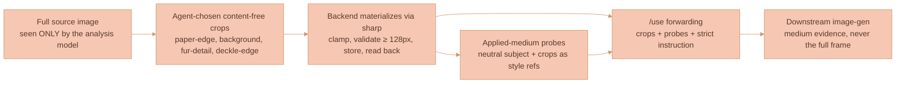

# Anti-Leakage Strategy

Feature extraction has one headline anti-feature to defeat and one quality bar it must hold at the same time:

- **No subject leakage.** If you extract a watercolor style from a picture of your cat, generations that `/use` that feature must not contain cats unless the user explicitly asks.
- **No texture loss.** Those same generations must still carry the cat's paper tooth, dry-brush direction, and deckle-edge frame — not a generic, smooth, "watercolor-flavored" output.

Both halves are non-negotiable (this is design principle #1 in the [Feature Extraction Overview](./FEATURE-EXTRACTION-OVERVIEW.md)). The strategy that satisfies both is **content-free pixel cropping**: withhold the subject layout, forward the medium evidence as deliberately sub-frame crops of the original pixels.

## Why naive approaches fail

Naive style-transfer pipelines pass the **full reference image** into the downstream model and instruct it to "use this style." The model routinely reproduces objects, identities, compositions, or backgrounds from the reference — direct subject leakage.

An earlier Lixpi iteration tried the opposite extreme: **withhold the source pixels entirely**, so the image-gen call only ever saw the agent's text summary of the style.


**Withholding all pixels produces no leakage and also no fidelity.** A text reconstruction of "loose cold-press watercolor with dry-brush fur strokes and a ragged deckle edge" is interpreted by the image model as a *generic* watercolor; the source's actual paper tooth, dry-brush direction, and edge frequency are lost the moment they are flattened to prose. The procedural-SVG "texture specimen" failure and the generic-smooth-watercolor downstream generations were the direct consequences (see ["What worked, what didn't"](./EXTRACTION-PIPELINE.md)).


## What the literature converges on

The disentanglement work surveyed here points in the same practical direction: **style fidelity depends on source pixels, not only on a prose reconstruction of those pixels.** Leakage is usually handled in the model architecture or through reference-image augmentation, rather than by throwing the image away and keeping only text.

| Approach | Mechanism |
|---|---|
| **StyleDecoupler** ([arXiv:2601.17697](https://arxiv.org/html/2601.17697v1)) | Information-theoretic separation of style from content on the encoded reference image; plug-and-play on frozen VLMs. |
| **DICE** ([arXiv:2602.08059](https://arxiv.org/html/2602.08059v1)) | Contrastive subspace decomposition on encoded references; training-free. |
| **StyleGallery** ([arXiv:2603.10354](https://arxiv.org/html/2603.10354v2)) | "Supports arbitrary reference images as input"; semantic-region masking on the diffusion features of the actual reference pixels to constrain style features to matched regions and prevent subject copy. |
| **UniCSG** ([arXiv:2604.17850](https://arxiv.org/html/2604.17850v1)) | Staged training combining latent-space semantic disentanglement with frequency-aware detail reconstruction on the actual reference; explicitly engineered to prevent reference-content leakage. |
| **StyleBrush** ([arXiv:2408.09496](https://arxiv.org/html/2408.09496v1)) | Dual-branch (ReferenceNet extracts style; Structure Guider extracts structure). Leakage is prevented by a **random cropping strategy** that stops ReferenceNet from learning the content image's structure. |

The product references surveyed for this design follow the same pattern: custom styles are grounded in uploaded reference images. That does not prove every product works this way forever, but it is the safer assumption for Lixpi's design than relying on a text-only reconstruction.

These SOTA approaches require **model-architecture or training access that is not available against closed model APIs**. The closest practical equivalent — and what Lixpi implements — is **pixel-grounded anti-leakage via deterministic content-free cropping of the source, combined with prompt-level subject suppression: StyleBrush's training-time random-crop strategy lifted to inference time.**

## How the strategy works

1. **During extraction**, the analysis model (Claude Opus or an equivalent vision-LLM) receives the full reference inputs (images / docs / threads) and produces the feature's `instructions`, `parameters`, and — critically — a `sourceImageCrops` list of bounded rectangles on the source images: regions labeled `paper-edge`, `background`, `corner`, `deckle-edge`, `texture-detail`, `subject-detail`. The agent picks 3–6 regions that carry the medium's marks (paper tooth, dry-brush fibre, deckle edge) without showing the full subject layout. **The agent's analysis call is the only step that ever sees the unredacted originals.**

2. **The backend deterministically materializes those crops** from the source bytes via `sharp`. Each crop is clamped to source dimensions, validated as ≥ 128 px on each axis, stored as an organization content-addressed Blob with `kind: 'source-crop'` metadata on the Feature sample, and read back to verify integrity. Feature persistence adds the durable Blob reference; failed runs leave only staging Blobs for GC. For `surface-texture`, the first sample (the texture specimen) is built deterministically by compositing 4 of those crops into a 2×2 labeled tile via `sharp`. **The v0 procedural SVG renderer is deleted; there is no synthetic mark generation.** The texture specimen is real source pixels.

3. **When generating model-rendered "applied medium" probes** (sphere on a plank, cube + cloth, etc.), the image-router call receives the agent's `instructions` and `parameters`, the neutral-subject prompt, 2–3 of the extracted source crops as visual style references (NOT the full source images), and the strict anti-leakage instruction:

   > Render the requested subject using the medium evidenced by the attached reference crops. The crops are evidence of the medium's marks, palette, paper tooth, edges, and density — do NOT reproduce any subject, identity, object, pose, or composition. Treat them as a style swatch, not a scene. A fragment of fur in a crop is not permission to draw a cat.

4. **When the feature is later applied via `/use`**, the `resolveFeatures` pre-stage (see [Feature Storage](./FEATURE-STORAGE.md)) fetches the feature record and forwards to the downstream image-gen call: the feature `instructions` + `parameters`, the texture-specimen sample, 1–2 model-generated applied-medium probes, **and 2–3 of the original content-free source crops** (downscaled to ≤ 512 px on the longest edge). The strict anti-leakage instruction is included verbatim. The downstream model has pixel evidence of what the medium looks like — both as crops of the original and as applied probes — without ever receiving the full source layout, the source subject's pose, or the source composition.

This bar is **stronger than the early "withhold all pixels" approach** (which produced text-only reconstruction and lost all textural fidelity) and **weaker than latent-space disentanglement** (which cannot run against closed model APIs). It is Lixpi's API-only approximation of the same idea: keep pixel evidence of style while stripping the source subject, pose, and composition as aggressively as possible.

## Why content-free cropping works

A 256–512 px square crop of the cat's paper-edge or background corner carries: paper tooth, deckle behavior, palette restraint, edge frequency, mark density. It does **not** carry: cat face, cat pose, cat composition. The model latches onto the texture-frequency content but cannot reproduce the subject because no pixel of the subject is in the crop. This is the same disentanglement that StyleBrush's random-crop training enforces, achieved here at inference time by deliberate spatial selection rather than random data augmentation.

For source images where the subject occupies most of the frame and there is no content-free background (e.g. a tightly-cropped portrait), the agent is instructed to pick **sub-anatomical crops**: a 256 px square of "fur close-up showing dry-brush direction" carries the brushwork without carrying the cat's pose, eyes, or recognizable outline. **The constraint is the spatial extent of the crop, not its content** — a small enough crop of fur reads as "watercolor on hairy texture," not as "cat."


If the agent cannot identify any content-free or sub-anatomical region (e.g. an iconic painting where the subject IS the style — Mona Lisa, The Scream), the validator **fails the extraction** with a clear error rather than risk leakage. The [v2 escalation path](#v2-escalation-path) applies for those cases.


## Sample preview correctness and QA

The referenced papers converge on the same warning: style cannot be reliably inferred, demonstrated, or evaluated from a text description; the pixel data must reach the model. The current bar is stricter sample plumbing plus content-free source forwarding:

1. **A feature thumbnail is only real when a sample image object exists and can be read.** The library must treat a missing `sampleZeroKey` / `sampleZeroUrl` as "no preview yet," not as evidence that previews are identical.
2. **The image router must return the final generated image data to Stage 5 (`generateSamples`).** Publishing `IMAGE_COMPLETE` to the chat stream is not enough; the sample stage needs the generated bytes so it can store a content-addressed Blob and populate `sampleImages` with its `blobHash` and metadata.
3. **Sample prompts must attach source crops as visual references**, not only the neutral-subject text prompt. `generatedImagePrompt` carries the anti-leakage instruction, `instructions`, `parameters`, and the neutral subject; the image-router request additionally attaches the agent-selected `source-crop` samples as `input_image` blocks. The full original source images are never attached to either sample generation or downstream `/use` calls.
4. **Sample metadata must be preserved.** `FeatureSampleRef` stores `idx`, `kind` (`source-crop` | `texture-specimen` | `applied-medium-probe`), `subject`, `rationale`, `aspectRatio`, `ext`, and (for source crops) `cropRegion: { imageRef, x, y, width, height, label, purpose }`, so later UI, audits, and regeneration can explain why each sample exists.
5. **Sample order must be stable by `idx`.** Parallel generation may finish out of order, but persistence and metadata sort by sample index before creating the feature.

The current implementation accepts that visual diversity is provider-dependent. A follow-up could add a preview QA loop: compute perceptual hashes and CLIP-similarity scores between the source crops and the model-rendered probes (probes should score *similar* in texture-frequency space, *dissimilar* in subject space). The DICE / StyleGallery / UniCSG metrics inspire that evaluator.

## v2 escalation path

For pathological subjects where content-free cropping is impossible (an iconic painting, a celebrity, a brand mascot where the subject IS the style), route sample generation and feature application through a specialized style-only model — the Recraft custom-style API or a self-hosted disentanglement model — that performs latent-space separation. The current architecture isolates the choice of sample-generation backend behind the existing `runImageRouter`, so swapping in a different backend later is a single-file change.

## Where to go next

- **[Extraction Pipeline](./EXTRACTION-PIPELINE.md)** — the six-stage pipeline that produces the crops and samples this strategy depends on.
- **[Using Features](./USING-FEATURES.md)** — how `/use` forwards the crops, probes, and strict instruction at send time.
- **[Feature Extraction Overview](./FEATURE-EXTRACTION-OVERVIEW.md)** — design principle #1 and the feature data model.
