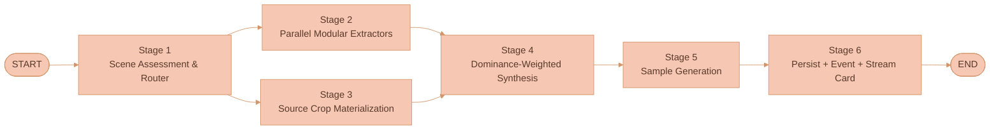
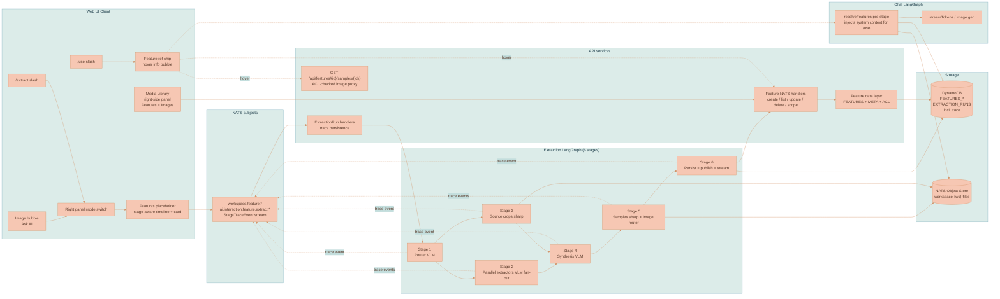

# Extraction Pipeline

Extraction runs through a fixed **six-stage, modular, dominance-weighted**
LangGraph implemented under
[`services/api/src/llm/extraction/`](../../services/api/src/llm/extraction/):
scene assessment & router → parallel per-axis extractors → deterministic
source-pixel crops → dominance-weighted synthesis → sample generation →
persistence. The router stage produces an axis-by-axis dominance score so the
synthesis foregrounds the work's actually distinctive traits (a cel-shaded
chibi-cat's huge expressive eyes and warm window light, never generic
"watercolor" tropes the trained prior would default to).

This page covers **how extraction runs**. For what a feature is and the
field model, see the
[Feature Extraction Overview](./FEATURE-EXTRACTION-OVERVIEW.md). For how subject
leakage is prevented while medium fidelity is preserved, see
[Anti-Leakage](./ANTI-LEAKAGE.md). For where the resulting records live and the
`resolveFeatures` pre-stage, see [Feature Storage](./FEATURE-STORAGE.md).

## Research foundations

The architecture is the practical translation of several convergent 2025–2026
findings for VLM-orchestrated visual analysis against **closed-API** image
models. The pipeline is the FIBO-schema axis decomposition + FaceScanPaliGemma
parallel per-axis-extractor pattern + Art-Historians dominance-weighting, lifted
to VLM orchestration against closed-API image models.

1. **Structured-schema axis decomposition.** FIBO
   ([arXiv:2511.06876](https://arxiv.org/html/2511.06876v1)) shows that a single
   Gemini-2.5 call with a strict JSON schema enforcing parallel axes
   (`short_description`, `objects`, `background_setting`, `lighting`,
   `aesthetics`, `photographic_characteristics`, `style_medium`,
   `artistic_style`, `text_render`, `context`) reliably forces the VLM to
   populate every axis independently rather than collapsing everything into one
   "style" label. The schema is the constraint; without it, the model defaults
   to its training-prior trope.
2. **Parallel per-axis extractors.** FaceScanPaliGemma
   ([Nature Sci Reports](https://www.nature.com/articles/s41598-026-39584-3))
   proves the multi-agent pattern: "*four fine-tuned Google PaliGemma models,
   each specialized for a specific facial attribute classification.*" Each agent
   owns one axis with a focused prompt and a tight schema. The pattern transfers
   directly — one VLM call per axis (palette, lighting, line-quality,
   surface-texture, character-design, composition, mood, medium,
   background-treatment), each with its own focused system prompt, fused at the
   end.
3. **Dominance-weighted attribution.** "Does AI See like Art Historians?"
   ([arXiv:2603.11024](https://arxiv.org/html/2603.11024)) attacks dominance
   ranking via Semi-NMF + PMI on internal latents — which cannot run against
   closed APIs. The practical VLM equivalent is a **router VLM pass** that
   explicitly scores each axis 0–1 on "how strongly this reference expresses this
   axis." The router's scores then weight downstream emphasis: dominant axes get
   deeper extractor analysis and proportional weight in the synthesized feature;
   weak axes are skipped or mentioned lightly.

The extractor system prompts follow the production-validated five-component
prompting blueprint from
[CHI 2025 — Leveraging Multimodal LLM for Inspirational UI Search](https://arxiv.org/html/2501.17799v1)
(Assistant Persona, Task Instruction, Feature List, Feature Definition and
Instruction, Response Form).

StyleGallery ([arXiv:2603.10354](https://arxiv.org/html/2603.10354v2)) is the
only earlier paper that anticipates miscategorization — it allows user/SAM-
provided masks as a fallback when automatic segmentation fails. The pipeline
adopts the same posture: the router stage explicitly identifies the medium
(digital vs traditional) and the focus hierarchy; if the user disagrees with the
router, they re-run with an explicit intent override.


What none of the cited papers solve, and what the pipeline must own itself: **the
case where the rendering of the subject IS the style** (a cel-shaded character
with huge eyes; an iconic painting where subject IS style). Every prior paper
treats subjects as content and rendering as style; for the chibi-cat case the
cel-shaded eyes ARE the style. The `character-design` extractor handles this
explicitly — it captures the rendering-of-the-subject as a first-class axis
distinct from background style.


## What worked, what didn't

Several failed iterations preceded the current architecture. Each is documented
here because its failure mode shaped a specific decision in the live system, and
the corresponding code paths have been **deleted** to prevent regression. Keeping
this rationale is the point: the design only makes sense in light of what broke.

### v0 — single-pass monolithic extractor (failed)

A single VLM call sent the analysis model a long, contradictory system prompt
asking it to do everything at once — identify category, write instructions, pick
samples, list parameters — in one forward pass. The system prompt also leaked
traditional-media vocabulary (`paper tooth`, `wash`, `substrate`, `dry-brush`)
which biased the model. Concrete failure: a digital cel-shaded chibi-cat
illustration was labeled `surface-texture` / `soft-storybook-watercolor-tooth`
with tags `[watercolor, storybook, soft, paper-tooth, dry-brush, deckle-edge,
painterly]`. The actual signature traits — huge expressive green eyes, soft
cel-shaded fur, tabby markings, chibi proportions, painterly digital background,
warm window light — were lost. Three independent failure causes were diagnosed:

- no first-stage scene assessment that commits to a medium classification,
- no per-axis decomposition that captures distinctive traits as parallel signals,
- no dominance weighting that foregrounds the actually-dominant signature.

All three are addressed by the current six-stage pipeline. The monolithic system
prompt (`FEATURE_EXTRACTION_INSTRUCTIONS` in `load-prompts.ts`) was removed.

### v0.5 — procedural SVG "texture specimen" (failed)

When category was `surface-texture`, the v0 pipeline rendered the first sample
image by running a procedural SVG generator (`renderTextureReferenceSheet` in
`base-provider.ts`) that drew random wavy lines, speckles, and brush-stroke noise
based on regex-matched keyword parameters. The marks generated had no
relationship to the source's actual textures — feeding the same procedural slop
downstream made `/use`-applied generations lose all medium fidelity. The function
and ~200 LOC of SVG-path helpers were deleted; the texture specimen is now a
deterministic 2×2 composite of real source-pixel crops (Stage 5).

### v0 — pixel withholding (failed in a different way)

An earlier version of the anti-leakage strategy aggressively forbade forwarding
any source pixels to either sample generation or downstream `/use` calls. Subject
leakage was solved; texture fidelity was destroyed. The generated dog images were
generic smooth watercolor with no trace of the source's paper tooth or dry-brush
direction. The fix was lifting StyleBrush's content-free cropping strategy to
inference time: source pixels still reach the downstream model, but as sub-frame
crops chosen to carry medium evidence without subject layout. The full rationale
is on the [Anti-Leakage](./ANTI-LEAKAGE.md) page.

### v0 — `extract_feature` chat tool (failed by overload)

The first design exposed extraction as a chat-LLM tool call: the user's chat
agent would call `extract_feature` mid-conversation. The chat model had to wear
two hats (chat assistant + visual analyst) and we paid a context-management cost
for every extraction; chat-prompt biases (watercolor terminology) leaked into
extraction output. The tool was removed; extraction is now a dedicated
server-side pipeline triggered by `AI_INTERACTION_SUBJECTS.FEATURE_EXTRACT.START`,
with its own LangGraph independent of the chat graph (see
[Feature Storage](./FEATURE-STORAGE.md) for the dedicated-graph rationale).

### What's working today

The six-stage pipeline correctly classifies medium (digital-illustration vs
traditional-watercolor) before any axis extractor runs, captures
rendering-of-the-subject as a first-class signature via the `character-design`
extractor, and emits live `StageTraceEvent` rows the user can watch in the
Features placeholder. Adaptive thinking (Opus 4.7, Sonnet 4.6) streams visible
reasoning during the router and synthesis stages. Source crops carry pixel
evidence into downstream `/use` calls without forwarding the full source frame.

### What's still rough

Anti-leakage on highly distinctive subjects (an iconic painting where subject IS
style) is imperfect — sub-anatomical crops still carry recognizable identity. The
router occasionally under-scores axes that are obvious to a human (e.g. scoring
`character-design = 0.3` for a clearly character-driven image), causing the wrong
axis to dominate the synthesis; current mitigation is re-running with an explicit
intent string. Cost is non-trivial: one extraction runs the router + 4–10
parallel extractors + synthesis + samples, roughly 10× the v0 single-pass cost.
The full set of mitigations and v2 escalations is documented in
[Feature Storage](./FEATURE-STORAGE.md).

## The six stages

Extraction is a fixed six-stage LangGraph that runs against the user's selected
analysis model. The graph is deterministic — there is no LLM-driven planner; the
stages and their dependencies are wired in code under
[`services/api/src/llm/extraction/orchestrator.ts`](../../services/api/src/llm/extraction/orchestrator.ts).
The router stage classifies the work and scores every applicable axis on
dominance; downstream extractors fan out in parallel and each owns one axis; the
synthesis stage fuses the outputs into a single feature definition weighted by
router scores; sample generation produces visual probes; persistence writes the
feature record + emits live events.



| Stage | Node | Responsibility |
|---|---|---|
| 1 | `runRouter` | Scene assessment, medium classification, per-axis dominance scoring, intent resolution |
| 2 | `runExtractors` | Parallel per-axis extraction fan-out (one VLM call per applicable axis) |
| 3 | `materializeSourceCrops` | Deterministic sharp crops from router bounding boxes (no model) |
| 4 | `synthesizeFeature` | Dominance-weighted fusion into a single `FeatureDraft` |
| 5 | `generateSamples` | Palette boards / texture composites / model-rendered probes |
| 6 | `persistFeature` | Write the feature + run trace, publish the create event, stream the card |

### Stage 1 — Scene assessment & router

A single VLM call (Claude Opus or Gemini 2.5 Pro — the user's selected analysis
model). A strict structured-output schema enforces these fields:

- `references[].subjects[]` — every distinct subject in the reference image(s)
  with normalized bounding box, salience rank, and a one-line description (e.g.
  `{ label: "cat", bbox: [0.18, 0.12, 0.82, 0.95], salience: 1, description:
  "round chibi-style orange tabby kitten, front-facing, large green eyes" }`).
- `references[].regions[]` — non-subject regions worth capturing (background,
  frame, foreground floor, etc.) with bounding boxes.
- `medium` — explicit medium classification: `digital-illustration`,
  `digital-painting`, `cel-shaded-3d`, `traditional-watercolor`, `oil-painting`,
  `pencil-drawing`, `photograph`, `mixed-media`, etc. **The router must commit to
  a medium before any other extractor runs.** This is the primary fix for the v0
  "watercolor-default" bug.
- `axisDominance` — every applicable attribute axis scored 0–1. Initial axis set:
  `palette`, `lighting`, `line-quality`, `surface-texture`, `character-design`,
  `composition`, `mood`, `medium-signature`, `background-treatment`,
  `color-temperature`, `edge-treatment`. The router must populate every score,
  not just the ones it considers dominant. Scores < 0.3 mean "skip this
  extractor"; scores ≥ 0.3 mean "run this extractor"; the score is also carried
  forward and used to weight the synthesis.
- `intentResolution` — if the user provided an intent string ("save the
  palette", "extract the texture"), the router resolves it to a forced category
  and a forced extractor subset. If no intent, the router proposes the dominant
  category from the scores.
- `notes` — free-form prose where the router can record observations that don't
  fit the structured fields.

The router system prompt is explicitly **media-neutral**: no watercolor
terminology, no paper tooth, no wash opacity, no substrate. The prompt asks the
model to describe what it sees with concrete vocabulary (line presence, shading
approach, color blocking, edge softness, surface artifacts) without defaulting to
a medium category. Medium classification happens in its own explicit field.

### Stage 2 — Parallel modular extractors

For every axis with `dominance >= 0.3`, the pipeline runs that axis's dedicated
extractor IN PARALLEL via `Promise.all()`. Each extractor is a self-contained
module implementing the `FeatureExtractor` interface (see
[Modular extractor architecture](#modular-extractor-architecture) below). Each
extractor receives the Stage 1 scene assessment + reference images + its own
focused system prompt, and produces a structured `AxisExtraction` JSON conforming
to its axis-specific schema. Extractor failures are isolated — one failing axis
does not block the rest; the synthesis stage receives whatever succeeded plus a
`failedAxes[]` list.

### Stage 3 — Source crop materialization

Runs in parallel with Stage 2 (no model dependency). Sharp deterministically
extracts crops from the source images based on Stage 1's subject + region
bounding boxes:

- For each primary subject: 2–4 sub-anatomical crops focused on the distinctive
  parts the router named in the subject description (e.g. for "kitten with large
  green eyes": eye crop, fur texture crop, marking crop, body silhouette crop).
- For each background region: 1–2 content-free crops.
- Composition-preserving full-image thumbnail at low res.

Each crop is stored as a workspace image with full metadata
(`kind: 'source-crop'`, `cropRegion`, `label`, `purpose`, `sourceImageRef`).
These crops are the pixel-grounded backbone of the anti-leakage strategy — see
[Anti-Leakage](./ANTI-LEAKAGE.md).

### Stage 4 — Dominance-weighted synthesis

A single VLM call (reasoning-strong analysis model). Inputs: the Stage 1 scene
assessment + all Stage 2 axis extractions + their dominance scores. The synthesis
prompt instructs:

- Construct a feature where the dominant axes are foregrounded and the secondary
  axes are mentioned proportionally.
- Pick a `category` (and `name`) that reflects the dominant axis grouping, NOT a
  generic medium default. If `character-design` is dominant, the category is
  `character-design` or `illustration-style`, not `surface-texture`. If `palette`
  is dominant, category is `color-palette`.
- Write `instructions` (markdown) with sections weighted by dominance — a 0.95
  character-design score gets a long detailed section; a 0.4 lighting score gets
  a short paragraph.
- Compose the `parameters` object as a nested per-axis structure with each axis's
  full extraction + dominance score + a synthesis-level commentary.
- Pick `recommendedSampleSubjects` for Stage 5 (typically a neutral character
  probe + a neutral object probe; for palette-dominant features, a palette
  board).
- Pick `tags` derived from dominant axes (e.g. `chibi`, `cel-shaded`,
  `digital-illustration`, `warm-window-light`, `oversized-eyes`, `cute`) — NOT
  from medium tropes the router rejected (no `watercolor` tag for a digital
  illustration).

### Stage 5 — Sample generation

For each `recommendedSampleSubject`, generate the sample. For pure-pixel samples
(texture specimens, palette boards), composite deterministically via sharp from
source crops or color blocks. For model-rendered probes (sphere on a plank,
neutral character), call `runImageRouter` with the source crops attached as
visual references plus the synthesized feature brief plus the strict
anti-leakage instruction. Source crops are the primary pixel evidence;
model-rendered probes are auxiliary.

### Stage 6 — Persist + event + stream feature card

Save the `Feature`, the `ExtractionRun` trace, publish `FEATURE_SUBJECTS.CREATE`,
and stream the `feature_card` block to the Features surface's extraction
placeholder.

## Modular extractor architecture

Every extractor implements the same TypeScript interface. New extractors are
added by dropping a file into `services/api/src/llm/extraction/extractors/` and
registering it in the registry. The orchestration pipeline does not change when
extractors are added — only the registry grows.

```typescript
interface FeatureExtractor {
  readonly axis: string                       // e.g., 'palette', 'character-design'
  readonly displayName: string                // for trace logs and the UI
  readonly description: string                // for self-documentation
  readonly outputSchema: object               // JSON schema the VLM must conform to
  readonly systemPrompt: string               // focused prompt for this axis
  readonly minDominance: number               // skip if router score is below this
  applicableTo(scene: SceneAssessment, intent?: string): boolean
  extract(args: {
    scene: SceneAssessment
    references: ReferenceImage[]
    intent?: string
    analysisModel: AnalysisModelConfig
    logger: StageLogger
  }): Promise<AxisExtraction>
}

interface AxisExtraction {
  axis: string
  dominance: number                            // copied from router score
  fields: Record<string, any>                  // axis-specific structured fields
  rationale: string                            // why these fields, in the model's words
  rawResponse?: unknown                        // for trace persistence
}
```

### Live extractor set

| Extractor | Focus | Schema highlights |
|---|---|---|
| `PaletteExtractor` | Color identity | `palette[]` (name, hex, role, usage proportion, temperature, notes), `harmony`, `contrast`, `temperature`, `backgroundTreatment`, `shadowStrategy`, `highlightStrategy`, `avoid` |
| `LightingExtractor` | Light source + behavior | `direction`, `quality` (hard/soft/diffused), `temperature`, `keyLight`, `fill`, `rim`, `ambient`, `shadowSoftness`, `shadowColor`, `timeOfDay`, `practicals[]` |
| `LineQualityExtractor` | Line treatment | `linePresence` (line-less/contour/sketchy/inked), `lineWeight`, `lineVariation`, `lineColor`, `outlineBehavior`, `interiorLines` |
| `SurfaceTextureExtractor` | Substrate + marks | `baseSurface`, `grain`, `markPattern`, `edgeBehavior`, `density`, `scale`, `repeatability`, `visibleArtifacts`. Only applicable when the router classifies the medium as traditional OR when texture-mimicking digital effects are present. |
| `CharacterDesignExtractor` | Subject rendering | `archetype`, `proportions` (head-to-body ratio, eye-to-face ratio), `featureEmphasis` (which features are oversized/exaggerated), `expression`, `pose`, `shadingApproach` (cel-shaded/painterly/photoreal), `silhouetteStyle`. **Only applicable when subjects are present.** This is the extractor that captures "huge cel-shaded green eyes" as a first-class signature. |
| `CompositionExtractor` | Framing + layout | `framing`, `aspectRatio`, `focusHierarchy`, `negativeSpace`, `compositionRule` (rule of thirds, golden ratio, centered, etc.), `perspective`, `viewpoint` |
| `MoodExtractor` | Emotional register | `primaryMood` (cozy, melancholic, energetic, etc.), `secondaryMoods[]`, `atmosphere`, `pace`, `timeOfDay`, `season`, `intendedAudience` (children, adult, etc.) |
| `MediumSignatureExtractor` | Technique fingerprint | `medium` (digital-illustration, watercolor, oil, etc. — must match the router's classification), `techniqueSignatures[]` (cel-shading, glazing, dry-brush, etc.), `softwareGuess[]` (Procreate/Photoshop/traditional/etc.), `digitalArtifacts[]`, `traditionalArtifacts[]` |
| `BackgroundTreatmentExtractor` | Background vs subject | `backgroundStyle`, `backgroundFocus` (sharp/blurred/abstracted), `backgroundElements[]`, `backgroundPalette`, `relationshipToSubject` (continuous/contrasting/decorative) |
| `EdgeTreatmentExtractor` | Image edges | `framePresence` (none/painterly/torn/clean), `frameTreatment`, `vignette`, `falloffBehavior` |

### Adding a new extractor

A future engineer adds
`services/api/src/llm/extraction/extractors/seasonal-mood-extractor.ts` that
implements the interface, registers it in `registry.ts`, and ships. The router
prompt is regenerated (it's templated from the registry) so it scores the new
axis. No other pipeline code changes. Over months, the extractor library grows
from 10 to 30 to 50, each one tuned narrowly for one attribute.


The modular extractor pattern is conceptually the same as DeepAgents subagents
(focused context, focused tools, isolated execution) — but it is implemented with
`Promise.all()` over `FeatureExtractor` instances rather than via the DeepAgents
library. That keeps the graph deterministic, the cost predictable, and the
streaming pipeline under our control. The full DeepAgents evaluation is in
[Feature Storage](./FEATURE-STORAGE.md).


## Dominance-weighted synthesis

The synthesis stage must NOT treat all extractor outputs equally. The router's
`axisDominance` scores drive how much real estate each axis gets in the final
feature:

- **Dominance ≥ 0.8 (signature axes):** these get a top-level section in the
  markdown instructions, prominent mention in `summary`, top-rank in `tags`, and
  the relevant parameters block sits near the root of the `parameters` JSON.
- **Dominance 0.5–0.8 (strong supporting axes):** smaller dedicated sections,
  listed in tags, parameters nested under the relevant top-level grouping.
- **Dominance 0.3–0.5 (minor axes):** a single sentence in instructions, may or
  may not be tagged, parameters present but compact.
- **Dominance < 0.3:** extractor was not run; the axis is absent from the
  feature.

The synthesis prompt explicitly receives the dominance scores and is instructed
to write proportionally. The output `parameters` JSON has a top-level
`axisDominance` map so consumers (the resolver, the library UI, the v2 evaluator)
can see the weighting.

For the cat case the pipeline produces something like the following (sketch, not
authoritative):

```jsonc
{
  "category": "illustration-style",
  "name": "soft-chibi-digital-watercolor-look-with-oversized-expression",
  "summary": "Cel-shaded digital chibi-cat illustration with oversized expressive eyes, soft warm window lighting, and a painterly cream background — digital, NOT traditional watercolor.",
  "tags": ["chibi", "cel-shaded", "digital-illustration", "oversized-eyes", "warm-window-light", "cute", "children-book", "tabby"],
  "axisDominance": {
    "character-design": 0.95,
    "lighting": 0.7,
    "palette": 0.65,
    "medium-signature": 0.6,
    "background-treatment": 0.55,
    "mood": 0.5,
    "composition": 0.4
  },
  "parameters": {
    "characterDesign": { "archetype": "chibi-kitten", "proportions": { "headToBody": "1.2:1", "eyeToFace": "0.32" }, "featureEmphasis": ["eyes", "paws", "ear-tufts"], "shadingApproach": "soft-cel-shaded-with-painterly-falloff", "silhouetteStyle": "rounded-compact" },
    "lighting": { "direction": "right-window", "quality": "soft-diffused", "temperature": "warm-cream", "keyLight": "warm", "fill": "cool-shadow", "timeOfDay": "afternoon" },
    "palette": { "palette": [...], "harmony": "warm-orange-cream-with-cool-green-accents", "contrast": "low" },
    "mediumSignature": { "medium": "digital-illustration", "techniqueSignatures": ["cel-shading", "soft-painterly-edges", "digital-airbrush-falloff"], "digitalArtifacts": ["clean-anti-aliased-edges", "perfect-gradient-tools"], "traditionalArtifacts": [] },
    "backgroundTreatment": { "backgroundStyle": "painterly-blurred", "backgroundFocus": "soft-blurred", "backgroundElements": ["potted-plant-left", "potted-plant-right", "window-frame", "wall-art"], "backgroundPalette": "muted-sage-and-cream", "relationshipToSubject": "complementary-cozy-interior" },
    "mood": { "primaryMood": "warm-cozy-friendly", "atmosphere": "afternoon-indoor", "intendedAudience": "children-book" },
    "composition": { "framing": "square", "focusHierarchy": "subject-center-dominant", "perspective": "eye-level-with-subject" }
  },
  "instructions": "## Application notes\n\nThis is a DIGITAL illustration aesthetic, not a traditional watercolor. Render with clean digital tools (cel-shading + soft painterly falloff). DO NOT add paper tooth, dry-brush artifacts, deckle edges, or wash bleeds — those are traditional-watercolor markers that would falsify the look.\n\n### Character design (dominant — 0.95)\n[...long section on chibi proportions, oversized eyes, cel-shading approach, expressive features...]\n\n### Lighting (strong — 0.70)\n[...]\n\n[...etc...]"
}
```

Compare with the earlier monolithic extractor's result on the same input:
`category: surface-texture`, `name: soft-storybook-watercolor-tooth`, tags
`[watercolor, storybook, soft, paper-tooth, dry-brush, ...]`. The current
pipeline classifies the medium correctly, names the dominant axis
(character-design), captures the actual signature traits, and weights them by
visual presence.

## Observability and tracing

Every stage emits structured trace events. These are: (a) logged to stdout in
dev (structured JSON via `@lixpi/debug-tools`), (b) streamed to the extraction
tab UI in real time so the user can watch the pipeline progress with model names
and step status, (c) persisted in `ExtractionRun.trace[]` for post-hoc audit and
regeneration.

```typescript
type StageTraceEvent = {
  extractionRunId: string
  stage: 'router' | `extractor:${string}` | 'crops' | 'synthesis' | `sample:${number}` | 'persist'
  modelName?: string               // 'claude-opus-4-7' | 'gemini-2.5-pro' | 'gpt-image-1' | 'sharp'
  promptHash?: string              // sha256 of the system + user prompts
  promptPreview?: string           // first 800 chars for human audit
  startedAt: number                // epoch ms
  finishedAt: number
  durationMs: number
  status: 'ok' | 'error' | 'skipped'
  errorMessage?: string
  inputSummary?: string            // 'router: 1 reference image, intent: "save the style"'
  outputSummary?: string           // 'router: medium=digital-illustration, dominantAxes=[character-design 0.95, lighting 0.70]'
  outputBytes?: number             // size of the structured output, for cost tracking
  metricTags?: Record<string, string | number>  // free-form for future metrics
}
```

**Features surface UI.** The extraction placeholder renders one row per
`StageTraceEvent` as it streams in. Each row shows: stage name, model name,
duration, status (spinner / ok / failed), and an expandable detail panel showing
the prompt preview and output summary. The user can see exactly what model ran
what prompt for how long. The panel shell and top-level surface switch are
covered in [Chat Panel and Sessions](../ai-chat/CHAT-PANEL-AND-SESSIONS.md).

**Persistence.** `ExtractionRun.trace: StageTraceEvent[]` is appended on every
stage event; `modelConfig`, source snapshot, streamed stage reasoning, and the
feature-card payload are also stored on the run. A future "re-run with same
trace" button could replay an extraction with the same model/prompt
configuration.

**Cost tracking.** Each stage event includes the model name and output bytes.
Aggregated per run, this yields a per-extraction cost breakdown. For an
extraction that runs 10 extractors in parallel + 1 router + 1 synthesis + N
sample generations, this is non-trivial cost — we need visibility.

## Reference flow: end-to-end walkthrough

The reference image is a digital cel-shaded chibi-cat illustration — round body,
oversized green eyes, soft cel-shaded tabby fur, painterly digital background with
potted plants and a window, warm window light, square painterly frame. This is
the exact case the earlier monolithic extractor mislabeled as watercolor. The
pipeline today classifies it correctly and captures the actual signature traits.

1. **The artist uploads a digital chibi-cat illustration.** Bytes land in the
   workspace's NATS Object Store bucket.

2. **They click the Ask AI wand.** Bubble menu appears, they click the leftmost
   wand icon.

3. **A pending feature row opens.** The right-side panel slides in on the
   `Features` surface. The selected placeholder is local UI state until
   confirmation; the confirmation view includes dedicated Reasoning model and Image model
   selectors. Confirming persists the API-owned run with that model config and
   mounts the stage-aware timeline in that placeholder.

4. **Stage 1 — Router runs.** Server-side, an `ExtractionRun` is created and
   `AI_INTERACTION_SUBJECTS.FEATURE_EXTRACT.START` is published. The router-stage
   node calls Claude Opus (the user's selected analysis model) with a
   media-neutral structured-output schema. The model sees the cat image and
   produces:

   ```jsonc
   {
     "references": [{
       "subjects": [
         { "label": "kitten", "bbox": [0.18, 0.18, 0.82, 0.95], "salience": 1, "description": "round chibi-style orange tabby kitten, front-facing, oversized green eyes, soft cel-shaded fur, white chest and paws, distinctive eye highlights and pink nose" }
       ],
       "regions": [
         { "label": "background-left", "bbox": [0.0, 0.18, 0.18, 0.95], "description": "painterly digital wall with potted plant" },
         { "label": "background-right", "bbox": [0.82, 0.18, 1.0, 0.95], "description": "window with second potted plant, warm afternoon light" },
         { "label": "frame", "bbox": [0.0, 0.0, 1.0, 1.0], "description": "soft painterly square frame, lavender tint" }
       ]
     }],
     "medium": "digital-illustration",
     "axisDominance": {
       "character-design": 0.95,
       "lighting": 0.70,
       "palette": 0.65,
       "medium-signature": 0.60,
       "background-treatment": 0.55,
       "mood": 0.50,
       "composition": 0.40,
       "edge-treatment": 0.35,
       "surface-texture": 0.10,
       "line-quality": 0.20
     },
     "intentResolution": { "forcedCategory": null, "forcedAxes": null, "proposedCategory": "illustration-style" },
     "notes": "Digital illustration; clean anti-aliased edges, soft airbrush falloff, cel-shaded fur with painterly highlights. NO traditional-medium artifacts — do not call this watercolor."
   }
   ```

   `StageTraceEvent` emitted: `stage=router, modelName=claude-opus-4-7,
   durationMs=4380, status=ok, outputSummary=medium=digital-illustration,
   dominantAxes=[character-design 0.95, lighting 0.70, palette 0.65]`. The
   timeline UI shows this row with the model name and a green check.

5. **Stages 2 + 3 run in parallel.** Stage 2 (extractors) fans out: with the
   threshold at 0.3, the pipeline runs `character-design`, `lighting`, `palette`,
   `medium-signature`, `background-treatment`, `mood`, `composition`,
   `edge-treatment` — eight VLM calls in parallel, each with its own focused
   prompt and strict schema. `surface-texture` (0.10) and `line-quality` (0.20)
   are skipped. Eight `StageTraceEvent` rows stream into the timeline as each
   extractor completes:
   - `extractor:character-design, modelName=claude-opus-4-7, durationMs=5210,
     status=ok` — captures `archetype=chibi-kitten`, `proportions={ headToBody:
     '1.2:1', eyeToFace: '0.32' }`, `featureEmphasis=['eyes', 'paws',
     'ear-tufts']`, `shadingApproach=soft-cel-shaded-with-painterly-falloff`.
   - `extractor:medium-signature, durationMs=4090, status=ok` — confirms
     `medium=digital-illustration`, `techniqueSignatures=['cel-shading',
     'soft-painterly-edges', 'digital-airbrush-falloff']`,
     `digitalArtifacts=['clean-anti-aliased-edges', 'perfect-gradient-tools']`,
     `traditionalArtifacts=[]`.
   - ...and so on for the other 6 extractors.

   Stage 3 (source crops) runs in parallel: sharp deterministically extracts the
   kitten's eye region, fur close-up, marking close-up, body silhouette, the left
   background plant region, the right window-and-plant region, and a low-res
   full-image composition thumbnail. Each crop stored as a workspace image with
   `kind: 'source-crop'` and `cropRegion` metadata. `StageTraceEvent`:
   `stage=crops, modelName=sharp, durationMs=320, status=ok, outputSummary=7
   crops materialized (4 subject, 2 background, 1 composition)`.

6. **Stage 4 — Synthesis.** The synthesis node calls Claude Opus again with all
   eight axis extractions + the scene assessment + the dominance scores. Output:

   ```jsonc
   {
     "category": "illustration-style",
     "name": "cel-shaded-chibi-cat-warm-window",
     "summary": "Digital cel-shaded chibi-cat illustration with oversized expressive green eyes, soft warm window lighting, and a painterly cream background. Digital — NOT traditional watercolor.",
     "tags": ["chibi", "cel-shaded", "digital-illustration", "oversized-eyes", "warm-window-light", "cute", "children-book", "tabby"],
     "parameters": {
       "axisDominance": { ... },
       "sceneAssessment": { ... },
       "characterDesign": { ... },
       "lighting": { ... },
       "palette": { ... },
       "mediumSignature": { "medium": "digital-illustration", "techniqueSignatures": ["cel-shading", "soft-painterly-edges"], "digitalArtifacts": ["clean-anti-aliased-edges"], "traditionalArtifacts": [] },
       "backgroundTreatment": { ... },
       "mood": { ... },
       "composition": { ... },
       "edgeTreatment": { ... }
     },
     "instructions": "## Application notes\n\n**This is a DIGITAL illustration aesthetic, not a traditional watercolor.** Render with clean digital tools (cel-shading + soft painterly falloff). **DO NOT** add paper tooth, dry-brush artifacts, deckle edges, or wash bleeds — those are traditional-watercolor markers that would falsify the look.\n\n### Character design (signature, dominance 0.95)\n[...long section on chibi proportions, oversized eye design, cel-shading approach, expressive features, paw/ear emphasis...]\n\n### Lighting (strong supporting, dominance 0.70)\n[...soft warm window light from the right, cool fill, low contrast, afternoon feel...]\n\n### Palette (strong supporting, dominance 0.65)\n[...warm orange/cream subject palette + cool sage/green accents in background + warm cream window glow...]\n\n[...etc, sections weighted proportionally...]",
     "recommendedSampleSubjects": [
       { "kind": "applied-medium-probe", "prompt": "a generic neutral cartoon character head, front-facing, in the extracted style", "aspectRatio": "1024x1024", "rationale": "tests character-design transfer to a non-cat subject" },
       { "kind": "applied-medium-probe", "prompt": "a simple still-life of a ceramic mug on a wooden table", "aspectRatio": "1024x1024", "rationale": "tests the medium-signature on a non-character subject" }
     ]
   }
   ```

   `StageTraceEvent`: `stage=synthesis, modelName=claude-opus-4-7,
   durationMs=6850, status=ok, outputSummary=category=illustration-style,
   name=cel-shaded-chibi-cat-warm-window`.

7. **Stage 5 — Sample generation.** Two model-rendered applied-medium probes fan
   out via the image router. Each call receives:
   - The synthesized feature brief (instructions + parameters)
   - 3 source crops attached as visual references (eye close-up, fur-detail crop,
     background-plant crop)
   - The strict anti-leakage instruction
   - The neutral subject prompt

   The image model renders a generic chibi-style character head and a stylized
   still-life — both in cel-shaded digital style with the warm window lighting,
   painterly cream background, and palette of the source. Neither is a cat. Two
   `StageTraceEvent` rows: `sample:0, modelName=gemini-2.5-flash-image,
   durationMs=8120, status=ok` and `sample:1, durationMs=7980, status=ok`.

8. **Stage 6 — Persist + stream feature card.** `Feature.create({...})` writes
   the feature with all 11 sample references (7 source crops + 2 applied-medium
   probes; no texture specimen for this case since `surface-texture` was 0.10 and
   skipped). `FEATURE_SUBJECTS.CREATE` fires; the library panel in any open
   session updates live. A `feature_card` block streams to the selected
   extraction placeholder:
   name `cel-shaded-chibi-cat-warm-window`, category `illustration-style`, scope
   `Workspace`, summary, tags as pills, sample thumbnails, an expandable "Show
   pipeline trace" panel with all 12 `StageTraceEvent` rows. Total run duration:
   ~37 seconds.

9. **The artist promotes scope to `User`.** Confirmation modal; one click. The
   chip flips to `Mine`. (Scope and sharing are covered in
   [Using Features](./USING-FEATURES.md).)

10. **Days later, in a different workspace, generating a dog portrait.** They
    type:

    > Generate a portrait of my dog Mavis, /

    The slash menu opens. They type `use`, press Enter; the picker shows their
    recent 3 features with `cel-shaded-chibi-cat-warm-window` at the top. Enter
    again. A highlighted chip pills in: `@cel-shaded-chibi-cat-warm-window`. They
    continue:

    > Generate a portrait of my dog Mavis, [@cel-shaded-chibi-cat-warm-window], sitting on a windowsill

11. **Hover the chip.** 200 ms grace; the info bubble shows the full feature card
    — name, category, scope, summary, the dominant-axis tags, the sample
    thumbnails (lazy-loaded via `GET /api/features/:id/samples/:idx`). They hover
    off; the bubble fades.

12. **They send.** Client walks the ProseMirror JSON, finds the feature ref,
    populates `referencedFeatureIds: ['<uuid>']` on the outgoing payload.

13. **Server resolves.** The `resolveFeatures` pre-stage fires (owned by
    [Feature Storage](./FEATURE-STORAGE.md)). The feature is fetched (ACL check
    passes). Source crops + applied-medium probes are downloaded from the
    originating workspace bucket (downscaled to 512 px). A structured system block
    is prepended with the feature brief, the source crops, and the applied-medium
    probes.

14. **The image-gen call runs.** Prompt: "portrait of dog Mavis sitting on a
    windowsill." System: the feature brief + the strict anti-leakage instruction.
    Reference materials: the 3 source crops (eye-detail, fur-detail,
    background-plant) + 2 applied-medium probes. The model sees pixel evidence of:
    cel-shaded eye design with oversized rendering, soft cel-shaded fur, warm-lit
    painterly background. The model renders Mavis as a chibi-style digital dog
    with oversized green eyes, soft cel-shaded golden fur, sitting on a windowsill
    with warm afternoon light and a painterly background — visibly in the SAME
    style as the cat, NOT a generic watercolor. **The cat's actual signature
    traits transferred because the pipeline captured them as first-class
    extractor outputs, not as a misclassified "watercolor" label.**

15. **The artist iterates.** Different scenes, identical style. The library
    grows. **That's the win.**

## Architecture diagram (full system)

The diagram below places the extraction LangGraph in the context of the whole
feature system — the web-UI surfaces, the API services, the chat LangGraph with
its `resolveFeatures` pre-stage, the storage layer, and the NATS subjects. The
storage and chat-graph halves are owned by
[Feature Storage](./FEATURE-STORAGE.md); they are shown here only for end-to-end
orientation.



## References

### Primary architecture-shaping prior art

- **FIBO** — Generating an Image From 1,000 Words. Structured 10-axis JSON schema
  for VLM-based image captioning that forces parallel axis population; the schema
  precedent for our Stage 1 router output.
  [arXiv:2511.06876](https://arxiv.org/html/2511.06876v1) — Qwen-3-VL-4B
  fine-tune at [huggingface.co/briaai/FIBO](https://huggingface.co/briaai/FIBO)
- **FaceScanPaliGemma** — multi-agent VLM with one specialized model per facial
  attribute axis. Proves the parallel-per-axis-extractor pattern works. The
  architectural precedent for our Stage 2 fan-out.
  [Nature Sci Reports](https://www.nature.com/articles/s41598-026-39584-3)
- **"Does AI See like Art Historians?"** — hierarchical concept decomposition
  with dominance-weighted attribution via Semi-NMF + PMI. The dominance-ranking
  precedent for our router's `axisDominance` scores.
  [arXiv:2603.11024](https://arxiv.org/html/2603.11024)
- **CHI 2025 — Leveraging Multimodal LLM for Inspirational UI Search** —
  five-component prompting strategy (Assistant Persona, Task Instruction, Feature
  List, Feature Definition and Instruction, Response Form) with YAML output. The
  production-validated prompt-engineering blueprint we use for the extractor
  system prompts. [arXiv:2501.17799](https://arxiv.org/html/2501.17799v1)

### Earlier disentanglement literature (architecturally inspired)

The 2026 disentanglement papers underpin the [Anti-Leakage](./ANTI-LEAKAGE.md)
strategy; they are listed in full on that page. StyleBrush's random-cropping
strategy — lifted to inference time — is the direct ancestor of the content-free
cropping the pipeline uses for Stage 3 crops and `/use` forwarding.

### Industry production references

- **Recraft custom styles** — monolithic style vector + 5 reference images +
  4-category coarse taxonomy.
  [Recraft docs](https://recraft.ai/docs/using-recraft/styles/custom-styles/how-to-create-a-custom-style)
- **Magnific custom styles** — monolithic LoRA fine-tune from 10–50 reference
  images. [magnific.com/ai/custom-styles](https://www.magnific.com/ai/custom-styles)
- **LangChain DeepAgents (JS)** — evaluated and not adopted; the rationale lives
  in [Feature Storage](./FEATURE-STORAGE.md).
  [DeepAgents docs](https://docs.langchain.com/oss/javascript/deepagents/overview)
  · [github.com/langchain-ai/deepagentsjs](https://github.com/langchain-ai/deepagentsjs)

### Lower-priority but useful

- **COCO-Tree** — hierarchical concept trees with Visual Relevance Score ×
  Linguistic Relevance Score. [arXiv:2510.11012](https://arxiv.org/html/2510.11012)
- **AttrVR (Attribute-based Visual Reprogramming)** — DesAttrs vs DistAttrs
  framing (common vs distinctive features per axis).
  [arXiv:2501.13982](https://arxiv.org/abs/2501.13982)
- **PromptSculptor** — multi-agent text-to-image prompt optimization (validates
  the multi-agent prompt-engineering pattern).
  [arXiv:2509.12446](https://arxiv.org/pdf/2509.12446)
- **PEVLM** — block-parallel VLM encoding for latency reduction (relevant if
  running parallel VLM calls becomes a bottleneck).
  [arXiv:2506.19651](https://arxiv.org/html/2506.19651v1)

### Lixpi internal

- [Product Overview](../PRODUCT-OVERVIEW.md)
- [AI Generation Pipeline](../platform/AI-GENERATION-PIPELINE.md) — the chat
  workflow the `resolveFeatures` pre-stage extends.
- [LLM module README](../../services/api/src/llm/README.md)
- [Mermaid Diagrams Style Guide](../documentation-style-guides/MERMAID-DIAGRAMS-STYLE-GUIDE.md)
