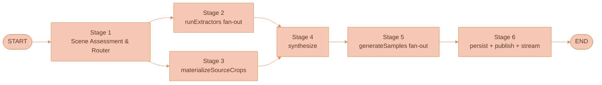

# Feature Storage and LangGraph Architecture

This page is the engineering reference for how features are **persisted** and
how they flow through the **LangGraph** runtime. It covers the storage triad of
DynamoDB tables, the NATS Object Store layout for sample images, the shared-type
extensions, both LangGraph topologies (the always-on `resolveFeatures` pre-stage
on the chat graph and the dedicated six-stage extraction graph), why a dedicated
graph was chosen over reusing the chat graph, the DeepAgents alternative that was
evaluated and rejected, and the known limitations the live system carries.

For the operator-facing `/use` and extraction-trigger flows, see
[Using Features](./USING-FEATURES.md). For the pipeline stages themselves, see
[Extraction Pipeline](./EXTRACTION-PIPELINE.md). For the broader chat workflow
this graph extends, see
[AI Generation Pipeline](../platform/AI-GENERATION-PIPELINE.md).


This page keeps the design rationale (why a dedicated extraction graph, the
DeepAgents evaluation, the known-limitations failure modes) inline because those
are load-bearing for future changes. The step-by-step build history lives in the
[feature-extraction build phases archive](../knowledge/archive/feature-extraction-build-phases.md);
deferred work lives in
[Feature Extraction Future Work](../roadmap/FEATURE-EXTRACTION-FUTURE-WORK.md).


## Storage architecture

Feature storage mirrors the existing `MAIN + _META + _ACCESS_LIST` triad pattern
from
[`DynamoDB-tables.ts`](../../infrastructure/pulumi/src/resources/db/DynamoDB-tables.ts)
(used today by `DOCUMENTS`, `WORKSPACES`, `ORGANIZATIONS`, and others), plus a
dedicated `EXTRACTION_RUNS` table for the extraction transcript.

### New DynamoDB tables

| Table | PK | SK | Indexes | Purpose |
|---|---|---|---|---|
| `FEATURES` | `featureId` | `version` | **GSI `byScopeAndOwner` (PK `scope#scopeOwnerId`, SK `updatedAt`)** | Primary feature record. The composite GSI partition key uses `scope#scopeOwnerId`, where `scopeOwnerId` is the workspaceId / userId / organizationId / fixed `'public'` — one GSI covers all four scope queries. |
| `FEATURES_META` | `featureId` | — | — | Lightweight projection for list rendering (name, category, summary, scope, sample-0 thumbnail key, `updatedAt`). Avoids fetching full instructions blobs for the library list. |
| `FEATURES_ACCESS_LIST` | `userId` | `featureId` | — | Explicit per-feature ACL beyond the scope rules (e.g. "share this `workspace`-scoped feature with one specific user outside the workspace"). Mirrors the existing `DOCUMENTS_ACCESS_LIST`. |
| `EXTRACTION_RUNS` | `extractionRunId` | `workspaceId` | — | Persists the extraction tab's transcript (ProseMirror JSON) plus status, resulting `featureId`, and source-context snapshot. Restores the extraction tab UX on reload and supports historical browsing. |

### NATS Object Store layout (sample images)

Sample images use the existing per-workspace NATS JetStream Object Store
buckets — `workspace-{workspaceId}-files`, created on workspace creation in
[`workspace-subjects.ts`](../../services/api/src/NATS/subscriptions/workspace-subjects.ts).

All three sample kinds — `source-crop`, `texture-specimen`,
`applied-medium-probe` — initially use the originating workspace's bucket while a
feature remains workspace-scoped. `Feature.sampleImages[]` stores the logical
sample index, the `kind` discriminator, the workspace image `fileId`, the
`imageUrl`, and (for source crops) the `cropRegion` metadata.

**Promotion copies samples to a durable home.** When an owner promotes a feature
to `user`, `organization`, or `public`,
[`feature-sample-storage.ts`](../../services/api/src/services/feature-sample-storage.ts)
copies each sample to `user-{ownerUserId}-features` *before* the scope metadata
is committed. This gives promoted features a durable home independent of the
extraction workspace.

**The full original source images are never persisted to
`Feature.sampleImages`.** They live exclusively in their original canvas image
nodes and the workspace image-store entries they were uploaded to; the feature
record references them only via `sourceContext.sourceImages[].imageUrl` as
provenance metadata, not as visual evidence. Exporting, sharing, or promoting a
feature therefore never carries the full source frame.

The older `features/{featureId}/sample-{idx}.{ext}` object-key layout is a legacy
fallback only. New extractions must validate generated bytes as PNG or JPEG,
store them as workspace image objects, and immediately read the object back by
`fileId` before persisting the feature. If any required visual sample cannot be
generated, stored, and read back, the extraction fails and no feature is saved.

Cross-scope reads always go through the ACL-checked API proxy:
`GET /api/features/:featureId/samples/:sampleIndex`. The handler validates the
supplied workspace or organization context before applying scope access rules.
Workspace features read from their workspace bucket; broader-scope features read
from durable user-owned feature storage and fall back to their origin workspace
only for promoted records created before migration support existed.

When an originating workspace is deleted, workspace-scoped features are deleted
with it. The deletion handler scans for promoted features born in that workspace
and ensures their sample bytes exist in `user-{ownerUserId}-features` before
removing the workspace Object Store bucket. If preservation fails, workspace
deletion aborts rather than losing reusable samples.

### NATS subjects

Extend
[`nats-subjects.json`](../../packages/lixpi/constants/nats-subjects.json):

```jsonc
"WORKSPACE_SUBJECTS": {
  "FEATURE_SUBJECTS": {
    "CREATE": "workspace.feature.create",
    "GET": "workspace.feature.get",
    "LIST_BY_SCOPE": "workspace.feature.listByScope",
    "UPDATE": "workspace.feature.update",
    "DELETE": "workspace.feature.delete",
    "CHANGE_SCOPE": "workspace.feature.changeScope",
    "REPORT_ABUSE": "workspace.feature.reportAbuse",
    "GET_SAMPLE_URL": "workspace.feature.getSampleUrl"
  }
},
"FEATURE_LIBRARY_SUBJECTS": {
  "LIST_GLOBAL": "feature.listGlobal"   // user / public scope queries that span workspaces
},
"AI_INTERACTION_SUBJECTS": {
  "FEATURE_EXTRACT": {
    "START": "ai.interaction.feature.extract.start",
    "STOP": "ai.interaction.feature.extract.stop",
    "STATUS": "ai.interaction.feature.extract.status",
    "LIST_BY_WORKSPACE": "ai.interaction.feature.extract.listByWorkspace",
    "DELETE": "ai.interaction.feature.extract.delete"
  }
}
```

Transcript streaming reuses the existing `CHAT_SEND_MESSAGE_RESPONSE` subject
pattern with `extractionRunId` substituting for `aiChatThreadId` — the existing
streaming infrastructure (`StreamPublisher`, `MarkdownStreamParser`, the
`aiChatThreadPlugin`) is agnostic to ID type.

### Type extensions

Three shared types in
[`types.ts`](../../packages/lixpi/constants/ts/types.ts) gain feature-aware
fields.

**`CanvasState` and the chat-panel state.** The panel persists tabs (thread and
extraction) and drafts; extraction runs are tracked per-canvas.

```typescript
type CanvasState = {
  nodes: CanvasNode[]
  edges: WorkspaceEdge[]
  lastActiveAiChatThreadId?: string   // legacy field; not used by current panel state

  aiChatPanel?: CanvasAiChatPanelState // panel visibility, tabs, drafts, and context chips
  featureExtractionRuns?: Record<string, CanvasFeatureExtractionState>
}

type CanvasAiChatPanelState = {
  isOpen: boolean
  isSessionHistoryOpen: boolean
  tabs: CanvasAiChatSidebarTab[]
  activeTabId?: string
  contextChips: string[]
  width?: number
  drafts?: Record<string, { content?: object }>
}

type CanvasAiChatSidebarTab = {
  tabId: string
  type: 'thread' | 'extraction'
  refId: string                       // threadId or extractionRunId
  title: string
}
```

`CanvasNodeType` is **not** extended — features are library-only per the
canvas-presence decision.

Extraction runs appear in the AI Chat panel Sessions list alongside normal chats.
Closing an extraction tab keeps the run reopenable. Deleting an extraction
session deletes only its `ExtractionRun` history and persisted panel draft; any
saved `Feature` produced by that run remains a separate library entity.

**`AiInteractionChatSendMessagePayload`.** Gains the ID list that carries `/use`
chips to the server.

```typescript
type AiInteractionChatSendMessagePayload = {
  messages: Array<{ role: string; content: MessageContent }>
  aiModel: AiModelId
  threadId: string
  referencedFeatureIds?: string[]   // NEW — populated by client when message contains feature_reference nodes
}
```

## LangGraph architecture

The shared workflow in
[`base-provider.ts`](../../services/api/src/llm/providers/base-provider.ts)
carries **two distinct graph topologies** — one for normal chat (with the new
`resolveFeatures` pre-stage and the existing image branch) and one for extraction
runs (the dedicated six-stage pipeline).

### Normal chat topology (with `/use` resolution)

```mermaid
%%{init: {'theme': 'base', 'themeVariables': { 'primaryColor': '#F6C7B3', 'primaryTextColor': '#5a3a2a', 'primaryBorderColor': '#d4956a', 'secondaryColor': '#C3DEDD', 'secondaryTextColor': '#1a3a47', 'secondaryBorderColor': '#4a8a9d', 'tertiaryColor': '#DCECE9', 'tertiaryTextColor': '#1a3a47', 'tertiaryBorderColor': '#82B2C0', 'lineColor': '#d4956a', 'textColor': '#5a3a2a'}}}%%
graph LR
    Start([START]) --> Resolve[resolveFeatures]
    Resolve --> Validate[validateRequest]
    Validate --> Stream[streamTokens]
    Stream -->|generate_image| ValImg[validateImagePrompt]
    Stream -->|skip| Usage[calculateUsage]
    ValImg --> ExecImg[executeImageGeneration]
    ExecImg --> Usage
    Usage --> Cleanup[cleanup]
    Cleanup --> Finish([END])
```



`resolveFeatures` is an always-on pre-stage; the chat flow is otherwise
unchanged. The v0 `extract_feature` tool is **removed from this graph** —
extraction is no longer a chat-LLM tool call.

### Extraction-run topology (dedicated six-stage pipeline)



Each "fan-out" node internally runs `Promise.all()` over independent VLM /
image-router calls. Each individual call emits a `StageTraceEvent` — model name,
prompt hash, duration, status — logged and streamed. Failures are isolated within
each fan-out: one failing extractor does not halt the run; the synthesis stage
receives whatever extractor outputs succeeded plus a `failedAxes[]` list. The
stage internals are documented in
[Extraction Pipeline](./EXTRACTION-PIPELINE.md).

### Why a dedicated extraction graph vs. extending the chat graph

The v0 architecture hijacked the chat graph: extraction ran by having the chat
LLM call an `extract_feature` tool, which then triggered
`executeFeatureExtraction`. This was a forced fit — the chat LLM had to wear two
hats (chat assistant **and** visual analyst), and the system paid a
context-management cost for every extraction.

The new design separates them. Extraction has its own graph with its own state,
its own stream subjects, and its own pipeline nodes. The chat graph retains only
the `resolveFeatures` pre-stage to handle `/use` chip resolution. The wins:

- **Cleaner separation of concerns** — chat and visual analysis no longer share
  one prompt.
- **Cleaner per-stage tracing** — each extraction stage is its own node with its
  own `StageTraceEvent`.
- **No "the chat LLM hallucinated watercolor terminology" failure mode** — the
  extraction prompts are media-neutral and isolated from chat-prompt biases.

### `resolveFeatures` — always-on pre-stage

New file:
[`feature-resolver.ts`](../../services/api/src/llm/graph/feature-resolver.ts).
For each `featureId` in `state.referencedFeatureIds`:

1. **Fetch the `Feature`** from DynamoDB (via `Feature.getFeature` with an ACL
   check against `state.eventMeta.userId`).
2. **Download the feature's samples** from the NATS Object Store, downscaled to
   ≤ 512 px on the longest edge to bound base64 cost. Partition the result by
   `kind`:
   - `source-crop` samples → the pixel-grounded style evidence (paper tooth,
     dry-brush direction, deckle edge). For downstream image-gen calls these are
     the **primary** visual references attached as `input_image` blocks.
   - `texture-specimen` and `applied-medium-probe` samples → auxiliary visual
     references demonstrating how the medium reads at swatch level and on a
     neutral subject.
3. **Prepend a structured system message** to `state.messages` (before the
   user's request). The format gives the LLM a single authoritative blob per
   feature with both pixel evidence and prose:

   ```
   <feature id="..." name="loose-storybook-watercolor-tooth" category="surface-texture" scope="user">
     <summary>Cold-press watercolor on a ragged deckle frame with visible paper tooth and dry-brush fur strokes</summary>
     <instructions>
       … the full markdown body …
     </instructions>
     <parameters>{ "baseSurface": "cold-press watercolor paper", "grain": "...", ... }</parameters>
     <sourceCrops>
       <crop idx="0" label="paper-tooth detail" purpose="texture-evidence">{base64}</crop>
       <crop idx="1" label="deckle edge" purpose="texture-evidence">{base64}</crop>
       <crop idx="2" label="dry-brush fibre detail" purpose="texture-evidence">{base64}</crop>
     </sourceCrops>
     <samples>
       <sample idx="0" kind="texture-specimen">{base64}</sample>
       <sample idx="1" kind="applied-medium-probe" subject="ceramic sphere on a plain plank">{base64}</sample>
     </samples>
   </feature>
   ```

   (XML-style tags are chosen for clarity; the final wire format may be JSON or
   markdown-frontmatter, decided during implementation. The point is the single
   authoritative blob per feature.)

4. **Inject the strict anti-leakage instruction once** at the top of the
   resolved system context:

   
   The attached `<sourceCrops>` are evidence of the medium — paper tooth, mark
   density, palette restraint, edge behaviour. They are intentionally sub-frame
   so they cannot leak subject layout. Use them as a style swatch, never as a
   scene. Do not reproduce any subject, identity, pose, or composition the crops
   happen to contain — a fragment of fur is not permission to draw a cat.
   

5. **Route to the image-gen call.** When the downstream invocation is the image
   router, the resolved `source-crop` samples (primary) and the
   `texture-specimen` + `applied-medium-probe` samples (auxiliary) are forwarded
   as `input_image` blocks on the multimodal request. The user's text request and
   the strict anti-leakage instruction are the only text the image-gen model
   sees. When the downstream model is chat-only, the resolved feature is included
   as a text-only system block (no image attachments).
6. **Emit metrics:** `feature.resolve.duration`,
   `feature.resolve.cache.hit/miss`, `feature.resolve.sample.bytes`,
   `feature.resolve.sourceCrop.bytes`.

**Caching.** An in-process LRU keyed by `(featureId, version)` with a 60 s TTL
bounds `resolveFeatures` cost in chat-heavy sessions.

### Extractor registry

New file:
[`registry.ts`](../../services/api/src/llm/extraction/extractors/registry.ts).
It exports `getExtractors(): FeatureExtractor[]`, returning every registered
extractor. Each extractor is a separate file
(`palette-extractor.ts`, `character-design-extractor.ts`, …) exporting a default
object implementing the `FeatureExtractor` interface. The registry imports them
and exports the array — adding a new extractor is *create file + add import = ship*.
The router prompt is templated from the registry (it lists every available axis
with its description so the model can score it), so a new axis flows through to
the router automatically. The extractor contracts and the live extractor set are
documented in
[Extraction Pipeline](./EXTRACTION-PIPELINE.md).

### `extract_feature` removed from the chat graph

The v0 chat-LLM tool `extract_feature` is **removed** from the chat-graph
topology. Extraction is no longer a side effect of chat generation — it is a
first-class server-side pipeline triggered by
`AI_INTERACTION_SUBJECTS.FEATURE_EXTRACT.START`.

Natural-language extraction triggers ("hey, save this watercolor style for
later") in a chat thread are handled by a lightweight chat-level helper that
detects the intent and publishes a `FEATURE_EXTRACT.START` NATS message with the
connected context as references and the user's string as `intent`. The detection
is a simple intent classifier (regex plus one or two keyword categories on the
last message); the chat LLM does not call into a feature-extraction tool. This
means:

- `extract-feature.ts` (and its provider registrations in `openai-provider.ts`,
  `anthropic-provider.ts`, `google-provider.ts`) is **deleted**.
- `state.featureExtractionSpec` (and its reducer in `graph/state.ts`) is
  **removed**.
- The chat-graph conditional branch on `extract_feature` is **removed**.
- The router/extractor pipeline owns extraction end-to-end with no chat-LLM
  hand-off.

## Why LangGraph parallel branches and not DeepAgents

The original brief asked us to evaluate DeepAgents. An earlier round dismissed it
on the grounds that "feature extraction is single-shot and deterministic." That
reasoning was wrong — the pipeline runs many parallel VLM calls. We re-evaluated
DeepAgents against the actual architecture, and the verdict still stands, but for
better reasons.

**What DeepAgents is**
([docs](https://docs.langchain.com/oss/javascript/deepagents/overview)):
LangChain's "agent harness" wrapping LangGraph with a built-in `write_todos`
planner, a virtual filesystem (`ls` / `read_file` / `write_file` / `edit_file`)
backed by pluggable backends, a `task` tool that spawns specialized subagents
with isolated context, auto-summarization for long sessions, long-term memory via
LangGraph's Memory Store, filesystem permission rules, and human-in-the-loop
interrupts. Its sweet spot is **LLM-driven planning loops** where the agent
decides what to do next based on what it just learned — coding agents, research
agents, ops agents.

**Our pipeline is multi-stage with parallel VLM calls, but the stage graph is
fixed.** No LLM decides "I should run the palette extractor next, then the
lighting extractor." The pipeline runs them all in parallel deterministically
based on the router's score. No `write_todos` planning loop is involved; no agent
reflection is required between stages; no virtual filesystem state crosses
stages. The intermediate state is structured TypeScript objects in
`ProviderState`, not files an agent reads back.

Adopting DeepAgents would mean:

- Replacing `Promise.all()` parallel fan-out (clean, ~10 lines) with DeepAgents
  `task` subagent spawning (more infrastructure, more conceptual surface).
- Paying the planning-loop overhead the pipeline does not need — community
  comparisons cite ~20× cost vs deterministic LangGraph for simple flows
  ([referenced article](https://medium.com/@kylas.kai/langgraph-vs-deepagents-what-if-the-cost-of-convenience-is-20x-24e0d1859ba2)).
- Losing direct control over the streaming pipeline
  ([`StreamPublisher`](../../services/api/src/llm/graph/stream-publisher.ts) +
  [`ImagePublisher`](../../services/api/src/llm/graph/image-publisher.ts)) that
  powers per-stage trace events to the UI.
- Adding a new dependency surface for a use case that fits LangGraph's
  parallel-branch primitives cleanly.

**Verdict: LangGraph parallel branches.** The modular extractor pattern is
conceptually the same as DeepAgents subagents (focused context, focused tools,
isolated execution) — but it is implemented with `Promise.all()` over
`FeatureExtractor` instances rather than the DeepAgents library. This keeps the
graph deterministic, the cost predictable, the streaming pipeline under our
control, and adds no new dependencies. If a future feature genuinely needs
LLM-driven planning (e.g. "auto-organize my library" — a meta-agent that crawls
features, dedupes near-duplicates, suggests scope changes), revisit DeepAgents
for that feature in isolation.

## Known limitations and trade-offs

Each item below is a real failure mode the pipeline can hit. **Mitigations** are
what the live system does today; **escalation paths** are what would be added if
the mitigation proves insufficient.

1. **Anti-leakage robustness for distinctive subjects.** Content-free cropping
   plus prompt-level subject suppression is imperfect for highly characteristic
   subjects (a specific celebrity, a brand mascot, an iconic painting where the
   subject *is* the style — Mona Lisa, The Scream). For those, even a
   sub-anatomical crop carries recognizable identity (a slice of the Mona Lisa's
   smile is still the Mona Lisa). The 2026 disentanglement papers do better via
   latent-space subspace decomposition that is not accessible against closed
   APIs. **Mitigation:** the extraction validator fails the run if the agent
   cannot identify any content-free or sub-anatomical region. **Escalation path:**
   route sample generation and feature application through a specialized
   style-only API (Recraft custom-style API or a self-hosted disentanglement
   model). See [Anti-Leakage](./ANTI-LEAKAGE.md).

1b. **Source-crop quality depends on the analysis model's visual reasoning.** The
   agent (Claude Opus or equivalent) must identify which pixel regions carry
   medium evidence without subject information. A weaker model could pick crops
   that contain the cat's face or eyes, leaking subject downstream.
   **Mitigation:** the tool prompt names allowed labels (`paper-edge`,
   `background`, `corner`, `deckle-edge`, `texture-detail`, `subject-detail`) and
   includes few-shot examples; the backend validates each crop is ≥ 128 px on
   each axis (so the agent cannot pick a crop that's just one whisker tip).
   **Escalation path:** a v2 CLIP-similarity check that flags crops too
   subject-correlated.

2. **`resolveFeatures` cost at scale.** Every send with N feature chips means N
   feature fetches plus 0–3N sample fetches. **Mitigation:** the in-process LRU
   cache keyed by `(featureId, version)` with 60 s TTL; a
   downscale-to-512px-then-base64 cap on injected samples; metrics on cache
   hit-rate and sample bytes injected. **Escalation path:** fall back to
   `nats-obj://` URL injection and let providers download (OpenAI Responses API
   supports `image_url`; the Anthropic / Google paths need verification).

3. **Library panel + chat panel real-estate conflict.** The Media Library and the
   chat panel can coexist visually, but the interaction question — does opening
   the library auto-collapse the chat panel? — defaults to **no, let them
   coexist**, confirmed during build. See [Media Library](./MEDIA-LIBRARY.md).

4. **Pulumi IAM gap noted by exploration.** The api service's
   `resourceBindings.tables` may already be missing `WORKSPACES` and
   `AI_CHAT_THREADS`. Verify before adding the four new tables; if confirmed, fix
   alongside the table additions or open a separate ticket.

5. **Public moderation policy gaps.** Instant publish plus community reports
   covers the data path, but the policy layer is incomplete: no admin UI for
   reviewing reported features, no appeal mechanism, no takedown flow for
   legal / copyright / CSAM. **These need to land before public scope is widely
   advertised.** The data path is in place; the policy layer is a separate launch
   gate. The scope and report model is documented in
   [Using Features](./USING-FEATURES.md#feature-scope-and-sharing-model).

6. **Slash menu performance with thousands of features.** As users and orgs
   accumulate libraries, the `/use` picker will need pagination plus server-side
   search rather than the current client-side filter. **Escalation path:** add a
   search subject backed by a real index.

7. **Cross-provider structured-output drift.** OpenAI
   (`response_format: json_schema`), Anthropic (tool-use enforcement), and Google
   (`responseSchema`) all support strict JSON-schema enforcement, but the APIs
   differ and compliance is not always 100%; an extractor may receive a malformed
   response. **Mitigation:** every extractor validates its response against the
   schema via `zod` (or `ajv`); validation failure marks that axis as failed and
   the pipeline continues with the rest.

8. **Extraction-tab trace fidelity on reload.** Every `StageTraceEvent` is
   persisted to `EXTRACTION_RUNS.trace[]` as soon as it's emitted. If the user
   reloads mid-run, the in-progress stage may have an incomplete event (no
   `finishedAt`). **Mitigation:** on reload, render the trace from
   `EXTRACTION_RUNS.trace[]`; if `ExtractionRun.status === 'running'`, also
   re-subscribe to the live stream subject so subsequent events flow in.

9. **Extraction cost.** Each extraction runs 1 router VLM call + up to 10 parallel
   extractor VLM calls + 1 synthesis VLM call + 0–3 image-router calls for samples
   = 12–14 model calls in the worst case. Against Claude Opus this is non-trivial,
   roughly 10× the v0 single-pass cost. **Mitigation:** (a) the per-stage trace
   exposes cost so the user knows what's being spent; (b) the router threshold
   (default 0.3) is configurable per workspace — admins can require dominance ≥
   0.5 to gate down to 4–6 extractors; (c) extractor prompts and schemas are tight
   so per-call token use is minimal; (d) the router result is cached per
   `(imageHashSet, intent)` so repeated extractions on the same reference set skip
   Stage 1.

10. **Router miscalibration.** The router's dominance scores determine which
    extractors run; a miscalibrated router might score `character-design = 0.2`
    for an obviously character-driven image, skipping the most important axis.
    **Mitigation:** the router schema includes a `notes` field to flag
    uncertainty; the synthesis stage receives the notes and can request a re-run
    on missing axes (one capped retry). **Escalation path:** a v2 CLIP-similarity
    verifier that compares synthesized samples to the source and triggers a re-run
    if signature axes weren't captured.

11. **Medium misclassification (the v0 watercolor-on-digital bug).** Even with
    media-neutral prompts, the router could classify a soft digital painting as
    `traditional-watercolor`. **Mitigation:** the `MediumSignatureExtractor` runs
    in Stage 2 with a forced cross-check — if it disagrees with the router's
    `medium` classification it returns a `mediumMismatch` flag, and the synthesis
    stage prefers the extractor's verdict (it ran with a focused prompt).
    **Escalation path:** a v2 third tier — a small CLIP-based classifier that
    votes alongside the two VLM calls.

12. **Extractor library quality drift over time.** As contributors add new
    extractors, prompt quality varies. **Mitigation:** every extractor module must
    include (a) a strict output schema, (b) a small recorded-VLM-response
    golden-test fixture, and (c) a README explaining what the axis is and isn't.
    CI fails if any extractor lacks these; new axes are reviewed for schema
    strictness before merging.

## Related pages

- [Using Features](./USING-FEATURES.md) — entry points, `/use`, and the scope
  model.
- [Extraction Pipeline](./EXTRACTION-PIPELINE.md) — the six pipeline stages,
  extractor contracts, and synthesis.
- [Anti-Leakage](./ANTI-LEAKAGE.md) — content-free cropping.
- [Media Library](./MEDIA-LIBRARY.md) — the panel where features are browsed.
- [AI Generation Pipeline](../platform/AI-GENERATION-PIPELINE.md) — the chat
  LangGraph workflow this extends.
- [Feature-extraction build phases](../knowledge/archive/feature-extraction-build-phases.md)
  — the historical implementation record.
- [Feature Extraction Future Work](../roadmap/FEATURE-EXTRACTION-FUTURE-WORK.md)
  — deliberately deferred items.
