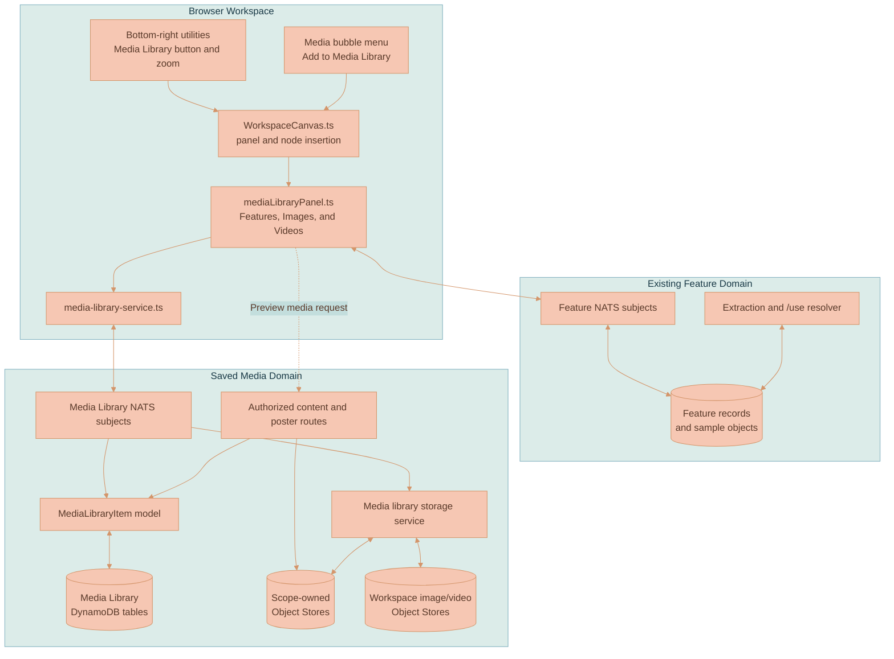
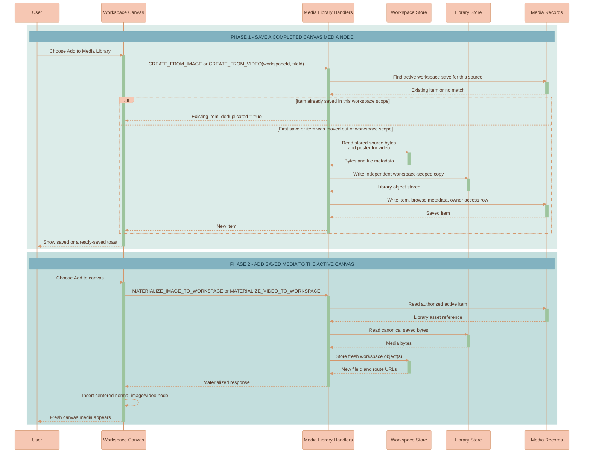

# Media Library

The Media Library lives inside the right side canvas panel. A top-level sliding switch at the top of that panel chooses between three surfaces: **Features**, which exposes the extracted-feature library; **Media**, which colocates reusable copies of finished canvas images and videos; and **AI Threads**, which is the chat-thread surface. Saved images and videos are independent Object Store copies kept for reuse.

The important detail is ownership. A saved image or video is not a bookmark to a canvas node and is not an alias to the workspace object. Saving makes a separate Object Store copy. Adding it back to a canvas makes another workspace copy. A user can therefore tidy or delete the original canvas media without losing the asset they saved for reuse.


This page is part of the feature library domain. For the larger canvas rendering and placement architecture, see [Rendering Engine](../canvas/RENDERING-ENGINE.md) and [Workspace Model](../canvas/WORKSPACE-MODEL.md). For feature extraction, sample images, and `/use` prompt references, see [Feature Extraction — Overview](./FEATURE-EXTRACTION-OVERVIEW.md) and [Using Features](./USING-FEATURES.md). Saved videos depend on the generated-video model in [Video Generation](../media-generation/VIDEO-GENERATION.md). To move a whole workspace's media between workspaces, see [Workspace Export & Import](./WORKSPACE-EXPORT-IMPORT.md).


## Core Concepts

| Concept | Definition |
|---------|------------|
| **Media Library** | The Features and Media surfaces of the right side panel. The framework-agnostic renderer in [`mediaLibraryPanel.ts`](../../services/web-ui/src/infographics/workspace/mediaLibraryPanel.ts) mounts into the panel body; [`WorkspaceCanvas.ts`](../../services/web-ui/src/infographics/workspace/WorkspaceCanvas.ts) owns the top-level switch that selects Features, Media, or AI Threads. The renderer starts on `Features` with the current `Workspace` scope selected. |
| **Top-level switch** | A [`slidingSwitch`](../../services/web-ui/src/components/slidingSwitch/) at the top of the right side panel choosing `Features`, `Media`, or `AI Threads`. The selection persists on `CanvasAiChatPanelState.topLevelMode`. |
| **Feature** | An extracted reusable feature such as a palette or style instruction. Features appear inside the Media Library, but they still use the established Feature model, NATS subjects, samples, extraction workflow, and `/use` resolution. They are **not** `MediaLibraryItem` records. |
| **Saved Image** | A library-owned copy of a stored canvas image. It has its own item ID, scope, metadata record, preview route, and Object Store object. |
| **Saved Video** | A library-owned copy of a stored canvas video. It has its own item ID, scope, metadata record, Range-capable MP4 content route, optional poster route, and Object Store object. |
| **Canvas Image** | An image node whose bytes belong to a workspace. Uploaded images, imported URL images, completed generated images, and images restored from the library all become normal stored canvas images. |
| **Canvas Video** | A video node whose MP4 and poster bytes belong to a workspace. Completed VEO generations and videos restored from the library become normal stored canvas videos. |
| **Materialization** | Copying a saved library image or video into the active workspace so it can be inserted as a new normal canvas node. The new node does not inherit AI-generation lineage or the deleted state of any earlier canvas node. |
| **Scope** | The visibility and storage owner of a saved media item: `Workspace`, `Mine`, `Organization`, or `Public`. Media is first saved to the active workspace. Moving scope moves the canonical library copy as well as its browse metadata. |

## What Users Can Do

- Open the right side panel from the independent bottom-right icon above the existing zoom indicator; it opens on the `Media` surface.
- Switch the panel between `Features`, `Media`, and `AI Threads` with the top-level sliding switch.
- Browse extracted `Features`, or the explicitly saved images and videos colocated under `Media`.
- Search the active category and switch between `Workspace`, `Mine`, `Organization`, `Public`, and `All available`.
- Select a completed stored image or video on the canvas and choose **Add to Media Library**.
- Add a saved image or video back to the active canvas as a fresh node.
- Move a media item they own into another available scope or delete it from the library.
- Inspect extracted Features, use them in a prompt, change sharing for Features they own, delete owned Features, or report public Features.


The panel does not collect every generated asset automatically. It contains images and videos only after an explicit save action.


## Architecture

The panel is part of the framework-agnostic canvas layer. Svelte owns the independent bottom-right launcher above the unchanged zoom indicator and image-upload/import integration, while `WorkspaceCanvas.ts` owns panel toggling, bubble-menu saving, and new-node insertion. The API keeps saved media separate from the extraction domain.



### Ownership Boundary

Workspace media and saved media live in different objects:

```text
workspace-{workspaceId}-files/{fileId}

media-library-workspace-{workspaceId}-files/{itemId}
media-library-user-{userId}-files/{itemId}
media-library-organization-{organizationId}-files/{itemId}
media-library-public-files/{itemId}
```

This gives the feature its deletion behavior:

| Action | Object that changes | Object that remains untouched |
|--------|---------------------|-------------------------------|
| Save a canvas image or video | New library object(s) are written | The source workspace object |
| Delete the original canvas media | Its workspace object is removed through normal canvas lifecycle | Any saved library copy |
| Add saved media to canvas | New workspace object(s) are written | The library object |
| Delete the newly added canvas copy | That new workspace object is removed | The library object |
| Move media scope | A copy is written in the destination library bucket, then metadata points to it | Canvas copies |

## Panel Behavior

The Features and Media surfaces are rendered by [`mediaLibraryPanel.ts`](../../services/web-ui/src/infographics/workspace/mediaLibraryPanel.ts) and [`media-library-panel.scss`](../../services/web-ui/src/infographics/workspace/media-library-panel.scss), embedded in the right side panel body below the top-level switch.

### Position and Layout

- The right side panel opens from the right side of the workspace pane, hosted and sized by the shared [`sidePanel`](../../services/web-ui/src/components/sidePanel/sidePanel.ts) (its resize handle owns and persists the width).
- The top-level [`slidingSwitch`](../../services/web-ui/src/components/slidingSwitch/) sits at the top of the panel; the selected surface renders in the body below it and fills the remaining height.
- The bottom-right launcher icon and the existing zoom indicator sit left of the panel; the launcher opens the panel on `Media`.
- Features use a browser and inspector layout: browse cards show a large preview, title, scope, and a two-line summary preview; the selected inspector preserves the full summary, tags, instructions, samples, palette data, and management controls.
- When the remaining width is narrow, selecting a Feature replaces the browser with a focused detail view and an explicit **Back** action.

### Surfaces

The top-level switch defaults to `AI Threads`; the launcher and the `/use` path open it on `Media` and `Features` respectively. The selection persists on `CanvasAiChatPanelState.topLevelMode`. The scope and search selection within a surface is retained in memory while the panel stays mounted.

| Surface | Contents | Main actions |
|---------|----------|--------------|
| `Features` | Concise browse cards plus a selected Feature inspector | View full details and samples, `Use Feature`, change owned sharing, delete owned items, report public items |
| `Media` | Saved images and videos colocated under `Images` and `Videos` headings, with authorized previews and hover MP4 previews | `Add to canvas`, move scope, delete |
| `AI Threads` | The chat-thread surface (sessions, per-thread tabs, thread/extraction body) | Owned by the AI chat panel |

Feature `created`, `updated`, and `deleted` events update or reload the Feature browser while the `Features` surface is mounted. Media Library `created`, `updated`, and `deleted` events reload the colocated images and videos while the `Media` surface is mounted. A successful media save on the canvas displays an in-place toast; it does not force the panel open or switch the current surface.

### Filters

The compact **Scope** selector exposes `Workspace`, `Mine`, `Organization`, `Public`, and `All available`.

- The initial filter is `Workspace`; filter selection is retained in memory while the panel stays mounted.
- `All available` asks the backend for readable media from all accessible workspaces, the current user's own scope, organizations the user belongs to, and public items.
- Image and video search is applied by the media-list request against `displayName`.
- Feature search stays in the Feature rendering path and matches feature name, summary, category, and tags.
- A Feature owner changes that Feature's scope from its inspector only. Promotion to `Public` requires confirmation; moves to `Workspace`, `Mine`, or `Organization` apply immediately after server authorization.

## Saving and Reusing Media

### Eligible Canvas Media

`Add to Media Library` appears in the canvas bubble menu when an image or video node has a stored `fileId` and is not still tracked as an in-progress generation. The backend then verifies that the corresponding workspace object really exists before it saves anything.

This includes:

- Uploaded images.
- Images imported from a URL after the server has stored them in the workspace.
- Completed AI-generated images.
- Images previously added to the canvas from the Media Library.
- Completed AI-generated videos.
- Videos previously added to the canvas from the Media Library.

A generated image or video that is still streaming or polling does not show the action.

### Save and Add-to-Canvas Flow



Repeated saving is intentionally conservative. If the same user saves the same source `fileId` again while its active saved item is still scoped to that workspace, the handler returns that existing item and does not copy bytes again. If the user has moved the item to `Mine`, `Organization`, or `Public`, saving the source again creates a new workspace-scoped item.

When saved media is added to the canvas, [`WorkspaceCanvas.ts`](../../services/web-ui/src/infographics/workspace/WorkspaceCanvas.ts) sends the materialized response through its existing centered insertion and collision-resolution path. The inserted node is a regular `ImageCanvasNode` or `VideoCanvasNode`; it does not borrow generation edges or provenance from the media that was originally saved.

## URL File Imports

Media inserted from a URL must be a real workspace object before it can behave like other canvas media. [`WorkspaceCanvas.svelte`](../../services/web-ui/src/components/WorkspaceCanvas.svelte) sends URL insertion through `POST /api/files/:workspaceId/import-url`, then builds a node only from the ready ingest response or the async conversion notification for that stored object.

[`remote-file-import.ts`](../../services/api/src/services/remote-file-import.ts) fetches the URL and runs the bytes through the same ingest pipeline as device uploads. [`remote-image-import.ts`](../../services/api/src/services/remote-image-import.ts) keeps the shared public-URL guard:

- Only `http` and `https` URLs whose destination passes the server's address checks are accepted.
- URLs containing credentials are rejected.
- DNS results and literal addresses are rejected for implemented private/local ranges, including IPv4 private, loopback, link-local, carrier-grade NAT and multicast ranges, plus IPv6 loopback, unique-local and link-local ranges and IPv4-mapped forms of denied IPv4 addresses.
- Redirects are followed manually, with the same address check applied at every hop, for at most four redirects.
- Fetches time out after 15 seconds.
- The response body must fit within `MAX_UPLOAD_FILE_SIZE`.
- The downloaded bytes are sniffed by `detectFileType()` and must match `MEDIA_POLICY`.


These import rules are an SSRF defense: a server-side fetch of a user-supplied URL must never be coerced into reaching an internal/private address. The address check is applied to the literal URL, every DNS result, and every redirect hop — not just once at the start.


On success, the file goes through [`file-ingest.ts`](../../services/api/src/services/file-ingest.ts) and [`file-storage.ts`](../../services/api/src/services/file-storage.ts), receives workspace Object Store metadata, and becomes eligible for normal canvas lifecycle. If conversion/probing is needed, the canvas keeps an `uploadPlaceholder` until the NEX file-conversion workload returns the canonical id and canvas hints. On failure, no media node is created.

## Scopes and Access

Saved media starts in `Workspace` scope and can be moved only by the user who saved it. The scope determines both who may read the item and which Object Store bucket owns its canonical bytes.

| Scope in UI | Persisted scope | Stored under | Readable by |
|-------------|-----------------|--------------|-------------|
| `Workspace` | `workspace` | Active workspace ID | Item owner and users with access to that workspace |
| `Mine` | `user` | Saving user's ID | Item owner |
| `Organization` | `organization` | Selected organization ID | Item owner and members with access to that organization |
| `Public` | `public` | `public` sentinel | Any authenticated user |

The content route, `GET /api/media-library/items/:itemId/content`, performs the same scope check before reading Object Store bytes. For video items it supports HTTP Range requests so `<video>` previews and canvas playback can seek without downloading the full MP4. The poster route, `GET /api/media-library/items/:itemId/poster`, serves the copied frame-0 poster for video rows. Both routes resolve all workspaces and organizations available to the requesting user so an item visible under `All available` can also render its preview.

The access-list table currently receives an owner row when an item is created. Browsing, preview, and materialization use the read checks in [`media-library-item.ts`](../../services/api/src/models/media-library-item.ts); scope changes and deletion use its owner-only lookup from the NATS handlers. There is not yet a separate per-item sharing UI.

## Data Model

Features remain in their Feature records. The stored media records implemented by the Media Library are kind-discriminated images and videos:

```typescript
type MediaLibraryImageItem = {
    itemId: string
    version: 1
    kind: 'image'
    displayName: string
    ownerUserId: string
    originWorkspaceId: string
    sourceFileId: string
    scope: 'workspace' | 'user' | 'organization' | 'public'
    scopeOwnerId: string
    scopeAndOwner: string
    status: 'active' | 'deleted'
    asset: {
        bucketName: string
        objectKey: string
        mimeType: string
        byteSize: number
        originalName: string
    }
    image: {
        width: number
        height: number
        aspectRatio: number
    }
    createdAt: number
    updatedAt: number
}

type MediaLibraryVideoItem = {
    itemId: string
    version: 1
    kind: 'video'
    displayName: string
    ownerUserId: string
    originWorkspaceId: string
    sourceFileId: string
    sourcePosterFileId?: string
    scope: 'workspace' | 'user' | 'organization' | 'public'
    scopeOwnerId: string
    scopeAndOwner: string
    status: 'active' | 'deleted'
    asset: {
        bucketName: string
        objectKey: string
        mimeType: string
        byteSize: number
        originalName: string
    }
    poster?: {
        bucketName: string
        objectKey: string
        mimeType: string
        byteSize: number
        originalName: string
    }
    video: {
        durationSeconds: number
        aspectRatio: number
        hasAudio: boolean
        width?: number
        height?: number
    }
    createdAt: number
    updatedAt: number
}
```

`sourceFileId` records where a save came from; it is used to avoid repeated workspace saves, not to render or restore the item. `asset.bucketName` and `asset.objectKey` point to the independent library object. Video items may also carry a separate `poster` asset. The browser panel's list path uses `MediaLibraryMeta`, which contains preview URLs and display metadata without those storage pointers. The authorized `workspace.mediaLibrary.get` subject returns the full item, including its asset reference.

### DynamoDB Tables

| Table | Key | Secondary lookup | Purpose |
|-------|-----|------------------|---------|
| `Media-Library-Items` | `itemId`, `version` | GSI `scopeAndOwner`, `updatedAt` | Full saved-media record including server-owned asset reference |
| `Media-Library-Items-Meta` | `itemId` | GSI `scopeAndOwner`, `updatedAt` | Browse response metadata and preview URL |
| `Media-Library-Items-Access-List` | `principalId`, `itemId` | LSI `updatedAt` | Owner access entry created with an item |

## Service Surface

### NATS Subjects

The image and video categories talk to `WORKSPACE_SUBJECTS.MEDIA_LIBRARY_SUBJECTS`:

| Subject | What it does |
|---------|--------------|
| `workspace.mediaLibrary.image.createFromCanvas` | Verifies workspace access, reuses an existing active save by the same user for the same source file in that workspace scope, or copies the stored image into a new saved item |
| `workspace.mediaLibrary.video.createFromCanvas` | Verifies workspace access, reuses an existing active save by the same user for the same source file in that workspace scope, or copies the stored MP4 and poster into a new saved item |
| `workspace.mediaLibrary.get` | Returns an authorized full image or video item |
| `workspace.mediaLibrary.listAvailable` | Lists authorized image and video metadata for requested scopes and optional filename query |
| `workspace.mediaLibrary.image.materializeToWorkspace` | Copies a saved image to the active workspace using normal workspace image storage |
| `workspace.mediaLibrary.video.materializeToWorkspace` | Copies a saved video and poster to the active workspace using normal workspace video storage |
| `workspace.mediaLibrary.changeScope` | Copies an owned item to its new scope bucket and updates its metadata |
| `workspace.mediaLibrary.delete` | Removes an owned saved item and its library object |

The subjects publish `created`, `updated`, and `deleted` Media Library events. Open `Images` and `Videos` categories listen for those events and reload their results.

The `Features` category continues to use `WORKSPACE_SUBJECTS.FEATURE_SUBJECTS`, including existing list, detail, deletion, report, and feature events.

### HTTP Routes

| Route | Purpose |
|-------|---------|
| `POST /api/files/:workspaceId/import-url` | Fetch a public remote file safely and store it through the unified workspace ingest pipeline before node insertion |
| `GET /api/media-library/items/:itemId/content` | Return authorized saved-image bytes or Range-capable saved-video MP4 bytes for panel previews and materialized playback |
| `GET /api/media-library/items/:itemId/poster` | Return authorized saved-video poster bytes |
| `GET /api/features/:featureId/samples/:sampleIndex` | Return authorized Feature sample bytes, preferring durable promoted storage with legacy origin-workspace fallback |

## Lifecycle and Failure Handling

Saving writes the library object before publishing item metadata. If the metadata records cannot be created, the handler attempts to delete the copied object instead of leaving a usable item pointing nowhere.

Workspace-scoped Media Library objects are stored in a workspace-owned Object Store bucket created during workspace creation. Save/copy paths expect that bucket to already exist; they do not auto-create a replacement if it is missing.

Changing scope follows the same copy-first rule. It writes the destination object, updates the item and metadata records, and then removes the old object. If metadata update fails, the copied destination object is retained for reconciliation rather than deleting a possible recovery copy. If removing the old object fails after a successful move, the item still points at the new canonical copy.

Deleting a library image removes its records and then attempts to remove its current library object. Deleting a library video also removes its copied poster when present. Deleting a library item does not remove canvas copies previously materialized from that item.

The workspace deletion handler attempts to delete saved media still scoped to that workspace and remove its workspace-scoped Media Library bucket before deleting the workspace. Cleanup failures are logged and do not stop workspace deletion, so failed cleanup may leave orphaned media records or bytes. Media already moved to `Mine`, `Organization`, or `Public` is not included in this workspace-scoped cleanup.

Feature sharing has a separate durability rule. Samples begin in their origin workspace bucket while the Feature is workspace-scoped. Before an owned Feature is promoted to `Mine`, `Organization`, or `Public`, its samples are copied into `user-{ownerUserId}-features`; only then is its scope metadata updated. Reads prefer that durable bucket and fall back to the origin workspace for legacy promoted records. Workspace deletion first migrates any such legacy promoted Feature samples and aborts deletion if preservation fails.

## Implementation Map

| Area | File | Responsibility |
|------|------|----------------|
| Panel UI | [`services/web-ui/src/infographics/workspace/mediaLibraryPanel.ts`](../../services/web-ui/src/infographics/workspace/mediaLibraryPanel.ts) | Embedded `mountInto`/`setMode` renderer: compact scope selector, Feature browser/inspector, colocated image and video rows, preview URLs and actions |
| Panel layout | [`services/web-ui/src/infographics/workspace/media-library-panel.scss`](../../services/web-ui/src/infographics/workspace/media-library-panel.scss) | Embedded variant filling the right side panel body, glass chrome, inspector and focused narrow view |
| Canvas integration | [`services/web-ui/src/infographics/workspace/WorkspaceCanvas.ts`](../../services/web-ui/src/infographics/workspace/WorkspaceCanvas.ts) | Top-level Features/Media/AI Threads switch, open panel to a surface, save selected images/videos, show feedback, materialize and insert media nodes |
| Canvas utilities and URL import | [`services/web-ui/src/components/WorkspaceCanvas.svelte`](../../services/web-ui/src/components/WorkspaceCanvas.svelte) | Independent bottom-right Media Library launcher, standalone zoom indicator and stored URL-image ingestion |
| Browser service | [`services/web-ui/src/services/media-library-service.ts`](../../services/web-ui/src/services/media-library-service.ts) | NATS requests for image/video list/save/materialize/scope/delete actions |
| Shared contracts | [`packages/lixpi/constants/ts/types.ts`](../../packages/lixpi/constants/ts/types.ts) | Scope, category, image/video item and metadata types |
| NATS contract | [`packages/lixpi/constants/nats-subjects.json`](../../packages/lixpi/constants/nats-subjects.json) | Media Library subject names and events |
| Item model | [`services/api/src/models/media-library-item.ts`](../../services/api/src/models/media-library-item.ts) | Records, browse metadata, access decisions and save deduplication |
| Object copy service | [`services/api/src/services/media-library-storage.ts`](../../services/api/src/services/media-library-storage.ts) | Canvas-to-library copy, scope copy, materialization and object cleanup |
| Feature sample storage | [`services/api/src/services/feature-sample-storage.ts`](../../services/api/src/services/feature-sample-storage.ts) | Copy-first promotion and durable/legacy Feature sample reads |
| NATS handlers | [`services/api/src/NATS/subscriptions/media-library-subjects.ts`](../../services/api/src/NATS/subscriptions/media-library-subjects.ts) | Authorized lifecycle operations and events |
| Preview route | [`services/api/src/routes/media-library-routes.ts`](../../services/api/src/routes/media-library-routes.ts) | Authorized image bytes, Range-capable video bytes, and video poster bytes |
| URL ingestion | [`services/api/src/services/remote-image-import.ts`](../../services/api/src/services/remote-image-import.ts) | Public-URL validation, bounded download and stored import |
| Infrastructure | [`infrastructure/pulumi/src/resources/db/DynamoDB-tables.ts`](../../infrastructure/pulumi/src/resources/db/DynamoDB-tables.ts) | Media Library DynamoDB tables |

## Current Boundaries

- The stored media domain currently supports images and videos. Documents do not appear as a disabled category.
- Images and videos enter the library only through explicit saving from a completed stored canvas node.
- Features share the panel but not the saved-media records or Object Store path.
- Public saved media may be read by authenticated users; media reporting or moderation actions have not been added.
- Panel category, filter, and search selection are transient UI state. Saved records and copied media bytes persist.

## Test Coverage

The implementation has focused coverage for the boundaries that make saving safe:

| Test file | Covered behavior |
|-----------|------------------|
| [`services/api/src/models/media-library-item.test.ts`](../../services/api/src/models/media-library-item.test.ts) | Scope keys and item read authorization |
| [`services/api/src/services/media-library-storage.test.ts`](../../services/api/src/services/media-library-storage.test.ts) | Independent save copy, materialization and scope storage ownership |
| [`services/api/src/NATS/subscriptions/media-library-subjects.test.ts`](../../services/api/src/NATS/subscriptions/media-library-subjects.test.ts) | Image/video save deduplication, materialization and scope-change failure behavior |
| [`services/api/src/NATS/subscriptions/feature-subjects.test.ts`](../../services/api/src/NATS/subscriptions/feature-subjects.test.ts) | Feature ownership enforcement, validated scope movement and copy-before-promotion ordering |
| [`services/api/src/services/feature-sample-storage.test.ts`](../../services/api/src/services/feature-sample-storage.test.ts) | Durable Feature sample copies and legacy source-workspace fallback |
| [`services/api/src/routes/media-library-routes.test.ts`](../../services/api/src/routes/media-library-routes.test.ts) | Preview authorization across accessible workspaces and organizations, including video Range responses and poster routes |
| [`services/api/src/services/remote-image-import.test.ts`](../../services/api/src/services/remote-image-import.test.ts) | Network destination rejection for URL imports |
| [`services/web-ui/src/infographics/workspace/mediaLibraryPanel.test.ts`](../../services/web-ui/src/infographics/workspace/mediaLibraryPanel.test.ts) | Compact controls, concise browser cards, full inspector, image/video previews, full-height layout and insertion integration |
| [`services/web-ui/src/infographics/workspace/canvasBubbleMenuItems.test.ts`](../../services/web-ui/src/infographics/workspace/canvasBubbleMenuItems.test.ts) | Media save action and eligibility hiding |
