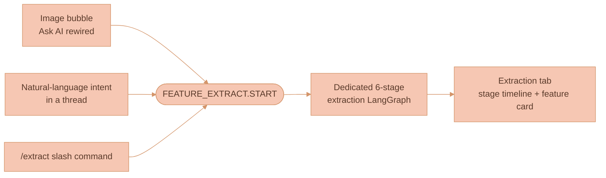
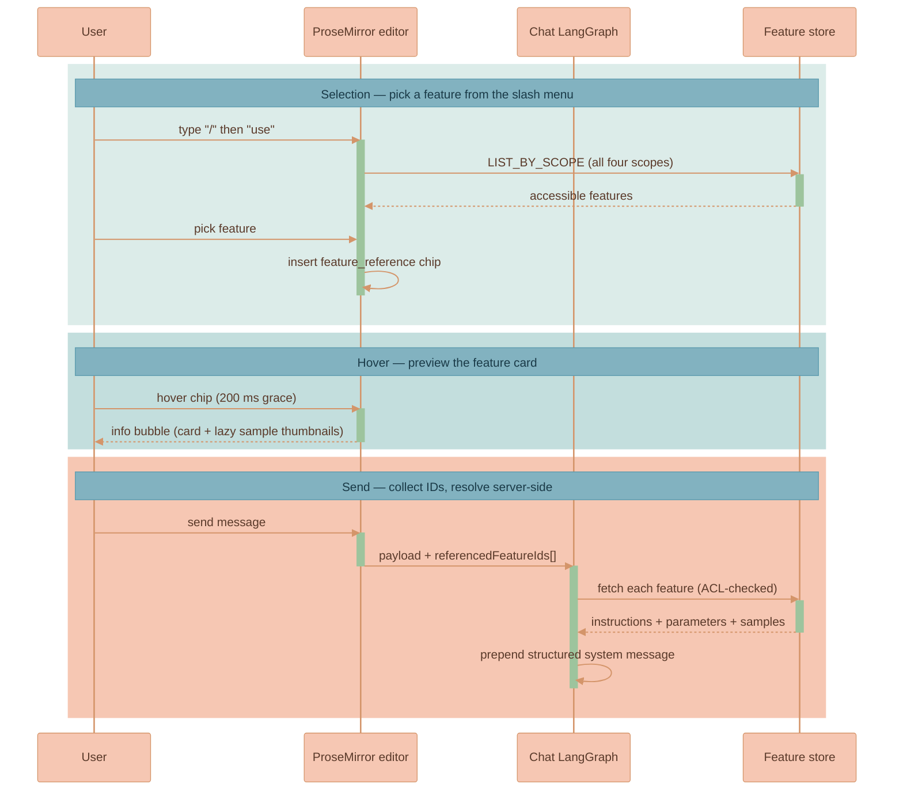

# Using Features

A **feature** is a reusable, scoped library entry that captures the essence of
one visual abstraction — a painting style, a colour palette, a mood, a lighting
setup, a character design — extracted from one or more reference inputs. This
page covers the day-to-day operator surface: the three ways to *create* a
feature, the `/use` path that *applies* one to a prompt, what the user watches
while extraction runs, and the scope model that controls who can see it.

What a feature *is* (the field model and worked examples) lives in
[Feature Extraction Overview](./FEATURE-EXTRACTION-OVERVIEW.md); how it is
*built* (the six-stage pipeline) lives in
[Extraction Pipeline](./EXTRACTION-PIPELINE.md); how it is *stored and resolved*
lives in [Feature Storage](./FEATURE-STORAGE.md). The panel and tab mechanics
referenced throughout are owned by
[Chat Panel and Sessions](../ai-chat/CHAT-PANEL-AND-SESSIONS.md).


The three entry points and the `/use` picker all read and write *features*, but
the panel surface, tab strip, keyboard shortcuts, and Sessions list they live in
are documented once in
[Chat Panel and Sessions](../ai-chat/CHAT-PANEL-AND-SESSIONS.md). This page does
not re-explain them.


## Entry points: how extraction is triggered

There are three ways to start an extraction. All three converge on the same
dedicated six-stage extraction LangGraph and produce a feature the same way —
they differ only in where the user is standing and how the source context is
gathered.

| Entry point | Where the user is | How source context is gathered |
|---|---|---|
| Image bubble "Ask AI" | A selected image node on the canvas | The image's `nats-obj://` URL plus directly-upstream connected nodes via `findConnectedNodes` |
| Natural-language intent | Typing inside any chat thread | The thread's connected context, with the user's phrase carried as `intent` |
| `/extract` slash command | Any prompt input | The current thread's full edge-graph context via `extractConnectedContext`, with post-command text as the seed |

### 1. Image bubble "Ask AI" button (rewired)

The image bubble's "Ask AI" handler — in
[`WorkspaceCanvas.ts`](../../services/web-ui/src/infographics/workspace/WorkspaceCanvas.ts)
`initCanvasBubbleMenu` — is wired directly to feature extraction. Clicking the
wand:

1. Creates an `ExtractionRun` record via a NATS request
   (`AI_INTERACTION_SUBJECTS.FEATURE_EXTRACT.START`).
2. Opens a new `extraction` tab in the AI chat panel referencing the new
   `extractionRunId`.
3. Starts the LangGraph extraction with the source image's `nats-obj://` URL as
   input — plus any directly-upstream connected nodes via the existing
   `findConnectedNodes` traversal, so wired docs and threads are also factored
   in.
4. Leaves source canvas state otherwise untouched — no new canvas node or edge
   is created.

The bubble menu definition file
[`canvasBubbleMenuItems.ts`](../../services/web-ui/src/infographics/workspace/canvasBubbleMenuItems.ts)
does not change — it just re-fires `callbacks.onAskAi(activeNodeId)`. The
behaviour swap is entirely in the callback body. The `magicIcon` and the "Ask
AI" label are kept (the UX intent — invoke AI on this artifact — is unchanged);
the tooltip becomes "Ask AI · Extract feature."

### 2. Natural language inside any thread

The chat agent does **not** call an `extract_feature` tool — that was the v0
design and is removed (see
[Feature Storage](./FEATURE-STORAGE.md#extract_feature-removed-from-the-chat-graph)).
Instead, a lightweight chat-level intent classifier (regex plus a small keyword
vocabulary on the user's last message) detects extraction intent — "save this
style", "extract the palette" — and publishes
`AI_INTERACTION_SUBJECTS.FEATURE_EXTRACT.START` with the connected context as
references and the user's natural-language string as `intent`. The dedicated
six-stage extraction LangGraph runs server-side; a feature card streams back
into the chat thread as an embedded block when extraction completes.

### 3. `/extract` slash command

Typing `/extract` in any prompt input opens a new `extraction` tab in the panel.
The new tab inherits the current thread's full edge-graph context (connected
images, docs, and upstream threads via the existing `extractConnectedContext`)
and seeds the extraction with whatever text the user typed after `/extract` as
the request. Submitting in the new tab runs the extraction. The original thread
is untouched.

## Applying features via `/use`

This is the daily-use path that earns a feature its keep. Typing `/use
my-watercolor` in any prompt should feel as natural as @-mentioning a coworker.

1. **Open the slash menu.** The user types `/` in any prompt input → the
   existing
   [`slashCommandsMenuPlugin`](../../services/web-ui/src/components/proseMirror/plugins/slashCommandsMenuPlugin/)
   opens its filter menu (it already supports filtering, arrow-key navigation,
   Enter/Tab to select, and Esc / click-out to dismiss — see its
   [README](../../services/web-ui/src/components/proseMirror/plugins/slashCommandsMenuPlugin/README.md)).
2. **Pick a feature.** Selecting `/use` swaps the menu for a feature picker — a
   flat, scrollable list of accessible features. Each row shows an icon, a
   category badge, the name, a one-line summary, and a scope chip (Workspace /
   Mine / Org / Public). The three most recent features are pinned at the top,
   and the list filters as the user types after `/use`. Source data is
   `FEATURE_SUBJECTS.LIST_BY_SCOPE`, aggregated across all four scopes (paged for
   `public`).
3. **Insert the chip.** Picking a feature inserts a **`feature_reference` inline
   node** at the slash position. The chip is a small pill (`@loose-watercolor`)
   styled to be obviously highlighted — per the explicit requirement that *"it
   would be obvious that the feature was used"* — and colour-coded by category.
4. **Hover for the info bubble.** Hovering the chip after a 200 ms grace opens a
   hover info bubble (reusing the existing
   [`components/infoBubble/`](../../services/web-ui/src/components/infoBubble/)).
   The bubble shows the feature card: name, category badge, summary, tags,
   sample thumbnails (lazy-loaded via the `GET /api/features/:id/samples/:idx`
   route), and an "Open in Library" link. It is cached per `featureId` for the
   editor session, so the second hover is instant.
5. **On send, collect IDs.** When the user sends, the client walks the
   ProseMirror JSON, collects every `feature_reference` node ID, and includes
   them as a separate `referencedFeatureIds: string[]` field on the outgoing
   `AiInteractionChatSendMessagePayload`. The visible message text retains the
   feature names (so the LLM has a textual hook), but the authoritative
   reference is the ID list.
6. **The server resolves by ID.** A `resolveFeatures` LangGraph pre-stage
   (inserted before `validateRequest`) fetches each referenced feature from
   DynamoDB — ACL-checked against the requester — downloads the relevant samples
   from the NATS Object Store, and prepends a structured system message
   containing the features' instructions, parameters, and base64-encoded
   samples. The LLM sees authoritative, current feature data on every send.

### Why server-resolved by ID, not client-injected text

The chip carries only an **ID**; the server expands it. Three reasons:

- **Messages don't bloat.** A feature with three samples could be hundreds of
  KB; multiplying that across every chip in every message would clog persistence
  and the wire.
- **Edits propagate retroactively.** Editing a feature improves every future
  invocation — the user's growing taste applies to all past chips automatically,
  with no re-typing.
- **ACL is enforced on every send.** Demoting a feature from `public` to
  `workspace` immediately revokes access for non-members, because the check runs
  server-side at resolution time rather than being baked into old message text.


The mechanics of `resolveFeatures` — the LRU cache, the structured
system-message format, sample partitioning by `kind`, and the strict
anti-leakage instruction — are documented in
[Feature Storage](./FEATURE-STORAGE.md#resolvefeatures-always-on-pre-stage).


## What the user sees in the extraction tab

While an extraction runs, the user watches it in an `extraction` tab. The tab
operates at the same message abstraction as a normal chat thread: the user's
request is inserted into the visible history, then a single assistant response
carries the live progress, reasoning, and final feature card.


The tab strip, tab lifecycle, keyboard shortcuts, persistence, and the Sessions
list are owned by
[Chat Panel and Sessions](../ai-chat/CHAT-PANEL-AND-SESSIONS.md). This section
covers only the *feature-specific content* rendered inside an extraction tab.


The feature-specific content is:

1. **User message.** Shows the exact extraction request the user submitted,
   using the same `ai-user-message` visual structure as normal chat history.
2. **Assistant response with a stage timeline.** The assistant response uses the
   normal `ai-response-message` structure. Inside it, the static four-step strip
   of v0 (`Analyzing input` → `Extracting essence` → `Generating samples (n)` →
   `Saving to library`) is replaced by a **stage-aware timeline** that renders
   one row per `StageTraceEvent` as it streams in. Each row shows the stage name,
   the model name, the duration, the status (spinner / check / failed), and an
   expandable detail panel with the prompt preview and output summary. The user
   can see exactly what model ran what prompt for how long.
3. **Agent reasoning.** The streamed transcript renders inside the assistant
   response. Adaptive-thinking models stream visible reasoning during the router
   and synthesis stages. The reasoning panel can be collapsed independently, but
   it is not a substitute for per-step details.
4. **Final feature card.** When the special `feature_card` block streams in at
   completion, it shows the name, a category badge, a scope chip (Workspace by
   default), the summary, tags as pills, sample thumbnails, and action buttons:
   `Open in Library`, `Change scope`, `Edit`, `Delete`. An expandable "Show
   pipeline trace" panel lists every `StageTraceEvent` row.

## Feature scope and sharing model

Every feature has a **scope** that controls who can see it. There are four
levels, in order of openness; `workspace` is the default.

| Scope | Visibility | Default? |
|---|---|---|
| `workspace` | Everyone with access to that specific workspace | Yes — extracted features are workspace-local by default |
| `user` | Only the owner, visible across all their workspaces (their private library) | No — the user promotes |
| `organization` | Everyone in the owner's organization, across all org workspaces | No |
| `public` | Anyone authenticated to Lixpi (community-shared, instant publish) | No |

**Promotion is one click** in the feature card. Promoting to `public` shows a
confirmation modal explaining that anyone can find it. **Demotion** (e.g. from
`public` back to `workspace`) breaks `/use` chips for users who lost access —
those references gracefully degrade to "feature no longer available" at
resolution time. This is the same UX as accidentally deleting a referenced
image; feature content is deliberately never snapshotted into messages.

### Public moderation: instant publish plus community reports

Public scope is **instant publish with community-driven reports** — there is no
pre-publication review gate.

- Any user can flag a public feature via the `Report` button on its card.
- The `FEATURE_SUBJECTS.REPORT_ABUSE` handler increments `reportCount`. When
  `reportCount >= REPORT_THRESHOLD` (configurable, default 5), the feature's
  `status` flips from `'active'` to `'reported'`, and `LIST_BY_SCOPE` queries for
  `public` exclude reported features.
- Restoration (false-positive reports, etc.) is a manual DB operation today; an
  admin moderation UI is parked for later.


Instant publish plus community reports covers the **data path**, but the
**policy layer** is incomplete: there is no admin review UI, no appeal mechanism,
and no takedown flow for legal / copyright / CSAM concerns. These need to land
before public scope is widely advertised. See the known limitations in
[Feature Storage](./FEATURE-STORAGE.md#known-limitations-and-trade-offs).


### Discovery

**Public discovery** is a simple GSI scan on the `byScopeAndOwner` index with
partition `public#public`, sorted by `updatedAt`. A real search index
(OpenSearch / Algolia) is deferred until discovery patterns are clearer.

## Where features are browsed and persisted

- The **Media Library panel** is the canvas-owned surface where extracted
  features live (in its `Features` category) alongside explicitly saved images.
  It is authoritative for the saved-media panel UI — see
  [Media Library](./MEDIA-LIBRARY.md). (An earlier "Feature Library panel"
  design is superseded by it.)
- The **storage tables, the `resolveFeatures` internals, and the LangGraph
  topology** are documented in [Feature Storage](./FEATURE-STORAGE.md).
- The **field model and worked extraction examples** are in
  [Feature Extraction Overview](./FEATURE-EXTRACTION-OVERVIEW.md).
