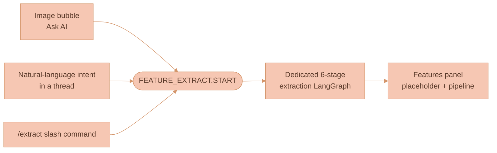

# Using Features

A **feature** is a reusable, scoped library entry that captures the essence of
one visual abstraction — a painting style, a colour palette, a mood, a lighting
setup, a character design — extracted from one or more reference inputs. This
page covers the day-to-day operator surface: the three ways to *create* a
feature, the `/use` path that *applies* one to a prompt, what the user watches
while extraction runs, and the scope model that controls who can see it.

What a feature *is* (the field model and worked examples) lives in
[Feature Extraction Overview](./FEATURE-EXTRACTION-OVERVIEW.md); how it is
*built* (the six-stage pipeline) lives in
[Extraction Pipeline](./EXTRACTION-PIPELINE.md); how it is *stored and resolved*
lives in [Feature Storage](./FEATURE-STORAGE.md). The panel and tab mechanics
referenced throughout are owned by
[Chat Panel and Sessions](../ai-chat/CHAT-PANEL-AND-SESSIONS.md).


The three entry points and the `/use` picker all read and write *features*, but
the panel surface, tab strip, keyboard shortcuts, and Sessions list they live in
are documented once in
[Chat Panel and Sessions](../ai-chat/CHAT-PANEL-AND-SESSIONS.md). This page does
not re-explain them.


## Entry points: how extraction is triggered

There are three ways to start an extraction. All three converge on the same
dedicated six-stage extraction LangGraph and produce a feature the same way —
they differ only in where the user is standing and how the source context is
gathered.

| Entry point | Where the user is | How source context is gathered |
|---|---|---|
| Image bubble "Ask AI" | A selected image node on the canvas | The image's `asset://<assetId>` reference plus directly-upstream connected nodes via `findConnectedNodes` |
| Natural-language intent | Typing inside any chat thread | The thread's connected context, with the user's phrase carried as `intent` |
| `/extract` slash command | Any prompt input | The current thread's full edge-graph context via `extractConnectedContext`, with post-command text as the seed |

### 1. Image bubble "Ask AI" button

The image bubble's "Ask AI" handler — in
[`WorkspaceCanvas.ts`](../../services/web-ui/src/infographics/workspace/WorkspaceCanvas.ts)
`initCanvasBubbleMenu` — is wired directly to feature extraction. Clicking the
wand:

1. Creates a local pending extraction placeholder with a client-generated
   `extractionRunId`, the source image's Asset ID, and directly-upstream
   connected context gathered through the existing context traversal. This
   placeholder is not persisted.
2. Opens the right-side panel on the `Features` surface and selects a placeholder
   extracted-feature row for that run.
3. Shows a confirmation section explaining that the user must confirm extraction,
   with dedicated Reasoning model and Image model selectors for this extraction run.
4. On confirmation, persists the API-owned extraction run with that model config,
   publishes `AI_INTERACTION_SUBJECTS.FEATURE_EXTRACT.START`, and streams the
   LangGraph pipeline into the placeholder row's inspector.
5. Replaces the placeholder workflow with the saved Feature row when the backend
   publishes the created Feature event.
6. Leaves source canvas state otherwise untouched — no new canvas node or edge
   is created.

The bubble menu definition file
[`canvasBubbleMenuItems.ts`](../../services/web-ui/src/infographics/workspace/canvasBubbleMenuItems.ts)
fires `callbacks.onAskAi(activeNodeId)`. The `WorkspaceCanvas.ts` callback owns
the source-context snapshot, placeholder creation, panel selection, and
confirmation-to-start handoff.

### 2. Natural language inside any thread

The chat agent does **not** call an `extract_feature` tool — that was the v0
design and is removed (see
[Feature Storage](./FEATURE-STORAGE.md#extract_feature-removed-from-the-chat-graph)).
Instead, a lightweight chat-level intent classifier (regex plus a small keyword
vocabulary on the user's last message) detects extraction intent — "save this
style", "extract the palette" — and publishes
`AI_INTERACTION_SUBJECTS.FEATURE_EXTRACT.START` with the connected context as
references and the user's natural-language string as `intent`. The dedicated
six-stage extraction LangGraph runs server-side; the feature run is visible in
the `Features` surface while progress streams and when the feature card arrives.

### 3. `/extract` slash command

Typing `/extract` in any prompt input opens the right-side panel on the
`Features` surface with a pending extraction placeholder. The placeholder uses
the selected context snapshot when one is available and starts only after the
user confirms the extraction. The original thread is untouched.

## Applying features via `/use`

This is the daily-use path that earns a feature its keep. Typing `/use
my-watercolor` in any prompt should feel as natural as @-mentioning a coworker.

1. **Open the slash menu.** The user types `/` in any prompt input → the
   existing
   [`slashCommandsMenuPlugin`](../../services/web-ui/src/components/proseMirror/plugins/slashCommandsMenuPlugin/)
   opens its filter menu (it already supports filtering, arrow-key navigation,
   Enter/Tab to select, and Esc / click-out to dismiss — see its
   [README](../../services/web-ui/src/components/proseMirror/plugins/slashCommandsMenuPlugin/README.md)).
2. **Pick a feature.** Selecting `/use` swaps the menu for a feature picker — a
   flat, scrollable list of accessible features. Each row shows an icon, a
   category badge, the name, a one-line summary, and an Organization scope chip.
   The three most recent features are pinned at the top,
   and the list filters as the user types after `/use`. Source data is
   `FEATURE_SUBJECTS.LIST_BY_SCOPE` for the active Workspace's organization.
3. **Insert the chip.** Picking a feature inserts a **`feature_reference` inline
   node** at the slash position. The chip is a small pill (`@loose-watercolor`)
   styled to be obviously highlighted — per the explicit requirement that *"it
   would be obvious that the feature was used"* — and colour-coded by category.
4. **Hover for the info bubble.** Hovering the chip after a 200 ms grace opens a
   hover info bubble (reusing the existing
   [`components/infoBubble/`](../../services/web-ui/src/components/infoBubble/)).
   The bubble shows the feature card: name, category badge, summary, tags,
   sample thumbnails (lazy-loaded via the `GET /api/features/:id/samples/:idx`
   route), and an "Open in Library" link. It is cached per `featureId` for the
   editor session, so the second hover is instant.
5. **On send, collect IDs.** When the user sends, the client walks the
   ProseMirror JSON, collects every `feature_reference` node ID, and includes
   them as a separate `referencedFeatureIds: string[]` field on the outgoing
   `AiInteractionChatSendMessagePayload`. The visible message text retains the
   feature names (so the LLM has a textual hook), but the authoritative
   reference is the ID list.
6. **The server resolves by ID.** A `resolveFeatures` LangGraph pre-stage
   (inserted before `validateRequest`) fetches each referenced feature from
   DynamoDB — ACL-checked against the requester — downloads the relevant samples
   from the NATS Object Store, and prepends a structured system message
   containing the features' instructions, parameters, and base64-encoded
   samples. The LLM sees authoritative, current feature data on every send.

### Why server-resolved by ID, not client-injected text

The chip carries only an **ID**; the server expands it. Three reasons:

- **Messages don't bloat.** A feature with three samples could be hundreds of
  KB; multiplying that across every chip in every message would clog persistence
  and the wire.
- **Edits propagate retroactively.** Editing a feature improves every future
  invocation — the user's growing taste applies to all past chips automatically,
  with no re-typing.
- **Organization access is enforced on every send.** Leaving or losing access to
  the owning organization immediately prevents resolution, because the check
  runs server-side rather than being baked into old message text.


The mechanics of `resolveFeatures` — the LRU cache, the structured
system-message format, sample partitioning by `kind`, and the strict
anti-leakage instruction — are documented in
[Feature Storage](./FEATURE-STORAGE.md#resolvefeatures-always-on-pre-stage).


## What the user sees during extraction

While an extraction runs, the user watches it in the `Features` surface. The
run starts as a local placeholder feature row before the backend begins; the
inspector shows the confirmation section, then replaces it with the live
pipeline after the user confirms. Unconfirmed placeholders are not persisted as
extraction sessions.


The right-side panel shell, top-level surface switch, and persisted panel state
are covered in
[Chat Panel and Sessions](../ai-chat/CHAT-PANEL-AND-SESSIONS.md). This section
covers only the feature-specific content rendered inside the `Features` surface.


The feature-specific content is:

1. **Placeholder row.** Shows the pending feature immediately in the Features
   list, with a status chip such as `Needs confirmation`, `Analyzing`, or
   `Saving`.
2. **Confirmation section.** Explains that extraction analyzes the selected
   source and connected context, generates source-safe samples, and saves a
   organization Feature.
3. **Stage-aware timeline.** Renders one row per `StageTraceEvent` as it streams
   in. Each row shows the stage name, the model name, the duration, the status,
   and an expandable detail panel with the prompt preview and output summary.
4. **Agent reasoning.** Adaptive-thinking models stream visible reasoning during
   the router and synthesis stages under the active stage.
5. **Final feature card.** When the special `feature_card` block streams in at
   completion, it shows the name, a category badge, an Organization scope chip,
   default), the summary, tags as pills, and sample thumbnails. The saved Feature
   row appears in the library from the created Feature event.

## Feature scope

Extracted Features are organization scoped. Any member of the owning
organization can list and resolve them from any Workspace in that organization;
only the Feature owner can update or delete the record. The `shared` type value
is reserved for a future external-sharing design and has no runtime or UI path.

`Features-Meta` is queried by its `organization#<organizationId>` primary-key
partition and sorted in memory by `updatedAt`. The active model adds no Feature
GSI and exposes no public discovery or moderation path.

## Where features are browsed and persisted

- The **right side panel** is the canvas-owned surface where extracted features
  live: its top-level switch selects the `Features` surface, the `Media` surface
  (saved images and videos colocated), or `AI Threads`. See
  [Media Library](./MEDIA-LIBRARY.md). (An earlier "Feature Library panel"
  design is superseded by it.)
- The **storage tables, the `resolveFeatures` internals, and the LangGraph
  topology** are documented in [Feature Storage](./FEATURE-STORAGE.md).
- The **field model and worked extraction examples** are in
  [Feature Extraction Overview](./FEATURE-EXTRACTION-OVERVIEW.md).
