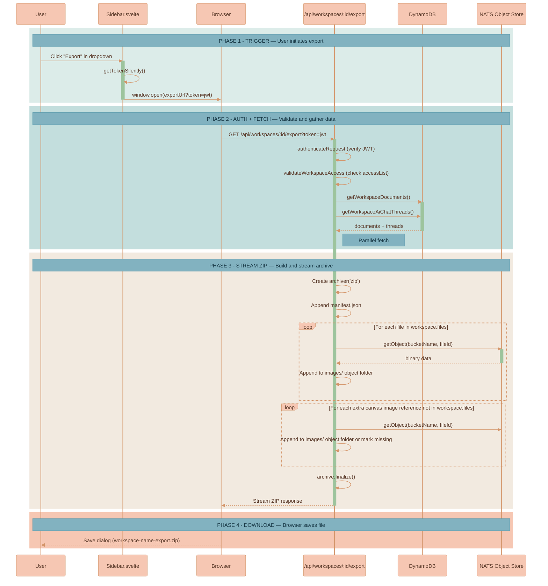
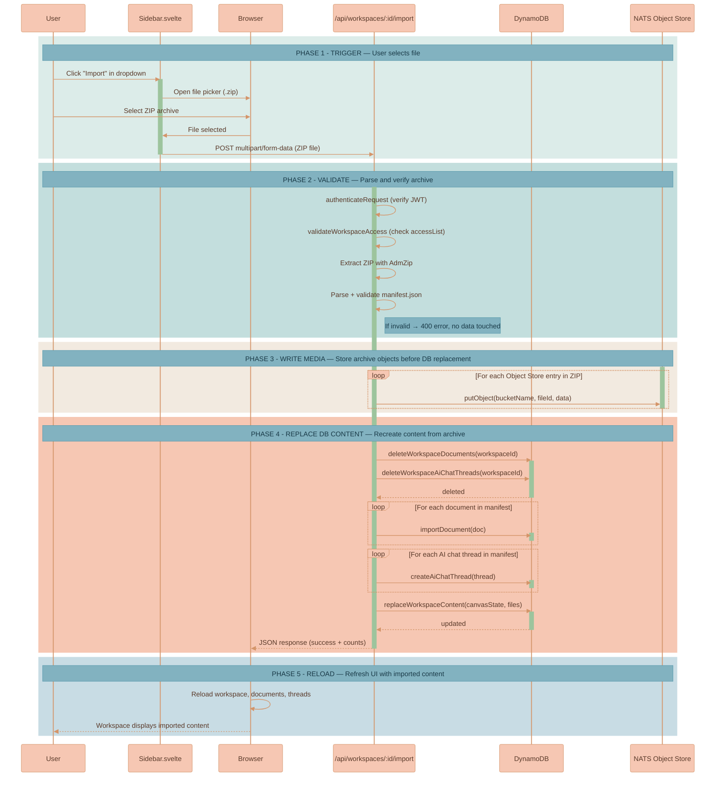

# Workspace Export & Import

Export a complete workspace backup as a downloadable ZIP archive, or import a previously exported archive to replace all content in an existing workspace.


This page is part of the feature library domain. The canvas-state and document model that export serializes and import restores — `CanvasState`, `CanvasNode`, documents, and files — is defined in [Workspace Model](../canvas/WORKSPACE-MODEL.md).


## Overview

The export is triggered from the workspace dropdown menu in the sidebar. It streams a ZIP archive directly from the API to the browser — no temporary files are written to disk.

- **Endpoint**: `GET /api/workspaces/:workspaceId/export`
- **Route file**: [`services/api/src/routes/workspace-export-routes.ts`](../../services/api/src/routes/workspace-export-routes.ts)
- **UI trigger**: "Export" item in [`Sidebar.svelte`](../../services/web-ui/src/components/Sidebar.svelte) dropdown menu

## Export Contents

The ZIP archive has the following structure:

```text
workspace-export.zip
├── manifest.json          # Workspace metadata + all text content
├── images/                # Export-version-1 Object Store entries
│   ├── {fileId}.png
│   ├── {fileId}.mp4
│   ├── {fileId}.pdf
│   └── ...
└── missing-images.json    # Present only when referenced bytes were missing at export time
```

`images/` is the export-version-1 object directory name. It is not limited to image media; entries are workspace Object Store objects named by `fileId` and extension, including uploaded/generated images, MP4s, audio, PDFs, posters, representative frames, and canonical converted derivatives when they are part of the exported object set.

**manifest.json** contains:

```typescript
{
    exportVersion: 1,
    exportedAt: string,                // ISO 8601 timestamp
    workspace: {
        workspaceId: string,
        name: string,
        canvasState: CanvasState,       // Viewport, nodes, edges
        files: DocumentFile[],          // File metadata (id, name, mimeType)
        createdAt: number,
        canvasStateUpdatedAt: number,   // Canvas save token
        updatedAt: number,
    },
    documents: Document[],             // All documents (latest revisions)
    aiChatThreads: AiChatThread[],     // All AI chat threads with messages
}
```

## Export Flow



## Export Implementation Details

- **Streaming**: The ZIP is streamed directly to the HTTP response using the `archiver` npm package — no temporary files are written to disk.
- **Auth**: Supports JWT via query parameter (`?token=`) since the download is triggered via `window.open()`, which cannot set Authorization headers. Also supports `Authorization: Bearer` header.
- **File naming**: Object Store entries are stored as `images/{fileId}{extension}` where the extension is derived from the file's MIME type or original filename.
- **Coverage**: Export starts from `workspace.files[]` and also includes canvas image-node references that are missing from the file registry, so older desynced image nodes have a chance to survive portability.
- **Missing bytes report**: Object fetch failures are logged and recorded in `missing-images.json` with the missing `fileId`s. The ZIP still streams, but the report is a data-loss signal; importing an archive that lacks manifest or canvas-referenced object entries is rejected.
- **Compression**: Uses zlib level 5 (balanced speed/size).

### Export Dependencies

| Package | Purpose |
|---------|---------|
| `archiver` | ZIP archive creation and streaming |
| `@types/archiver` | TypeScript types (dev) |

---

## Workspace Import

Import a previously exported ZIP archive into an existing workspace, replacing the workspace content with the archive while keeping workspace identity (ID, name, access list) intact.

### Import Overview

The import is triggered from the workspace dropdown menu in the sidebar. It opens a file picker for the user to select a `.zip` archive. The file is uploaded to the API, which validates the archive, writes archive media objects into the workspace bucket, then replaces documents, threads, canvas state, and file metadata from the manifest.

- **Endpoint**: `POST /api/workspaces/:workspaceId/import`
- **Route file**: [`services/api/src/routes/workspace-export-routes.ts`](../../services/api/src/routes/workspace-export-routes.ts)
- **UI trigger**: "Import" item in [`Sidebar.svelte`](../../services/web-ui/src/components/Sidebar.svelte) dropdown menu

### Import Strategy

The import follows a **validate-first, write media, replace database content** approach:

1. **Parse** — Extract the ZIP and read `manifest.json` entirely in memory
2. **Validate** — Check export version, required fields, document/thread arrays, and Object Store entries referenced by the manifest and canvas state. If invalid, return 400 — no data is touched
3. **Write media** — Write archive media objects into the existing workspace Object Store bucket, creating the bucket only when it is absent
4. **Replace database content** — Delete workspace documents and AI chat threads, recreate them from the manifest, and update workspace canvas state + files array

The import does not destroy the workspace Object Store bucket. Objects that are not referenced by the imported workspace may remain as storage orphans until workspace deletion, which is safer than deleting the whole bucket before restore. Documents and threads are queried by `workspaceId` and each record is deleted individually.


Import must not recreate canvas media nodes whose Object Store bytes are absent from the archive. The importer validates both `manifest.workspace.files[]` and the object keys referenced by `canvasState` before deleting existing workspace content. A missing object returns 400 and leaves the workspace untouched.



Import is destructive for workspace documents, AI chat threads, canvas state, and file metadata. Validation runs **first** — an invalid or incomplete archive returns a 400 with zero data loss — but a valid archive replaces the workspace's persisted content wholesale. Existing Object Store bytes are not bucket-wiped during import.


### Import Behavior

- **Workspace identity preserved**: The workspace's ID, name, `accessType`, and `accessList` remain unchanged. Only content (canvas state, documents, threads, and file metadata) is replaced.
- **Document IDs preserved**: Original document IDs from the export are reused so canvas node references (which store document IDs) remain valid without remapping.
- **`workspaceId` overridden**: Documents and threads from the manifest receive the target workspace's ID — an export from one workspace can be imported into a different workspace.
- **Cross-workspace import**: Since `workspaceId` is overridden, a user can export from workspace A and import into workspace B.

### Import Flow



### Import Implementation Details

- **In-memory extraction**: The ZIP is buffered by `multer` and extracted with `adm-zip` — no temporary files on disk.
- **Auth**: Uses `Authorization: Bearer` header (standard `fetch` POST, not `window.open`).
- **Validation-first**: The archive is fully parsed and validated before existing database content is deleted. Invalid or incomplete archives produce a 400 error with zero data loss.
- **Object Store handling**: Archive media is written into the workspace bucket before database replacement. The import path does not bucket-wipe workspace media; unreferenced old objects may remain as storage orphans until workspace deletion.
- **Dangling-reference guard**: The importer rejects archives missing any `workspace.files[]` object or any object key returned by `Workspace.getCanvasStateReferencedFileIds()`. New media node fields must be added to that collector before they are persisted.
- **File size**: Accepts uploads up to 1GB via multer memory storage.
- **Post-import reload**: The frontend automatically reloads workspace data, documents, and AI chat threads if the imported workspace is currently open.

#### Import Dependencies

| Package | Purpose |
|---------|---------|
| `adm-zip` | ZIP archive extraction in memory |
| `@types/adm-zip` | TypeScript types (dev) |
| `multer` | Multipart file upload handling |
