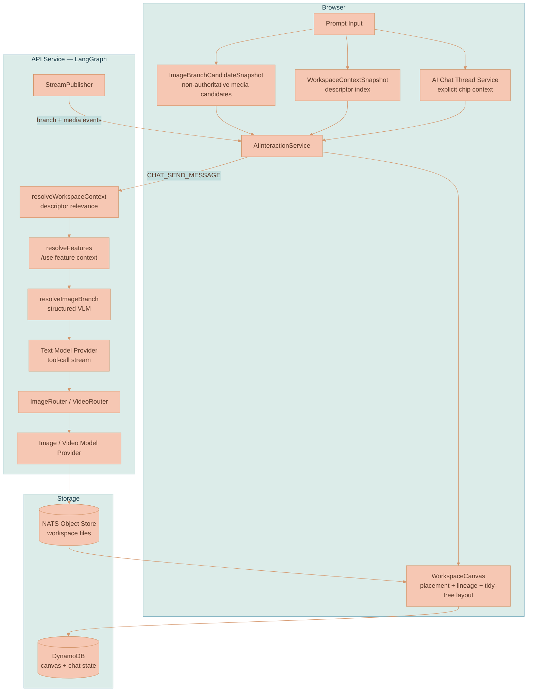
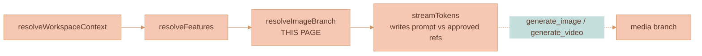
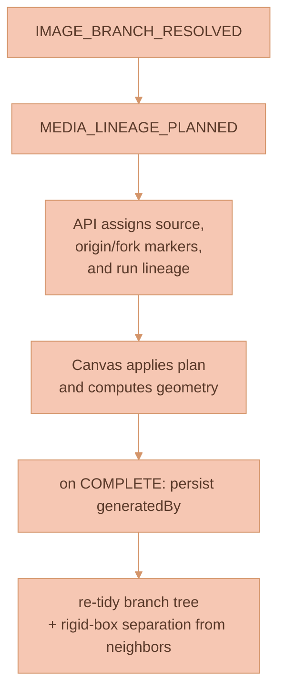

# Branch Lineage & Provenance

Branch Lineage makes AI-generated **images and videos** first-class canvas artifacts with explicit parentage, branch identity, visual summaries, canvas placement, and resolver audit metadata. It is the machinery that lets Lixpi answer visual follow-up prompts such as *"that guy,"* *"the goat,"* *"this one,"* or *"in the style of that landscape painting"* without guessing from text alone — and that decides where each new artifact lands on the canvas and which prior artifact (if any) it descends from.

The one rule everything else follows: when a media model is selected, generated-media reference routing is always resolved by a structured **vision-language model (VLM)** call in the API *before* the text model writes the generation prompt. The browser builds a candidate snapshot, but the browser never decides which references reach the image or video model. The API-side VLM resolution is the routing authority.


**This page is modality-agnostic.** Everything here — candidate snapshots, the `resolveImageBranch` resolver, the references-vs-lineage distinction, canvas placement, the balanced branch-tree layout, and progress outlines — applies to **both image and video generation**. The resolver gate runs when an image **or** a video model is selected. A video participates by contributing a **single representative still** (its mid-frame, falling back to the poster); the MP4 is never sent to the resolver. The per-modality deltas live in [Image Generation](./IMAGE-GENERATION.md) and [Video Generation](./VIDEO-GENERATION.md); the shared LangGraph workflow lives in [AI Generation Pipeline](../platform/AI-GENERATION-PIPELINE.md).


This feature is part of Lixpi's artifact-piping architecture (see [Product Overview](../PRODUCT-OVERVIEW.md)): generated media become persistent canvas nodes that can be piped into later threads, reused as exact visual context, and branched into multiple edit directions.

## Core Concepts

**Branch** — A lineage of generated media nodes that represent edits or variants of the same visual artifact. Descendants share a `branchId` when the VLM resolves a prompt as continuing an existing target.

**Parent Media** — The generated media node selected as the edit parent for a new generation. Stored as API-assigned `generatedBy.parentMediaNodeId`; `generatedBy.parentImageNodeId` is a schema alias and must not drive browser topology.

**Base Context** — Images, videos, documents, and thread content force-included through workspace edges, explicit panel context chips, or automatic workspace relevance. Base context narrows candidates and can also be selected by the VLM as visual reference material. See [Context Relevance](../ai-chat/CONTEXT-RELEVANCE.md).

**Candidate Snapshot** — A deterministic, browser-built list of labeled media candidates. It carries canvas node IDs, file IDs, branch hints, ancestor hints, source-context IDs, prompt snippets, thread-transcript labels, and `nats-obj://` still-image URLs. It is *useful context, not a decision.* Candidates include both image and video nodes; a video contributes its representative still plus a `mediaKind` flag, so an edit to a prior video continues that video's branch at the same per-candidate cost as an image.

**Structured VLM Resolver** — The API-side `resolveImageBranch` LangGraph node. It shows the user prompt plus labeled candidate stills to a vision-language model and requires strict JSON describing target, base-context, style-reference, comparison-target, and excluded roles.

**Reference Image Set** — The exact `referenceImageNodeIds` returned by the VLM. These are the only candidate references inserted into the provider message that downstream `extractReferenceImages()` and the media routers use.

**Resolver Audit Metadata** — The resolver model provider, model ID, confidence, rationale, excluded node IDs, operation kind, visual summaries, and schema version, persisted on generated-media metadata for later candidate labeling and debugging.

**Branch Root** — The first generated image/video of a `branchId`. It normally carries the originating prompt, references, and visual summaries on its own `generatedBy` metadata, and its info panel reconstructs them. Fresh requests that need a neutral root marker persist a `branchOrigin`; reasoning-fanout requests use one `branchFork` per reasoning run, and a parentless fork is the visible root marker when no lineage source exists. These markers open generated branch provenance/details panels below the marker and are never treated as chat context.

**Branch Fork** — A reusable lineage split marker inside a branch tree. A `branchFork` node represents a deliberate child lineage under the user current lineage source, such as one fork per reasoning model in a multi-reasoning media request. It renders as the same circular lineage chrome as a branch origin, using `branchForkfIcon`, opens generated branch provenance scoped to its own generated descendants, and is never treated as chat context.

**Lineage Source** — A *verified connector parent.* References, style images, uploaded/source media, and workspace-relevance selections can guide routing or placement, but they do not become connector parents. A media node can be the lineage source only when it is already an AI-generated branch member selected by the API as a continuation target; otherwise the API roots the request on a chat thread or an API-planned `branchOrigin` marker.

**Placement Anchor** — A media node used only to *position* a fresh/reference-only generation on the canvas. Placement anchors and reference IDs are context; they never create connector parentage.

## Why This Exists

Branch routing is a **visual reference-grounding problem, not a string-parsing problem.** A user can create a portrait branch, create or reference a landscape painting, and then ask:

```text
draw a goat in the style of that landscape painting
```

The system must understand several visual roles at once:

- The goat is the requested new subject.
- The landscape painting is style evidence.
- Any existing generated portrait branch is unrelated and should not condition the model.

Regexes, latest-leaf heuristics, and prompt-derived tags all fail this class of problem because they do not inspect the pixels. A generated image can diverge from the original prompt, provider revised prompts may be empty, and natural-language references are often ambiguous until grounded against the visible candidates.

The earlier context-region "cloud" primitive bundled three jobs — visual grouping, chat ownership, and generation provenance — into one cage: a user had to gather items into a region or pin them before the AI could use them, even when another canvas item was obviously relevant. Sending the whole canvas as pixels does not scale either, because the VLM resolver is intentionally pixel-grounded and expensive per candidate.

Lixpi solves this by combining deterministic graph narrowing with VLM role assignment: **the graph determines which artifacts are plausible candidates; the VLM decides their visual roles.** Workspace relevance does the cheap descriptor-first narrowing first; `resolveImageBranch` remains the visual authority for media that actually reaches the model.

## Product Principles

- **VLM-grounded beats text-inferred.** If a reference decision affects pixels, a vision-language model must see the labeled visual candidates.
- **Graph narrows candidates; VLM assigns roles.** Deterministic code collects and labels candidate artifacts but does not select the target branch.
- **Context is selective.** Base context and generated variants have different roles. Only VLM-selected candidates become model references.
- **References are context, not lineage.** Reference/style media can anchor placement and progress outlines, but only verified lineage sources draw connector edges into generated outputs.
- **One decision feeds routing and provenance.** The references sent to the model, the generated metadata, and branch-root provenance all come from the resolver result.
- **No silent guessing.** Resolver failure is user-visible and *stops* generation instead of falling back to regexes, recency, or all-variant injection.
- **Feature extraction stays independent.** `/use` feature references resolve before branch resolution, and their injected feature image blocks are preserved by the branch resolver.
- **The root media is the branch unless a temporary marker is required.** The first generated image/video of a new branch carries its prompt and references on `generatedBy`. Continuations attach to the existing branch. Reasoning-fanout media requests add one `branchFork` marker per reasoning run so each reasoning run owns its generated descendants; multiple image/video models invoked by the same reasoning run share that reasoning fork. If no lineage source exists, that fork is the visible root marker.

## System Architecture

The browser builds non-authoritative candidate and workspace-context snapshots and sends them with the chat request. The API resolves visual roles, rewrites the provider messages with only the approved references, plans branch topology, streams the generation, and publishes branch + media events back. The browser applies the API lineage plan to canvas state and computes presentation geometry.

## Hard Frontend Boundary

Do not put branch-lineage decision logic in `services/web-ui`. The browser is allowed to render, animate, collect input, build non-authoritative snapshots, and compute layout. It is not allowed to decide branch IDs, `branchOrigin` creation, `branchFork` creation, lineage parentage, generated-media parent fields, model/fork fanout, resolver outcomes, or marker provenance.

Those decisions must be made in `services/api` and streamed or persisted through typed contracts such as `IMAGE_BRANCH_RESOLVED`, `MEDIA_LINEAGE_PLANNED`, and `MediaRunLineageAssignment`. This rule exists because lineage is distributed system state: multiple browsers, retries, reloads, and collaborators must converge on the same graph without relying on one client's local canvas state.

If a request uses an uploaded image, uploaded video, media-library item, style reference, or any other non-generated source as visual input, that item is a reference and placement anchor only. The API must create or reuse generated-media lineage structure separately; the browser must never draw generated-output lineage directly from that source media just because it was selected or included as a first frame/reference.



| Component | Responsibility |
|-----------|----------------|
| `ImageBranchCandidateSnapshot` | Browser-built, labeled, non-authoritative list of image/video-still candidates. |
| `WorkspaceContextSnapshot` | Browser-built descriptors-only index used to narrow candidates before resolution. |
| `resolveWorkspaceContext` | Ranks descriptors, force-includes chips/edges, narrows the media candidate set. See [Context Relevance](../ai-chat/CONTEXT-RELEVANCE.md). |
| `resolveImageBranch` | The structured VLM resolver — the routing authority for media references and branch identity. |
| `ImageRouter` / `VideoRouter` | Route the enhanced prompt + approved references to a transient media provider. See [AI Generation Pipeline](../platform/AI-GENERATION-PIPELINE.md). |
| `WorkspaceCanvas` | Applies API-declared lineage marker IDs, edges, and generated metadata, then computes canvas geometry and re-tidies the branch tree (via `branchTreeLayout.ts`). |

## Where This Runs in the Pipeline

`resolveImageBranch` is one node in the shared, provider-agnostic LangGraph workflow that every AI request flows through. It runs **after** workspace-context relevance and feature resolution, and **before** the text model streams — so the text model writes its generation prompt against the exact VLM-approved reference set.


The full graph (node order, `ProviderState`, the post-stream 3-way router, the routers, and the stream lifecycle) is documented once in [AI Generation Pipeline](../platform/AI-GENERATION-PIPELINE.md). The wire-level event catalog (`IMAGE_BRANCH_RESOLVED`, `IMAGE_BRANCH_RESOLUTION_ERROR`, `CONTEXT_RELEVANCE_RESOLVED`, and all `IMAGE_*` / `VIDEO_*` events) with payloads and browser handling is documented once in [Streaming and Events](../platform/STREAMING-AND-EVENTS.md). This page does **not** duplicate them — it covers only the resolver's own behavior and what the browser does with the result.


The node's gate behavior:

- It is a **no-op** when no media model is selected.
- When an image **or** video model is selected, it **requires** `imageBranchCandidateSnapshot`. A missing snapshot publishes `IMAGE_BRANCH_RESOLUTION_ERROR` and fails the graph visibly rather than guessing.



## Data Model

The shared contracts live in [`types.ts`](../../packages/lixpi/constants/ts/types.ts). The representation is intentionally split into **browser-built candidates**, **API-built resolutions**, and **persisted generated-media metadata**.

```typescript
export type ImageGenerationOperationKind =
    | 'new_image'
    | 'edit_existing'
    | 'style_transfer'
    | 'compare_branches'
    | 'fresh_branch'

export type ImageBranchSelectionMode =
    | 'context-only'
    | 'edit-active-branch'
    | 'all-branches'
    | 'fresh-branch'
    | 'ambiguous'

export type ImageBranchCandidateRoleHint =
    | 'base-context'
    | 'generated-variant'
    | 'branch-leaf'
    | 'branch-ancestor'
    | 'embedded-thread-image'
```

| Operation kind | Meaning |
|----------------|---------|
| `new_image` | A new subject, not a continuation of any existing branch. |
| `edit_existing` | An edit of a resolved target — continues that target's branch. |
| `style_transfer` | Applies style evidence; may or may not continue a branch. |
| `compare_branches` | Two or more existing leaves selected as comparison targets. |
| `fresh_branch` | A deliberately new, unrelated branch even when variants exist. |

| Selection mode | Meaning |
|----------------|---------|
| `context-only` | Only base/reference context is selected; no generated target. |
| `edit-active-branch` | Continues the active generated branch — a verified continuation signal. |
| `all-branches` | Multiple generated branches are in play (e.g. comparison). |
| `fresh-branch` | A new branch is minted. |
| `ambiguous` | The resolver could not decide — fails the request rather than guessing. |

| Role hint | Meaning |
|-----------|---------|
| `base-context` | Force-included context media (chip/edge/relevance). |
| `generated-variant` | A previously generated artifact. |
| `branch-leaf` | The latest tip of a generated branch. |
| `branch-ancestor` | An older node in a generated branch's lineage. |
| `embedded-thread-image` | An image recovered from the chat transcript. |

### Candidate Snapshot

`ImageBranchCandidateSnapshot` is created by [`ai-image-branching.ts`](../../services/web-ui/src/services/ai-image-branching.ts). It carries enough context for the VLM to inspect candidates, but it is not routing authority.

```typescript
export type ImageBranchCandidateImage = {
    nodeId: string
    fileId?: string
    workspaceId?: string
    imageUrl: string
    mediaKind?: 'image' | 'video'
    roleHints: ImageBranchCandidateRoleHint[]
    branchId?: string
    parentMediaNodeId?: string
    parentImageNodeId?: string
    ancestorNodeIds: string[]
    sourceContextNodeIds: string[]
    sourceMessageId?: string
    promptText?: string
    visualEntitySummary?: string
    visualStyleSummary?: string
    entityTags?: string[]
    styleTags?: string[]
    createdAt?: number
}

export type ImageBranchCandidateSnapshot = {
    resolverVersion: string
    threadId: string
    regionNodeId: string // current root/request anchor node id
    promptText: string
    promptFingerprint: string
    candidates: ImageBranchCandidateImage[]
    transcriptContext: string
}
```


A **video candidate** sets `mediaKind: 'video'` and uses its representative mid-frame still (falling back to the frame-0 poster) as `imageUrl`. This is what lets an edit of a prior video continue that video's branch — the resolver can finally *see* it — while keeping the VLM cost identical to an image: one frame, never the clip. See [Video Generation](./VIDEO-GENERATION.md) and [Media & Content Descriptors](../ai-chat/MEDIA-DESCRIPTORS.md).


### VLM Resolution

`ImageBranchVlmResolution` is produced only by the API resolver. It is streamed to the browser (as the `IMAGE_BRANCH_RESOLVED` payload) and used to rewrite provider messages.

```typescript
export type ImageBranchVlmResolution = {
    resolverKind: 'structured-vlm'
    resolverVersion: string
    resolverModelProvider: string
    resolverModelId: string
    mode: ImageBranchSelectionMode
    operationKind: ImageGenerationOperationKind
    targetImageNodeId: string | null
    parentImageNodeId?: string
    branchId: string | null
    includeGeneratedNodeIds: string[]
    referenceImageNodeIds: string[]
    sourceContextNodeIds: string[]
    styleReferenceNodeIds: string[]
    excludedNodeIds: string[]
    visualEntitySummary?: string
    visualStyleSummary?: string
    entityTags: string[]
    styleTags: string[]
    confidence: number
    rationale: string
    decisions: ImageBranchVlmReferenceDecision[]
}
```

### API Lineage Plan

`MediaBranchLineagePlan` is produced by the API after VLM resolution for media-enabled requests. It is streamed as `MEDIA_LINEAGE_PLANNED` and is the branch topology contract the browser applies. Matrix requests run the planner once in shared preflight; single media requests run it as the `planMediaBranchLineage` graph node.

The plan assigns:

- the branch ID,
- the verified lineage source or placement anchor,
- branch-origin marker ID and neutral root provenance when a fresh standalone request needs a visible root,
- branchFork marker IDs, parent marker/source IDs, and reasoning-run provenance,
- per-run `MediaRunLineageAssignment` entries copied into `generationRun.lineageAssignment`,
- generated-media `branchOriginNodeId`, `branchForkNodeId`, `parentMediaNodeId`, `parentImageNodeId` schema alias, selected references, operation kind, prompt text, prompt fingerprint, and created-at ordering.

The browser must not derive `branchOriginNodeId`, `branchForkNodeId`, `parentMediaNodeId`, lineage parent selection, or marker provenance from model counts, prompt text, selected nodes, local canvas state, existing connector edges, existing generated nodes, persisted alias fields, or DOM state. Branch forks are assigned per reasoning run by the API; media-model fanout under a reasoning run shares that fork. The browser may compute marker/media positions from the plan and the visible canvas.

If the API plan or the concrete `generationRun.lineageAssignment` is missing, incomplete, or inconsistent, generation must wait for the API event or fail visibly. Do not add fallback topology, compatibility shims, best-effort parent recovery, or provider/router assignment recovery. The fix belongs in the API planner, stream ordering, or data migration path.

### Persisted Generated Metadata

Generated media nodes store resolver output in `ImageGeneratedByMetadata` so future snapshots can label candidates with branch and visual-summary context. (Video generation persists a `VideoGeneratedByMetadata` that mirrors this and adds `videoModel`, `resolution`, `durationSeconds`, `veoOperationName`, and `sourceVideoNodeId` — see [Video Generation](./VIDEO-GENERATION.md).)

| Field | Meaning |
|-------|---------|
| `branchId` | Stable ID for one generated-media lineage. |
| `parentMediaNodeId` | API-selected generated-media edit parent. Reference/source media never populate this field unless they are themselves generated branch members. |
| `parentImageNodeId` | API-emitted schema alias for image-named consumers. It must not be used as a browser fallback or topology decision source. |
| `branchOriginNodeId` | Temporary branch-origin marker referenced by the API when a neutral branch root is needed. |
| `branchForkNodeId` | Temporary branchFork marker that groups generated descendants for one reasoning run, including all media-model fanout under that run. |
| `sourceContextNodeIds` | Context nodes relevant to generation. |
| `referenceImageNodeIds` | Exact candidate node IDs sent as model references. |
| `operationKind` | VLM-classified operation, e.g. `new_image`, `edit_existing`, `style_transfer`. |
| `promptText` | User-authored prompt text, for audit. |
| `promptFingerprint` | Stable browser fingerprint of normalized prompt text. |
| `visualEntitySummary` | VLM visible-subject summary for future candidate labels. |
| `visualStyleSummary` | VLM visible-style or medium summary for future candidate labels. |
| `entityTags` | VLM-derived visible-subject tags. |
| `styleTags` | VLM-derived visible-style tags. |
| `targetImageNodeId` | Candidate selected as the edit target. |
| `styleReferenceNodeIds` | Candidates selected as style, palette, medium, composition, or mood evidence. |
| `excludedNodeIds` | Candidates rejected by the resolver. |
| `resolverKind` | `structured-vlm`. |
| `resolverModelProvider` | Provider used for branch resolution. |
| `resolverModelId` | Exact resolver model ID. |
| `resolverRationale` | Short VLM-grounded explanation. |
| `resolverConfidence` | Sanitized confidence from `0` to `1`. |
| `resolverVersion` | Schema version, currently `image-branch-vlm-v1`. |
| `createdAt` | Generation placement timestamp. |

## Candidate Snapshot Construction

The browser builds the candidate snapshot in [`ai-image-branching.ts`](../../services/web-ui/src/services/ai-image-branching.ts); the entry point is `buildImageBranchCandidateSnapshot()`. Empty candidate lists are valid: the API resolves them as fresh generated branches without calling the VLM, then the lineage planner decides whether the request needs a visible `branchOrigin` marker. Candidate construction collects:

- Incoming edge context for the target AI chat thread.
- Image and video nodes contained by or connected to that context.
- Generated media produced by the current thread.
- Branch ancestors, through generated metadata and workspace edges.
- Leaf generated media, so the VLM can distinguish latest branch tips from older ancestors.
- Prompt text, revised prompts, VLM summaries, entity/style tags, and transcript text recovered from ProseMirror response messages.
- Stable `nats-obj://workspace-{workspaceId}-files/{fileId}` URLs when file IDs are available. A video contributes its representative mid-frame still.

The snapshot builder merges duplicate candidate sources by `nodeId`, unions role hints, unions ancestor and source-context IDs, and combines prompt text with separators. **It does not rank or select a winner.**

When workspace relevance runs, the API rebuilds or filters the effective `imageBranchCandidateSnapshot` from `WorkspaceContextResolution.narrowedMediaNodeIds` before `resolveImageBranch` executes. Existing browser candidates are reused when available; relevance-selected workspace media can also become candidates from their descriptor-snapshot entries.

## Resolver Behavior

The authoritative resolver lives in [`image-branch-resolver.ts`](../../services/api/src/llm/graph/image-branch-resolver.ts). It runs only for media-enabled requests and does the following work:

1. **Choose a resolver provider and model.** `IMAGE_BRANCH_RESOLVER_PROVIDER` and `IMAGE_BRANCH_RESOLVER_MODEL_VERSION` can override the chat provider; otherwise the chat provider/model is used when it is VLM-capable. Anthropic, OpenAI, and Google are supported.
2. **Normalize candidate image URLs once** through `resolveImageUrls()` — NATS Object Store fetch, MIME normalization, and downscaling.
3. **Build a VLM prompt** containing the user prompt, prompt fingerprint, thread ID, root/request anchor node ID, compact candidate-metadata JSON, transcript context, and each labeled candidate still.
4. **Call `callStructuredVlm()`** with the `resolve_image_branch` schema at low temperature.
5. **Sanitize the output** — validate all returned node IDs against the candidate set, clamp confidence, reject invalid roles, and fail `mode: "ambiguous"` or confidence below `0.2`.
6. **Build or reuse a `branchId`.** Existing target branch IDs are preserved; otherwise a new `branch-{uuid}` is minted.
7. **Strip original candidate image blocks** from `state.messages`, while preserving non-candidate image blocks such as `/use` feature references.
8. **Prepend a new `image_branch_vlm_resolution` message** containing only the selected `referenceImageNodeIds`, reusing the already-normalized candidate image URLs.
9. **Publish `IMAGE_BRANCH_RESOLVED`** with the sanitized resolution.

The selected normalized URLs are reused by the downstream text provider and media router. This prevents repeated NATS fetches and repeated downscaling of the same candidate references.

### Provider and Router Interaction

Branch resolution happens *before* the text provider streams, deliberately: the text provider must write the generation prompt against the exact reference set the VLM selected. After the provider emits a `generate_image` (or `generate_video`) tool call:

- `extractReferenceImages()` reads the selected `input_image` blocks from `state.messages`.
- The router (`ImageRouter` / `VideoRouter`) logs the invocation chain — chat provider/model, media provider/model, routed prompt length, selected reference count, and short reference fingerprints.
- The transient media provider runs with `enableImageGeneration` / `enableVideoGeneration` set, so it publishes media events but does not start or end a second text stream.

The router's reference fingerprints should match the resolution's `referenceImageNodeIds`. If the resolver excludes a distractor, that distractor must not appear in the routed reference count or the logged fingerprints. (For the tool mechanism and routers in full, see [AI Generation Pipeline](../platform/AI-GENERATION-PIPELINE.md).)

## Canvas Placement and Provenance

This is where the API lineage plan becomes a positioned, parented, provenance-bearing canvas artifact. The rules below are **shared by image and video**; the only modality difference is the event names that drive each step (progressive `IMAGE_PARTIAL` for images vs. `VIDEO_PENDING` / `VIDEO_GENERATING` / `VIDEO_COMPLETE` for video).

[`WorkspaceCanvas.ts`](../../services/web-ui/src/infographics/workspace/WorkspaceCanvas.ts) stores pending visual progress by `generationRequestId` plus API run metadata. Standalone AI Chat panel generations no longer require a source `aiChatThread` canvas node.

### The Three-Field Pending-Placement Split

Pending placement keeps three concepts strictly separate. This split is what prevents relevance-selected or style/reference media from drawing false parent edges into generated outputs.

| Field | Meaning |
|-------|---------|
| `sourceNodeId` | **API-declared verified connector and lineage source only.** |
| `placementAnchorNodeId` | **Canvas placement helper only** — positions the output without parenting it. |
| `referenceNodeIds` | **Context/reference media** for prompt routing, progress outlines, and branch-root provenance. |
| `branchOriginNodeId` | **API-assigned neutral root source** — points a generated output at a `branchOrigin` marker only when the plan declares that neutral root. |
| `branchForkNodeId` | **API-assigned reasoning-run source** — points a generated output at the `branchFork` marker for its reasoning run. |

### On Submit

When a media model is selected, the canvas:

1. Calls `rememberGeneratedImagePlacement()`, extracting prompt text from the outgoing messages.
2. Builds `ImageBranchCandidateSnapshot` from the current canvas state and thread-transcript labels.
3. Sends the snapshot plus `WorkspaceContextSnapshot` through `AiInteractionService` with the chat request.
4. Stores pending visual-progress state for the thread, including standalone panel generations that have no source `aiChatThread` canvas node. This pending state is keyed by API request/run IDs and is replaced by `MEDIA_LINEAGE_PLANNED` when topology is known.

### When the Branch Resolution Arrives (`IMAGE_BRANCH_RESOLVED`)

1. `onImageBranchResolvedToCanvas` finds the pending placement.
2. It stores the full VLM resolution in the placement.
3. `MEDIA_LINEAGE_PLANNED` carries the API-owned topology: lineage source, placement anchor, branchOrigin/branchFork marker IDs, marker provenance, and per-run generated-media assignments.
4. The canvas stores that plan and uses it for marker creation, generated-media metadata, and connector source IDs. Reference/style media remain placement and progress-outline context unless the API plan marks them as lineage parents.

**Verified continuation signals.** A connector edge into a generated output is allowed only when the resolver is continuing an existing generated branch. The accepted signals are:

- `mode === 'edit-active-branch'`, or
- `operationKind === 'edit_existing'`, or
- a resolver `branchId` that matches the generated target node's `generatedBy.branchId`.

Style-transfer continuations can still continue a branch through these same signals.

### Placeholder and Partial Painting

For images, an empty `IMAGE_PARTIAL` creates a transparent placeholder canvas node; non-empty partials update that same node in place. (Video drops its placeholder on `VIDEO_PENDING` and upgrades it on `VIDEO_COMPLETE` — there are no partial frames.) In both cases:

1. The placeholder edge uses the API-assigned `lineageParentNodeId`. If the API plan references a neutral `branchOrigin`, the canvas renders that origin marker. Reasoning-fanout requests render the planned `branchFork` marker for the active reasoning run; generated media for every selected media model under that reasoning run edges from the same fork.
2. The node's `generatedBy` metadata includes the API `MediaRunLineageAssignment` plus resolver metadata.
3. **Placement geometry:**
   - If placement continues from a generated media node, the placeholder is **vertically centered** on that preceding artifact.
   - **Fresh / reference-only** generations place their API-planned root marker from the **combined bounds of all reference media**. The marker preserves the configured first generated-media slot when it fits, but clamps to the right of the reference group by at least `settings.mediaBranchLineage.nodeGap` so long marker labels cannot overlap source/reference media. If no source/thread node or reference group exists, the planned root marker and first generated-media slot are centered as one group so the marker does not start outside the visible viewport. A parentless `branchFork` is the root marker for reasoning-fanout runs without a lineage source.
4. Reference media animate with the same PIXI traveling outline as the generated placeholder while the reasoning model prepares the media prompt (see [Progress Outlines](#progress-outlines)).

PIXI reports intrinsic dimensions whenever placeholder, partial, or final pixels load. For generated media-to-media continuations, each intrinsic-size correction recomputes the node's vertical position from its lineage-anchor center — so a square placeholder, a landscape partial, and a portrait final all stay on one branch center line even as their rectangles change size.

### Completion (`IMAGE_COMPLETE` / `VIDEO_COMPLETE`)

1. The placeholder/partial node is upgraded with the final file ID, media URL, response ID, revised prompt, provider badge, and response message ID.
2. The edge `sourceMessageId` is set to the AI response message ID when applicable.
3. Resolver metadata and API lineage assignment are persisted onto `generatedBy`.
4. The branch tree is re-tidied and rigid-separated from neighbors via `rebalanceBranchTreesAndResolve(...)` (see [Balanced Branch-Tree Layout](#balanced-branch-tree-layout)). Generated siblings are rooted under the API-assigned lineage parent: a neutral `branchOrigin` when referenced, a `branchFork` for the producing reasoning run, or the first generated image/video when no marker is needed.
5. Pending placement is cleared **only after** completion state and generated metadata have been committed.

### Generated-Media Provenance Chrome

The finalized generated node also gets canvas provenance chrome rendered in a dedicated DOM overlay above the PIXI media canvas:

- The **provider badge** and **info button** render in the media chrome overlay.
- The **info panel** opens at the exact media-node width and expands to its full content height without cropping long prompts or reference metadata. It uses `generatedBy.responseMessageId` plus the persisted chat thread to reconstruct the original user prompt, the producing AI response, and the same generation-trace metadata shown in chat history. It reuses the same chat message shells and the `ImageGenerationTrace` / generation-trace detail renderer used by the AI chat history.
- Neutral branch origins show the stored user prompt on the marker itself from the hidden AI chat thread's ProseMirror content. The neutral provenance panel below the temporary `branchOrigin` marker uses API-authored origin provenance for provided references and the decision to create that root. It does not reconstruct a prompt or reasoning-model response from generated media metadata.
- `branchFork` markers open that same provenance/details panel below the fork marker. The marker chooses a generated media node with `generatedBy.branchForkNodeId` equal to the fork node id, so chat reconstruction is filtered by that node's `reasoningRunId` / `reasoningModelId` and shows only the relevant reasoning model response.
- AI chat history mirrors the same fork provenance as decomposable message pieces. A matrix reasoning run stores the API-assigned `branchOriginNodeId`, `branchForkNodeId`, and `branchLineNodeId` on its `aiReasoningSection`, plus the same lineage ids on generated image/video nodes. Read-only canvas projections apply a lineage scope when they reassemble stored thread pieces: branch forks and generated-media runs render only scope-local workflow markers, and the live chat can show the full conversation context. Generated-media provider rows stay model/provider-only while retaining lineage attrs for reconstruction.

(The DOM-overlay-vs-PIXI ownership split is owned by [Rendering Engine](../canvas/RENDERING-ENGINE.md); the post-placement de-overlap pass is owned by [Collision Resolution](../canvas/COLLISION-RESOLUTION.md).)

### Placement Summary



## Balanced Branch-Tree Layout

A branch lineage is a **tree** of generated media: the first generated image/video is normally the root, and each later edit/variant descends from a parent via API-assigned `generatedBy.parentMediaNodeId` or marker IDs. API-planned temporary markers can become explicit roots when needed. A neutral `branchOrigin` is used only when the API references one; reasoning-fanout requests use one `branchFork` marker per reasoning run, and all selected media models under that reasoning run descend from the same fork.

On every generated-media add/remove the affected tree is laid out deterministically and then rigid-separated from its neighbors:

- [`utils/layoutTree.ts`](../../services/web-ui/src/infographics/utils/layoutTree.ts) is a pure, geometry-agnostic block-allocation **tidy-tree** algorithm (left-to-right). The root keeps its anchor; generated media fan out symmetrically around the parent's vertical center; linear chains stay collinear; branching parents add horizontal fanout gap before the generated-media column; sibling subtrees occupy disjoint vertical bands, so the layout is provably overlap-free.
- [`workspace/branchTreeLayout.ts`](../../services/web-ui/src/infographics/workspace/branchTreeLayout.ts) builds the generated-media forest from API-assigned lineage fields on canvas nodes, runs the tidy layout per tree, then feeds **one rigid bounding box per tree** (plus one box per loose node) into the **unchanged** `resolveCollisions`. A pushed tree translates as a single block, so it never loses its internal balance because an unrelated node moved nearby.
- Depth spacing starts with `settings.mediaBranchLineage.mediaToMediaGap`, except the first segment from a temporary `branchOrigin` marker uses `settings.mediaBranchLineage.branchOriginToFirstMediaGap`. Branches then add `branchFanoutExtraGap` for every extra generated media node when a lineage forks; sibling spacing reuses `branchRowGap`. `settings.mediaBranchLineage.nodeGap` is the shared branch-marker clearance: it reserves empty space around `branchOrigin`, `branchFork`, and `branchLine` markers during root placement, marker stacking, drag-release collision cleanup, and branch-tree rigid separation. Pending media with no received frame is laid out through a temporary proxy sized from `settings.mediaNode.inProgressOutlineAnimation.preFrameCircleScale`, while connector anchors still use the rendered outline bounds with the configured outline gap, stroke width, and zoom scaling. Final image/video aspect-ratio updates preserve the node center and re-run the branch-tree layout, so a resolved frame cannot collapse forked media back onto the old predecessor center line.

### What Counts as a Branch Tree

A branch tree is a connected component of **top-level generated media** plus temporary lineage markers:

- generated media: `type: 'image' | 'video'`, with `generatedBy.branchId`, and no `parentId`
- temporary origins: `type: 'branchOrigin'`, with `branchId`, `temporary: true`, and no `parentId`
- temporary forks: `type: 'branchFork'`, with `branchId`, `temporary: true`, optional reasoning-run metadata, and no `parentId`

A generated node's in-tree parent is resolved from API-assigned `generatedBy.parentMediaNodeId`, then `generatedBy.branchOriginNodeId`, then `generatedBy.branchForkNodeId` / `generatedBy.branchLineNodeId` when an API marker is the only visible lineage parent. A `branchFork` or `branchLine` parent is resolved from its API-assigned `parentBranchNodeId`; a parentless `branchFork` is a root marker. If no lineage parent exists, the generated node is a root. This lets one tree mix images and videos, lets a single reasoning branch fan out into multiple media-model children, and gives explicit roots only when the API plan declares them.

Reference/style media and workspace-relevance selections can anchor placement and become model references, but they are not tree members unless they are themselves generated media in the lineage. Parented nodes are also excluded from tree layout, matching the canvas rule that containment is handled separately from top-level branch placement.

### Layout Data Contract

The pure layout module is intentionally framework-free. It accepts abstract boxes and returns top-left positions relative to the root:

```typescript
export type TreeLayoutNode = {
    id: string
    parentId: string | null
    width: number
    height: number
}

export type BranchTreeLayoutOptions = {
    depthGap: number
    branchOriginDepthGap?: number
    siblingGap: number
    branchFanoutExtraGap?: number
}

export type LayoutTreeResult = {
    positions: Map<string, { x: number; y: number }>
    rootId: string
    bounds: { width: number; height: number }
}
```

The workspace adapter supplies `depthGap` from `settings.mediaBranchLineage.mediaToMediaGap`, `branchOriginDepthGap` from `branchOriginToFirstMediaGap` for the temporary origin marker's first segment, `siblingGap` from `branchRowGap`, and `branchFanoutExtraGap` from the same settings group. The lower-level layout utility never reads settings, canvas nodes, Svelte state, PIXI state, or `branchId`.

### Algorithm

The layout is a left-to-right block-allocation tidy tree:

- **X by depth and fanout:** `x(node) = x(parent) + width(parent) + depthGap + branchFanoutExtraGap * max(0, childCount(parent) - 1)`. A generated media node under a temporary `branchOrigin` uses `branchOriginDepthGap` for that first segment, then the whole descendant subtree keeps the normal downstream depth spacing. A two-output fork gets extra curve room. A large fork pushes the whole generated-media column and its descendants farther right during the same deterministic rebalance.
- **Y by subtree bands:** each subtree reserves a vertical band equal to the larger of its own height and its stacked child bands plus sibling gaps. Children are stacked into disjoint bands, and the parent center is placed at the midpoint between the first and last child centers. Single-child nodes inherit the child's center, so chains stay perfectly horizontal.

This is deliberately simpler than full Walker/Buchheim contour merging. The canvas is infinite, generated-media nodes are large, and the configured gaps are generous, so tighter contour packing is not worth the extra complexity right now. The module boundary can still support a future contour implementation because callers only depend on `TreeLayoutNode[] -> positions`.

### Layout Examples

| Tree shape | Output behavior |
|---|---|
| `R` | Single-node tree is a no-op; the root stays at its anchor. |
| `R -> A -> B -> C` | All nodes stay on one horizontal center line. |
| `R -> {A, B}` | `A` is above-right and `B` below-right, symmetric around `R`'s vertical center. |
| `R -> {A, B, C}` | `B` aligns with `R`; `A` and `C` sit above/below with `branchRowGap`. |
| `R -> {A -> {A1, A2, A3}, B}` | `A`'s subtree gets its own vertical band; `B` sits clear of it. |
| `R(image) -> {A(video), B(image) -> B1(video)}` | Media kind does not affect geometry; images and videos share the same tree. |

### Trigger Rules

- Adding a generated image/video to a lineage re-tidies the whole affected tree and then runs rigid-box separation.
- Deleting a generated image/video re-tidies the resulting tree. Deleting a loose node does not trigger tree layout.
- Partials and progress updates do not re-tidy, because the structure has not changed.
- Final image/video intrinsic-size updates preserve the node center, update dimensions, and re-run layout for generated media so final aspect ratios cannot unbalance a fork.
- Dragging a tree node does not snap it back. The drag uses the existing collision cleanup; the next add/remove restores deterministic tree geometry.

The renderer/resolver split is owned by [Rendering Engine](../canvas/RENDERING-ENGINE.md) and [Collision Resolution](../canvas/COLLISION-RESOLUTION.md).

## Progress Outlines

While the reasoning model is preparing a media prompt, the selected/reference media can animate with the same PIXI traveling outline used by the generated placeholder. This makes the active context visible before the request hands off to the media model.

- **Reference outlines** clear when `IMAGE_GENERATION_TRACE` or `VIDEO_GENERATION_TRACE` arrives, because that is the handoff from reasoning model to media model.
- The **generated-output outline** clears on completion or on error. Canvas DOM node shells are geometry-synced after visual-only commits so a moved PIXI media node does not leave a stale interaction border at its old position.

Video follows these same outline rules, using `VIDEO_PENDING` / `VIDEO_GENERATING` / `VIDEO_COMPLETE` instead of progressive image partials.

## Failure Handling

The resolver fails **visibly** instead of silently guessing. Failure cases:

- A media model is selected but no `imageBranchCandidateSnapshot` was sent.
- The resolver provider/model is missing or not VLM-capable.
- The VLM returns unknown node IDs.
- The VLM returns an invalid role or invalid operation kind.
- The VLM excludes its own target.
- The VLM target is missing from `referenceImageNodeIds`.
- The VLM returns `mode: "ambiguous"`.
- Confidence is below `0.2`.

On failure the API publishes `IMAGE_BRANCH_RESOLUTION_ERROR`, then the graph error path publishes `ERROR` and closes the stream. The browser clears pending placement, removes any partial media state, and ends the receiving UI state. When a later media error arrives after a partial already exists, the canvas briefly shows an error placeholder and then removes the failed node from canvas state.

## Examples

| User Request | Existing State | VLM Resolver Decision | References Sent |
|--------------|----------------|-----------------------|-----------------|
| `make a painting of that guy look like cubist oil painting` | Base portrait, base painting, portrait branch, goat branch | Target is the visible person/portrait generated branch; goat branch excluded | Selected portrait target and any selected style/base context |
| `make the goat wearing sunglasses` | Portrait branch and goat branch | Target is goat branch; portrait branch excluded | Selected goat branch target |
| `draw a goat in the style of that landscape painting` | Base portrait, base landscape painting, portrait branch | New goat subject; landscape is style reference; portrait branch excluded | Selected base/style images, no portrait variant |
| `make it more expressive` | Multiple generated branches in one thread | VLM resolves `it` against visible candidate pixels and transcript context | Selected target branch only |
| `compare both variants side by side` | Two visible generated leaf variants | Both leaf variants are comparison targets | Both selected generated leaves |
| `go back to the first portrait and make it noir` | Multiple portrait descendants | Earlier portrait candidate selected by ordinal and visual identity | Selected earlier portrait target |
| `make a new unrelated robot in this style` | Several generated branches exist | Fresh subject; style source resolved separately; unrelated branches excluded | Selected style reference only |
| `animate this fox trotting through snow` | A fox image on the canvas, a video model selected | Fox is the first-frame target; resolver gate runs because a video model is selected | Fox still as image-to-video first frame |

## Storage Architecture

No new table or bucket exists for this feature.

- **DynamoDB** stores richer generated-media metadata inside the existing workspace `canvasState.nodes[]`. The AI chat transcript stays in the existing AI chat thread item. Workspace context and candidate snapshots are **request payloads, not persisted records.**
- **NATS Object Store** remains the file storage layer for candidate and generated media. Candidate URLs use the existing `nats-obj://workspace-{workspaceId}-files/{fileId}` convention.
- **IAM and service access** do not change. The API already has Object Store access, model-provider credentials, and workspace persistence access.

## Observability

The implementation emits enough logs to compare frontend candidate construction, resolver output, and router input:

- The browser logs `[CANVAS] image branch candidate snapshot` with thread ID, candidate count, prompt fingerprint, and candidate node IDs.
- The API logs `[ImageBranchResolver] resolved` with workspace ID, thread ID, resolver provider/model, mode, operation kind, selected references, excluded nodes, and confidence.
- The API logs media lineage planning with generation request ID, branch ID, branch-origin marker ID, fork count, and run-assignment count.
- The browser logs `[CANVAS] image branch VLM resolution` with branch ID, reference IDs, excluded IDs, confidence, and rationale.
- The router logs the invocation chain with the selected reference count and reference fingerprints.

For a correct run, the resolver's `referenceImageNodeIds` should correspond to the router's reference fingerprints, and excluded nodes should not appear in the routed references.

## Alternative Evaluation

### Expanding Regexes

Regexes are fast and transparent. They can annotate candidate labels (ordinal phrases, rough prompt hints). They cannot be routing authority because they cannot see pixels, resolve pronouns, or separate target identity from style evidence.

### Latest-Leaf Selection

Choosing the newest generated leaf works in single-branch sessions and fails in parallel branches. Chronology is useful metadata for the VLM, not identity.

### Including Every Generated Variant

Maximizes recall but contaminates generation. Generated variants are strong visual conditions; unrelated portrait, goat, landscape, and style variants must not all reach the model together.

### Text-Only LLM Resolver

A text-only LLM can read labels and prompts but still cannot inspect generated pixels. Since artifacts can differ from prompt text, a text-only resolver repeats the same failure class with a more expensive model.

### LangGraph Checkpointing

Useful for run continuity, replay, and debugging. It does not solve visual reference grounding, because branch decisions depend on the canvas artifact graph and the actual candidate stills.

### Separate Artifact Table

A dedicated `IMAGE_ARTIFACTS` table would help cross-workspace lineage queries and artifact-library use cases. It is not required today because workspace canvas state already persists nodes, edges, files, and generated metadata.

## Operational Constraints

- The resolver is intentionally **in front of** text-provider streaming. Starting real tokens before branch resolution would let the text model see an unapproved reference set and could reintroduce wrong-media contamination.
- The early `START_STREAM` event is UI-lifecycle plumbing, not semantic text. It keeps the UI from appearing frozen while pre-stream VLM work runs. (See the stream-lifecycle reasoning in [AI Generation Pipeline](../platform/AI-GENERATION-PIPELINE.md).)
- Workspace-context and candidate snapshots should remain compact. Dense workspaces grow candidate counts quickly, so descriptor-first narrowing, browser candidate construction, and transcript compaction all matter.
- Feature-extraction image blocks are **not** candidate branch blocks and must remain in `state.messages` after branch cleanup.

## Current Implementation Map

| Area | File |
|------|------|
| Shared branch contracts | [`types.ts`](../../packages/lixpi/constants/ts/types.ts) |
| Stream status constants | [`ai-interaction-constants.json`](../../packages/lixpi/constants/ai-interaction-constants.json), [`index.ts`](../../packages/lixpi/constants/ts/index.ts) |
| Browser workspace context + candidate snapshots | [`ai-image-branching.ts`](../../services/web-ui/src/services/ai-image-branching.ts) |
| Candidate snapshot tests | [`ai-image-branching.test.ts`](../../services/web-ui/src/services/ai-image-branching.test.ts) |
| NATS request forwarding | [`ai-interaction-subjects.ts`](../../services/api/src/NATS/subscriptions/ai-interaction-subjects.ts) |
| Shared LangGraph workflow | [`base-provider.ts`](../../services/api/src/llm/providers/base-provider.ts) |
| Provider state channels | [`state.ts`](../../services/api/src/llm/graph/state.ts) |
| Workspace context relevance | [`workspace-context-resolver.ts`](../../services/api/src/llm/graph/workspace-context-resolver.ts) |
| Structured VLM resolver | [`image-branch-resolver.ts`](../../services/api/src/llm/graph/image-branch-resolver.ts) |
| API lineage planner | [`media-branch-lineage-planner.ts`](../../services/api/src/llm/lineage/media-branch-lineage-planner.ts) |
| Resolver tests | [`image-branch-resolver.test.ts`](../../services/api/src/llm/graph/image-branch-resolver.test.ts) |
| Stream publisher events | [`stream-publisher.ts`](../../services/api/src/llm/graph/stream-publisher.ts) |
| Browser stream handling | [`ai-interaction-service.ts`](../../services/web-ui/src/services/ai-interaction-service.ts) |
| ProseMirror event delegation | [`aiChatThreadPlugin.ts`](../../services/web-ui/src/components/proseMirror/plugins/aiChatThreadPlugin/aiChatThreadPlugin.ts) |
| Canvas placement + lineage + tidy-tree layout | [`WorkspaceCanvas.ts`](../../services/web-ui/src/infographics/workspace/WorkspaceCanvas.ts) |
| Branch-tree layout | [`branchTreeLayout.ts`](../../services/web-ui/src/infographics/workspace/branchTreeLayout.ts), [`layoutTree.ts`](../../services/web-ui/src/infographics/utils/layoutTree.ts) |
| Image routing | [`image-router.ts`](../../services/api/src/llm/tools/image-router.ts) |
| Image-reference extraction | [`image-generation.ts`](../../services/api/src/llm/tools/image-generation.ts) |
| Image URL normalization/downscaling | [`attachments.ts`](../../services/api/src/llm/utils/attachments.ts) |

## Future Extensions

- Manual disambiguation picker when the resolver returns `ambiguous`.
- Cross-workspace artifact registry for reusable generated assets.
- Dedicated image-artifact table for independent lineage queries.
- Branch contact-sheet candidates when a thread contains many historical variants.
- Graph-checkpoint review UI for resolver replay and debugging.
- Provider-specific edit-session hints as fidelity metadata, while keeping VLM role resolution as routing authority.

## Related Pages

### Lixpi docs

- [AI Generation Pipeline](../platform/AI-GENERATION-PIPELINE.md) — the shared LangGraph workflow, `ProviderState`, routers, tool mechanism, and stream lifecycle that host `resolveImageBranch`.
- [Streaming and Events](../platform/STREAMING-AND-EVENTS.md) — the wire-level event catalog (`IMAGE_BRANCH_RESOLVED`, `CONTEXT_RELEVANCE_RESOLVED`, `IMAGE_*` / `VIDEO_*`) with payloads.
- [Context Relevance](../ai-chat/CONTEXT-RELEVANCE.md) — descriptor-first workspace relevance that narrows candidates before this resolver runs; context-region removal.
- [Media & Content Descriptors](../ai-chat/MEDIA-DESCRIPTORS.md) — the `ContentDescriptor` shape that labels candidates from VLM-authored media analysis.
- [Image Generation](./IMAGE-GENERATION.md) — image-branch deltas: the `generate_image` tool, provider paths, partial streaming.
- [Video Generation](./VIDEO-GENERATION.md) — video-branch deltas: VEO submit/poll, the mid-frame still, VEO input mapping.
- [Rendering Engine](../canvas/RENDERING-ENGINE.md) — DOM/PIXI ownership for the media chrome overlay and the generated-media layers.
- [Collision Resolution](../canvas/COLLISION-RESOLUTION.md) — the post-placement de-overlap pass.
- [Product Overview](../PRODUCT-OVERVIEW.md) — the artifact-piping thesis.

### Standards and provenance

- W3C PROV overview: https://www.w3.org/TR/prov-overview/
- YesWorkflow: https://arxiv.org/abs/1502.02403

### Dialogue and reference resolution

- Visual Dialog: https://arxiv.org/abs/1611.08669
- MultiWOZ: https://arxiv.org/abs/1810.00278
- Scaling Multi-Domain Dialogue State Tracking via Query Reformulation: https://arxiv.org/abs/1903.05164
- Visual Pronoun Coreference Resolution in Dialogues: https://arxiv.org/abs/1909.00421
- DialoGLUE: https://arxiv.org/abs/2009.13570
- Disambiguating Reference in Visually Grounded Dialogues: https://arxiv.org/abs/2505.11726
- Generative Agents: https://arxiv.org/abs/2304.03442
- MemGPT: https://arxiv.org/abs/2310.08560

### Image editing and image conditioning

- SDEdit: https://arxiv.org/abs/2108.01073
- Prompt-to-Prompt: https://arxiv.org/abs/2208.01626
- Imagic: https://arxiv.org/abs/2210.09276
- InstructPix2Pix: https://arxiv.org/abs/2211.09800
- IP-Adapter: https://arxiv.org/abs/2308.06721
- StyleBrush: https://arxiv.org/abs/2408.09496
