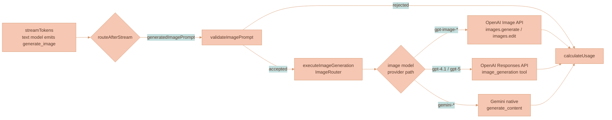

# Image Generation

Image generation is the **image branch** of Lixpi's shared AI generation pipeline. A user-selected **text model** (Claude, GPT, or Gemini) reads the conversation — including any reference photos — writes an exhaustive image prompt, and emits a `generate_image` tool call; the workflow routes that prompt to an independently-selected **image model** (OpenAI GPT Image, an OpenAI Responses-API model, or Gemini native) which synthesizes the pixels. The finished image lands on the workspace canvas as an `ImageCanvasNode` with full provenance, ready to be piped into later threads or branched into edits.

This page covers what is specific to image generation: the three image-model provider execution paths, how reference images are extracted from each provider's message format, the image system-prompt instructions, image sizes and hardcoded options, content-hash dedup, multi-turn editing, and the image-specific stream-event details. The shared LangGraph workflow, dual-model routing, tool schema, post-stream router, `ProviderState`, `ImageRouter`, and stream lifecycle are covered in [AI Generation Pipeline](../platform/AI-GENERATION-PIPELINE.md).


The shared workflow, dual-model routing, tool injection/extraction mechanism, and `ImageRouter` live in [AI Generation Pipeline](../platform/AI-GENERATION-PIPELINE.md). Canvas placement, branch lineage, branch-root provenance, balanced branch-tree layout, and VLM reference selection live in [Branch Lineage](./BRANCH-LINEAGE.md). Uploaded/source/reference images can anchor placement, but only API-selected existing generated-media branch members become `parentMediaNodeId` connector parents. The full stream-event catalog lives in [Streaming and Events](../platform/STREAMING-AND-EVENTS.md).


## Where Image Generation Sits

The image branch is one of the three post-stream destinations in the shared workflow. After the text model streams its response, the 3-way `routeAfterStream` router sends a request with a `generatedImagePrompt` through `validateImagePrompt` and then `executeImageGeneration`, which builds an `ImageRouter` that runs a fresh image-model provider. The diagram below shows only that slice; the complete graph is in [AI Generation Pipeline](../platform/AI-GENERATION-PIPELINE.md).



| Provider path | Selected when | API surface |
|---------------|---------------|-------------|
| OpenAI GPT Image | image model id starts with `gpt-image-` | `client.images.generate()` / `client.images.edit()` |
| OpenAI Responses API | image model is a mainline OpenAI model (`gpt-4.1`, `gpt-5`, …) | `responses.create()` with the built-in `image_generation` tool |
| Gemini native | image model is an image-capable Google model | `generate_content()` with `response_modalities: ['TEXT', 'IMAGE']` |

## Image Model Provider Paths

All three paths receive the same input from the `ImageRouter`: the text model's enhanced prompt as the user message, plus the VLM-approved reference images as content blocks, plus `image_size`. They are invoked with `enable_image_generation: true`, which is what makes the transient image provider skip its own `START_STREAM` / `END_STREAM` and route into the image path rather than the normal text path. They differ only in the vendor API and in how partial frames (if any) are produced.

### OpenAI — GPT Image Models (`gpt-image-1`, `gpt-image-1.5`, `gpt-image-1-mini`)

GPT Image models use the dedicated **Image API**, *not* the Responses API. The provider's `_stream_impl` dispatches on the model prefix:

```text
if enable_image_generation and model_version.startswith('gpt-image-'):
    → _generate_via_image_api()      # Image API
else:
    → _generate_via_responses_api()   # Responses API
```

Within the Image API path, the presence of reference images selects the endpoint:

| Condition | Call | Notes |
|-----------|------|-------|
| No reference images | `client.images.generate(stream=True, partial_images=3)` | Text-to-image. |
| With reference images | `client.images.edit(image=files, stream=True, partial_images=3)` | `images.edit()` is the endpoint that accepts reference images; `images.generate()` is text-only. |

Reference-image data URLs are converted to `BytesIO` file objects via `_data_url_to_file()` before being passed to the SDK. The streaming response yields `ImageGenPartialImageEvent` objects (each carrying progressive base64) and a terminal `ImageGenCompletedEvent` (final base64 + usage data). `partial_images=3` is what drives the up-to-three progressive previews the canvas paints into the placeholder node.

### OpenAI — Responses API Models (`gpt-4.1`, `gpt-5`, …)

When the selected image model is a mainline OpenAI model rather than a `gpt-image-*` model, generation runs through the **Responses API** with the native `image_generation` tool configured:

```python
tools = [{
    'type': 'image_generation',
    'quality': 'high',
    'partial_images': 3,
    'size': image_size
}]
```

The model generates images internally (calling GPT Image under the hood) and streams response events including `response.image_generation_call.partial_image` and `response.completed`. Reference images travel inline as `input_image` blocks in the request messages rather than as separate file uploads, and the placeholder is triggered by the `response.output_item.added` event rather than an explicit empty partial.

### Google — Gemini Native Image Generation

Image-capable Gemini models use `generate_content()` with `response_modalities: ['TEXT', 'IMAGE']`. The response contains `inline_data` parts whose raw bytes are base64-encoded before publishing. This path is **non-streaming** — it returns a single response rather than progressive partials — so the canvas shows the empty-placeholder animation until the one completed image arrives.

For Gemini 3+ models, `thinking_config` is enabled and **thought images** (intermediate generation steps the model produces while reasoning) are published as `IMAGE_PARTIAL` events, giving Gemini a partial-like progression even though the final-image call itself is single-shot.

### Provider Comparison

The three paths converge on the same `IMAGE_PARTIAL` / `IMAGE_COMPLETE` stream contract but differ in API surface, how (and whether) partials are produced, how references are passed, how the placeholder is triggered, and where usage data lands:

| Capability | OpenAI (GPT Image) | OpenAI (Responses API) | Google (Gemini native) |
|---|---|---|---|
| API method | `images.generate()` / `images.edit()` | `responses.create()` with `image_generation` tool | `generate_content()` with `response_modalities` |
| Streaming | `partial_images=3` | Built-in partial-image events | Non-streaming (single response) |
| Reference images | `images.edit(image=files)` (file uploads) | Inline `input_image` blocks in messages | Inline `inline_data` blocks in contents |
| Placeholder trigger | Explicit empty `IMAGE_PARTIAL` before the API call | `response.output_item.added` event | Explicit empty `IMAGE_PARTIAL` before the API call |
| Usage data | `ImageGenCompletedEvent.usage` | `response.completed` usage object | `usage_metadata` on the response |

## Reference Image Extraction

When the text model emits a `generate_image` tool call, `extractReferenceImages()` scans the **already-resolved** user messages for attached images. "Already-resolved" matters: each provider passes its messages *after* `nats-obj://` object-store references have been converted to data URLs, so every image is available as base64 regardless of how it entered the conversation. Because messages may already have been converted into any of the three provider shapes, the extractor handles all three block formats:

| Format | Block type | Image data location |
|--------|-----------|---------------------|
| OpenAI | `input_image` | `block.image_url` (data URL string) |
| Anthropic | `image` | `block.source.data` (base64) + `block.source.media_type` |
| Google | `inline_data` | `block.data` (base64) + `block.mime_type` |


The reference set the text model writes against is not "every attached photo" — it is the exact VLM-approved set produced by `resolveImageBranch` *before* the text model streams. Which media become target, base-context, style-reference, comparison-target, or excluded — and how those choices drive canvas placement and branch lineage — is owned by [Branch Lineage](./BRANCH-LINEAGE.md). This section only covers the per-provider *format* of the blocks `extractReferenceImages()` reads.


## System-Prompt Enhancement

When an image model is selected, the text model's system prompt is augmented via `get_system_prompt(include_image_generation=True)`, which appends `prompts/image_generation_instructions.txt` to the base prompt. These instructions are what turn a terse user request into an exhaustive generation prompt. They tell the text model to:

1. **Always use the `generate_image` tool** for visual requests — never describe an image in prose.
2. **Show the enhanced prompt** to the user in a `>` quote block, so the user sees exactly what is being sent to the image model. (This is the image-flow convention; video uses `<video_prompt>` XML tags instead — see [Video Generation](./VIDEO-GENERATION.md).)
3. **Write exhaustive prompts** (100+ words) covering subject description, artistic direction, composition, color palette, lighting, and mood.
4. **Handle reference images explicitly** — when the user provides photos, describe every observable detail (facial features, hair, skin tone, body type, clothing, pose, expression) and instruct the image model to use the provided reference images.

## Image Sizes and Options

The image-size dropdown auto-selects a sensible default (image generation works without extra configuration). The supported sizes are:

| Option | Dimensions | Use case |
|--------|------------|----------|
| Square | `1024×1024` | Logos, icons, profile pictures |
| Landscape | `1536×1024` | Banners, headers, wide scenes |
| Portrait | `1024×1536` | Posters, phone wallpapers, tall scenes |
| Auto | Model decides | Let the model pick based on the prompt |

The selected size flows through state as `image_size` and is passed to whichever provider path runs. Gemini native generation uses the model's own sizing rather than these explicit OpenAI dimensions.

Other generation knobs are **hardcoded** for best output rather than exposed to the user:

| Knob | Value | Why |
|------|-------|-----|
| Quality | `high` | Always maximum output quality. |
| Input fidelity | `high` | Preserves details when editing an existing image. |
| Content moderation | `low` | Avoids unnecessary restrictions on legitimate requests. |

## Storage and Deduplication

Generated images are stored in the NATS Object Store exactly like uploaded images. To avoid duplicates, the storage path computes a **SHA-256 hash** of the image content and uses `hash-{sha256}` as the `fileId`. Before writing, it checks whether that `fileId` already exists; if so, it skips the upload and returns the existing URL. This content-hash dedup is the same mechanism video reuses (`storeWorkspaceVideo`) — see [Video Generation](./VIDEO-GENERATION.md). Saved-copy independence (Media Library) is covered in [Media Library](../library/MEDIA-LIBRARY.md).

## Multi-Turn Image Editing

Image editing is **provider-agnostic** and driven by canvas edges rather than provider session IDs. When an image is generated:

1. It appears as an `ImageCanvasNode` connected to the AI chat thread by a `WorkspaceEdge`.
2. The edge's `sourceMessageId` links the image to the specific `aiResponseMessage` that produced it.
3. When extracting connected context for a follow-up message, `extractConnectedContext()` traverses incoming edges and includes image nodes with their `sourceMessageId` metadata.
4. The API fetches those images from the Object Store via `nats-obj://` references and converts them to provider-ready attachment blocks before sending to any provider.

**Thread-level continuity.** Every AI-generated image connected to the thread is automatically included in subsequent requests through the workspace edge system, so *"make the background blue"* works because the previous image is part of the connected context. For OpenAI specifically, conversation context is also maintained via `previousResponseId` (`previous_response_id`) when continuing within the same thread, which complements — but does not replace — the edge-based association.

**Per-image editing — "Edit in New Thread."** Clicking **Edit in New Thread** on a canvas image node creates a fresh AI chat thread positioned to the **right** of the source image, using `settings.aiChatThread.defaultDimensions` and `settings.aiChatThread.adjacentNodeGap`; collision resolution then pushes conflicting top-level nodes apart. An edge connects the image (right side) to the new thread (left side), and `extractConnectedContext()` automatically includes the connected image in the new thread's context. This forms a **horizontal chain**:

```text
[Original Thread] → [Image] → [Edit Thread]
```


Generated-image size and the vertical spacing of stacked images from one thread are controlled by `settings.imageBranchLineage`; the "Edit in New Thread" horizontal-chain geometry is controlled by `settings.aiChatThread`. The full placement, collision, and lineage rules are owned by [Branch Lineage](./BRANCH-LINEAGE.md) and [Collision Resolution](../canvas/COLLISION-RESOLUTION.md).


### Editor Preservation During Generation

Adding image nodes to the canvas triggers a state-persistence round-trip through the Svelte store. Normally that round-trip calls `renderNodes()`, which destroys **all** editors — including the AI chat thread editor that is actively streaming the response. During image generation, the canvas calls `commitCanvasStatePreservingEditors()` instead:

- It updates the internal structure key immediately, so the Svelte `$effect`'s `render()` call sees no structural change and skips the destructive `renderNodes()`.
- The new image node's DOM is appended manually via `appendImageNodeToDOM()`.

This keeps active streaming editors alive across canvas-state commits, so a multi-image generation does not tear down the thread that is producing it.

### The `partialImageTracker` Race Guard

Because partials arrive asynchronously and `IMAGE_COMPLETE` can race them, the canvas records the pending partial in a `partialImageTracker` Map **synchronously, before any async work**. This guards against the completion event being processed before the partial that created the placeholder node, which would otherwise leave an orphaned or duplicated node. `IMAGE_COMPLETE` clears the active-generation tracker, which is what lets PIXI remove the animated border only *after* the final image is received.

## Image-Specific Stream Nuances

Image generation publishes its events on the same per-thread receive subject as every other AI response, and the complete catalog (with payloads and browser handling) is owned by [Streaming and Events](../platform/STREAMING-AND-EVENTS.md). The table below is **only** the image-specific nuance — how the two image events behave differently from a plain text delta — not the full catalog.

| Event | Image-specific nuance |
|-------|-----------------------|
| `IMAGE_PARTIAL` (empty) | Empty `imageUrl`/`fileId` is a *signal*, not pixels: it tells the canvas to create the placeholder `ImageCanvasNode` (a transparent 1×1 PNG) and start the PIXI traveling progress border before any real pixel data exists. |
| `IMAGE_PARTIAL` (non-empty) | Up to three progressive partials (`partial_images=3`) are stored in the workspace Object Store, then sent as `{ imageUrl, fileId, partialIndex }`. Each event replaces the **same** preview sprite in place — the canvas updates one node, it does not create new ones. Gemini delivers thought images through this same event. |
| `IMAGE_COMPLETE` | Stores the final image and sends `{ imageUrl, fileId, responseId, revisedPrompt, imageModelId }`. This finalizes the node, clears the traveling outline, and persists `generatedBy` metadata. The transient image provider never emits `START_STREAM` / `END_STREAM` — the text model owns the stream lifecycle. |

On the workspace canvas, `IMAGE_PARTIAL` updates one generated image node in place and marks it as generating; `pixiMediaLayer.ts` renders the partial pixels and supplies the active image bounds to the reusable `PixiTravelingOutlineRenderer`, and `IMAGE_COMPLETE` is the event that clears that outline. These events **bypass** the markdown stream parser — `AiInteractionService` routes them straight to the canvas/media handlers.

In the AI chat history, `imageSelectionPlugin/ImageNodeView` renders generated images and the same generated-media provider badge used by canvas media chrome and in-chat generated videos. The badge resolves from `mediaModelId`; canvas rendering remains owned by PIXI and the canvas chrome layer.

## File Structure

```text
services/api/src/llm/
├── providers/
│   ├── base-provider.ts            # shared LangGraph workflow, routeAfterStream, ProviderState
│   ├── openai-provider.ts          # _generate_via_image_api / _generate_via_responses_api, _data_url_to_file
│   ├── anthropic-provider.ts       # generate_image tool injection + tool-call extraction for Claude
│   └── google-provider.ts          # Gemini native image gen (response_modalities) + tool injection
├── graph/
│   ├── image-branch-resolver.ts    # structured VLM media role assignment (see Branch Lineage)
│   └── stream-publisher.ts         # IMAGE_PARTIAL / IMAGE_COMPLETE / trace events
├── tools/
│   ├── image-generation.ts         # generate_image tool def + per-provider reference extractors
│   └── image-router.ts             # ImageRouter — bridges text model → transient image model
└── prompts/
    ├── load-prompts.ts             # get_system_prompt(include_image_generation)
    └── image_generation_instructions.txt   # exhaustive-prompt + reference-handling instructions

services/web-ui/src/infographics/workspace/
├── WorkspaceCanvas.ts              # commitCanvasStatePreservingEditors, partialImageTracker, Edit-in-New-Thread
├── pixiMediaLayer.ts               # partial pixel rendering + PixiTravelingOutlineRenderer bounds
└── rendering/                      # media node renderers
```

## Related Pages

- [AI Generation Pipeline](../platform/AI-GENERATION-PIPELINE.md) — the shared LangGraph workflow, dual-model routing, `generate_image` tool mechanism, `ImageRouter`, `ProviderState`, and stream lifecycle.
- [Branch Lineage](./BRANCH-LINEAGE.md) — canvas placement, branch identity, branch-root provenance, balanced branch-tree layout, and the structured VLM resolver that selects which references reach the image model.
- [Streaming and Events](../platform/STREAMING-AND-EVENTS.md) — the complete stream-event catalog and the browser render path.
- [Video Generation](./VIDEO-GENERATION.md) — the sibling video branch (Google VEO) that extends this pipeline.
- [Media & Content Descriptors](../ai-chat/MEDIA-DESCRIPTORS.md) — the descriptor generated images compose for free from their generation metadata.
- [Media Library](../library/MEDIA-LIBRARY.md) — saving reusable copies of finished images.
- [Rendering Engine](../canvas/RENDERING-ENGINE.md) — the PIXI media layer and DOM chrome overlay that render image nodes and provenance.
