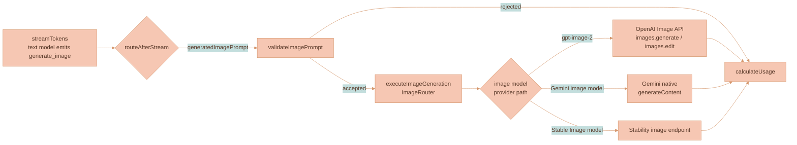

# Image Generation

Image generation is the image branch of Lixpi's shared AI generation pipeline. A selected reasoning model reads the authorized conversation and reference context, writes the image prompt, and emits a `generate_image` tool call. The workflow routes that prompt to an independently selected OpenAI, Google, or Stability image model. The finished image lands on the workspace canvas as an `ImageCanvasNode` with full provenance and can be used as context for later requests.

This page covers the current image-model provider paths, synchronized model controls, reference adaptation, prompt construction, content-hash deduplication, multi-turn editing, and image-specific stream behavior. The shared workflow, model-matrix routing, `ProviderState`, `ImageRouter`, and stream lifecycle are covered in [AI Generation Pipeline](../platform/AI-GENERATION-PIPELINE.md).


The shared workflow, dual-model routing, tool injection/extraction mechanism, and `ImageRouter` live in [AI Generation Pipeline](../platform/AI-GENERATION-PIPELINE.md). Canvas placement, branch lineage, branch-root provenance, balanced branch-tree layout, and VLM reference selection live in [Branch Lineage](./BRANCH-LINEAGE.md). Uploaded/source/reference images can anchor placement, but only API-selected existing generated-media branch members become `parentMediaNodeId` connector parents. The full stream-event catalog lives in [Streaming and Events](../platform/STREAMING-AND-EVENTS.md).


## Where Image Generation Sits

The image branch is one of the three post-stream destinations in the shared workflow. After the text model streams its response, the 3-way `routeAfterStream` router sends a request with a `generatedImagePrompt` through `validateImagePrompt` and then `executeImageGeneration`, which builds an `ImageRouter` that runs a fresh image-model provider. The diagram below shows only that slice; the complete graph is in [AI Generation Pipeline](../platform/AI-GENERATION-PIPELINE.md).



| Provider path | Selected when | API surface |
|---------------|---------------|-------------|
| OpenAI GPT Image | `gpt-image-2` | `client.images.generate()` or `client.images.edit()` |
| Gemini native | `gemini-3.1-flash-image`, `gemini-3.1-flash-lite-image`, or `gemini-3-pro-image` | `generateContent()` with `responseModalities: ['TEXT', 'IMAGE']` |
| Stability | `stability-ultra` or `sd3.5-large` | The model-specific Stability text-to-image or control endpoint |

## Image Model Provider Paths

All three providers receive the same provider-neutral input from `ImageRouter`: the enhanced prompt, the VLM-approved reference set, the selected per-model generation configuration, and the synchronized model metadata. `enableImageGeneration: true` routes the transient provider into its image path and keeps the parent reasoning run responsible for the text stream lifecycle.

### OpenAI GPT Image 2

The synchronized OpenAI image catalog contains `gpt-image-2`. It uses the dedicated Image API. `streamImpl()` dispatches any `gpt-image-*` image route to `generateViaImageApi()`:

```text
if enableImageGeneration && modelVersion.startsWith('gpt-image-'):
    -> generateViaImageApi()
else:
    -> generateViaResponsesApi()
```

Within the Image API path, the presence of reference images selects the endpoint:

| Condition | Call | Notes |
|-----------|------|-------|
| No reference images | `client.images.generate({ stream: true, partial_images: 3 })` | Text-to-image. |
| With reference images | `client.images.edit({ image: files, stream: true, partial_images: 3 })` | `images.edit()` accepts the adapted reference files. |

Reference bytes are converted to SDK upload files before the request. The streaming response yields progressive base64 previews and one terminal image with usage data. `partial_images: 3` allows up to three previews. Lixpi fixes `output_format` to PNG, which keeps transparent-background output compatible with the provider requirement for PNG or WebP.

Every synchronized image model carries a required `imageReferenceCapabilities` profile. It declares total and identity-reference budgets, supported conditioning modes, fidelity behavior, iterative-edit and control support, output pixel limits, and aspect ratios. Provider adapters consume the selected model's profile instead of inferring behavior from model names. OpenAI's adapter sends explicit input-fidelity values only when synchronized metadata requires one.

### Google Gemini image generation

The synchronized Google image catalog contains `gemini-3.1-flash-image`, `gemini-3.1-flash-lite-image`, and `gemini-3-pro-image`. These models use `generateContent()` with `responseModalities: ['TEXT', 'IMAGE']`. The response contains inline image parts whose raw bytes are published as image events. The final-image call is single-shot, so the canvas shows the pending node until the response arrives.

For models whose synchronized capability profile enables level-based thinking, Lixpi asks Google to include thoughts. Thought images are published as `IMAGE_PARTIAL` events. The provider request also receives the selected aspect ratio and resolution through `imageConfig`.

### Stability image generation

`stability-ultra` uses the Ultra endpoint. `sd3.5-large` uses the SD3 endpoint with its exact model id. Lixpi maps the selected aspect ratio to the provider request and chooses the control endpoint from the adapted reference roles. Style or structure control does not imply identity conditioning. Seed, output format, strength, fidelity, and control-strength values remain pipeline-owned because the registry classifies them as internal rather than composer controls.

### Provider Comparison

The provider paths converge on the same `IMAGE_PARTIAL` and `IMAGE_COMPLETE` contract:

| Capability | OpenAI GPT Image 2 | Google Gemini image | Stability |
|---|---|---|---|
| API method | `images.generate()` or `images.edit()` | `generateContent()` with `responseModalities` | Model-specific Stability image endpoint |
| Progressive provider output | Up to three partial images | Thought images when returned | No |
| Reference transport | Uploaded files on `images.edit()` | Inline image parts | Multipart endpoint fields |
| Placeholder trigger | Empty `IMAGE_PARTIAL` before submission | Empty `IMAGE_PARTIAL` before submission | Empty `IMAGE_PARTIAL` before submission |
| Usage source | Image API terminal event | `usageMetadata` | Provider response and synchronized credit price |

## Reference Image Extraction

When the text model emits a `generate_image` tool call,
`extractReferenceImages()` scans the **already-resolved** user messages for
attached images. "Already-resolved" matters: the API has authorized the source
Assets, selected ready rendition Blobs, and converted its internal Object Store
coordinates to data URLs before provider dispatch. Because messages may already
have been converted into any of the three provider shapes, the extractor handles
all three block formats:

| Format | Block type | Image data location |
|--------|-----------|---------------------|
| OpenAI | `input_image` | `block.image_url` (data URL string) |
| Anthropic | `image` | `block.source.data` (base64) + `block.source.media_type` |
| Google | `inline_data` | `block.data` (base64) + `block.mime_type` |


The reference set the text model writes against is not "every attached photo" — it is the exact VLM-approved set produced by `resolveMediaBranch` *before* the text model streams. Which media become target, base-context, style-reference, comparison-target, or excluded — and how those choices drive canvas placement and branch lineage — is owned by [Branch Lineage](./BRANCH-LINEAGE.md). This section only covers the per-provider *format* of the blocks `extractReferenceImages()` reads.


## Provider-neutral reference adaptation

`ImageRouter` and Capability media strategies use typed reference roles. Ordinary requests use source/style roles. Character Creator adds `edit-target`, `edit-target-identity`, `original-source`, generated-anchor, pose, crop, and Capability-reference roles.

The unresolved relationships live in the `imageGenerationReferences` LangGraph state channel. `BaseProvider` resolves every reference to bytes once in `resolvedImageGenerationReferences`; the selected provider definition enforces `imageReferenceCapabilities` and stores the budgeted result in `imageReferenceAdaptation`. Identity and original-source slots are reserved before optional controls. The resulting trace records included and omitted roles.

- OpenAI uploads the adapted array and prepends a role/order legend to the request prompt.
- Google interleaves the same provider-neutral role labels with image parts.
- Stability uses only the image, style, and structure inputs exposed by the selected endpoint. Style transfer does not satisfy identity conditioning.

Lixpi sends a pipeline-owned seed on Stability requests across the REST and Bedrock transports, reads back the seed the response reports, and stores it on the generated Asset as `lineage.generationSeed`. OpenAI and Google image requests do not receive a user-configurable seed. Seeds are never composer controls, and Stability seed selection follows the shared rule in [Seed inheritance](./VIDEO-GENERATION.md#seed-inheritance).

A referenced-character plan fails before panel work when the selected image model lacks identity conditioning. Reference authority, ordering, and omission are determined from the shared graph state and declared model capabilities; the Character graph contains no provider-name branches.

## Character Creator panel execution

Character Creator bypasses whole-sheet provider generation. Its Capability Tool emits a `CharacterSheetRenderPlan`, its module definition registers the package-owned media strategy, and `ImageRouter` delegates that plan without importing the concrete capability.

The default strategy generates three required isolated anchors in sequence: a neutral-front identity portrait, a front full-body outfit view, and a back full-body outfit view. The front shot consumes the completed portrait; the back shot consumes both earlier anchors; optional shots wait for all three and then may run concurrently. Free-form prompt text can request 3 to 10 total shots and prioritize belongings, expressions, additional angles, face details, or actions. Each shot gets one provider attempt and its own text-free neutral-mannequin pose reference where the shot contract requires one. A structured reasoning-model assessment compares candidate pixels with authorized source evidence without retrying or changing the candidate. Photographic face-bearing shots also use the internal YuNet/SFace fidelity workload.

For prior-sheet edits, the branch resolver supplies the active edit-target Asset through shared state. Stored composition components or recovered legacy cells are reauthorized separately from original-source Assets. Evidence analysis assigns one of four authority policies: preserve the matching panel, keep only its approved face identity, discard it, or treat it as absent. Under identity-only authority, the rejected sheet is cropped to the face for the head shot and is completely absent from all body-shot provider inputs. Requested lettering remains allowed and must be rendered exactly; incidental text remains forbidden.

Sharp removes near-white margins, fits each visible subject into a compact cell with bounded padding, and assembles the final 3840x2560 PNG. Providers never render the full sheet, and the compositor renders no headings, labels, grids, notes, statuses, swatches, or other typography. The final PNG and isolated panel components enter the preassigned Asset's media-composition settlement path; transient references and candidate shots are deleted at terminal cleanup. See [Character Creator](../library/CHARACTER-CREATOR.md).

Before this extraction path, the [media reference boundary](./MEDIA-REFERENCE-IDENTITY-AND-MODERATION.md) compiles explicit references and uniquely matched free-form Asset mentions to `REFERENCE_n`. Reasoning context contains aliases, safe descriptors, medium, and subject-identity classification—not mutable titles or filenames. OpenAI GPT Image requests use the registered `moderation: 'low'` profile. A provider rejection is normalized into the durable run problem and is never retried automatically.

## System-Prompt Enhancement

When an image model is selected, the text model's system prompt is augmented via `get_system_prompt(include_image_generation=True)`, which appends `prompts/image_generation_instructions.txt` to the base prompt. These instructions are what turn a terse user request into an exhaustive generation prompt. They tell the text model to:

1. **Always use the `generate_image` tool** for visual requests — never describe an image in prose.
2. **Show the enhanced prompt** to the user in a `>` quote block, so the user sees exactly what is being sent to the image model. (This is the image-flow convention; video uses `<video_prompt>` XML tags instead — see [Video Generation](./VIDEO-GENERATION.md).)
3. **Write exhaustive prompts** (100+ words) covering subject description, artistic direction, composition, color palette, lighting, and mood.
4. **Handle reference images explicitly** — when the user provides photos, describe every observable detail (facial features, hair, skin tone, body type, clothing, pose, expression) and instruct the image model to use the provided reference images.

## Image Sizes and Options

The API catalog builds one configuration row per selected image model from synchronized controls. The browser stores `{ groupId, modelIds: [modelId], values }` and sends it unchanged. The API rejects values that are not present in that model's synchronized option list and falls back to the synchronized default when a stored value becomes invalid.

| Model | Exposed controls | Defaults and implications |
|-------|------------------|---------------------------|
| `gpt-image-2` | Size: `auto`, `1024x1024`, `1536x1024`, `1024x1536`; quality: `auto`, `low`, `medium`, `high`; background: `auto`, `opaque`, `transparent` | Size and quality affect image-token cost and latency. Transparent output requires PNG or WebP, and Lixpi fixes the internal output format to PNG. |
| `gemini-3.1-flash-image` | Aspect ratios from `1:8` through `8:1`; resolution: `512`, `1K`, `2K`, `4K` | `1:1` and `1K` are the generation defaults. Editing can inherit the input ratio when the provider receives no explicit ratio. Larger outputs cost more and take longer. |
| `gemini-3.1-flash-lite-image` | Standard aspect ratios; fixed `1K` resolution | The read-only resolution control explains that this model has no alternate output resolution. |
| `gemini-3-pro-image` | Standard aspect ratios; resolution: `1K`, `2K`, `4K` | `1:1` and `1K` are the defaults. Larger outputs cost more and take longer. |
| `stability-ultra`, `sd3.5-large` | Aspect ratio | The provider supports a fixed reviewed ratio list. Other operation-specific controls remain internal or require separate implementation investigation. |

`quality`, `background`, aspect ratio, and resolution are independent only where the synchronized model profile exposes them. A control never appears for a model that does not accept it. Multi-model requests keep a separate configuration object for each selected model, so one model's value cannot leak into a sibling request.

Pipeline-owned settings are deliberately absent from the composer:

| Setting | Behavior |
|---------|----------|
| OpenAI output format | Fixed to PNG. |
| OpenAI partial images | Fixed to three previews. |
| OpenAI moderation | Uses the registered low-moderation profile for image generation. |
| Reference fidelity | Comes from `imageReferenceCapabilities`; provider-managed fidelity is omitted from the request. |
| Stability seed and route strengths | Chosen and recorded by the pipeline, not submitted as user configuration. |

The registry keeps documented but unimplemented operation-specific parameters marked `needs-implementation-investigation`. Those parameters do not appear in synchronized controls or provider payloads. Masks, separate edit targets, multi-output image counts, Google multi-turn editing, Anthropic thought display, OpenAI reasoning summaries, and Stability operation-specific edit controls remain outside this configuration path.

Provider details and constraints are reviewed against the [OpenAI image generation guide](https://platform.openai.com/docs/guides/image-generation), [Gemini image generation guide](https://ai.google.dev/gemini-api/docs/image-generation), and [Stability Platform API reference](https://platform.stability.ai/docs/api-reference). The AI Model Registry stores the parameter-level source URLs and review decisions used to build the synchronized catalog.

## Storage and Deduplication

The lineage planner preassigns an Asset ID for every media run. Final image bytes are SHA-256 hashed, stored as an organization-scoped Blob, attached as the Asset's `original` rendition, and processed through the shared rendition matrix. Blob dedup verifies both registry metadata and Object Store bytes before reuse. The Asset owns lifecycle, media, lineage, provenance, workspace references, and catalog references; canvas nodes store only `assetId` and geometry. See [Data Storage](../platform/DATA-STORAGE.md) and [Media Library](../library/MEDIA-LIBRARY.md).

## Multi-Turn Image Editing

Image editing is **provider-agnostic** and driven by canvas edges rather than provider session IDs. When an image is generated:

1. It appears as an `ImageCanvasNode` connected to the AI chat thread by a `WorkspaceEdge`.
2. The edge's `sourceMessageId` links the image to the specific `aiResponseMessage` that produced it.
3. When extracting connected context for a follow-up message, `extractConnectedContext()` traverses incoming edges and includes image nodes with their `sourceMessageId` metadata.
4. The API authorizes those Asset IDs, fetches their selected rendition Blobs,
   and converts the internal Blob coordinates to provider-ready attachment
   blocks. Browser payloads never contain Object Store bucket/key coordinates.

**Thread-level continuity.** Every AI-generated image connected to the thread is automatically included in subsequent requests through the workspace edge system, so *"make the background blue"* works because the previous image is part of the connected context. For OpenAI specifically, conversation context is also maintained via `previousResponseId` (`previous_response_id`) when continuing within the same thread, which complements — but does not replace — the edge-based association.

**Per-image editing — "Edit in New Thread."** Clicking **Edit in New Thread** on a canvas image node creates a fresh AI chat thread positioned to the **right** of the source image, using `settings.aiChatThread.defaultDimensions` and `settings.aiChatThread.adjacentNodeGap`; collision resolution then pushes conflicting top-level nodes apart. An edge connects the image (right side) to the new thread (left side), and `extractConnectedContext()` automatically includes the connected image in the new thread's context. This forms a **horizontal chain**:

```text
[Original Thread] → [Image] → [Edit Thread]
```


Generated-media size and branch-lineage spacing are controlled by `settings.mediaBranchLineage`; the "Edit in New Thread" horizontal-chain geometry is controlled by `settings.aiChatThread`. The full placement, collision, and lineage rules are owned by [Branch Lineage](./BRANCH-LINEAGE.md) and [Collision Resolution](../../packages/lixpi/canvas-engine/docs/COLLISION-RESOLUTION.md).


### Editor Preservation During Generation

Adding image nodes to the canvas triggers a state-persistence round-trip through `workspaceStore`. Normally the view subscription calls `render()`, which can call `renderNodes()` and destroy **all** editors, including the AI chat thread editor that is actively streaming the response. During image generation, the canvas calls `commitCanvasStatePreservingEditors()` instead:

- It updates the internal structure key immediately, so the view's subsequent `render()` call sees no structural change and skips the destructive `renderNodes()`.
- The new image node's DOM is appended manually via `appendImageNodeToDOM()`.

This keeps active streaming editors alive across canvas-state commits, so a multi-image generation does not tear down the thread that is producing it.

### The `partialImageTracker` Race Guard

Because partials arrive asynchronously and `IMAGE_COMPLETE` can race them, the canvas records the pending partial in a `partialImageTracker` Map **synchronously, before any async work**. This guards against the completion event being processed before the partial that created the placeholder node, which would otherwise leave an orphaned or duplicated node. `IMAGE_COMPLETE` clears the active-generation tracker, which is what lets PIXI remove the animated border only *after* the final image is received.

## Image-Specific Stream Nuances

Image generation publishes live pipeline events on the same per-thread receive subject as every other AI response, persists those events to the chat pipeline replay log, and mirrors trace/final media transcript nodes into the authoritative ProseMirror step stream. The complete catalog and replay behavior are owned by [Streaming and Events](../platform/STREAMING-AND-EVENTS.md). The table below is only the image-specific nuance - how the two image events behave differently from a plain text delta - not the full catalog.

| Event | Image-specific nuance |
|-------|-----------------------|
| `IMAGE_PARTIAL` (empty) | Empty `imageUrl` is a signal, not pixels: the canvas renders the deterministic pending Asset node and starts the PIXI traveling progress border. |
| `IMAGE_PARTIAL` (non-empty) | Up to three Object-Store-backed partial URLs update the same pending node. NATS carries only the small authenticated URL; superseded and terminal objects are deleted. Partials are not durable Asset renditions. Gemini thought images use the same event. |
| `IMAGE_COMPLETE` | Settles final bytes into the preassigned Asset and sends `{ imageUrl, assetId, responseId, revisedPrompt, imageModelId, canvasGeometry }`. The API-owned geometry finalizes the node and lineage. |

On the workspace canvas, `IMAGE_PARTIAL` updates one generated image node in place and marks it as generating; the Lixpi package's `WorkspaceMediaLayer` sends partial frames to the reusable image surface and supplies active bounds to `TravelingOutline`, and `IMAGE_COMPLETE` is the event that clears that outline. These events **bypass** the markdown stream parser — `AiInteractionService` routes them straight to the canvas/media handlers. In matrix fanout, each image model run carries a distinct `mediaRunId`, and its partial/final events publish through that run's response queue. The API preserves ordering for one run while allowing sibling image variants to render their partials as soon as their own object-store write and canvas projection finish.

In the AI chat history, generated-image atom nodes are authored by the API-side ProseMirror assembler and rendered by `imageSelectionPlugin/ImageNodeView`. They carry the same generated-media provider badge used by canvas media chrome and in-chat generated videos. The badge resolves from `mediaModelId`; canvas rendering remains owned by PIXI and the canvas chrome layer.

## File Structure

```text
services/api/src/llm/
├── providers/
│   ├── base-provider.ts            # shared LangGraph workflow, routeAfterStream, ProviderState
│   ├── openai-provider.ts          # _generate_via_image_api / _generate_via_responses_api, _data_url_to_file
│   ├── anthropic-provider.ts       # generate_image tool injection + tool-call extraction for Claude
│   └── google-provider.ts          # Gemini native image gen (response_modalities) + tool injection
├── graph/
│   ├── media-branch-resolver.ts    # structured VLM media role assignment (see Branch Lineage)
│   └── stream-publisher.ts         # IMAGE_PARTIAL / IMAGE_COMPLETE / trace events
├── tools/
│   ├── image-generation.ts         # generate_image tool def + per-provider reference extractors
│   └── image-router.ts             # ImageRouter — bridges text model → transient image model
└── prompts/
    ├── load-prompts.ts             # get_system_prompt(include_image_generation)
    └── image_generation_instructions.txt   # exhaustive-prompt + reference-handling instructions

packages/lixpi/canvas-components-lixpi-specific/src/frontend/
├── workspace/workspace-canvas.ts   # workspace composition and host callbacks
└── media/                         # generation handlers, media nodes and progress projection

packages/lixpi/canvas-components/src/frontend/
├── media/                         # image surfaces and native playback
└── effects/outline/               # traveling outlines over the public drawing API
```

## Related Pages

- [AI Generation Pipeline](../platform/AI-GENERATION-PIPELINE.md) — the shared LangGraph workflow, dual-model routing, `generate_image` tool mechanism, `ImageRouter`, `ProviderState`, and stream lifecycle.
- [Branch Lineage](./BRANCH-LINEAGE.md) — canvas placement, branch identity, branch-root provenance, balanced branch-tree layout, and the structured VLM resolver that selects which references reach the image model.
- [Streaming and Events](../platform/STREAMING-AND-EVENTS.md) — the complete stream-event catalog and the browser render path.
- [Video Generation](./VIDEO-GENERATION.md) — the sibling video branch (Google VEO) that extends this pipeline.
- [Media & Content Descriptors](../ai-chat/MEDIA-DESCRIPTORS.md) — the VLM analysis descriptor generated images request after the final frame is stored.
- [Media Library](../library/MEDIA-LIBRARY.md) — saving reusable copies of finished images.
- [Rendering Engine](../../packages/lixpi/canvas-engine/docs/RENDERING-ENGINE.md) — generic rendering and resource contracts. Product media and provenance composition are documented in the Lixpi canvas package.
