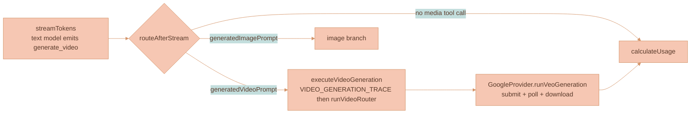
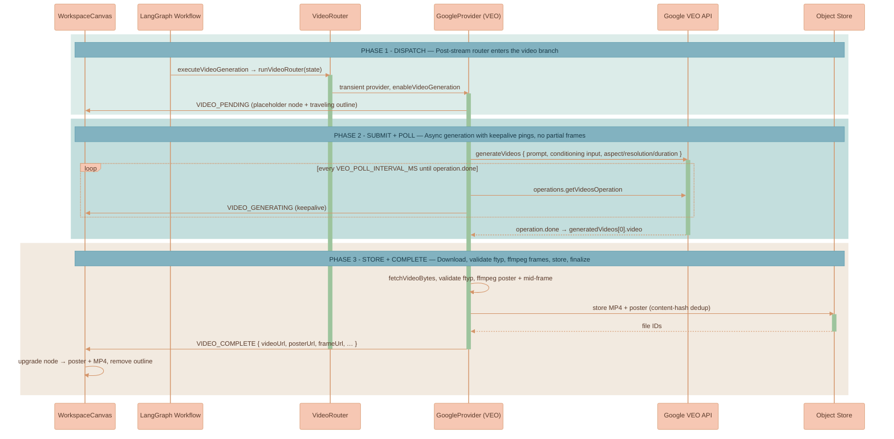

# Video Generation

Video generation is the **video branch** of Lixpi's shared AI generation pipeline. It **extends** [image generation](./IMAGE-GENERATION.md) rather than replacing it: a user-selected **text model** (Claude, GPT, or Gemini) reads the conversation — including any reference images — writes a cinematic enhanced prompt, and emits a `generate_video` tool call; the workflow routes that prompt to an independently-selected **video model** (Google VEO 3 / 3.1) which produces an MP4 with synchronized audio. The finished clip lands on the workspace canvas as a playable `VideoCanvasNode` that can be piped into later AI threads as context, participate in workspace relevance, and continue generated branch lineage.

Structurally, video adds a sibling to every image primitive: a `generate_video` tool mirroring `generate_image`, a `VideoRouter` mirroring `ImageRouter`, a `VideoPublisher` mirroring the image publisher, and a second post-stream branch in the shared graph. The one place it **cannot** mirror image generation is **execution**. VEO is long-running and asynchronous — submit an operation, poll it until done (≈11s–6min), with no partial frames — so the progressive `IMAGE_PARTIAL` streaming model is replaced by a *placeholder + keepalive + `VIDEO_COMPLETE`* model.

This page covers what is specific to video generation. The shared LangGraph workflow, dual-model architecture, post-stream 3-way router, tool injection/extraction mechanism, routers, stream lifecycle, and shared `ProviderState` are covered in [AI Generation Pipeline](../platform/AI-GENERATION-PIPELINE.md).


The shared workflow, dual-model routing, the `generate_video` tool schema, the 3-way `routeAfterStream` router, and the routers live in [AI Generation Pipeline](../platform/AI-GENERATION-PIPELINE.md). Canvas placement, branch lineage, branch-root provenance, balanced branch-tree layout, and VLM reference selection (including which prior generated video continues a branch) live in [Branch Lineage](./BRANCH-LINEAGE.md). A source/uploaded first-frame image is only a reference and placement anchor; it does not become a generated-output connector parent unless it is itself an existing generated-media branch member selected by the API lineage planner. The full stream-event catalog lives in [Streaming and Events](../platform/STREAMING-AND-EVENTS.md). The playback control bar lives in [Video Player Controls](./VIDEO-PLAYER-CONTROLS.md).


## Opt-In Video Model

Unlike the image-model dropdown — which auto-selects a default so image generation is available without configuration — the **video-model dropdown is opt-in**. It stays on its "Video Model" placeholder until the user explicitly picks one. While `aiVideoModel` is empty, the `generate_video` tool is never injected, so existing text-only and image-only flows are completely unchanged. When both an image model and a video model are selected, **both tools are injected** in the same turn and the text model chooses per intent (`generate_video` for motion/clips, `generate_image` for stills). The injection guard and the shared tool mechanism are detailed in [AI Generation Pipeline](../platform/AI-GENERATION-PIPELINE.md).

## Where Video Generation Sits

The video branch is one of the three post-stream destinations in the shared workflow. After the text model streams, the 3-way `routeAfterStream` router sends a request carrying `generatedVideoPrompt` directly to `executeVideoGeneration`, which calls `runVideoRouter` to run a transient VEO provider. The video branch has **no** validate-prompt node — VEO prompts have no strict character limit, so unlike images there is no prompt-rewrite/validation step. The diagram below shows only that slice; the complete graph is in [AI Generation Pipeline](../platform/AI-GENERATION-PIPELINE.md).



## Asynchronous Execution

VEO does not stream pixels. `client.models.generateVideos(...)` returns an **operation**; the provider polls `client.operations.getVideosOperation(...)` until `operation.done`, then downloads the MP4. This submit-and-poll loop runs **synchronously inside the existing LangGraph request** — it reuses the in-process model, the shared `AbortController`, and the request circuit breaker (`LLM_TIMEOUT_MS`, default 20 min; see [AI Generation Pipeline](../platform/AI-GENERATION-PIPELINE.md)). Because the request now occupies a worker for minutes with **no token traffic**, the poll loop publishes a `VIDEO_GENERATING` keepalive every `VEO_POLL_INTERVAL_MS` (default `10000` ms) so the browser never looks frozen.



## Video `ProviderState` Fields

The video fields mirror the image fields and use the same **"keep if undefined"** channel reducers in [`state.ts`](../../services/api/src/llm/graph/state.ts). VLM branch resolution is **shared** with image generation, so there is no separate video resolution field — the resolved references are written onto the video conditioning fields below. For multi-model matrix requests the branch resolver runs once in shared preflight, so these conditioning fields reach each fanout child only through the complete resolved patch the orchestrator forwards; children run with `preflightResolved` and never re-resolve, so a conditioning field the preflight selects but the fanout omits would leave the video model running text-to-video (see [AI Generation Pipeline](../platform/AI-GENERATION-PIPELINE.md)). The shared fields (`workspaceContextSnapshot`, `workspaceContextResolution`, `imageBranchCandidateSnapshot`, `messages`, `model_version`) are documented in [AI Generation Pipeline](../platform/AI-GENERATION-PIPELINE.md); only the modality-specific fields are listed here.

| Field | Type | Purpose |
|-------|------|---------|
| `enableVideoGeneration` | `boolean` | `true` when the provider is invoked as the video model by `VideoRouter`. |
| `videoModelMetaInfo` | `AiModelMetaInfo` | Video model pricing + metadata (resolved by the gateway). |
| `videoModelVersion` | `string` | Selected video model id (e.g. `veo-3.0-generate-001`). |
| `videoProviderName` | `ProviderName` | Video model provider (`Google`). |
| `videoAspectRatio` | `string` | `16:9` \| `9:16`. |
| `videoResolution` | `string` | `720p` \| `1080p` \| `4k`. |
| `videoDurationSeconds` | `number` | Selected duration from the synced model metadata; VEO dropdowns currently expose `8` because reference images, extension, and higher resolutions require 8 seconds. |
| `generatedVideoPrompt` | `string` | Enhanced prompt extracted from the text model's `generate_video` tool call. |
| `videoFirstFrameImage` | `string` | VLM-selected first frame, as a data URL (image-to-video). |
| `videoReferenceImages` | `string[]` | VLM-selected style/content references (≤3). |
| `videoSourceForExtension` | `string` | `nats-obj://…` URI of a source MP4 to extend (multi-turn). |
| `generatedVideos` | `string[]` | Resulting video URLs/ids. |
| `videoUsage` | `VideoUsage` | `{ durationSeconds, resolution, aspectRatio }` for billing, plus optional `completionTokens` / `totalTokens` for token-metered providers (Seedance). |

## The VEO Provider Path

`GoogleProvider.runVeoGeneration` ([`google-provider.ts`](../../services/api/src/llm/providers/google-provider.ts)) runs **only** when `enableVideoGeneration && modelNameImpliesVideoOutput` — a non-VEO Google model never enters this path, and the existing Gemini image branch is untouched.

**Config.** `numberOfVideos: 1`, `aspectRatio` / `resolution` / `durationSeconds` from the synced model metadata, the request's `abortSignal`, and a VEO `personGeneration` value selected by input mode: `allow_all` for text-to-video and extension, `allow_adult` for first-frame image or reference-image conditioning. `generateAudio` is sent only for Vertex clients; the Gemini Developer API rejects that knob but still generates VEO 3 audio by default. Google currently requires `durationSeconds: 8` for `referenceImages`, extension, and `1080p` / `4K` requests, so model synchronization exposes only the safe `8s` duration for VEO dropdowns.

**Input precedence.** Exactly one conditioning input is sent, in this fixed order. The first applicable input wins; the rest are ignored:

| Priority | Input (state field) | VEO parameter | Notes |
|----------|--------------------|---------------|-------|
| 1 | Extension (`videoSourceForExtension`) | `video` | Source MP4 bytes read from the workspace Object Store (`fetchObjectStoreBytes`) and passed as base64. Mutually exclusive with image/references per the API; takes precedence. |
| 2 | First frame (`videoFirstFrameImage`) | `image` | Image-to-video. |
| 3 | Reference images (`videoReferenceImages`, ≤3) | `referenceImages` | Style/content references (`referenceType: 'asset'`). |
| 4 | Text-to-video | — | None of the above set. |

**Submit + poll.** `client.models.generateVideos(...)` returns an operation; the provider loops on `client.operations.getVideosOperation(...)` every `VEO_POLL_INTERVAL_MS`, publishing a `VIDEO_GENERATING` keepalive each tick and honoring the abort signal, until `operation.done`.

**Download.** `fetchVideoBytes` uses inline `videoBytes` (base64) when present, otherwise `client.files.download(...)` to a temp file. `VideoPublisher.complete` validates the MP4 (`ftyp` box) before storing; non-MP4 bytes throw.

## Seedance 2.0 via BytePlus ModelArk

`BytePlusProvider` ([`byteplus-provider.ts`](../../services/api/src/llm/providers/byteplus-provider.ts)) is a first-party peer of `GoogleProvider` that produces video through **BytePlus ModelArk's** official Seedance 2.0 API. It is **video-only** — text streaming throws a capability error — and runs **only** when `enableVideoGeneration && /seedance/i.test(modelVersion)`. Everything else is reused unchanged: the same `generate_video` tool, post-stream router, VLM resolver, video NATS lifecycle, workspace storage, ffmpeg posters, and `VideoCanvasNode`. The router selects it exactly like VEO (`createTransient(instanceKey, 'BytePlus')`).

**Official route** (overridable via `BYTEPLUS_ARK_BASE_URL`):

- Create: `POST https://ark.ap-southeast.bytepluses.com/api/v3/contents/generations/tasks`
- Retrieve: `GET …/contents/generations/tasks/{id}`
- Auth: `Authorization: Bearer $ARK_API_KEY` (or `BYTEPLUS_ARK_API_KEY`)
- Model ids: `dreamina-seedance-2-0-260128`, `dreamina-seedance-2-0-fast-260128` (China/Volcengine Ark uses `doubao-*` ids instead).

The typed REST client lives in [`byteplus-video-types.ts`](../../services/api/src/llm/providers/byteplus-video-types.ts) (`createVideoGenerationTask` / `retrieveVideoGenerationTask` / `downloadVideo` over `fetch` + `AbortSignal`, preserving ModelArk `error.code`), with pure `buildSeedanceContent` and an injectable `pollVideoGenerationTask`.

**Input precedence.** `content[]` is text-first, then ONE input family — first-frame and reference are mutually exclusive in Seedance, matching VEO:

| Priority | Input (state field) | ModelArk `content[]` item | Notes |
|----------|--------------------|---------------------------|-------|
| 1 | Extension (`videoSourceForExtension`) | — | **Rejected** with a capability error — no provider-fetchable asset handoff yet. Use VEO for extension. |
| 2 | First frame (`videoFirstFrameImage`) | `image_url` `role: first_frame` | Image-to-video. |
| 3 | Reference images (`videoReferenceImages`, ≤9) | `image_url` `role: reference_image` | Already capped to the provider budget by the router. |
| 4 | Text-to-video | — | None of the above set. |

Inputs are base64 data URLs (the resolver already supplies them); private `nats-obj://` URIs are refused before submit so they never reach ModelArk.

**Submit + poll + store.** Publish `VIDEO_PENDING` on accept; poll `GET …/tasks/{id}` every `BYTEPLUS_VIDEO_POLL_INTERVAL_MS` (default = `VEO_POLL_INTERVAL_MS`, 10s), publishing a `VIDEO_GENERATING` keepalive on each non-terminal poll, until `succeeded`/`failed`/`cancelled`/`expired`. On success, **download `content.video_url` immediately** — ModelArk output URLs are cleaned after 24 hours — then `VideoPublisher.complete` validates the MP4 (`ftyp`), extracts a poster + mid-frame, stores, and publishes `VIDEO_COMPLETE`. Vendor token usage (`usage.total_tokens`) flows into `videoUsage` for billing.

**Prompt phrasing.** The shared final-prompt wrapper (`buildVideoModelPrompt`) selects a per-provider profile: Seedance uses positive/affirmative phrasing, **omits VEO's inline `Negative prompt:` line** (negative tokens backfire on Seedance — the model renders them), and adds an image-safety context that preserves visible reference characteristics when selected image-conditioned references are generated or visibly stylized canvas media. VEO's emitted prompt is byte-identical. The shared wrapper + profiles are covered in [AI Generation Pipeline](../platform/AI-GENERATION-PIPELINE.md).

## VLM Reference Mapping

The structured VLM resolver itself — candidate snapshots, role assignment, references-vs-lineage, and how a prior **video** node participates by contributing a still — is owned by [Branch Lineage](./BRANCH-LINEAGE.md). The video-specific part is only the **mapping** from the resolver's outcome onto VEO's mutually-exclusive conditioning inputs:

| Resolver outcome | VEO input |
|---|---|
| Target identified (edit / style-transfer / continuation) | `videoFirstFrameImage` → VEO `image` (first frame, image-to-video) |
| No target, references present | `videoReferenceImages` (≤3) → VEO `referenceImages` (`referenceType: 'asset'`) |
| No references | neither set → text-to-video |

VEO's `image` (first frame) and `referenceImages` are **mutually exclusive** per the SDK, so the resolver populates exactly one path. The browser receives the same `IMAGE_BRANCH_RESOLVED` event it already understands for images.


**Videos are grounded by a single still, never the MP4.** The browser's candidate snapshot includes prior **video** nodes alongside images, each contributing its representative frame (`frameFileId`, falling back to the frame-0 poster) as the candidate still — so an edit to a previous video variation can *continue that video's branch* at the **same VLM cost as an image** (one frame, never the clip). The full MP4 only ever reaches VEO through the explicit "extend video" action (`videoSourceForExtension`). Because a resolved continuation's still is the mid-frame, VEO's image-to-video anchor for that continuation is automatically that frame. The candidate-snapshot mechanics live in [Branch Lineage](./BRANCH-LINEAGE.md).


## Storage & Durability

Video reuses the workspace bucket and the **same content-hash dedup as images**.

- **MP4** → `workspace-{workspaceId}-files/{fileId}` via `storeWorkspaceVideo` ([`video-storage.ts`](../../services/api/src/services/video-storage.ts)), a sibling of `storeWorkspaceImage` with SHA-256 content-hash dedup and `mimeType: 'video/mp4'`.
- **Poster** → stored as a normal workspace **image** via `storeWorkspaceImage`, so the existing `GET /api/images/...` route serves it for PIXI at low LoD.

**Poster + representative frame.** Both shell `ffmpeg` through a shared single-frame extractor in `video-storage.ts`. `extractPosterFrame` grabs frame 0 (the PIXI low-LoD poster); `extractRepresentativeFrame` seeks to the clip midpoint (`durationSeconds / 2`) for the still that grounds the video to the VLM and anchors image-to-video continuations. Both are **best-effort**: if ffmpeg is unavailable or a seek fails, generation still completes without that frame (mid-frame consumers fall back to the poster). `ffmpeg` is baked into the API container image. `VideoPublisher.complete` stores each frame as a normal workspace image and publishes its `frameUrl` / `frameFileId` alongside the poster.

**Self-healing dedup.** In line with the NATS Object Store durability work, the hash-dedup short-circuit only returns "duplicate" after confirming the bytes are actually present (`getObjectInfo`). If a hash is registered in `workspace.files` but its bytes are missing, `storeWorkspaceVideo` re-stores them, so a dangling reference self-heals instead of returning a URL to lost bytes. Object-store reads/deletes are open-only and never auto-create a bucket.

**HTTP routes** ([`video-routes.ts`](../../services/api/src/routes/video-routes.ts)).

| Route | Behavior |
|-------|----------|
| `GET /api/videos/:workspaceId/:fileId` | Streams the MP4 with **HTTP Range support** (`206 Partial Content`) so the HTML `<video>` element can seek and scrub; returns `404` when the object or bucket is missing. |
| `POST /api/videos/:workspaceId` | Accepts a replacement/user-supplied video, stores it through the same workspace-video path, and best-effort extracts a poster as a normal workspace image. |

Authentication mirrors the image route (Bearer or `?token=`). The poster reuses `GET /api/images/...`.

**Deletion.** `workspace.video.delete` (`video-subjects.ts`) removes the MP4 from the Object Store and its `workspace.files` entry. On the canvas, `canvasMediaNodeLifecycle.ts` tracks configured media node types across state commits. For `VideoCanvasNode`, when the node disappears it fires `deleteVideo(fileId, workspaceId, posterFileId)` — the MP4 via the video subject and the poster via the image-delete subject (the poster is a normal image). Workspace deletion cleans up video Media Library items by branching on `item.kind`.

## The `VideoCanvasNode`

Generated videos persist as a discriminated member of the `CanvasNode` union (`type: 'video'`), in [`packages/lixpi/constants/ts/types.ts`](../../packages/lixpi/constants/ts/types.ts), alongside `image`, `document`, and `aiChatThread`. There is **no new database table** — like images, video nodes live in the workspace `canvasState.nodes[]`, with MP4 + poster bytes in the NATS Object Store.

| Field | Type | Purpose |
|-------|------|---------|
| `nodeId` | `string` | Stable canvas identity. |
| `type` | `'video'` | Discriminant in `CanvasNode` / `CanvasNodeType`. |
| `fileId` | `string` | MP4 object key in `workspace-{workspaceId}-files`. |
| `posterFileId` | `string` | ffmpeg frame-0 poster (an image object key). |
| `frameFileId` | `string?` | ffmpeg representative mid-frame (image object key) used to ground the video to the VLM and as VEO's image-to-video anchor; falls back to `posterFileId`. |
| `workspaceId` | `string` | Deletion + bucket context. |
| `src` | `string` | Tokenized MP4 URL (Range-capable video route). |
| `posterSrc` | `string` | Tokenized poster image URL used by PIXI for initial paint and by the DOM `<video>` as its native poster. |
| `aspectRatio` | `number` | width / height (e.g. 16:9 → 1.778). |
| `durationSeconds` | `number` | Effective generated duration from the synced model option. |
| `hasAudio` | `boolean` | VEO 3 generates audio by default. |
| `position` / `dimensions` | `{x,y}` / `{w,h}` | Canvas geometry. |
| `generatedBy` | `VideoGeneratedByMetadata?` | Provenance + branch lineage (mirrors `ImageGeneratedByMetadata`, adds `videoModel`, `resolution`, `durationSeconds`, `veoOperationName`, `sourceVideoNodeId`). |
| `descriptor` | `MediaDescriptor?` (`ContentDescriptor` alias) | Compact summary + entity/style tags (see [Media & Content Descriptors](../ai-chat/MEDIA-DESCRIPTORS.md)); derived for free from `generatedBy` for generated video. |

## Video-Specific Stream Nuances

Video events reuse the per-thread receive subject `ai.interaction.chat.receiveMessage.{workspaceId}.{aiChatThreadId}` — only the `status` values are new. The complete catalog (with payloads and browser handling) is owned by [Streaming and Events](../platform/STREAMING-AND-EVENTS.md). The table below is **only** the video-specific nuance — how the video lifecycle differs from the image lifecycle, which is the core consequence of VEO being async with no partial frames.

| Status | Video-specific nuance |
|--------|-----------------------|
| `VIDEO_GENERATION_TRACE` | Tool prompt + selected/excluded references, published **before** VEO runs so chat history can render the trace even if VEO later fails. |
| `VIDEO_PENDING` | Creates the placeholder `VideoCanvasNode` and starts the traveling outline — the video analogue of an empty `IMAGE_PARTIAL`, but there is exactly **one** placeholder event, not a partial stream. |
| `VIDEO_GENERATING` | Pure keepalive ping during the poll loop. There is **no image-side equivalent** — images stream real partial pixels; VEO has no partial frames, so this carries no payload and only proves the worker is alive. |
| `VIDEO_COMPLETE` | Carries `videoUrl`, `fileId`, `posterUrl`, `posterFileId`, `frameUrl`, `frameFileId`, `durationSeconds`, `aspectRatio`, `hasAudio`, plus provenance. PIXI renders the poster behind the browser-composited `<video>`; `frameFileId` enables cheap re-grounding of later edits. |
| `VIDEO_ERROR` | Surfaces the VEO failure and cleans up the placeholder. Because the trace was published first, the failed attempt still leaves an auditable record in chat. |

One new subject group under `WORKSPACE_SUBJECTS` in [`nats-subjects.json`](../../packages/lixpi/constants/nats-subjects.json):

```jsonc
"VIDEO_SUBJECTS": { "DELETE_VIDEO": "workspace.video.delete" }
```

The `CHAT_SEND_MESSAGE` payload gains `aiVideoModel`, `videoAspectRatio`, `videoResolution`, `videoDuration`, and `videoSourceForExtension`. The gateway (`ai-interaction-subjects.ts`) resolves `aiVideoModel` (`Provider:model`) to `videoModelMetaInfo`, normalizes the requested video params against the synced model option lists, and forwards the selected duration as a number.

## Playback Handoff

On `VIDEO_PENDING`, `WorkspaceCanvas` (`setAiGeneratedVideoCallbacks`) drops a placeholder `VideoCanvasNode` near the API-declared lineage source or reference group with a traveling progress outline; on `VIDEO_COMPLETE` it upgrades the node to poster + MP4 with `generatedBy` lineage and removes the outline; on `VIDEO_ERROR` it cleans up. Reference/style/source media can anchor placement and animate while generation prepares, but they do not become connector parents unless the API lineage plan selected an existing generated-media branch member as `parentMediaNodeId` (see [Branch Lineage](./BRANCH-LINEAGE.md)). The in-chat `aiGeneratedVideoNode` mirrors the generated-image node, showing pending / keepalive / playable / error states while the `<video_prompt>` text streams.

Completed playback is **browser-composited**: a finished video plays inline through a visible DOM `<video>` element that `WorkspaceCanvas.ts` moves into the transformed video chrome layer, above the PIXI poster. PIXI owns the frame-0 poster/placeholder behind the node for stable canvas geometry and initial paint, but completed playback, seeking, fullscreen, and scrubbing are driven by the browser-composited element — the PIXI layer never creates a `VideoSource` frame loop that would fight the edge renderer and connector canvas. The complete control bar, the two mount points, scrubbing behavior, and the renderer-ownership split are owned by [Video Player Controls](./VIDEO-PLAYER-CONTROLS.md); the PIXI media layer and DOM chrome overlay are owned by [Rendering Engine](../canvas/RENDERING-ENGINE.md). The canvas bubble menu exposes a `CANVAS_VIDEO_CONTEXT` with **Add to Media Library**, **Extend video in new thread**, **Connect** (shared with images), and **Delete video**.

## Model Sync & Pricing

`ai-models-synchronization.ts` makes VEO models discoverable:

- A new `video_generation` modality (`{ title: 'Video Generation', shortTitle: 'VID GEN' }`); VEO models carry modalities `['video', 'video_generation']`.
- `'veo'` is removed from the Google blacklist; `fetchGoogleModels` allows VEO ids through (keeping `-preview` ids, dropping dated snapshots).
- Per-model option lists are reused as `ImageSizeOption[]`: aspect `16:9` / `9:16`; resolution according to the VEO family; duration currently `8s` for VEO models to avoid invalid reference-image, extension, and high-resolution combinations.
- **Per-second pricing** on `AiModel.pricing.video` (`{ measuringUnit: 'seconds', pricePer: '1', price }`). Current prices are **placeholders** to reconcile against [Gemini pricing](https://ai.google.dev/gemini-api/docs/pricing).
- Friendly titles: `veo-3.0-generate-001` → "Veo 3", `veo-3.0-fast-generate-001` → "Veo 3 Fast", `veo-3.1-generate-preview` → "Veo 3.1", etc.

The three frontend video dropdowns (`createGenericVideoAspectDropdown` / `…Resolution…` / `…Duration…` in `aiControls.ts`) read their options straight off the selected model's `videoAspectRatios` / `videoResolutions` / `videoDurations`. The video-model dropdown filters models by the `video_generation` modality and is excluded from the text-model list. Because the current dropdown model is flat, synchronization publishes conservative VEO options that avoid invalid combinations instead of letting the provider silently rewrite the request.

**BytePlus (Seedance) static injection.** BytePlus has no model-list API in the repo, so `synchronizeBytePlusModels` injects two **static** entries (mirroring the Stability path): `dreamina-seedance-2-0-260128` and `dreamina-seedance-2-0-fast-260128`, with `SEEDANCE_*` option lists (ratios `16:9`/`4:3`/`1:1`/`3:4`/`9:16`/`21:9`, resolutions `480p`/`720p`, durations `4s`–`15s`), `videoMaxReferenceImages: 9`, and **token pricing** (`{ measuringUnit: 'tokens', pricePer: '1000000', price }` — `$4.30`/1M standard, `$3.30`/1M fast). `videoMaxReferenceImages` is a new `AiModel` field read by the router and the branch resolver to cap references per provider (VEO 3, Seedance 9; absent → 3). v1 ships 480p/720p only — the official ceiling above 720p is unconfirmed.

## Usage Metering

`reportVideoUsage` ([`usage-reporter.ts`](../../services/api/src/llm/usage/usage-reporter.ts)) branches on `pricing.video.measuringUnit`: `'seconds'` computes per-second cost (VEO, byte-identical to before), `'tokens'` computes `total_tokens × price / pricePer` (Seedance — `total_tokens` threaded from the ModelArk task response through `videoUsage`). It returns a `VideoUsageReport`.


Usage reports are computed and logged today; they are not published to NATS yet. Per-second VEO prices are still placeholders to reconcile; Seedance token pricing follows the Dreamina resource packs.


## Media Library for Video

Videos are first-class Media Library items alongside images, reusing the same scope/access model and buckets — see [Media Library](../library/MEDIA-LIBRARY.md). The item is `kind: 'video'`-discriminated (`MediaLibraryVideoItem`), carrying a separate `poster` asset reference so the panel renders a still without decoding the MP4.

| Subject | Handler |
|---------|---------|
| `workspace.mediaLibrary.video.createFromCanvas` | `copyWorkspaceVideoToLibrary` → `createVideoItem` (copies MP4 + optional poster into the library bucket) |
| `workspace.mediaLibrary.video.materializeToWorkspace` | `materializeLibraryVideoToWorkspace` (re-stores MP4 via `storeWorkspaceVideo`, poster via `storeWorkspaceImage`) |
| `workspace.mediaLibrary.get` | kind-discriminated; returns image or video meta |
| `workspace.mediaLibrary.changeScope` / `delete` | branch on `item.kind` |

## Multi-Turn Extension

A completed `VideoCanvasNode` can be continued: the bubble-menu **Extend video in new thread** action spawns a thread whose prompt-input node carries `sourceVideoNodeId`. At submit, `WorkspaceCanvas` builds an `nats-obj://workspace-{ws}-files/{fileId}` URI from the source node and sends it as `videoSourceForExtension`. The VEO provider loads those bytes and passes them as VEO's `video` (extension) input, which takes precedence over first-frame/reference inputs. The `generate_video` tool and provider code are unchanged — extension is driven entirely through state.

## Differences from Image Generation

| Aspect | Image generation | Video generation (VEO) |
|---|---|---|
| Execution | Synchronous / streaming | Async submit + poll, run in-request |
| Progress to UI | `IMAGE_PARTIAL` progressive previews | `VIDEO_PENDING` + `VIDEO_GENERATING` keepalive, no partial frames |
| Payload | base64 PNG/JPEG | multi-MB MP4 (validated by `ftyp`) |
| Prompt display | `>` quote block | `<video_prompt>…</video_prompt>` XML tags |
| Workflow node | `validateImagePrompt` → `executeImageGeneration` | `executeVideoGeneration` (no validate step) |
| Pricing | per-image tiers | per-second (VEO) or per-token (Seedance), via `pricing.video.measuringUnit` |
| HTTP route | whole-object GET | Range-capable GET (seeking) |
| Canvas playback | static texture | PIXI poster behind browser-composited `<video>` + SVG controls |
| Model selection | auto-selects a default | opt-in (placeholder until chosen) |


Branch lineage, branch-root provenance, balanced branch-tree layout, canvas positioning/collision, the generation-trace meta-info renderer, playback controls, and descriptors are **shared**, not differences. Video reuses workspace relevance, the same candidate-snapshot path, branch-tree layout, the collision cleanup pass, the `createImageGenerationTraceDetails` renderer, `components/videoControls`, and the `MediaDescriptor`/`ContentDescriptor` shape used by images. A video candidate simply contributes its mid-frame still instead of a full image. See [Branch Lineage](./BRANCH-LINEAGE.md), [Collision Resolution](../canvas/COLLISION-RESOLUTION.md), [Video Player Controls](./VIDEO-PLAYER-CONTROLS.md), and [Media & Content Descriptors](../ai-chat/MEDIA-DESCRIPTORS.md).


## File Structure

```text
services/api/src/
├── llm/
│   ├── providers/
│   │   ├── base-provider.ts          # routeAfterStream, executeVideoGeneration, VideoPublisher wiring
│   │   ├── google-provider.ts        # runVeoGeneration (submit/poll/download), VEO config + input precedence
│   │   ├── byteplus-provider.ts      # runSeedanceGeneration (ModelArk create/poll/download), video-only
│   │   ├── byteplus-video-types.ts   # typed ModelArk REST client + buildSeedanceContent + pollVideoGenerationTask
│   │   ├── anthropic-provider.ts     # generate_video injection + extraction
│   │   ├── openai-provider.ts        # generate_video injection + extraction
│   │   └── provider-registry.ts      # runVideoRouter dep, storeWorkspaceVideo, Partial provider-ctor map
│   ├── tools/
│   │   ├── video-generation.ts       # generate_video tool def + per-provider extractors
│   │   ├── video-router.ts           # VideoRouter — text model → transient VEO provider
│   │   └── video-generation-trace.ts # VIDEO_GENERATION_TRACE builder
│   ├── graph/
│   │   ├── state.ts                  # ProviderState video fields + VideoUsage
│   │   ├── video-publisher.ts        # VIDEO_PENDING/GENERATING/COMPLETE/ERROR, MP4 validation
│   │   ├── image-branch-resolver.ts  # VLM gate generalized to video; VEO ref mapping
│   │   └── stream-publisher.ts       # videoGenerationTrace()
│   ├── usage/usage-reporter.ts       # reportVideoUsage (per-second VEO / per-token Seedance)
│   ├── config.ts                     # VEO_POLL_INTERVAL_MS, BYTEPLUS_ARK_BASE_URL, BYTEPLUS_VIDEO_POLL_INTERVAL_MS
│   └── prompts/
│       ├── load-prompts.ts           # getSystemPrompt(includeVideoGeneration)
│       └── video_generation_instructions.txt
├── services/
│   ├── video-storage.ts              # storeWorkspaceVideo (self-healing dedup) + ffmpeg frame extractors
│   └── media-library-storage.ts      # copy/materialize/scope video helpers
├── routes/video-routes.ts            # POST /api/videos/:ws + GET /api/videos/:ws/:fileId (Range)
└── NATS/subscriptions/
    ├── video-subjects.ts             # workspace.video.delete
    ├── ai-interaction-subjects.ts    # resolve videoModelMetaInfo + forward video params
    └── media-library-subjects.ts     # createFromVideo / materializeVideo

services/web-ui/src/
├── infographics/workspace/
│   ├── WorkspaceCanvas.ts            # VideoCanvasNode placement, lifecycle callbacks, extend-in-new-thread
│   ├── rendering/videoNodeHandler.ts # PIXI poster + authenticated DOM video element
│   ├── canvasMediaNodeLifecycle.ts   # generic media-node storage cleanup configs
│   ├── pixiMediaLayer.ts             # dispatch non-image nodes to the registry
│   └── canvasBubbleMenuItems.ts      # CANVAS_VIDEO_CONTEXT (extend / connect / delete)
├── components/videoControls/         # shared SVG playback controls
└── services/ai-interaction-service.ts # VIDEO_* handlers → chat segments

packages/lixpi/constants/
├── ts/types.ts                       # VideoCanvasNode, VideoGeneratedByMetadata, MediaLibraryVideoItem, AiModel video fields
├── ai-interaction-constants.json     # VIDEO_* statuses
└── nats-subjects.json                # VIDEO_SUBJECTS + video Media Library subjects
```

## References

### Vendor docs (Google)

- VEO 3 video generation: https://ai.google.dev/gemini-api/docs/video
- VEO dialogue example: https://ai.google.dev/gemini-api/docs/video?example=dialogue
- Veo 3.1 announcement: https://developers.googleblog.com/introducing-veo-3-1-and-new-creative-capabilities-in-the-gemini-api/
- Gemini API pricing: https://ai.google.dev/gemini-api/docs/pricing

### Vendor docs (BytePlus ModelArk — Seedance)

- Create video generation task: https://docs.byteplus.com/en/docs/ModelArk/1520757
- Retrieve video generation task: https://docs.byteplus.com/en/docs/ModelArk/1521309
- Dreamina Seedance 2.0 tutorial: https://docs.byteplus.com/en/docs/ModelArk/2291680
- Seedance 2.0 prompt guide: https://docs.byteplus.com/en/docs/ModelArk/2222480
- Resource packs (pricing): https://docs.byteplus.com/en/docs/ModelArk/2191775

## Related Pages

- [AI Generation Pipeline](../platform/AI-GENERATION-PIPELINE.md) — the shared LangGraph workflow, dual-model routing, the `generate_video` tool mechanism, the 3-way `routeAfterStream` router, `VideoRouter`, `ProviderState`, and the stream lifecycle.
- [Image Generation](./IMAGE-GENERATION.md) — the sibling image branch this pipeline extends.
- [Branch Lineage](./BRANCH-LINEAGE.md) — canvas placement, branch identity, branch-root provenance, balanced branch-tree layout, and the structured VLM resolver (including how a prior video continues a branch via its mid-frame still).
- [Streaming and Events](../platform/STREAMING-AND-EVENTS.md) — the complete stream-event catalog and the browser render path.
- [Video Player Controls](./VIDEO-PLAYER-CONTROLS.md) — the shared SVG playback control bar and its two mount points.
- [Media Library](../library/MEDIA-LIBRARY.md) — saving and materializing reusable video copies.
- [Rendering Engine](../canvas/RENDERING-ENGINE.md) — the PIXI media layer and DOM chrome overlay that render video nodes.
- [Media & Content Descriptors](../ai-chat/MEDIA-DESCRIPTORS.md) — the VLM analysis descriptor generated videos request from their representative still/poster.
