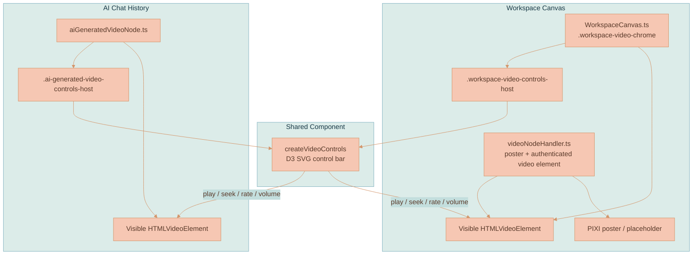

# Video Player Controls

Lixpi uses **one shared SVG video control bar** for generated and saved videos. The control bar is a framework-agnostic D3 primitive in [`services/web-ui/src/components/videoControls/`](../../services/web-ui/src/components/videoControls/videoControls.ts), mounted in two places:

- below canvas `VideoCanvasNode`s in the transformed workspace chrome layer
- below in-chat generated video nodes in the ProseMirror AI chat history

The bar controls an `HTMLVideoElement`; **it does not render video frames**. The host surface owns pixels. On the canvas, PIXI owns the poster/placeholder behind the node and the browser-composited `<video>` element owns completed playback. In chat, the same component controls the visible DOM `<video>`.

For video generation, storage, VEO polling, and branch lineage, see [Video Generation](./VIDEO-GENERATION.md). For canvas renderer ownership (the PIXI media layer and the DOM chrome split), see [Rendering Engine](../canvas/RENDERING-ENGINE.md).

## Core Concepts

**Shared SVG Control Bar** — `createVideoControls(parent, config)` appends an SVG `<g>` into a D3 selection and returns `{ render, resize, destroy }`. It follows the same framework-agnostic pattern as `slidingSwitch.ts` and `toggleSwitch.ts`.

**Single Source of Truth** — The supplied `HTMLVideoElement` is the state authority. The control bar reads media events and writes element properties such as `currentTime`, `playbackRate`, `volume`, and `muted`.

**Two Mount Points** — `WorkspaceCanvas.ts` mounts the bar in `.workspace-video-controls-host` for canvas videos. `aiGeneratedVideoNode.ts` mounts the same bar in `.ai-generated-video-controls-host` for chat-history videos.

**Browser-Composited Canvas Playback** — The canvas does not sample a live video texture into PIXI. `videoNodeHandler.ts` creates the authenticated video element and loads the PIXI poster. `WorkspaceCanvas.ts` moves that same element into `.workspace-video-chrome`, above the poster, so browser playback, seeking, and fullscreen work normally. Canvas controls render as a separate row below the video surface, not over the video pixels.

**Ephemeral Playback State** — Playback position, speed, volume, fullscreen, and scrubbing state are **not** persisted to `canvasState`.

## Control Set

| Control | Behavior |
|---------|----------|
| Play / pause | Calls `videoEl.play()` or `videoEl.pause()` and reflects `play` / `pause` events |
| Current time / duration | Renders `m:ss`; duration stays `0:00` until metadata is loaded |
| Scrubber | Shows buffered and played ranges; dragging seeks the element |
| Playback speed | Speed value plus continuous slider writes `playbackRate`; double-click resets to the configured default rate, and configured guide ticks are visual references only |
| Volume / mute | Toggles `muted`; slider writes `volume` and reflects `volumechange` |
| Fullscreen | Uses `requestFullscreen()` / `exitFullscreen()` when supported |

The layout is responsive. Controls stay present while the seek, speed, and volume rails absorb tight widths by shrinking.

## Component API

```typescript
export type VideoControlsConfig = {
    id: string
    x: number
    y: number
    width: number
    height?: number
    responsiveWidth?: number
    videoEl: HTMLVideoElement
    className?: string
}

export type VideoControlsInstance = {
    render: () => void
    resize: (x: number, y: number, width: number, responsiveWidth?: number) => void
    destroy: () => void
}
```

`render()` re-syncs SVG state from the element. `resize()` updates bar geometry after canvas node resize or chat player resize. `responsiveWidth` lets hosts scale the SVG viewBox for canvas zoom or chat sizing while keeping responsive sizing decisions tied to the visible row width. `destroy()` removes SVG nodes, media listeners, document listeners, pointer listeners, and in-flight scrub handlers.

Player behavior, geometry, speed range, default rate, center guide rate, rendered guide rates, responsive thresholds, canvas zoom scaling, chat scale, glass treatment, colors, line styles, shadows, and typography live in `settings.videoControls` in [`services/web-ui/src/settings.ts`](../../services/web-ui/src/settings.ts). The `speed.defaultRate` value is used by double-click reset. The `speed.guideRate` value is the midpoint of the slider curve, while `speed.guideRates` controls the rendered reference ticks. Pointer and keyboard changes remain continuous across the configured `minRate`-to-`maxRate` range.

## System Architecture



## Canvas Playback Flow

`videoNodeHandler.ts` creates one `<video preload="metadata" playsinline crossorigin="anonymous">` per `VideoCanvasNode`, loads authenticated `/api/videos` URLs, applies the poster URL, and keeps intrinsic video dimensions available to the canvas. The element begins in `.workspace-hidden-video-host`.

When the video node is playable, `WorkspaceCanvas.ts` creates `.workspace-video-chrome`, moves that same element into `.workspace-video-surface`, and mounts `createVideoControls(...)` in a sibling `.workspace-video-controls-host` row below the surface. The canvas control row is always visible and uses bounded zoom scaling from `settings.videoControls`.

The chrome mirrors normal node interactions:

- double-clicking the surface toggles playback
- pointer down on the video surface starts node drag or corner resize
- pointer events on actual control hit areas are isolated from drag, resize, selection, and playback toggles, while empty strip space still passes canvas pan/zoom gestures through
- generated-media provider/info chrome is projected below the external control row for video nodes


This is why the video element must be **visibly composited**. Browser playback and native APIs are reliable only when the real element is rendered; a hidden element sampled into a PIXI texture can be throttled or blank, and a PIXI video-frame loop caused connector lines to disappear during playback. The full renderer-ownership rationale lives in [Rendering Engine](../canvas/RENDERING-ENGINE.md).


## Chat Playback Flow

`aiGeneratedVideoNode.ts` keeps its pending, keepalive, complete, and error states (see [Video Generation](./VIDEO-GENERATION.md) for the lifecycle that drives them). On completion it renders a native-controls-disabled `<video>`, mounts the same `createVideoControls(...)` bar as a sibling row below the video surface, and renders the shared generated-media provider badge below the controls. The canvas info button is not mounted in chat. A `ResizeObserver` keeps the SVG `viewBox` and control geometry in sync with the chat card width.

The chat video has **no PIXI involvement**. The same component still works because all state lives on the supplied `HTMLVideoElement`.

## Scrubbing Behavior

Scrubbing is designed to keep paused frames responsive:

1. Pointer down on the scrubber records whether playback was active.
2. If the video was playing, the control pauses it for the drag.
3. Drag movement updates a preview time and queues `videoEl.currentTime`.
4. Only one seek is kept in flight; later drag targets are applied after the current seek settles.
5. `seeked` / `loadeddata` or a short failsafe timer advances the queue.
6. On release, the final target is applied and playback resumes only if the video had been playing before the drag.

This avoids piling many seeks onto short VEO clips while still making paused scrubbing feel immediate.

## Accessibility and Capability Handling

Buttons are SVG groups with `role="button"`, `tabindex="0"`, and `aria-label`s. Enter and Space activate button controls. The speed control is an SVG slider with `role="slider"`, `aria-valuemin`, `aria-valuemax`, `aria-valuenow`, and `aria-valuetext`; arrow keys adjust by the configured keyboard step, while Home and End jump to the configured range bounds.

Fullscreen controls are gated by browser support:

- fullscreen requires `videoEl.requestFullscreen` and `document.exitFullscreen`

If fullscreen support is missing, the fullscreen action returns without changing layout. Failures from `play()`, fullscreen, or resume-after-scrub are logged as warnings without breaking the rest of the bar.

## Styling

The component inlines SVG attributes rather than relying on global CSS, matching the existing D3 control primitives. It uses a liquid-glass rounded bar, white glyphs, subtle hover fills, buffered and played rails, continuous speed and volume rails, speed value text, a volume glyph, configured speed guide marks, and settings-driven host backdrop filtering. The host elements apply the same glass pattern as the AI Chat panel: translucent fill, blur/saturation backdrop filtering, an inner highlight, and a reduced-transparency fallback.

Canvas visibility and positioning are controlled by host elements:

| Host | Purpose |
|------|---------|
| `.workspace-video-chrome` | Transform-synced video chrome containing the visible video surface plus the external controls row |
| `.workspace-video-surface` | Holds the visible canvas `<video>` element |
| `.workspace-video-controls-host` | Mounts the canvas SVG bar below the video surface; individual control hit areas isolate their own events while empty strip space stays available to canvas gestures |
| `.ai-generated-video-controls-host` | Mounts the in-chat SVG bar |
| `.ai-generated-media-model-chrome` | Holds the in-chat generated-media provider badge below the controls or image |

## Data, Storage, and Transport

Video controls add **no** persisted data model, NATS subject, API route, Object Store object, or LangGraph state. They operate entirely on an already-loaded `HTMLVideoElement`.

`VideoCanvasNode` remains the persisted canvas data for videos (defined in the canvas data model — see [Workspace Model](../canvas/WORKSPACE-MODEL.md) and the field table in [Video Generation](./VIDEO-GENERATION.md)). Playback UI state is deliberately ephemeral.

## Implementation Map

| Area | File |
|------|------|
| Shared control component | [videoControls.ts](../../services/web-ui/src/components/videoControls/videoControls.ts) |
| Component barrel | [index.ts](../../services/web-ui/src/components/videoControls/index.ts) |
| SVG glyphs | [svgIcons/index.ts](../../services/web-ui/src/svgIcons/index.ts) |
| Canvas video element + poster handler | [videoNodeHandler.ts](../../services/web-ui/src/infographics/workspace/rendering/videoNodeHandler.ts) |
| Canvas chrome mount | [WorkspaceCanvas.ts](../../services/web-ui/src/infographics/workspace/WorkspaceCanvas.ts) |
| In-chat video mount | [aiGeneratedVideoNode.ts](../../services/web-ui/src/components/proseMirror/plugins/aiChatThreadPlugin/aiGeneratedVideoNode.ts) |
| Control tests | [videoControls.test.ts](../../services/web-ui/src/components/videoControls/videoControls.test.ts) |
| Canvas source-shape coverage | [workspace-canvas.test.ts](../../services/web-ui/src/infographics/workspace/workspace-canvas.test.ts) |
| Local canvas README | [README.md](../../services/web-ui/src/infographics/workspace/README.md) |

## Related Pages

- [Video Generation](./VIDEO-GENERATION.md) — generated video lifecycle and the playback surface this bar controls.
- [Rendering Engine](../canvas/RENDERING-ENGINE.md) — the DOM/PIXI renderer-ownership split behind the visible video element.
- [Workspace Model](../canvas/WORKSPACE-MODEL.md) — the `VideoCanvasNode` canvas data model.
- [Media Library](../library/MEDIA-LIBRARY.md) — saved videos and materialization back to the canvas.
